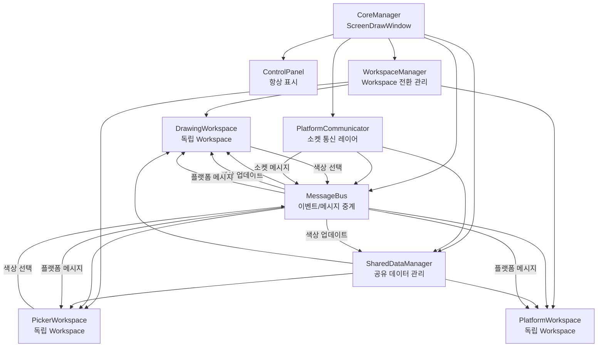

# 독립 Workspace 구조 + 메시지 시스템 설계

## 핵심 요구사항 정리

### 1. 독립성 + 공유성

-   각 Workspace는 독립적으로 작동
-   동시에 기능을 공유할 수 있어야 함
-   예: 컬러 픽커 색상 → 드로잉 색상으로 자동 전달

### 2. 활용 시나리오

-   일정 관리 시 드로잉 사용
-   캡처하여 개발일지에 넣기
-   독립 사용 + 혼합 사용 모두 지원

### 3. 메시지 전파

-   중앙 Workspace 전환 관리
-   백그라운드 메시지를 모든 Workspace에서 수신 가능
-   Workspace 간 직접 통신 + 중앙 메시지 버스

### 4. 데이터 공유

-   Workspace 간 자체 공유
-   웹 플랫폼과 소켓 통신이 최종 중계자
-   드로잉도 웹 플랫폼과 연결되어 주고받기

## 새로운 아키텍처

### 전체 구조 다이어그램



### 핵심 컴포넌트

#### 1. MessageBus (이벤트 버스)

**파일**: `modules/message_bus.py`**역할**:

-   Workspace 간 메시지 전파
-   플랫폼 메시지 중계
-   이벤트 구독/발행 패턴

**주요 메시지 타입**:

-   `COLOR_SELECTED`: 색상 선택 (픽커 → 드로잉)
-   `DRAWING_CAPTURED`: 드로잉 캡처 완료
-   `PLATFORM_MESSAGE`: 플랫폼에서 온 메시지
-   `WORKSPACE_CHANGED`: Workspace 전환 알림

#### 2. SharedDataManager (공유 데이터 관리자)

**파일**: `modules/shared_data_manager.py`**역할**:

-   Workspace 간 공유 데이터 관리
-   색상, 설정, 상태 등
-   플랫폼과 동기화

**공유 데이터**:

-   `current_color`: 현재 선택된 색상
-   `drawing_paths`: 드로잉 경로 (플랫폼 동기화용)
-   `settings`: 공통 설정
-   `platform_state`: 플랫폼 연결 상태

#### 3. PlatformCommunicator (플랫폼 통신 레이어)

**파일**: `modules/platform_communicator.py` (기존 확장)**역할**:

-   웹소켓/HTTP 통신
-   메시지 버스를 통한 메시지 전파
-   SharedData와 동기화

**통신 프로토콜**:

-   드로잉 데이터 전송
-   색상 정보 동기화
-   일정 관리 데이터 교환
-   개발일지 캡처 전송

## 구현 단계

### Phase 1: 메시지 시스템 기반 구축

#### 1.1 MessageBus 구현

**파일**: `modules/message_bus.py`

```python
class MessageBus:
    """이벤트 버스 - Workspace 간 메시지 전파"""

    def __init__(self):
        self.subscribers = {}  # {message_type: [callbacks]}

    def subscribe(self, message_type: str, callback):
        """메시지 구독"""
        pass

    def publish(self, message_type: str, data: dict):
        """메시지 발행"""
        pass
```

**메시지 타입 정의**:

-   `COLOR_SELECTED`: `{"color": QColor, "source": "picker|preset|dialog"}`
-   `DRAWING_CAPTURED`: `{"pixmap": QPixmap, "mode": "drawing_area|screen"}`
-   `PLATFORM_MESSAGE`: `{"type": str, "data": dict}`
-   `WORKSPACE_CHANGED`: `{"old_workspace": str, "new_workspace": str}`

#### 1.2 SharedDataManager 구현

**파일**: `modules/shared_data_manager.py`

```python
class SharedDataManager:
    """공유 데이터 관리자"""

    def __init__(self, message_bus):
        self.message_bus = message_bus
        self.current_color = QColor(255, 0, 0)
        self.drawing_paths = []
        self.settings = {}

        # 색상 변경 시 메시지 발행
        self.message_bus.subscribe("COLOR_SELECTED", self._on_color_selected)

    def set_color(self, color: QColor, source: str):
        """색상 설정 및 메시지 발행"""
        self.current_color = color
        self.message_bus.publish("COLOR_SELECTED", {
            "color": color,
            "source": source
        })
```

### Phase 2: Workspace 관리자 + BaseWorkspace 업데이트

#### 2.1 WorkspaceManager에 MessageBus 통합

**파일**: `modules/workspace_manager.py`

```python
class WorkspaceManager:
    def __init__(self, parent_window, message_bus, shared_data):
        self.message_bus = message_bus
        self.shared_data = shared_data
        # Workspace 전환 시 메시지 발행
        self.message_bus.publish("WORKSPACE_CHANGED", {...})
```

#### 2.2 BaseWorkspace에 MessageBus 통합

**파일**: `modules/base_workspace.py`

```python
class BaseWorkspace(QWidget):
    def __init__(self, parent_window, message_bus, shared_data):
        self.message_bus = message_bus
        self.shared_data = shared_data

        # 필요한 메시지 구독
        self.message_bus.subscribe("COLOR_SELECTED", self._on_color_selected)

    def _on_color_selected(self, data):
        """색상 선택 메시지 처리"""
        pass
```

### Phase 3: 드로잉 Workspace 구현 (MessageBus 통합)

#### 3.1 DrawingWorkspace 생성

**파일**: `modules/drawing_workspace.py`**MessageBus 통합**:

-   `COLOR_SELECTED` 구독 → 드로잉 색상 업데이트
-   `DRAWING_CAPTURED` 발행 → 캡처 완료 알림
-   `PLATFORM_MESSAGE` 구독 → 플랫폼에서 드로잉 명령 수신

**SharedData 통합**:

-   `shared_data.current_color` 사용
-   `shared_data.drawing_paths` 동기화

#### 3.2 드로잉 데이터 플랫폼 전송

-   드로잉 완료 시 `PlatformCommunicator`를 통해 전송
-   플랫폼에서 수정된 드로잉 데이터 수신 시 업데이트

### Phase 4: 픽커 Workspace 구현 (MessageBus 통합)

#### 4.1 PickerWorkspace 생성

**파일**: `modules/picker_workspace.py`**MessageBus 통합**:

-   색상 선택 시 `COLOR_SELECTED` 발행
-   `PLATFORM_MESSAGE` 구독 → 플랫폼에서 색상 요청 수신

**SharedData 통합**:

-   선택한 색상을 `shared_data.current_color`에 저장
-   MessageBus를 통해 자동 전파

### Phase 5: 플랫폼 Workspace 구현

#### 5.1 PlatformWorkspace 생성

**파일**: `modules/platform_workspace.py`**기능**:

-   웹뷰 패널
-   플랫폼 UI 표시
-   플랫폼과의 양방향 통신

**MessageBus 통합**:

-   플랫폼에서 온 메시지를 `PLATFORM_MESSAGE`로 발행
-   다른 Workspace의 메시지를 플랫폼으로 전송

#### 5.2 PlatformCommunicator 확장

**파일**: `modules/platform_communicator.py`**기존 기능 유지** + **추가 기능**:

-   웹소켓 연결 관리
-   메시지 버스를 통한 메시지 전파
-   SharedData와 동기화

```python
class PlatformCommunicator:
    def __init__(self, message_bus, shared_data):
        self.message_bus = message_bus
        self.shared_data = shared_data

        # 플랫폼 메시지 수신 시 발행
        self.message_bus.subscribe("PLATFORM_MESSAGE", self._send_to_platform)

    def _on_platform_message(self, message):
        """플랫폼에서 메시지 수신"""
        self.message_bus.publish("PLATFORM_MESSAGE", message)
```

### Phase 6: 컨트롤 패널 업데이트

#### 6.1 메인 메뉴 버튼

-   "Drawing", "Picker", "Platform" 버튼
-   현재 활성 Workspace 표시
-   WorkspaceManager와 연결

#### 6.2 공유 기능 버튼

-   색상 선택 (모든 Workspace에서 공통)
-   설정 (모든 Workspace에서 공통)
-   플랫폼 연결 상태 표시

### Phase 7: 통합 및 테스트

#### 7.1 메시지 흐름 테스트

1. 픽커에서 색상 선택 → 드로잉 색상 자동 업데이트
2. 드로잉 캡처 → 플랫폼으로 전송
3. 플랫폼에서 메시지 → 모든 Workspace에서 수신

#### 7.2 플랫폼 통신 테스트

1. 드로잉 데이터 플랫폼 전송
2. 플랫폼에서 드로잉 수정 → 로컬 동기화
3. 일정 관리 데이터 교환

## 데이터 흐름 예시

### 시나리오 1: 픽커 색상 → 드로잉 색상

```javascript
PickerWorkspace (색상 선택)
    ↓
SharedDataManager.set_color()
    ↓
MessageBus.publish("COLOR_SELECTED")
    ↓
DrawingWorkspace (구독 중) → 색상 업데이트
PlatformCommunicator (구독 중) → 플랫폼 동기화
```

### 시나리오 2: 드로잉 캡처 → 플랫폼 전송

```javascript
DrawingWorkspace (캡처 완료)
    ↓
MessageBus.publish("DRAWING_CAPTURED")
    ↓
PlatformCommunicator (구독 중) → 플랫폼 전송
PlatformWorkspace (구독 중) → UI 업데이트
```

### 시나리오 3: 플랫폼 메시지 → 모든 Workspace

```javascript
PlatformCommunicator (플랫폼 메시지 수신)
    ↓
MessageBus.publish("PLATFORM_MESSAGE")
    ↓
DrawingWorkspace (구독 중) → 드로잉 업데이트
PickerWorkspace (구독 중) → 색상 업데이트
PlatformWorkspace (구독 중) → UI 업데이트
```

## 파일 구조

### 새로 생성할 파일

1. `modules/message_bus.py` - 이벤트 버스
2. `modules/shared_data_manager.py` - 공유 데이터 관리
3. `modules/workspace_manager.py` - Workspace 전환 관리
4. `modules/base_workspace.py` - Workspace 기본 클래스
5. `modules/drawing_workspace.py` - 드로잉 Workspace
6. `modules/picker_workspace.py` - 픽커 Workspace
7. `modules/platform_workspace.py` - 플랫폼 Workspace

### 수정할 파일

1. `ScreenDraw.py` - 메시지 시스템 초기화, Workspace 관리자 통합
2. `modules/platform_communicator.py` - 메시지 버스 통합, 소켓 통신 확장
