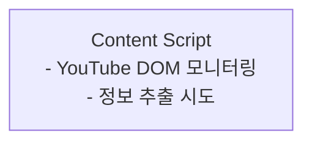
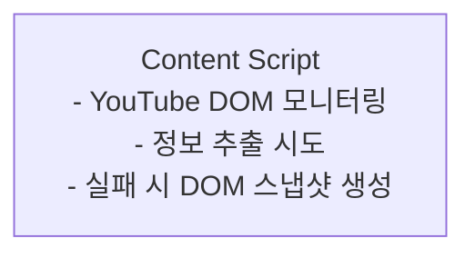
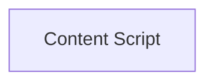
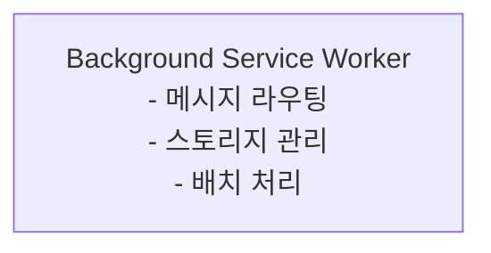
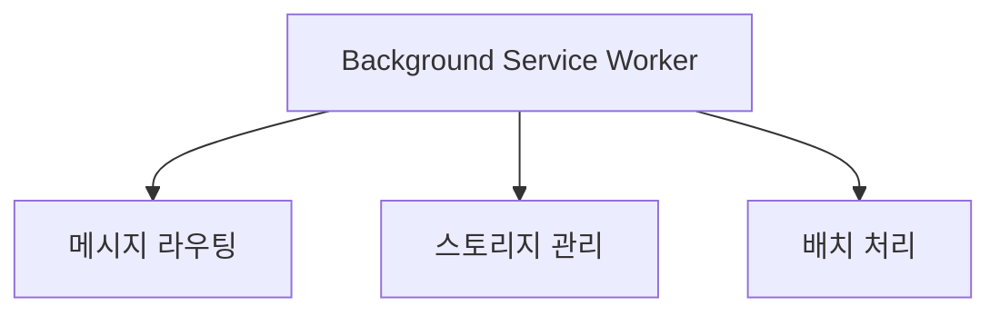
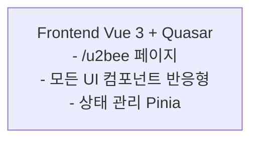
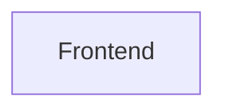
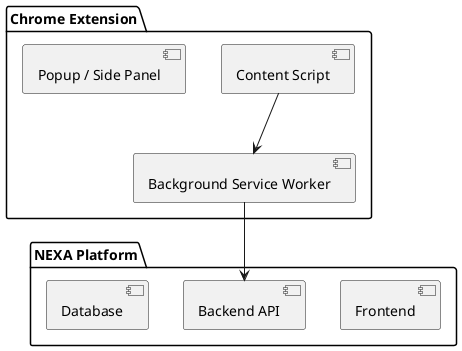
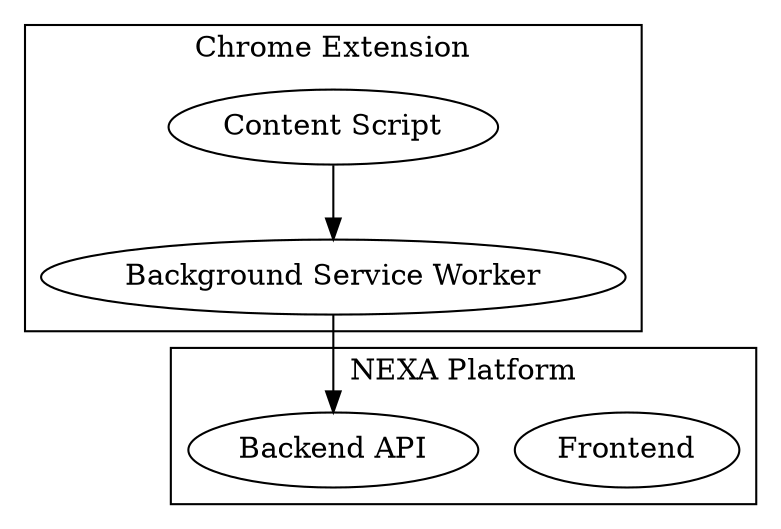

# Mermaid 다이어그램 문제점 및 해결방안

**작성일**: 2024년 12월  
**목적**: 문서에서 사용하는 Mermaid 다이어그램의 문제점 분석 및 해결방안 제시

---

## 목차

1. [현재 발견된 문제점](#현재-발견된-문제점)
2. [즉시 적용 가능한 해결방안](#즉시-적용-가능한-해결방안)
3. [향후 뷰어 개선 사항](#향후-뷰어-개선-사항)
4. [대안 다이어그램 도구 검토](#대안-다이어그램-도구-검토)

---

## 현재 발견된 문제점

### 1. 라벨의 `<br>` 태그 미지원

**문제:**

-   Mermaid 다이어그램에서 노드 라벨에 `<br>` 또는 `<br/>` 태그를 사용해도 일부 렌더러에서 줄바꿈이 되지 않음
-   특히 긴 설명을 여러 줄로 나누려 할 때 작동하지 않음

**예시:**



**영향:**

-   라벨이 한 줄로 표시되어 가독성 저하
-   긴 텍스트가 노드 밖으로 넘어가거나 잘림

---

### 2. 노드 가로 크기 제한

**문제:**

-   Mermaid는 노드의 가로 크기를 자동으로 조정하지만, 최대 너비 제한이 있음
-   긴 라벨이 노드 안에서 잘리거나 텍스트가 노드 밖으로 넘어감
-   노드의 최소/최대 너비를 직접 제어하기 어려움

**영향:**

-   중요한 정보가 잘려서 보이지 않음
-   다이어그램의 가독성 저하

---

### 3. 그룹(Subgraph) 스타일 개별 설정 제한

**문제:**

-   현재는 모든 subgraph에 동일한 스타일을 적용해야 함
-   각 그룹별로 다른 배경색, 테두리 색상 등을 설정하기 어려움
-   투명도 설정은 가능하지만, 그룹별로 다른 스타일 적용이 제한적

**현재 해결책:**

```mermaid
classDef subgraphStyle fill:transparent,stroke:#333,stroke-width:2px
class Extension,Platform,Desktop subgraphStyle
```

**영향:**

-   모든 그룹이 동일한 스타일로 표시되어 시각적 구분이 어려움
-   복잡한 아키텍처 다이어그램에서 그룹별 색상 구분이 필요할 때 제약

---

### 4. 긴 텍스트 처리의 한계

**문제:**

-   노드 라벨에 긴 설명을 넣으면 자동으로 잘리거나 레이아웃이 깨짐
-   여러 항목을 나열할 때 가독성이 떨어짐

**영향:**

-   상세한 설명을 다이어그램에 포함하기 어려움
-   다이어그램과 별도로 설명을 작성해야 함

---

### 5. 노드 간 간격 제어 불가

**문제:**

-   Mermaid는 자동 레이아웃을 사용하므로 노드 간 간격을 직접 제어할 수 없음
-   특히 상하 간격이 과도하게 커서 다이어그램의 세로 길이가 불필요하게 길어짐
-   좌우 간격도 자동으로 설정되어 조정 불가
-   노드 간 간격을 줄이면 스크롤 길이를 줄일 수 있지만 현재는 불가능

**영향:**

-   다이어그램이 세로로 길어져 스크롤 길이가 증가
-   한 화면에 보이는 정보량이 줄어듦
-   문서 가독성 저하
-   특히 복잡한 아키텍처 다이어그램에서 문제가 심각함

**현재 상황:**

-   Mermaid 기본 설정으로는 간격 조정 불가
-   CSS로도 레이아웃 엔진이 결정한 간격을 크게 변경하기 어려움

---

## 즉시 적용 가능한 해결방안

### 1. 라벨 단순화 및 설명 분리

**방법:**

-   다이어그램의 노드 라벨은 간단하게 유지
-   상세 설명은 다이어그램 아래에 텍스트로 추가

**예시:**

**변경 전:**



**변경 후:**



**다이어그램 아래 설명 추가:**

-   **Content Script**: YouTube DOM 모니터링, 정보 추출 시도, 실패 시 DOM 스냅샷 생성

**장점:**

-   다이어그램이 깔끔하고 읽기 쉬움
-   상세 설명을 충분히 제공 가능
-   모든 렌더러에서 정상 작동

---

### 2. 노드 분리

**방법:**

-   하나의 복잡한 노드를 여러 개의 간단한 노드로 분리
-   관계를 명확히 표현

**예시:**

**변경 전:**



**변경 후:**



---

### 3. 짧은 키워드 사용

**방법:**

-   긴 설명 대신 핵심 키워드만 사용
-   설명은 별도 텍스트로 제공

**예시:**

**변경 전:**



**변경 후:**



**설명:**

-   **Frontend**: Vue 3 + Quasar, /u2bee 페이지, 모든 UI 컴포넌트 (반응형), 상태 관리 (Pinia)

---

## 향후 뷰어 개선 사항

### 1. 그룹(Subgraph) 스타일 개별 설정

**필요 기능:**

-   각 subgraph별로 배경색, 테두리 색상, 투명도 등을 개별 설정 가능
-   그룹별로 다른 시각적 스타일 적용

**구현 예시:**

```javascript
// 뷰어에서 Mermaid 렌더링 시
const subgraphStyles = {
    Extension: {
        fill: "#e3f2fd",
        stroke: "#1976d2",
        strokeWidth: 2,
    },
    Platform: {
        fill: "#e8f5e9",
        stroke: "#388e3c",
        strokeWidth: 2,
    },
    Desktop: {
        fill: "#fff3e0",
        stroke: "#f57c00",
        strokeWidth: 2,
    },
};
```

**장점:**

-   그룹별 시각적 구분이 명확해짐
-   복잡한 아키텍처 다이어그램에서 구조 파악이 쉬워짐

---

### 2. 노드 크기 제어

**필요 기능:**

-   노드의 최소/최대 너비 설정 가능
-   긴 라벨 자동 줄바꿈 개선
-   노드 높이 자동 조정

**구현 예시:**

```javascript
// 노드 스타일 설정
const nodeStyles = {
    minWidth: 120,
    maxWidth: 300,
    autoWrap: true,
    padding: 10,
};
```

**장점:**

-   긴 텍스트도 잘리지 않고 표시
-   다이어그램 레이아웃 안정성 향상

---

### 3. 라벨 렌더링 개선

**필요 기능:**

-   HTML 태그 지원 (`<br>`, `<b>`, `<i>`, `<u>` 등)
-   마크다운 스타일 지원
-   폰트 크기 조정 가능
-   텍스트 정렬 옵션

**구현 예시:**

```javascript
// 라벨 렌더링 옵션
const labelOptions = {
    supportHTML: true,
    supportMarkdown: true,
    fontSize: 14,
    lineHeight: 1.5,
    textAlign: "center",
};
```

**장점:**

-   라벨에 다양한 스타일 적용 가능
-   가독성 향상

---

### 4. 인터랙티브 기능

**필요 기능:**

-   노드 클릭 시 상세 정보 표시 (툴팁 또는 모달)
-   노드 확대/축소 기능
-   다이어그램 줌 인/아웃

**구현 예시:**

```javascript
// 인터랙티브 기능
const interactiveFeatures = {
    tooltip: true,
    clickToExpand: true,
    zoom: true,
    pan: true,
};
```

**장점:**

-   다이어그램을 간단하게 유지하면서 상세 정보 제공 가능
-   사용자 경험 향상

---

### 5. 커스텀 스타일 시트 지원

**필요 기능:**

-   Mermaid 다이어그램에 커스텀 CSS 적용 가능
-   테마 시스템 지원

**구현 예시:**

```css
/* 커스텀 스타일 */
.mermaid .node {
    min-width: 150px;
    padding: 12px;
}

.mermaid .subgraph {
    border-radius: 8px;
}

.mermaid .label {
    font-size: 13px;
    line-height: 1.6;
}
```

---

### 6. 노드 간 간격 제어

**필요 기능:**

-   노드 간 상하 간격 조정 가능 (기본값보다 줄이기)
-   노드 간 좌우 간격 조정 가능
-   레벨(rank) 간 간격 조정 가능
-   서브그래프 내부 간격 조정 가능
-   스크롤 길이 최소화를 위한 간격 최적화

**구현 예시:**

```javascript
// 노드 간격 제어 옵션
const spacingOptions = {
    // 노드 간 간격
    nodeSpacing: {
        horizontal: 30, // 좌우 간격 (기본값보다 작게)
        vertical: 40, // 상하 간격 (기본값보다 작게)
    },

    // 레벨 간 간격 (상하 방향)
    rankSpacing: 50, // 기본값보다 작게 설정

    // 서브그래프 간격
    subgraphSpacing: {
        horizontal: 40,
        vertical: 60,
    },

    // 엣지(화살표) 최소 길이
    minEdgeLength: 30,

    // 컴팩트 모드 (간격 최소화)
    compactMode: true,
};

// Mermaid 파싱 후 커스텀 렌더링
function renderWithCustomSpacing(mermaidCode, spacingOptions) {
    // 1. Mermaid 파싱
    const parsed = mermaid.parse(mermaidCode);

    // 2. 노드 위치 재계산 (간격 적용)
    const positionedNodes = calculateNodePositions(parsed.nodes, parsed.edges, spacingOptions);

    // 3. 엣지 경로 재계산
    const adjustedEdges = recalculateEdges(parsed.edges, positionedNodes);

    // 4. SVG 렌더링
    return renderToSVG(positionedNodes, adjustedEdges);
}
```

**DOM 조작 방식 (간단한 접근):**

```javascript
// Mermaid 렌더링 후 DOM 조작으로 간격 조정
function adjustMermaidSpacing(diagramElement, options) {
    const {
        nodeSpacing = 30, // 노드 간 최소 간격 (기본값보다 작게)
        rankSpacing = 50, // 레벨 간 간격 (기본값보다 작게)
        subgraphPadding = 15, // 서브그래프 내부 패딩
    } = options;

    const svg = diagramElement.querySelector("svg");
    if (!svg) return;

    // 노드 위치 조정
    const nodes = Array.from(svg.querySelectorAll(".node"));
    const nodeGroups = groupNodesByRank(nodes);

    nodeGroups.forEach((rankNodes, rankIndex) => {
        rankNodes.forEach((node, nodeIndex) => {
            const transform = node.getAttribute("transform");
            const match = transform.match(/translate\(([^,]+),([^)]+)\)/);

            if (match) {
                const x = parseFloat(match[1]) + nodeIndex * nodeSpacing;
                const y = parseFloat(match[2]) + rankIndex * rankSpacing;
                node.setAttribute("transform", `translate(${x},${y})`);
            }
        });
    });

    // 엣지 경로 재계산
    const edges = svg.querySelectorAll(".edgePath");
    edges.forEach((edge) => {
        const path = edge.querySelector("path");
        if (path) {
            // 시작점과 끝점 노드 위치 기반으로 경로 재계산
            const startNode = getStartNode(edge);
            const endNode = getEndNode(edge);
            const newPath = calculatePath(startNode, endNode);
            path.setAttribute("d", newPath);
        }
    });

    // SVG 크기 조정
    const bbox = svg.getBBox();
    svg.setAttribute("viewBox", `${bbox.x} ${bbox.y} ${bbox.width} ${bbox.height}`);
    svg.setAttribute("width", bbox.width);
    svg.setAttribute("height", bbox.height);
}
```

**장점:**

-   스크롤 길이 최소화로 한 화면에 더 많은 정보 표시
-   다이어그램의 공간 효율성 향상
-   문서 가독성 개선
-   사용자 경험 향상

**구현 고려사항:**

-   Mermaid 파싱 후 커스텀 렌더링이 가장 확실한 방법
-   DOM 조작 방식은 간단하지만 엣지 경로 재계산이 복잡할 수 있음
-   레이아웃 알고리즘을 완전히 제어하려면 커스텀 렌더러 구현 필요

---

## 대안 다이어그램 도구 검토

### 1. PlantUML

**장점:**

-   텍스트 기반으로 작성 가능
-   복잡한 다이어그램 표현력이 뛰어남
-   다양한 다이어그램 타입 지원 (시퀀스, 클래스, 컴포넌트 등)

**단점:**

-   별도 렌더링 엔진 필요
-   Mermaid보다 설정이 복잡함

**사용 예시:**



---

### 2. Graphviz (DOT)

**장점:**

-   매우 강력한 레이아웃 엔진
-   노드 크기, 위치 등을 세밀하게 제어 가능
-   복잡한 그래프 표현에 적합

**단점:**

-   문법이 복잡함
-   실시간 미리보기가 어려움

**사용 예시:**



---

### 3. Draw.io (diagrams.net)

**장점:**

-   시각적 편집기 제공
-   매우 유연한 레이아웃 제어
-   다양한 템플릿 제공

**단점:**

-   텍스트 기반이 아님
-   버전 관리가 어려움
-   자동 레이아웃이 제한적

---

### 4. Mermaid 개선 방향

**현재 Mermaid의 장점:**

-   마크다운과 통합이 쉬움
-   텍스트 기반으로 버전 관리 용이
-   많은 마크다운 뷰어에서 지원

**개선 제안:**

-   커스텀 스타일 지원 강화
-   노드 크기 제어 기능 추가
-   HTML 태그 지원 개선
-   그룹별 스타일 설정 기능 추가

---

## 권장 사항

### 단기 (즉시 적용)

1. ✅ **라벨 단순화**: 다이어그램의 노드 라벨을 짧게 유지
2. ✅ **설명 분리**: 상세 설명은 다이어그램 아래 텍스트로 추가
3. ✅ **키워드 중심**: 핵심 키워드만 다이어그램에 포함

### 중기 (뷰어 개선)

1. 🔄 **그룹 스타일 개별 설정**: 각 subgraph별로 다른 스타일 적용 가능
2. 🔄 **노드 크기 제어**: 최소/최대 너비 설정 및 자동 줄바꿈 개선
3. 🔄 **라벨 렌더링 개선**: HTML 태그 및 마크다운 지원
4. 🔄 **노드 간 간격 제어**: 상하/좌우 간격 조정으로 스크롤 길이 최소화

### 장기 (대안 검토)

1. 📋 **PlantUML 검토**: 복잡한 다이어그램이 필요한 경우
2. 📋 **Graphviz 검토**: 매우 세밀한 레이아웃 제어가 필요한 경우
3. 📋 **하이브리드 접근**: 간단한 다이어그램은 Mermaid, 복잡한 것은 다른 도구 사용

---

## 참고 자료

-   [Mermaid 공식 문서](https://mermaid.js.org/)
-   [Mermaid GitHub Issues](https://github.com/mermaid-js/mermaid/issues)
-   [PlantUML 공식 문서](https://plantuml.com/)
-   [Graphviz 공식 문서](https://graphviz.org/)

---

**마지막 업데이트**: 2024년 12월
