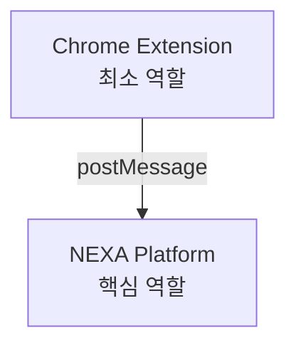
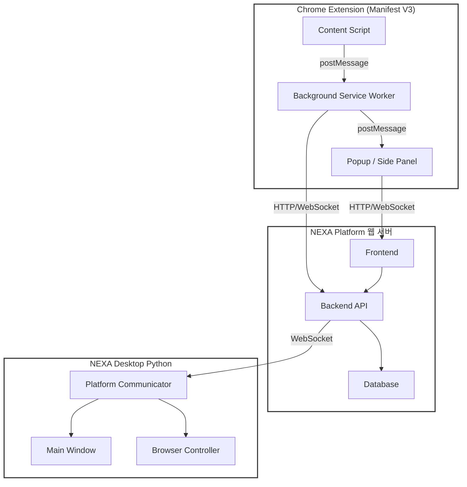
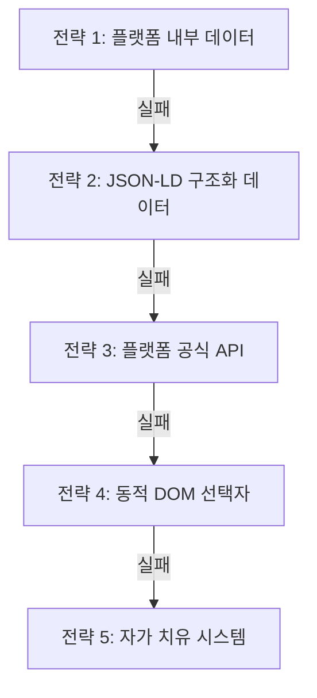
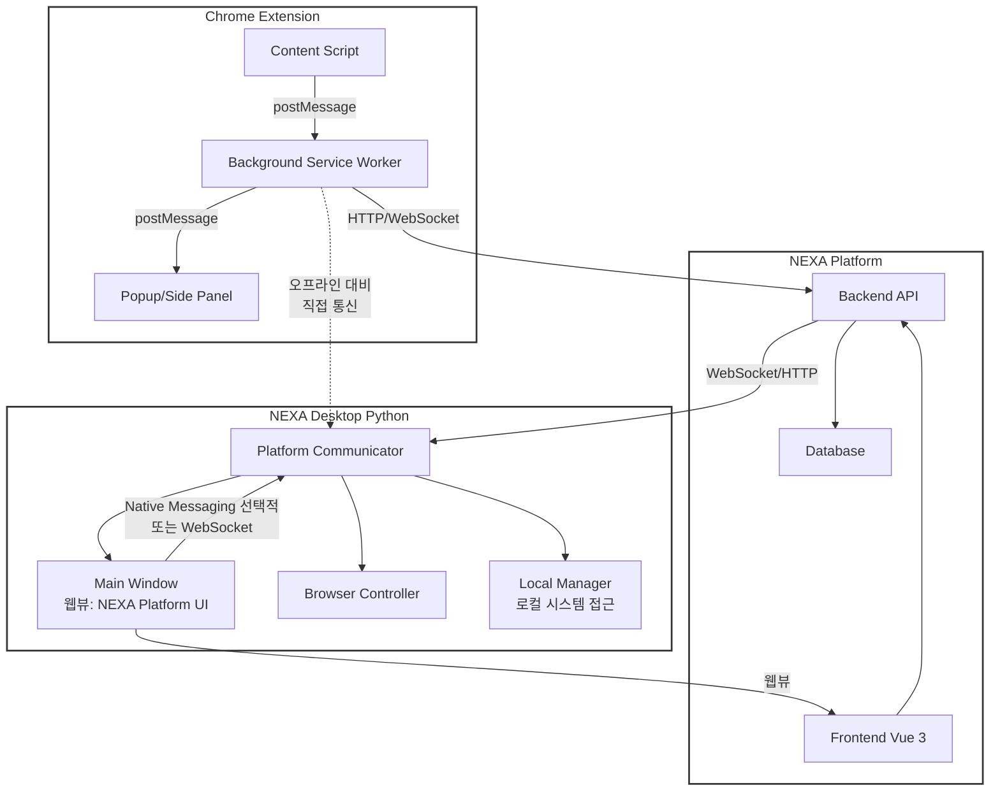
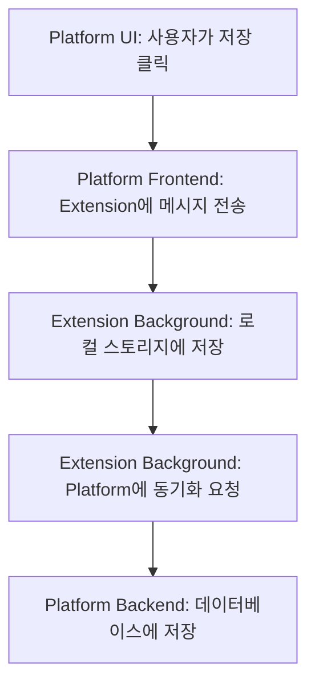
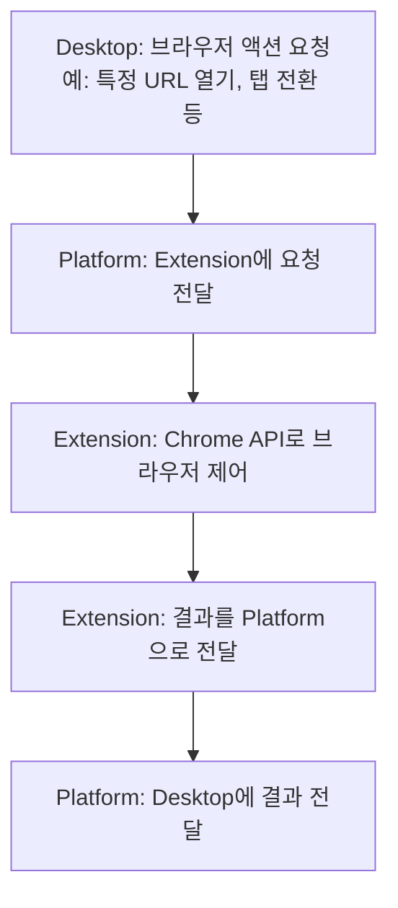
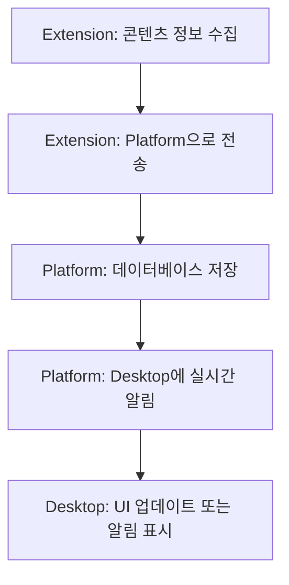
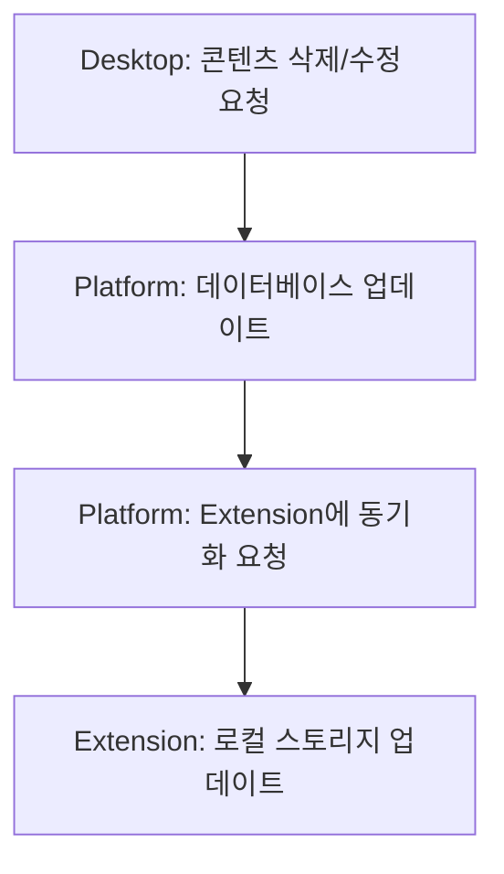

# U2BEE V3 NEXA Platform 통합 기획서

**작성일**: 2024년 12월  
**버전**: 3.0.2 (Platform 통합 버전)  
**상태**: 개발 진행 중 (Phase 3 완료, Phase 4 진행 예정)  
**아키텍처**: NEXA Platform UI 통합 + Chrome Extension  
**프레임워크**: Vue 3 + Quasar Framework (NEXA Platform)

## 📊 진행 상황 요약 (2024-12 업데이트)

### ✅ 완료된 작업

**Phase 1: UI 기반 구축**
- ✅ Container Queries 기반 Composable 함수 (`useContainerQuery.js`)
- ✅ 환경별 레이아웃 컴포넌트 (Popup, SidePanel, Desktop)
- ✅ 모든 기본 UI 컴포넌트 (8개 페이지) - 단순 DOM 구조, CSS 변수 적용
- ✅ 탭 시스템 및 네비게이션 (TabCustomizer, useTabConfig)
- ✅ NEXA 테마 변수 적용 완료

**Phase 2: 환경 구성 및 UI 확인**
- ✅ `/extension` 라우트 추가 및 ExtensionPage.vue 구현
- ✅ ExtensionSidebar.vue 구현 (카테고리별 확장 프로그램 메뉴)
- ✅ 기본 레이아웃 구성 완료
- ✅ NEXA Platform 웹 브라우저에서 UI 확인 완료
- ✅ Extension Popup/Side Panel iframe 구조 완료
- ✅ Side Panel 지원 완료 (sidepanel.html, sidepanel.js)

**Phase 3: 기본 통신 구조**
- ✅ 웹 브라우저 컨텐츠 타이틀/URL 수집 및 전송 구조 구축
- ✅ Content Script → Background → Extension UI → Platform 통신 파이프라인 완료
- ✅ 각 Extension 인스턴스 독립적 동작 (브라우저 창별 정보 분리)
- ✅ 중복 메시지 필터링 및 로그 최적화

### 🚧 진행 중인 작업

- Phase 1: 플로팅 메뉴 시스템 (미구현)
- Phase 2: 환경별 UI 확인 및 조정 (모바일/PC 브라우저, Desktop 웹뷰 미확인)
- Phase 4: 콘텐츠 평가 기능 (미구현)

### 📝 주요 개선 사항

- **DOM 구조 최적화**: 모든 컴포넌트에서 불필요한 래퍼 제거, 단순한 구조로 변경
- **CSS 변수 통일**: 모든 인라인 색상/스타일을 `var(--nexa-*)` 변수로 통일
- **작은 영역 최적화**: Chrome Extension 환경을 고려한 간격 최소화 및 한 줄 레이아웃 우선
- **공통 구조 통일**: 모든 탭 컴포넌트에 Breadcrumb 및 액션 버튼 섹션 추가
- **통신 구조 최적화**: 중복 메시지 필터링, 핵심 로그만 유지, 각 Extension 인스턴스 독립적 동작
- **Content Script 자동 주입**: 프로그래밍 방식 Content Script 주입으로 안정성 향상

---

## 목차

1. [프로젝트 개요](#프로젝트-개요)
2. [핵심 설계 철학](#핵심-설계-철학)
3. [시스템 아키텍처](#시스템-아키텍처)
4. [역할 및 책임 구분](#역할-및-책임-구분)
5. [정보 추출 전략](#정보-추출-전략)
6. [통신 구조](#통신-구조)
7. [기능 명세](#기능-명세)
8. [UI/UX 설계](#uiux-설계)
9. [데이터 모델](#데이터-모델)
10. [개발 로드맵](#개발-로드맵)
11. [참고 자료](#참고-자료)

---

## 프로젝트 개요

### 목적

**U2BEE V3 (NEXA Platform 통합 버전)**는 다양한 플랫폼(YouTube, TikTok, Instagram 등)의 콘텐츠 관리 기능을 NEXA Platform에 통합하고, Chrome Extension은 최소한의 역할만 수행하는 하이브리드 아키텍처입니다.

**플랫폼 확장성:**

-   현재 주 분석 대상: YouTube (비디오, Shorts)
-   향후 지원 예정: TikTok, Instagram, Twitter 등
-   플랫폼 독립적 구조로 새로운 플랫폼 추가 용이

### 핵심 아이디어

1. **UI는 NEXA Platform에서 제공**: 모든 사용자 인터페이스는 NEXA Platform에서 구현
2. **Extension은 브리지 역할**: 콘텐츠 수집 및 Chrome API 접근만 담당
3. **자동 업데이트**: Platform에서 수정하면 Extension 재배포 없이 즉시 반영
4. **자가 치유 시스템**: 플랫폼별 DOM 변경 시 자동으로 대응
5. **플랫폼 확장성**: 플랫폼 독립적 구조로 새로운 플랫폼 추가 용이

### 목표

1. **단일 코드베이스**: UI는 NEXA Platform에서만 관리
2. **자동 업데이트**: Extension 재배포 없이 기능 개선
3. **유지보수성**: Platform에서 모든 기능 수정 가능
4. **확장성**: 새로운 기능 추가 시 Extension 변경 최소화
5. **안정성**: 플랫폼별 DOM 변경에 자동 대응
6. **플랫폼 확장성**: YouTube 외 다른 플랫폼(TikTok, Instagram 등) 추가 용이

### 핵심 가치

-   **분리된 책임**: Extension(수집) vs Platform(UI/로직)
-   **자동 복구**: 자가 치유 시스템으로 안정성 확보
-   **사용자 투명성**: 실패 시 적절한 피드백 제공
-   **관리 효율성**: 중앙 집중식 관리 및 모니터링
-   **플랫폼 독립성**: YouTube에 제한되지 않는 확장 가능한 구조

---

## 핵심 설계 철학

### 1. 역할 분리 원칙



**역할 상세 설명:**

-   **Chrome Extension (최소 역할)**: 콘텐츠 수집 (Content Script), Chrome API 접근, Platform과 통신
-   **NEXA Platform (핵심 역할)**: 모든 UI 제공, 비즈니스 로직, 데이터 관리, 자가 치유 시스템

### 2. 단일 진실의 원천 (Single Source of Truth)

-   **UI 코드**: NEXA Platform에만 존재
-   **비즈니스 로직**: NEXA Platform에만 존재
-   **데이터 저장**: Extension(로컬) + Platform(동기화)
-   **선택자 관리**: Platform에서 중앙 관리

### 3. 자동 복구 원칙

-   **실패 감지**: Extension에서 자동 감지
-   **자동 분석**: Platform에서 자동 분석
-   **자동 업데이트**: Extension에 자동 전달
-   **사용자 알림**: 적절한 시점에 투명한 알림

---

## 시스템 아키텍처

### 전체 구조



**컴포넌트 상세 설명:**

-   **Content Script**: YouTube DOM 모니터링, 정보 추출 시도, 실패 시 DOM 스냅샷 생성
-   **Background Service Worker**: 메시지 라우팅, 스토리지 관리, 배치 처리 스케줄링, 로컬 스토리지 자동 정리 (필수)
-   **Popup / Side Panel**: iframe으로 NEXA Platform /u2bee 페이지 로드 (Vue 3 + Quasar), 모든 UI, 비즈니스 로직, 데이터 관리
-   **Frontend**: Vue 3 + Quasar, /u2bee 페이지, 모든 UI 컴포넌트 (반응형), 상태 관리 (Pinia)
-   **Backend API**: /api/content/\*, 플랫폼 API 통합 (YouTube, TikTok 등), DOM 분석 엔진, 선택자 관리, WebSocket 서버 (Desktop 통신)
-   **Database**: 콘텐츠 데이터, 선택자 데이터베이스, 실패 이력, 시스템 상태
-   **Main Window**: PySide6, 메인 UI, 웹뷰 컨테이너
-   **Browser Controller**: Chrome 제어, 탭 관리, URL 열기/닫기
-   **Platform Communicator**: WebSocket 클라이언트, 메시지 라우팅, Extension 통신 중계

### 컴포넌트 상세 구조

#### 1. Chrome Extension 구조

```
extension/
├── manifest.json
├── popup.html              # iframe만 포함
├── sidepanel.html          # iframe만 포함
├── background/
│   ├── background.js       # Service Worker
│   ├── messageRouter.js    # 메시지 라우팅
│   ├── storageManager.js   # 스토리지 관리
│   └── batchScheduler.js   # 배치 처리 스케줄러
├── content/
│   ├── content.js          # 진입점
│   ├── collectors/
│   │   ├── ContentCollector.js      # 메인 수집기
│   │   └── platforms/               # 플랫폼별 수집기
│   │       ├── YouTubeCollector.js  # YouTube 수집기
│   │       ├── TikTokCollector.js   # TikTok 수집기 (향후)
│   │       ├── InstagramCollector.js # Instagram 수집기 (향후)
│   │       └── WebsiteCollector.js  # Website 수집기
│   ├── extractors/
│   │   ├── platforms/                # 플랫폼별 추출기
│   │   │   ├── YouTubeDataExtractor.js  # YouTube 다중 전략 추출기
│   │   │   ├── TikTokDataExtractor.js   # TikTok 추출기 (향후)
│   │   │   └── BasePlatformExtractor.js # 기본 추출기 (공통 로직)
│   │   └── DOMSnapshotCreator.js    # DOM 스냅샷 생성
│   ├── services/
│   │   └── MessageService.js        # Platform 통신
│   ├── ui/                          # UI 관련 (플로팅 메뉴 등)
│   │   ├── floatingMenuInjection.js # 플로팅 메뉴 삽입
│   │   ├── themeDetector.js         # 테마 감지 시스템
│   │   └── policyChecker.js        # 사이트 정책 확인
│   └── utils/
│       └── colorUtils.js            # 색상 유틸리티
└── assets/
    └── icons/
```

#### 2. NEXA Platform 구조

```
NEXA-Platform/
├── src/
│   ├── pages/
│   │   └── extension/              # 확장 프로그램 페이지
│   │       └── U2BeePage.vue       # U2BEE 메인 페이지
│   │                               # 라우팅: /extension/u2bee
│   ├── components/
│   │   └── extension/               # 확장 프로그램 공통 컴포넌트
│   │       └── u2bee/               # U2BEE 전용 컴포넌트
│   │           ├── ContentRating.vue
│   │           ├── ContentList.vue
│   │           ├── PlayBox.vue
│   │           ├── Statistics.vue
│   │           └── Settings.vue
│   ├── stores/
│   │   └── extension/              # 확장 프로그램 스토어
│   │       └── u2bee/               # U2BEE Pinia 스토어
│   │           ├── content.ts
│   │           ├── category.ts
│   │           └── playbox.ts
│   ├── services/
│   │   └── extension/              # 확장 프로그램 서비스
│   │       └── u2bee/               # U2BEE 서비스 레이어
│   │           ├── extensionService.ts  # Extension 통신
│   │           ├── platformService.ts   # 플랫폼 API 통합 (YouTube, TikTok 등)
│   │           └── selectorService.ts    # 선택자 관리
│   └── composables/
│       └── extension/              # 확장 프로그램 Composable
│           └── u2bee/               # U2BEE Composable 함수
│               ├── useExtension.ts
│               └── usePlatform.ts  # 플랫폼별 기능 (YouTube, TikTok 등)
│   └── css/                        # NEXA Platform 스타일
│       ├── extension/               # 확장 프로그램 전용 SCSS
│       │   ├── themes/              # 확장 프로그램 테마 (블렌딩)
│       │   │   ├── _variables.scss  # Extension CSS 변수 정의
│       │   │   ├── _blender.scss    # 테마 블렌딩 로직
│       │   │   └── _auto-theme.scss # 자동 테마 (브라우저/사이트 감지)
│       │   ├── container-queries/   # Container Queries
│       │   │   ├── _breakpoints.scss # Container 브레이크포인트
│       │   │   ├── _popup.scss      # 팝업 레이아웃
│       │   │   ├── _sidepanel.scss  # 사이드바 레이아웃
│       │   │   └── _floating.scss   # 플로팅 메뉴 레이아웃
│       │   ├── _components.scss     # Extension 컴포넌트 스타일 (통합)
│       │   │                         # (base, tabs, accordion, floating-menu 포함)
│       │   ├── _functions.scss      # Extension SCSS 함수 (utils + utilities 병합)
│       │   ├── _mixins.scss         # Extension SCSS 믹스인 (utils + utilities 병합)
│       │   ├── _helpers.scss        # Extension 헬퍼 클래스
│       │   ├── _utilities.scss      # Extension 유틸리티 (utils에서 이동)
│       │   └── extension.scss       # Extension 메인 SCSS (모든 파일 import)
│       ├── nexa-system/             # NEXA 시스템 전역 스타일 (기존)
│       │   ├── _button.scss
│       │   ├── _card.scss
│       │   ├── _chart.scss
│       │   └── ... (기타 컴포넌트)
│       ├── themes/                  # NEXA Platform 테마 (기존)
│       │   ├── dark.scss
│       │   └── light.scss
│       ├── quasar.variables.scss    # Quasar 변수 오버라이드 (기존)
│       └── app.scss                 # 메인 SCSS (기존)
└── server/
    ├── routes/
    │   └── content.js                # 콘텐츠 API 라우트
    ├── services/
    │   ├── contentDOMAnalyzer.js    # DOM 분석 엔진 (플랫폼 독립적)
    │   ├── contentSelectorManager.js # 선택자 관리 (플랫폼별)
    │   └── notificationService.js   # 알림 서비스
    └── database/
        └── content/                  # 데이터베이스 스키마
```

**⚠️ 중요: Chrome Extension과 NEXA Platform의 스타일 분리**

-   **Chrome Extension**: UI 요소를 담당하지 않음, iframe으로 Platform UI 로드

    -   Content Script에서 플로팅 메뉴 삽입 로직만 담당 (`content/ui/`)
    -   테마 감지 및 색상 추출 로직만 담당 (`content/ui/themeDetector.js`)
    -   CSS/SCSS 파일 없음

-   **NEXA Platform 스타일**: `NEXA-Platform/src/css/` 폴더에서 관리
    -   **확장 프로그램 전용 스타일**: `NEXA-Platform/src/css/extension/` 폴더
        -   Extension 환경에 특화된 테마 및 스타일
        -   Container Queries 기반 레이아웃
        -   플로팅 메뉴, 사이드바 전용 스타일
        -   테마 블렌딩 시스템 (브라우저 + 사이트 + 플랫폼)
        -   **NEXA Platform CSS와 분리된 별도 폴더 구조**
    -   **NEXA Platform 공통 스타일**: `NEXA-Platform/src/css/nexa-system/` 폴더 (기존)
        -   Platform 전체 공통 컴포넌트 스타일
        -   Platform 테마 (`themes/`)
    -   **Platform 독립 실행 시**: NEXA Platform 고유 테마 사용 (`themes/dark.scss`, `light.scss`)
    -   **Extension 임베드 모드 시**: Extension 테마 블렌딩 시스템 사용 (`css/extension/themes/`)

---

## 역할 및 책임 구분

### Chrome Extension 역할

#### 1. Content Script

**책임:**

-   YouTube/Shorts/Website 페이지 모니터링
-   콘텐츠 정보 추출 시도
-   실패 시 DOM 스냅샷 생성
-   Platform으로 정보 전송

**제한사항:**

-   UI 렌더링 없음
-   비즈니스 로직 없음
-   데이터 저장 최소화 (임시만)

**구현 예시:**

```javascript
// content/content.js
class ContentScript {
    async collectContent() {
        // 1. 정보 추출 시도
        const data = await this.tryExtract();

        if (data) {
            // 2. Platform으로 전송
            await this.sendToPlatform(data);
        } else {
            // 3. 실패 시 DOM 스냅샷 생성
            const snapshot = await this.createSnapshot();
            await this.reportFailure(snapshot);
        }
    }
}
```

#### 2. Background (Service Worker)

**책임:**

-   메시지 라우팅 (Content ↔ Platform)
-   로컬 스토리지 관리
-   배치 처리 스케줄링
-   상태 폴링

**제한사항:**

-   비즈니스 로직 없음
-   단순 중계 역할

**구현 예시:**

```javascript
// background/background.js
chrome.runtime.onMessage.addListener((message, sender, sendResponse) => {
    if (message.target === "platform") {
        // Platform으로 전달
        forwardToPlatform(message);
    } else if (message.target === "content") {
        // Content Script로 전달
        forwardToContent(message);
    }
});
```

#### 3. Popup / Side Panel

**책임:**

-   iframe 컨테이너만 제공
-   모드 전환 (Popup ↔ Side Panel)
-   최소한의 통신 브리지

**제한사항:**

-   UI 코드 없음
-   iframe만 포함

**구현 예시:**

```html
<!-- popup.html -->
<!DOCTYPE html>
<html>
    <body>
        <iframe src="https://platform/u2bee?embed=true"></iframe>
        <script src="popup.js"></script>
    </body>
</html>
```

### NEXA Platform 역할

#### 1. Frontend (Vue 3 + Quasar)

**책임:**

-   모든 UI 제공
-   사용자 인터랙션 처리
-   상태 관리
-   Extension과 통신

**구현 예시:**

```vue
<!-- NEXA-Platform/src/pages/extension/U2BeePage.vue -->
<template>
    <div class="u2bee-container">
        <!-- 모든 UI는 여기서 구현 -->
        <ContentRating />
        <ContentList />
        <PlayBox />
    </div>
</template>

<script setup>
import { useExtension } from "@/composables/extension/u2bee/useExtension";

const { sendToExtension, listenFromExtension } = useExtension();

// Extension에서 콘텐츠 정보 수신
listenFromExtension("CONTENT_COLLECTED", (data) => {
    // UI 업데이트
});
</script>
```

#### 2. Backend API

**책임:**

-   플랫폼 API 통합 (YouTube, TikTok 등)
-   DOM 분석 엔진
-   선택자 관리
-   시스템 상태 관리
-   알림 서비스

**구현 예시:**

```javascript
// server/routes/content.js
router.post("/content/analyze-dom", async (req, res) => {
    const { platform, domSnapshot } = req.body;

    // 플랫폼별 DOM 분석
    const selectors = await domAnalyzer.analyzeDOM(platform, domSnapshot);
    res.json({ platform, selectors });
});
```

#### 3. Database

**책임:**

-   콘텐츠 데이터 저장
-   선택자 데이터베이스
-   실패 이력
-   시스템 상태

---

## 정보 추출 전략

### 다중 전략 Fallback 시스템



**전략 상세 설명:**

-   **전략 1: 플랫폼 내부 데이터**: YouTube의 ytInitialData, TikTok의 \_\_UNIVERSAL_DATA 등
-   **전략 2: JSON-LD 구조화 데이터**: Schema.org 표준
-   **전략 3: 플랫폼 공식 API**: YouTube Data API, TikTok API 등
-   **전략 4: 동적 DOM 선택자**: 플랫폼별 동적 선택자 사용
-   **전략 5: 자가 치유 시스템**: DOM 분석을 통한 플랫폼별 자동 복구

### 전략별 상세 구현

#### 전략 1: 플랫폼 내부 데이터

**위치**: `content/extractors/platforms/{Platform}DataExtractor.ts`

**책임**: Extension (Content Script)

**구현 예시 (YouTube):**

```javascript
// content/extractors/platforms/YouTubeDataExtractor.ts
class YouTubeDataExtractor extends BasePlatformExtractor {
    extractFromInternalData() {
        // window.ytInitialData에서 정보 추출
        const ytInitialData = window.ytInitialData;
        const playerResponse = window.ytInitialPlayerResponse;

        return {
            platform: "youtube",
            title: playerResponse?.videoDetails?.title,
            authorName: ytInitialData?.contents?.twoColumnWatchNextResults?.results?.results?.contents?.[1]?.videoSecondaryInfoRenderer?.owner?.videoOwnerRenderer?.title?.runs?.[0]?.text,
            // ...
        };
    }
}
```

**구현 예시 (TikTok - 향후):**

```javascript
// content/extractors/platforms/TikTokDataExtractor.ts
class TikTokDataExtractor extends BasePlatformExtractor {
    extractFromInternalData() {
        // TikTok 내부 데이터에서 정보 추출
        const tiktokData = window.__UNIVERSAL_DATA_FOR_REHYDRATION__;

        return {
            platform: "tiktok",
            title: tiktokData?.videoInfo?.title,
            authorName: tiktokData?.videoInfo?.author?.nickname,
            // ...
        };
    }
}
```

**장점:**

-   가장 빠름
-   가장 안정적
-   DOM 구조 변경에 영향 없음
-   플랫폼별로 독립적으로 확장 가능

**단점:**

-   플랫폼 내부 구조 변경 시 영향
-   플랫폼별 구현 필요

#### 전략 2: JSON-LD 구조화 데이터

**위치**: `content/extractors/platforms/{Platform}DataExtractor.ts`

**책임**: Extension (Content Script)

**구현:**

```javascript
extractFromStructuredData() {
  const jsonLd = document.querySelector('script[type="application/ld+json"]')
  const data = JSON.parse(jsonLd.textContent)

  return {
    platform: this.platform,
    title: data.name,
    authorName: data.uploader?.name || data.author?.name,
    // ...
  }
}
```

**장점:**

-   플랫폼 독립적 (대부분의 플랫폼이 Schema.org 사용)
-   표준화된 구조
-   안정적

**단점:**

-   모든 플랫폼이 지원하지 않을 수 있음

#### 전략 3: 플랫폼 공식 API

**위치**: `server/services/platformAPIClient.js`

**책임**: NEXA Platform (Backend)

**구현:**

```javascript
// 플랫폼별 API 클라이언트
class PlatformAPIClient {
    async getContentInfo(platform, contentId) {
        switch (platform) {
            case "youtube":
                return await this.getYouTubeInfo(contentId);
            case "tiktok":
                return await this.getTikTokInfo(contentId);
            case "instagram":
                return await this.getInstagramInfo(contentId);
            // 향후 다른 플랫폼 추가 가능
            default:
                throw new Error(`Unsupported platform: ${platform}`);
        }
    }

    async getYouTubeInfo(videoId) {
        const response = await youtube.videos.list({
            part: ["snippet", "contentDetails", "statistics"],
            id: [videoId],
        });
        return response.data.items[0];
    }
}
```

**장점:**

-   공식 API
-   가장 신뢰성 높음
-   플랫폼 확장 가능

**단점:**

-   API 할당량 제한
-   네트워크 요청 필요
-   플랫폼별 API 키 필요

#### 전략 4: 동적 DOM 선택자

**위치**: `content/extractors/platforms/{Platform}DataExtractor.ts`

**책임**: Extension (Content Script)

**구현:**

```javascript
extractFromDOM() {
  // 플랫폼별 선택자 가져오기
  const selectors = await this.getSelectorsForPlatform(this.platform)

  // 다중 선택자 패턴 시도
  const titleSelectors = selectors.title || [
    // 기본 선택자 (플랫폼별)
    ...this.getDefaultSelectors('title')
  ]

  for (const selector of titleSelectors) {
    const element = document.querySelector(selector)
    if (element) return element.textContent
  }
}

async getSelectorsForPlatform(platform) {
  // Platform에서 플랫폼별 선택자 가져오기
  const response = await fetch(`https://platform/api/content/selectors?platform=${platform}`)
  return await response.json()
}
```

**선택자 소스**: NEXA Platform에서 플랫폼별로 관리

#### 전략 5: 자가 치유 시스템

**위치**: `server/services/contentDOMAnalyzer.js`

**책임**: NEXA Platform (Backend)

**구현:**

```javascript
async analyzeDOM(platform, domSnapshot) {
  // 플랫폼별 분석 전략 적용
  const analyzer = this.getPlatformAnalyzer(platform)

  // AI/패턴 매칭으로 선택자 추출
  const selectors = await analyzer.extractSelectors(domSnapshot)

  // Extension에 전달
  return {
    platform,
    selectors
  }
}

getPlatformAnalyzer(platform) {
  switch (platform) {
    case 'youtube':
      return new YouTubeDOMAnalyzer()
    case 'tiktok':
      return new TikTokDOMAnalyzer()
    // 향후 다른 플랫폼 추가
    default:
      return new GenericDOMAnalyzer()
  }
}
```

**트리거 조건:**

-   모든 전략 실패 시
-   하루 1회 (새벽 3시)
-   배치 처리 (최대 5개 샘플)
-   플랫폼별로 독립적으로 처리

---

## 통신 구조

### 전체 통신 아키텍처



**통신 구조 설명:**

-   **Chrome Extension**: Content Script, Background Service Worker, Popup/Side Panel로 구성
-   **NEXA Platform**: Frontend (Vue 3), Backend API, Database로 구성
-   **NEXA Desktop (Python)**:
    -   **Main Window**: 웹뷰를 통해 NEXA Platform의 UI를 대부분 구성
    -   **Browser Controller**: Chrome 제어, 탭 관리 등
    -   **Platform Communicator**: Platform과의 통신 관리
    -   **Local Manager**: 로컬 시스템 접근이 필요한 경우 처리 (파일 시스템, 네이티브 기능 등)
-   **오프라인 대비**: Extension과 Desktop 간 직접 통신 경로 (점선) - Platform이 오프라인일 때 사용
-   **특별한 경우 (로컬 시스템 접근)**: UI는 Platform에서 구현하고, Desktop의 Local Manager가 내부적으로 처리

### 통신 프로토콜

#### 1. Extension → Platform

**경로**: Content Script → Background → Platform (HTTP/WebSocket)

**메시지 타입:**

```typescript
interface ExtensionToPlatformMessage {
    type: "CONTENT_COLLECTED" | "EXTRACTION_FAILED" | "DOM_SNAPSHOT" | "STATUS_REQUEST";
    source: "extension";
    data: any;
    timestamp: number;
}
```

**예시:**

```javascript
// Content Script → Platform
{
  type: 'CONTENT_COLLECTED',
  source: 'extension',
  data: {
    platform: 'youtube',
    contentId: 'abc123',
    title: '제목',
    authorName: '@채널명',
    authorId: 'UC...',
    contentType: 'video',
  },
  timestamp: Date.now()
}
```

#### 2. Platform → Extension

**경로**: Platform → Background → Content Script (postMessage)

**메시지 타입:**

```typescript
interface PlatformToExtensionMessage {
    type: "UPDATE_SELECTORS" | "REQUEST_CONTENT" | "STATUS_UPDATE" | "RELOAD_IFRAME";
    source: "platform";
    data: any;
    timestamp: number;
}
```

**예시:**

```javascript
// Platform → Extension
{
  type: 'UPDATE_SELECTORS',
  source: 'platform',
  data: {
    platform: 'youtube',
    selectors: {
      title: 'h1.new-title-selector',
      authorName: 'a.new-author-selector',
      description: 'div.new-description-selector',
      thumbnail: 'img.new-thumbnail-selector',
    },
  },
  timestamp: Date.now()
}
```

### 통신 흐름도

#### 시나리오 1: 정상 정보 추출

```
1. Content Script: 정보 추출 성공
   ↓
2. Background: 메시지 수신
   ↓
3. Platform (iframe): postMessage로 전달
   ↓
4. Platform Frontend: 데이터 수신 및 UI 업데이트
```

#### 시나리오 2: 정보 추출 실패

```
1. Content Script: 모든 전략 실패
   ↓
2. Content Script: 실패 이력 기록 (로컬)
   ↓
3. Background: 배치 처리 대기열에 추가
   ↓
4. Background: 새벽 3시 배치 처리 시작
   ↓
5. Platform API: DOM 분석 요청
   ↓
6. Platform Backend: 선택자 추출
   ↓
7. Platform Backend: Extension에 선택자 전달
   ↓
8. Extension: 선택자 업데이트 및 재시도
```

#### 시나리오 3: 사용자 액션 (저장)



### 통신 구현

#### Extension: Message Service

```javascript
// content/services/MessageService.ts

class MessageService {
    /**
     * Platform으로 메시지 전송
     */
    async sendToPlatform(message: ExtensionToPlatformMessage) {
        // Background를 통해 전달
        return chrome.runtime.sendMessage({
            target: "platform",
            ...message,
        });
    }

    /**
     * Platform에서 메시지 수신
     */
    listenFromPlatform(callback: (message: PlatformToExtensionMessage) => void) {
        chrome.runtime.onMessage.addListener((message) => {
            if (message.source === "platform") {
                callback(message);
            }
        });
    }
}
```

#### Platform: Extension Service

```javascript
// NEXA-Platform/src/services/extension/u2bee/extensionService.ts

export function useExtension() {
    const isEmbedMode = computed(() => {
        return new URLSearchParams(window.location.search).get("embed") === "true";
    });

    /**
     * Extension으로 메시지 전송
     */
    function sendToExtension(message: PlatformToExtensionMessage) {
        if (!isEmbedMode.value) return;

        window.parent.postMessage(
            {
                ...message,
                source: "platform",
                timestamp: Date.now(),
            },
            "*" // Extension origin
        );
    }

    /**
     * Extension에서 메시지 수신
     */
    function listenFromExtension(callback: (message: ExtensionToPlatformMessage) => void) {
        if (!isEmbedMode.value) return;

        window.addEventListener("message", (event) => {
            if (event.data?.source === "extension") {
                callback(event.data);
            }
        });
    }

    return {
        isEmbedMode,
        sendToExtension,
        listenFromExtension,
    };
}
```

### PC 프로그램 통신 구조

#### 개요

NEXA Desktop (Python) 프로그램과 Extension/Platform 간 통신을 통해 브라우저를 제어하고 데이터를 동기화합니다.

#### UI 구성 방식

**대부분의 UI는 웹뷰를 통해 NEXA Platform에서 제공:**

-   Main Window는 PySide6의 웹뷰 컨테이너로 NEXA Platform의 Frontend를 로드
-   U2BEE를 포함한 대부분의 기능은 Platform의 UI를 사용
-   웹뷰를 통해 Platform의 Vue 3 + Quasar UI가 렌더링됨

**특별한 경우 (로컬 시스템 접근):**

-   파일 시스템 접근, 네이티브 다이얼로그, 시스템 설정 등이 필요한 경우
-   **UI는 Platform에서 구현**: 사용자에게 보이는 인터페이스는 Platform의 UI 사용
-   **처리는 Desktop에서 내부적으로 수행**: Platform에서 사용자 액션을 받아 Desktop의 Local Manager가 내부적으로 처리
-   예: 파일 선택 다이얼로그는 Platform UI로 표시되지만, 실제 파일 접근은 Desktop이 처리

#### 통신 경로

**정상 경로 (온라인):**

```
Extension ←→ Platform ←→ NEXA Desktop (Python)
```

**오프라인 대비 경로:**

```
Extension ←→ NEXA Desktop (Python) (직접 통신)
```

-   Platform이 오프라인일 때 Extension과 Desktop 간 직접 양방향 통신
-   Native Messaging 또는 로컬 WebSocket 사용
-   기본 데이터는 로컬에서 처리하고, Platform 복구 시 동기화

**역할:**

-   **Extension**: 브라우저 내 콘텐츠 수집 및 제어
-   **Platform**: 중앙 통신 허브 및 데이터 관리, 대부분의 UI 제공
-   **Desktop**: 브라우저 제어, 네이티브 기능 제공, 웹뷰를 통한 UI 표시, 로컬 시스템 접근 처리

#### 통신 방법

##### 방법 1: WebSocket (권장)

**장점:**

-   실시간 양방향 통신
-   플랫폼 독립적
-   확장성 좋음

**구현:**

**Desktop (Python):**

```python
# NEXA-Desktop/U2BEE/modules/platform_communicator.py

import asyncio
import websockets
import json
from typing import Optional, Callable

class PlatformCommunicator:
    """Platform 통신 관리 클래스"""

    def __init__(self, platform_url: str = "ws://localhost:3000/ws/u2bee"):
        self.platform_url = platform_url
        self.websocket: Optional[websockets.WebSocketClientProtocol] = None
        self.connected = False
        self.message_handlers: dict = {}

    async def connect(self):
        """Platform에 연결"""
        try:
            self.websocket = await websockets.connect(self.platform_url)
            self.connected = True
            print("[PlatformCommunicator] 연결 성공")

            # 수신 루프 시작
            asyncio.create_task(self.receive_loop())
        except Exception as e:
            print(f"[PlatformCommunicator] 연결 실패: {e}")
            self.connected = False

    async def receive_loop(self):
        """메시지 수신 루프"""
        while self.connected:
            try:
                message = await self.websocket.recv()
                data = json.loads(message)
                await self.handle_message(data)
            except websockets.exceptions.ConnectionClosed:
                print("[PlatformCommunicator] 연결 종료")
                self.connected = False
                break
            except Exception as e:
                print(f"[PlatformCommunicator] 수신 오류: {e}")

    async def handle_message(self, message: dict):
        """메시지 처리"""
        message_type = message.get('type')
        handler = self.message_handlers.get(message_type)

        if handler:
            await handler(message.get('data', {}))
        else:
            print(f"[PlatformCommunicator] 처리되지 않은 메시지: {message_type}")

    async def send_message(self, message_type: str, data: dict):
        """메시지 전송"""
        if not self.connected or not self.websocket:
            print("[PlatformCommunicator] 연결되지 않음")
            return

        message = {
            'type': message_type,
            'source': 'desktop',
            'data': data,
            'timestamp': asyncio.get_event_loop().time()
        }

        await self.websocket.send(json.dumps(message))

    def register_handler(self, message_type: str, handler: Callable):
        """메시지 핸들러 등록"""
        self.message_handlers[message_type] = handler

    async def request_browser_action(self, action: str, params: dict):
        """브라우저 액션 요청"""
        await self.send_message('BROWSER_ACTION_REQUEST', {
            'action': action,
            'params': params
        })

    async def send_content_data(self, content_data: dict):
        """콘텐츠 데이터 전송"""
        await self.send_message('CONTENT_DATA', content_data)
```

**Platform (Backend):**

```javascript
// NEXA-Platform/server/services/desktopCommunicator.js

const WebSocket = require("ws");

class DesktopCommunicator {
    constructor(server) {
        this.wss = new WebSocket.Server({
            server,
            path: "/ws/u2bee",
        });

        this.clients = new Map(); // clientId -> WebSocket
        this.desktopClients = new Set(); // Desktop 클라이언트

        this.setupWebSocket();
    }

    setupWebSocket() {
        this.wss.on("connection", (ws, req) => {
            const clientId = this.generateClientId();
            this.clients.set(clientId, ws);

            // Desktop 클라이언트인지 확인
            const isDesktop = req.headers["user-agent"]?.includes("NEXA-Desktop");
            if (isDesktop) {
                this.desktopClients.add(clientId);
                console.log(`[DesktopCommunicator] Desktop 클라이언트 연결: ${clientId}`);
            }

            ws.on("message", (message) => {
                this.handleMessage(clientId, JSON.parse(message));
            });

            ws.on("close", () => {
                this.clients.delete(clientId);
                this.desktopClients.delete(clientId);
                console.log(`[DesktopCommunicator] 클라이언트 연결 해제: ${clientId}`);
            });
        });
    }

    handleMessage(clientId, message) {
        const { type, source, data } = message;

        if (source === "desktop") {
            // Desktop에서 온 메시지
            this.handleDesktopMessage(clientId, type, data);
        } else if (source === "extension") {
            // Extension에서 온 메시지
            this.handleExtensionMessage(clientId, type, data);
        }
    }

    handleDesktopMessage(clientId, type, data) {
        switch (type) {
            case "BROWSER_ACTION_REQUEST":
                // Extension에 브라우저 액션 요청 전달
                this.forwardToExtension({
                    type: "BROWSER_ACTION",
                    data: data,
                    source: "desktop",
                });
                break;

            case "CONTENT_DATA":
                // 콘텐츠 데이터 저장
                this.saveContentData(data);
                break;
        }
    }

    handleExtensionMessage(clientId, type, data) {
        switch (type) {
            case "CONTENT_COLLECTED":
                // Desktop에 콘텐츠 정보 전달
                this.forwardToDesktop({
                    type: "CONTENT_COLLECTED",
                    data: data,
                    source: "extension",
                });
                break;
        }
    }

    forwardToExtension(message) {
        // Extension 클라이언트들에게 전달
        this.clients.forEach((ws, clientId) => {
            if (!this.desktopClients.has(clientId)) {
                ws.send(JSON.stringify(message));
            }
        });
    }

    forwardToDesktop(message) {
        // Desktop 클라이언트들에게 전달
        this.desktopClients.forEach((clientId) => {
            const ws = this.clients.get(clientId);
            if (ws && ws.readyState === WebSocket.OPEN) {
                ws.send(JSON.stringify(message));
            }
        });
    }

    generateClientId() {
        return `client_${Date.now()}_${Math.random().toString(36).substr(2, 9)}`;
    }
}

module.exports = DesktopCommunicator;
```

##### 방법 2: Native Messaging (오프라인 대비)

**용도:**

-   Platform이 오프라인일 때 Extension과 Desktop 간 직접 통신
-   정상 경로는 Platform을 통한 통신 사용

**장점:**

-   직접 통신 (Platform 경유 불필요)
-   낮은 지연시간
-   오프라인 환경에서도 기본 기능 사용 가능

**단점:**

-   Chrome Extension Native Messaging 설정 필요
-   플랫폼별 구현 필요

**구현:**

**Extension Manifest:**

```json
{
    "native_messaging": {
        "u2bee_desktop": {
            "name": "com.nexa.u2bee.desktop",
            "description": "NEXA Desktop 통신"
        }
    }
}
```

**Extension Background:**

```javascript
// background/nativeMessaging.js

const nativePort = chrome.runtime.connectNative("com.nexa.u2bee.desktop");

nativePort.onMessage.addListener((message) => {
    // Desktop에서 온 메시지 처리
    console.log("Desktop 메시지:", message);
});

// Desktop으로 메시지 전송
function sendToDesktop(message) {
    nativePort.postMessage(message);
}
```

**Desktop (Python):**

```python
# Native Messaging 서버

import sys
import json
import struct

def send_message(message):
    """Extension으로 메시지 전송"""
    message_json = json.dumps(message)
    message_bytes = message_json.encode('utf-8')

    # 길이 헤더 전송
    sys.stdout.buffer.write(struct.pack('I', len(message_bytes)))
    sys.stdout.buffer.write(message_bytes)
    sys.stdout.buffer.flush()

def receive_message():
    """Extension에서 메시지 수신"""
    # 길이 헤더 읽기
    length_bytes = sys.stdin.buffer.read(4)
    if not length_bytes:
        return None

    length = struct.unpack('I', length_bytes)[0]

    # 메시지 읽기
    message_bytes = sys.stdin.buffer.read(length)
    message_json = message_bytes.decode('utf-8')

    return json.loads(message_json)

# 메시지 루프
while True:
    message = receive_message()
    if message:
        # 메시지 처리
        handle_message(message)
```

#### 통신 시나리오

##### 시나리오 1: Desktop에서 브라우저 제어



##### 시나리오 2: Extension에서 콘텐츠 수집 → Desktop 동기화



##### 시나리오 3: Desktop에서 콘텐츠 관리



#### 메시지 타입 정의

```typescript
// 공통 메시지 타입

interface DesktopToPlatformMessage {
    type:
        | "BROWSER_ACTION_REQUEST" // 브라우저 액션 요청
        | "CONTENT_DATA" // 콘텐츠 데이터 전송
        | "SYNC_REQUEST" // 동기화 요청
        | "STATUS_UPDATE"; // 상태 업데이트
    source: "desktop";
    data: any;
    timestamp: number;
}

interface PlatformToDesktopMessage {
    type:
        | "CONTENT_COLLECTED" // 콘텐츠 수집 완료
        | "BROWSER_ACTION_RESPONSE" // 브라우저 액션 응답
        | "SYNC_RESPONSE" // 동기화 응답
        | "STATUS_UPDATE"; // 상태 업데이트
    source: "platform" | "extension";
    data: any;
    timestamp: number;
}

interface BrowserActionRequest {
    action:
        | "OPEN_URL" // URL 열기
        | "CLOSE_TAB" // 탭 닫기
        | "SWITCH_TAB" // 탭 전환
        | "RELOAD_TAB" // 탭 새로고침
        | "EXECUTE_SCRIPT"; // 스크립트 실행
    params: {
        url?: string;
        tabId?: number;
        script?: string;
        [key: string]: any;
    };
}
```

---

## 기능 명세

### 탭 UI 구조

U2BEE는 탭 기반 UI로 구성되며, 사용자가 탭 구성을 커스터마이징할 수 있습니다.

#### 기본 탭 구성 (V1 기준)

1. **컨텐츠 평가** (`rating`)
2. **정장 목록** (`list`) - 데이터 목록
3. **플레이박스** (`playbox`)
4. **히스토리** (`history`)
5. **통계** (`statistics`)
6. **데이터 관리** (`data`)
7. **설정** (`config`)
8. **도움말** (`about`)

#### 사용자 탭 구성 커스터마이징

-   사용자가 탭 표시/숨김 설정 가능
-   탭 순서 변경 가능
-   새로운 기능 추가 시 탭으로 분리 가능
-   탭 구성은 로컬 스토리지에 저장

---

### 1. 컨텐츠 평가 탭 (`rating`)

**책임**: Platform (Frontend) + Extension (Content Script)

**구현 위치**:

-   UI: `NEXA-Platform/src/components/extension/u2bee/ContentRating.vue`
-   수집: `extension/content/collectors/`

**기능:**

-   플랫폼 자동 감지 (YouTube, TikTok, Instagram, Website 등)
-   다중 전략 정보 추출
-   실패 시 DOM 스냅샷 생성
-   Like/Dislike 평가
-   평가 통계
-   비호감 작성자 관리
-   콘텐츠 저장

**새로운 기능:**

-   🔥 **자가 치유 시스템**: DOM 분석으로 자동 복구
-   🔥 **배치 처리**: 하루 1회 새벽 시간대 분석
-   🔥 **사용자 알림**: 실패 시 투명한 알림

---

### 2. 정장 목록 탭 (`list`)

**책임**: Platform (Frontend + Backend)

**구현 위치**: `NEXA-Platform/src/components/extension/u2bee/ContentList.vue`

**기능:**

-   콘텐츠 목록 표시 (플랫폼별, 타입별 분류)
-   검색 및 필터링
-   정렬 및 그룹화
-   카테고리별 필터링
-   수정 및 삭제
-   일괄 작업 (선택 삭제, 카테고리 변경 등)

#### 카테고리 시스템 로직

**성능 최적화 전략:**

1. **초기 로드 최적화**

    - 처음에는 상위 20개 카테고리만 로드 (사용 빈도 기준)
    - 나머지는 스크롤 시 지연 로딩
    - 캐시 활용 (1시간 유효)

2. **검색 최적화**

    - `name_normalized` 필드로 빠른 검색
    - FULLTEXT 인덱스로 전문 검색 지원
    - 검색어 2자 이상부터 결과 표시

3. **정렬 방식**

    - **추천 (recommended)**: 사용 빈도 + 연관성 점수 기반
    - **자주 사용 (mostUsed)**: 사용 횟수 기준
    - **최근 사용 (recent)**: 마지막 사용일시 기준
    - **최근 생성 (recentCreated)**: 생성일시 기준
    - **사용자 지정 (custom)**: order_index 기준
    - **이름순 (asc/desc)**: 알파벳/한글 순서

4. **추천 로직**

    - 현재 선택된 카테고리와 함께 사용된 카테고리 우선 표시
    - 시간 근접성 점수 반영 (1시간 이내: 1.0, 24시간: 0.5, 1주일: 0.2)
    - 점수 계산: `(사용 횟수 × 0.4) + (연관성 점수 × 0.6)`

5. **UI 최적화**
    - 가상 스크롤링으로 대량 카테고리 렌더링 최적화
    - 검색 입력 디바운스 (300ms)
    - 그룹화 표시 (최근 사용 / 자주 사용 / 추천 / 기타)

**주요 쿼리 패턴:**

```sql
-- 추천 카테고리 조회 (상위 10개)
SELECT c.*,
       COALESCE(cus.use_count, 0) as use_count,
       COALESCE(cco.co_use_count, 0) as co_use_count
FROM u2bee_categories c
LEFT JOIN u2bee_category_usage_stats cus
  ON c.id = cus.category_id AND cus.user_id = ? AND cus.platform = ?
LEFT JOIN u2bee_category_co_usage cco
  ON (cco.category_id_1 = c.id OR cco.category_id_2 = c.id)
  AND cco.user_id = ? AND cco.platform = ?
WHERE c.user_id = ? AND c.is_archived = FALSE
ORDER BY (use_count * 0.4 + co_use_count * 0.6) DESC
LIMIT 10;

-- 검색 (FULLTEXT)
SELECT * FROM u2bee_categories
WHERE user_id = ?
  AND MATCH(name) AGAINST(? IN BOOLEAN MODE)
  AND is_archived = FALSE
ORDER BY name ASC
LIMIT 20;
```

---

### 3. 플레이박스 탭 (`playbox`)

**책임**: Platform (Frontend) + Extension (재생 제어)

**구현 위치**:

-   UI: `NEXA-Platform/src/components/extension/u2bee/PlayBox.vue`
-   제어: `extension/content/playBoxHandler.js`

**기능:**

-   플레이리스트 관리 (Platform)
-   재생 제어 (Extension)
-   예약 재생
-   자동 재생
-   재생 순서 설정
-   반복 재생 설정

---

### 4. 히스토리 탭 (`history`)

**책임**: Platform (Frontend + Backend)

**구현 위치**: `NEXA-Platform/src/components/extension/u2bee/ContentHistory.vue`

**기능:**

-   방문 이력 표시
-   날짜별 필터링
-   검색 기능
-   이력 삭제
-   통계 정보
-   🔥 **자동 삭제**: 오래된 히스토리 자동 정리 (로컬 스토리지 용량 관리)

---

### 5. 통계 탭 (`statistics`)

**책임**: Platform (Frontend)

**구현 위치**: `NEXA-Platform/src/components/extension/u2bee/Statistics.vue`

**기능:**

-   콘텐츠 통계 (총 개수, 평가 분포 등)
-   카테고리 통계
-   시간대별 통계
-   플랫폼별 통계
-   작성자별 통계
-   차트 시각화 (막대 그래프, 파이 차트 등)
-   기간별 필터링

---

### 6. 데이터 관리 탭 (`data`)

**책임**: Platform (Frontend + Backend)

**구현 위치**: `NEXA-Platform/src/components/extension/u2bee/DataManagement.vue`

**기능:**

-   데이터 백업/복원
-   데이터 내보내기/가져오기
-   저장소 사용량 확인 및 경고
-   🔥 **자동 정리**: 로컬 스토리지 용량 관리 (히스토리, 썸네일, 번역 데이터 등)
-   데이터 정리 (오래된 데이터 삭제)
-   카테고리 관리
-   숨김 도메인 관리
-   휴지통 관리

**⚠️ 중요: 로컬 스토리지 용량 관리**

-   Chrome Extension 로컬 스토리지 제한: 약 10MB
-   스토리지가 가득 차면 정보 추출 실패 발생 가능
-   자동 정리 기능으로 오래된 히스토리, 썸네일, 번역 데이터 등을 주기적으로 삭제하여 용량 확보

---

### 7. 설정 탭 (`config`)

**책임**: Platform (Frontend)

**구현 위치**: `NEXA-Platform/src/components/extension/u2bee/Settings.vue`

**기능:**

-   **표시 설정**
    -   표시 모드 (Popup/Side Panel)
    -   🔥 **플로팅 메뉴 옵션** (사용자 선택)
        -   사이트 DOM 영역에 플로팅 메뉴 삽입 활성화/비활성화
        -   플로팅 메뉴 위치 설정 (왼쪽/오른쪽)
        -   플로팅 메뉴 크기 조정
        -   자동 폴백 설정 (사이트 정책 불가 시 사이드바로 전환)
    -   테마 설정 (다크/라이트/자동)
    -   🔥 **테마 자동 감지 및 색상 반영** (사이드바/플로팅 메뉴)
        -   브라우저 테마 자동 감지 (prefers-color-scheme)
        -   사이트 테마 자동 감지 (YouTube 다크/라이트 모드 등)
        -   색상 자동 추출 및 반영 (배경, 텍스트, 테두리 등)
        -   색상 흡수 강도 조정 (0.0 ~ 1.0)
        -   테마 우선순위 설정 (브라우저/사이트/자동)
        -   수동 색상 오버라이드 옵션
    -   언어 설정
-   **탭 구성 설정**
    -   탭 표시/숨김
    -   탭 순서 변경
    -   새 탭 추가/제거
-   **수집 설정**
    -   자동 수집 활성화/비활성화
    -   수집 대상 (YouTube/Shorts/Website)
    -   수집 알림 설정
-   **자동 재생 설정** (플랫폼별)
    -   🔥 **YouTube Shorts 자동 재생**: 비디오가 끝나면 자동으로 다음 Shorts로 넘어감
    -   🔥 **TikTok 자동 재생**: 향후 지원 예정
    -   🔥 **자동 스킵 (AutoSkip)**: 비호감 작성자를 자동으로 스킵
    -   **스킵 강도 (SkipStrength)**: 비호감 강도가 설정값(1-9) 이상이면 스킵
    -   플랫폼별 스킵 조건 커스터마이징
-   **저장소 설정**
    -   저장소 사용량 모니터링
    -   🔥 **자동 정리 설정** (필수)
        -   히스토리 보관 기간 (기본: 30일)
        -   썸네일 보관 기간 (기본: 7일)
        -   번역 데이터 보관 기간 (기본: 7일)
        -   자동 정리 실행 주기 (기본: 매일 새벽 3시)
        -   스토리지 사용량 임계값 (기본: 80%, 초과 시 즉시 정리)
    -   백업 주기 설정
-   **기타 설정**
    -   단축키 설정
    -   알림 설정

---

### 8. 도움말 탭 (`about`)

**책임**: Platform (Frontend)

**구현 위치**: `NEXA-Platform/src/components/extension/u2bee/HelpPage.vue`

**기능:**

-   사용 가이드
-   튜토리얼
-   FAQ
-   버전 정보
-   업데이트 내역
-   피드백/문의

---

### 추가 기능

#### 플랫폼별 자동 재생 및 스킵 기능

**책임**: Extension (Content Script)

**구현 위치**:

-   YouTube Shorts: `extension/content/platforms/youtubeShortsHandler.js`
-   TikTok: `extension/content/platforms/tiktokHandler.js` (향후)
-   기타 플랫폼: `extension/content/platforms/{platform}Handler.js`

**기능:**

-   **플랫폼별 자동 재생**
    -   **YouTube Shorts**: 비디오가 끝나면(97% 재생 시) 자동으로 다음 Shorts로 이동
    -   **TikTok**: 향후 지원 예정
    -   ArrowDown 키 이벤트를 시뮬레이션하여 스크롤
    -   탭이 비활성화되면 일시정지
    -   PIP 모드 지원
    -   PlayBox 재생 시 자동 재생 일시정지/재개
-   **자동 스킵 (AutoSkip)**
    -   비호감 작성자 자동 스킵 (플랫폼별)
    -   스킵 강도 설정 (1-9): 비호감 강도가 설정값 이상이면 스킵
    -   작성자별 비호감 카운트 기반 스킵
    -   실시간 작성자 정보 감지 및 스킵
-   **스킵 통계**
    -   스킵된 콘텐츠 수
    -   스킵 이유별 통계 (비호감 작성자, 키워드 등)
    -   플랫폼별 스킵 통계

**설정 위치**: 설정 탭 → 자동 재생 설정

**구현 세부사항:**

-   `timeupdate` 이벤트로 비디오 재생 진행률 감지
-   비디오가 97% 재생되면 다음 비디오로 자동 이동
-   비호감 작성자 체크는 `U2_DislikeAuthors` 스토리지에서 조회 (플랫폼별)
-   스킵 강도는 설정에서 1-9 범위로 조정 가능
-   플랫폼별 핸들러로 확장 가능한 구조

---

### 탭 구성 커스터마이징 시스템

**책임**: Platform (Frontend)

**구현 위치**: `NEXA-Platform/src/components/extension/u2bee/TabCustomizer.vue`

**기능:**

-   탭 표시/숨김 토글
-   탭 순서 드래그 앤 드롭으로 변경
-   새 탭 추가 (향후 확장 기능용)
-   탭 구성 프리셋 저장/불러오기
-   기본 구성으로 복원

**저장 위치**: 로컬 스토리지 (`u2bee_tab_config`)

**UI 예시:**

```vue
<!-- NEXA-Platform/src/components/extension/u2bee/TabCustomizer.vue -->
<template>
    <q-card>
        <q-card-section>
            <div class="text-h6">탭 구성 설정</div>
        </q-card-section>

        <q-card-section>
            <q-list>
                <q-item v-for="(tab, index) in tabConfig" :key="tab.name" class="tab-config-item">
                    <q-item-section avatar>
                        <q-icon :name="tab.icon" />
                    </q-item-section>

                    <q-item-section>
                        <q-item-label>{{ tab.label }}</q-item-label>
                    </q-item-section>

                    <q-item-section side>
                        <q-toggle v-model="tab.visible" @update:model-value="saveTabConfig" />
                    </q-item-section>

                    <q-item-section side>
                        <q-btn flat dense icon="drag_handle" class="drag-handle" />
                    </q-item-section>
                </q-item>
            </q-list>
        </q-card-section>

        <q-card-actions>
            <q-btn flat label="기본 구성으로 복원" @click="resetToDefault" />
        </q-card-actions>
    </q-card>
</template>
```

**설정 위치**: 설정 탭 → 탭 구성 설정

---

## UI/UX 설계

### 핵심 과제: Container Queries 기반 다양한 형태의 UI 틀

**Container Queries를 활용한 환경별 레이아웃 전환:**

-   팝업: 가로 형태 - 탭 메뉴
-   사이드바: 세로 형태 - 아코디언 메뉴 / 세로 탭 메뉴 또는 사이트 DOM 영역에 새로 생성 후 밀어 넣기
-   PC: 충분한 공간으로 모든 메뉴 구성과 사용성 최대 확보
-   모바일: 기존의 미디어 쿼리 기반 UI 최적화

### 반응형 디자인 전략

NEXA Platform UI는 **단일 코드베이스**로 모든 디바이스와 환경에 대응합니다.

#### 지원 환경

1. **Chrome Extension Popup** (800x600px)
2. **Chrome Extension Side Panel** (가변 너비, 전체 높이)
3. **모바일 브라우저** (스마트폰, 태블릿)
4. **PC 브라우저** (데스크톱, 노트북)
5. **NEXA Desktop (Python)** (임베디드 웹뷰)

#### 반응형 브레이크포인트

```scss
// NEXA-Platform/src/css/extension/container-queries/_breakpoints.scss
// 확장 프로그램 전용 Container Queries 브레이크포인트

// Container Queries 브레이크포인트 (Extension 환경 구분)
$container-breakpoints: (
    "extension-popup": 800px,
    // Extension Popup 최대 너비
    "extension-sidepanel": 500px,
    // Extension Side Panel 최대 너비
);

// 미디어 쿼리 브레이크포인트 (모바일/PC 구분)
$media-breakpoints: (
    "mobile": 640px,
    // 모바일
    "tablet": 1024px,
    // 태블릿
    "desktop": 1440px,
    // 데스크톱
);

// 사용 예시
@mixin container-query($breakpoint) {
    @container u2bee (max-width: map-get($container-breakpoints, $breakpoint)) {
        @content;
    }
}

@mixin media-query($breakpoint) {
    @media (max-width: map-get($media-breakpoints, $breakpoint)) {
        @content;
    }
}
```

#### 환경별 레이아웃

##### 1. Extension Popup (800x600px) - 가로 형태, 탭 메뉴

**특징:**

-   제한된 공간 (800x600px)
-   **가로 형태의 탭 메뉴** (Container Queries로 자동 적용)
-   컴팩트한 UI
-   스크롤 최소화

**Container Queries 적용:**

```scss
@container u2bee (max-width: 800px) and (max-height: 600px) {
    .u2bee-container {
        // 가로 탭 메뉴 레이아웃
        .u2bee-nav {
            display: flex;
            flex-direction: row;
            border-bottom: 1px solid var(--nexa-border-color);
        }

        .u2bee-tabs {
            display: flex;
            flex-direction: row;
            overflow-x: auto;
            height: 40px;
            min-height: 40px;
        }
    }
}
```

**구현:**

```vue
<template>
    <div class="u2bee-container">
        <q-page class="u2bee-page">
            <!-- 가로 탭 메뉴 (Container Queries로 자동 적용) -->
            <q-tabs v-model="activeTab" dense class="u2bee-tabs">
                <q-tab name="rating" icon="star" label="평가" />
                <q-tab name="list" icon="list" label="리스트" />
                <q-tab name="playbox" icon="play_circle" label="플레이박스" />
                <q-tab name="settings" icon="settings" label="설정" />
            </q-tabs>

            <!-- 탭 패널 -->
            <q-tab-panels v-model="activeTab" class="u2bee-panels">
                <!-- 콘텐츠 -->
            </q-tab-panels>
        </q-page>
    </div>
</template>
```

##### 2. Extension Side Panel - 세로 형태, 아코디언/세로 탭 메뉴

**특징:**

-   세로 형태의 네비게이션
-   **아코디언 메뉴** 또는 **세로 탭 메뉴** 선택 가능
-   사이트 DOM 영역에 플로팅 메뉴 삽입 옵션 (사용자 선택)
-   더 많은 정보 표시 가능
-   🔥 **브라우저/사이트 테마 자동 감지 및 색상 반영** (이질감 최소화)

**Container Queries 적용:**

```scss
// NEXA-Platform/src/css/extension/container-queries/_sidepanel.scss

@container u2bee (max-width: 500px) and (min-height: 600px) {
    .u2bee-container {
        // 세로 아코디언 메뉴 또는 세로 탭 메뉴
        .u2bee-nav {
            display: flex;
            flex-direction: column;
            width: 100%;
        }

        // 옵션 1: 세로 탭 메뉴
        .u2bee-tabs {
            display: flex;
            flex-direction: column;
            width: 100%;
        }

        // 옵션 2: 아코디언 메뉴
        .u2bee-accordion {
            .q-expansion-item {
                width: 100%;
            }
        }
    }
}
```

**구현 (아코디언 메뉴):**

```vue
<template>
    <div class="u2bee-container" :style="dynamicStyles">
        <q-page class="u2bee-page">
            <!-- 세로 아코디언 메뉴 (Container Queries로 자동 적용) -->
            <q-list class="u2bee-sidebar">
                <q-expansion-item v-for="tab in tabs" :key="tab.name" :label="tab.label" :icon="tab.icon" :default-opened="tab.name === activeTab" @click="activeTab = tab.name">
                    <q-item v-if="tab.children">
                        <q-item-section v-for="child in tab.children" :key="child.name">
                            {{ child.label }}
                        </q-item-section>
                    </q-item>
                </q-expansion-item>
            </q-list>

            <!-- 메인 콘텐츠 -->
            <q-tab-panels v-model="activeTab" class="u2bee-panels">
                <!-- 콘텐츠 -->
            </q-tab-panels>
        </q-page>
    </div>
</template>

<script setup>
import { ref, computed, onMounted, onUnmounted } from "vue";
import { useThemeDetection } from "@/composables/extension/u2bee/useThemeDetection";

// 테마 감지 및 색상 반영
const { siteColors, themeMode, updateColors } = useThemeDetection();

// 동적 스타일 적용
const dynamicStyles = computed(() => {
    const intensity = settings.value.colorBlendIntensity || 0.7;

    return {
        "--u2bee-bg": blendColor("var(--nexa-surface)", siteColors.value.background, intensity),
        "--u2bee-text": blendColor("var(--nexa-text-primary)", siteColors.value.text, intensity),
        "--u2bee-border": blendColor("var(--nexa-border-color)", siteColors.value.border, intensity),
    };
});

// 색상 블렌딩 함수
function blendColor(nexaColor, siteColor, intensity) {
    // NEXA 색상과 사이트 색상을 intensity 비율로 블렌딩
    // 자연스러운 색상 흡수
}
</script>
```

### 테마 결정 시스템

#### 테마 결정 우선순위

**1단계: 환경 구분**

-   **NEXA Platform (독립 실행)**: NEXA Platform 고유 테마 사용 (다크/라이트 설정)
-   **Chrome Extension (임베드 모드)**: 아래 우선순위에 따라 테마 결정

**2단계: Extension 환경 테마 블렌딩**

Extension 환경에서는 다음 3가지 테마 소스를 적절히 조화시켜 사용:

1. **브라우저 테마** (`prefers-color-scheme`)

    - 사용자의 OS/브라우저 테마 설정
    - 기본 색상 팔레트의 기준점

2. **서핑 중인 사이트 테마** (현재 페이지의 테마)

    - YouTube, TikTok 등 각 플랫폼의 다크/라이트 모드
    - 사이트의 CSS 변수 및 배경색 분석
    - 자연스러운 통합을 위해 가장 높은 비중

3. **플랫폼 테마** (NEXA Platform 기본 테마)
    - Extension 전용 테마 변수 (`--u2bee-*`)
    - 일관성 유지를 위한 베이스 색상

**테마 블렌딩 전략:**

```
최종 색상 =
  (브라우저 테마 × 브라우저 가중치) +
  (사이트 테마 × 사이트 가중치) +
  (플랫폼 테마 × 플랫폼 가중치)

기본 가중치:
- 브라우저: 0.2 (20%)
- 사이트: 0.6 (60%) ← 가장 높음 (자연스러운 통합)
- 플랫폼: 0.2 (20%)
```

**사용자 설정으로 가중치 조정 가능** (0.0 ~ 1.0 범위, 합계는 1.0)

---

**🔥 테마 자동 감지 및 색상 반영 (이질감 최소화):**

사이드바가 브라우저 테마와 사이트(YouTube 등) 테마에 자연스럽게 어울리도록 자동으로 색상을 감지하고 반영합니다.

**주요 기능:**

1. **브라우저 테마 감지**: `prefers-color-scheme` 미디어 쿼리
2. **사이트 테마 감지**:
    - HTML 클래스 확인 (`dark-mode`, `dark` 등)
    - 배경색 밝기 분석
    - CSS 변수 확인 (YouTube의 `--yt-spec-*` 등)
3. **색상 추출**: 배경, 텍스트, 테두리, 표면 색상 자동 추출
4. **동적 적용**: 실시간 테마 변경 감지 및 색상 업데이트
5. **자연스러운 흡수**: 색상 블렌딩으로 이질감 최소화

**사이트 DOM 영역에 플로팅 메뉴 삽입 옵션 (사용자 선택):**

**핵심 원칙:**

-   **YouTube 콘텐츠 영역은 그대로 유지** (레이아웃 변경 없음)
-   **메뉴가 플로팅되어 표시** (position: fixed, 오버레이 방식)
-   사용자가 설정에서 활성화/비활성화 가능
-   CSS 충돌 방지 대책 필수
-   사이트 정책에 허용하지 않으면 자동으로 사이드바 내부에 표현
-   🔥 **브라우저/사이트 테마 자동 감지 및 색상 반영** (이질감 최소화)

**테마 감지 및 색상 자동 반영 시스템:**

사이드바와 플로팅 메뉴가 브라우저 테마와 사이트(YouTube 등) 테마에 자연스럽게 어울리도록 자동으로 색상을 감지하고 반영합니다.

```javascript
// extension/content/themeDetector.js

class ThemeDetector {
    /**
     * 브라우저 테마 감지
     */
    static detectBrowserTheme() {
        // prefers-color-scheme 미디어 쿼리
        const darkMode = window.matchMedia("(prefers-color-scheme: dark)").matches;
        return darkMode ? "dark" : "light";
    }

    /**
     * 사이트 테마 감지 (YouTube 예시)
     */
    static detectSiteTheme() {
        // YouTube 다크 모드 감지
        const html = document.documentElement;
        const body = document.body;

        // 방법 1: HTML 클래스 확인
        if (html.classList.contains("dark-mode") || html.classList.contains("dark") || html.getAttribute("dark") === "true") {
            return "dark";
        }

        // 방법 2: body 배경색 확인
        const bgColor = window.getComputedStyle(body).backgroundColor;
        const rgb = this.hexToRgb(bgColor);
        if (rgb) {
            // 어두운 배경색이면 다크 모드
            const brightness = (rgb.r * 299 + rgb.g * 587 + rgb.b * 114) / 1000;
            return brightness < 128 ? "dark" : "light";
        }

        // 방법 3: CSS 변수 확인
        const bgVar = getComputedStyle(html).getPropertyValue("--yt-spec-base-background");
        if (bgVar) {
            const bgRgb = this.hexToRgb(bgVar.trim());
            if (bgRgb) {
                const brightness = (bgRgb.r * 299 + bgRgb.g * 587 + bgRgb.b * 114) / 1000;
                return brightness < 128 ? "dark" : "light";
            }
        }

        return "light"; // 기본값
    }

    /**
     * 사이트 주요 색상 추출
     */
    static extractSiteColors() {
        const html = document.documentElement;
        const body = document.body;

        // 배경색 추출
        const bgColor = window.getComputedStyle(body).backgroundColor || window.getComputedStyle(html).backgroundColor;

        // 텍스트 색상 추출
        const textColor = window.getComputedStyle(body).color || window.getComputedStyle(html).color;

        // 테두리 색상 추출
        const borderColor = window.getComputedStyle(body).borderColor || window.getComputedStyle(html).borderColor;

        // CSS 변수에서 색상 추출 (YouTube 예시)
        const cssVars = {
            background: getComputedStyle(html).getPropertyValue("--yt-spec-base-background")?.trim(),
            text: getComputedStyle(html).getPropertyValue("--yt-spec-text-primary")?.trim(),
            surface: getComputedStyle(html).getPropertyValue("--yt-spec-raised-background")?.trim(),
            border: getComputedStyle(html).getPropertyValue("--yt-spec-divider")?.trim(),
        };

        return {
            background: cssVars.background || bgColor,
            text: cssVars.text || textColor,
            surface: cssVars.surface || this.adjustBrightness(bgColor, 0.1),
            border: cssVars.border || borderColor || this.adjustBrightness(bgColor, 0.2),
            theme: this.detectSiteTheme(),
        };
    }

    /**
     * 색상 밝기 조정 (자연스러운 색상 흡수)
     */
    static adjustBrightness(color, factor) {
        const rgb = this.hexToRgb(color) || this.rgbStringToRgb(color);
        if (!rgb) return color;

        // 밝기 조정 (factor: -1 ~ 1)
        const adjustment = factor > 0 ? 255 * factor : 0;
        const newR = Math.max(0, Math.min(255, rgb.r + adjustment));
        const newG = Math.max(0, Math.min(255, rgb.g + adjustment));
        const newB = Math.max(0, Math.min(255, rgb.b + adjustment));

        return `rgb(${newR}, ${newG}, ${newB})`;
    }

    /**
     * 색상 유틸리티
     */
    static hexToRgb(hex) {
        if (!hex) return null;
        const result = /^#?([a-f\d]{2})([a-f\d]{2})([a-f\d]{2})$/i.exec(hex);
        return result
            ? {
                  r: parseInt(result[1], 16),
                  g: parseInt(result[2], 16),
                  b: parseInt(result[3], 16),
              }
            : null;
    }

    static rgbStringToRgb(rgb) {
        if (!rgb) return null;
        const match = rgb.match(/rgba?\((\d+),\s*(\d+),\s*(\d+)/);
        return match
            ? {
                  r: parseInt(match[1], 10),
                  g: parseInt(match[2], 10),
                  b: parseInt(match[3], 10),
              }
            : null;
    }

    /**
     * 테마 변경 감지 및 자동 업데이트
     */
    static watchThemeChanges(callback) {
        // 브라우저 테마 변경 감지
        const mediaQuery = window.matchMedia("(prefers-color-scheme: dark)");
        mediaQuery.addEventListener("change", () => {
            callback(this.detectBrowserTheme(), this.detectSiteTheme());
        });

        // 사이트 테마 변경 감지 (MutationObserver)
        const observer = new MutationObserver(() => {
            callback(this.detectBrowserTheme(), this.detectSiteTheme());
        });

        observer.observe(document.documentElement, {
            attributes: true,
            attributeFilter: ["class", "dark", "data-theme"],
        });

        observer.observe(document.body, {
            attributes: true,
            attributeFilter: ["class", "style"],
        });

        return observer;
    }
}

// 사용 예시
const siteColors = ThemeDetector.extractSiteColors();
console.log("감지된 색상:", siteColors);

// 테마 변경 감지
ThemeDetector.watchThemeChanges((browserTheme, siteTheme) => {
    console.log("테마 변경:", { browserTheme, siteTheme });
    // 사이드바 색상 업데이트
    updateSidebarColors(ThemeDetector.extractSiteColors());
});
```

**동적 색상 적용:**

```javascript
// extension/content/floatingMenuInjection.js

function injectFloatingMenu() {
    // ... 기존 코드 ...

    // 테마 감지 및 색상 적용
    const siteColors = ThemeDetector.extractSiteColors();

    // Shadow DOM 내부 스타일에 동적 색상 적용
    style.textContent = `
    .u2bee-floating-container {
      width: 100%;
      height: 100%;
      background: ${siteColors.surface || siteColors.background};
      color: ${siteColors.text};
      border: 1px solid ${siteColors.border};
      border-radius: 8px;
      box-shadow: 0 4px 12px rgba(0,0,0,${siteColors.theme === "dark" ? "0.3" : "0.15"});
      pointer-events: auto;
      overflow: hidden;
      /* 자연스러운 색상 흡수를 위한 투명도 조정 */
      backdrop-filter: blur(10px);
      opacity: 0.95;
    }
  `;

    // 테마 변경 감지 및 자동 업데이트
    ThemeDetector.watchThemeChanges((browserTheme, siteTheme) => {
        const newColors = ThemeDetector.extractSiteColors();
        updateFloatingMenuColors(newColors);
    });
}

function updateFloatingMenuColors(colors) {
    const container = document.querySelector("#u2bee-floating-menu-host");
    if (container && container.shadowRoot) {
        const style = container.shadowRoot.querySelector("style");
        if (style) {
            // 색상 업데이트
            style.textContent = style.textContent
                .replace(/background:\s*[^;]+/g, `background: ${colors.surface || colors.background}`)
                .replace(/color:\s*[^;]+/g, `color: ${colors.text}`)
                .replace(/border:\s*[^;]+/g, `border: 1px solid ${colors.border}`);
        }
    }
}
```

**사용자 설정 옵션:**

```typescript
// 설정 인터페이스
interface ThemeSettings {
    // 테마 자동 감지 활성화/비활성화
    autoThemeDetection: boolean;

    // 테마 블렌딩 가중치 (합계는 1.0)
    themeWeights: {
        browser: number; // 브라우저 테마 가중치 (기본: 0.2)
        site: number; // 사이트 테마 가중치 (기본: 0.6)
        platform: number; // 플랫폼 테마 가중치 (기본: 0.2)
    };

    // 테마 우선순위 (프리셋 모드)
    // 'browser': 브라우저 테마 우선 (1.0, 0.0, 0.0)
    // 'site': 사이트 테마 우선 (0.0, 1.0, 0.0)
    // 'platform': 플랫폼 테마 우선 (0.0, 0.0, 1.0)
    // 'balanced': 균형 잡힌 조화 (0.2, 0.6, 0.2) - 기본값
    // 'custom': 사용자 지정 가중치
    themePriority: "browser" | "site" | "platform" | "balanced" | "custom";

    // 수동 색상 오버라이드 (선택적, 가중치 계산 후 최종 적용)
    customColors?: {
        background?: string;
        text?: string;
        surface?: string;
        border?: string;
    };
}

// 테마 블렌딩 구현 예시
class ThemeBlender {
    static blendThemes(browserTheme: ColorPalette, siteTheme: ColorPalette, platformTheme: ColorPalette, weights: { browser: number; site: number; platform: number }): ColorPalette {
        return {
            background: this.blendColor(browserTheme.background, siteTheme.background, platformTheme.background, weights),
            text: this.blendColor(browserTheme.text, siteTheme.text, platformTheme.text, weights),
            surface: this.blendColor(browserTheme.surface, siteTheme.surface, platformTheme.surface, weights),
            border: this.blendColor(browserTheme.border, siteTheme.border, platformTheme.border, weights),
        };
    }

    static blendColor(browserColor: string, siteColor: string, platformColor: string, weights: { browser: number; site: number; platform: number }): string {
        const browserRgb = this.hexToRgb(browserColor);
        const siteRgb = this.hexToRgb(siteColor);
        const platformRgb = this.hexToRgb(platformColor);

        const r = Math.round(browserRgb.r * weights.browser + siteRgb.r * weights.site + platformRgb.r * weights.platform) || 0;
        const g = Math.round(browserRgb.g * weights.browser + siteRgb.g * weights.site + platformRgb.g * weights.platform) || 0;
        const b = Math.round(browserRgb.b * weights.browser + siteRgb.b * weights.site + platformRgb.b * weights.platform) || 0;

        return `rgb(${r}, ${g}, ${b})`;
    }
}
```

**구현 방식:**

```javascript
// extension/content/floatingMenuInjection.js

function injectFloatingMenu() {
    // 1. Shadow DOM으로 스타일 격리
    const host = document.createElement("div");
    host.id = "u2bee-floating-menu-host";
    host.style.cssText = `
    position: fixed;
    top: 80px;
    right: 20px;
    width: 350px;
    height: calc(100vh - 100px);
    z-index: 999999;
    pointer-events: none;
  `;

    // 2. Shadow DOM 생성 (CSS 격리)
    const shadow = host.attachShadow({ mode: "closed" });

    // 3. 스타일 시트 주입 (격리된 스타일)
    const style = document.createElement("style");
    style.textContent = `
    /* 모든 스타일을 u2bee- 접두어로 격리 */
    .u2bee-floating-container {
      width: 100%;
      height: 100%;
      background: var(--nexa-surface);
      border-radius: 8px;
      box-shadow: 0 4px 12px rgba(0,0,0,0.15);
      pointer-events: auto;
      overflow: hidden;
    }
    /* 고유 클래스명으로 충돌 방지 */
    .u2bee-floating-container * {
      box-sizing: border-box;
    }
  `;
    shadow.appendChild(style);

    // 4. iframe으로 Platform UI 로드
    const iframe = document.createElement("iframe");
    iframe.src = "https://platform.com/u2bee?embed=true&mode=floating";
    iframe.className = "u2bee-floating-iframe";
    iframe.style.cssText = `
    width: 100%;
    height: 100%;
    border: none;
    background: transparent;
  `;

    const container = document.createElement("div");
    container.className = "u2bee-floating-container";
    container.appendChild(iframe);
    shadow.appendChild(container);

    // 5. DOM에 삽입 (YouTube 콘텐츠 영역은 그대로 유지)
    document.body.appendChild(host);

    // 6. 토글 버튼 추가
    const toggleBtn = document.createElement("button");
    toggleBtn.id = "u2bee-floating-toggle";
    toggleBtn.innerHTML = "U2BEE";
    toggleBtn.style.cssText = `
    position: fixed;
    top: 80px;
    right: 20px;
    width: 50px;
    height: 50px;
    border-radius: 50%;
    background: var(--nexa-button-primary-bg);
    color: var(--nexa-button-primary-text);
    border: none;
    cursor: pointer;
    z-index: 999998;
    box-shadow: 0 2px 8px rgba(0,0,0,0.2);
  `;
    toggleBtn.addEventListener("click", () => {
        host.style.display = host.style.display === "none" ? "block" : "none";
    });
    document.body.appendChild(toggleBtn);
}

// 사이트 정책 확인 및 폴백
async function checkSitePolicy() {
    try {
        // CSP (Content Security Policy) 확인
        const metaCSP = document.querySelector('meta[http-equiv="Content-Security-Policy"]');
        if (metaCSP && metaCSP.content.includes("frame-src 'none'")) {
            // iframe 삽입 불가능 → 사이드바로 폴백
            return "sidepanel";
        }

        // Shadow DOM 지원 확인
        if (!document.body.attachShadow) {
            return "sidepanel";
        }

        return "floating";
    } catch (error) {
        console.warn("[U2BEE] 플로팅 메뉴 삽입 실패, 사이드바로 폴백:", error);
        return "sidepanel";
    }
}

// 사용자 설정 확인
async function shouldInjectFloating() {
    const settings = await chrome.storage.sync.get("U2_Settings");
    return settings.U2_Settings?.floatingMenuEnabled ?? false;
}

// 메인 실행
(async () => {
    const userEnabled = await shouldInjectFloating();
    if (!userEnabled) return;

    const mode = await checkSitePolicy();
    if (mode === "floating") {
        injectFloatingMenu();
    } else {
        // 사이드바 내부에 표현
        console.log("[U2BEE] 사이트 정책으로 인해 사이드바 모드로 전환");
    }
})();
```

**CSS 충돌 방지 대책:**

1. **Shadow DOM 사용**

    - 모든 스타일을 Shadow DOM 내부에 격리
    - 외부 스타일의 영향을 받지 않음
    - 외부 스타일에 영향을 주지 않음

2. **고유 클래스명 사용**

    - 모든 클래스명에 `u2bee-` 접두어 사용
    - BEM 방식: `u2bee-floating-container__header`
    - 최소한의 전역 스타일 사용

3. **스타일 격리**

    - iframe 사용으로 완전한 스타일 격리
    - Platform UI는 독립적인 문서로 로드

4. **CSS 변수 격리**

    - `--nexa-*` 변수만 사용
    - 사이트의 CSS 변수와 충돌 방지

5. **z-index 관리**
    - 매우 높은 z-index 사용 (999999)
    - 동적 조정으로 다른 요소와 겹침 방지

**사이트 정책 대응:**

```javascript
// extension/content/policyChecker.js

class SitePolicyChecker {
    static async checkCSP() {
        // CSP 확인
        const metaCSP = document.querySelector('meta[http-equiv="Content-Security-Policy"]');
        if (metaCSP) {
            const csp = metaCSP.content;
            // frame-src 제한 확인
            if (csp.includes("frame-src 'none'") || csp.includes("frame-src 'self'")) {
                return { allowed: false, reason: "CSP frame-src restriction" };
            }
        }
        return { allowed: true };
    }

    static async checkShadowDOM() {
        // Shadow DOM 지원 확인
        if (!document.body.attachShadow) {
            return { allowed: false, reason: "Shadow DOM not supported" };
        }
        return { allowed: true };
    }

    static async checkMutationObserver() {
        // DOM 변경 감지 가능 여부 확인
        try {
            const observer = new MutationObserver(() => {});
            observer.disconnect();
            return { allowed: true };
        } catch (e) {
            return { allowed: false, reason: "MutationObserver not available" };
        }
    }

    static async checkAll() {
        const checks = await Promise.all([this.checkCSP(), this.checkShadowDOM(), this.checkMutationObserver()]);

        const failed = checks.find((c) => !c.allowed);
        if (failed) {
            return {
                allowed: false,
                reason: failed.reason,
                fallback: "sidepanel", // 사이드바로 폴백
            };
        }

        return { allowed: true };
    }
}
```

##### 3. 모바일 브라우저 - 미디어 쿼리 기반 UI 최적화

**특징:**

-   터치 최적화
-   하단 네비게이션 바
-   스와이프 제스처
-   모바일 친화적 UI
-   **기존의 미디어 쿼리 기반 UI 최적화** (Container Queries와 병행)

**미디어 쿼리 적용:**

```scss
// NEXA-Platform/src/css/extension/_components.scss
// 모바일 환경은 미디어 쿼리로 구분 (_components.scss 내부에 포함)

@media (max-width: 640px) {
    .u2bee-container {
        // 모바일 최적화 레이아웃
        .u2bee-nav {
            position: fixed;
            bottom: 0;
            left: 0;
            right: 0;
            z-index: 1000;
            height: 60px;
            background: var(--u2bee-surface-blended, var(--u2bee-surface));
            border-top: 1px solid var(--u2bee-border-blended, var(--u2bee-border-color));
        }

        .u2bee-tabs {
            display: flex;
            flex-direction: row;
            justify-content: space-around;
            height: 100%;
        }

        .u2bee-panels {
            padding-bottom: 60px; // 하단 탭 공간 확보
            height: calc(100vh - 60px);
            overflow-y: auto;
        }
    }
}
```

**구현:**

```vue
<template>
    <div class="u2bee-container">
        <q-page class="u2bee-page">
            <!-- 하단 네비게이션 (미디어 쿼리로 자동 적용) -->
            <q-tabs v-model="activeTab" class="u2bee-tabs" indicator-color="transparent" active-color="primary">
                <q-tab name="rating" icon="star" label="평가" />
                <q-tab name="list" icon="list" label="리스트" />
                <q-tab name="playbox" icon="play_circle" label="플레이박스" />
                <q-tab name="settings" icon="settings" label="설정" />
            </q-tabs>

            <!-- 콘텐츠 -->
            <q-tab-panels v-model="activeTab" class="u2bee-panels">
                <!-- 콘텐츠 -->
            </q-tab-panels>
        </q-page>
    </div>
</template>
```

##### 4. PC 브라우저 - 충분한 공간, 모든 메뉴 구성, 사용성 최대 확보

**특징:**

-   충분한 공간으로 모든 메뉴 구성
-   사이드바 + 메인 콘텐츠 + 우측 패널 (필요시)
-   키보드 단축키
-   마우스 호버 효과
-   사용성 최대 확보

**Container Queries 적용:**

```scss
// NEXA-Platform/src/css/extension/container-queries/_desktop.scss
// PC 브라우저 환경 레이아웃

@container u2bee (min-width: 1024px) {
    .u2bee-container {
        // 충분한 공간 활용 레이아웃
        display: grid;
        grid-template-columns: 250px 1fr 300px; // 사이드바 + 메인 + 우측 패널
        gap: 16px;

        .u2bee-sidebar {
            position: sticky;
            top: 0;
            height: 100vh;
            overflow-y: auto;
            // 모든 메뉴 항목 표시
        }

        .u2bee-main {
            // 메인 콘텐츠 영역
            // 충분한 공간으로 상세 정보 표시
        }

        .u2bee-right-panel {
            // 우측 패널 (통계, 미리보기 등)
            position: sticky;
            top: 0;
            height: 100vh;
            overflow-y: auto;
        }
    }
}
```

**구현:**

```vue
<template>
    <div class="u2bee-container">
        <q-page class="u2bee-page">
            <!-- 왼쪽 사이드바 - 모든 메뉴 구성 -->
            <aside class="u2bee-sidebar">
                <q-list>
                    <q-item v-for="tab in allTabs" :key="tab.name" clickable :active="activeTab === tab.name" @click="activeTab = tab.name">
                        <q-item-section avatar>
                            <q-icon :name="tab.icon" />
                        </q-item-section>
                        <q-item-section>
                            <q-item-label>{{ tab.label }}</q-item-label>
                            <q-item-label caption v-if="tab.count">{{ tab.count }}</q-item-label>
                        </q-item-section>
                    </q-item>
                </q-list>
            </aside>

            <!-- 메인 콘텐츠 - 충분한 공간 활용 -->
            <main class="u2bee-main">
                <q-tab-panels v-model="activeTab">
                    <!-- 콘텐츠 -->
                </q-tab-panels>
            </main>

            <!-- 우측 패널 - 추가 정보 (선택적) -->
            <aside class="u2bee-right-panel" v-if="showRightPanel">
                <!-- 통계, 미리보기 등 -->
            </aside>
        </q-page>
    </div>
</template>
```

#### Container Queries 기반 반응형 컴포넌트

**Container Queries를 활용한 환경 감지:**

```typescript
// NEXA-Platform/src/composables/extension/u2bee/useContainerQuery.ts

import { ref, computed, onMounted, onUnmounted } from "vue";

export function useContainerQuery(containerRef: Ref<HTMLElement | null>) {
    const containerWidth = ref(0);
    const containerHeight = ref(0);

    const updateSize = () => {
        if (containerRef.value) {
            containerWidth.value = containerRef.value.offsetWidth;
            containerHeight.value = containerRef.value.offsetHeight;
        }
    };

    onMounted(() => {
        updateSize();
        // ResizeObserver로 Container 크기 감지
        if (containerRef.value) {
            const observer = new ResizeObserver(updateSize);
            observer.observe(containerRef.value);

            onUnmounted(() => {
                observer.disconnect();
            });
        }
    });

    // Container Queries 기반 환경 감지
    const isPopup = computed(() => {
        return containerWidth.value <= 800 && containerHeight.value <= 600;
    });

    const isSidePanel = computed(() => {
        return containerWidth.value <= 500 && containerHeight.value >= 600;
    });

    const isDesktop = computed(() => {
        return containerWidth.value >= 1024;
    });

    // 레이아웃 모드 결정
    const layoutMode = computed(() => {
        if (isPopup.value) return "popup"; // 가로 탭 메뉴
        if (isSidePanel.value) return "sidepanel"; // 세로 아코디언/탭 메뉴
        if (containerWidth.value <= 640) return "mobile"; // 미디어 쿼리 기반
        if (isDesktop.value) return "desktop"; // 충분한 공간, 모든 메뉴
        return "tablet";
    });

    return {
        containerWidth,
        containerHeight,
        isPopup,
        isSidePanel,
        isDesktop,
        layoutMode,
    };
}
```

**사용 예시:**

```vue
<script setup>
import { ref } from "vue";
import { useContainerQuery } from "@/composables/extension/u2bee/useContainerQuery";

const containerRef = (ref < HTMLElement) | (null > null);
const { layoutMode, isPopup, isSidePanel, isDesktop } = useContainerQuery(containerRef);
</script>

<template>
    <div ref="containerRef" class="u2bee-container">
        <!-- Container Queries로 자동 레이아웃 변경 -->
        <!-- 팝업: 가로 탭 메뉴 -->
        <!-- 사이드바: 세로 아코디언/탭 메뉴 -->
        <!-- PC: 충분한 공간, 모든 메뉴 -->
        <!-- 모바일: 미디어 쿼리 기반 -->
    </div>
</template>
```

**사용 예시:**

```vue
<script setup>
import { useResponsive } from "@/composables/extension/u2bee/useResponsive";

const { layoutMode, isMobile, isDesktop } = useResponsive();
</script>

<template>
    <div :class="['u2bee-container', `u2bee-${layoutMode}`]">
        <!-- 모바일: 하단 탭 -->
        <q-tabs v-if="isMobile" class="u2bee-mobile-tabs">
            <!-- ... -->
        </q-tabs>

        <!-- 데스크톱: 사이드바 -->
        <q-splitter v-else-if="isDesktop">
            <!-- ... -->
        </q-splitter>
    </div>
</template>
```

### NEXA Platform 페이지 구조

```vue
<!-- NEXA-Platform/src/pages/extension/U2BeePage.vue -->
<template>
    <q-page class="u2bee-page" :class="{ 'embed-mode': isEmbedMode }">
        <!-- 헤더 (임베드 모드에서는 숨김) -->
        <q-header v-if="!isEmbedMode" elevated>
            <q-toolbar>
                <q-toolbar-title>U2BEE</q-toolbar-title>
                <q-space />
                <q-btn flat icon="settings" @click="showSettings = true" />
            </q-toolbar>
        </q-header>

        <!-- 메인 콘텐츠 -->
        <q-page-container>
            <q-tabs v-model="activeTab" class="u2bee-tabs">
                <q-tab v-for="tab in visibleTabs" :key="tab.name" :name="tab.name" :label="tab.label" :icon="tab.icon" />
            </q-tabs>

            <q-tab-panels v-model="activeTab">
                <q-tab-panel name="rating">
                    <ContentRating />
                </q-tab-panel>
                <q-tab-panel name="list">
                    <ContentList />
                </q-tab-panel>
                <q-tab-panel name="playbox">
                    <PlayBox />
                </q-tab-panel>
                <q-tab-panel name="history">
                    <ContentHistory />
                </q-tab-panel>
                <q-tab-panel name="statistics">
                    <Statistics />
                </q-tab-panel>
                <q-tab-panel name="data">
                    <DataManagement />
                </q-tab-panel>
                <q-tab-panel name="config">
                    <Settings />
                </q-tab-panel>
                <q-tab-panel name="about">
                    <HelpPage />
                </q-tab-panel>
            </q-tab-panels>
        </q-page-container>
    </q-page>
</template>

<script setup>
import { ref, computed, onMounted } from "vue";
import { useRoute } from "vue-router";
import { useExtension } from "@/composables/extension/u2bee/useExtension";
import { useTabConfig } from "@/composables/extension/u2bee/useTabConfig";

const route = useRoute();
const isEmbedMode = computed(() => route.query.embed === "true");
const activeTab = ref("rating");

// 탭 구성 관리
const { visibleTabs, tabConfig } = useTabConfig();

const { sendToExtension, listenFromExtension } = useExtension();

onMounted(() => {
    if (isEmbedMode.value) {
        setupExtensionCommunication();
    }
});

function setupExtensionCommunication() {
    // Extension에서 콘텐츠 정보 수신
    listenFromExtension("CONTENT_COLLECTED", (message) => {
        // UI 업데이트
        updateContentUI(message.data);
    });

    // Extension 준비 완료 알림
    sendToExtension({
        type: "U2BEE_READY",
        data: {
            mode: isEmbedMode.value ? "embed" : "standalone",
        },
    });
}
</script>
```

### Extension Popup/Side Panel 구조

```html
<!-- extension/popup.html -->
<!DOCTYPE html>
<html>
    <head>
        <meta charset="UTF-8" />
        <style>
            * {
                margin: 0;
                padding: 0;
                box-sizing: border-box;
            }
            body {
                width: 800px;
                height: 600px;
                overflow: hidden;
            }
            #u2bee-iframe {
                width: 100%;
                height: 100%;
                border: none;
            }
            .mode-toggle {
                position: absolute;
                top: 10px;
                right: 10px;
                z-index: 1000;
                background: rgba(0, 0, 0, 0.7);
                color: white;
                border: none;
                padding: 8px 12px;
                border-radius: 4px;
                cursor: pointer;
                font-size: 12px;
            }
        </style>
    </head>
    <body>
        <button id="mode-toggle" class="mode-toggle">사이드 패널로</button>
        <iframe id="u2bee-iframe" src="https://your-platform.com/u2bee?embed=true&mode=popup" allow="clipboard-read; clipboard-write"></iframe>
        <script src="popup.js"></script>
    </body>
</html>
```

---

## 데이터 모델

### Extension 로컬 스토리지

**⚠️ 중요: 로컬 스토리지 용량 제한**

-   Chrome Extension 로컬 스토리지 제한: 약 10MB
-   스토리지가 가득 차면 정보 추출 실패 발생 가능
-   자동 정리 기능으로 오래된 데이터를 주기적으로 삭제하여 용량 확보 필수

```typescript
// 임시 데이터 (세션)
chrome.storage.session: {
  'U2_Temp_{windowId}_{tabId}': ContentData
}

// 영구 데이터 (로컬)
chrome.storage.local: {
  'U2_Content_{contentId}': ContentData
  'U2_History_{contentId}': HistoryData  // 자동 정리 대상
  'content_extraction_failures': FailureRecord[]  // 플랫폼별 실패 이력
  'content_selectors': SelectorMap  // 플랫폼별 선택자 (platform 필드 포함)
  'content_system_status': SystemStatus  // 플랫폼별 시스템 상태
  'content_self_healing_last_processed': {  // 플랫폼별 마지막 처리일
    [platform: string]: string  // YYYY-MM-DD
  }
  // 썸네일, 번역 데이터 등도 자동 정리 대상
}

// 동기화 데이터
chrome.storage.sync: {
  'U2_Settings': Settings
  'U2_Category_{categoryId}': Category
}
```

### Platform 데이터베이스

#### 핵심 테이블

##### 1. 콘텐츠 데이터 (`u2bee_contents`)

```sql
CREATE TABLE u2bee_contents (
  id VARCHAR(50) PRIMARY KEY COMMENT '콘텐츠 고유 ID',
  user_id VARCHAR(50) NOT NULL COMMENT '사용자 ID',
  content_id VARCHAR(100) UNIQUE NOT NULL COMMENT '콘텐츠 식별자 (URL 기반)',
  platform VARCHAR(50) NOT NULL COMMENT '플랫폼 (youtube, tiktok, instagram, twitter, website 등)',
  content_type VARCHAR(50) COMMENT '콘텐츠 타입 (video, short, post, article 등)',
  title TEXT COMMENT '제목',
  url TEXT NOT NULL COMMENT 'URL',
  author_name VARCHAR(255) COMMENT '작성자명 (채널명, 계정명 등)',
  author_id VARCHAR(100) COMMENT '작성자 ID (채널 ID, 계정 ID 등)',
  content_id VARCHAR(100) COMMENT '콘텐츠 ID (비디오 ID, 포스트 ID 등)',
  thumbnail TEXT COMMENT '썸네일 URL',
  description TEXT COMMENT '설명',
  duration INT COMMENT '재생 시간 (초)',
  view_count BIGINT COMMENT '조회수',
  published_at DATETIME COMMENT '게시일',
  categories JSON COMMENT '카테고리 ID 배열',
  rating ENUM('like', 'dislike') COMMENT '평가',
  memo TEXT COMMENT '메모',
  tags JSON COMMENT '태그 배열',
  is_hidden BOOLEAN DEFAULT FALSE COMMENT '숨김 여부',
  is_deleted BOOLEAN DEFAULT FALSE COMMENT '삭제 여부',
  deleted_at DATETIME COMMENT '삭제일',
  created_at DATETIME DEFAULT CURRENT_TIMESTAMP COMMENT '생성일',
  updated_at DATETIME DEFAULT CURRENT_TIMESTAMP ON UPDATE CURRENT_TIMESTAMP COMMENT '수정일',

  INDEX idx_user_id (user_id),
  INDEX idx_content_id (content_id),
  INDEX idx_platform (platform),
  INDEX idx_content_type (content_type),
  INDEX idx_platform_type (platform, content_type),
  INDEX idx_author_id (author_id),
  INDEX idx_rating (rating),
  INDEX idx_created_at (created_at),
  INDEX idx_is_deleted (is_deleted),
  INDEX idx_user_created (user_id, created_at),
  INDEX idx_user_platform (user_id, platform),
  FULLTEXT INDEX idx_title_fulltext (title),

  FOREIGN KEY (user_id) REFERENCES users(id) ON DELETE CASCADE
) ENGINE=InnoDB DEFAULT CHARSET=utf8mb4 COLLATE=utf8mb4_unicode_ci;
```

##### 2. 카테고리 (`u2bee_categories`)

```sql
CREATE TABLE u2bee_categories (
  id VARCHAR(50) PRIMARY KEY COMMENT '카테고리 고유 ID',
  user_id VARCHAR(50) NOT NULL COMMENT '사용자 ID',
  name VARCHAR(255) NOT NULL COMMENT '카테고리명',
  name_normalized VARCHAR(255) COMMENT '정규화된 이름 (검색용, 한글 자음/모음 분리)',
  color VARCHAR(7) COMMENT '색상 코드 (#RRGGBB)',
  icon VARCHAR(50) COMMENT '아이콘명',
  order_index INT DEFAULT 0 COMMENT '정렬 순서',
  level INT DEFAULT 0 COMMENT '계층 레벨 (0=최상위, 향후 확장용)',
  parent_id VARCHAR(50) COMMENT '상위 카테고리 ID (향후 확장용)',
  path VARCHAR(500) COMMENT '계층 경로 (예: /1/2/3/, 하위 조회 최적화용)',
  is_highlighted BOOLEAN DEFAULT FALSE COMMENT '강조 여부',
  is_archived BOOLEAN DEFAULT FALSE COMMENT '보관 여부 (숨김)',
  description TEXT COMMENT '설명',
  created_at DATETIME DEFAULT CURRENT_TIMESTAMP COMMENT '생성일',
  updated_at DATETIME DEFAULT CURRENT_TIMESTAMP ON UPDATE CURRENT_TIMESTAMP COMMENT '수정일',

  INDEX idx_user_id (user_id),
  INDEX idx_user_order (user_id, order_index),
  INDEX idx_user_level (user_id, level),
  INDEX idx_parent_id (parent_id),
  INDEX idx_path (path(255)) COMMENT '경로 인덱스 (하위 조회 최적화)',
  INDEX idx_name_normalized (name_normalized) COMMENT '검색 최적화',
  INDEX idx_user_archived (user_id, is_archived),
  FULLTEXT INDEX idx_name_fulltext (name) COMMENT '전문 검색',

  FOREIGN KEY (user_id) REFERENCES users(id) ON DELETE CASCADE,
  FOREIGN KEY (parent_id) REFERENCES u2bee_categories(id) ON DELETE CASCADE
) ENGINE=InnoDB DEFAULT CHARSET=utf8mb4 COLLATE=utf8mb4_unicode_ci;
```

##### 3. 카테고리 사용 통계 (`u2bee_category_usage_stats`)

```sql
CREATE TABLE u2bee_category_usage_stats (
  id INT PRIMARY KEY AUTO_INCREMENT,
  user_id VARCHAR(50) NOT NULL COMMENT '사용자 ID',
  category_id VARCHAR(50) NOT NULL COMMENT '카테고리 ID',
  platform VARCHAR(50) COMMENT '플랫폼 (youtube, tiktok 등)',
  use_count INT DEFAULT 0 COMMENT '사용 횟수',
  last_used_at DATETIME COMMENT '마지막 사용일시',
  first_used_at DATETIME COMMENT '최초 사용일시',
  created_at DATETIME DEFAULT CURRENT_TIMESTAMP,
  updated_at DATETIME DEFAULT CURRENT_TIMESTAMP ON UPDATE CURRENT_TIMESTAMP,

  UNIQUE KEY uk_user_category_platform (user_id, category_id, platform),
  INDEX idx_user_id (user_id),
  INDEX idx_category_id (category_id),
  INDEX idx_use_count (use_count DESC) COMMENT '사용 빈도 정렬용',
  INDEX idx_last_used (last_used_at DESC) COMMENT '최근 사용 정렬용',
  INDEX idx_user_platform_count (user_id, platform, use_count DESC) COMMENT '플랫폼별 추천용',

  FOREIGN KEY (user_id) REFERENCES users(id) ON DELETE CASCADE,
  FOREIGN KEY (category_id) REFERENCES u2bee_categories(id) ON DELETE CASCADE
) ENGINE=InnoDB DEFAULT CHARSET=utf8mb4 COLLATE=utf8mb4_unicode_ci;
```

##### 4. 카테고리 연관성 (`u2bee_category_co_usage`)

```sql
CREATE TABLE u2bee_category_co_usage (
  id INT PRIMARY KEY AUTO_INCREMENT,
  user_id VARCHAR(50) NOT NULL COMMENT '사용자 ID',
  category_id_1 VARCHAR(50) NOT NULL COMMENT '카테고리 ID 1',
  category_id_2 VARCHAR(50) NOT NULL COMMENT '카테고리 ID 2',
  platform VARCHAR(50) COMMENT '플랫폼',
  co_use_count INT DEFAULT 0 COMMENT '함께 사용된 횟수',
  last_co_used_at DATETIME COMMENT '마지막 함께 사용일시',
  time_score DECIMAL(3, 2) DEFAULT 0 COMMENT '시간 근접성 점수 (0.00 ~ 1.00)',
  created_at DATETIME DEFAULT CURRENT_TIMESTAMP,
  updated_at DATETIME DEFAULT CURRENT_TIMESTAMP ON UPDATE CURRENT_TIMESTAMP,

  UNIQUE KEY uk_user_categories_platform (user_id, category_id_1, category_id_2, platform),
  INDEX idx_user_id (user_id),
  INDEX idx_category_1 (category_id_1),
  INDEX idx_category_2 (category_id_2),
  INDEX idx_co_use_count (co_use_count DESC),
  INDEX idx_time_score (time_score DESC),

  FOREIGN KEY (user_id) REFERENCES users(id) ON DELETE CASCADE,
  FOREIGN KEY (category_id_1) REFERENCES u2bee_categories(id) ON DELETE CASCADE,
  FOREIGN KEY (category_id_2) REFERENCES u2bee_categories(id) ON DELETE CASCADE,
  CHECK (category_id_1 < category_id_2) COMMENT '중복 방지'
) ENGINE=InnoDB DEFAULT CHARSET=utf8mb4 COLLATE=utf8mb4_unicode_ci;
```

##### 5. 카테고리 캐시 (`u2bee_category_cache`)

```sql
CREATE TABLE u2bee_category_cache (
  id INT PRIMARY KEY AUTO_INCREMENT,
  user_id VARCHAR(50) NOT NULL COMMENT '사용자 ID',
  cache_key VARCHAR(100) NOT NULL COMMENT '캐시 키 (예: sorted_recommended_youtube)',
  cache_data JSON COMMENT '캐시 데이터 (정렬된 카테고리 목록)',
  expires_at DATETIME NOT NULL COMMENT '만료일시',
  created_at DATETIME DEFAULT CURRENT_TIMESTAMP,

  UNIQUE KEY uk_user_cache_key (user_id, cache_key),
  INDEX idx_expires_at (expires_at) COMMENT '만료된 캐시 정리용',
  INDEX idx_user_id (user_id),

  FOREIGN KEY (user_id) REFERENCES users(id) ON DELETE CASCADE
) ENGINE=InnoDB DEFAULT CHARSET=utf8mb4 COLLATE=utf8mb4_unicode_ci;
```

##### 6. 콘텐츠-카테고리 관계 (`u2bee_content_categories`)

```sql
CREATE TABLE u2bee_content_categories (
  id INT PRIMARY KEY AUTO_INCREMENT,
  content_id VARCHAR(50) NOT NULL COMMENT '콘텐츠 ID',
  category_id VARCHAR(50) NOT NULL COMMENT '카테고리 ID',
  created_at DATETIME DEFAULT CURRENT_TIMESTAMP,

  UNIQUE KEY uk_content_category (content_id, category_id),
  INDEX idx_content_id (content_id),
  INDEX idx_category_id (category_id),
  INDEX idx_category_content (category_id, content_id) COMMENT '역방향 조회 최적화',

  FOREIGN KEY (content_id) REFERENCES u2bee_contents(id) ON DELETE CASCADE,
  FOREIGN KEY (category_id) REFERENCES u2bee_categories(id) ON DELETE CASCADE
) ENGINE=InnoDB DEFAULT CHARSET=utf8mb4 COLLATE=utf8mb4_unicode_ci;
```

##### 4. 히스토리 (`u2bee_history`)

```sql
CREATE TABLE u2bee_history (
  id INT PRIMARY KEY AUTO_INCREMENT,
  user_id VARCHAR(50) NOT NULL COMMENT '사용자 ID',
  content_id VARCHAR(50) NOT NULL COMMENT '콘텐츠 ID',
  visited_at DATETIME NOT NULL COMMENT '방문일시',
  visit_count INT DEFAULT 1 COMMENT '방문 횟수',
  last_visited_at DATETIME NOT NULL COMMENT '마지막 방문일시',
  created_at DATETIME DEFAULT CURRENT_TIMESTAMP,
  updated_at DATETIME DEFAULT CURRENT_TIMESTAMP ON UPDATE CURRENT_TIMESTAMP,

  INDEX idx_user_id (user_id),
  INDEX idx_content_id (content_id),
  INDEX idx_visited_at (visited_at),
  INDEX idx_user_visited (user_id, visited_at),

  FOREIGN KEY (user_id) REFERENCES users(id) ON DELETE CASCADE,
  FOREIGN KEY (content_id) REFERENCES u2bee_contents(id) ON DELETE CASCADE
) ENGINE=InnoDB DEFAULT CHARSET=utf8mb4 COLLATE=utf8mb4_unicode_ci;
```

##### 5. 플레이박스 (`u2bee_playboxes`)

```sql
CREATE TABLE u2bee_playboxes (
  id VARCHAR(50) PRIMARY KEY COMMENT '플레이박스 고유 ID',
  user_id VARCHAR(50) NOT NULL COMMENT '사용자 ID',
  name VARCHAR(255) NOT NULL COMMENT '플레이박스명',
  description TEXT COMMENT '설명',
  order_index INT DEFAULT 0 COMMENT '정렬 순서',
  is_active BOOLEAN DEFAULT TRUE COMMENT '활성 여부',
  play_mode ENUM('sequential', 'random', 'repeat') DEFAULT 'sequential' COMMENT '재생 모드',
  auto_play BOOLEAN DEFAULT FALSE COMMENT '자동 재생',
  created_at DATETIME DEFAULT CURRENT_TIMESTAMP,
  updated_at DATETIME DEFAULT CURRENT_TIMESTAMP ON UPDATE CURRENT_TIMESTAMP,

  INDEX idx_user_id (user_id),
  INDEX idx_order_index (order_index),

  FOREIGN KEY (user_id) REFERENCES users(id) ON DELETE CASCADE
) ENGINE=InnoDB DEFAULT CHARSET=utf8mb4 COLLATE=utf8mb4_unicode_ci;
```

##### 6. 플레이박스 아이템 (`u2bee_playbox_items`)

```sql
CREATE TABLE u2bee_playbox_items (
  id INT PRIMARY KEY AUTO_INCREMENT,
  playbox_id VARCHAR(50) NOT NULL COMMENT '플레이박스 ID',
  content_id VARCHAR(50) NOT NULL COMMENT '콘텐츠 ID',
  order_index INT DEFAULT 0 COMMENT '재생 순서',
  added_at DATETIME DEFAULT CURRENT_TIMESTAMP COMMENT '추가일시',
  played_at DATETIME COMMENT '재생일시',
  is_played BOOLEAN DEFAULT FALSE COMMENT '재생 여부',

  INDEX idx_playbox_id (playbox_id),
  INDEX idx_content_id (content_id),
  INDEX idx_order_index (order_index),
  INDEX idx_playbox_order (playbox_id, order_index),

  FOREIGN KEY (playbox_id) REFERENCES u2bee_playboxes(id) ON DELETE CASCADE,
  FOREIGN KEY (content_id) REFERENCES u2bee_contents(id) ON DELETE CASCADE
) ENGINE=InnoDB DEFAULT CHARSET=utf8mb4 COLLATE=utf8mb4_unicode_ci;
```

##### 7. 비호감 작성자 (`u2bee_dislike_authors`)

```sql
CREATE TABLE u2bee_dislike_authors (
  id INT PRIMARY KEY AUTO_INCREMENT,
  user_id VARCHAR(50) NOT NULL COMMENT '사용자 ID',
  platform VARCHAR(50) NOT NULL COMMENT '플랫폼 (youtube, tiktok, instagram 등)',
  author_name VARCHAR(255) NOT NULL COMMENT '작성자명 (채널명, 계정명 등)',
  author_id VARCHAR(100) COMMENT '작성자 ID (채널 ID, 계정 ID 등)',
  dislike_count INT DEFAULT 1 COMMENT '비호감 카운트',
  first_disliked_at DATETIME DEFAULT CURRENT_TIMESTAMP COMMENT '최초 비호감 평가일',
  last_disliked_at DATETIME DEFAULT CURRENT_TIMESTAMP ON UPDATE CURRENT_TIMESTAMP COMMENT '마지막 비호감 평가일',

  UNIQUE KEY uk_user_platform_author (user_id, platform, author_name),
  INDEX idx_user_id (user_id),
  INDEX idx_platform (platform),
  INDEX idx_dislike_count (dislike_count),
  INDEX idx_user_platform_dislike (user_id, platform, dislike_count),

  FOREIGN KEY (user_id) REFERENCES users(id) ON DELETE CASCADE
) ENGINE=InnoDB DEFAULT CHARSET=utf8mb4 COLLATE=utf8mb4_unicode_ci;
```

##### 8. 숨김 도메인 (`u2bee_hidden_domains`)

```sql
CREATE TABLE u2bee_hidden_domains (
  id INT PRIMARY KEY AUTO_INCREMENT,
  user_id VARCHAR(50) NOT NULL COMMENT '사용자 ID',
  domain VARCHAR(255) NOT NULL COMMENT '도메인',
  hidden_at DATETIME DEFAULT CURRENT_TIMESTAMP COMMENT '숨김 일시',

  UNIQUE KEY uk_user_domain (user_id, domain),
  INDEX idx_user_id (user_id),

  FOREIGN KEY (user_id) REFERENCES users(id) ON DELETE CASCADE
) ENGINE=InnoDB DEFAULT CHARSET=utf8mb4 COLLATE=utf8mb4_unicode_ci;
```

#### 자가 치유 시스템 테이블

##### 9. 콘텐츠 선택자 (`content_selectors`)

```sql
CREATE TABLE content_selectors (
  id INT PRIMARY KEY AUTO_INCREMENT,
  platform VARCHAR(50) NOT NULL COMMENT '플랫폼 (youtube, tiktok, instagram 등)',
  field VARCHAR(50) NOT NULL COMMENT '필드명 (title, authorName, description, thumbnail 등)',
  selector VARCHAR(500) NOT NULL COMMENT 'CSS 선택자',
  success_rate DECIMAL(5, 4) DEFAULT 0 COMMENT '성공률 (0.0000 ~ 1.0000)',
  total_attempts INT DEFAULT 0 COMMENT '총 시도 횟수',
  successful_attempts INT DEFAULT 0 COMMENT '성공 횟수',
  failed_attempts INT DEFAULT 0 COMMENT '실패 횟수',
  last_success_at DATETIME COMMENT '마지막 성공일시',
  last_failure_at DATETIME COMMENT '마지막 실패일시',
  approved BOOLEAN DEFAULT FALSE COMMENT '승인 여부',
  confidence DECIMAL(3, 2) DEFAULT 0 COMMENT '신뢰도 (0.00 ~ 1.00)',
  created_at DATETIME DEFAULT CURRENT_TIMESTAMP,
  updated_at DATETIME DEFAULT CURRENT_TIMESTAMP ON UPDATE CURRENT_TIMESTAMP,

  UNIQUE KEY uk_platform_field_selector (platform, field, selector),
  INDEX idx_platform (platform),
  INDEX idx_field (field),
  INDEX idx_platform_field (platform, field),
  INDEX idx_field_approved (field, approved),
  INDEX idx_success_rate (success_rate DESC),
  INDEX idx_confidence (confidence DESC),
  INDEX idx_approved (approved, success_rate DESC)
) ENGINE=InnoDB DEFAULT CHARSET=utf8mb4 COLLATE=utf8mb4_unicode_ci;
```

##### 10. DOM 분석 결과 (`content_dom_analyses`)

```sql
CREATE TABLE content_dom_analyses (
  id INT PRIMARY KEY AUTO_INCREMENT,
  platform VARCHAR(50) NOT NULL COMMENT '플랫폼',
  content_id VARCHAR(100) COMMENT '콘텐츠 ID',
  url TEXT COMMENT 'URL',
  dom_snapshot LONGTEXT COMMENT 'DOM 스냅샷 (JSON)',
  selectors JSON COMMENT '추출된 선택자',
  confidence DECIMAL(3, 2) DEFAULT 0 COMMENT '신뢰도',
  methods JSON COMMENT '사용된 방법 (AI, 패턴, 유사 케이스)',
  validated BOOLEAN DEFAULT FALSE COMMENT '검증 여부',
  success_count INT DEFAULT 0 COMMENT '성공 횟수',
  failure_count INT DEFAULT 0 COMMENT '실패 횟수',
  batch_id VARCHAR(100) COMMENT '배치 ID',
  created_at DATETIME DEFAULT CURRENT_TIMESTAMP,
  updated_at DATETIME DEFAULT CURRENT_TIMESTAMP ON UPDATE CURRENT_TIMESTAMP,

  INDEX idx_platform (platform),
  INDEX idx_content_id (content_id),
  INDEX idx_platform_content (platform, content_id),
  INDEX idx_confidence (confidence DESC),
  INDEX idx_validated (validated),
  INDEX idx_batch_id (batch_id),
  INDEX idx_created_at (created_at)
) ENGINE=InnoDB DEFAULT CHARSET=utf8mb4 COLLATE=utf8mb4_unicode_ci;
```

##### 11. 선택자 통계 (`content_selector_stats`)

```sql
CREATE TABLE content_selector_stats (
  id INT PRIMARY KEY AUTO_INCREMENT,
  selector_id INT NOT NULL COMMENT '선택자 ID',
  platform VARCHAR(50) NOT NULL COMMENT '플랫폼',
  field VARCHAR(50) NOT NULL COMMENT '필드명',
  content_id VARCHAR(100) COMMENT '콘텐츠 ID',
  success BOOLEAN NOT NULL COMMENT '성공 여부',
  timestamp DATETIME DEFAULT CURRENT_TIMESTAMP COMMENT '타임스탬프',

  INDEX idx_selector_id (selector_id),
  INDEX idx_platform (platform),
  INDEX idx_field (field),
  INDEX idx_success (success),
  INDEX idx_timestamp (timestamp),
  INDEX idx_platform_field (platform, field),

  FOREIGN KEY (selector_id) REFERENCES content_selectors(id) ON DELETE CASCADE
) ENGINE=InnoDB DEFAULT CHARSET=utf8mb4 COLLATE=utf8mb4_unicode_ci;
```

##### 12. 추출 실패 이력 (`content_extraction_failures`)

```sql
CREATE TABLE content_extraction_failures (
  id INT PRIMARY KEY AUTO_INCREMENT,
  platform VARCHAR(50) NOT NULL COMMENT '플랫폼',
  content_id VARCHAR(100) COMMENT '콘텐츠 ID',
  url TEXT NOT NULL COMMENT 'URL',
  user_agent TEXT COMMENT 'User Agent',
  failure_reason TEXT COMMENT '실패 이유',
  dom_snapshot_sent BOOLEAN DEFAULT FALSE COMMENT 'DOM 스냅샷 전송 여부',
  resolved BOOLEAN DEFAULT FALSE COMMENT '해결 여부',
  resolved_at DATETIME COMMENT '해결일시',
  resolved_by VARCHAR(50) COMMENT '해결자',
  timestamp DATETIME DEFAULT CURRENT_TIMESTAMP COMMENT '실패 일시',

  INDEX idx_platform (platform),
  INDEX idx_content_id (content_id),
  INDEX idx_platform_content (platform, content_id),
  INDEX idx_resolved (resolved, timestamp),
  INDEX idx_timestamp (timestamp),
  INDEX idx_dom_snapshot_sent (dom_snapshot_sent)
) ENGINE=InnoDB DEFAULT CHARSET=utf8mb4 COLLATE=utf8mb4_unicode_ci;
```

##### 13. 배치 분석 이력 (`content_batch_analyses`)

```sql
CREATE TABLE content_batch_analyses (
  id INT PRIMARY KEY AUTO_INCREMENT,
  batch_id VARCHAR(100) UNIQUE NOT NULL COMMENT '배치 ID',
  platform VARCHAR(50) NOT NULL COMMENT '플랫폼',
  date DATE NOT NULL COMMENT '처리 날짜',
  total_samples INT DEFAULT 0 COMMENT '총 샘플 수',
  succeeded INT DEFAULT 0 COMMENT '성공 수',
  failed INT DEFAULT 0 COMMENT '실패 수',
  selectors_extracted JSON COMMENT '추출된 선택자',
  processing_time INT COMMENT '처리 시간 (초)',
  created_at DATETIME DEFAULT CURRENT_TIMESTAMP,

  INDEX idx_platform (platform),
  INDEX idx_date (date),
  INDEX idx_platform_date (platform, date),
  INDEX idx_batch_id (batch_id),
  INDEX idx_created_at (created_at)
) ENGINE=InnoDB DEFAULT CHARSET=utf8mb4 COLLATE=utf8mb4_unicode_ci;
```

#### 시스템 관리 테이블

##### 14. 시스템 상태 (`system_status`)

```sql
CREATE TABLE system_status (
  id INT PRIMARY KEY AUTO_INCREMENT,
  system VARCHAR(50) UNIQUE NOT NULL COMMENT '시스템명',
  status ENUM('investigating', 'fixing', 'testing', 'resolved', 'maintenance') NOT NULL COMMENT '상태',
  message TEXT COMMENT '사용자 메시지',
  estimated_duration INT COMMENT '예상 소요 시간 (분)',
  details TEXT COMMENT '상세 정보 (관리자용)',
  updated_at DATETIME DEFAULT CURRENT_TIMESTAMP ON UPDATE CURRENT_TIMESTAMP COMMENT '업데이트일시',
  updated_by VARCHAR(50) COMMENT '업데이트자',

  INDEX idx_status (status),
  INDEX idx_updated_at (updated_at)
) ENGINE=InnoDB DEFAULT CHARSET=utf8mb4 COLLATE=utf8mb4_unicode_ci;
```

##### 15. 상태 변경 이력 (`system_status_history`)

```sql
CREATE TABLE system_status_history (
  id INT PRIMARY KEY AUTO_INCREMENT,
  system VARCHAR(50) NOT NULL COMMENT '시스템명',
  old_status VARCHAR(50) COMMENT '이전 상태',
  new_status VARCHAR(50) NOT NULL COMMENT '새 상태',
  message TEXT COMMENT '변경 메시지',
  updated_by VARCHAR(50) COMMENT '변경자',
  timestamp DATETIME DEFAULT CURRENT_TIMESTAMP COMMENT '변경 일시',

  INDEX idx_system (system),
  INDEX idx_timestamp (timestamp),
  INDEX idx_system_timestamp (system, timestamp)
) ENGINE=InnoDB DEFAULT CHARSET=utf8mb4 COLLATE=utf8mb4_unicode_ci;
```

##### 16. 알림 (`notifications`)

```sql
CREATE TABLE notifications (
  id INT PRIMARY KEY AUTO_INCREMENT,
  type VARCHAR(50) NOT NULL COMMENT '알림 타입',
  data JSON COMMENT '알림 데이터',
  urgent BOOLEAN DEFAULT FALSE COMMENT '긴급 여부',
  read BOOLEAN DEFAULT FALSE COMMENT '읽음 여부',
  read_at DATETIME COMMENT '읽음 일시',
  created_at DATETIME DEFAULT CURRENT_TIMESTAMP COMMENT '생성일시',

  INDEX idx_type (type),
  INDEX idx_urgent (urgent),
  INDEX idx_read (read),
  INDEX idx_created_at (created_at)
) ENGINE=InnoDB DEFAULT CHARSET=utf8mb4 COLLATE=utf8mb4_unicode_ci;
```

#### 사용자 설정 테이블

##### 17. 사용자 설정 (`u2bee_user_settings`)

```sql
CREATE TABLE u2bee_user_settings (
  id INT PRIMARY KEY AUTO_INCREMENT,
  user_id VARCHAR(50) UNIQUE NOT NULL COMMENT '사용자 ID',
  display_mode ENUM('popup', 'sidepanel') DEFAULT 'popup' COMMENT '표시 모드',
  theme ENUM('light', 'dark', 'auto') DEFAULT 'auto' COMMENT '테마',
  language VARCHAR(10) DEFAULT 'ko' COMMENT '언어',
  auto_collect BOOLEAN DEFAULT TRUE COMMENT '자동 수집',
  auto_play_config JSON COMMENT '플랫폼별 자동 재생 설정 {youtube: {shorts: true}, tiktok: {enabled: false}}',
  auto_skip_config JSON COMMENT '플랫폼별 자동 스킵 설정 {youtube: {enabled: false, strength: 3}}',
  tab_config JSON COMMENT '탭 구성 설정',
  created_at DATETIME DEFAULT CURRENT_TIMESTAMP,
  updated_at DATETIME DEFAULT CURRENT_TIMESTAMP ON UPDATE CURRENT_TIMESTAMP,

  INDEX idx_user_id (user_id),

  FOREIGN KEY (user_id) REFERENCES users(id) ON DELETE CASCADE
) ENGINE=InnoDB DEFAULT CHARSET=utf8mb4 COLLATE=utf8mb4_unicode_ci;
```

#### 인덱스 최적화

```sql
-- 콘텐츠 테이블 복합 인덱스
ALTER TABLE u2bee_contents ADD INDEX idx_user_platform_created (user_id, platform, created_at);
ALTER TABLE u2bee_contents ADD INDEX idx_user_platform_type (user_id, platform, content_type);
ALTER TABLE u2bee_contents ADD INDEX idx_user_rating_created (user_id, rating, created_at);

-- 히스토리 테이블 복합 인덱스
ALTER TABLE u2bee_history ADD INDEX idx_user_last_visited (user_id, last_visited_at DESC);

-- 플레이박스 테이블 복합 인덱스
ALTER TABLE u2bee_playbox_items ADD INDEX idx_playbox_played (playbox_id, is_played, order_index);

-- 카테고리 성능 최적화 인덱스
ALTER TABLE u2bee_categories ADD INDEX idx_user_name_search (user_id, name_normalized);
ALTER TABLE u2bee_category_usage_stats ADD INDEX idx_user_platform_recent (user_id, platform, last_used_at DESC);
ALTER TABLE u2bee_category_co_usage ADD INDEX idx_user_platform_relation (user_id, platform, co_use_count DESC, time_score DESC);
```

#### 뷰 (View)

```sql
-- 콘텐츠 통계 뷰
CREATE VIEW v_u2bee_content_stats AS
SELECT
  user_id,
  platform,
  content_type,
  COUNT(*) as total_count,
  SUM(CASE WHEN rating = 'like' THEN 1 ELSE 0 END) as like_count,
  SUM(CASE WHEN rating = 'dislike' THEN 1 ELSE 0 END) as dislike_count,
  SUM(CASE WHEN is_deleted = TRUE THEN 1 ELSE 0 END) as deleted_count
FROM u2bee_contents
WHERE is_deleted = FALSE
GROUP BY user_id, platform, content_type;

-- 카테고리별 콘텐츠 수 뷰
CREATE VIEW v_u2bee_category_content_count AS
SELECT
  cc.category_id,
  c.name as category_name,
  c.user_id,
  COUNT(*) as content_count
FROM u2bee_content_categories cc
JOIN u2bee_categories c ON cc.category_id = c.id
GROUP BY cc.category_id, c.name, c.user_id;

-- 카테고리 통계 뷰 (사용 빈도 포함)
CREATE VIEW v_u2bee_category_stats AS
SELECT
  c.id,
  c.user_id,
  c.name,
  c.order_index,
  COUNT(DISTINCT cc.content_id) as content_count,
  COALESCE(SUM(cus.use_count), 0) as total_use_count,
  MAX(cus.last_used_at) as last_used_at
FROM u2bee_categories c
LEFT JOIN u2bee_content_categories cc ON c.id = cc.category_id
LEFT JOIN u2bee_category_usage_stats cus ON c.id = cus.category_id
WHERE c.is_archived = FALSE
GROUP BY c.id, c.user_id, c.name, c.order_index;
```

---

## 개발 로드맵

### 개발 진행 원칙

**진행 순서:**

1. **UI 구성** → 2. **환경 구성** → 3. **환경별 UI 확인** → 4. **기능 추가** → 5. **테스트** → 6. **보강** → 7. **다음 기능 추가** → 8. **테스트** → ... → 9. **전체 기능 보강**

**핵심 철학:**

-   UI를 먼저 구성하여 시각적 피드백을 빠르게 확인
-   각 환경에서 UI가 정상 작동하는지 확인 후 기능 추가
-   기능별로 테스트와 보강을 반복하여 안정성 확보

---

### Phase 1: UI 기반 구축 (3주)

#### 1.1 Container Queries 기반 반응형 UI 구축

-   [ ] Container Queries 설정 및 기본 구조
-   [x] Container Queries 기반 Composable 함수 (`useContainerQuery`) ✅ **완료** (2024-12)
-   [x] 환경별 레이아웃 컴포넌트 ✅ **완료** (2024-12)
    -   [x] 팝업: 가로 형태 - 탭 메뉴 ✅ **완료** (U2BeePopupLayout.vue)
    -   [x] 사이드바: 세로 형태 - 아코디언/세로 탭 메뉴 ✅ **완료** (U2BeeSidePanelLayout.vue)
    -   [ ] 🔥 **플로팅 메뉴**: 사이트 DOM 영역에 오버레이 방식 삽입
        -   [ ] Shadow DOM 기반 스타일 격리 시스템
        -   [ ] CSS 충돌 방지 메커니즘 (고유 클래스명, 스타일 격리)
        -   [ ] 사이트 정책 확인 시스템 (CSP, Shadow DOM 지원 등)
        -   [ ] 자동 폴백 처리 (사이트 정책 불가 시 사이드바로 전환)
        -   [ ] 플로팅 메뉴 위치/크기 조정 기능
        -   [ ] 🔥 **테마 자동 감지 및 색상 반영 시스템**
            -   [ ] 브라우저 테마 감지 (prefers-color-scheme)
            -   [ ] 사이트 테마 감지 (클래스, CSS 변수, 배경색 분석)
            -   [ ] 색상 추출 알고리즘 (배경, 텍스트, 테두리, 표면)
            -   [ ] 동적 색상 적용 및 업데이트
            -   [ ] 테마 변경 실시간 감지 (MutationObserver)
            -   [ ] 색상 흡수 강도 조정 기능
    -   [x] PC: 충분한 공간 - 모든 메뉴 구성 ✅ **완료** (U2BeeDesktopLayout.vue)
    -   [ ] 모바일: 미디어 쿼리 기반 UI
-   [ ] 브레이크포인트 시스템 (Container Queries + 미디어 쿼리)
-   [x] 기본 스타일 시스템 (NEXA 테마 적용) ✅ **완료** (2024-12, 모든 컴포넌트에 `var(--nexa-*)` 변수 적용)
-   [x] CSS 통합 관리 시스템 ✅ **완료** (2024-12)
    -   [x] U2BEE 스타일 중앙화 (u2bee-layout.scss)
    -   [x] Popup 스타일 분리 (popup.css)
    -   [x] 스타일 단순화 및 최적화
-   [ ] CSS 격리 시스템 (Shadow DOM, 고유 클래스명, iframe)

#### 1.2 기본 UI 컴포넌트 (목업 데이터)

-   [x] 평가 페이지 UI (반응형, 목업 데이터) ✅ **완료** (ContentRating.vue, 단순 DOM 구조, CSS 변수 적용)
-   [x] 리스트 페이지 UI (반응형, 목업 데이터) ✅ **완료** (ContentList.vue, 단순 DOM 구조, CSS 변수 적용)
-   [x] 설정 페이지 UI (반응형, 목업 데이터) ✅ **완료** (Settings.vue, 단순 DOM 구조, CSS 변수 적용)
-   [x] PlayBox UI (반응형, 목업 데이터) ✅ **완료** (PlayBox.vue, 단순 DOM 구조, CSS 변수 적용)
-   [x] 통계 페이지 UI (반응형, 목업 데이터) ✅ **완료** (Statistics.vue, 단순 DOM 구조, CSS 변수 적용)
-   [x] 히스토리 페이지 UI (반응형, 목업 데이터) ✅ **완료** (ContentHistory.vue, 단순 DOM 구조, CSS 변수 적용)
-   [x] 데이터 관리 페이지 UI (반응형, 목업 데이터) ✅ **완료** (DataManagement.vue, 단순 DOM 구조, CSS 변수 적용)
-   [x] 도움말 페이지 UI (반응형) ✅ **완료** (HelpPage.vue, 단순 DOM 구조, CSS 변수 적용)

#### 1.3 탭 시스템 및 네비게이션

-   [x] 탭 UI 컴포넌트 ✅ **완료** (ExtensionPage.vue에 통합)
-   [x] 탭 전환 로직 ✅ **완료** (ExtensionPage.vue, useTabConfig)
-   [x] 탭 구성 설정 UI ✅ **완료** (TabCustomizer.vue)
-   [x] 네비게이션 상태 관리 ✅ **완료** (useTabConfig.js, localStorage 기반)

---

### Phase 2: 환경 구성 및 UI 확인 (2주)

#### 2.1 NEXA Platform 통합

-   [x] `/extension` 라우트 추가 ✅ **완료** (ExtensionPage.vue, routes.js)
-   [x] Extension 사이드바 통합 ✅ **완료** (ExtensionSidebar.vue, sidebarRegistry.js)
-   [x] 기본 레이아웃 구성 ✅ **완료** (ExtensionPage.vue, U2BEE UI 통합)
-   [ ] 임베드 모드 지원

#### 2.2 Extension 최소 구조

-   [x] Manifest V3 설정 ✅ **완료** (manifest.json)
-   [x] Popup iframe 구조 ✅ **완료** (popup.html, popup.css, popup.js 분리 완료)
-   [x] Side Panel iframe 구조 ✅ **완료** (2024-12, sidepanel.html, sidepanel.js)
-   [x] Content Script 기본 구조 ✅ **완료** (2024-12, content.js - 페이지 정보 수집)
-   [x] Background 기본 구조 ✅ **완료** (background.js)
    -   [ ] 🔥 **플로팅 메뉴 삽입 시스템** (사용자 선택 옵션)
    -   [ ] Shadow DOM 기반 플로팅 메뉴 삽입 로직
    -   [ ] 사이트 정책 확인 시스템 (`SitePolicyChecker`)
    -   [ ] CSS 충돌 방지 메커니즘
    -   [ ] 자동 폴백 처리 (사이트 정책 불가 시 사이드바로 전환)
    -   [ ] 플로팅 메뉴 토글 기능
    -   [ ] 🔥 **테마 감지 및 색상 반영 시스템** (`ThemeDetector`)
        -   [ ] 브라우저 테마 감지
        -   [ ] 사이트 테마 감지 (YouTube 등)
        -   [ ] 색상 추출 및 분석
        -   [ ] 동적 색상 적용
        -   [ ] 테마 변경 실시간 감지

#### 2.3 환경별 UI 확인 및 조정

-   [x] NEXA Platform 웹 브라우저에서 UI 확인 및 조정 ✅ **완료** (2024-12, http://localhost:9000/#/extension)
-   [x] Extension Popup에서 UI 확인 및 조정 ✅ **완료** (2024-12)
    -   [x] Popup HTML/CSS 구조 분리 완료 (popup.html, popup.css)
    -   [x] iframe 크기 문제 해결 (800x600 정상 표시)
    -   [x] 스크롤 기능 구현 (body 스크롤바)
    -   [x] CSS 통합 관리 (u2bee-layout.scss 단순화)
    -   [x] 페이지 정보 수신 및 UI 업데이트 확인
    -   [ ] iframe 보더 간극 문제 (보류)
-   [x] Extension Side Panel에서 UI 확인 및 조정 ✅ **완료** (2024-12)
    -   [x] Side Panel HTML/JS 구조 완료 (sidepanel.html, sidepanel.js)
    -   [x] 페이지 정보 수신 및 UI 업데이트 확인
    -   [x] 각 Extension 인스턴스 독립적 동작 확인
-   [ ] 모바일 브라우저에서 UI 확인 및 조정
-   [ ] PC 브라우저에서 UI 확인 및 조정
-   [ ] Desktop 웹뷰에서 UI 확인 및 조정
-   [ ] 각 환경별 레이아웃 최적화

---

### Phase 3: 기본 통신 구조 (1주)

#### 3.1 Extension ↔ Platform 통신 기반

-   [x] postMessage 통신 기본 구조 ✅ **완료** (2024-12)
    -   [x] Content Script → Background 통신 (chrome.runtime.sendMessage)
    -   [x] Background → Extension UI 통신 (chrome.runtime.sendMessage)
    -   [x] Extension UI → Platform iframe 통신 (postMessage)
    -   [x] Platform iframe → Extension UI 통신 (postMessage, IFRAME_READY)
-   [x] 메시지 타입 정의 ✅ **완료** (2024-12)
    -   [x] PAGE_INFO_UPDATE: 페이지 정보 업데이트
    -   [x] REQUEST_CURRENT_PAGE_INFO: 현재 페이지 정보 요청
    -   [x] REQUEST_PAGE_INFO: Content Script 페이지 정보 요청
    -   [x] EXTENSION_MESSAGE: Extension ↔ Platform 통신 래퍼
    -   [x] IFRAME_READY: iframe 준비 완료 알림
-   [x] 기본 에러 처리 ✅ **완료** (2024-12)
    -   [x] Content Script 주입 실패 시 fallback 처리
    -   [x] 메시지 전송 실패 시 에러 로깅
    -   [x] iframe 로드 실패 시 에러 표시
-   [x] 통신 테스트 (UI에서 메시지 송수신 확인) ✅ **완료** (2024-12)
    -   [x] 웹 브라우저 타이틀/URL 수집 및 UI 업데이트 확인
    -   [x] 각 Extension 인스턴스 독립적 동작 확인
    -   [x] 중복 메시지 필터링 동작 확인

#### 3.2 페이지 정보 수집 및 전송

-   [x] Content Script 페이지 정보 수집 ✅ **완료** (2024-12)
    -   [x] URL 수집 (window.location.href)
    -   [x] 타이틀 수집 (document.title)
    -   [x] URL 변경 감지 (popstate, pushState, replaceState)
    -   [x] 타이틀 변경 감지 (MutationObserver)
    -   [x] 중복 전송 방지 (URL/타이틀 비교, 최소 전송 간격)
-   [x] Background 메시지 라우팅 ✅ **완료** (2024-12)
    -   [x] 활성 탭 필터링 (windowId 기반)
    -   [x] Content Script 자동 주입 (chrome.scripting.executeScript)
    -   [x] Extension UI로 메시지 브로드캐스트
-   [x] Extension UI 메시지 필터링 ✅ **완료** (2024-12)
    -   [x] 각 인스턴스 windowId 추적 (myWindowId)
    -   [x] 자신의 창 메시지만 처리 (엄격한 windowId 비교)
    -   [x] 창 ID 초기화 로직 (currentWindow, getCurrent fallback)
-   [x] Platform UI 메시지 수신 및 업데이트 ✅ **완료** (2024-12)
    -   [x] postMessage 이벤트 리스너 등록
    -   [x] origin 검증 (localhost, chrome-extension 허용)
    -   [x] 중복 메시지 필터링 (URL/타이틀/timestamp 비교)
    -   [x] 페이지 정보 UI 업데이트 (currentPageInfo)

#### 3.3 로그 및 디버깅 최적화

-   [x] 핵심 로그만 유지 ✅ **완료** (2024-12)
    -   [x] 창 ID 초기화/업데이트 로그 유지
    -   [x] 에러 로그 유지 (console.error, console.warn)
    -   [x] 불필요한 디버깅 로그 제거
-   [x] 중복 메시지 필터링 ✅ **완료** (2024-12)
    -   [x] Content Script: URL/타이틀 중복 체크, 최소 전송 간격
    -   [x] Platform UI: URL/타이틀/timestamp 중복 체크

---

### Phase 4: 기능 1 - 콘텐츠 평가 (2주)

#### 4.1 정보 추출 (기본 전략)

-   [ ] YouTube 내부 데이터 추출 (기본)
-   [ ] JSON-LD 구조화 데이터 추출
-   [ ] Content Script와 UI 연동

#### 4.2 평가 기능

-   [ ] Like/Dislike 평가 UI 연동
-   [ ] 카테고리 선택 UI 연동
-   [ ] 평가 데이터 저장 (로컬 스토리지)
-   [ ] 평가 통계 표시

#### 4.3 테스트 및 보강

-   [ ] 평가 기능 테스트
-   [ ] UI/UX 개선
-   [ ] 에러 처리 보강
-   [ ] 성능 최적화

---

### Phase 5: 기능 2 - 콘텐츠 리스트 (2주)

#### 5.1 리스트 기능

-   [ ] 콘텐츠 목록 표시 (로컬 스토리지 데이터)
-   [ ] 검색 및 필터링
-   [ ] 정렬 및 그룹화
-   [ ] 카테고리별 필터링

#### 5.2 카테고리 시스템

-   [ ] 카테고리 관리 UI
-   [ ] 카테고리 선택 UI (성능 최적화)
-   [ ] 카테고리 통계

#### 5.3 테스트 및 보강

-   [ ] 리스트 기능 테스트
-   [ ] 카테고리 성능 테스트
-   [ ] UI/UX 개선
-   [ ] 대량 데이터 처리 최적화

---

### Phase 6: 기능 3 - 히스토리 및 자동 정리 (2주)

#### 6.1 히스토리 기능

-   [ ] 방문 이력 기록
-   [ ] 히스토리 목록 표시
-   [ ] 히스토리 검색 및 필터링

#### 6.2 로컬 스토리지 자동 정리 시스템 (필수)

-   [ ] 스토리지 사용량 모니터링 UI
-   [ ] 자동 정리 스케줄러 (매일 새벽 3시)
-   [ ] 히스토리 자동 삭제 (보관 기간 설정)
-   [ ] 썸네일 자동 삭제 (보관 기간 설정)
-   [ ] 번역 데이터 자동 삭제 (보관 기간 설정)
-   [ ] 스토리지 임계값 초과 시 즉시 정리
-   [ ] 정리 전 사용자 알림

#### 6.3 테스트 및 보강

-   [ ] 자동 정리 기능 테스트
-   [ ] 스토리지 용량 모니터링 테스트
-   [ ] 정리 후 기능 정상 작동 확인
-   [ ] 성능 최적화

---

### Phase 7: 기능 4 - 플레이박스 (1주)

#### 7.1 플레이박스 기능

-   [ ] 플레이리스트 생성/수정/삭제
-   [ ] 플레이리스트 아이템 관리
-   [ ] 재생 순서 설정
-   [ ] 재생 모드 설정

#### 7.2 테스트 및 보강

-   [ ] 플레이박스 기능 테스트
-   [ ] UI/UX 개선

---

### Phase 8: 기능 5 - 통계 (1주)

#### 8.1 통계 기능

-   [ ] 콘텐츠 통계 (총 개수, 평가 분포 등)
-   [ ] 카테고리 통계
-   [ ] 시간대별 통계
-   [ ] 플랫폼별 통계
-   [ ] 차트 시각화

#### 8.2 테스트 및 보강

-   [ ] 통계 기능 테스트
-   [ ] 차트 렌더링 성능 최적화

---

### Phase 9: 기능 6 - 데이터 관리 (1주)

#### 9.1 데이터 관리 기능

-   [ ] 데이터 백업/복원
-   [ ] 데이터 내보내기/가져오기
-   [ ] 저장소 사용량 확인
-   [ ] 데이터 정리 (수동)
-   [ ] 카테고리 관리
-   [ ] 숨김 도메인 관리
-   [ ] 휴지통 관리

#### 9.2 테스트 및 보강

-   [ ] 데이터 관리 기능 테스트
-   [ ] 백업/복원 안정성 확인

---

### Phase 10: 고급 기능 - 정보 추출 고도화 (2주)

#### 10.1 다중 전략 추출기 확장

-   [ ] 플랫폼 API 통합 (YouTube Data API)
-   [ ] 동적 DOM 선택자 시스템
-   [ ] 실패 시 자동 재시도

#### 10.2 자가 치유 시스템

-   [ ] DOM 스냅샷 생성
-   [ ] Platform DOM 분석 엔진
-   [ ] 배치 처리 스케줄러
-   [ ] 선택자 자동 업데이트
-   [ ] 사용자 알림 시스템

#### 10.3 테스트 및 보강

-   [ ] 자가 치유 시스템 테스트
-   [ ] 다양한 DOM 변경 시나리오 테스트
-   [ ] 안정성 검증

---

### Phase 11: 고급 기능 - 자동 재생 및 스킵 (1주)

#### 11.1 자동 재생 기능

-   [ ] YouTube Shorts 자동 재생
-   [ ] 플랫폼별 자동 재생 설정

#### 11.2 자동 스킵 기능

-   [ ] 비호감 작성자 자동 스킵
-   [ ] 스킵 강도 설정
-   [ ] 스킵 통계

#### 11.3 테스트 및 보강

-   [ ] 자동 재생/스킵 기능 테스트
-   [ ] 다양한 시나리오 테스트

---

### Phase 12: 통신 및 동기화 확장 (2주)

#### 12.1 데이터 동기화

-   [ ] 로컬 ↔ Platform 동기화
-   [ ] 충돌 해결
-   [ ] 오프라인 지원

#### 12.2 Desktop ↔ Platform 통신

-   [ ] WebSocket 서버 구현 (Platform)
-   [ ] WebSocket 클라이언트 구현 (Desktop)
-   [ ] 메시지 라우팅 시스템
-   [ ] 브라우저 제어 API
-   [ ] Native Messaging 지원 (선택적)

#### 12.3 테스트 및 보강

-   [ ] 동기화 기능 테스트
-   [ ] 충돌 해결 테스트
-   [ ] 오프라인 시나리오 테스트

---

### Phase 13: 전체 기능 보강 및 최적화 (2주)

#### 13.1 통합 테스트

-   [ ] 전체 기능 통합 테스트
-   [ ] 각 환경별 통합 테스트
-   [ ] 사용자 시나리오 테스트

#### 13.2 성능 최적화

-   [ ] 성능 프로파일링
-   [ ] 메모리 최적화
-   [ ] 네트워크 최적화
-   [ ] 렌더링 최적화

#### 13.3 안정성 보강

-   [ ] 에러 처리 강화
-   [ ] 예외 상황 처리
-   [ ] 로깅 시스템 구축
-   [ ] 모니터링 시스템 구축

#### 13.4 UI/UX 개선

-   [ ] 사용자 피드백 반영
-   [ ] 접근성 개선
-   [ ] 반응형 최적화
-   [ ] 애니메이션 및 전환 효과

---

### Phase 14: 최종 테스트 및 배포 준비 (1주)

#### 14.1 최종 테스트

-   [ ] 단위 테스트
-   [ ] 통합 테스트
-   [ ] E2E 테스트
-   [ ] 성능 테스트
-   [ ] 보안 테스트

#### 14.2 문서화

-   [ ] 사용자 가이드
-   [ ] 개발자 문서
-   [ ] API 문서

#### 14.3 배포 준비

-   [ ] 빌드 최적화
-   [ ] 배포 스크립트
-   [ ] 롤백 계획

---

## 참고 자료

### 내부 문서

-   [U2BEE V3 Vue + Quasar 재구현 기획서](./U2BEE_V3_Vue_Quasar_재구현_기획서.md)
-   [U2BEE V2 데이터 흐름 요약](../../../NEXA-Desktop/U2BEE V2 - 9-1/U2BEE 1차 작업과 데이타 흐름 요약.md)
-   [NEXA Platform 아키텍처](../Platform/02-아키텍처/)

### 외부 자료

-   [Chrome Extension Manifest V3](https://developer.chrome.com/docs/extensions/mv3/)
-   [Chrome Side Panel API](https://developer.chrome.com/docs/extensions/reference/sidePanel/)
-   [YouTube Data API](https://developers.google.com/youtube/v3) (플랫폼 API 예시)
-   [TikTok API](https://developers.tiktok.com/) (향후 지원 예정)
-   [Vue 3 문서](https://vuejs.org/)
-   [Quasar Framework 문서](https://quasar.dev/)

---

## 변경 이력

| 버전  | 날짜    | 변경 내용                                                                 | 작성자      |
| ----- | ------- | ------------------------------------------------------------------------- | ----------- |
| 3.0.2 | 2024-12 | Phase 3 기본 통신 구조 완료: 페이지 정보 수집/전송, Extension 인스턴스 독립 동작, 중복 메시지 필터링, 로그 최적화 | NEXA 개발팀 |
| 3.0.1 | 2024-12 | 개발 로드맵 체크리스트 업데이트 (Phase 1-2 진행 상황 반영)                | NEXA 개발팀 |
| 3.0.0 | 2024-12 | 초안 작성 (Platform 통합 버전)                                          | NEXA 개발팀 |

---

**작성자**: NEXA 개발팀  
**검토자**: -  
**승인자**: -
