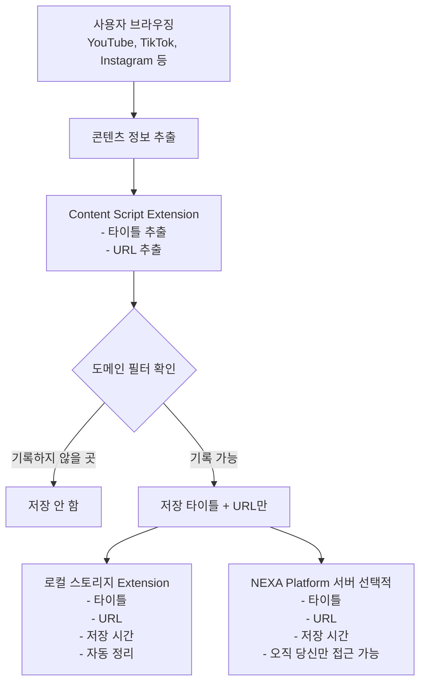
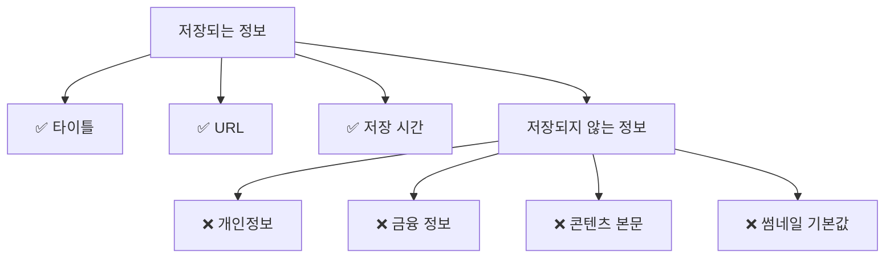
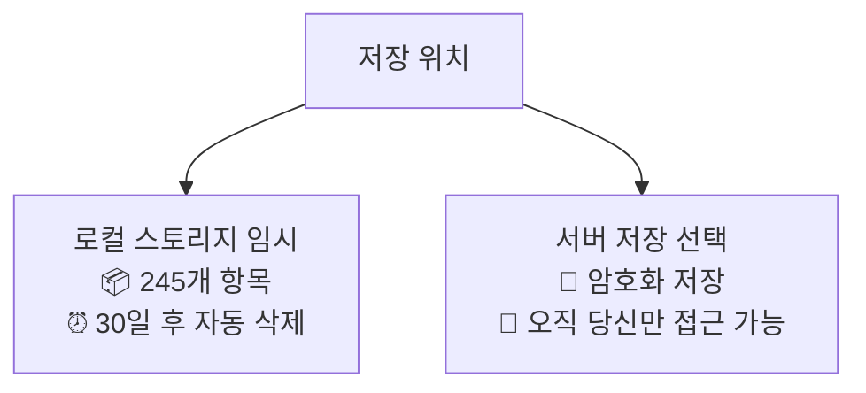
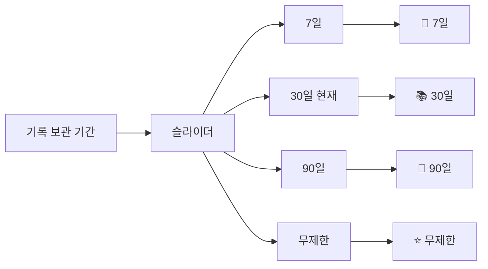
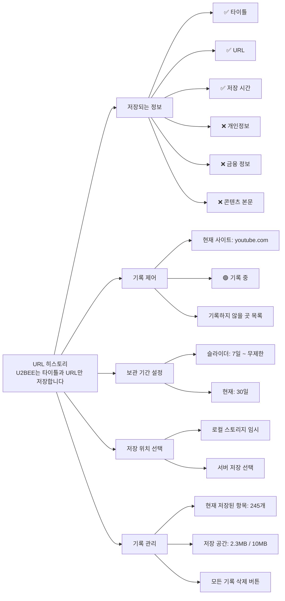

# U2BEE 히스토리 프라이버시 및 데이터 제어 시스템

**작성일**: 2024년 12월  
**버전**: 1.0.0  
**상태**: 기획 단계  
**관련 문서**: [U2BEE V3 NEXA Platform 통합 기획서](./U2BEE_V3_NEXA_Platform_통합_기획서.md)

---

## 목차

1. [개요](#개요)
2. [핵심 설계 철학](#핵심-설계-철학)
3. [데이터 제어 시스템 구조](#데이터-제어-시스템-구조)
4. [가치 중심의 선언적 메시지](#가치-중심의-선언적-메시지)
5. [데이터 흐름의 시각적 명료함](#데이터-흐름의-시각적-명료함)
6. [필터링의 자동화와 직관적인 개인 설정](#필터링의-자동화와-직관적인-개인-설정)
7. [UI 네이밍 전략](#ui-네이밍-전략)
8. [프라이버시 대시보드 설계](#프라이버시-대시보드-설계)
9. [구현 가이드](#구현-가이드)
10. [기술적 세부사항](#기술적-세부사항)

---

## 개요

### 목적

히스토리 기능은 사용자의 탐색 기록을 저장하는 기능입니다. 이 문서는 **최소한의 정보만 저장**하여 사용자의 신뢰를 얻는 설계 전략을 제시합니다.

### 저장하는 정보

**U2BEE는 오직 다음 정보만 저장합니다:**

-   **타이틀 (Title)**: 콘텐츠의 제목
-   **URL**: 콘텐츠의 주소

**저장하지 않는 정보:**

-   개인정보 (이름, 이메일, 전화번호 등)
-   금융 정보
-   콘텐츠 본문
-   썸네일 이미지 (선택적, 별도 설정)
-   기타 민감 정보

### 핵심 목표

1. **투명성**: 저장하는 정보를 명확히 제시
2. **단순성**: 복잡한 설명 없이 핵심만 전달
3. **통제권**: 사용자가 언제든지 기록을 중단하거나 삭제 가능
4. **최소 정보 원칙**: 필요한 최소한의 정보만 저장

---

## 핵심 설계 철학

### 1. 최소 정보 원칙

**"우리는 타이틀과 URL만 저장합니다."**

-   저장하는 정보를 명확히 제시
-   불필요한 설명 없이 핵심만 전달
-   사용자가 저장되는 정보를 정확히 알 수 있도록

### 2. 투명성

-   저장되는 정보를 한눈에 보여줌
-   타이틀과 URL만 저장됨을 명확히 표시
-   복잡한 설명 대신 **단순하고 명확한** 메시지

### 3. 사용자 통제권

-   언제든지 기록을 중단할 수 있음
-   현재 사이트에서 버튼 하나로 즉시 제어
-   저장된 기록은 언제든지 삭제 가능

### 4. 단순한 용어

-   기술 용어 대신 **일상적인 언어** 사용
-   "타이틀", "URL", "기록" 등 직관적인 용어
-   과도한 은유나 복잡한 표현 지양

### 5. 시각적 온기 (Visual Warmth)

-   명확한 로직 위에 **전구빛 테마**로 감성적 완충제 제공
-   상태 변화를 시각적으로 표현 (호흡하는 역광, 입자 효과)
-   설정의 결과를 직관적으로 체험할 수 있도록

---

## 데이터 제어 시스템 구조

### 저장 프로세스



### 저장되는 데이터 구조

```javascript
{
  title: "비디오 제목",        // 타이틀만
  url: "https://youtube.com/...",  // URL만
  timestamp: 1234567890,      // 저장 시간
  platform: "youtube"         // 플랫폼 식별 (선택적)
}
```

### 데이터 생명 주기

1. **추출**: 타이틀과 URL만 추출
2. **확인**: 도메인 블랙리스트 확인
3. **저장**: 타이틀과 URL만 저장
4. **관리**: 사용자가 언제든지 조회/삭제 가능
5. **삭제**: 보관 기간 경과 시 자동 삭제 또는 사용자 수동 삭제

---

## 핵심 메시지

### 메인 메시지

**"U2BEE는 타이틀과 URL만 저장합니다."**

### 메시지 배치 위치

1. **첫 실행 시**: 환영 화면의 중심 메시지
2. **설정 페이지**: 상단 고정 배너
3. **히스토리 탭**: 헤더 섹션
4. **기록 제어 섹션**: 현재 사이트 제어 버튼 옆

### 추가 약속 메시지

-   **"타이틀과 URL만 저장합니다. 개인정보는 저장하지 않습니다."**
-   **"저장된 기록은 언제든지 삭제할 수 있습니다."**
-   **"기록하지 않을 사이트를 선택할 수 있습니다."**

---

## 저장 정보 시각화

### 간단한 정보 표시

설정 창에 **저장되는 정보**를 명확히 표시합니다.

#### 저장되는 정보



**시각적 요소:**

-   체크마크와 X 마크로 명확히 구분
-   저장되는 정보는 녹색, 저장되지 않는 정보는 회색
-   간단하고 직관적인 아이콘 사용

#### 저장 위치



**시각적 요소:**

-   저장 위치별 아이콘과 통계
-   저장 상태 실시간 표시

---

## 기록 제어 설정

### 기본값 설정 (중요)

**설정 없이도 안전하도록 보수적인 기본값 사용**

#### 기본 설정

-   **기록 기능**: 기본적으로 활성화 (사용자가 원하면 즉시 사용 가능)
-   **보관 기간**: 7일 (짧은 기간으로 설정하여 스토리지 문제 예방)
-   **서버 저장**: 비활성화 (로컬 스토리지만 사용)
-   **기록하지 않을 곳**: 빈 목록 (모든 사이트 기록)

#### 설계 철학

-   설정의 피로도를 줄이기 위해 **보수적인 기본값** 제공
-   사용자가 설정하지 않아도 안전하다는 인상
-   필요할 때만 설정을 변경하도록 유도

### 현재 사이트 제어

#### 직관적인 제어 방법

**현재 접속 중인 사이트에서 버튼 하나로 즉시 기록 중단/재개**

#### UI 설계

1. **현재 사이트 제어 버튼**

    ```mermaid
    graph TD
        A[현재 사이트: youtube.com] --> B[🟢 기록 중]
        A --> C[🔴 기록 중단]
    ```

2. **토글 버튼**

    - 녹색: 기록 중 (기본값)
    - 빨간색: 기록 중단
    - 클릭 시 즉시 상태 변경 및 시각적 피드백

3. **기록하지 않을 곳 목록**
    - 기록하지 않을 사이트 목록 표시
    - 각 항목 옆에 삭제 버튼 제공 (기록 재개)
    - 용어: "블랙리스트" 대신 "기록하지 않을 곳" 또는 "보호 구역" 사용

#### 구현 예시

```vue
<template>
    <div class="domain-control">
        <div class="current-site">
            <q-icon name="language" />
            <span>{{ currentDomain }}</span>
            <q-toggle v-model="isRecording" :label="isRecording ? '기록 중' : '기록 중단'" :color="isRecording ? 'positive' : 'negative'" @update:model-value="toggleRecording" />
        </div>

        <q-list v-if="excludedDomains.length > 0">
            <q-item-label header>기록하지 않을 곳</q-item-label>
            <q-item v-for="domain in excludedDomains" :key="domain">
                <q-item-section>{{ domain }}</q-item-section>
                <q-item-section side>
                    <q-btn icon="close" flat dense @click="removeFromExcluded(domain)" />
                </q-item-section>
            </q-item>
        </q-list>
    </div>
</template>
```

### 보관 기간 설정

#### 슬라이더 설계



#### 구현 예시

```vue
<template>
    <div class="retention-slider">
        <q-slider v-model="retentionDays" :min="7" :max="365" :step="1" :label="true" :label-value="`${retentionDays}일`" @update:model-value="updateRetention" />

        <div class="slider-labels">
            <span :class="{ active: retentionDays <= 7 }"> 📝 7일 </span>
            <span :class="{ active: retentionDays > 7 && retentionDays <= 30 }"> 📚 30일 </span>
            <span :class="{ active: retentionDays > 30 && retentionDays <= 90 }"> 📖 90일 </span>
            <span :class="{ active: retentionDays > 90 }"> ⭐ 무제한 </span>
        </div>
    </div>
</template>

<script setup>
import { ref } from "vue";

const retentionDays = ref(30);

function updateRetention(days) {
    retentionDays.value = days;
    // 설정 저장
}
</script>
```

---

## UI 네이밍 전략

### 단순하고 명확한 용어

| 기능        | 용어                                    | 사용 위치                             |
| ----------- | --------------------------------------- | ------------------------------------- |
| 기록 시작   | **기록 중**                             | 현재 사이트 제어 버튼                 |
| 기록 중단   | **기록 중단**                           | 현재 사이트 제어 버튼                 |
| 저장된 기록 | **히스토리**                            | 탭 이름                               |
| 내부 타이틀 | **URL 히스토리**                        | 화면 내부 제목                        |
| 기록 삭제   | **기록 삭제**                           | 삭제 버튼                             |
| 기록 설정   | **기록 설정**                           | 설정 섹션 이름                        |
| 자동 삭제   | **자동 삭제**                           | 자동 정리 설명                        |
| 블랙리스트  | **기록하지 않을 곳** 또는 **보호 구역** | UI 표시 (내부 코드는 블랙리스트 유지) |

### 네이밍 원칙

1. **직관성**: 사용자가 의미를 즉시 이해할 수 있어야 함
2. **단순성**: 복잡한 표현 지양, 일상적인 언어 사용
3. **일관성**: 전체 UI에서 동일한 용어 사용
4. **명확성**: 모호한 표현 없이 정확한 의미 전달

---

## 기록 설정 화면 설계

### 탭 이름

**"히스토리"** (메인 탭 이름)

### 내부 타이틀

**"URL 히스토리"** (화면 내부 제목)

### 화면 구조



### 핵심 메시지

**화면 상단에 배치할 핵심 메시지:**

```
┌─────────────────────────────────────────────────────────┐
│                                                          │
│           📝 타이틀과 URL만 저장합니다                    │
│                                                          │
│              개인정보는 저장하지 않으며,                  │
│                                                          │
│              모든 기록은 언제든지 삭제할 수 있습니다.     │
│                                                          │
└─────────────────────────────────────────────────────────┘
```

**시각적 강조:**

-   큰 아이콘 (📝) 중심 배치
-   간단하고 명확한 메시지

### 전구빛 테마 시각화

명확한 로직 위에 **전구빛 테마**로 감성적 완충제를 제공하여 건조함을 방지합니다.

#### 1. 상태의 시각화 (호흡하는 역광)

**기록 중일 때:**

-   하단 역광이 **은은하게 호흡(Pulse)**하는 애니메이션
-   따뜻한 오렌지/골드 톤 (`--nexa-warm-orange`)
-   사용자가 별도의 텍스트 확인 없이도 상태를 직관적으로 인지

**기록 중단 시:**

-   전구의 불이 꺼지듯 빛이 **서서히 사라지는** 애니메이션
-   차분한 딥블루 (`--nexa-deep-blue`)
-   상태 변화를 부드럽게 전달

**구현 예시:**

```scss
.history-settings {
    position: relative;
    padding: 24px;
    border-radius: 12px;
    background: var(--nexa-surface);

    &::before {
        content: "";
        position: absolute;
        bottom: 0;
        left: 0;
        right: 0;
        height: 4px;
        background: var(--nexa-warm-orange);
        opacity: 0.6;
        border-radius: 0 0 12px 12px;
        transition: opacity 0.3s ease;
    }

    &[data-status="recording"]::before {
        animation: pulse-glow 2s ease-in-out infinite;
    }

    &[data-status="paused"]::before {
        background: var(--nexa-deep-blue);
        animation: fade-out 1s ease-out;
    }
}

@keyframes pulse-glow {
    0%,
    100% {
        opacity: 0.4;
        box-shadow: 0 0 8px var(--nexa-warm-orange);
    }
    50% {
        opacity: 0.8;
        box-shadow: 0 0 16px var(--nexa-warm-orange);
    }
}

@keyframes fade-out {
    from {
        opacity: 0.6;
    }
    to {
        opacity: 0.2;
    }
}
```

#### 2. 저장 위치의 공간감 (입자 이동)

**로컬 저장:**

-   내 모니터 안쪽의 **작은 빛**으로 표현
-   가까운 거리의 입자 효과

**서버 저장:**

-   저 멀리 배경의 **웅장한 성단**으로 표현
-   먼 거리의 입자 효과
-   데이터 입자가 이동하는 연출로 **'환원'**의 개념을 시각적으로 완성

**구현 예시:**

```vue
<template>
    <div class="storage-location">
        <div class="local-storage" :class="{ active: useLocalStorage }">
            <div class="particle-canvas" ref="localCanvas"></div>
            <span>로컬 스토리지</span>
        </div>

        <div class="particle-path" v-if="useServerStorage">
            <!-- 입자가 이동하는 경로 -->
        </div>

        <div class="server-storage" :class="{ active: useServerStorage }">
            <div class="particle-canvas" ref="serverCanvas"></div>
            <span>서버 저장</span>
        </div>
    </div>
</template>

<script setup>
import { ref, onMounted } from "vue";

const localCanvas = ref(null);
const serverCanvas = ref(null);
const useLocalStorage = ref(true);
const useServerStorage = ref(false);

onMounted(() => {
    // Canvas 기반 입자 시스템 초기화
    initParticleSystem(localCanvas.value, "local");
    initParticleSystem(serverCanvas.value, "server");
});

function initParticleSystem(canvas, type) {
    // 입자 효과 구현 (Canvas 또는 WebGL)
    // 로컬: 작은 빛, 서버: 멀리 있는 성단
}
</script>
```

#### 3. 슬라이더의 질감 (흔적 입자 밀도)

**보관 기간 슬라이더 조작 시:**

-   캔버스에 쌓여있는 **'흔적 입자'**들의 밀도가 실시간으로 변함
-   슬라이더를 오른쪽으로 이동 (기간 증가) → 입자 밀도 증가
-   슬라이더를 왼쪽으로 이동 (기간 감소) → 입자 밀도 감소
-   설정의 결과를 **직관적으로 체험**할 수 있도록

**구현 예시:**

```vue
<template>
    <div class="retention-slider-container">
        <div class="particle-canvas" ref="particleCanvas"></div>

        <q-slider v-model="retentionDays" :min="7" :max="365" @update:model-value="updateParticleDensity" />
    </div>
</template>

<script setup>
import { ref, watch } from "vue";

const retentionDays = ref(7);
const particleCanvas = ref(null);

function updateParticleDensity(days) {
    // 보관 기간에 비례하여 입자 밀도 조정
    const density = (days / 365) * 100; // 0~100%
    updateParticleSystem(particleCanvas.value, density);
}

watch(retentionDays, (newValue) => {
    updateParticleDensity(newValue);
});
</script>
```

#### 4. 전구빛 캔버스 통합

**전체 화면 배경:**

-   은은한 전구빛 입자 효과를 배경에 배치
-   사용자가 설정을 변경할 때마다 입자들이 반응
-   건조한 설정 화면에 **온기**를 불어넣는 완충제 역할

**구현 원칙:**

-   과도하지 않게, **은은하게** 적용
-   성능을 해치지 않는 수준으로 최적화
-   사용자가 원하면 끌 수 있는 옵션 제공

---

## 구현 가이드

### 1. 컴포넌트 구조

```
src/
├── components/
│   └── history/
│       ├── HistorySettings.vue          # 기록 설정 화면
│       ├── SavedInfoDisplay.vue          # 저장되는 정보 표시
│       ├── DomainControl.vue             # 도메인 제어
│       ├── RetentionSlider.vue           # 보관 기간 슬라이더
│       ├── StorageLocation.vue           # 저장 위치 선택
│       └── HistoryManagement.vue         # 기록 관리
├── stores/
│   └── historyStore.js                  # 기록 설정 상태 관리
└── utils/
    ├── domainFilter.js                   # 도메인 필터
    └── retentionManager.js              # 보관 기간 관리
```

### 2. 상태 관리 (Pinia Store)

```javascript
// stores/historyStore.js
import { defineStore } from "pinia";

export const useHistoryStore = defineStore("history", {
    state: () => ({
        // 도메인 제어
        excludedDomains: [], // UI에서는 "기록하지 않을 곳"으로 표시
        currentDomain: "",
        isRecording: true, // 기본값: 활성화

        // 보관 기간 (보수적인 기본값)
        retentionDays: 7, // 기본값: 7일 (짧은 기간)

        // 저장 위치 (보수적인 기본값)
        useLocalStorage: true, // 기본값: 로컬만 사용
        useServerStorage: false, // 기본값: 서버 저장 비활성화

        // 통계
        totalItems: 0,
        storageUsage: 0,
        storageLimit: 10 * 1024 * 1024, // 10MB
    }),

    getters: {
        retentionLabel: (state) => {
            if (state.retentionDays <= 7) return "7일";
            if (state.retentionDays <= 30) return "30일";
            if (state.retentionDays <= 90) return "90일";
            return "무제한";
        },

        storageUsagePercent: (state) => {
            return (state.storageUsage / state.storageLimit) * 100;
        },

        isDomainExcluded: (state) => (domain) => {
            return state.excludedDomains.includes(domain);
        },
    },

    actions: {
        toggleRecording() {
            this.isRecording = !this.isRecording;
            // Extension에 메시지 전송
            this.sendToExtension({
                type: "toggle-recording",
                domain: this.currentDomain,
                enabled: this.isRecording,
            });
        },

        addToExcluded(domain) {
            // UI에서는 "기록하지 않을 곳"으로 표시, 내부 코드는 excludedDomains 사용
            if (!this.excludedDomains.includes(domain)) {
                this.excludedDomains.push(domain);
                this.saveSettings();
            }
        },

        removeFromExcluded(domain) {
            this.excludedDomains = this.excludedDomains.filter((d) => d !== domain);
            this.saveSettings();
        },

        isDomainExcluded(domain) {
            return this.excludedDomains.includes(domain);
        },

        updateRetention(days) {
            this.retentionDays = days;
            this.saveSettings();
        },

        async clearAllData() {
            // 확인 다이얼로그 표시
            const confirmed = await this.showConfirmDialog("모든 기록을 삭제하시겠습니까?", "이 작업은 되돌릴 수 없습니다.");

            if (confirmed) {
                // Extension에 삭제 요청
                await this.sendToExtension({ type: "clear-all-data" });
                // 서버에도 삭제 요청 (사용)
                if (this.useServerStorage) {
                    await this.clearServerData();
                }
                this.totalItems = 0;
                this.storageUsage = 0;
            }
        },

        saveSettings() {
            // 로컬 스토리지에 저장
            localStorage.setItem(
                "history-settings",
                JSON.stringify({
                    excludedDomains: this.excludedDomains,
                    isRecording: this.isRecording,
                    retentionDays: this.retentionDays,
                    useLocalStorage: this.useLocalStorage,
                    useServerStorage: this.useServerStorage,
                })
            );
        },
    },
});
```

### 3. 도메인 필터

```javascript
// utils/domainFilter.js

export class DomainFilter {
    /**
     * 도메인 블랙리스트 확인
     * @param {string} url - 확인할 URL
     * @returns {boolean} 블랙리스트에 있으면 true
     */
    isBlacklisted(url) {
        try {
            const domain = new URL(url).hostname;
            const blacklist = JSON.parse(localStorage.getItem("blacklisted-domains") || "[]");
            return blacklist.includes(domain);
        } catch {
            return false;
        }
    }

    /**
     * 기록하지 않을 곳에 도메인 추가
     * @param {string} domain - 추가할 도메인
     */
    addToExcluded(domain) {
        // UI에서는 "기록하지 않을 곳"으로 표시, 내부 코드는 excluded 사용
        const excluded = JSON.parse(localStorage.getItem("excluded-domains") || "[]");
        if (!excluded.includes(domain)) {
            excluded.push(domain);
            localStorage.setItem("excluded-domains", JSON.stringify(excluded));
        }
    }

    /**
     * 기록하지 않을 곳에서 도메인 제거
     * @param {string} domain - 제거할 도메인
     */
    removeFromExcluded(domain) {
        const excluded = JSON.parse(localStorage.getItem("excluded-domains") || "[]");
        const filtered = excluded.filter((d) => d !== domain);
        localStorage.setItem("excluded-domains", JSON.stringify(filtered));
    }

    /**
     * 기록하지 않을 곳 목록 가져오기
     * @returns {string[]} 제외된 도메인 목록
     */
    getExcluded() {
        return JSON.parse(localStorage.getItem("excluded-domains") || "[]");
    }
}
```

### 4. 메인 설정 화면 컴포넌트

```vue
<!-- components/history/HistorySettings.vue -->
<template>
    <div class="history-settings">
        <!-- 헤더 메시지 -->
        <div class="settings-header">
            <h2>URL 히스토리</h2>
            <p class="main-message">U2BEE는 타이틀과 URL만 저장합니다.</p>
        </div>

        <!-- 저장되는 정보 표시 -->
        <SavedInfoDisplay />

        <!-- 기록 제어 -->
        <DomainControl />

        <!-- 보관 기간 설정 -->
        <RetentionSlider />

        <!-- 저장 위치 선택 -->
        <StorageLocation />

        <!-- 기록 관리 -->
        <HistoryManagement />
    </div>
</template>

<script setup>
import SavedInfoDisplay from "./SavedInfoDisplay.vue";
import DomainControl from "./DomainControl.vue";
import RetentionSlider from "./RetentionSlider.vue";
import StorageLocation from "./StorageLocation.vue";
import HistoryManagement from "./HistoryManagement.vue";
</script>

<style lang="scss" scoped>
.history-settings {
    padding: 24px;
}

.settings-header {
    text-align: center;
    margin-bottom: 32px;

    h2 {
        color: var(--nexa-text-primary);
        margin-bottom: 16px;
    }

    .main-message {
        color: var(--nexa-text-secondary);
        font-size: 16px;
        line-height: 1.6;
    }
}
</style>
```

---

## 기술적 세부사항

### 1. 저장 데이터 구조

```javascript
{
  title: string,      // 타이틀만
  url: string,        // URL만
  timestamp: number,  // 저장 시간
  platform: string   // 플랫폼 식별 (선택적)
}
```

### 2. 데이터 암호화

-   **로컬 스토리지**: 평문 저장 (Extension 내부이므로)
-   **서버 저장**: AES-256 암호화 (선택적)
-   **전송**: HTTPS + TLS 1.3

### 3. 자동 삭제 스케줄러

-   **실행 주기**: 매일 오전 3시
-   **기준**: 보관 기간 설정에 따라 자동 삭제
-   **임계값**: 저장 공간 80% 초과 시 즉시 정리

### 4. 통계 수집

-   **저장 통계**: 현재 저장된 항목 수, 저장 공간 사용량
-   **개인정보 보호**: 통계에 개인정보 포함 안 함 (타이틀과 URL만 저장하므로)

### 5. Extension 통신

-   **메시지 타입**: `toggle-recording`, `add-blacklist`, `clear-all-data` 등
-   **프로토콜**: `chrome.runtime.sendMessage` 또는 `postMessage` (iframe)
-   **에러 처리**: 통신 실패 시 사용자에게 알림

---

## 참고 사항

### 관련 문서

-   [U2BEE V3 NEXA Platform 통합 기획서](./U2BEE_V3_NEXA_Platform_통합_기획서.md)
-   [NEXA Platform 컴포넌트 표준 계약](../Platform/04-개발/NEXA-컴포넌트_표준_계약.md)
-   [NEXA Platform 네이밍 컨벤션](../Platform/04-개발/NEXA-네이밍_컨벤션.md)

### 구현 우선순위

1. **Phase 1**: 기본 기록 설정 UI (저장되는 정보 표시)
2. **Phase 2**: 도메인 제어 기능
3. **Phase 3**: 보관 기간 설정
4. **Phase 4**: 저장 위치 선택
5. **Phase 5**: 기록 관리 (조회/삭제)

---

**최종 업데이트**: 2024년 12월
