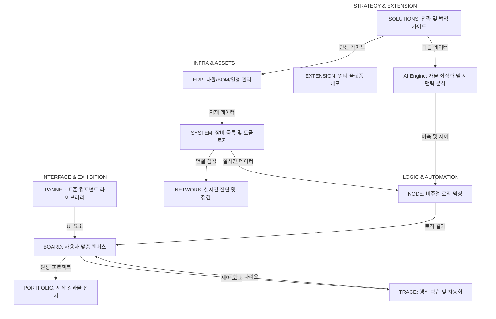
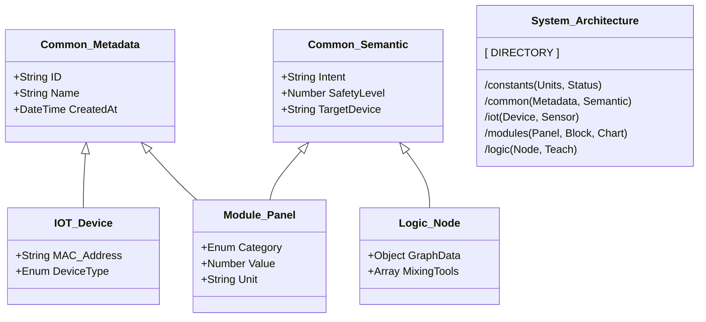
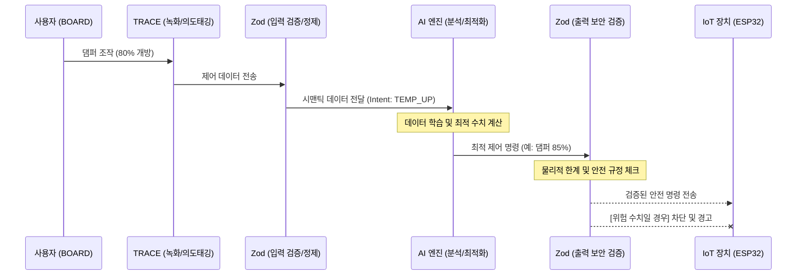
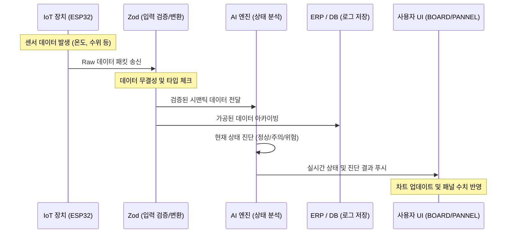

# ✨ NEXA 통합 엔지니어링 생태계 가이드

NEXA 시스템은 하드웨어 제작(캠핑카, 스마트 난로 등)의 **기획-설계-제어-운영** 전 과정을 하나의 생태계에서 관리하는 차세대 통합 플랫폼입니다.
전체 구조를 직관적으로 이해할 수 있도록 각 메뉴의 유기적 관계와 상세 기능을 다음과 같이 정리 합니다.

## ✨ 1. BOARD & PANNEL (인터페이스 환경)

사용자가 시스템과 소통하는 가장 전면의 시각적 인터페이스입니다.

-   **PANNEL (재료 보관소):** NEXA에서 제공하는 표준 UI 컴포넌트 라이브러리입니다. 온도계, 스위치, 차트 등 다양한 타입의 패널을 탐색하고, 각 패널이 어떤 IoT 장비와 연결될지 사전 정의하는 '부품 창고' 역할을 수행합니다.
-   **BOARD (사용자 캔버스):** `PANNEL`에서 가져온 요소들을 자유롭게 배치하는 공간입니다. 사용자는 자신만의 대시보드를 직접 디자인하며, 이후 설명할 `NODE`나 `TRACE`에서 생성된 복잡한 로직 결과물도 이곳에 배치하여 실시간으로 모니터링하고 제어합니다.

## ✨ 2. NODE & TRACE (지능형 로직 생성)

단순한 제어를 넘어 시스템에 '지능'을 부여하는 핵심 엔진입니다.

-   **NODE (비주얼 프로그래밍):** 장치, 패널, 믹싱툴(연산), 번역기 등을 노드 형태로 배치하고 선으로 연결하여 데이터의 흐름을 설계합니다. 예를 들어 '난로 온도 센서' 노드와 '송풍기 제어' 노드 사이에 '비례 제어' 믹싱툴을 연결하여 새로운 제어 로직을 시각적으로 창조합니다.
-   **TRACE (행위 학습 자동화):** 사용자의 실제 조작 패턴을 학습합니다. '녹화'를 누르고 보드에서 수행한 일련의 제어 동작을 데이터화한 뒤, 여기에 **단축키, 예약 시간, 특정 조건(예: 일산화탄소 농도 0.01% 이상 시)** 등을 부여하여 정교한 자동 실행 시나리오를 완성합니다.

## ✨ 3. ERP & PORTFOLIO (자산 및 성과 관리)

프로젝트의 비즈니스적 데이터와 최종 결과물을 관리합니다.

-   **ERP (데이터 허브):** 프로젝트 등록부터 일정, 자원(BOM), 예산 관리를 통합 수행합니다. 특히 장비에서 발생하는 로우 데이터(Raw Data)를 확인하고 재가공하여 업무 문서로 전환하거나, 반대로 ERP에 입력된 업무 지침을 `BOARD`의 패널로 불러와 현장에서 직접 실행할 수 있습니다.

-   **PORTFOLIO (디지털 쇼케이스):** 스마트 난로나 캠핑카와 같이 완성된 제품의 최종 사양, 제작 과정, 결과물을 전시합니다. 이는 단순한 기록을 넘어 차후 유사 프로젝트의 템플릿으로 활용됩니다.

## ✨ 4. SYSTEM & NETWORK (인프라 및 진단)

생태계가 안정적으로 유지될 수 있도록 뒷받침하는 기술적 근간입니다.

-   **SYSTEM (장비 및 흐름 관리):** 보유한 하드웨어의 고유 식별값(MAC Address)을 등록하여 관리합니다. 시스템 전체의 데이터 흐름을 토폴로지 뷰로 시각화하여, 어떤 장비가 어떤 데이터를 주고받는지 한눈에 파악합니다.
-   **NETWORK (전문 진단 툴):** 모든 엣지 디바이스의 네트워크 품질을 실시간 점검합니다. 관리자 모드에서 트러블슈팅을 지원하며, 분산된 장치들의 통신 무결성을 보장합니다.

## ✨ 5. SOLUTIONS & EXTENSION (확장 및 비전)

시스템의 현재를 진단하고 미래로 확장하는 통로입니다.

-   **SOLUTIONS (전략 및 가이드):** 현재 프로젝트의 상태를 거시적으로 분석하고, 캠핑카 법률 기준이나 안전 수칙 같은 전문 지식을 제공하여 미래 비전을 제시합니다.
-   **EXTENSION (멀티 플랫폼 확장):** 웹 브라우저뿐만 아니라 PC 전용 프로그램, 크롬 확장 프로그램, 각 엣지 디바이스 전용 UI 등 다양한 환경에서 동일한 관리 경험을 할 수 있도록 확장 인터페이스를 배포합니다.

#### ✨ 핵심 기능 기반 사용자 시나리오: (예:스마트 캠핑카 구축)

1.  **설계 및 자원 관리 (ERP):** 캠핑카에 필요한 100W 솔라 패널 4개와 250A 배터리 등의 부품을 등록하고 예산을 산정합니다.
2.  **로직 구성 (NODE):** 배터리 잔량 데이터와 태양광 충전 데이터를 믹싱하여 효율을 계산하는 노드를 설계합니다.
3.  **자동화 학습 (TRACE):** "배터리 전압이 12V 이하로 떨어지면 냉장고를 절전 모드로 전환"하는 동작을 녹화하고 조건을 부여하여 자동화합니다.
4.  **대시보드 배치 (BOARD):** `PANNEL`에서 전압 게이지와 온도 차트를 선택해 `BOARD`에 배치하고, 위에서 만든 자동화 스위치를 추가하여 실시간 관리 화면을 완성합니다.
5.  **규정 준수 확인 (SOLUTIONS):** 제작 중 차량 돌출부위가 전체 길이의 1/10을 넘지 않는지 법적 가이드라인을 확인하며 안전하게 제작합니다.

---

## ✨ NEXA 시스템 구현을 위한 코딩 가이드라인

NEXA 생태계의 기술적 완성도를 높이기 위해, 핵심 모듈인 **Chart, Diagram, Block**을 구현할 때 준수해야 할 개발 원칙과 구조를 정의합니다. 이 가이드는 하드웨어 데이터와 UI 간의 유기적인 연결을 보장하는 데 목적이 있습니다.

### ✨ 1. Chart (D3.js 기반 실시간 데이터 시각화)

차트는 단순한 출력을 넘어 사용자가 직접 데이터를 조작하는 인터페이스 역할을 합니다.

-   **데이터 바인딩 원칙:** 모든 차트는 `INFRA`에서 수집된 실시간 센서 데이터와 1:1로 매핑되어야 합니다.

-   **인터렉티브 제어:** 사용자가 차트상의 임계치(Threshold) 라인을 드래그하면, 해당 수치가 `NODE`의 파라미터로 즉시 환산되어 엣지 디바이스로 피드백되어야 합니다.
-   **성능 최적화:** 초당 수십 회 발생하는 온도/전압 데이터를 효율적으로 처리하기 위해 D3.js의 `enter-update-exit` 패턴을 엄격히 준수하여 불필요한 DOM 재생성을 방지합니다.

### ✨ 2. Diagram (D3.js 기반 로직 및 연결 시각화)

`NEXA NODE`와 `NEXA TRACE`의 핵심 엔진으로, 복잡한 시스템의 논리적 흐름을 정의합니다.

-   **노드 기반 아키텍처:** 각 하드웨어(MAC Address 기반)와 소프트웨어 로직은 독립적인 노드 객체로 추상화됩니다.
-   **시각적 시뮬레이션:** D3.js의 Force-directed Graph 등을 응용하여 데이터가 흐르는 방향과 속도를 애니메이션으로 표현, 사용자가 로직의 정상 작동 여부를 직관적으로 파악하게 합니다.
-   **상태 레코딩 (TRACE 연동):** 다이어그램 내에서 발생하는 모든 상태 변화는 JSON 형태로 직렬화되어 `TRACE` 모듈에 저장될 수 있는 구조를 가져야 합니다.

### ✨ 3. Block (컴포넌트 중심 범용 UI 단위)

시스템 로직과는 별개로 사용자 편의와 범용적인 정보를 제공하는 재사용 가능 모듈입니다.

-   **컴포넌트 독립성:** 블록은 외부 데이터에 의존하지 않는 독립적인 상태(State)를 가지며, `BOARD` 어디에 배치되어도 동일한 레이아웃과 기능을 보장해야 합니다.
-   **기능성 확장:** 날씨, 시간 같은 단순 UI 외에도 `ERP`의 계산식을 내장한 '와트수 계산기'나 '법령 체크 리스트'와 같은 도구형 블록을 포함합니다.
-   **속성 정의 (Props):** 각 블록은 `padding: clamp()`와 같은 반응형 속성을 포함하여, 다양한 엣지 디바이스 환경(`EXTENSION`)에서 최적화된 비율로 렌더링되어야 합니다.

### ✨ 개발 프로세스 통합 시나리오

1.  **데이터 정의:** `ERP`에 등록된 부품의 사양(예: 배터리 250A)을 `Chart` 모듈의 스케일(Scale) 최대치로 자동 설정합니다.
2.  **로직 매핑:** `NODE`에서 D3.js 다이어그램을 통해 '태양광 충전 차트'와 '배터리 잔량 차트'를 연결하여 실시간 효율을 계산합니다.
3.  **UI 완성:** 최종적으로 `BOARD` 위에 핵심 제어 차트와 함께 시계, 날씨 등의 `Block`을 배치하여 사용자 맞춤형 관리 화면을 구축합니다.

> **결론:** D3.js의 유연성과 Block의 재사용성을 결합함으로써, NEXA는 하드웨어 엔지니어링 데이터를 가장 완벽하게 소프트웨어로 형상화할 수 있는 토대를 갖추게 됩니다.

---

## ✨ NEXA 시스템 통합 스키마 아키텍처 (Standard Directory Structure)

-   수많은 IoT 장비와 복잡한 UI 모듈(Node, Teach, Block 등)을 모두 수용하려면, **원자적 단위(Atomic)**에서 **조립된 단위(Composite)**로 올라가는 계층적 구조
-   Zod를 활용하여 **INFRA 메뉴에서 장치 등록 시 사용할 '장치 등록 스키마'**를 함께 설계

### ✨ 1.시스템 핵심 모듈 규격 스키마 파일 구조 (Schema Directory)

```text
src/schemas/
├── index.ts                 # 모든 스키마의 통합 Entry Point
├── constants/               # 고정값 관리 (Units, Status Codes)
│   ├── units.ts             # °C, V, A, %, L 등 측정 단위
│   └── status.ts            # CONNECTED, ERROR, IDLE 등 상태값
├── common/                  # 모든 스키마의 공통 뼈대
│   ├── metadata.ts          # ID, Name, CreatedAt 등 기본 정보
│   └── semantic.ts          # AI 전용 Intent, SafetyLevel 라벨
├── iot/                     # 하드웨어 및 인프라 관련 (INFRA 메뉴 대응)
│   ├── device.ts            # MAC 주소, 장비 타입 등 등록 규격
│   └── sensor-data.ts       # 실시간 센서 로우 데이터 패킷 규격
├── modules/                 # 핵심 UI 구성 요소 (NEXA 전용 모듈)
│   ├── panel.ts             # PANNEL/BOARD용 개별 UI 스키마
│   ├── block.ts             # BLOCK용 범용 컴포넌트(날씨, 시간 등) 스키마
│   ├── chart.ts             # D3.js 차트 설정 및 데이터 바인딩 규격
│   └── diagram.ts           # 다이어그램 노드/링크 구조 규격
└── logic/                   # 지능형 서비스 관련 (NODE, TRACE 대응)
    ├── node-graph.ts        # 노드 간 연결 및 데이터 믹싱 로직
    └── teach-record.ts      # 조작 녹화 및 자동화 조건(Condition) 스키마

```

### ✨ 2. 구조 설계의 핵심 원칙

-   **Inheritance (상속):** `common/`에 있는 기본 규격을 `iot/`나 `modules/`에서 가져와 확장(Extend)합니다. 이렇게 해야 나중에 `ID` 형식을 바꾸더라도 모든 파일에 한 번에 적용됩니다.
-   **Separation of Concerns (관심사 분리):** \* `iot/`는 하드웨어의 **물리적 특성**에 집중합니다.
-   `modules/`는 해당 데이터를 어떻게 **시각화**할지에 집중합니다.
-   `logic/`은 데이터들이 어떻게 **움직이고 자동화**될지에 집중합니다.

-   **Compatibility (호환성):** `block.ts`나 `chart.ts`는 시스템 데이터뿐만 아니라 외부 데이터(날씨 API 등)도 수용할 수 있도록 유연한 구조(`z.union` 등)를 가집니다.

### ✨ 3. 확장 시나리오 (예: 새로운 '스마트 창문' 추가 시)

1. **INFRA (`iot/device.ts`):** 창문 모터 장치를 시스템에 등록합니다.
2. **PANNEL (`modules/panel.ts`):** 창문 개폐 슬라이더 패널 규격을 정의합니다.
3. **NODE (`logic/node-graph.ts`):** "비가 오면(환경 센서) 창문을 닫는다(액추에이터)"는 로직 스택을 구성합니다.
4. **TRACE (`logic/teach-record.ts`):** 사용자가 직접 창문을 닫는 속도를 녹화하여 자동화 시나리오를 완성합니다.

### ✨ 결론

-   이 구조는 **수만 개의 센서가 추가되어도 폴더별로 분리되어 있어 관리가 가능**하며, Zod를 통해 모든 통로의 데이터 무결성을 보장합니다.
-   실제 코딩에 들어가기 전, 이 구조를 확정 짓는 것만으로도 프로젝트의 절반이 완성된 것이나 다름없습니다.

---

## ✨ NEXA 시스템과 인공지능(AI) 결합을 위한 선제적 구조 설계

NEXA 시스템이 미래에 인공지능과 결합하여 '자율 최적화 난로'나 '지능형 캠핑카 관리자'로 진화하기 위해서는, 현재 구축하는 **Chart, Diagram, Block** 모듈이 단순한 시각화 도구를 넘어 **AI가 해석하고 조작할 수 있는 데이터 구조**를 가져야 합니다.

### 1. 데이터의 전방위 규격화 (Standardized Data Schema)

AI가 시스템을 이해하려면 모든 하드웨어 상태와 사용자 조작이 일관된 형식으로 기록되어야 합니다.

-   **시계열 데이터 로깅 (Time-series Logging):** `INFRA`에서 수집되는 모든 센서 데이터(온도, 전압, 전류)는 밀리초 단위의 타임스탬프와 함께 저장되어야 합니다. 이는 AI가 '원인(댐퍼 조절)'과 '결과(온도 상승)'의 상관관계를 학습하는 기초가 됩니다.

-   **메타데이터 바인딩:** `ERP`에 등록된 부품의 물리적 한계치(예: 배터리 최대 방전률, 가스통 내압 한계)를 AI가 인지할 수 있도록 파라미터화해야 합니다. 이를 통해 AI는 "안전 범위 내의 최적화"를 수행합니다.

### 2. 행위의 시맨틱화 (Semantic Action Mapping)

`TRACE` 메뉴에서 녹화되는 사용자의 동작은 단순한 '좌표 값'이 아니라 '의도된 행위'로 저장되어야 합니다.

-   **의도 기반 태깅:** 사용자가 댐퍼를 닫는 행위를 AI는 "온도 유지 및 연소 시간 연장 모드"라는 의미(Semantic)로 해석할 수 있어야 합니다.
-   **추상화된 명령 체계:** AI가 직접 `NODE`의 연결을 수정하거나 `PANNEL`의 수치를 조절할 수 있도록, 모든 UI 인터렉션은 API 호출 형태로 추상화되어야 합니다.

### 3. 디지털 트윈 구조 (Digital Twin Integration)

`D3.js` 다이어그램과 차트는 단순한 그림이 아니라, 물리적 세계의 복제본(Digital Twin) 역할을 해야 합니다.

-   **가상 시뮬레이션 환경:** AI는 실제 난로를 불태우기 전에 가상 공간에서 `NODE` 로직을 수만 번 테스트해 볼 수 있어야 합니다. D3.js 기반의 다이어그램 구조는 AI가 논리 회로를 시각적으로 이해하고 변형하는 데 유리한 구조를 제공합니다.
-   **피드백 루프 (Feedback Loop):** AI가 제안한 최적 연소 경로를 사용자가 `BOARD`에서 승인하거나 수정하면, 그 피드백이 다시 학습 데이터로 피딩되는 구조가 필요합니다.

### 4. 하이브리드 제어 인터페이스 (LLM + Logic Node)

향후 LLM(거대언어모델)이 NEXA 시스템을 제어하게 될 때를 대비한 인터페이스입니다.

-   **자연어-노드 변환 (Natural Language to Node):** "오늘 밤은 배터리를 아끼면서 실내 온도를 20도로 유지해줘"라는 명령을 받으면, AI가 `NODE` 메뉴에서 관련 센서와 액추에이터를 연결하고 `TRACE`에 저장된 최적 패턴을 불러오는 구조입니다.
-   **솔루션 지식 베이스 연동:** `SOLUTIONS`에 정리된 법적 규제나 안전 수칙을 AI가 상시 학습하여, 사용자가 불법적이거나 위험한 설계를 할 때(`ERP` 작업 중) 실시간으로 경고를 보내야 합니다.

### 5. AI 결합을 위한 핵심 라이브러리 표준 규약 (Draft)

AI와의 통신 및 확장을 위해 다음 규약을 표준화해야 합니다.

-   **JSON State Standard:** 시스템의 현재 모든 상태(온도, 스위치, 네트워크)를 단 하나의 JSON 객체로 표현합니다.
-   **Action Manifest:** AI가 수행할 수 있는 모든 동작(동력 제어, 알림 전송, 일정 변경)을 목록화하여 제공합니다.
-   **Event Stream API:** 모든 변화를 실시간 스트림으로 내보내 AI가 즉각 반응(Reactive)하게 합니다.

> **결론:** AI 결합을 위한 핵심은 **"모든 것을 데이터화하고, 모든 행위에 의미를 부여하는 것"**입니다. `INFRA` - `NODE` - `BOARD`의 흐름은 AI가 개입하기에 매우 훌륭한 논리적 계층 구축

## ✨ 1. NEXA 시스템 서비스 맵 (Service Flow Map)

사용자 시나리오와 메뉴 간의 연결 관계를 나타냅니다.



## ✨ 2. 스키마 아키텍처 및 코딩 가이드 구조 (Data Schema Structure)

Zod 기반의 디렉토리 구조와 상속 관계를 보여줍니다.



## ✨ 3. AI 결합 및 디지털 트윈 흐름 (AI & Digital Twin)

사용자의 동작이 어떻게 시맨틱 데이터로 변환되어 AI에 전달되는지 보여줍니다.





---

## ✨ 1단계: 기초 데이터 규격 정의 (The Foundation)

모든 데이터 패킷에 공통으로 포함될 '식별자'와 '의도'를 정의합니다.

-   **작업 내용**
-   **`common/metadata.ts` 상세 설계:** UUID/NanoID 형식, 타임스탬프, 데이터 소스(장치 ID), 수신 대상 정의.
-   **`common/semantic.ts` 상세 설계:** AI가 해석할 `Intent` 열거형(Enum), `SafetyLevel` 기준(1~5단계) 정의.

-   **체크리스트**
-   [ ] 모든 데이터에 고유 ID가 부여되는가?
-   [ ] 생성 시간과 수정 시간이 표준 ISO 형식으로 포함되었는가?
-   [ ] `Intent` 라벨이 AI 학습에 충분할 만큼 구체적인가?
-   [ ] `SafetyLevel`에 따라 제어 권한을 제한할 로직이 고려되었는가?

## ✨ 2단계: 표준 패널 및 UI 스키마 설계 (The Interface)

`PANNEL` 라이브러리와 `BOARD`에서 사용할 시각화 데이터 규격을 확정합니다.

-   **작업 내용**
-   **표준 `PANNEL` JSON 스키마 설계:** 슬라이더, 스위치, 게이지 등 각 컴포넌트가 공통으로 가질 속성 정의.
-   **'스마트 난로' 전용 패널 규격 정의:** 온도 임계치, 댐퍼 단계, 연료 잔량 표시 등 난로 특화 필드 추가.

-   **체크리스트**
-   [ ] 패널 종류(type)에 따라 입력값이 엄격하게 구분되는가? (예: 스위치는 boolean, 슬라이더는 number)
-   [ ] 유닛(Unit, °C, %) 표시가 자동화되어 있는가?
-   [ ] 패널의 설정값 변경 시 Zod가 실시간으로 유효성을 검사하는가?

## ✨ 3단계: 로직 믹싱 및 노드 연결 설계 (The Logic)

`NODE` 메뉴에서 데이터가 흐르고 가공되는 방식을 정의합니다.

-   **작업 내용**
-   **데이터 믹싱 연산자(Mixing Tools) 정의:** 사칙연산, 비교, 논리곱(AND/OR), 비례 제어(PID) 등 연산 노드 종류 확정.
-   **D3.js 노드 연결 스크립트 프로토타입:** 노드 간 `Input/Output` 데이터 타입이 일치할 때만 선이 연결되도록 하는 검증 로직 구현.

-   **체크리스트**
-   [ ] 서로 다른 데이터 타입(문자열 노드 -> 숫자형 입력) 연결 시 에러를 뱉는가?
-   [ ] 복잡한 연산 노드를 통과한 데이터도 여전히 `metadata`를 유지하는가?
-   [ ] D3.js에서 드래그 앤 드롭으로 연결된 정보가 JSON 데이터로 즉시 변환되는가?

## ✨ 4단계: 통합 테스트 및 AI 피드백 루프 검증 (Integration)

설계한 모든 스키마가 실제 하드웨어와 UI 사이에서 양방향으로 잘 작동하는지 확인합니다.

-   **작업 내용**
-   **End-to-End 데이터 루프 테스트:** UI 조작 -> Zod 검증 -> AI 분석 -> Zod 검증 -> ESP32 실행 -> 피드백 수신 과정 확인.

-   **체크리스트**
-   [ ] AI가 보낸 비정상 제어 신호가 `Zod_Out` 단계에서 정확히 차단되는가?
-   [ ] IoT 장치의 실시간 상태가 `BOARD` 패널에 지연 없이 반영되는가?

---
