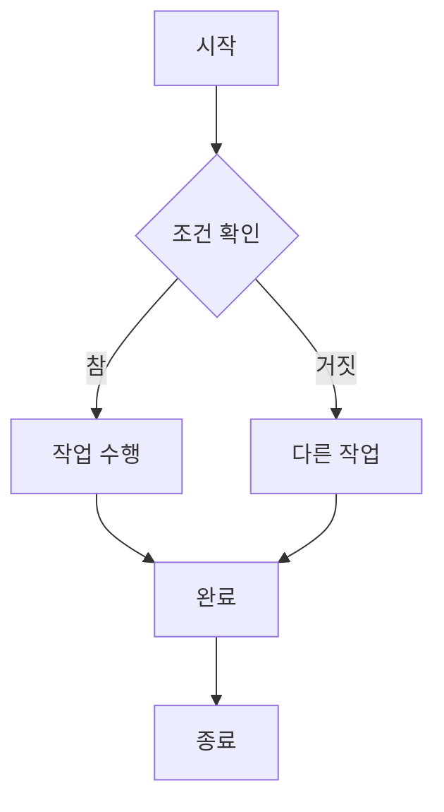
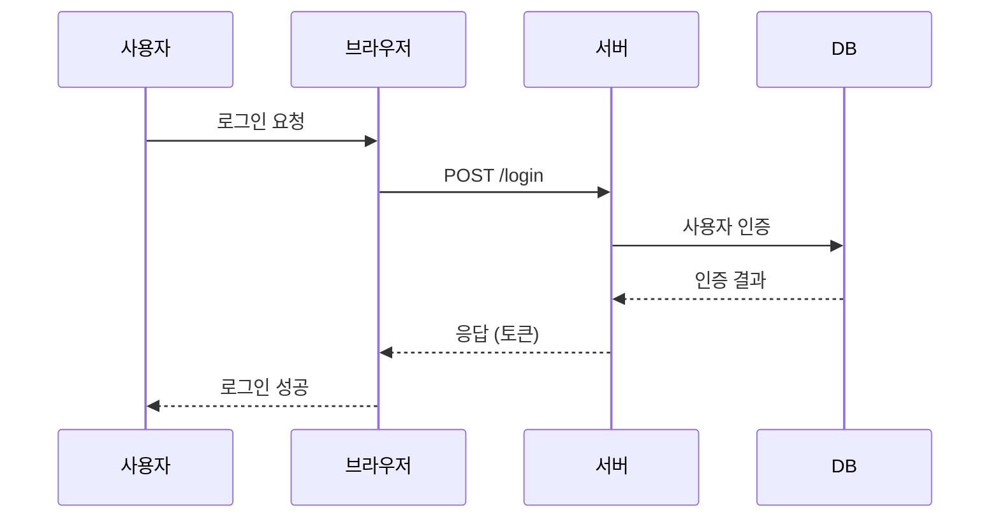
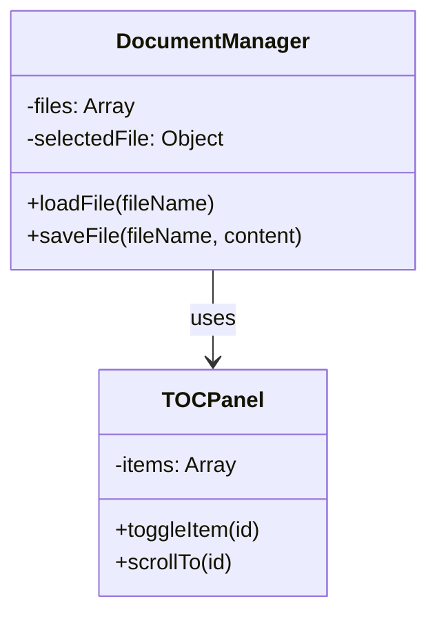
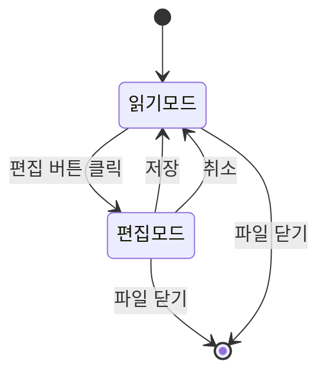
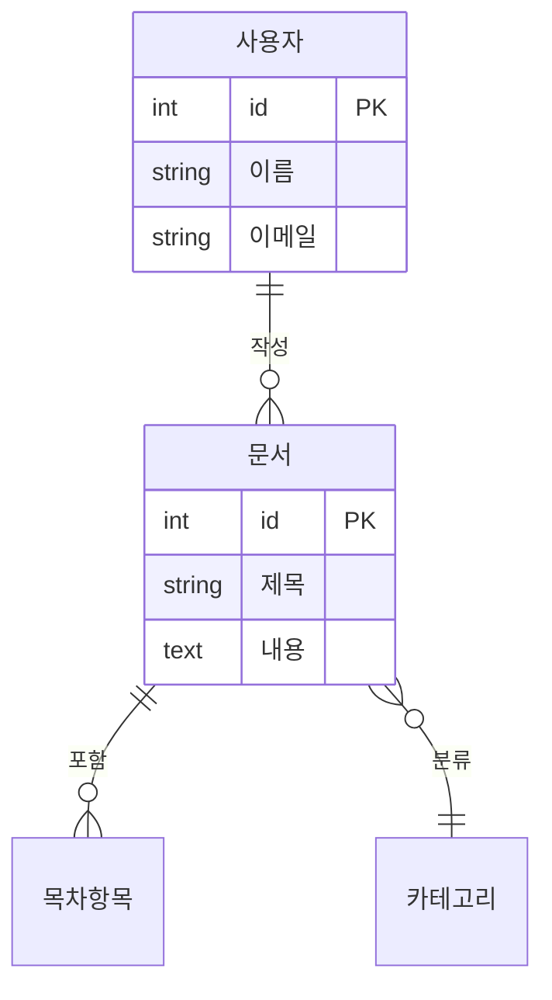
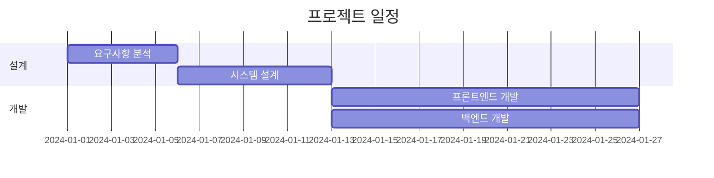
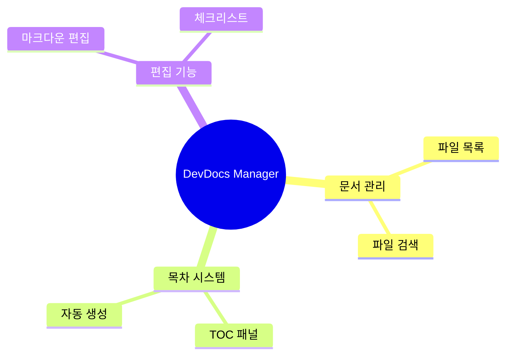

# Mermaid 차트 샘플 문서

이 문서는 DevDocs Manager에서 지원하는 Mermaid 차트의 기본 예제를 보여줍니다.

---

## 1. 플로우차트 (Flowchart)

가장 기본적인 다이어그램 타입입니다. 프로세스 흐름을 표현합니다.



### 사용 예시

- 프로세스 흐름도
- 의사결정 트리
- 시스템 아키텍처

---

## 2. 시퀀스 다이어그램 (Sequence Diagram)

시스템 간 상호작용을 시간순으로 표현합니다.



### 사용 예시

- API 호출 흐름
- 사용자 인터랙션 플로우
- 시스템 간 통신

---

## 3. 클래스 다이어그램 (Class Diagram)

시스템의 클래스 구조와 관계를 표현합니다.



### 사용 예시

- 시스템 설계 문서
- 클래스 구조 설명
- 컴포넌트 관계도

---

## 4. 상태 다이어그램 (State Diagram)

시스템의 상태 변화를 표현합니다.



### 사용 예시

- 상태 머신 모델링
- UI 상태 전환
- 워크플로우

---

## 5. ER 다이어그램 (Entity Relationship)

데이터베이스 스키마를 표현합니다.



### 사용 예시

- 데이터베이스 설계
- 엔티티 관계 설명
- 데이터 모델 문서화

---

## 6. 간트 차트 (Gantt Chart)

프로젝트 일정을 표현합니다.



### 사용 예시

- 프로젝트 일정 관리
- 마일스톤 추적
- 작업 계획 수립

---

## 7. 마인드맵 (Mindmap)

계층적 구조를 표현합니다.



### 사용 예시

- 개념도
- 아이디어 정리
- 기능 구조 표현

---

## 사용 방법

### 코드 블록 문법

모든 Mermaid 차트는 다음과 같이 작성합니다:

````markdown

````

### 기본 규칙

1. **코드 블록**: 백틱 3개(```)로 시작하고 끝남
2. **문법**: 각 차트 타입마다 고유한 문법을 사용
3. **줄바꿈**: 한 줄에 하나의 명령어 작성 권장

### 주의사항

- 복잡한 다이어그램은 여러 개로 나누어 작성하는 것을 권장
- 차트 렌더링에는 약간의 시간이 소요될 수 있음

---

## 다음 단계

필요에 따라 차트 예제를 추가로 작성할 수 있습니다:

- 더 복잡한 플로우차트 예제
- 다양한 시퀀스 다이어그램 패턴
- 복합 시스템 아키텍처 다이어그램

---

## 참고 자료

- [Mermaid 공식 문서](https://mermaid.js.org/)
- [Mermaid 라이브 에디터](https://mermaid.live/)

---

**마지막 업데이트**: 2024년  
**작성자**: DevDocs Manager
