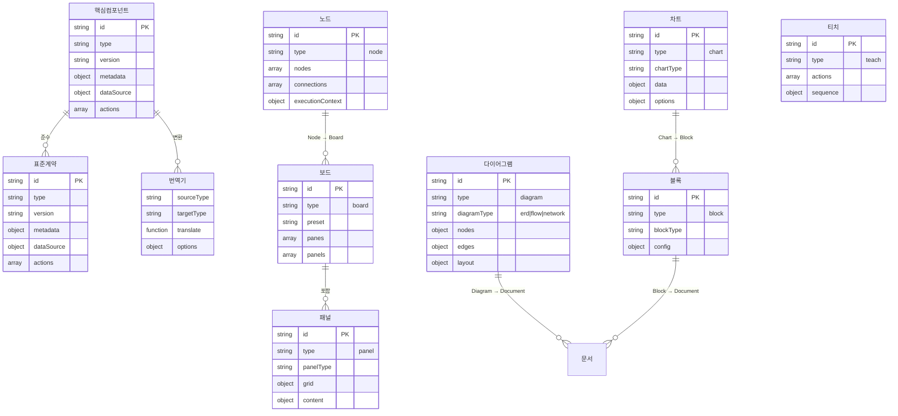

# 개발 가이드 기능 구조 설계

**작성일**: 2024년 12월  
**목적**: 기존 개발 도구와 동일한 구조로 개발 가이드 기능을 구성  
**버전**: 1.0

---

## 📋 개요

개발 가이드 기능은 기존 개발 도구(문서 관리, 에러 트래킹, 테마 관리 등)와 동일한 구조로 구성됩니다. 왼쪽 사이드바 네비게이션, 중앙 컨텐츠 영역, 오른쪽 사이드바 보조 기능 패널로 구성되어 있습니다.

### 개발 방향 및 전략

**현재 단계 (Phase 1): 스타일 중심 기능**

-   당장은 **스타일 가이드** 중심으로 시작
-   UI/디자인 샘플, 색상 시스템, 타이포그래피, 컴포넌트 스타일 등에 집중
-   기본 구조와 샘플 관리 시스템 구축

**향후 확장 (Phase 2+): 통합 개발 가이드**

-   차후 **개발 전체적인 가이드**로 확장
-   코딩 컨벤션, 아키텍처 패턴, 베스트 프랙티스 등 포함
-   개발자가 스스로 정립하고 AI와 대화하기 좋은 기능들 추가

### 핵심 목적

1. **AI 규정 체계화**: 정확한 틀을 만들어서 AI가 항상 파일을 만들 때 이 규정을 따르도록 체계화
2. **개발 표준 정립**: 개발자가 스스로 개발 표준을 정립하고 관리할 수 있는 플랫폼 제공
3. **AI 대화 최적화**: AI와의 대화에서 쉽게 참조할 수 있는 키워드 기반 샘플 시스템 (`@한글명`)
4. **단계적 확장**: 스타일 가이드에서 시작하여 점진적으로 개발 전반 가이드로 확장

### 샘플 관리 방식 (하이브리드 구조)

-   **샘플 파일 독립 관리**: `src/guides/` 폴더에 샘플 파일을 실제로 저장하여 프로젝트 코드와 분리
-   **실제 컴포넌트 렌더링**: Vue 동적 import로 샘플 파일을 로드하여 UI에서 실제로 렌더링
-   **비교 기능**: 실제 프로젝트 컴포넌트와 샘플을 나란히 비교하여 차이점 확인
-   **카테고리 자동 추출**: 폴더 구조에서 자동으로 카테고리를 추출하여 수동 설정 최소화

---

## 🏗️ 전체 구조

### 레이아웃 구성

```
┌─────────────────────────────────────────────────────────┐
│                    MainLayout.vue                       │
├──────────────┬──────────────────────┬───────────────────┤
│              │                      │                   │
│ 왼쪽 사이드바 │    중앙 컨텐츠       │  오른쪽 사이드바   │
│              │                      │                   │
│ DevSidebar   │  DevelopmentPage    │  DevToolsPanel    │
│              │                      │                   │
│ ┌──────────┐ │  ┌────────────────┐ │  ┌─────────────┐ │
│ │DevMenu   │ │  │DevGuide       │ │  │DevGuide     │ │
│ │Slider    │ │  │Content.vue    │ │  │Panel.vue    │ │
│ └──────────┘ │  └────────────────┘ │  └─────────────┘ │
│ ┌──────────┐ │                      │                   │
│ │DevGuide  │ │                      │                   │
│ │Sidebar   │ │                      │                   │
│ │  -Header │ │                      │                   │
│ │  -List   │ │                      │                   │
│ └──────────┘ │                      │                   │
│              │                      │                   │
└──────────────┴──────────────────────┴───────────────────┘
```

---

## 📁 파일 구조

### 전체 파일 구조 개요

```
NEXA-Platform/src/
├── guides/                                        # 샘플 파일 저장 폴더 (새로 추가)
│   ├── styles/                                    # Phase 1: 스타일 가이드 샘플
│   │   ├── charts/
│   │   │   ├── bar/
│   │   │   │   └── NexaChartBar.vue              # 샘플 파일
│   │   │   └── line/
│   │   │       └── NexaChartLine.vue
│   │   ├── panels/
│   │   │   ├── gauge/
│   │   │   │   └── GaugePanel.vue
│   │   │   └── card/
│   │   │       └── CardPanel.vue
│   │   ├── sidebars/
│   │   │   ├── left/
│   │   │   │   └── DevSidebarSample.vue
│   │   │   └── right/
│   │   │       └── DevToolsPanelSample.vue
│   │   └── diagrams/                              # Phase 1: 다이어그램 샘플
│   │       ├── erd/
│   │       │   └── ERDDiagramSample.vue
│   │       ├── flow/
│   │       │   └── FlowDiagramSample.vue
│   │       └── network/
│   │           └── NetworkDiagramSample.vue
│   ├── patterns/                                  # Phase 2+: 아키텍처 패턴 (향후)
│   ├── conventions/                               # Phase 2+: 코딩 컨벤션 (향후)
│   └── best-practices/                            # Phase 2+: 베스트 프랙티스 (향후)
├── diagrams/                                      # 핵심 컴포넌트: 다이어그램 (독립 디렉토리)
├── components/
│   ├── sidebars/
│   │   ├── left/
│   │   │   ├── DevSidebar.vue                    # 메인 사이드바 (통합)
│   │   │   └── dev-tools/
│   │   │       └── dev-guide/
│   │   │           ├── DevGuideHeader.vue         # 헤더 (검색, 필터, 뷰 모드)
│   │   │           └── DevGuideList.vue           # 샘플 목록
│   │   └── right/
│   │       └── dev-tools/
│   │           └── DevGuidePanel.vue              # 샘플 상세 패널
│   └── dev-tools/
│       └── dev-guide/
│           ├── DevGuideContent.vue                 # 메인 컨텐츠
│           ├── sections/
│           │   ├── SampleLibrarySection.vue       # 샘플 라이브러리 섹션
│           │   ├── SampleDetailView.vue            # 샘플 상세 뷰
│           │   ├── DesignDecisionsSection.vue     # 디자인 결정 요소 섹션
│           │   ├── ColorSystemSection.vue         # 색상 시스템
│           │   ├── TypographySection.vue          # 타이포그래피
│           │   ├── SpacingSection.vue             # 간격 시스템
│           │   └── ComponentStyleSection.vue     # 컴포넌트 스타일
│           └── components/
│               ├── SampleCard.vue                 # 샘플 카드 컴포넌트
│               ├── SampleGrid.vue                 # 샘플 그리드
│               ├── SampleFilter.vue               # 샘플 필터
│               ├── TagManager.vue                 # 태그 관리 컴포넌트
│               ├── CodeSnippet.vue                # 코드 스니펫 컴포넌트
│               └── SamplePreview.vue              # 샘플 미리보기 컴포넌트
├── pages/
│   └── DevelopmentPage.vue                        # 개발 페이지 (조건부 렌더링)
├── composables/
│   └── dev-tools/
│       └── useDevGuide.js                         # 상태 관리 composable
└── modules/
    └── dev-guide/
        └── services/
            ├── sampleRegistry.js                  # 샘플 레지스트리 데이터
            ├── sampleManager.js                   # 샘플 관리 서비스
            ├── tagManager.js                      # 태그 관리 서비스
            └── sampleStorage.js                   # 샘플 저장소 (localStorage)
```

### 각 파일의 역할 및 기능

#### 왼쪽 사이드바 컴포넌트

-   **DevGuideHeader.vue**: 검색, 필터, 뷰 모드 전환 기능 제공
-   **DevGuideList.vue**: 샘플 목록 표시 및 선택 기능

#### 중앙 컨텐츠 컴포넌트

-   **DevGuideContent.vue**: 메인 컨텐츠 영역, 샘플 라이브러리 및 상세 뷰 관리
-   **SampleLibrarySection.vue**: 샘플 그리드 및 필터링 UI
-   **SampleDetailView.vue**: 선택된 샘플의 상세 정보 표시
-   **DesignDecisionsSection.vue**: 디자인 결정 요소 문서화
-   **ColorSystemSection.vue**: 색상 시스템 가이드
-   **TypographySection.vue**: 타이포그래피 가이드
-   **SpacingSection.vue**: 간격 시스템 가이드
-   **ComponentStyleSection.vue**: 컴포넌트 스타일 가이드

#### 오른쪽 사이드바 패널

-   **DevGuidePanel.vue**: 선택된 샘플의 태그 관리, AI 참조 키워드 표시

#### Composable

-   **useDevGuide.js**: 개발 가이드 상태 관리 및 로직 (테마 관리의 `useThemeManager.js`와 동일한 패턴)

#### 서비스 모듈 (샘플 일괄 관리)

-   **sampleRegistry.js**: 모든 샘플의 메타데이터를 중앙에서 관리하는 핵심 데이터 파일
-   **sampleManager.js**: 샘플 검색, 필터링, 정렬 로직
-   **tagManager.js**: 태그 추가/삭제 및 자동완성 기능
-   **sampleStorage.js**: localStorage를 통한 최근 사용, 즐겨찾기, 사용 통계 관리

**참고**: 초기 구현 시에는 스타일 가이드 중심으로 시작하되, 확장 가능한 구조로 설계하여 차후 개발 전체 가이드로 확장할 수 있도록 합니다.

---

## 🔄 하이브리드 구조: 샘플 파일 관리 방식

### 핵심 개념

개발 가이드는 **하이브리드 접근 방식**을 사용하여 샘플 파일을 관리합니다:

1. **샘플 파일 독립 관리**: 샘플 파일은 `src/guides/` 폴더에 실제로 저장되어 실제 프로젝트 코드와 분리됩니다.
2. **실제 컴포넌트 렌더링**: 샘플 파일을 Vue의 동적 import로 로드하여 UI에서 실제로 렌더링합니다.
3. **비교 기능**: 실제 프로젝트 컴포넌트와 샘플을 나란히 비교할 수 있습니다.
4. **카테고리 자동 추출**: 폴더 구조에서 자동으로 카테고리를 추출하여 수동 설정을 최소화합니다.

### 장점

#### 1. 샘플 파일 독립 관리

-   `src/guides/` 폴더에 샘플만 저장
-   실제 프로젝트 코드와 완전히 분리
-   샘플 업데이트가 프로젝트 코드에 영향 없음

#### 2. 실제 렌더링 가능

-   Vue 컴포넌트로 동적 로드
-   UI에서 실제 동작 확인 가능
-   플레이스홀더가 아닌 실제 컴포넌트 표시

#### 3. 비교 기능

-   샘플 버전 vs 실제 프로젝트 버전
-   차이점을 시각적으로 확인
-   디자인 결정 사항 검증

#### 4. 자동 카테고리 추출

-   폴더 구조에서 자동 추출 (`src/guides/styles/charts/bar/` → `styles`)
-   명시적 `category` 설정도 가능
-   수동 설정 최소화

### 구조 예시

```
src/
├── guides/                          # 샘플 파일 저장 폴더
│   └── styles/                      # 메인 카테고리: styles
│       └── charts/                  # 서브 카테고리: charts
│           └── bar/
│               └── NexaChartBar.vue # 샘플 파일
└── charts/                          # 실제 프로젝트 컴포넌트
    └── NexaChart.vue                # 실제 프로젝트 파일
```

**샘플 레지스트리 예시**:

```javascript
{
  id: 'nexa-chart-bar',
  componentPath: 'src/guides/styles/charts/bar/NexaChartBar.vue', // 샘플 파일
  referencePath: 'src/charts/NexaChart.vue',                      // 실제 프로젝트 (비교용)
  category: 'styles',                                               // 자동 추출 또는 명시적 설정
  // ...
}
```

### 구현 방법

#### 1. 샘플 파일 동적 로드

```javascript
// DevGuideContent.vue
import { defineAsyncComponent } from "vue";

const sampleComponent = ref(null);
const isLoading = ref(false);
const loadError = ref(null);

async function loadSampleComponent(componentPath) {
    isLoading.value = true;
    loadError.value = null;

    try {
        // 동적 import로 샘플 컴포넌트 로드
        const module = await import(/* @vite-ignore */ componentPath);
        sampleComponent.value = defineAsyncComponent(() => Promise.resolve(module.default));
    } catch (error) {
        loadError.value = error.message;
        console.error("샘플 컴포넌트 로드 실패:", error);
    } finally {
        isLoading.value = false;
    }
}
```

#### 2. 실제 프로젝트 버전 비교

```javascript
const referenceComponent = ref(null);

async function loadReferenceComponent(referencePath) {
    if (!referencePath) return;

    try {
        const module = await import(/* @vite-ignore */ referencePath);
        referenceComponent.value = defineAsyncComponent(() => Promise.resolve(module.default));
    } catch (error) {
        console.error("참조 컴포넌트 로드 실패:", error);
    }
}
```

#### 3. 카테고리 자동 추출

```javascript
// pathCategorizer.js
export function getComponentCategory(componentPath) {
    if (!componentPath) return null;

    const parts = componentPath.split("/").filter((part) => part && part.trim() !== "");

    // 'guides' 다음의 첫 번째 디렉토리를 카테고리로 사용
    const guidesIndex = parts.findIndex((part) => part === "guides");
    if (guidesIndex >= 0 && guidesIndex < parts.length - 1) {
        return parts[guidesIndex + 1];
    }

    return null;
}
```

### 주의사항

1. **동적 import 경로 처리**: Vite/Vue의 동적 import 제약을 고려하여 경로 변환이 필요할 수 있습니다.
2. **샘플 컴포넌트 props**: 샘플 렌더링용 props를 `sampleRegistry`에 정의해야 합니다.
3. **에러 처리**: 파일이 없거나 컴포넌트 로드 실패 시 적절한 에러 메시지를 표시해야 합니다.
4. **성능**: 필요 시에만 로드 (lazy loading)하고, 캐싱을 고려해야 합니다.

---

## 📁 상세 파일 구조

### 1. 왼쪽 사이드바 (Left Sidebar)

#### 1.1 메인 사이드바 컴포넌트

**위치**: `NEXA-Platform/src/components/sidebars/left/DevSidebar.vue`

**역할**: 개발 도구 전체의 왼쪽 사이드바 컨테이너

**구조**:

-   `LeftSidebarHeader`: 공통 헤더
-   `DevMenuSlider`: 개발 도구 메뉴 슬라이더 (문서 관리, 에러 트래킹, **개발 가이드** 등)
-   각 도구별 사이드바 컴포넌트 (조건부 렌더링)

**개발 가이드 관련 코드**:

```vue
<!-- DevSidebar.vue -->
<template>
    <div class="dev-sidebar">
        <!-- 공통 헤더 -->
        <LeftSidebarHeader title="DEV" subtitle="개발 문서 및 요구사항 관리" />

        <!-- DevMenuSlider (항상 표시) -->
        <DevMenuSlider @update:active-menu="handleActiveMenuChange" />

        <!-- 개발 가이드 헤더 및 리스트 (activeMenu === 'dev-guide') -->
        <template v-else-if="activeMenu === 'dev-guide'">
            <DevGuideHeader
                :categories="devGuideCategories"
                :search-query="devGuideSearchQuery"
                :filter-category="devGuideFilterCategory"
                :filter-tags="devGuideFilterTags"
                :view-mode="devGuideViewMode"
                @search-change="handleDevGuideSearchChange"
                @filter="handleDevGuideCategoryFilterChange"
                @tags-change="handleDevGuideTagsFilterChange"
                @view-mode-change="handleDevGuideViewModeChange"
                @refresh="handleDevGuideRefresh"
                @open-settings="openSettings"
            />

            <!-- 개발 가이드 리스트 -->
            <DevGuideList :samples="devGuideFilteredSamples" :search-query="devGuideSearchQuery" :selected-sample="devGuideSelectedSample" :view-mode="devGuideViewMode" @sample-selected="handleDevGuideSampleSelect" />
        </template>
    </div>
</template>

<script setup>
import DevGuideHeader from "./dev-tools/dev-guide/DevGuideHeader.vue";
import DevGuideList from "./dev-tools/dev-guide/DevGuideList.vue";
import { useDevGuide } from "src/composables/dev-tools/useDevGuide.js";

// 개발 가이드 관리 (composable 사용)
const {
    categories: devGuideCategories,
    filteredSamples: devGuideFilteredSamples,
    selectedSample: devGuideSelectedSample,
    searchQuery: devGuideSearchQuery,
    filterCategory: devGuideFilterCategory,
    filterTags: devGuideFilterTags,
    viewMode: devGuideViewMode,
    handleSearchChange: handleDevGuideSearchChange,
    handleCategoryFilterChange: handleDevGuideCategoryFilterChange,
    handleTagsFilterChange: handleDevGuideTagsFilterChange,
    handleViewModeChange: handleDevGuideViewModeChange,
    handleSampleSelect: handleDevGuideSampleSelect,
    refresh: handleDevGuideRefresh,
    loadCategories: loadDevGuideCategories,
} = useDevGuide();
</script>
```

#### 1.2 개발 가이드 전용 사이드바 컴포넌트

**위치**: `NEXA-Platform/src/components/sidebars/left/dev-tools/dev-guide/`

**파일 구조**:

```
dev-guide/
├── DevGuideHeader.vue          # 헤더 컴포넌트 (검색, 필터, 뷰 모드)
└── DevGuideList.vue             # 샘플 목록 컴포넌트
```

---

## 📐 왼쪽 사이드바 UI 구성 계획

### 전체 구조 개요

왼쪽 사이드바는 **DevGuideHeader**와 **DevGuideList** 두 개의 주요 컴포넌트로 구성됩니다. 테마 관리 기능과 유사한 구조를 따르되, 개발 가이드의 특성에 맞게 확장 가능한 구조로 설계합니다.

```
┌─────────────────────────────────┐
│  DevGuideHeader                 │
│  ┌───────────────────────────┐ │
│  │ 검색 입력                  │ │
│  └───────────────────────────┘ │
│  ┌───────────────────────────┐ │
│  │ 카테고리 필터              │ │
│  └───────────────────────────┘ │
│  ┌───────────────────────────┐ │
│  │ 뷰 모드 전환               │ │
│  │ [평면] [계층]              │ │
│  └───────────────────────────┘ │
│  ┌───────────────────────────┐ │
│  │ 액션 버튼                  │ │
│  │ [새로고침] [설정]          │ │
│  └───────────────────────────┘ │
├─────────────────────────────────┤
│  DevGuideList                   │
│  ┌───────────────────────────┐ │
│  │ 샘플 목록 (아코디언)       │ │
│  │ ▼ 샘플 라이브러리          │ │
│  │   ├─ 최근 사용             │ │
│  │   ├─ 즐겨찾기              │ │
│  │   └─ 전체 샘플             │ │
│  └───────────────────────────┘ │
│  ┌───────────────────────────┐ │
│  │ 통계 (아코디언)            │ │
│  │ ▶ 통계                     │ │
│  └───────────────────────────┘ │
└─────────────────────────────────┘
```

---

### DevGuideHeader.vue - 상세 UI 구성

#### Phase 1: 스타일 중심 기능 (현재 단계)

**역할**: 개발 가이드 헤더 - 검색, 필터, 뷰 모드 전환

**UI 구성**:

1. **검색 섹션**

    - 검색 입력 필드
    - 플레이스홀더: "샘플 검색 (키워드, 태그)"
    - 검색 아이콘 (prepend)
    - 클리어 버튼 (clearable)
    - 실시간 검색 결과 업데이트

2. **필터 섹션**

    - 카테고리 필터 드롭다운
        - 옵션: NexaChart, NexaPanel, LeftSidebar, ContentArea, RightSidebar 등
        - 필터 아이콘 (prepend)
        - 클리어 가능
    - 태그 필터 (향후 구현)
        - 태그 자동완성 입력
        - 선택된 태그 표시

3. **뷰 모드 전환**

    - 버튼 토글 그룹
        - 평면 분류 (view_list 아이콘)
        - 계층적 분류 (account_tree 아이콘)
    - 현재 선택된 모드 하이라이트

4. **액션 버튼**
    - 새로고침 버튼 (refresh 아이콘)
        - 샘플 목록 새로고침
    - 설정 버튼 (settings 아이콘)
        - 개발 가이드 설정 다이얼로그 (향후 구현)

**레이아웃 구조**:

```
┌─────────────────────────────────┐
│ 검색 입력                        │
│ [🔍 샘플 검색 (키워드, 태그)  ✕] │
├─────────────────────────────────┤
│ 카테고리 필터                    │
│ [🔽 카테고리 선택            ✕] │
├─────────────────────────────────┤
│ 뷰 모드                          │
│ [📋 평면] [🌳 계층]              │
├─────────────────────────────────┤
│ 액션                             │
│ [🔄] [⚙️]                        │
└─────────────────────────────────┘
```

#### Phase 4+: 개발 가이드로 확장 시 추가 기능

**추가될 UI 요소**:

1. **가이드 타입 필터** (새로 추가)

    - 스타일 가이드
    - 코딩 컨벤션
    - 아키텍처 패턴
    - 베스트 프랙티스
    - 전체

2. **정렬 옵션** (향후 추가)

    - 이름순
    - 카테고리순
    - 최근 수정순
    - 사용 빈도순

3. **고급 필터** (향후 추가)
    - 프로젝트별 필터 (Platform, Desktop, Edge, Mobile)
    - 난이도 필터 (초급, 중급, 고급)
    - 태그 다중 선택

---

### DevGuideList.vue - 상세 UI 구성

#### Phase 1: 스타일 중심 기능 (현재 단계)

**역할**: 샘플 목록 표시 및 관리

**UI 구성**:

1. **샘플 라이브러리 아코디언** (기본 열림)

    - 아이콘: `style` 또는 `palette`
    - 라벨: "샘플 라이브러리"
    - 내부 탭 구조:
        - **최근 사용 탭** (schedule 아이콘)
            - 최근 선택한 샘플 목록 (최대 20개)
            - 각 샘플 항목:
                - 샘플 아이콘
                - 샘플 이름
                - 카테고리 뱃지
                - 태그 (최대 3개)
                - 즐겨찾기 버튼
                - 삭제 버튼
        - **즐겨찾기 탭** (star 아이콘)
            - 즐겨찾기로 등록한 샘플 목록
            - 드래그 앤 드롭으로 순서 변경 가능
        - **전체 샘플 탭** (list 아이콘)
            - 모든 샘플 목록
            - 평면 분류 모드: 카테고리별 그룹화
            - 계층적 분류 모드: 계층 구조로 표시

2. **통계 아코디언** (기본 닫힘)
    - 아이콘: `analytics`
    - 라벨: "통계"
    - 통계 액션 버튼들:
        - 전체 통계 분석
        - 인기 샘플
        - 미사용 샘플
        - 카테고리별 통계
        - 사용 빈도 통계

**샘플 항목 UI 구조**:

```
┌─────────────────────────────────┐
│ [아이콘] 샘플 이름               │
│        카테고리 뱃지             │
│        [태그1] [태그2] [태그3]   │
│                          [⭐] [✕]│
└─────────────────────────────────┘
```

**평면 분류 모드**:

```
┌─────────────────────────────────┐
│ 샘플 라이브러리                  │
│ ▼ 전체 샘플                      │
│   ┌───────────────────────────┐ │
│   │ [아이콘] 막대 그래프      │ │
│   │        NexaChart          │ │
│   │        [차트] [막대]      │ │
│   └───────────────────────────┘ │
│   ┌───────────────────────────┐ │
│   │ [아이콘] 게이지 패널       │ │
│   │        NexaPanel          │ │
│   │        [패널] [게이지]     │ │
│   └───────────────────────────┘ │
└─────────────────────────────────┘
```

**계층적 분류 모드**:

```
┌─────────────────────────────────┐
│ 샘플 라이브러리                  │
│ ▼ 전체 샘플                      │
│   ▼ Chart                       │
│     ▼ NexaChart                 │
│       ▼ Bar                     │
│         ┌─────────────────────┐ │
│         │ [아이콘] 막대 그래프│ │
│         └─────────────────────┘ │
│       ▼ Line                    │
│         ┌─────────────────────┐ │
│         │ [아이콘] 선 그래프  │ │
│         └─────────────────────┘ │
└─────────────────────────────────┘
```

#### Phase 4+: 개발 가이드로 확장 시 추가 UI

**추가될 UI 요소**:

1. **가이드 타입별 아코디언** (새로 추가)

    - 스타일 가이드 (기존 샘플 라이브러리)
    - 코딩 컨벤션
        - 네이밍 규칙 샘플
        - 파일 구조 패턴
        - 코드 스타일 샘플
    - 아키텍처 패턴
        - 컴포넌트 구조 패턴
        - 상태 관리 패턴
        - 통신 패턴
    - 베스트 프랙티스
        - 에러 처리 패턴
        - 성능 최적화
        - 접근성 가이드

2. **빠른 액세스 섹션** (향후 추가)

    - 자주 사용하는 샘플 (최대 5개)
    - 최근 검색어
    - 추천 샘플 (AI 기반)

3. **필터 상태 표시** (향후 추가)
    - 현재 적용된 필터 표시
    - 필터 초기화 버튼
    - 필터 저장/불러오기

---

### UI 상호작용 및 상태 관리

#### 검색 및 필터링

1. **검색 입력**

    - 실시간 검색 결과 업데이트
    - 검색어 하이라이트
    - 검색 히스토리 (localStorage)

2. **카테고리 필터**

    - 단일 선택
    - 필터 적용 시 샘플 목록 즉시 업데이트
    - 필터 상태 유지 (localStorage)

3. **뷰 모드 전환**
    - 평면 분류 ↔ 계층적 분류
    - 뷰 모드 상태 유지 (localStorage)
    - 전환 시 애니메이션

#### 샘플 선택 및 관리

1. **샘플 선택**

    - 클릭 시 선택 상태 표시
    - 선택된 샘플 하이라이트
    - 전역 이벤트 발생 (`dev-guide-sample-selected`)

2. **즐겨찾기 관리**

    - 별 아이콘 클릭으로 토글
    - 드래그 앤 드롭으로 순서 변경
    - localStorage에 저장

3. **최근 사용 관리**
    - 샘플 선택 시 자동 추가
    - 최대 20개 유지
    - 중복 제거 (맨 앞으로 이동)

#### 통계 기능

1. **통계 액션**
    - 각 액션 버튼 클릭 시 해당 통계 표시
    - 통계 결과는 중앙 컨텐츠 영역에 표시
    - 통계 데이터는 localStorage에서 관리

---

### 확장 계획에 따른 UI 진화

#### Phase 1-3: 스타일 중심 (현재)

**포함 기능**:

-   검색, 카테고리 필터, 뷰 모드 전환
-   샘플 목록 (최근, 즐겨찾기, 전체)
-   기본 통계 기능

**UI 복잡도**: 낮음
**주요 포커스**: 스타일 샘플 관리

#### Phase 4: 코딩 컨벤션 추가

**추가 UI**:

-   가이드 타입 필터 (스타일 / 코딩 컨벤션)
-   코딩 컨벤션 아코디언
    -   네이밍 규칙 샘플
    -   파일 구조 패턴
    -   코드 스타일 샘플

**UI 복잡도**: 중간
**주요 포커스**: 스타일 + 코딩 컨벤션

#### Phase 5: 아키텍처 패턴 추가

**추가 UI**:

-   아키텍처 패턴 아코디언
    -   컴포넌트 구조 패턴
    -   상태 관리 패턴
    -   통신 패턴
-   패턴 비교 기능 (향후)

**UI 복잡도**: 중간-높음
**주요 포커스**: 스타일 + 코딩 컨벤션 + 아키텍처

#### Phase 6: 베스트 프랙티스 추가

**추가 UI**:

-   베스트 프랙티스 아코디언
    -   에러 처리 패턴
    -   성능 최적화
    -   접근성 가이드
-   빠른 액세스 섹션
-   고급 필터

**UI 복잡도**: 높음
**주요 포커스**: 통합 개발 가이드

---

### UI 디자인 원칙

1. **일관성**: 테마 관리와 동일한 UI 패턴 사용
2. **확장성**: 새로운 가이드 타입 추가 시 기존 구조 유지
3. **접근성**: 키보드 네비게이션 지원, 스크린 리더 호환
4. **반응성**: 실시간 검색/필터 결과 업데이트
5. **상태 유지**: 사용자 설정 및 필터 상태 localStorage 저장

---

##### DevGuideHeader.vue

**역할**: 개발 가이드 헤더 - 검색, 필터, 뷰 모드 전환

**기능**:

-   검색 입력 (키워드, 태그 기반)
-   카테고리 필터 (넥사차트, 넥사패널, 왼쪽 사이드바 등)
-   태그 필터 (향후 구현)
-   뷰 모드 전환 (평면 분류 / 계층적 분류)
-   새로고침
-   설정 열기 (향후 구현)

**Props**:

```javascript
{
  headerHovered: Boolean,
  searchQuery: String,
  filterCategory: String | null,
  filterTags: Array,
  viewMode: String // 'flat' | 'hierarchy'
}
```

**Events**:

```javascript
{
  'update:search-query': String,
  'update:filter-category': String | null,
  'update:filter-tags': Array,
  'update:view-mode': String,
  'refresh': void,
  'open-settings': void
}
```

**구조 예시**:

```vue
<template>
    <div class="dev-guide-header">
        <!-- 검색 입력 -->
        <div class="search-section q-px-sm q-pt-sm">
            <q-input :model-value="searchQuery" placeholder="샘플 검색 (키워드, 태그)" dense outlined clearable @update:model-value="$emit('update:search-query', $event)">
                <template v-slot:prepend>
                    <q-icon name="search" />
                </template>
            </q-input>
        </div>

        <!-- 필터 및 옵션 -->
        <div class="filter-section q-px-sm q-pt-sm">
            <!-- 카테고리 필터 -->
            <q-select :model-value="filterCategory" :options="categoryOptions" placeholder="카테고리 선택" dense outlined clearable @update:model-value="$emit('update:filter-category', $event)" />

            <!-- 뷰 모드 전환 -->
            <div class="view-mode-toggle q-mt-sm">
                <q-btn-toggle
                    :model-value="viewMode"
                    :options="[
                        { label: '평면', value: 'flat' },
                        { label: '계층', value: 'hierarchy' },
                    ]"
                    @update:model-value="$emit('update:view-mode', $event)"
                />
            </div>

            <!-- 액션 버튼 -->
            <div class="action-buttons q-mt-sm">
                <q-btn flat dense icon="refresh" @click="$emit('refresh')" />
                <q-btn flat dense icon="settings" @click="$emit('open-settings')" />
            </div>
        </div>
    </div>
</template>
```

##### DevGuideList.vue

**역할**: 샘플 목록 표시 및 관리

**기능**:

-   샘플 목록 표시 (평면 분류 또는 계층적 분류)
-   샘플 선택
-   샘플 검색 결과 하이라이트
-   최근 사용 샘플 관리
-   즐겨찾기 샘플 관리
-   통계 기능
-   드래그 앤 드롭 (즐겨찾기 순서 변경)

**Props**:

```javascript
{
  samples: Array,           // 필터링된 샘플 목록
  searchQuery: String,      // 검색 쿼리
  selectedSample: Object,   // 선택된 샘플
  viewMode: String          // 'flat' | 'hierarchy'
}
```

**Events**:

```javascript
{
  'sample-selected': Object  // 선택된 샘플 객체
}
```

**구조 예시**:

```vue
<template>
    <div class="dev-guide-list">
        <q-scroll-area class="fit">
            <!-- 평면 분류 모드 -->
            <template v-if="viewMode === 'flat'">
                <div v-for="sample in samples" :key="sample.id" :class="['sample-item', { 'sample-item-selected': selectedSample?.id === sample.id }]" @click="$emit('sample-selected', sample)">
                    <div class="sample-item-content">
                        <q-icon :name="sample.icon || 'style'" class="sample-icon" />
                        <div class="sample-info">
                            <div class="sample-name">{{ sample.displayName }}</div>
                            <div class="sample-category">{{ sample.category }}</div>
                            <div class="sample-tags">
                                <q-chip v-for="tag in sample.tags.slice(0, 3)" :key="tag" dense size="sm">
                                    {{ tag }}
                                </q-chip>
                            </div>
                        </div>
                    </div>
                </div>
            </template>

            <!-- 계층적 분류 모드 -->
            <template v-else>
                <q-expansion-item v-for="category in hierarchicalCategories" :key="category.name" :label="category.name" :icon="category.icon">
                    <div v-for="sample in category.samples" :key="sample.id" :class="['sample-item', { 'sample-item-selected': selectedSample?.id === sample.id }]" @click="$emit('sample-selected', sample)">
                        <div class="sample-item-content">
                            <q-icon :name="sample.icon || 'style'" class="sample-icon" />
                            <div class="sample-info">
                                <div class="sample-name">{{ sample.displayName }}</div>
                            </div>
                        </div>
                    </div>
                </q-expansion-item>
            </template>
        </q-scroll-area>
    </div>
</template>
```

**참고**: 테마 관리와 동일하게 `DevSidebar.vue`에서 직접 `DevGuideHeader`와 `DevGuideList`를 조건부 렌더링하므로, 별도의 통합 컴포넌트(`DevGuideSidebar.vue`)는 필요하지 않습니다.

---

### 2. 중앙 컨텐츠 (Content Area)

#### 2.1 메인 페이지 컴포넌트

**위치**: `NEXA-Platform/src/pages/DevelopmentPage.vue`

**역할**: 개발 도구 전체의 중앙 컨텐츠 영역

**개발 가이드 관련 코드**:

```vue
<!-- DevelopmentPage.vue -->
<template>
    <q-page class="development-page">
        <div class="q-pa-lg">
            <!-- 개발 가이드 컨텐츠 -->
            <DevGuideContent v-else-if="activeMenu === 'dev-guide'" :sort-option="devGuideSortOption" :search-query="devGuideSearchQuery" :category-filter="devGuideCategoryFilter" :view-mode="devGuideViewMode" />
        </div>
    </q-page>
</template>

<script setup>
import DevGuideContent from "src/components/dev-tools/dev-guide/DevGuideContent.vue";
// ... 기타 import

// 개발 가이드 상태 (DevSidebar와 동기화)
const devGuideSearchQuery = ref("");
const devGuideCategoryFilter = ref(null);
const devGuideSortOption = ref("category");
const devGuideViewMode = ref("flat");

// 개발 가이드 상태 변경 이벤트 핸들러
function handleDevGuideSearchChange(event) {
    devGuideSearchQuery.value = event.detail.query || "";
}

function handleDevGuideCategoryFilterChange(event) {
    devGuideCategoryFilter.value = event.detail.category || null;
}

function handleDevGuideViewModeChange(event) {
    devGuideViewMode.value = event.detail.viewMode || "flat";
}

onMounted(() => {
    // 개발 가이드 이벤트 리스너 등록
    window.addEventListener("dev-guide-search-changed", handleDevGuideSearchChange);
    window.addEventListener("dev-guide-filter-changed", handleDevGuideCategoryFilterChange);
    window.addEventListener("dev-guide-view-mode-changed", handleDevGuideViewModeChange);
});

onUnmounted(() => {
    window.removeEventListener("dev-guide-search-changed", handleDevGuideSearchChange);
    window.removeEventListener("dev-guide-filter-changed", handleDevGuideCategoryFilterChange);
    window.removeEventListener("dev-guide-view-mode-changed", handleDevGuideViewModeChange);
});
</script>
```

#### 2.2 개발 가이드 컨텐츠 컴포넌트

**위치**: `NEXA-Platform/src/components/dev-tools/dev-guide/DevGuideContent.vue`

**역할**: 개발 가이드 메인 컨텐츠 영역

**구조**:

```
DevGuideContent.vue
├── 샘플 라이브러리 섹션
│   ├── 샘플 그리드 (카드 형태)
│   ├── 샘플 필터 (카테고리, 태그)
│   └── 샘플 검색
│
├── 샘플 상세 뷰
│   ├── 미리보기
│   ├── 코드 스니펫
│   ├── 디자인 결정 요소
│   └── 태그 관리
│
└── 디자인 결정 요소 섹션
    ├── 색상 시스템
    ├── 타이포그래피
    ├── 간격 시스템
    └── 컴포넌트 스타일
```

**주요 기능**:

-   샘플 라이브러리 표시 (평면 분류 / 계층적 분류)
-   샘플 상세 뷰
-   디자인 결정 요소 문서화
-   AI 참조 키워드 표시 (`@한글명`)

**구조 예시**:

```vue
<template>
    <div class="dev-guide-content">
        <!-- 선택된 샘플이 없을 때: 샘플 라이브러리 -->
        <div v-if="!selectedSample" class="sample-library-view">
            <!-- 뷰 모드 탭 -->
            <q-tabs v-model="viewMode" @update:model-value="$emit('view-mode-change', $event)">
                <q-tab name="flat" label="평면 분류" />
                <q-tab name="hierarchy" label="계층적 분류" />
            </q-tabs>

            <!-- 샘플 그리드 -->
            <SampleGrid :samples="filteredSamples" :view-mode="viewMode" @sample-selected="handleSampleSelect" />
        </div>

        <!-- 선택된 샘플이 있을 때: 샘플 상세 뷰 -->
        <div v-else class="sample-detail-view">
            <SampleDetailView :sample="selectedSample" @back="selectedSample = null" @tag-updated="handleTagUpdate" />
        </div>
    </div>
</template>
```

**하위 컴포넌트 구조**:

```
NEXA-Platform/src/components/dev-tools/dev-guide/
├── DevGuideContent.vue              # 메인 컴포넌트
├── sections/
│   ├── SampleLibrarySection.vue       # 샘플 라이브러리 섹션
│   ├── SampleDetailView.vue           # 샘플 상세 뷰
│   ├── DesignDecisionsSection.vue    # 디자인 결정 요소 섹션
│   ├── ColorSystemSection.vue         # 색상 시스템
│   ├── TypographySection.vue          # 타이포그래피
│   ├── SpacingSection.vue             # 간격 시스템
│   └── ComponentStyleSection.vue      # 컴포넌트 스타일
└── components/
    ├── SampleCard.vue                  # 샘플 카드 컴포넌트
    ├── SampleGrid.vue                  # 샘플 그리드
    ├── SampleFilter.vue                # 샘플 필터
    ├── TagManager.vue                  # 태그 관리 컴포넌트
    ├── CodeSnippet.vue                 # 코드 스니펫 컴포넌트
    └── SamplePreview.vue               # 샘플 미리보기 컴포넌트
```

**주요 기능**:

-   샘플 라이브러리 표시 (평면 분류 / 계층적 분류)
-   샘플 상세 뷰
-   디자인 결정 요소 문서화
-   AI 참조 키워드 표시 (`@한글명`)
-   검색/필터/정렬 기능 (왼쪽 사이드바와 동기화)

---

### 3. 오른쪽 사이드바 (Right Sidebar)

#### 3.1 메인 패널 컴포넌트

**위치**: `NEXA-Platform/src/components/sidebars/right/DevToolsPanel.vue`

**역할**: 개발 도구 전체의 오른쪽 사이드바 패널

**개발 가이드 관련 코드**:

```vue
<!-- DevToolsPanel.vue -->
<template>
    <div class="dev-tools-panel">
        <RightSidebarHeader title="Tools Panel" subtitle="Control & Customize Your Documents" />
        <q-scroll-area class="fit">
            <!-- 개발 가이드 패널 (activeMenu === 'dev-guide') -->
            <div v-if="activeMenu === 'dev-guide'" class="accordion-wrapper">
                <q-expansion-item icon="style" label="샘플 관리" :model-value="devGuidePanelExpanded" @update:model-value="devGuidePanelExpanded = $event">
                    <DevGuidePanel :selected-sample="devGuideSelectedSample" :usage-count="devGuideUsageCount" :usage-files="devGuideUsageFiles" @tag-updated="handleDevGuideTagUpdate" @file-clicked="handleDevGuideFileClick" />
                </q-expansion-item>
            </div>
        </q-scroll-area>
    </div>
</template>

<script setup>
import DevGuidePanel from "./dev-tools/DevGuidePanel.vue";
// ... 기타 import

// 개발 가이드 패널 상태
const devGuidePanelExpanded = ref(true);
const devGuideSelectedSample = ref(null);
const devGuideUsageCount = ref(0);
const devGuideUsageFiles = ref([]);

// 개발 가이드 샘플 선택 이벤트 리스너
function handleDevGuideSampleSelected(event) {
    devGuideSelectedSample.value = event.detail.sample;
    // 사용 통계 로드 (향후 구현)
    // loadSampleUsage(event.detail.sample.id)
}

onMounted(() => {
    window.addEventListener("dev-guide-sample-selected", handleDevGuideSampleSelected);
});

onUnmounted(() => {
    window.removeEventListener("dev-guide-sample-selected", handleDevGuideSampleSelected);
});
</script>
```

#### 3.2 개발 가이드 전용 패널 컴포넌트

**위치**: `NEXA-Platform/src/components/sidebars/right/dev-tools/DevGuidePanel.vue`

**역할**: 개발 가이드 보조 기능 패널

**기능**:

-   선택된 샘플의 태그 관리
-   AI 참조 키워드 표시 및 복사
-   샘플 관련 정보 표시
-   빠른 액션 (샘플 편집, 삭제 등)

**구조 예시**:

```vue
<template>
    <div class="dev-guide-panel">
        <!-- 선택된 샘플이 있을 때 -->
        <template v-if="selectedSample">
            <!-- AI 참조 키워드 -->
            <div class="ai-reference-section q-pa-md">
                <div class="text-subtitle2 q-mb-sm">AI 참조 키워드</div>
                <q-input :model-value="`@${selectedSample.name}`" readonly outlined dense>
                    <template v-slot:append>
                        <q-btn flat dense icon="content_copy" @click="copyKeyword" />
                    </template>
                </q-input>
                <div class="text-caption q-mt-xs text-grey-6">AI에게 "{{ `@${selectedSample.name}` }} 샘플 참고"라고 말하면 됩니다.</div>
            </div>

            <!-- 태그 관리 -->
            <div class="tag-management-section q-pa-md">
                <div class="text-subtitle2 q-mb-sm">태그 관리</div>
                <TagManager :tags="selectedSample.tags" @tags-updated="handleTagsUpdate" />
            </div>

            <!-- 샘플 정보 -->
            <div class="sample-info-section q-pa-md">
                <div class="text-subtitle2 q-mb-sm">샘플 정보</div>
                <div class="info-item">
                    <span class="info-label">카테고리:</span>
                    <span class="info-value">{{ selectedSample.category }}</span>
                </div>
                <div class="info-item">
                    <span class="info-label">계층:</span>
                    <span class="info-value">{{ selectedSample.hierarchy.type }} > {{ selectedSample.hierarchy.subType }} > {{ selectedSample.hierarchy.variant }}</span>
                </div>
            </div>
        </template>

        <!-- 선택된 샘플이 없을 때 -->
        <div v-else class="no-selection q-pa-md text-center text-grey-6">샘플을 선택하면 상세 정보가 표시됩니다.</div>
    </div>
</template>
```

---

## 🔄 통신 구조

### 이벤트 기반 통신

**왼쪽 사이드바 ↔ 중앙 컨텐츠 ↔ 오른쪽 사이드바**

테마 관리와 동일한 패턴으로 이벤트 기반 통신을 사용합니다.

#### 1. 샘플 선택 이벤트

```javascript
// 왼쪽 사이드바에서 샘플 선택
window.dispatchEvent(
    new CustomEvent("dev-guide-sample-selected", {
        detail: { sample: selectedSample },
    })
);

// 중앙 컨텐츠에서 수신
window.addEventListener("dev-guide-sample-selected", (event) => {
    selectedSample.value = event.detail.sample;
});

// 오른쪽 사이드바에서 수신
window.addEventListener("dev-guide-sample-selected", (event) => {
    selectedSample.value = event.detail.sample;
});
```

#### 2. 검색 변경 이벤트

```javascript
// 왼쪽 사이드바에서 검색 변경
window.dispatchEvent(
    new CustomEvent("dev-guide-search-changed", {
        detail: { query: searchQuery.value },
    })
);

// 중앙 컨텐츠에서 수신
window.addEventListener("dev-guide-search-changed", (event) => {
    searchQuery.value = event.detail.query;
    applyFilters();
});
```

#### 3. 필터 변경 이벤트

```javascript
// 왼쪽 사이드바에서 필터 변경
window.dispatchEvent(
    new CustomEvent("dev-guide-filter-changed", {
        detail: { category: filterCategory.value },
    })
);

// 중앙 컨텐츠에서 수신
window.addEventListener("dev-guide-filter-changed", (event) => {
    filterCategory.value = event.detail.category;
    applyFilters();
});
```

#### 4. 뷰 모드 변경 이벤트

```javascript
// 왼쪽 사이드바에서 뷰 모드 변경
window.dispatchEvent(
    new CustomEvent("dev-guide-view-mode-changed", {
        detail: { viewMode: viewMode.value },
    })
);

// 중앙 컨텐츠에서 수신
window.addEventListener("dev-guide-view-mode-changed", (event) => {
    viewMode.value = event.detail.viewMode;
});
```

#### 5. 태그 업데이트 이벤트

```javascript
// 오른쪽 사이드바에서 태그 업데이트
window.dispatchEvent(
    new CustomEvent("dev-guide-tag-updated", {
        detail: { sampleId: sample.id, tags: newTags },
    })
);

// 샘플 레지스트리 업데이트 및 UI 갱신
window.addEventListener("dev-guide-tag-updated", (event) => {
    updateSampleTags(event.detail.sampleId, event.detail.tags);
});
```

#### 6. 최근 샘플 변경 이벤트

```javascript
// 샘플 선택 시 최근 샘플에 추가
addRecentSample(sampleId);

// 이벤트 발생 (sampleStorage.js에서)
window.dispatchEvent(
    new CustomEvent("dev-guide-recent-samples-changed", {
        detail: { samples: recentSamples },
    })
);

// 왼쪽 사이드바에서 수신하여 UI 갱신
window.addEventListener("dev-guide-recent-samples-changed", (event) => {
    recentSamples.value = event.detail.samples;
});
```

---

## 📊 데이터 구조 및 샘플 관리

### 핵심 컴포넌트 데이터 구조 다이어그램

다음은 NEXA Platform의 핵심 컴포넌트들의 데이터 구조와 관계를 표현한 다이어그램입니다:



### 샘플 파일 저장 구조 (하이브리드 접근)

**핵심 개념**: 샘플 파일은 실제 프로젝트 코드와 분리하여 독립적으로 관리합니다.

**샘플 파일 저장 위치**: `src/guides/` 폴더

**폴더 구조 예시**:

```
src/guides/
├── styles/                    # Phase 1: 스타일 가이드 샘플
│   ├── charts/                # 메인 카테고리: charts
│   │   ├── bar/               # 서브 카테고리: bar
│   │   │   └── NexaChartBar.vue
│   │   └── line/              # 서브 카테고리: line
│   │       └── NexaChartLine.vue
│   ├── panels/                # 메인 카테고리: panels
│   │   ├── gauge/
│   │   │   └── GaugePanel.vue
│   │   └── card/
│   │       └── CardPanel.vue
│   ├── sidebars/              # 메인 카테고리: sidebars
│   │   ├── left/
│   │   │   └── DevSidebarSample.vue
│   │   └── right/
│   │       └── DevToolsPanelSample.vue
│   └── diagrams/              # 메인 카테고리: diagrams
│       ├── erd/               # 서브 카테고리: erd
│       │   └── ERDDiagramSample.vue
│       ├── flow/              # 서브 카테고리: flow
│       │   └── FlowDiagramSample.vue
│       └── network/           # 서브 카테고리: network
│           └── NetworkDiagramSample.vue
├── patterns/                  # Phase 2+: 아키텍처 패턴 (향후)
├── conventions/               # Phase 2+: 코딩 컨벤션 (향후)
└── best-practices/            # Phase 2+: 베스트 프랙티스 (향후)
```

**카테고리 자동 추출**:

-   `src/guides/styles/charts/bar/NexaChartBar.vue` → 메인 카테고리: `styles`
-   `src/guides/styles/panels/gauge/GaugePanel.vue` → 메인 카테고리: `styles`
-   폴더 구조에서 `guides/` 다음의 첫 디렉토리를 메인 카테고리로 자동 추출
-   `category` 속성이 명시적으로 있으면 우선 사용, 없으면 자동 추출

**필터링 동작**:

-   메인 카테고리 선택 시 (예: `styles`):
    -   해당 카테고리의 모든 샘플 표시
    -   서브 카테고리별로 그룹화하여 표시 (예: `charts/bar`, `charts/line`, `panels/gauge`)

### 샘플 레지스트리 (핵심 데이터)

**위치**: `NEXA-Platform/src/modules/dev-guide/services/sampleRegistry.js`

**역할**: 모든 샘플의 메타데이터를 정의하는 중앙 레지스트리

**하이브리드 구조 특징**:

-   샘플 파일은 `src/guides/` 폴더에 실제로 저장
-   실제 프로젝트 컴포넌트와 분리하여 독립적으로 관리
-   샘플과 실제 프로젝트 버전을 비교 가능

**구조**:

```javascript
/**
 * 샘플 레지스트리
 * 모든 샘플의 메타데이터를 중앙에서 관리
 *
 * 하이브리드 접근:
 * - componentPath: 샘플 파일 경로 (src/guides/ 내)
 * - referencePath: 실제 프로젝트 컴포넌트 경로 (선택적, 비교용)
 * - category: 명시적 설정 또는 componentPath에서 자동 추출
 */
export const sampleRegistry = [
  {
    id: 'nexa-chart-bar',
    name: '넥사차트-막대그래프',              // AI 참조 키워드용 한글명
    displayName: '막대 그래프',                // UI 표시명
    category: 'styles',                        // 평면 분류 (명시적 또는 자동 추출)
    hierarchy: {                               // 계층적 분류 속성
      type: 'Chart',
      subType: 'NexaChart',
      variant: 'Bar'
    },
    tags: ['넥사차트', '막대그래프', 'Bar', 'Chart', '데이터시각화'],
    description: 'NexaChart 컴포넌트를 사용한 막대 그래프 샘플',
    icon: 'bar_chart',
    componentPath: 'src/guides/styles/charts/bar/NexaChartBar.vue', // 샘플 파일 경로
    referencePath: 'src/charts/NexaChart.vue',  // 실제 프로젝트 컴포넌트 경로 (선택적, 비교용)
    props: {                                    // 샘플 렌더링용 props
      type: 'bar',
      data: [...],
      options: {...}
    },
    codeSnippet: `...`,                        // 코드 스니펫
    relatedSamples: ['nexa-chart-line', 'nexa-chart-pie'], // 관련 샘플 ID
    designDecisions: {                          // 디자인 결정 요소
      colors: 'NEXA 테마 변수 사용',
      spacing: '표준 간격 16px',
      typography: 'Quasar 텍스트 클래스 사용'
    },
    createdAt: 1234567890,                     // 생성일시
    updatedAt: 1234567890                      // 수정일시
  },
  // ... 더 많은 샘플
]

/**
 * 카테고리 목록 가져오기
 * componentPath에서 자동 추출하거나 명시적 category 사용
 */
export function getCategories() {
  const categories = new Set()
  sampleRegistry.forEach(sample => {
    // 명시적 category가 있으면 사용
    if (sample.category) {
      categories.add(sample.category)
    }
    // category가 없으면 componentPath에서 자동 추출
    else if (sample.componentPath) {
      const extractedCategory = getComponentCategory(sample.componentPath)
      if (extractedCategory) {
        categories.add(extractedCategory)
      }
    }
  })
  return Array.from(categories).map(cat => ({
    category: cat,
    categoryDisplay: getCategoryDisplayName(cat),
    count: sampleRegistry.filter(s => {
      const sampleCategory = s.category || (s.componentPath ? getComponentCategory(s.componentPath) : null)
      return sampleCategory === cat
    }).length
  }))
}

/**
 * componentPath에서 카테고리 추출 (guides/ 다음의 첫 디렉토리)
 * @param {string} componentPath - 컴포넌트 경로 (예: 'src/guides/styles/charts/bar/NexaChartBar.vue')
 * @returns {string|null} 카테고리명 (예: 'styles')
 */
function getComponentCategory(componentPath) {
  if (!componentPath) return null

  const parts = componentPath.split('/').filter(part => part && part.trim() !== '')

  // 'guides' 다음의 첫 번째 디렉토리를 카테고리로 사용
  const guidesIndex = parts.findIndex(part => part === 'guides')
  if (guidesIndex >= 0 && guidesIndex < parts.length - 1) {
    return parts[guidesIndex + 1]
  }

  return null
}

/**
 * 샘플 ID로 샘플 찾기
 */
export function getSampleById(id) {
  return sampleRegistry.find(sample => sample.id === id)
}

/**
 * 카테고리로 샘플 필터링
 */
export function getSamplesByCategory(category) {
  return sampleRegistry.filter(sample => sample.category === category)
}

/**
 * 태그로 샘플 검색
 */
export function searchSamplesByTags(tags) {
  return sampleRegistry.filter(sample =>
    tags.some(tag => sample.tags.includes(tag))
  )
}
```

### 샘플 관리 서비스

**위치**: `NEXA-Platform/src/modules/dev-guide/services/sampleManager.js`

**역할**: 샘플의 CRUD 작업 및 검색/필터링 로직

**주요 함수**:

```javascript
/**
 * 샘플 관리 서비스
 * 샘플의 검색, 필터링, 정렬 등을 담당
 */

import { sampleRegistry } from "./sampleRegistry.js";
import { getComponentCategory } from "src/utils/path-categorizer/index.js";

/**
 * 모든 샘플 가져오기
 */
export function getAllSamples() {
    return sampleRegistry;
}

/**
 * 검색어로 샘플 검색
 * @param {string} query - 검색어 (키워드, 태그, 이름 등)
 */
export function searchSamples(query) {
    if (!query) return sampleRegistry;

    const lowerQuery = query.toLowerCase();
    return sampleRegistry.filter((sample) => sample.name.toLowerCase().includes(lowerQuery) || sample.displayName.toLowerCase().includes(lowerQuery) || sample.description?.toLowerCase().includes(lowerQuery) || sample.tags.some((tag) => tag.toLowerCase().includes(lowerQuery)));
}

/**
 * 카테고리와 태그로 필터링
 * 카테고리는 명시적 category 또는 componentPath에서 자동 추출된 값 사용
 */
export function filterSamples(category, tags) {
    let filtered = sampleRegistry;

    if (category) {
        filtered = filtered.filter((sample) => {
            // 명시적 category 또는 자동 추출된 category 사용
            const sampleCategory = sample.category || (sample.componentPath ? getComponentCategory(sample.componentPath) : null);
            return sampleCategory === category;
        });
    }

    if (tags && tags.length > 0) {
        filtered = filtered.filter((sample) => tags.some((tag) => sample.tags.includes(tag)));
    }

    return filtered;
}

/**
 * 샘플 정렬
 */
export function sortSamples(samples, sortOption) {
    const sorted = [...samples];

    switch (sortOption) {
        case "name":
            return sorted.sort((a, b) => a.displayName.localeCompare(b.displayName));
        case "category":
            return sorted.sort((a, b) => a.category.localeCompare(b.category));
        case "updated":
            return sorted.sort((a, b) => (b.updatedAt || 0) - (a.updatedAt || 0));
        default:
            return sorted;
    }
}

/**
 * 계층적 분류로 그룹화
 */
export function groupSamplesByHierarchy(samples) {
    const grouped = {};

    samples.forEach((sample) => {
        const { type, subType, variant } = sample.hierarchy;
        const key = `${type}/${subType}/${variant}`;

        if (!grouped[key]) {
            grouped[key] = {
                type,
                subType,
                variant,
                samples: [],
            };
        }

        grouped[key].samples.push(sample);
    });

    return Object.values(grouped);
}
```

### 태그 관리 서비스

**위치**: `NEXA-Platform/src/modules/dev-guide/services/tagManager.js`

**역할**: 샘플의 태그 추가/삭제 및 태그 자동완성

**주요 함수**:

```javascript
/**
 * 태그 관리 서비스
 * 샘플의 태그를 관리하고 태그 자동완성을 제공
 */

import { sampleRegistry } from "./sampleRegistry.js";

/**
 * 모든 태그 가져오기
 */
export function getAllTags() {
    const tagSet = new Set();
    sampleRegistry.forEach((sample) => {
        sample.tags.forEach((tag) => tagSet.add(tag));
    });
    return Array.from(tagSet).sort();
}

/**
 * 태그 자동완성
 */
export function getTagSuggestions(query) {
    const allTags = getAllTags();
    const lowerQuery = query.toLowerCase();
    return allTags.filter((tag) => tag.toLowerCase().includes(lowerQuery)).slice(0, 10); // 최대 10개
}

/**
 * 샘플에 태그 추가
 */
export function addTagToSample(sampleId, tag) {
    const sample = sampleRegistry.find((s) => s.id === sampleId);
    if (sample && !sample.tags.includes(tag)) {
        sample.tags.push(tag);
        sample.updatedAt = Date.now();
        // 변경사항 저장 (localStorage 또는 서버)
        saveSampleRegistry();
    }
}

/**
 * 샘플에서 태그 제거
 */
export function removeTagFromSample(sampleId, tag) {
    const sample = sampleRegistry.find((s) => s.id === sampleId);
    if (sample) {
        sample.tags = sample.tags.filter((t) => t !== tag);
        sample.updatedAt = Date.now();
        saveSampleRegistry();
    }
}
```

### 샘플 저장소 (localStorage)

**위치**: `NEXA-Platform/src/modules/dev-guide/services/sampleStorage.js`

**역할**: 샘플의 사용 통계, 즐겨찾기, 최근 사용 등을 localStorage에 저장

**주요 함수**:

```javascript
/**
 * 샘플 저장소 서비스
 * 샘플의 사용 통계, 즐겨찾기, 최근 사용 등을 관리
 */

const STORAGE_KEY_PREFIX = "dev-guide-";
const RECENT_SAMPLES_KEY = `${STORAGE_KEY_PREFIX}recent-samples`;
const FAVORITE_SAMPLES_KEY = `${STORAGE_KEY_PREFIX}favorite-samples`;
const SAMPLE_USAGE_KEY = `${STORAGE_KEY_PREFIX}sample-usage`;

/**
 * 최근 사용한 샘플 가져오기
 */
export function getRecentSamples(limit = 10) {
    try {
        const stored = localStorage.getItem(RECENT_SAMPLES_KEY);
        if (!stored) return [];
        const samples = JSON.parse(stored);
        return Array.isArray(samples) ? samples.slice(0, limit) : [];
    } catch {
        return [];
    }
}

/**
 * 최근 사용한 샘플에 추가
 */
export function addRecentSample(sampleId) {
    try {
        let recent = getRecentSamples(50); // 최대 50개
        recent = recent.filter((id) => id !== sampleId); // 중복 제거
        recent.unshift(sampleId); // 맨 앞에 추가
        recent = recent.slice(0, 50); // 최대 개수 제한
        localStorage.setItem(RECENT_SAMPLES_KEY, JSON.stringify(recent));

        // 전역 이벤트 발생
        window.dispatchEvent(
            new CustomEvent("dev-guide-recent-samples-changed", {
                detail: { samples: recent },
            })
        );
    } catch (error) {
        console.error("[SampleStorage] 최근 샘플 저장 실패:", error);
    }
}

/**
 * 즐겨찾기 샘플 가져오기
 */
export function getFavoriteSamples() {
    try {
        const stored = localStorage.getItem(FAVORITE_SAMPLES_KEY);
        if (!stored) return [];
        return JSON.parse(stored);
    } catch {
        return [];
    }
}

/**
 * 즐겨찾기 토글
 */
export function toggleFavoriteSample(sampleId) {
    try {
        let favorites = getFavoriteSamples();
        const index = favorites.indexOf(sampleId);

        if (index > -1) {
            favorites.splice(index, 1);
        } else {
            favorites.push(sampleId);
        }

        localStorage.setItem(FAVORITE_SAMPLES_KEY, JSON.stringify(favorites));

        // 전역 이벤트 발생
        window.dispatchEvent(
            new CustomEvent("dev-guide-favorite-samples-changed", {
                detail: { samples: favorites },
            })
        );
    } catch (error) {
        console.error("[SampleStorage] 즐겨찾기 저장 실패:", error);
    }
}

/**
 * 샘플 사용 통계 가져오기
 */
export function getSampleUsage(sampleId) {
    try {
        const stored = localStorage.getItem(SAMPLE_USAGE_KEY);
        if (!stored) return { count: 0, files: [] };
        const usage = JSON.parse(stored);
        return usage[sampleId] || { count: 0, files: [] };
    } catch {
        return { count: 0, files: [] };
    }
}

/**
 * 샘플 사용 통계 업데이트
 */
export function updateSampleUsage(sampleId, filePath) {
    try {
        const stored = localStorage.getItem(SAMPLE_USAGE_KEY);
        const usage = stored ? JSON.parse(stored) : {};

        if (!usage[sampleId]) {
            usage[sampleId] = { count: 0, files: [] };
        }

        usage[sampleId].count++;

        // 파일 경로 추가 (중복 제거)
        if (filePath && !usage[sampleId].files.includes(filePath)) {
            usage[sampleId].files.push(filePath);
        }

        localStorage.setItem(SAMPLE_USAGE_KEY, JSON.stringify(usage));
    } catch (error) {
        console.error("[SampleStorage] 사용 통계 저장 실패:", error);
    }
}
```

### 샘플 관리 파일 구조 요약

```
NEXA-Platform/src/
├── guides/                       # 샘플 파일 저장 폴더 (하이브리드 구조)
│   └── styles/                   # Phase 1: 스타일 가이드 샘플
│       ├── charts/
│       │   ├── bar/
│       │   │   └── NexaChartBar.vue
│       │   └── line/
│       │       └── NexaChartLine.vue
│       ├── panels/
│       └── sidebars/
└── modules/
    └── dev-guide/
        └── services/
            ├── sampleRegistry.js          # 샘플 레지스트리 데이터 (핵심)
            ├── sampleManager.js           # 샘플 관리 서비스 (검색, 필터, 정렬)
            ├── tagManager.js              # 태그 관리 서비스 (태그 추가/삭제, 자동완성)
            └── sampleStorage.js           # 샘플 저장소 (localStorage: 최근 사용, 즐겨찾기, 사용 통계)
```

**하이브리드 구조 특징**:

-   **샘플 파일**: `src/guides/` 폴더에 실제 Vue 컴포넌트로 저장
-   **메타데이터**: `src/modules/dev-guide/services/sampleRegistry.js`에 중앙 관리
-   **카테고리 자동 추출**: `src/utils/path-categorizer/pathCategorizer.js`의 `getComponentCategory()` 함수 사용

### 샘플 일괄 관리 구조

#### 1. 샘플 레지스트리 (sampleRegistry.js) - 핵심 데이터

**역할**: 모든 샘플의 메타데이터를 중앙에서 관리하는 단일 소스

**특징**:

-   모든 샘플 정보가 한 파일에 정의됨
-   샘플 추가/수정 시 이 파일만 수정하면 됨
-   평면 분류(`category`)와 계층적 분류(`hierarchy`) 속성 모두 포함
-   AI 참조 키워드용 한글명(`name`) 포함
-   **하이브리드 구조**:
    -   `componentPath`: 샘플 파일 경로 (`src/guides/` 내)
    -   `referencePath`: 실제 프로젝트 컴포넌트 경로 (선택적, 비교용)
    -   `category`: 명시적 설정 또는 `componentPath`에서 자동 추출

**사용 방법**:

```javascript
// 샘플 추가
import { sampleRegistry } from "src/modules/dev-guide/services/sampleRegistry.js";

sampleRegistry.push({
    id: "nexa-chart-bar",
    name: "넥사차트-막대그래프",
    displayName: "막대 그래프",
    category: "styles",  // 명시적 설정 또는 componentPath에서 자동 추출
    hierarchy: { type: "Chart", subType: "NexaChart", variant: "Bar" },
    tags: ["넥사차트", "막대그래프", "Bar"],
    componentPath: "src/guides/styles/charts/bar/NexaChartBar.vue",  // 샘플 파일 경로
    referencePath: "src/charts/NexaChart.vue",  // 실제 프로젝트 컴포넌트 (선택적, 비교용)
    props: { type: "bar", data: [...], options: {...} },
    // ... 기타 필드
});
```

#### 2. 샘플 관리 서비스 (sampleManager.js) - 검색/필터/정렬

**역할**: 샘플 레지스트리를 기반으로 검색, 필터링, 정렬 기능 제공

**주요 함수**:

-   `getAllSamples()`: 모든 샘플 반환
-   `searchSamples(query)`: 검색어로 샘플 검색
-   `filterSamples(category, tags)`: 카테고리와 태그로 필터링
-   `sortSamples(samples, sortOption)`: 샘플 정렬
-   `groupSamplesByHierarchy(samples)`: 계층적 분류로 그룹화

**사용 방법**:

```javascript
import { searchSamples, filterSamples, sortSamples } from "src/modules/dev-guide/services/sampleManager.js";

// 검색
const results = searchSamples("막대그래프");

// 필터링
const filtered = filterSamples("NexaChart", ["Bar", "Chart"]);

// 정렬
const sorted = sortSamples(filtered, "name");
```

#### 3. 태그 관리 서비스 (tagManager.js) - 태그 관리

**역할**: 샘플의 태그 추가/삭제 및 태그 자동완성

**주요 함수**:

-   `getAllTags()`: 모든 태그 목록 반환
-   `getTagSuggestions(query)`: 태그 자동완성
-   `addTagToSample(sampleId, tag)`: 샘플에 태그 추가
-   `removeTagFromSample(sampleId, tag)`: 샘플에서 태그 제거

**사용 방법**:

```javascript
import { addTagToSample, removeTagFromSample, getTagSuggestions } from "src/modules/dev-guide/services/tagManager.js";

// 태그 추가
addTagToSample("nexa-chart-bar", "데이터시각화");

// 태그 제거
removeTagFromSample("nexa-chart-bar", "Bar");

// 태그 자동완성
const suggestions = getTagSuggestions("차트");
```

#### 4. 샘플 저장소 (sampleStorage.js) - localStorage 관리

**역할**: 샘플의 사용 통계, 즐겨찾기, 최근 사용 등을 localStorage에 저장

**주요 함수**:

-   `getRecentSamples(limit)`: 최근 사용한 샘플 가져오기
-   `addRecentSample(sampleId)`: 최근 사용한 샘플에 추가
-   `getFavoriteSamples()`: 즐겨찾기 샘플 가져오기
-   `toggleFavoriteSample(sampleId)`: 즐겨찾기 토글
-   `getSampleUsage(sampleId)`: 샘플 사용 통계 가져오기
-   `updateSampleUsage(sampleId, filePath)`: 샘플 사용 통계 업데이트

**사용 방법**:

```javascript
import { addRecentSample, toggleFavoriteSample, updateSampleUsage } from "src/modules/dev-guide/services/sampleStorage.js";

// 최근 사용 추가
addRecentSample("nexa-chart-bar");

// 즐겨찾기 토글
toggleFavoriteSample("nexa-chart-bar");

// 사용 통계 업데이트
updateSampleUsage("nexa-chart-bar", "src/pages/DashboardPage.vue");
```

**데이터 흐름**:

1. **초기 로드**: `sampleRegistry.js`에서 모든 샘플 메타데이터 로드
2. **검색/필터**: `sampleManager.js`를 통해 샘플 검색 및 필터링
3. **태그 관리**: `tagManager.js`를 통해 태그 추가/삭제 (레지스트리 직접 수정)
4. **사용 통계**: `sampleStorage.js`를 통해 localStorage에 저장/로드
5. **즐겨찾기/최근 사용**: `sampleStorage.js`를 통해 localStorage에 저장/로드

### 샘플 추가/수정 워크플로우

#### 새 샘플 추가

1. **sampleRegistry.js에 샘플 추가**:

    ```javascript
    // sampleRegistry.js
    export const sampleRegistry = [
        // ... 기존 샘플들
        {
            id: "nexa-panel-gauge",
            name: "넥사패널-게이지",
            displayName: "게이지 패널",
            category: "NexaPanel",
            hierarchy: {
                type: "Panel",
                subType: "NexaPanel",
                variant: "Gauge",
            },
            tags: ["넥사패널", "게이지", "Gauge", "Panel"],
            description: "NexaPanel 컴포넌트를 사용한 게이지 패널 샘플",
            icon: "gauge",
            componentPath: "src/guides/styles/panels/gauge/GaugePanel.vue",
            referencePath: "src/panel/NexaPanel.vue",
            props: {
                /* ... */
            },
            codeSnippet: `...`,
            relatedSamples: [],
            designDecisions: {
                /* ... */
            },
            createdAt: Date.now(),
            updatedAt: Date.now(),
        },
    ];
    ```

2. **자동 반영**:
    - 샘플 레지스트리가 업데이트되면 UI에 자동으로 반영됨
    - 검색, 필터, 정렬 기능이 자동으로 작동

#### 샘플 수정

1. **sampleRegistry.js에서 샘플 수정**:

    ```javascript
    // 샘플 찾기
    const sample = sampleRegistry.find((s) => s.id === "nexa-chart-bar");

    // 수정
    if (sample) {
        sample.description = "수정된 설명";
        sample.updatedAt = Date.now();
    }
    ```

#### 태그 관리

1. **태그 추가**:

    ```javascript
    import { addTagToSample } from "src/modules/dev-guide/services/tagManager.js";

    addTagToSample("nexa-chart-bar", "새태그");
    ```

2. **태그 제거**:

    ```javascript
    import { removeTagFromSample } from "src/modules/dev-guide/services/tagManager.js";

    removeTagFromSample("nexa-chart-bar", "제거할태그");
    ```

3. **태그 자동완성**:

    ```javascript
    import { getTagSuggestions } from "src/modules/dev-guide/services/tagManager.js";

    const suggestions = getTagSuggestions("차트");
    // ['차트', '넥사차트', '차트패널', ...]
    ```

---

## 🎯 구현 단계

### 개발 방향 및 전략 요약

**현재 단계 (Phase 1-3): 스타일 중심 기능**

-   당장은 **스타일 가이드** 중심으로 시작
-   UI/디자인 샘플, 색상 시스템, 타이포그래피, 컴포넌트 스타일 등에 집중
-   기본 구조와 샘플 관리 시스템 구축
-   AI 참조 키워드 시스템 (`@한글명`) 구축

**향후 확장 (Phase 4+): 통합 개발 가이드**

-   차후 **개발 전체적인 가이드**로 확장
-   코딩 컨벤션, 아키텍처 패턴, 베스트 프랙티스 등 포함
-   개발자가 스스로 정립하고 AI와 대화하기 좋은 기능들 추가
-   점진적 확장을 통한 안정적인 성장

---

### Phase 1: UI 구성 (우선순위: 최고)

#### 1단계: 디렉토리 구조 생성

-   [ ] `src/guides/` 디렉토리 생성 (샘플 파일 저장 폴더 - 하이브리드 구조 핵심)
-   [ ] `src/guides/styles/` 디렉토리 생성 (Phase 1: 스타일 가이드 샘플)
-   [ ] `src/components/sidebars/left/dev-tools/dev-guide/` 디렉토리 생성
-   [ ] `src/components/dev-tools/dev-guide/` 디렉토리 생성
-   [ ] `src/components/dev-tools/dev-guide/sections/` 디렉토리 생성 (선택적, 향후 확장용)
-   [ ] `src/components/dev-tools/dev-guide/components/` 디렉토리 생성 (선택적, 향후 확장용)
-   [ ] `src/components/sidebars/right/dev-tools/` 디렉토리 확인 (이미 존재)
-   [ ] `src/composables/dev-tools/` 디렉토리 확인 (이미 존재)
-   [ ] `src/modules/dev-guide/services/` 디렉토리 생성

#### 2단계: 기본 컴포넌트 파일 생성 (빈 템플릿)

-   [ ] `DevGuideHeader.vue` 생성 (빈 템플릿)
-   [ ] `DevGuideList.vue` 생성 (빈 템플릿)
-   [ ] `DevGuideContent.vue` 생성 (빈 템플릿)
-   [ ] `DevGuidePanel.vue` 생성 (빈 템플릿)
-   [ ] `useDevGuide.js` 생성 (기본 구조)

#### 3단계: 가상 데이터 생성 (sampleRegistry.js)

-   [ ] `sampleRegistry.js` 생성 및 초기 샘플 데이터 추가 (5-10개 샘플)
-   [ ] 샘플 데이터 구조: `id`, `name`, `displayName`, `category`, `hierarchy`, `tags`, `description`, `icon`, `componentPath`, `referencePath` (선택적), `codeSnippet`
-   [ ] **하이브리드 구조 준수**: `componentPath`는 `src/guides/` 내 경로로 설정

**가상 데이터 샘플 예시**:

```javascript
// src/modules/dev-guide/services/sampleRegistry.js
export const sampleRegistry = [
    {
        id: "nexa-chart-bar",
        name: "넥사차트-막대그래프",
        displayName: "막대 그래프",
        category: "NexaChart",
        hierarchy: {
            type: "Chart",
            subType: "NexaChart",
            variant: "Bar",
        },
        tags: ["넥사차트", "막대그래프", "Bar", "Chart", "데이터시각화"],
        description: "NexaChart 컴포넌트를 사용한 막대 그래프 샘플",
        icon: "bar_chart",
        componentPath: "src/guides/styles/charts/bar/NexaChartBar.vue",
        referencePath: "src/charts/NexaChart.vue",
        codeSnippet: `<template>
  <NexaChart
    type="bar"
    :data="chartData"
    :options="chartOptions"
  />
</template>

<script setup>
import NexaChart from 'src/charts/NexaChart.vue'

const chartData = {
  labels: ['A', 'B', 'C', 'D'],
  datasets: [{
    label: '데이터',
    data: [10, 20, 30, 40],
    backgroundColor: 'var(--nexa-primary)'
  }]
}

const chartOptions = {
  responsive: true,
  maintainAspectRatio: false
}
</script>`,
        designDecisions: {
            colors: "NEXA 테마 변수 사용 (var(--nexa-primary))",
            spacing: "표준 간격 16px",
            typography: "Quasar 텍스트 클래스 사용 (text-h6)",
            layout: "Flexbox 레이아웃",
            quasarUsage: "Quasar 기본 컴포넌트 사용, NEXA 테마 변수로 색상 커스터마이징",
        },
        createdAt: Date.now(),
        updatedAt: Date.now(),
    },
    {
        id: "nexa-panel-gauge",
        name: "넥사패널-게이지",
        displayName: "게이지 패널",
        category: "NexaPanel",
        hierarchy: {
            type: "Panel",
            subType: "NexaPanel",
            variant: "Gauge",
        },
        tags: ["넥사패널", "게이지", "Gauge", "Panel", "원형차트"],
        description: "NexaPanel 컴포넌트를 사용한 게이지 패널 샘플",
        icon: "gauge",
        componentPath: "src/guides/styles/panels/gauge/GaugePanel.vue",
        referencePath: "src/panel/NexaPanel.vue",
        codeSnippet: `<template>
  <NexaPanel type="gauge" :value="75" :max="100" />
</template>`,
        designDecisions: {
            colors: "NEXA 테마 변수 사용",
            spacing: "표준 간격 16px",
            typography: "Quasar 텍스트 클래스 사용",
        },
        createdAt: Date.now(),
        updatedAt: Date.now(),
    },
    {
        id: "left-sidebar-dev-tools",
        name: "왼쪽사이드바-개발도구",
        displayName: "개발 도구 사이드바",
        category: "LeftSidebar",
        hierarchy: {
            type: "Sidebar",
            subType: "LeftSidebar",
            variant: "DevTools",
        },
        tags: ["사이드바", "왼쪽", "개발도구", "네비게이션"],
        description: "개발 도구용 왼쪽 사이드바 샘플",
        icon: "menu",
        componentPath: "src/guides/styles/sidebars/left/DevSidebarSample.vue",
        referencePath: "src/components/sidebars/left/DevSidebar.vue",
        codeSnippet: `<template>
  <div class="dev-sidebar">
    <LeftSidebarHeader title="DEV" />
    <DevMenuSlider />
    <!-- 조건부 렌더링 -->
  </div>
</template>`,
        designDecisions: {
            colors: "NEXA 테마 변수 사용",
            spacing: "표준 간격 8px",
            typography: "Quasar 텍스트 클래스 사용",
        },
        createdAt: Date.now(),
        updatedAt: Date.now(),
    },
    // ... 더 많은 샘플
];
```

#### 4단계: 왼쪽 사이드바 UI 구현 (DevGuideHeader.vue)

**구조**:

```vue
<template>
    <div class="dev-guide-header">
        <!-- 검색 입력 -->
        <div class="search-section q-px-sm q-pt-sm">
            <q-input v-model="localSearchQuery" placeholder="샘플 검색 (키워드, 태그)" dense outlined clearable @update:model-value="handleSearchChange">
                <template v-slot:prepend>
                    <q-icon name="search" />
                </template>
            </q-input>
        </div>

        <!-- 카테고리 필터 -->
        <div class="filter-section q-px-sm q-pt-sm">
            <q-select v-model="localFilterCategory" :options="categoryOptions" placeholder="카테고리 선택" dense outlined clearable @update:model-value="handleCategoryFilterChange" />
        </div>

        <!-- 뷰 모드 전환 -->
        <div class="view-mode-section q-px-sm q-pt-sm">
            <q-btn-toggle
                v-model="localViewMode"
                :options="[
                    { label: '평면', value: 'flat', icon: 'view_list' },
                    { label: '계층', value: 'hierarchy', icon: 'account_tree' },
                ]"
                @update:model-value="handleViewModeChange"
            />
        </div>

        <!-- 액션 버튼 -->
        <div class="action-buttons q-px-sm q-pt-sm">
            <q-btn flat dense icon="refresh" @click="handleRefresh" />
            <q-btn flat dense icon="settings" @click="handleSettings" />
        </div>
    </div>
</template>
```

**기능**:

-   검색 입력: 키워드, 태그로 샘플 검색
-   카테고리 필터: 드롭다운으로 카테고리 선택 (NexaChart, NexaPanel, LeftSidebar 등)
-   뷰 모드 전환: 평면 분류 / 계층적 분류 토글
-   새로고침 버튼: 샘플 목록 새로고침
-   설정 버튼: 개발 가이드 설정 (향후 구현)

#### 5단계: 왼쪽 사이드바 UI 구현 (DevGuideList.vue)

**구조**:

```vue
<template>
    <div class="dev-guide-list">
        <q-scroll-area class="fit">
            <!-- 평면 분류 모드 -->
            <template v-if="viewMode === 'flat'">
                <div v-for="sample in samples" :key="sample.id" :class="['sample-item', { 'sample-item-selected': selectedSample?.id === sample.id }]" @click="handleSampleSelect(sample)">
                    <div class="sample-item-content">
                        <q-icon :name="sample.icon || 'style'" class="sample-icon" />
                        <div class="sample-info">
                            <div class="sample-name">{{ sample.displayName }}</div>
                            <div class="sample-category">{{ sample.category }}</div>
                            <div class="sample-tags">
                                <q-chip v-for="tag in sample.tags.slice(0, 3)" :key="tag" dense size="sm">
                                    {{ tag }}
                                </q-chip>
                            </div>
                        </div>
                    </div>
                </div>
            </template>

            <!-- 계층적 분류 모드 -->
            <template v-else>
                <q-expansion-item v-for="category in hierarchicalCategories" :key="category.name" :label="category.name" :icon="category.icon">
                    <div v-for="sample in category.samples" :key="sample.id" :class="['sample-item', { 'sample-item-selected': selectedSample?.id === sample.id }]" @click="handleSampleSelect(sample)">
                        <div class="sample-item-content">
                            <q-icon :name="sample.icon || 'style'" class="sample-icon" />
                            <div class="sample-info">
                                <div class="sample-name">{{ sample.displayName }}</div>
                            </div>
                        </div>
                    </div>
                </q-expansion-item>
            </template>

            <!-- 샘플이 없을 때 -->
            <div v-if="samples.length === 0" class="no-samples q-pa-md text-center text-grey-6">샘플이 없습니다.</div>
        </q-scroll-area>
    </div>
</template>
```

**기능**:

-   평면 분류 모드: 카테고리별로 샘플 목록 표시
-   계층적 분류 모드: 계층 구조로 샘플 그룹화 (아코디언 형태)
-   샘플 선택: 클릭 시 선택된 샘플 표시 및 이벤트 발생
-   샘플 정보 표시: 아이콘, 이름, 카테고리, 태그 (최대 3개)

#### 6단계: 중앙 컨텐츠 UI 구현 (DevGuideContent.vue)

**구조**:

```vue
<template>
    <div class="dev-guide-content">
        <!-- 샘플이 선택되지 않았을 때: 샘플 라이브러리 -->
        <div v-if="!selectedSample" class="sample-library-view">
            <div class="library-header">
                <h2 class="library-title">개발 가이드 샘플 라이브러리</h2>
                <p class="library-description">NEXA 시스템의 디자인 샘플을 탐색하고 참고하세요.</p>
            </div>

            <!-- 샘플 그리드 -->
            <div class="sample-grid">
                <div v-for="sample in filteredSamples" :key="sample.id" class="sample-card" @click="handleSampleSelect(sample)">
                    <div class="sample-card-header">
                        <q-icon :name="sample.icon || 'style'" class="sample-card-icon" />
                        <div class="sample-card-title">{{ sample.displayName }}</div>
                    </div>
                    <div class="sample-card-body">
                        <div class="sample-card-category">{{ sample.category }}</div>
                        <div class="sample-card-description">{{ sample.description || "설명 없음" }}</div>
                        <div class="sample-card-tags">
                            <q-chip v-for="tag in sample.tags.slice(0, 3)" :key="tag" dense size="sm">
                                {{ tag }}
                            </q-chip>
                        </div>
                    </div>
                </div>
            </div>

            <!-- 샘플이 없을 때 -->
            <div v-if="filteredSamples.length === 0" class="no-samples q-pa-lg text-center text-grey-6">검색 결과가 없습니다.</div>
        </div>

        <!-- 샘플이 선택되었을 때: 샘플 상세 뷰 -->
        <div v-else class="sample-detail-view">
            <div class="detail-header">
                <q-btn flat icon="arrow_back" @click="handleBack" />
                <h2 class="detail-title">{{ selectedSample.displayName }}</h2>
            </div>

            <div class="detail-content">
                <!-- 샘플 미리보기 -->
                <div class="detail-section">
                    <h3 class="section-title">미리보기</h3>
                    <div class="sample-preview">
                        <!-- 샘플 컴포넌트 실제 렌더링 -->
                        <component v-if="sampleComponent && !isLoading" :is="sampleComponent" v-bind="selectedSample.props" />
                        <!-- 로딩 상태 -->
                        <div v-else-if="isLoading" class="preview-loading">
                            <q-spinner color="primary" size="48px" />
                            <p class="preview-text">샘플 로딩 중...</p>
                        </div>
                        <!-- 에러 상태 -->
                        <div v-else-if="loadError" class="preview-error">
                            <q-icon name="error" size="48px" color="negative" />
                            <p class="preview-text">컴포넌트를 로드할 수 없습니다</p>
                            <p class="preview-note">{{ loadError }}</p>
                        </div>
                        <!-- 플레이스홀더 (초기 상태) -->
                        <div v-else class="preview-placeholder">
                            <q-icon name="image" size="48px" color="grey-5" />
                            <p class="preview-text">미리보기 영역</p>
                            <p class="preview-note">컴포넌트: {{ selectedSample.componentPath }}</p>
                        </div>
                    </div>

                    <!-- 실제 프로젝트 버전 비교 (referencePath가 있을 때) -->
                    <div v-if="selectedSample.referencePath" class="comparison-section q-mt-md">
                        <h4 class="comparison-title">실제 프로젝트 버전 비교</h4>
                        <div class="comparison-view">
                            <div class="comparison-item">
                                <div class="comparison-label">샘플 버전</div>
                                <component v-if="sampleComponent" :is="sampleComponent" v-bind="selectedSample.props" />
                            </div>
                            <div class="comparison-item">
                                <div class="comparison-label">실제 프로젝트 버전</div>
                                <component v-if="referenceComponent" :is="referenceComponent" v-bind="selectedSample.props" />
                            </div>
                        </div>
                    </div>
                </div>

                <!-- 코드 스니펫 -->
                <div class="detail-section">
                    <h3 class="section-title">코드 스니펫</h3>
                    <div class="code-snippet">
                        <pre><code>{{ selectedSample.codeSnippet || '코드 스니펫이 없습니다.' }}</code></pre>
                        <q-btn flat dense icon="content_copy" @click="handleCopyCode" />
                    </div>
                </div>

                <!-- 디자인 결정 요소 -->
                <div class="detail-section">
                    <h3 class="section-title">디자인 결정 요소</h3>
                    <div class="design-decisions">
                        <div v-for="(value, key) in selectedSample.designDecisions" :key="key" class="decision-item">
                            <div class="decision-key">{{ key }}:</div>
                            <div class="decision-value">{{ value }}</div>
                        </div>
                    </div>
                </div>

                <!-- AI 참조 키워드 -->
                <div class="detail-section">
                    <h3 class="section-title">AI 참조 키워드</h3>
                    <div class="ai-reference">
                        <q-input :model-value="`@${selectedSample.name}`" readonly outlined dense>
                            <template v-slot:append>
                                <q-btn flat dense icon="content_copy" @click="handleCopyKeyword" />
                            </template>
                        </q-input>
                        <p class="ai-reference-note">AI에게 "{{ `@${selectedSample.name}` }} 샘플 참고"라고 말하면 됩니다.</p>
                    </div>
                </div>
            </div>
        </div>
    </div>
</template>
```

**기능**:

-   샘플 라이브러리 뷰: 샘플 그리드로 표시 (카드 형태)
-   샘플 상세 뷰: 선택된 샘플의 상세 정보 표시
-   **미리보기 영역**:
    -   샘플 컴포넌트 실제 렌더링 (동적 import로 `componentPath`에서 로드)
    -   로딩 상태 표시
    -   에러 처리 (컴포넌트 로드 실패 시)
    -   실제 프로젝트 버전과 비교 기능 (`referencePath`가 있을 때)
-   코드 스니펫: 샘플 코드 표시 및 복사 기능
-   디자인 결정 요소: 샘플의 디자인 결정 사항 표시
-   AI 참조 키워드: `@한글명` 형식의 키워드 표시 및 복사

#### 7단계: 오른쪽 사이드바 패널 UI 구현 (DevGuidePanel.vue)

**구조**:

```vue
<template>
    <div class="dev-guide-panel">
        <!-- 선택된 샘플이 있을 때 -->
        <template v-if="selectedSample">
            <!-- AI 참조 키워드 -->
            <div class="panel-section q-pa-md">
                <div class="section-header">
                    <q-icon name="smart_toy" class="section-icon" />
                    <div class="section-title">AI 참조 키워드</div>
                </div>
                <q-input :model-value="`@${selectedSample.name}`" readonly outlined dense class="q-mt-sm">
                    <template v-slot:append>
                        <q-btn flat dense icon="content_copy" @click="handleCopyKeyword" />
                    </template>
                </q-input>
                <p class="section-note q-mt-xs text-caption text-grey-6">AI에게 "{{ `@${selectedSample.name}` }} 샘플 참고"라고 말하면 됩니다.</p>
            </div>

            <q-separator />

            <!-- 태그 관리 -->
            <div class="panel-section q-pa-md">
                <div class="section-header">
                    <q-icon name="label" class="section-icon" />
                    <div class="section-title">태그 관리</div>
                </div>
                <div class="tags-display q-mt-sm">
                    <q-chip v-for="tag in selectedSample.tags" :key="tag" removable @remove="handleRemoveTag(tag)">
                        {{ tag }}
                    </q-chip>
                </div>
                <q-input v-model="newTag" placeholder="새 태그 추가" dense outlined class="q-mt-sm" @keyup.enter="handleAddTag">
                    <template v-slot:append>
                        <q-btn flat dense icon="add" @click="handleAddTag" />
                    </template>
                </q-input>
            </div>

            <q-separator />

            <!-- 샘플 정보 -->
            <div class="panel-section q-pa-md">
                <div class="section-header">
                    <q-icon name="info" class="section-icon" />
                    <div class="section-title">샘플 정보</div>
                </div>
                <div class="info-list q-mt-sm">
                    <div class="info-item">
                        <span class="info-label">카테고리:</span>
                        <span class="info-value">{{ selectedSample.category }}</span>
                    </div>
                    <div class="info-item">
                        <span class="info-label">계층:</span>
                        <span class="info-value">
                            {{ selectedSample.hierarchy.type }} > {{ selectedSample.hierarchy.subType }} >
                            {{ selectedSample.hierarchy.variant }}
                        </span>
                    </div>
                    <div class="info-item">
                        <span class="info-label">컴포넌트:</span>
                        <span class="info-value">{{ selectedSample.componentPath }}</span>
                    </div>
                </div>
            </div>

            <q-separator />

            <!-- 사용 통계 (향후 구현) -->
            <div class="panel-section q-pa-md">
                <div class="section-header">
                    <q-icon name="analytics" class="section-icon" />
                    <div class="section-title">사용 통계</div>
                </div>
                <div class="statistics-placeholder q-mt-sm text-grey-6 text-caption">사용 통계는 향후 구현 예정입니다.</div>
            </div>
        </template>

        <!-- 선택된 샘플이 없을 때 -->
        <div v-else class="no-selection q-pa-md text-center text-grey-6">
            <q-icon name="style" size="48px" class="q-mb-sm" />
            <p>샘플을 선택하면 상세 정보가 표시됩니다.</p>
        </div>
    </div>
</template>
```

**기능**:

-   AI 참조 키워드: `@한글명` 형식의 키워드 표시 및 복사
-   태그 관리: 태그 추가/삭제 기능
-   샘플 정보: 카테고리, 계층, 컴포넌트 경로 표시
-   사용 통계: 샘플 사용 통계 표시 (향후 구현)

#### 8단계: 페이지 및 사이드바 통합

-   [ ] `DevMenuSlider.vue` 수정: 'dev-guide' 메뉴 항목 추가
-   [ ] `DevelopmentPage.vue` 수정: `activeMenu === 'dev-guide'` 조건부 렌더링 추가
-   [ ] `DevSidebar.vue` 수정: `activeMenu === 'dev-guide'` 조건부 렌더링 추가
-   [ ] `DevToolsPanel.vue` 수정: `activeMenu === 'dev-guide'` 조건부 렌더링 추가

#### 9단계: 기본 스타일 적용

-   [ ] 왼쪽 사이드바 스타일: 검색, 필터, 리스트 스타일
-   [ ] 중앙 컨텐츠 스타일: 샘플 그리드, 상세 뷰 스타일
-   [ ] 오른쪽 패널 스타일: 섹션, 정보 표시 스타일
-   [ ] NEXA 테마 변수 사용 (`var(--nexa-*)`)

#### 10단계: 테스트 및 확인

-   [ ] `/dev` 페이지 접근 시 개발 가이드 메뉴 표시 확인
-   [ ] 개발 가이드 메뉴 클릭 시 올바른 컴포넌트 표시 확인
-   [ ] 왼쪽/오른쪽 사이드바 조건부 렌더링 확인
-   [ ] 가상 데이터 샘플 목록 표시 확인
-   [ ] 샘플 선택 시 상세 뷰 표시 확인

---

### Phase 1 기능 설명

#### 왼쪽 사이드바 (DevGuideHeader.vue + DevGuideList.vue)

**주요 기능**:

1. **검색 기능**

    - 키워드 입력으로 샘플 검색
    - 샘플 이름, 설명, 태그에서 검색
    - 실시간 검색 결과 업데이트

2. **카테고리 필터**

    - 드롭다운으로 카테고리 선택
    - NexaChart, NexaPanel, LeftSidebar, ContentArea, RightSidebar 등
    - 선택된 카테고리만 표시

3. **뷰 모드 전환**

    - 평면 분류: 카테고리별로 샘플 목록 표시
    - 계층적 분류: 계층 구조로 샘플 그룹화 (아코디언 형태)

4. **샘플 목록 표시**
    - 샘플 아이콘, 이름, 카테고리, 태그 표시
    - 선택된 샘플 하이라이트
    - 클릭 시 샘플 선택 이벤트 발생

#### 중앙 컨텐츠 (DevGuideContent.vue)

**주요 기능**:

1. **샘플 라이브러리 뷰** (샘플 미선택 시)

    - 샘플 그리드로 표시 (카드 형태)
    - 각 샘플 카드: 아이콘, 이름, 카테고리, 설명, 태그
    - 클릭 시 샘플 상세 뷰로 전환

2. **샘플 상세 뷰** (샘플 선택 시)
    - 샘플 미리보기 영역 (초기에는 플레이스홀더)
    - 코드 스니펫 표시 및 복사 기능
    - 디자인 결정 요소 표시
    - AI 참조 키워드 표시 및 복사
    - 뒤로가기 버튼으로 라이브러리 뷰로 복귀

#### 오른쪽 사이드바 패널 (DevGuidePanel.vue)

**주요 기능**:

1. **AI 참조 키워드**

    - `@한글명` 형식의 키워드 표시
    - 복사 버튼으로 키워드 복사
    - AI 사용 가이드 표시

2. **태그 관리**

    - 현재 샘플의 태그 목록 표시
    - 태그 추가 기능 (입력 후 Enter 또는 추가 버튼)
    - 태그 삭제 기능 (태그의 X 버튼 클릭)

3. **샘플 정보**

    - 카테고리 정보 표시
    - 계층 구조 정보 표시
    - 컴포넌트 경로 표시

4. **사용 통계** (향후 구현)
    - 샘플 사용 횟수
    - 사용 중인 파일 목록
    - 최근 사용 일시

---

### Phase 2: 샘플 관리 기능 구현 (우선순위: 높음)

#### 11단계: 샘플 관리 서비스 구현

-   [ ] `sampleManager.js` 구현: 검색, 필터, 정렬 기능
-   [ ] `tagManager.js` 구현: 태그 추가/삭제, 자동완성
-   [ ] `sampleStorage.js` 구현: localStorage 관리 (최근 사용, 즐겨찾기, 사용 통계)

#### 12단계: Composable 구현 (useDevGuide.js)

-   [ ] 상태 관리: `selectedSample`, `searchQuery`, `filterCategory`, `viewMode`
-   [ ] 샘플 검색/필터링 로직
-   [ ] 이벤트 핸들러: 샘플 선택, 검색 변경, 필터 변경
-   [ ] 이벤트 기반 통신: CustomEvent 사용

#### 13단계: 초기 샘플 등록

-   [ ] 넥사차트 샘플 (막대, 선, 파이 등) 3-5개
-   [ ] 넥사패널 샘플 (게이지, 차트, 텍스트 등) 3-5개
-   [ ] 왼쪽 사이드바 샘플 (개발 도구, ERP 등) 2-3개
-   [ ] 컨텐츠 영역 샘플 (대시보드, 문서 관리 등) 2-3개
-   [ ] 오른쪽 사이드바 샘플 (속성, 도구 등) 2-3개

---

### Phase 3: 디자인 결정 요소 문서화 (우선순위: 중간)

#### 14단계: 디자인 결정 요소 섹션 구현

-   [ ] `ColorSystemSection.vue`: 색상 시스템 가이드
-   [ ] `TypographySection.vue`: 타이포그래피 가이드
-   [ ] `SpacingSection.vue`: 간격 시스템 가이드
-   [ ] `ComponentStyleSection.vue`: 컴포넌트 스타일 가이드

---

### Phase 4: 핵심 컴포넌트 통합 (우선순위: 높음)

**목적**: NEXA Platform의 핵심 컴포넌트(노드, 보드, 차트, 블록, 패널, 티치, 다이어그램)를 개발 가이드에 통합

**통합 방법**: 샘플 파일 기반 통합 (권장)

-   `src/guides/cores/` 디렉토리에 핵심 컴포넌트 샘플 생성
-   각 핵심 컴포넌트의 표준 계약 문서화
-   실제 컴포넌트와 샘플 비교 기능 제공
-   AI 참조 키워드 제공 (`@넥사차트`, `@넥사보드` 등)

**상세 계획**: [핵심*컴포넌트*개발*가이드*통합\_방안.md](./핵심_컴포넌트_개발_가이드_통합_방안.md) 참조

### Phase 5: 개발 가이드로 확장 (향후 계획)

**목적**: 스타일 가이드에서 개발 전체 가이드로 확장하여 개발자가 스스로 정립하고 AI와 대화하기 좋은 기능 제공

#### 확장 방향

1. **코딩 컨벤션 가이드**

    - 네이밍 규칙 샘플 및 예시
    - 파일 구조 패턴 샘플
    - 코드 스타일 가이드 샘플
    - 프로젝트별 컨벤션 예시

2. **아키텍처 패턴 가이드**

    - 컴포넌트 구조 패턴 샘플
    - 상태 관리 패턴 샘플
    - 통신 패턴 샘플 (이벤트, props, store 등)
    - 모듈 구조 패턴 샘플

3. **베스트 프랙티스 가이드**

    - 에러 처리 패턴
    - 성능 최적화 기법
    - 접근성 가이드
    - 보안 가이드

4. **AI 대화 최적화 기능**
    - 키워드 기반 샘플 검색 강화
    - 컨텍스트 기반 샘플 추천
    - 개발 결정 사항 문서화 및 참조
    - 자주 사용되는 패턴 통계 및 추천

#### 구현 전략

-   **점진적 확장**: 스타일 가이드가 안정화된 후 단계적으로 추가
-   **기존 문서 통합**: 기존 개발 가이드 문서들과의 연계 및 통합
-   **확장 가능한 구조**: 초기부터 확장을 고려한 구조 설계
-   **사용자 피드백 반영**: 실제 사용하면서 필요한 기능 추가

---

## 📝 참조 문서

-   [스타일 가이드 기능 설계 (AI 참조 중심)](<.cursor/plans/스타일_가이드_기능_설계_(ai_참조_중심)_8c8e31db.plan.md>)
-   [NEXA-UI*샘플*개발\_가이드.md](./NEXA-UI_샘플_개발_가이드.md)
-   [NEXA-SCSS_ARCHITECTURE.md](../02-아키텍처/NEXA-SCSS_ARCHITECTURE.md)
-   [NEXA-사이드바*시스템*가이드.md](../02-아키텍처/NEXA-사이드바_시스템_가이드.md)
-   [에러*트래킹*상세*정보*개선\_가이드.md](./에러_트래킹_상세_정보_개선_가이드.md)

---

## ✅ 체크리스트

### 파일 생성 체크리스트

#### 왼쪽 사이드바 컴포넌트

-   [ ] `NEXA-Platform/src/components/sidebars/left/dev-tools/dev-guide/DevGuideHeader.vue`
-   [ ] `NEXA-Platform/src/components/sidebars/left/dev-tools/dev-guide/DevGuideList.vue`

#### 중앙 컨텐츠 컴포넌트

-   [ ] `NEXA-Platform/src/components/dev-tools/dev-guide/DevGuideContent.vue`
-   [ ] `NEXA-Platform/src/components/dev-tools/dev-guide/sections/SampleLibrarySection.vue`
-   [ ] `NEXA-Platform/src/components/dev-tools/dev-guide/sections/SampleDetailView.vue`
-   [ ] `NEXA-Platform/src/components/dev-tools/dev-guide/sections/DesignDecisionsSection.vue`
-   [ ] `NEXA-Platform/src/components/dev-tools/dev-guide/sections/ColorSystemSection.vue`
-   [ ] `NEXA-Platform/src/components/dev-tools/dev-guide/sections/TypographySection.vue`
-   [ ] `NEXA-Platform/src/components/dev-tools/dev-guide/sections/SpacingSection.vue`
-   [ ] `NEXA-Platform/src/components/dev-tools/dev-guide/sections/ComponentStyleSection.vue`
-   [ ] `NEXA-Platform/src/components/dev-tools/dev-guide/components/SampleCard.vue`
-   [ ] `NEXA-Platform/src/components/dev-tools/dev-guide/components/SampleGrid.vue`
-   [ ] `NEXA-Platform/src/components/dev-tools/dev-guide/components/SampleFilter.vue`
-   [ ] `NEXA-Platform/src/components/dev-tools/dev-guide/components/TagManager.vue`
-   [ ] `NEXA-Platform/src/components/dev-tools/dev-guide/components/CodeSnippet.vue`
-   [ ] `NEXA-Platform/src/components/dev-tools/dev-guide/components/SamplePreview.vue`

#### 오른쪽 사이드바 패널

-   [ ] `NEXA-Platform/src/components/sidebars/right/dev-tools/DevGuidePanel.vue`

#### Composable

-   [ ] `NEXA-Platform/src/composables/dev-tools/useDevGuide.js`

#### 서비스 모듈 (샘플 관리)

-   [ ] `NEXA-Platform/src/modules/dev-guide/services/sampleRegistry.js` (핵심 데이터)
-   [ ] `NEXA-Platform/src/modules/dev-guide/services/sampleManager.js` (검색, 필터, 정렬)
-   [ ] `NEXA-Platform/src/modules/dev-guide/services/tagManager.js` (태그 관리)
-   [ ] `NEXA-Platform/src/modules/dev-guide/services/sampleStorage.js` (localStorage 관리)

### 통합 체크리스트

#### 메인 페이지 통합

-   [ ] `DevelopmentPage.vue`에 개발 가이드 통합 (조건부 렌더링)
-   [ ] 이벤트 리스너 등록/해제

#### 왼쪽 사이드바 통합

-   [ ] `DevSidebar.vue`에 개발 가이드 통합 (조건부 렌더링)
-   [ ] `useDevGuide` composable 사용
-   [ ] 이벤트 핸들러 연결

#### 오른쪽 사이드바 통합

-   [ ] `DevToolsPanel.vue`에 개발 가이드 통합 (조건부 렌더링)
-   [ ] 이벤트 리스너 등록/해제

#### 데이터 및 서비스

-   [ ] 샘플 레지스트리 데이터 구조 정의 (`sampleRegistry.js`)
-   [ ] 샘플 관리 서비스 구현 (`sampleManager.js`)
-   [ ] 태그 관리 서비스 구현 (`tagManager.js`)
-   [ ] 샘플 저장소 구현 (`sampleStorage.js`)
-   [ ] 초기 샘플 등록 (넥사차트, 넥사패널, 사이드바 등)

---

## 📌 샘플 일괄 관리 구조

### 샘플 관리의 핵심 원칙

1. **중앙 집중식 레지스트리**: 모든 샘플 메타데이터는 `sampleRegistry.js`에 정의
2. **서비스 모듈 분리**: 검색, 필터, 태그 관리, 저장소는 별도 서비스로 분리
3. **localStorage 활용**: 사용 통계, 즐겨찾기, 최근 사용은 localStorage에 저장
4. **이벤트 기반 통신**: 컴포넌트 간 통신은 CustomEvent 사용

### 샘플 추가/수정 워크플로우

1. **샘플 추가**:

    - `sampleRegistry.js`에 새 샘플 객체 추가
    - 필수 필드: `id`, `name`, `displayName`, `category`, `hierarchy`, `tags`
    - 선택 필드: `description`, `icon`, `componentPath`, `props`, `codeSnippet`, `relatedSamples`, `designDecisions`

2. **샘플 수정**:

    - `sampleRegistry.js`에서 해당 샘플 객체 수정
    - `updatedAt` 필드 업데이트

3. **태그 관리**:

    - `tagManager.js`의 `addTagToSample()` / `removeTagFromSample()` 사용
    - 레지스트리 직접 수정 후 `saveSampleRegistry()` 호출

4. **샘플 삭제**:
    - `sampleRegistry.js`에서 해당 샘플 객체 제거
    - 관련 샘플의 `relatedSamples` 배열에서도 제거

### 샘플 검색/필터링 워크플로우

1. **검색**:

    - `sampleManager.js`의 `searchSamples(query)` 사용
    - 키워드, 태그, 이름, 설명에서 검색

2. **필터링**:

    - `sampleManager.js`의 `filterSamples(category, tags)` 사용
    - 카테고리와 태그로 필터링

3. **정렬**:
    - `sampleManager.js`의 `sortSamples(samples, sortOption)` 사용
    - 이름, 카테고리, 수정일 기준 정렬

### 샘플 사용 통계 워크플로우

1. **사용 통계 기록**:

    - 샘플이 사용될 때 `sampleStorage.js`의 `updateSampleUsage(sampleId, filePath)` 호출
    - localStorage에 사용 횟수 및 파일 경로 저장

2. **최근 사용 기록**:

    - 샘플 선택 시 `sampleStorage.js`의 `addRecentSample(sampleId)` 호출
    - 최대 50개까지 저장

3. **즐겨찾기 관리**:
    - `sampleStorage.js`의 `toggleFavoriteSample(sampleId)` 사용
    - localStorage에 저장

### 샘플 데이터 구조 상세

```javascript
{
  // 기본 정보
  id: 'nexa-chart-bar',                    // 고유 ID (영문, 하이픈 사용)
  name: '넥사차트-막대그래프',              // AI 참조 키워드용 한글명 (@한글명)
  displayName: '막대 그래프',              // UI 표시명

  // 분류 정보
  category: 'NexaChart',                   // 평면 분류 (UI에서 그룹화)
  hierarchy: {                              // 계층적 분류 (계층적 뷰에서 사용)
    type: 'Chart',                          // 최상위 타입
    subType: 'NexaChart',                   // 하위 타입
    variant: 'Bar'                          // 변형
  },

  // 태그 및 설명
  tags: ['넥사차트', '막대그래프', 'Bar', 'Chart', '데이터시각화'], // 검색/필터용 태그
  description: 'NexaChart 컴포넌트를 사용한 막대 그래프 샘플',
  icon: 'bar_chart',                        // 아이콘 이름

  // 컴포넌트 정보 (하이브리드 구조)
  componentPath: 'src/guides/styles/charts/bar/NexaChartBar.vue', // 샘플 파일 경로 (src/guides/ 내)
  referencePath: 'src/charts/NexaChart.vue',                      // 실제 프로젝트 컴포넌트 경로 (선택적, 비교용)
  props: {                                                         // 샘플 렌더링용 props
    type: 'bar',
    data: [
      { label: 'A', value: 10 },
      { label: 'B', value: 20 }
    ],
    options: {
      animation: true,
      showLabels: true
    }
  },

  // 코드 및 문서
  codeSnippet: `<NexaChart type="bar" :data="data" :options="options" />`, // 코드 스니펫
  relatedSamples: ['nexa-chart-line', 'nexa-chart-pie'], // 관련 샘플 ID

  // 디자인 결정 요소
  designDecisions: {
    colors: 'NEXA 테마 변수 사용 (var(--nexa-primary))',
    spacing: '표준 간격 16px',
    typography: 'Quasar 텍스트 클래스 사용 (text-h6)',
    layout: 'Flexbox 레이아웃',
    quasarUsage: 'Quasar 기본 컴포넌트 사용, NEXA 테마 변수로 색상 커스터마이징'
  },

  // 메타데이터
  createdAt: 1234567890,                    // 생성일시 (timestamp)
  updatedAt: 1234567890                     // 수정일시 (timestamp)
}
```

---

## 📌 개발 방향 및 확장 계획

### 현재 단계: 스타일 중심 기능

**목표**: 스타일 가이드 기능을 안정적으로 구축하고, 기본 샘플 관리 시스템을 완성합니다.

**포함 내용**:

-   UI/디자인 샘플 (넥사차트, 넥사패널, 사이드바 등)
-   색상 시스템, 타이포그래피, 간격 시스템
-   컴포넌트 스타일 예시
-   AI 참조 키워드 시스템 (`@한글명`)

**구현 우선순위**:

1. 기본 UI 구성 및 샘플 관리 시스템
2. 스타일 관련 샘플 등록 및 관리
3. AI 참조 키워드 시스템 구축
4. 검색/필터/태그 관리 기능

### 향후 확장: 통합 개발 가이드

**목표**: 스타일 가이드가 안정화된 후, 개발 전체 가이드로 확장하여 개발자가 스스로 정립하고 AI와 대화하기 좋은 플랫폼을 만듭니다.

**확장 영역**:

1. **코딩 컨벤션 가이드**

    - 네이밍 규칙 샘플 및 예시
    - 파일 구조 패턴 샘플
    - 코드 스타일 가이드 샘플
    - 프로젝트별 컨벤션 예시

2. **아키텍처 패턴 가이드**

    - 컴포넌트 구조 패턴 샘플
    - 상태 관리 패턴 샘플
    - 통신 패턴 샘플 (이벤트, props, store 등)
    - 모듈 구조 패턴 샘플

3. **베스트 프랙티스 가이드**

    - 에러 처리 패턴
    - 성능 최적화 기법
    - 접근성 가이드
    - 보안 가이드

4. **AI 대화 최적화 기능**
    - 키워드 기반 샘플 검색 강화
    - 컨텍스트 기반 샘플 추천
    - 개발 결정 사항 문서화 및 참조
    - 자주 사용되는 패턴 통계 및 추천

**확장 원칙**:

-   **점진적 확장**: 한 번에 모든 것을 추가하지 않고 단계적으로 확장
-   **사용자 피드백 반영**: 실제 사용하면서 필요한 기능 추가
-   **기존 문서 통합**: 기존 개발 가이드 문서들과의 연계 및 통합
-   **확장 가능한 구조**: 초기부터 확장을 고려한 구조 설계

**확장 시점**:

-   Phase 1-3 (스타일 가이드) 완료 후
-   사용자 피드백 수집 및 분석 후
-   안정적인 샘플 관리 시스템 구축 후

---

**마지막 업데이트**: 2024년 12월
