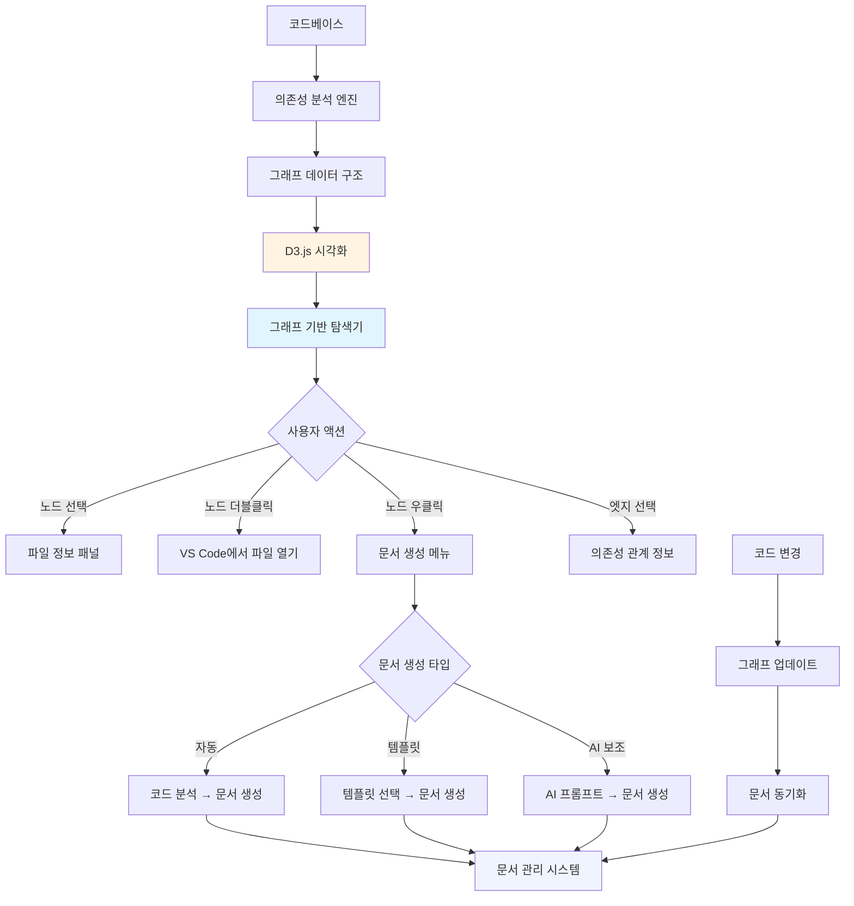
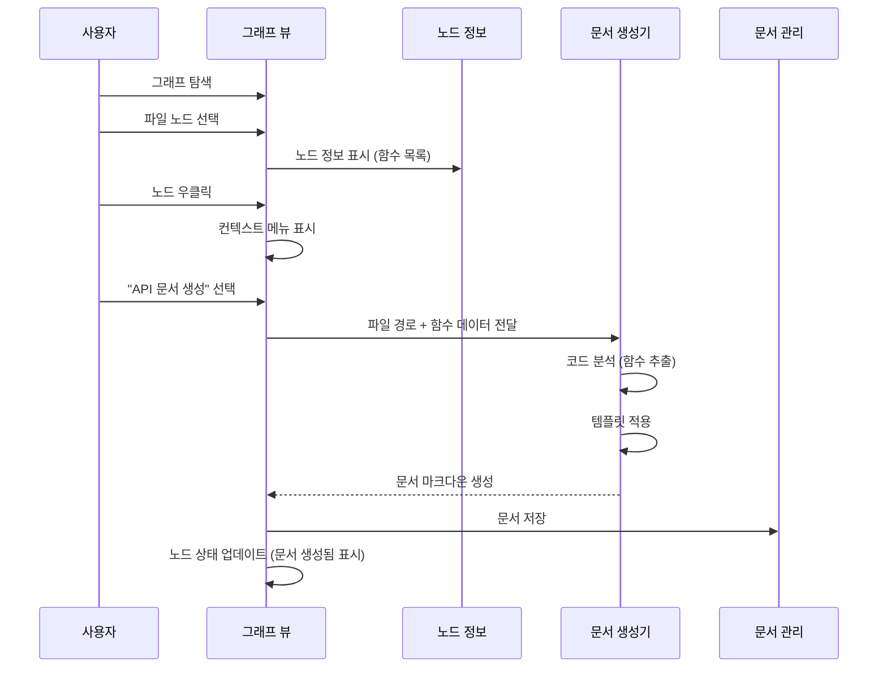
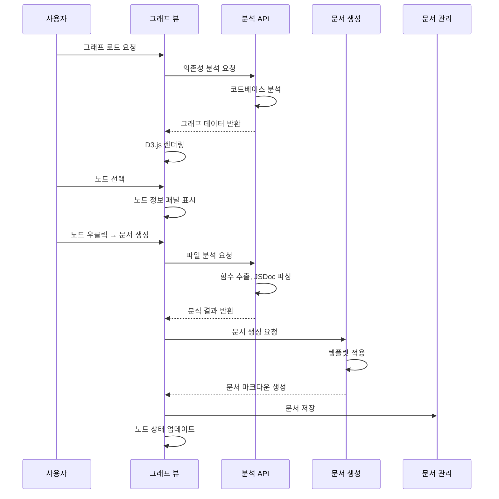

# 그래프 기반 코드 탐색기 및 문서 생성 시스템

## 핵심 개념

**그래프 기반 탐색기**가 중심이 되는 시스템입니다. 파일 간 관계를 시각화한 인터랙티브 그래프 위에서 코드를 탐색하고, 그래프의 노드(파일)나 엣지(의존성)를 선택하여 문서를 자동/수동으로 생성합니다.

## 아키텍처




## 주요 구성 요소

### 1. 그래프 기반 탐색기 (중심)

**기능:**

- 파일을 노드로, 의존성을 엣지로 표시
- 인터랙티브 탐색 (드래그, 줌, 팬)
- 노드 선택 → 상세 정보 표시
- 노드 우클릭 → 컨텍스트 메뉴 (문서 생성 옵션)
- 필터링 (파일 타입, 의존성 깊이)
- 검색 및 하이라이트

**인터랙션:**

- 노드 클릭: 파일 정보 패널 표시
- 노드 더블클릭: VS Code에서 파일 열기
- 노드 우클릭: 문서 생성 메뉴
- 엣지 호버: 의존성 관계 정보 표시
- 드래그: 노드 위치 조정
- 줌: 확대/축소

### 2. 그래프 기반 문서 생성

**노드 기반 문서 생성:**

- 단일 파일 선택 → 해당 파일 문서 생성
- 여러 파일 선택 → 통합 문서 생성
- 컴포넌트 그룹 선택 → 컴포넌트 문서 생성

**엣지 기반 문서 생성:**

- 의존성 관계 선택 → 의존성 문서 생성
- 데이터 흐름 추적 → 플로우 차트 문서 생성

**그래프 전체 문서 생성:**

- 전체 그래프 → 아키텍처 문서 생성
- 특정 레이어 → 레이어별 문서 생성

### 3. 문서-그래프 동기화

**코드 변경 시:**

- 그래프 자동 업데이트
- 관련 문서에 변경사항 표시
- 고아 설명 감지 및 그래프에서 시각화

## 데이터 구조

### 그래프 노드 (파일)

```javascript
{
  id: "file-path",
  label: "fileName",
  type: "vue|js|css|ts",
  path: "full/path",
  size: 1024,
  // 문서 관련
  hasDocument: true,
  documentPath: "docs/api.md",
  documentStatus: "synced|outdated|orphan",
  // 함수 정보
  functions: [
    {
      id: "func-id",
      name: "functionName",
      line: 45,
      hasDocumentation: true
    }
  ],
  // 의존성
  dependencies: ["file-id-1", "file-id-2"],
  dependents: ["file-id-3"]
}
```


### 그래프 엣지 (의존성)

```javascript
{
  source: "file-id-1",
  target: "file-id-2",
  type: "import|style|component",
  // 문서 관련
  hasDocumentation: true,
  documentSection: "## 의존성 관계"
}
```


## 파일 구조

### 프론트엔드 (중심: 그래프 뷰)

- `src/components/dev-tools/code-analyzer/GraphBasedExplorer.vue`: 메인 그래프 탐색기
- `src/components/dev-tools/code-analyzer/GraphView.vue`: D3.js 그래프 시각화 컴포넌트
- `src/components/dev-tools/code-analyzer/NodeInfoPanel.vue`: 노드 선택 시 정보 패널
- `src/components/dev-tools/code-analyzer/GraphContextMenu.vue`: 우클릭 메뉴 (문서 생성 옵션)
- `src/components/dev-tools/code-analyzer/DocumentGenerationModal.vue`: 문서 생성 모달
- `src/components/dev-tools/code-analyzer/GraphControls.vue`: 그래프 컨트롤 (필터, 검색, 줌)

### 서버 사이드

- `server/utils/dependencyGraph.js`: 의존성 그래프 빌더 (기존 계획 재사용)
- `server/utils/codeAnalyzer.js`: 코드 분석 (함수 추출, JSDoc 파싱)
- `server/utils/graphDocumentGenerator.js`: 그래프 기반 문서 생성
- `server/utils/graphDocumentSync.js`: 그래프-문서 동기화
- `server/routes/graphAnalysis.js`: 그래프 분석 API

## 사용자 워크플로우

### 시나리오 1: 그래프에서 파일 문서 생성




### 시나리오 2: 여러 파일 선택 → 통합 문서 생성

1. 사용자가 그래프에서 여러 노드 선택 (Ctrl+클릭)
2. 선택된 노드들이 하이라이트
3. 우클릭 → "통합 문서 생성" 선택
4. 문서 생성기에서 선택된 파일들을 분석
5. 통합 문서 생성 (예: "모듈 문서", "컴포넌트 그룹 문서")

### 시나리오 3: 의존성 관계 문서 생성

1. 사용자가 엣지(의존성 화살표) 선택
2. 의존성 관계 정보 표시
3. "의존성 문서 생성" 버튼 클릭
4. 두 파일 간의 관계를 설명하는 문서 생성

### 시나리오 4: 코드 변경 → 그래프 업데이트 → 문서 동기화

1. 코드에서 함수명 변경
2. 그래프가 자동 업데이트 (파일 변경 감지)
3. 관련 노드가 "동기화 필요" 상태로 표시
4. 노드 클릭 → 동기화 패널 표시
5. 사용자가 "문서 업데이트" 버튼 클릭
6. 문서 자동 업데이트 또는 고아 설명 감지

## UI 레이아웃

```javascript
┌─────────────────────────────────────────────────────────┐
│  [그래프 기반 탐색기]                                     │
│                                                         │
│  ┌─────────────────────────┐  ┌──────────────────┐    │
│  │                         │  │ [그래프 컨트롤]   │    │
│  │                         │  │ - 필터           │    │
│  │      D3.js 그래프       │  │ - 검색           │    │
│  │      (인터랙티브)        │  │ - 줌             │    │
│  │                         │  │ - 레이아웃       │    │
│  │                         │  └──────────────────┘    │
│  │                         │                           │
│  └─────────────────────────┘                           │
│                                                         │
│  ┌──────────────────────────────────────────────────┐  │
│  │ [노드 정보 패널] (노드 선택 시 표시)              │  │
│  │ 파일: Component.vue                               │  │
│  │ 함수:                                             │  │
│  │   - handleClick() [문서 생성]                     │  │
│  │   - validateInput() [문서 생성]                   │  │
│  │                                                    │  │
│  │ [문서 상태: 동기화됨 ✓]                           │  │
│  └──────────────────────────────────────────────────┘  │
└─────────────────────────────────────────────────────────┘
```


## 핵심 기능 상세

### 그래프 노드 시각화

**노드 상태 표시:**

- 일반: 회색
- 문서 있음: 녹색 테두리
- 동기화 필요: 노란색 테두리
- 고아 설명 있음: 주황색 테두리

**노드 크기:**

- 파일 크기에 비례
- 또는 함수 수에 비례 (선택 가능)

**노드 라벨:**

- 파일명 표시
- 문서 있으면 아이콘 표시
- 동기화 필요하면 경고 아이콘

### 그래프 엣지 시각화

**엣지 타입별 색상:**

- import: 파란색
- style: 핑크색
- component: 초록색

**엣지 두께:**

- 의존성 깊이에 비례

### 그래프 기반 문서 생성

**노드 우클릭 메뉴:**

- "API 문서 생성" (함수 리스트 기반)
- "컴포넌트 문서 생성" (Props/Emits 기반)
- "파일 문서 생성" (전체 파일 분석)
- "AI 보조 문서 생성" (AI 프롬프트 입력)
- "템플릿으로 문서 생성" (템플릿 선택)

**여러 노드 선택 시:**

- "통합 문서 생성"
- "아키텍처 문서 생성" (선택된 노드들의 관계)

### 문서-그래프 동기화

**동기화 상태 표시:**

- 노드 색상으로 상태 표시
- 노드 정보 패널에 동기화 상태 표시
- 동기화 버튼 제공

**고아 설명 처리:**

- 고아 설명이 있는 노드는 주황색으로 표시
- 노드 클릭 → 고아 설명 목록 표시
- 재매칭 제안 표시
- 사용자 확인 후 매칭

## 구현 단계

### Phase 1: 그래프 기반 탐색기 (핵심)

#### 1.1 그래프 데이터 생성

- 의존성 그래프 빌더 구현
- 노드/엣지 데이터 구조 생성
- 파일 메타데이터 수집

#### 1.2 D3.js 그래프 시각화

- Force-directed graph 구현
- 노드/엣지 렌더링
- 인터랙션 (드래그, 줌, 팬)
- 노드 클릭/더블클릭/우클릭 처리

#### 1.3 그래프 컨트롤

- 필터 (파일 타입, 의존성 깊이)
- 검색 (파일명 검색 → 노드 하이라이트)
- 줌 컨트롤
- 레이아웃 선택 (force-directed, hierarchical)

### Phase 2: 노드 정보 패널

#### 2.1 노드 선택 처리

- 노드 클릭 시 정보 패널 표시
- 파일 정보 (경로, 크기, 타입)
- 함수 목록 (추출된 함수)
- 문서 상태 표시

#### 2.2 VS Code 통합

- 노드 더블클릭 → VS Code에서 파일 열기
- 함수 클릭 → VS Code에서 해당 라인 열기

### Phase 3: 그래프 기반 문서 생성

#### 3.1 컨텍스트 메뉴

- 노드 우클릭 메뉴 구현
- 문서 생성 옵션 제공

#### 3.2 문서 생성 모달

- 템플릿 선택
- 생성 옵션 설정
- 미리보기
- 생성 및 저장

#### 3.3 코드 분석 연동

- 선택된 노드의 코드 분석
- 함수 추출
- JSDoc 파싱

### Phase 4: 문서-그래프 동기화

#### 4.1 동기화 상태 추적

- 문서-코드 매핑 테이블
- 노드 상태 업데이트

#### 4.2 코드 변경 감지

- 파일 변경 감지
- 그래프 업데이트
- 관련 노드 상태 변경

#### 4.3 고아 설명 처리

- 고아 설명 감지
- 그래프에서 시각화
- 재매칭 UI

### Phase 5: 고급 기능

#### 5.1 여러 노드 선택

- Ctrl+클릭으로 여러 노드 선택
- 선택된 노드 하이라이트
- 통합 문서 생성

#### 5.2 AI 보조 기능

- AI 프롬프트 입력
- 문서 생성 지원
- 설명 보완

#### 5.3 그래프 필터링 고도화

- 레이어별 필터링
- 의존성 경로 하이라이트
- 노드 그룹화

## 기술 스택

- **시각화**: D3.js v7.9.0 (이미 설치됨)
- **코드 파싱**: @vue/compiler-sfc, @babel/parser
- **파일 감시**: chokidar 또는 fs.watch
- **유사도 분석**: string-similarity (고아 설명 재매칭)

## 데이터 흐름




## 우선순위

1. **Phase 1**: 그래프 기반 탐색기 (핵심 기능)
2. **Phase 2**: 노드 정보 패널 (기본 상호작용)
3. **Phase 3**: 그래프 기반 문서 생성 (주요 기능)