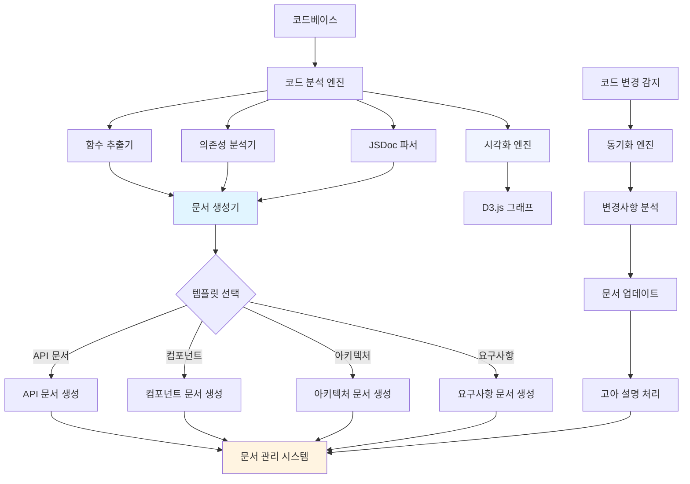
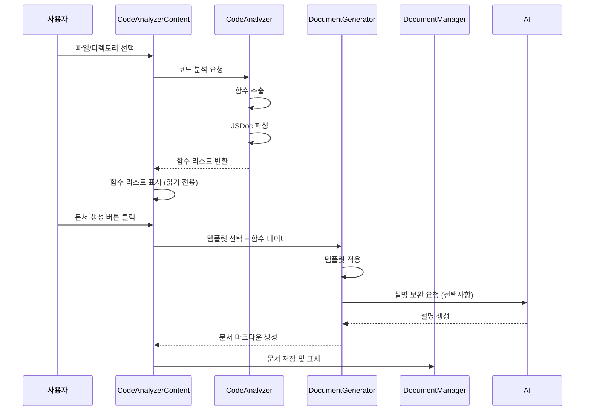
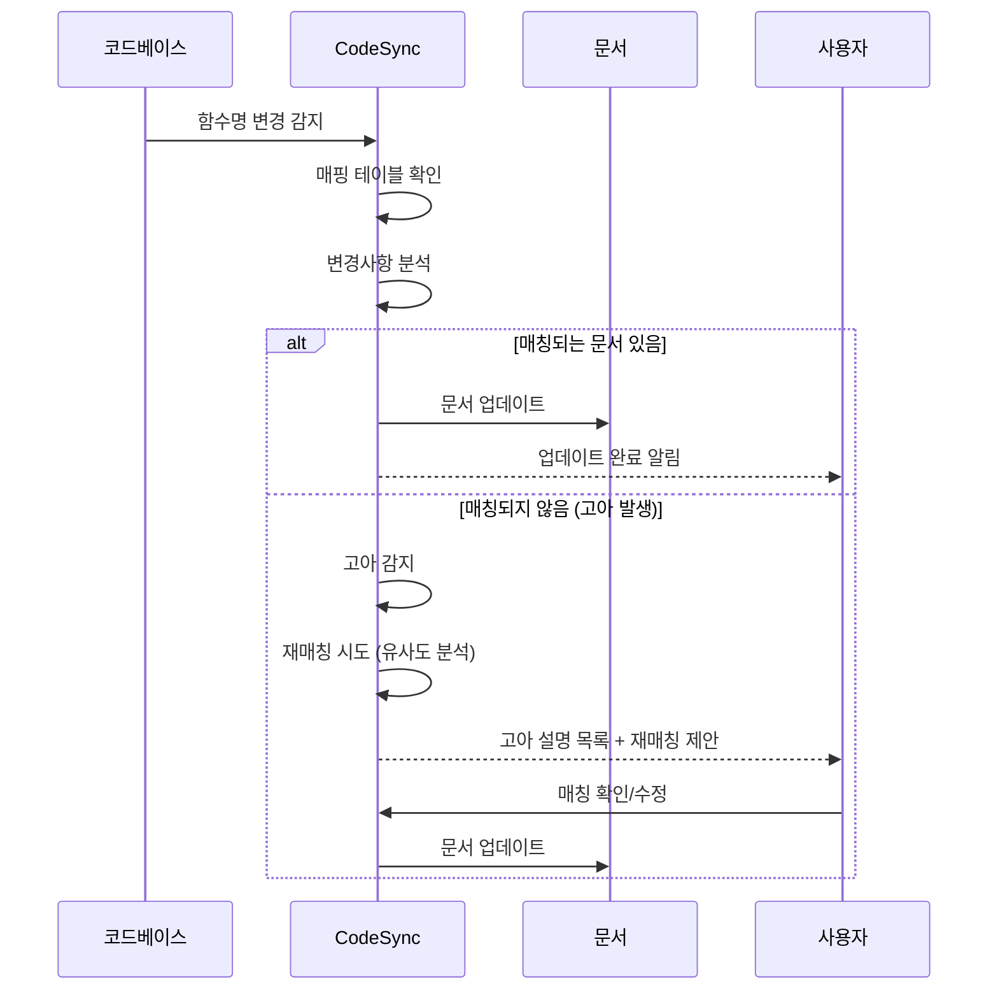

#코드 분석 및 문서 생성기 통합 도구

## 개요

코드 분석(의존성 분석, 함수 추출)과 문서 자동 생성 기능을 통합한 개발 도구입니다. 코드베이스를 분석하여 함수/컴포넌트를 추출하고, 템플릿 기반으로 문서를 자동 생성하며, 코드 변경 시 문서를 자동으로 동기화합니다.

## 핵심 기능

### 1. 코드 분석 및 추출

- 함수/메서드 자동 추출
- Vue 컴포넌트 Props/Emits 추출
- 의존성 관계 분석
- JSDoc 주석 파싱

### 2. 문서 자동 생성

- 템플릿 기반 문서 생성 (API, 컴포넌트, 아키텍처, 요구사항)
- 코드에서 문서 자동 추출
- AI 보조 문서 생성
- 체크리스트 자동 생성

### 3. 문서-코드 동기화

- 함수명 변경 감지
- 문서 자동 업데이트
- 고아 설명(매칭되지 않는 설명) 감지 및 재매칭

### 4. 시각화

- 의존성 그래프 시각화 (D3.js)
- 코드 구조 시각화
- 문서-코드 매핑 시각화

## 아키텍처




## 파일 구조

### 서버 사이드

- `server/utils/codeAnalyzer.js`: 코드 분석 엔진 (함수 추출, JSDoc 파싱)
- `server/utils/dependencyGraph.js`: 의존성 그래프 빌더 (기존 계획 재사용)
- `server/utils/documentGenerator.js`: 문서 생성 엔진
- `server/utils/documentSync.js`: 문서-코드 동기화 엔진
- `server/routes/codeAnalysis.js`: 코드 분석 API
- `server/routes/documentGeneration.js`: 문서 생성 API

### 프론트엔드

- `src/components/dev-tools/code-analyzer/CodeAnalyzerContent.vue`: 메인 UI
- `src/components/dev-tools/code-analyzer/FunctionListView.vue`: 함수 리스트 (읽기 전용)
- `src/components/dev-tools/code-analyzer/DependencyGraphView.vue`: 의존성 그래프 시각화
- `src/components/dev-tools/code-analyzer/DocumentGeneratorPanel.vue`: 문서 생성 패널
- `src/components/dev-tools/code-analyzer/CodeDocumentSyncView.vue`: 동기화 상태 뷰

## 구현 단계

### Phase 1: 코드 분석 엔진

#### 1.1 함수 추출기 (`server/utils/codeAnalyzer.js`)

**기능:**

- Vue 파일에서 함수/메서드 추출
- JavaScript/TypeScript 파일에서 함수 추출
- JSDoc 주석 파싱 및 연결
- 함수 시그니처 분석 (파라미터, 반환값)

**함수:**

- `extractFunctions(filePath)`: 파일에서 함수 추출
- `parseJSDoc(comment)`: JSDoc 주석 파싱
- `extractVueComponent(filePath)`: Vue 컴포넌트 Props/Emits 추출
- `analyzeFunctionSignature(funcNode)`: 함수 시그니처 분석

**출력 구조:**

```javascript
{
  functions: [
    {
      id: "unique-id",
      name: "functionName",
      file: "src/utils/helper.js",
      line: 45,
      signature: "functionName(param1, param2)",
      params: [{ name: "param1", type: "string" }],
      returnType: "Promise<Object>",
      jsdoc: {
        description: "함수 설명",
        params: [...],
        returns: "..."
      }
    }
  ]
}
```


#### 1.2 의존성 분석기 (기존 계획 재사용)

기존 `server/utils/dependencyGraph.js` 활용

### Phase 2: 문서 생성 엔진

#### 2.1 템플릿 시스템 (`server/utils/documentGenerator.js`)

**템플릿 종류:**

1. **API 문서 템플릿**: 함수 리스트 기반 API 문서
2. **컴포넌트 문서 템플릿**: Vue 컴포넌트 Props/Emits 문서
3. **아키텍처 문서 템플릿**: 의존성 그래프 기반 구조 문서
4. **요구사항 문서 템플릿**: 작업 항목 및 체크리스트 문서

**함수:**

- `generateFromTemplate(templateType, data)`: 템플릿 기반 문서 생성
- `generateAPIDocument(functions)`: API 문서 생성
- `generateComponentDocument(componentData)`: 컴포넌트 문서 생성
- `generateArchitectureDocument(graphData)`: 아키텍처 문서 생성

#### 2.2 코드에서 문서 추출

**기능:**

- 선택한 코드 블록 분석
- 함수/컴포넌트 문서 자동 생성
- JSDoc 기반 문서 생성

**함수:**

- `extractDocumentFromCode(code, options)`: 코드에서 문서 추출
- `generateFunctionDocument(functionData)`: 함수 문서 생성

### Phase 3: 문서-코드 동기화

#### 3.1 동기화 엔진 (`server/utils/documentSync.js`)

**기능:**

- 코드 변경 감지 (함수명 변경, 함수 추가/삭제)
- 문서와 코드 매핑 관계 추적
- 문서 자동 업데이트
- 고아 설명(매칭되지 않는 설명) 감지

**데이터 구조:**

```javascript
{
  mappings: [
    {
      codeId: "function-unique-id",
      documentPath: "docs/api.md",
      documentSection: "## functionName",
      description: "함수 설명..."
    }
  ],
  orphans: [
    {
      documentPath: "docs/api.md",
      section: "## oldFunctionName",
      description: "이 함수는 삭제되었지만 문서에는 남아있음"
    }
  ]
}
```

**함수:**

- `syncDocument(codeChanges, documentPath)`: 문서 동기화
- `detectOrphans(mappings, currentFunctions)`: 고아 설명 감지
- `rematchOrphans(orphans, currentFunctions)`: 고아 설명 재매칭 (유사도 기반)

#### 3.2 매칭 알고리즘

**고아 설명 재매칭:**

- 함수명 유사도 분석 (Levenshtein 거리)
- 매개변수 유사도 분석
- 설명 텍스트 유사도 분석
- 최종 매칭 제안 (수동 확인 필요)

### Phase 4: 프론트엔드 UI

#### 4.1 메인 컴포넌트 (`CodeAnalyzerContent.vue`)

**UI 구성:**

- 파일/디렉토리 선택
- 분석 버튼
- 함수 리스트 뷰 (읽기 전용)
- 문서 생성 패널
- 동기화 상태 뷰

#### 4.2 함수 리스트 뷰 (`FunctionListView.vue`)

**기능:**

- 추출된 함수 목록 표시 (읽기 전용)
- JSDoc 주석 표시
- 함수 선택 → 문서 생성 버튼
- AI와 함께 설명 추가 기능

#### 4.3 문서 생성 패널 (`DocumentGeneratorPanel.vue`)

**기능:**

- 템플릿 선택 (API, 컴포넌트, 아키텍처, 요구사항)
- 생성 옵션 설정
- 생성 버튼
- 생성된 문서 미리보기
- 문서 관리 시스템으로 이동 버튼

#### 4.4 동기화 뷰 (`CodeDocumentSyncView.vue`)

**기능:**

- 코드-문서 매핑 상태 표시
- 변경사항 감지 알림
- 고아 설명 목록 표시
- 재매칭 제안 및 확인

### Phase 5: 통합 및 최적화

#### 5.1 문서 관리 시스템 통합

- 생성된 문서를 문서 관리 시스템으로 자동 이동
- 문서 생성기에서 직접 문서 관리 시스템 열기

#### 5.2 AI 보조 기능

- 함수 설명 자동 생성 (AI API 활용)
- 문서 개선 제안
- 고아 설명 재매칭 제안

## 데이터 흐름

### 문서 생성 워크플로우




### 동기화 워크플로우




## 핵심 기능 상세

### 함수 리스트 (읽기 전용)

**특징:**

- 코드에서 추출한 함수 목록을 읽기 전용으로 표시
- JSDoc 주석이 있으면 함께 표시
- 각 함수에 대해 "문서 생성" 버튼 제공
- AI와 함께 설명 추가 가능

**UI 예시:**

```javascript
[함수 리스트]

📄 src/utils/helper.js
  ├─ calculatePrice(params) [문서 생성] [AI 설명 추가]
  │   └─ JSDoc: 가격을 계산합니다...
  ├─ formatDate(date) [문서 생성] [AI 설명 추가]
  └─ validateEmail(email) [문서 생성] [AI 설명 추가]
```


### 문서-코드 동기화

**함수명 변경 시:**

1. 코드 변경 감지
2. 기존 문서에서 해당 함수 섹션 찾기
3. 함수명 업데이트
4. 매핑 테이블 업데이트

**함수 삭제 시:**

1. 코드에서 함수 삭제 감지
2. 문서에 남아있는 설명을 "고아"로 표시
3. 유사한 함수가 있으면 재매칭 제안
4. 사용자 확인 후 처리

### 템플릿 예시

**API 문서 템플릿:**

```markdown
# API 문서

## calculatePrice

가격을 계산합니다.

### 파라미터
- `price` (number): 기본 가격
- `discount` (number): 할인율

### 반환값
Promise<number>: 최종 가격

### 예시
\`\`\`javascript
const result = await calculatePrice(1000, 0.1)
\`\`\`
```


## 구현 우선순위

1. **Phase 1**: 코드 분석 엔진 (함수 추출, JSDoc 파싱)
2. **Phase 2**: 기본 문서 생성 (템플릿 시스템)
3. **Phase 3**: 문서-코드 동기화 (기본 기능)
4. **Phase 4**: 프론트엔드 UI (함수 리스트, 문서 생성 패널)
5. **Phase 5**: 고급 기능 (고아 설명 처리, AI 보조)

## 기술 스택

- **코드 파싱**: @vue/compiler-sfc, @babel/parser