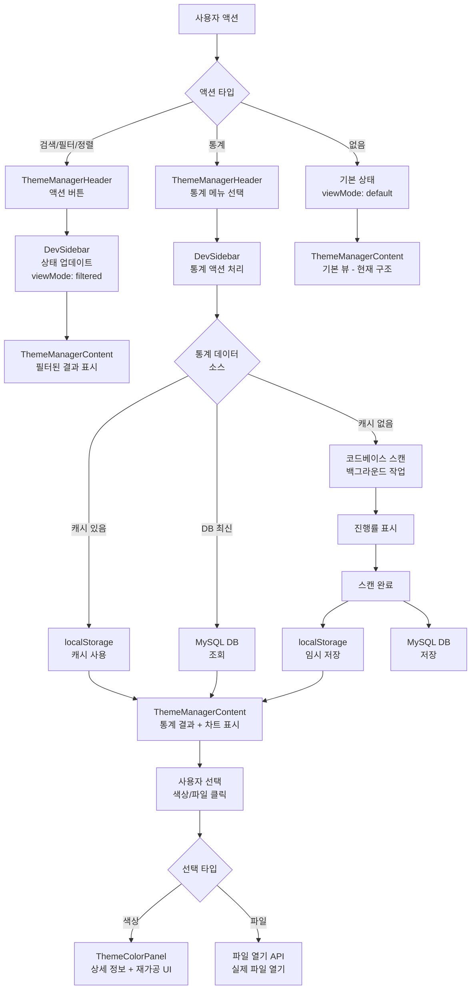

# 테마 관리 시스템 구조 개편 계획

## 목표

- 왼쪽 사이드바: 최근/즐겨찾기 탭 + 액션 버튼 (검색, 필터, 정렬, 통계)
- 메인 컨텐츠: 기본은 현재 구조 유지 (테마 관리 홈), 뷰모드 지원 (같은 결과를 여러 형태로)
- 오른쪽 사이드바: 선택 색상 상세 정보 + 통계 결과 재가공 도구
- 통계 시스템: 코드베이스 스캔 + DB 누적 저장 (MySQL)

## 구조 변경

### Phase 1: 왼쪽 사이드바 구조 개편 및 액션 메뉴 구조화

#### 1.1 ThemeManagerHeader.vue 수정

- **통계 탭 제거**: `q-tabs`에서 통계 탭 삭제
- **탭 구조 변경**: 최근/즐겨찾기만 유지
- **정렬 옵션 이동**: `ThemeManagerContent.vue`의 정렬 옵션을 헤더로 이동
- 현재: 컨텐츠 창의 `section-header`에 있는 정렬 드롭다운
- 변경: 왼쪽 사이드바 헤더의 액션 버튼 그룹에 추가
- **액션 버튼 그룹 재구성**:

**검색 (기존 유지)**

- 검색 입력 필드

**필터**

- 카테고리 필터 드롭다운/메뉴
- 셀렉터 또는 `q-menu`로 카테고리 목록 표시

**정렬 (컨텐츠에서 이동)**

- 정렬 옵션 드롭다운 (`q-select` 또는 `q-menu`)
- 옵션:
    - 카테고리별
    - 변수명 알파벳 순
    - 색상 값별
    - 사용 횟수별 (통계 활성화 시)

**통계 (아코디언 섹션)**

- `q-expansion-item`로 하부 액션 그룹 표시
- 현재 탭 기능 (최근, 즐겨찾기) 유지
- 통계 섹션 추가 (다른 기능 섹션 추가 대비)
- 하부 액션:
    - 전체 통계 분석
    - 인기 색상 (사용 빈도 높은 순)
    - 미사용 색상
    - 파일별 사용 현황
    - 컴포넌트별 사용 현황
    - 카테고리별 통계
- **액션 버튼 그리드 레이아웃**:
- 현재: `col-2` (2개씩)
- 변경: 3개 액션 버튼을 적절히 배치 (검색은 전체 너비, 필터/정렬은 그리드)
- **이벤트 emit 추가**: `search`, `filter`, `sort`, `statistics-action`

#### 1.2 ThemeManagerList.vue 수정

- **통계 탭 UI 제거**: `activeTab === 'statistics'` 블록 삭제
- **최근/즐겨찾기 탭만 유지**
- **탭 파일 분리 구조 준비**: 향후 다른 기능 추가 시 확장 가능한 구조 유지

#### 1.3 ThemeManagerContent.vue 수정

- **정렬 UI 제거**: `section-header`의 정렬 드롭다운 삭제
- **정렬 로직 유지**: `sortOption` prop으로 받아서 사용
- **기본 뷰 유지**: `viewMode`가 없거나 `'default'`일 때 현재 구조 유지 (테마 관리 홈)
- **뷰모드 지원**: 같은 결과를 여러 형태로 표시

### Phase 2: 검색/필터/정렬 기능 구현

#### 2.1 ThemeManagerContent.vue 확장

- **Props 추가**: 
- `searchQuery`: 검색어 (string)
- `categoryFilter`: 선택된 카테고리 (string | null)
- `sortOption`: 정렬 옵션 (string) - 기존 로직 활용
- `viewMode`: 뷰 모드 ('default' | 'filtered' | 'statistics')
- `statisticsData`: 통계 데이터 (Object | null)
- **ViewMode 지원**:
- `'default'`: 기본 카테고리별 그리드 (현재 구조 유지, 테마 관리 홈)
- `'filtered'`: 검색/필터 결과 그리드
- `'statistics'`: 통계 결과 뷰 (차트 + 그리드)
- 향후 추가 가능: `'table'`, `'list'`, `'compact'` 등 (같은 결과의 다른 표현)
- **검색/필터 로직**:
- `searchQuery`가 있으면 변수명, 색상 값, 카테고리에서 검색
- `categoryFilter`가 있으면 해당 카테고리만 표시
- `sortOption`에 따라 정렬 (기존 로직 활용)
- **검색 결과 헤더**: 검색어, 결과 개수, 필터 상태 표시
- **필터 상태 표시**: 활성 필터가 있으면 헤더에 표시 (예: "카테고리: primary | 검색: --nexa-")
- **뷰모드 전환 UI**: 같은 데이터를 여러 형태로 보기 위한 전환 버튼 (향후 추가)

#### 2.2 DevSidebar.vue 통합

- **상태 관리**: 
- `searchQuery` ref
- `categoryFilter` ref
- `sortOption` ref (기본값: 'category')
- `viewMode` ref (기본값: 'default')
- `statisticsData` ref
- **이벤트 핸들러**: 
- `handleSearch`: 검색 입력 시 `searchQuery` 업데이트, `viewMode = 'filtered'`
- `handleFilter`: 필터 변경 시 `categoryFilter` 업데이트, `viewMode = 'filtered'`
- `handleSort`: 정렬 변경 시 `sortOption` 업데이트
- `handleStatisticsAction`: 통계 액션 선택 시 처리
- **Props 전달**: `ThemeManagerContent`에 모든 상태 props 전달
- **홈으로 리셋**: 액션 없이 기본 상태일 때 `viewMode = 'default'` 유지

### Phase 3: 통계 기능 구현 (src/charts 모듈 활용 + DB 기반)

#### 3.1 통계 액션 아코디언 구조 (`ThemeManagerList.vue` 또는 별도 섹션)

**아코디언 구조** (`q-expansion-item`):

- 통계 섹션: 여러 통계 액션 버튼 그룹
- 향후 다른 기능 섹션 추가 가능 (예: 템플릿 관리, 색상 변환 등)
```vue
<!-- ThemeManagerList.vue 또는 별도 컴포넌트 -->
<q-expansion-item 
  icon="analytics" 
  label="통계" 
  header-class="statistics-section-header"
>
  <div class="statistics-actions">
    <q-btn flat icon="analytics" label="전체 통계 분석" @click="handleStatisticsAction('full-analysis')" />
    <q-btn flat icon="trending_up" label="인기 색상" @click="handleStatisticsAction('popular')" />
    <q-btn flat icon="delete_outline" label="미사용 색상" @click="handleStatisticsAction('unused')" />
    <q-btn flat icon="description" label="파일별 사용 현황" @click="handleStatisticsAction('by-file')" />
    <q-btn flat icon="widgets" label="컴포넌트별 사용 현황" @click="handleStatisticsAction('by-component')" />
    <q-btn flat icon="category" label="카테고리별 통계" @click="handleStatisticsAction('by-category')" />
  </div>
</q-expansion-item>
```


#### 3.2 통계 데이터 구조

```typescript
interface StatisticsResult {
  type: 'full' | 'popular' | 'unused' | 'by-file' | 'by-component' | 'by-category'
  data: Array<{
    variableName: string
    colorValue: string
    usageCount: number
    category?: string
    files: Array<{
      path: string
      componentName?: string  // 컴포넌트 파일명
      pageName?: string       // 페이지 경로
      lineCount: number
      lines: Array<number>
    }>
  }>
  summary?: {
    totalColors: number
    totalUsage: number
    averageUsage: number
  }
}
```


#### 3.3 코드베이스 통계 성능 최적화

**문제점**: 코드베이스 전체 스캔은 쿼리 부하가 크고 시간이 오래 걸림**대책**:

1. **백그라운드 작업**: 스캔을 비동기 백그라운드 작업으로 처리
2. **진행 상황 표시**: 진행률 표시 (Progress bar)
3. **캐싱**: 스캔 결과를 localStorage에 임시 캐시 (5분)
4. **증분 업데이트**: 변경된 파일만 재스캔 (향후)
5. **Web Worker 활용**: 메인 스레드 블로킹 방지 (향후)

#### 3.4 저장소 전략

**1단계: 로컬 스토리지 (우선 구현)**

- 통계 결과를 localStorage에 저장
- 스캔 결과 캐싱
- 최근 통계 결과 유지
- 구조 정리 후 필요한 부분만 DB로 이전

**2단계: MySQL DB (정리 후 필요시)**

- 로컬 스토리지로 구조 정리 완료 후
- 필요성 검토 후 선택적으로 DB 구현
- 프로젝트 전체 흐름 활용 시 DB 고려

**MySQL DB 스키마 설계 (향후)목적**: 통계 결과를 누적 저장하여 프로젝트 전체 흐름에 활용**테이블 구조**:

```sql
-- 색상 변수 마스터 테이블
CREATE TABLE theme_color_variables (
  id INT PRIMARY KEY AUTO_INCREMENT,
  variable_name VARCHAR(255) UNIQUE NOT NULL,
  color_value VARCHAR(50) NOT NULL,
  category VARCHAR(100),
  created_at TIMESTAMP DEFAULT CURRENT_TIMESTAMP,
  updated_at TIMESTAMP DEFAULT CURRENT_TIMESTAMP ON UPDATE CURRENT_TIMESTAMP,
  INDEX idx_category (category),
  INDEX idx_variable_name (variable_name)
);

-- 색상 사용 통계 테이블 (누적)
CREATE TABLE theme_color_usage_stats (
  id INT PRIMARY KEY AUTO_INCREMENT,
  variable_id INT NOT NULL,
  file_path VARCHAR(500) NOT NULL,
  file_type ENUM('component', 'page', 'util', 'style', 'other') NOT NULL,
  component_name VARCHAR(255),
  page_name VARCHAR(255),
  usage_count INT DEFAULT 0,
  last_used_at TIMESTAMP,
  first_detected_at TIMESTAMP DEFAULT CURRENT_TIMESTAMP,
  last_scanned_at TIMESTAMP DEFAULT CURRENT_TIMESTAMP ON UPDATE CURRENT_TIMESTAMP,
  FOREIGN KEY (variable_id) REFERENCES theme_color_variables(id) ON DELETE CASCADE,
  INDEX idx_variable_id (variable_id),
  INDEX idx_file_path (file_path(255)),
  INDEX idx_component_name (component_name),
  INDEX idx_page_name (page_name),
  INDEX idx_last_scanned (last_scanned_at)
);

-- 코드베이스 스캔 이력
CREATE TABLE theme_scan_history (
  id INT PRIMARY KEY AUTO_INCREMENT,
  scan_type ENUM('full', 'incremental') NOT NULL,
  total_files INT DEFAULT 0,
  scanned_files INT DEFAULT 0,
  found_variables INT DEFAULT 0,
  scan_duration_ms INT,
  status ENUM('running', 'completed', 'failed') NOT NULL,
  started_at TIMESTAMP DEFAULT CURRENT_TIMESTAMP,
  completed_at TIMESTAMP,
  error_message TEXT,
  INDEX idx_status (status),
  INDEX idx_started_at (started_at)
);

-- 색상 사용 라인 상세 정보
CREATE TABLE theme_color_usage_lines (
  id INT PRIMARY KEY AUTO_INCREMENT,
  usage_stat_id INT NOT NULL,
  line_number INT NOT NULL,
  line_content TEXT,
  context_before TEXT,
  context_after TEXT,
  FOREIGN KEY (usage_stat_id) REFERENCES theme_color_usage_stats(id) ON DELETE CASCADE,
  INDEX idx_usage_stat_id (usage_stat_id),
  INDEX idx_line_number (line_number)
);
```

**DB 활용 시나리오 (향후)**:

- 통계 결과 누적 저장
- 시간대별 사용 추이 분석
- 프로젝트 전체 색상 사용 패턴 분석
- 리팩토링 영향도 분석
- 미사용 색상 자동 정리 제안

#### 3.5 themeUsageAnalyzer.js 구현

- **즉시 스캔 (로컬)**:
- 코드베이스 전체 스캔 (비동기)
- 진행률 표시
- 결과를 localStorage에 저장 (임시 + 영구)
- 결과 반환
- 스캔 이력 localStorage에 저장
- **로컬 스토리지 구조**:
- `theme-statistics-results`: 최신 통계 결과
- `theme-statistics-history`: 스캔 이력 목록
- `theme-statistics-cache`: 캐시된 통계 데이터 (타임스탬프 포함)
- **DB 저장 (향후)**:
- 로컬 스토리지로 구조 정리 후
- 필요시 MySQL DB에 저장
- 기존 데이터와 병합/업데이트
- **DB 조회 (향후)**:
- 최신 통계는 DB에서 조회
- 로컬 캐시 우선 사용
- **코드베이스 스캔 로직**:
- Vue 파일 (`.vue`): `--nexa-*` 패턴 찾기, 컴포넌트명 추출
    - `<style>` 태그 내 `var(--nexa-*)` 찾기
    - `<template>` 내 인라인 스타일에서 CSS 변수 사용 찾기
    - `:style` 바인딩에서 변수 참조 찾기
- SCSS 파일 (`.scss`, `.css`): 색상 변수 사용 검색
- TypeScript/JavaScript 파일: CSS 변수 참조 찾기
- **파일 분류**:
- 컴포넌트 파일: `src/components/**/*.vue` → `componentName` 추출
- 페이지 파일: `src/pages/**/*.vue` → `pageName` 추출 (라우트 경로 기반)
- 유틸/서비스: `src/utils/**`, `src/modules/**`
- **통계 집계**:
- 색상 변수별 사용 횟수
- 파일별 사용 현황
- 컴포넌트별 사용 현황
- 페이지별 사용 현황
- 카테고리별 통계 (색상 변수의 카테고리 기준)

#### 3.6 ThemeManagerContent 통계 뷰 (src/charts 모듈 활용)

**차트 컴포넌트 import**:

- `NexaChart.vue` import
- 필요한 차트 타입: `bar`, `pie`, `line`

**통계 타입별 뷰 구현**:

1. **`full-analysis`**: 전체 통계

- 요약 카드: 총 색상 수, 총 사용 횟수, 평균 사용 횟수
- Bar 차트: 상위 10개 색상 사용 빈도
- Pie 차트: 카테고리별 색상 분포
- 그리드: 모든 색상의 사용 횟수 리스트

2. **`popular`**: 인기 색상

- Bar 차트: 사용 빈도 상위 N개 (기본 20개)
- 그리드: 사용 빈도 높은 순 정렬된 색상 목록
- 클릭 가능: 색상 클릭 시 오른쪽 패널에 상세 정보

3. **`unused`**: 미사용 색상

- 그리드: 사용 횟수 0인 색상 목록
- 요약: 미사용 색상 개수 및 비율
- Pie 차트: 사용/미사용 비율

4. **`by-file`**: 파일별 사용 현황

- Bar 차트: 파일별 색상 사용 횟수 (상위 10개 파일)
- 리스트: 파일 목록, 각 파일의 색상 사용 현황
- 파일 클릭: 해당 파일 열기 (실제 페이지/파일 열기)

5. **`by-component`**: 컴포넌트별 사용 현황

- Bar 차트: 컴포넌트별 색상 사용 횟수 (상위 10개)
- 리스트: 컴포넌트 목록, 각 컴포넌트의 색상 사용 현황
- 컴포넌트 클릭: 해당 컴포넌트 파일 열기

6. **`by-category`**: 카테고리별 통계

- Pie 차트: 카테고리별 색상 개수 분포
- Bar 차트: 카테고리별 총 사용 횟수
- 카테고리별 그리드: 각 카테고리의 색상 및 사용 현황

**차트 데이터 변환 함수**:

- 통계 데이터를 `NexaChart` 컴포넌트가 요구하는 형식으로 변환
- 예: `{ x: '색상명', y: 사용횟수, count: 사용횟수 }`

**결과 클릭 처리**:

- 색상 클릭: 오른쪽 패널에 상세 정보 표시
- 파일 클릭: 실제 파일 열기 (VSCode 또는 브라우저에서)
- 파일 경로 기반으로 파일 열기 기능 구현
- 백엔드 API 연동 (파일 열기 요청)
- 컴포넌트 클릭: 컴포넌트 파일 열기

#### 3.7 통계 결과 페이지 열기 기능

- **파일 경로 클릭 시**:
- 파일 경로 문자열을 파싱하여 실제 파일 위치 확인
- 백엔드 API 호출: `/api/files/open?path={filePath}&line={lineNumber}`
- 또는 VSCode URI 스키마 활용: `vscode://file/{absolutePath}:{lineNumber}`
- 브라우저에서 열 수 있는 파일이면 새 탭에서 열기
- **컴포넌트/페이지 클릭 시**:
- 컴포넌트 파일 경로로 변환
- 파일 열기 API 호출

### Phase 4: 통계 결과 재가공 기능 (향후 구현 - UI만 구성)

#### 4.1 오른쪽 사이드바 확장 (`ThemeColorPanel.vue`)

- **선택한 색상 상세 정보 (기존 유지)**
- **통계 결과 재가공 섹션 추가** (통계 모드일 때만 표시, UI만 구성):
- 즐겨찾기 추가: UI 버튼 (기능은 향후 구현)
- 메모 추가/편집: UI 입력 필드 (기능은 향후 구현)
- 색상 그룹/컬렉션에 추가: UI 버튼 (기능은 향후 구현)
- 관련 파일 목록:
    - 파일 경로 목록 (UI)
    - 각 파일의 사용 횟수 (UI)
    - 클릭 시 파일 열기 (향후 구현)
- 관련 컴포넌트 목록: UI만 (기능 향후 구현)
- 관련 페이지 목록: UI만 (기능 향후 구현)

#### 4.2 통계 결과 상호작용 (UI만)

- **컨텐츠 창에서 선택**:
- 색상 클릭 → 오른쪽 패널에 상세 정보 + 통계 데이터 표시 (UI만)
- 파일 클릭 → 파일 정보 표시 (UI만, 실제 열기 기능은 향후)
- 컴포넌트 클릭 → 컴포넌트 정보 표시 (UI만)
- 차트 데이터 포인트 클릭 → 해당 색상/파일 상세 정보 표시 (UI만)

#### 4.3 colorNotesManager.js (향후 구현)

- **기능**: 향후 구현 (현재는 UI만)
- **데이터 구조**: 향후 정의

### Phase 5: 향후 구현 기능 (UI만 구성)

- **뷰모드 전환 UI**: 같은 결과를 여러 형태로 보기
- 그리드/테이블/리스트/컴팩트 뷰 전환 버튼
- 기능은 향후 구현
- **고급 필터 UI**: 다중 필터 조합
- UI만 구성, 기능 향후 구현
- **통계 내보내기 UI**: Excel, CSV 등
- UI만 구성, 기능 향후 구현
- **통계 비교 UI**: 시간대별 비교
- UI만 구성, 기능 향후 구현

## 파일 변경 사항

### 수정 파일

1. **`src/components/sidebars/left/dev-tools/theme-manager/ThemeManagerHeader.vue`**

- 통계 탭 제거
- 정렬 옵션 추가 (컨텐츠에서 이동)
- 필터 드롭다운 추가
- 액션 버튼 그리드 레이아웃 재구성 (검색, 필터, 정렬)
- 이벤트 emit 확장: `search`, `filter`, `sort`, `statistics-action`

2. **`src/components/sidebars/left/dev-tools/theme-manager/ThemeManagerList.vue`**

- 통계 탭 UI 제거
- 통계 아코디언 섹션 추가 (`q-expansion-item`)
- 통계 액션 버튼 그룹 구현
- 탭 파일 분리 구조 준비

3. **`src/components/dev-tools/theme-manager/ThemeManagerContent.vue`**

- 정렬 UI 제거 (`section-header`의 정렬 드롭다운)
- 기본 뷰 유지 (viewMode 없으면 현재 구조)
- 검색/필터/정렬 props 추가
- 통계 뷰 모드 추가
- `NexaChart` 컴포넌트 import 및 통계 차트 구현
- 다양한 통계 뷰 구현 (Bar, Pie 차트 포함)
- 뷰모드 전환 UI (향후 확장용)
- 파일 클릭 시 실제 파일 열기 기능

4. **`src/components/sidebars/left/DevSidebar.vue`**

- 검색/필터/정렬 상태 관리
- `ThemeManagerContent`에 props 전달
- 통계 액션 처리 로직
- 기본 상태 리셋 로직 (홈으로)

5. **`src/components/sidebars/right/dev-tools/ThemeColorPanel.vue`**

- 통계 결과 재가공 섹션 추가 (UI만)
- 관련 파일/컴포넌트/페이지 목록 표시 (UI만)

### 신규 파일

1. **`src/modules/theme-manager/services/statisticsManager.js`**

- 통계 관련 유틸리티 함수
- 통계 결과 필터링/정렬
- 차트 데이터 변환 함수

2. **`src/modules/theme-manager/services/themeStatisticsStorage.js`**

- 로컬 스토리지 기반 통계 데이터 저장/조회
- 스캔 결과 캐싱
- 스캔 이력 관리
- 향후 DB 연동 시 대체 가능한 구조

3. **`src/modules/theme-manager/services/themeStatisticsApi.js`** (향후)

- MySQL DB 통계 API 연동
- 스캔 결과 저장/조회
- 파일 열기 API 호출

4. **`src/modules/theme-manager/services/colorNotesManager.js`** (향후 구현)

- 색상 메모 관리 (localStorage)
- 메모 CRUD 기능

4. **`docs/database/theme-statistics-schema.sql`**

- MySQL 테이블 생성 스크립트
- 인덱스 및 관계 정의

### 구현 필요 파일

1. **`src/utils/themeUsageAnalyzer.js`** - 실제 코드베이스 스캔 로직 구현

- Vue 파일 파싱
- SCSS/CSS 파일 파싱
- TypeScript/JavaScript 파일 파싱
- 통계 집계 로직
- 진행률 표시
- 백그라운드 처리

2. **백엔드 API** (별도 구현):

- `/api/theme-statistics/scan` - 코드베이스 스캔 시작
- `/api/theme-statistics/status` - 스캔 상태 확인
- `/api/theme-statistics/results` - 통계 결과 조회
- `/api/theme-statistics/save` - 스캔 결과 DB 저장
- `/api/files/open` - 파일 열기

## 데이터 플로우




## 구현 우선순위

1. **Phase 1**: 왼쪽 사이드바 구조 개편

- 통계 탭 제거
- 정렬 옵션 이동 및 통합
- 액션 버튼 구조화 (필터, 정렬, 통계 메뉴)

2. **Phase 2**: 검색/필터/정렬 기능

- 컨텐츠 창 연동
- 필터 상태 표시
- 기본 뷰 유지 (viewMode: default)

3. **Phase 3**: 통계 기능 기본 구조

- 통계 메뉴 및 기본 뷰
- 차트 통합 준비
- 진행률 표시 UI

4. **Phase 4**: 통계 분석 엔진 구현

- 코드베이스 스캔 로직
- 통계 집계
- 백그라운드 처리
- localStorage 캐싱

5. **Phase 5**: DB 스키마 및 API 설계

- MySQL 테이블 생성
- DB 저장/조회 API
- 파일 열기 API

7. **Phase 7**: 통계 차트 시각화

- `src/charts` 모듈 활용
- Bar, Pie 차트 구현
- 차트 데이터 변환
- 파일/컴포넌트 클릭 처리