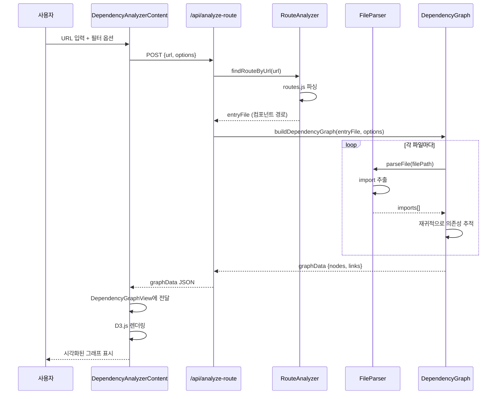

#페이지 의존성 분석 및 시각화 도구 구현 계획

## 개요

특정 URL(라우트)을 입력받아 해당 페이지를 구성하는 모든 관련 파일들을 분석하고, D3.js를 활용해 디렉토리 구조와 의존성 관계를 시각화하는 도구입니다.

## 기술 스택

### 백엔드 (서버 사이드 분석)

- **Node.js** (기존 Express 서버 활용)
- **@vue/compiler-sfc**: Vue 파일 파싱
- **@babel/parser**: JavaScript/TypeScript 파일 파싱
- **postcss** (이미 설치됨): CSS/SCSS 파싱
- **fs/promises**: 파일 시스템 접근
- **path**: 경로 해석

### 프론트엔드 (시각화)

- **D3.js v7.9.0** (이미 설치됨)
- **Vue 3 + Quasar**: UI 컴포넌트
- 기존 프로젝트 구조 활용

## 아키텍처

```mermaid
graph TD
    A[사용자 입력 URL] --> B[프론트엔드 UI]
    B --> C[API 요청 /api/analyze-route]
    C --> D[Route Analyzer]
    D --> E[Vue Parser]
    D --> F[JS/TS Parser]
    D --> G[CSS Parser]
    E --> H[Dependency Graph Builder]
    F --> H
    G --> H
    H --> I[Graph Data JSON]
    I --> C
    C --> J[D3 Visualization]
    J --> K[Interactive Graph]
    
    style A fill:var(--nexa-accent)
    style J fill:var(--nexa-primary)
    style K fill:var(--nexa-success)
```


## 파일 구조

### 새로 생성할 파일

1. **서버 사이드 (server/)**

- `server/utils/routeAnalyzer.js`: 라우트에서 컴포넌트 추출
- `server/utils/fileParser.js`: Vue/JS/CSS 파일 파싱
- `server/utils/dependencyGraph.js`: 의존성 그래프 빌더
- `server/routes/dependencyAnalysis.js`: API 라우트 핸들러

2. **프론트엔드 (src/)**

- `src/components/dev-tools/dependency-analyzer/DependencyAnalyzerContent.vue`: 메인 UI 컴포넌트
- `src/components/dev-tools/dependency-analyzer/DependencyGraphView.vue`: D3 시각화 컴포넌트
- `src/components/dev-tools/dependency-analyzer/DependencyFilterPanel.vue`: 필터 UI 컴포넌트

## 구현 단계

### Phase 1: 서버 사이드 분석 엔진

#### 1.1 파일 파서 구현 (`server/utils/fileParser.js`)

**기능:**

- Vue 파일 파싱: `<script>` 블록에서 import 추출
- JavaScript/TypeScript 파일 파싱: import/require 문 추출
- CSS/SCSS 파일 파싱: @import 문 추출
- 경로 해석: `src/`, `@/`, 상대 경로를 절대 경로로 변환

**함수:**

- `parseVueFile(filePath)`: Vue SFC 파싱
- `parseJSFile(filePath)`: JS/TS 파일 파싱
- `parseCSSFile(filePath)`: CSS/SCSS 파일 파싱
- `resolveImportPath(importPath, fromFile)`: 경로 해석

#### 1.2 라우트 분석기 구현 (`server/utils/routeAnalyzer.js`)

**기능:**

- `src/router/routes.js` 파싱
- URL에서 해당 라우트 찾기
- 동적 import 경로에서 실제 컴포넌트 파일 추출

**함수:**

- `findRouteByUrl(url)`: URL로 라우트 찾기
- `extractComponentPath(route)`: 컴포넌트 경로 추출

#### 1.3 의존성 그래프 빌더 (`server/utils/dependencyGraph.js`)

**기능:**

- 시작 파일부터 재귀적으로 의존성 추적
- 순환 참조 감지 및 처리
- 파일 메타데이터 수집 (타입, 크기, 경로)
- 그래프 데이터 구조 생성

**데이터 구조:**

```javascript
{
  nodes: [
    {
      id: "file-path",
      label: "fileName",
      type: "vue|js|css",
      path: "full/path",
      size: 1024
    }
  ],
  links: [
    {
      source: "from-file",
      target: "to-file",
      type: "import|style"
    }
  ]
}
```

**함수:**

- `buildDependencyGraph(entryFile, options)`: 그래프 빌드
- `shouldIncludeFile(filePath, options)`: 파일 필터링 로직

### Phase 2: API 엔드포인트

#### 2.1 API 라우트 생성 (`server/routes/dependencyAnalysis.js`)

**엔드포인트:**

- `POST /api/analyze-route`
- Request: `{ url: "/dev", options: { includeCSS: true, maxDepth: 10 } }`
- Response: 의존성 그래프 데이터

**기능:**

- URL 유효성 검증
- 라우트 매칭
- 의존성 분석 실행
- 결과 반환
- 보안 검증: Path Traversal 방지, 디렉토리 화이트리스트 검사

#### 2.2 파일 열기 API (선택사항)

**엔드포인트:**

- `POST /api/open-file`
- Request: `{ filePath: "src/pages/DevelopmentPage.vue", lineNumber: 10 }`
- Response: `{ success: true }`

**기능:**

- 서버에서 VS Code로 파일 열기 명령 실행 (Windows: `code`, Mac/Linux: `code`)
- 또는 VS Code URI 스키마 반환 (클라이언트에서 처리)

#### 2.3 서버에 라우트 등록 (`server/api.js`)

기존 Express 앱에 새 라우터 추가:

```javascript
import dependencyAnalysisRouter from './routes/dependencyAnalysis.js'
app.use('/api/analyze-route', dependencyAnalysisRouter)
```


### Phase 3: 프론트엔드 UI

#### 3.1 메인 컴포넌트 (`DependencyAnalyzerContent.vue`)

**UI 구성:**

- URL 입력 필드
- 분석 버튼
- 로딩 상태 표시
- 필터 패널 (DependencyFilterPanel)
- 그래프 뷰 (DependencyGraphView)

**상태 관리:**

- `url`: 입력된 URL
- `graphData`: 분석 결과 데이터
- `filterOptions`: 필터 옵션
- `isAnalyzing`: 분석 중 상태

#### 3.2 필터 패널 (`DependencyFilterPanel.vue`)

**필터 옵션:**

- 파일 타입: Vue / JS/TS / CSS 체크박스
- 최대 깊이: 슬라이더 (1-20)
- CSS 포함: 체크박스
- 외부 라이브러리 제외: 체크박스 (node_modules)

#### 3.3 D3 시각화 컴포넌트 (`DependencyGraphView.vue`)

**시각화 형태:**

- Force-directed graph (노드-링크 다이어그램)
- 또는 Tree layout (계층 구조)

**인터랙션:**

- 드래그 & 드롭으로 노드 이동
- 확대/축소 (zoom)
- 노드 클릭: 파일 정보 표시 + VS Code에서 파일 열기
- 호버: 연결된 노드 강조

**파일 열기 기능:**

- 노드 클릭 시 VS Code URI 스키마 사용: `vscode://file/{absolutePath}:{lineNumber}`
- 또는 백엔드 API 호출: `POST /api/open-file` (서버에서 파일 열기 명령 실행)
- 파일 경로를 절대 경로로 변환하여 전달

**스타일링:**

- 노드 색상: 파일 타입별 (Vue=파란색, JS=노란색, CSS=핑크)
- 노드 크기: 파일 크기 또는 의존성 수에 비례
- 링크: 화살표로 방향 표시

**D3 구현:**

```javascript
import * as d3 from 'd3'

// Force simulation
const simulation = d3.forceSimulation(nodes)
  .force('link', d3.forceLink(links).id(d => d.id))
  .force('charge', d3.forceManyBody().strength(-300))
  .force('center', d3.forceCenter(width / 2, height / 2))
```


### Phase 4: 통합 및 최적화

#### 4.1 DevelopmentPage 통합

- `/dev` 페이지에 새로운 메뉴 항목 추가
- 또는 기존 문서 관리/테마 관리와 같은 구조로 사이드바에 추가

#### 4.2 캐싱 및 성능

- 분석 결과 캐싱 (같은 URL 재요청 시)
- 대용량 그래프 처리 최적화
- 점진적 렌더링 (노드 수가 많을 경우)

#### 4.3 에러 처리

- 파일을 찾을 수 없음
- 파싱 에러
- 순환 참조 경고

## 데이터 흐름




## 구현 시 주의사항

1. **경로 해석**

- `src/` 별칭 해석
- `@/` 별칭 해석 (jsconfig.json 확인 필요)
- 상대 경로 정확한 해석

2. **파일 타입 감지**

- `.vue`, `.js`, `.ts`, `.css`, `.scss` 확장자 처리
- 동적 import 지원

3. **성능 최적화**

- 대용량 프로젝트에서 타임아웃 방지
- 분석 깊이 제한
- 캐싱 전략

4. **에러 복원력**

- 파싱 실패한 파일 건너뛰기
- 경로 해석 실패 시 로그만 남기고 계속 진행

## 보안 고려사항

**개발 환경 전용 도구** (프로덕션 배포 비권장)

### 필수 보안 조치

1. **접근 제한**

- 허용 디렉토리: `src/` 디렉토리만 (화이트리스트)
- Path Traversal 방지: `../` 제거, 절대 경로 검증
- 파일 확장자 제한: `.vue`, `.js`, `.ts`, `.css`, `.scss`만

2. **분석 제한**

- 최대 깊이: 기본 10, 최대 20
- 최대 파일 수: 1000개
- 타임아웃: 30초

3. **민감 정보 필터링**

- `.env`, `.secret`, `config` 파일 자동 제외
- 결과에서 하드코딩된 API 키 패턴 제거

## VS Code 확장 프로그램 vs 웹 기반 도구 비교

### 웹 기반 도구 (현재 계획)

**장점:**

- 브라우저에서 즉시 접근 가능 (설치 불필요)
- 팀 공유 용이 (URL 공유)
- 크로스 플랫폼 (OS 독립적)
- AI 통합 용이 (웹 API 활용)
- 실시간 협업 가능 (같은 그래프를 여러 명이 동시에 볼 수 있음)
- 모바일 접근 가능

**단점:**

- 파일 시스템 직접 접근 불가 (서버 필요)
- VS Code 통합이 간접적 (URI 스키마 의존)
- 오프라인 사용 불가
- 서버 리소스 부담
- 보안 위험 (소스 코드 노출)
- 네트워크 지연

**실무 한계:**

- 대용량 프로젝트에서 성능 저하
- 서버 설정 및 유지보수 필요
- 프로덕션 배포 시 보안 고려사항 많음

### VS Code 확장 프로그램

**장점:**

- VS Code 네이티브 통합 (직접 파일 열기, 편집)
- 파일 시스템 직접 접근 (빠른 성능)
- 오프라인 사용 가능
- 보안 위험 낮음 (로컬 실행)
- VS Code API 활용 (워크스페이스, 설정 등)
- 확장성 높음 (다른 확장과 연동 가능)
- AI 통합 용이 (VS Code AI API 활용)

**단점:**

- 설치 필요 (배포 복잡)
- VS Code에 종속
- 크로스 플랫폼 호환성 이슈 가능
- 팀 공유 어려움 (각자 설치 필요)

**실무 장점:**

- 개발자 워크플로우에 자연스럽게 통합
- 빠른 반응 속도 (로컬 실행)
- 프로젝트별 설정 저장 가능
- 커스터마이징 용이

### 권장 사용 시나리오

**웹 기반 도구:**

- 프로젝트 구조 시각화 및 공유
- 팀원과 의존성 관계 논의
- 문서화 및 프레젠테이션
- AI와의 협업 (웹 기반 AI 서비스 활용)

**VS Code 확장:**

- 일상적인 개발 작업
- 빠른 파일 탐색 및 이동
- 코드 리팩토링 지원
- 개인 워크플로우 최적화

### 하이브리드 접근

두 가지 모두 구현하여 상황에 맞게 선택 사용:

- 웹: 팀 공유, 시각화 중심
- 확장: 개인 개발, 실무 중심

## 예상 결과물

사용자가 `/dev` URL을 입력하면:

- `pages/DevelopmentPage.vue` 시작
- `components/dev-tools/theme-manager/ThemeManagerContent.vue` 등 의존성 추적
- 모든 관련 Vue, JS, CSS 파일이 노드로 표시