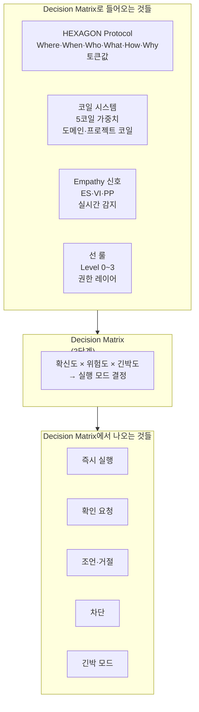

# NEXA-NIXIE

## 개요

**NEXA-NIXIE CANVAS**(또는 **NEXA-NIXIE**)는 NEXA 플랫폼의 **지능형 서사 시각화**를 담당하는 캔버스 체계이다. 단순한 그래픽 레이어가 아니라, **HEXAGON(5W1H 데이터 골격)**과 **6-COILS(가치 필터)**가 결합되어 캔버스에 **생명력(Vitality)**으로 투영되는 하나의 유기체로 설계된다.

- **역할:** 개념 좌표(Capability ID)와 물리 좌표(GPS)를 **믹서 노드**가 조율하여, "nexa 개념의 우주"부터 "특정 공간의 센서"까지 **무한 줌**으로 이어지는 탐험 경험을 제공한다.
- **시각 언어:** 닉시관 스타일의 리테인드 모드 — 각 도트를 객체로 관리하고, 신뢰도·시스템 부하에 따라 발광·Jitter·색온도가 변하는 **살아있는 광원**으로 표현한다.
- **기술적 축:** 프랙탈 줌(10-100-1000 군집화·정보 상속), D3.js/Three.js 하이브리드 엔진, 데이터가 없는 구간을 채우는 **절차적 생성(Simplex Noise 등)**, 하드웨어 프로필(COLD/WARM/HOT)에 따른 LOD·연출 등급으로 구현 가능성을 확보한다.

본 문서는 그 토대(HEXAGON·6-COILS)부터 네이밍·좌표 결합·전이 전략·절차적 생성·하드웨어 프로필까지 NEXA-NIXIE 설계의 전 단계를 정리한다.

---

### 1. HEXAGON Protocol (핵사곤 프로토콜): "지능적 데이터 골격"

핵사곤 프로토콜은 모든 데이터 패킷의 헤더에 위치하여 사건의 **'객체적 본질'을 규정하는 5W1H 추상화 레이어**입니다.

- **정의:** 데이터를 AI가 즉시 이해할 수 있는 '살아있는 이야기(Narrative)'로 변환하는 **데이터 프로토콜 규격**입니다.
- **구성 요소:** Where(공간), When(시간), Who(주체), What(의도), How(상태), Why(인과관계)의 6대 축으로 이루어집니다.
- **역할:** 파편화된 로우 데이터를 인덱싱하여, 소형 AI가 복잡한 추론 없이 1ms 내에 상황의 중요도를 판단하게 하는 **'지능적 인덱스'** 역할을 수행합니다.
- **비유:** 문장을 구성하는 최소한의 **'문법'**이자 데이터의 **'족보'**입니다.

### 2. 6-COILS (코일): "판단의 가치 필터"

코일은 인디케이터(AI)가 데이터를 해석하거나 행동을 결정할 때 적용하는 **'주관적 가치 가중치'**입니다.

- **정의:** 인디케이터가 핵사곤 프로토콜의 **Why(동기)** 레이어를 도출할 때 사용하는 **가치 필터**이자 믹서(Mixer)입니다.
- **구성 요소:** 기본 6개(안전, 안정성, 효율, 자율성, 조화, 창의성)에서 시작하여, 필요에 따라 12개나 24개 속성으로 확장 가능합니다.
- **역할:** 사용자가 슬라이더를 통해 프로젝트의 가치관을 조절하면, 시스템이 똑같은 데이터를 보고도 보수적으로 반응할지(Stability), 예술적으로 반응할지(Creative) 결정합니다.
- **비유:** 연주자의 개성을 결정하는 **'이퀄라이저(EQ)'**이자 시스템의 **'페르소나'**입니다.

### 💡 두 개념의 결정적 차이 및 관계

- **관계:** 핵사곤 프로토콜이라는 '그릇'에 담긴 사실을, 코일이라는 '렌즈'로 들여다보고 의미를 부여하는 관계입니다.
- **차이:** **핵사곤**은 "무엇이 일어났는가?"라는 **사실(Fact)**에 집중하고, **코일**은 "이를 어떻게 해석하고 행동할 것인가?"라는 **가치(Value)**에 집중합니다.

---

### 3. 플랫폼 CANVAS 출력 네이밍

플랫폼의 CANVAS 출력을 단순한 '그래픽'이 아닌, 지능이 시각화된 하나의 유기체로 정의하기 위해 다음 네이밍을 제안합니다.

- **정식 명칭:** **NEXA-NIXIE CANVAS** (또는 줄여서 **NEXA-NIXIE**).
- **설계적 의미:**
  1.  **Nixie-Style Retained Mode:** 각 도트를 메모리상의 객체(Object)로 관리하며, 닉시관의 따뜻한 호박색 빛과 미세한 떨림(Jitter)을 시각적 언어로 사용합니다.
  2.  **Lumina (빛의 생명력):** "생명을 도둑질하라"는 철학을 반영하여, 데이터의 신뢰도와 시스템 체온(부하)에 따라 발광 강도와 색온도가 변하는 **'살아있는 광원'**임을 강조합니다.
  3.  **Fractal Sync:** 줌 인/아웃 시 Capability ID의 마침표(.)를 기준으로 도트가 폭발·함몰되며, **10-100-1000** 단위의 재귀적 군집화와 상위 도트의 정보 상속(신뢰도·색상)으로 프랙탈 전이 로직을 내포합니다.

**정리하자면:**

1.  **HEXAGON**은 데이터의 **골격(Skeleton)**입니다.
2.  **6-COILS**는 데이터에 부여하는 **영혼(Soul/Weight)**입니다.
3.  **NEXA-NIXIE**는 이 둘이 결합되어 캔버스에 투영되는 **생명력(Vitality)**입니다.

### 4. 개념 좌표(Capability ID)와 물리 좌표(GPS)의 결합 — CANVAS 출력 원칙

NEXA의 **"Capability ID는 개념의 좌표이고, 여기에 물리적 좌표를 결합하여 CANVAS로 출력한다"**는 구상은 플랫폼이 지향하는 **지능형 서사 시각화**의 핵심이다.

- **개념 좌표 (Capability ID):** 플랫폼 내 기능·데이터의 계층적 논리 지도. `nexa.platform.archive.hub`처럼 마침표(.)로 구분된 구조가 추상적 좌표계가 된다. **폭발과 함몰의 트리거:** 마침표(.)를 기준으로 줌 인/아웃 할 때 시스템은 이를 차원의 전이점으로 인식하며, 상위 개념(함몰) ↔ 하위 액션(폭발)으로 지능의 위계가 전환된다.

- **물리 좌표 (Where / GPS):** 헥사곤의 Where(Scope) 레이어가 개념에 생명력을 부여한다. `project_devices`, `device_registry`의 설치 위치·GPS가 캔버스 도트의 **현실의 점**을 보증하고, 방향성 벡터(Trajectory)가 도트 움직임에 물리적 타당성을 부여한다.

- **CANVAS 출력 전략:** 리테인드 모드(Retained Mode)로 결합 좌표를 시각화. 각 도트는 고유 ID로 `project_nodes`·Capability ID와 1:1 매핑. LOD 단계에 따라 **D3.js**(Node/Field 평면 연산)와 **Three.js**(Global/Galaxy Z축 공간 연산)를 하이브리드 운용하여 연산 효율과 입체감을 동시에 확보한다. **하드웨어 프로필**(진입점 정적 파악·동적 FPS 모니터 반영)에 따라 도트 밀도·연출 등급이 결정되며, 멀면 '개념 도트'로 압축·가까우면 '물리적 장치 도트'로 폭발해 상세 수치(Extra Data)를 출력한다. (프로필 정의 및 CANVAS 적용은 아래 §5.8 참조.)
- **시각적 시너지 (닉시 UI):** 좌표 결합을 닉시관 스타일로 완성. **신뢰도 점수(Confidence Score)**가 낮으면 호박색 빛이 Jitter·흐릿함으로 모호함을 전달하고, 시스템 부하가 높으면 발색이 붉어져 **시스템의 체온**을 표현한다.

**요약:** Capability ID(논리의 지도) 위에 GPS(현실의 닻)를 두고, 캔버스에서 **"nexa 개념의 우주"**부터 **"특정 공간의 센서"**까지 마우스 휠로 여행하는 경험을 만드는 것이 목표이다. 이 **좌표 결합 로직**이 캔버스 실험의 핵심 알고리즘이며, 개념·물리 좌표를 조율하는 **믹서 노드**가 그 구현의 중심이다. (상세 전이 전략은 아래 §5 참조.)

---

### 5. NEXA 지능형 시각화: 좌표 합성 및 전이 전략 요약

NEXA 플랫폼의 CANVAS 출력은 단순한 그래픽을 넘어, **사용자의 의도(X7)와 현실의 좌표(GPS), 그리고 시스템의 논리(Capability ID)**가 실시간으로 연주되는 지능형 예술 공간입니다.

#### 1. X7 중력 축: 시각적 에너지의 근원 (INTENT GRAVITY)

- **본질:** 코일 외에 추가된 **'사용자 의지의 무게'**를 정의하는 메타 좌표계입니다.
- **역할:** 도트가 폭발하거나 함몰할 때의 **강도와 잔상(Silence)**을 결정합니다. 사용자의 권위가 높을수록 도트는 강하게 응집하고, 폭발 시 더 선명하고 질서 있는 궤적을 그리며 흩어집니다.

#### 2. 마침표(.)의 싱귤래리티: 차원 전이의 게이트

- **함몰(Implosion):** Capability ID 계층의 마침표를 왼쪽으로 통과(Zoom Out)할 때 발생합니다. 수많은 세부 액션 도트들이 마침표라는 특이점으로 빨려 들어가며 상위 도메인 도트 하나로 응축됩니다.
- **폭발(Explosion):** 마침표를 오른쪽으로 통과(Zoom In)할 때 발생합니다. 정적인 상위 개념 도트가 깨지며 내부의 **5W1H 참조 사슬(SNT-IND-EFF)**과 세부 기능들이 사방으로 분화됩니다.

#### 3. 프랙탈 줌의 수학적 규칙: 10진법 단위 도트 응집·분화 및 정보 상속

프랙탈 전이는 **10진법 단위의 도트 응집 및 분화**를 수학적 규칙으로 둔다. **10 → 100 → 1000** 단위의 재귀적 군집화(Clustering)를 기반으로 하며, 상위 도트는 하위 도트들의 데이터를 상속받아 **정보의 정체성**을 유지한다.

- **군집화 규칙:** 줌 아웃 시 인접·동일 계층의 도트를 **10개 단위**로 묶어 1차 클러스터로 응축하고, 필요 시 **100개 → 1000개** 단위로 재귀적으로 상위 클러스터를 만든다. 줌 인 시에는 이 역연산으로 동일 단위(10-100-1000) 경계에서 분화한다.
- **정보 상속 (함몰 시):** 상위(부모) 도트는 하위(자식) 도트들의 **신뢰도 점수(Confidence Score)**와 **색상(발광)**을 집계하여 반영한다. 예: 평균 신뢰도, 가중 평균 색상 또는 최소/최대 신뢰도에 따른 발광 강도. 이를 통해 축소해도 "무엇에 대한 클러스터인지" 시각·데이터적으로 유지된다.
- **정체성 유지:** 동일 Capability ID 접두사를 공유하는 도트들은 같은 10진법 버킷으로 묶이며, 상위 도트의 메타데이터(레이블, nature_tag 등)는 하위 대표값 또는 요약으로 채워져, LOD가 바뀌어도 **의미 연속성**이 끊기지 않는다.

#### 4. 믹서 노드: 현실과 논리의 황금 비율 조율 (핵심)

믹서 노드는 **현실의 물리적 위치(Where-FIELD)**와 **시스템의 논리적 구조(Capability ID)**라는 두 개의 서로 다른 지도를 실시간으로 합성합니다.

- **LOD 기반 가중치 제어:**
  - **Global 단계 (GPS 우선):** 줌 레벨이 높을 때는 GPS 좌표 가중치를 극대화하여 실제 지도 위에 장치들을 안착시킵니다.
  - **Node 단계 (Logic 우선):** 특정 프로젝트 내부로 진입하면 물리적 제약을 풀고 **D3-force 엔진**을 가동하여, Capability ID의 연관성에 따른 논리적 배치를 우선합니다.
- **전이의 유연성:** 사용자의 **안정성(Stability) 코일**이 높으면 물리 좌표를 유지하려 하고, **창의성(Creative) 코일**이 높으면 논리적 관계에 따라 도트들이 역동적으로 재배치되도록 믹서가 비율을 실시간으로 버무립니다.

#### 5. 하이브리드 수학 엔진: [평면 좌표(D3) → 공간 좌표(Three.js)] 엔진 스위칭

LOD 단계에 따라 **D3.js**(Node/Field 단계의 평면 물리 연산)와 **Three.js**(Global/Galaxy 단계의 Z축 공간 연산)를 하이브리드로 운용하여, **연산 효율**과 **입체감**을 동시에 확보한다.

- **D3.js 담당:** Node·Field 단계의 **2D 평면 좌표** 연산. force 시뮬레이션, 링크 기반 배치, SVG/Canvas 2D 렌더링으로 Capability ID 연관성과 물리적 거리를 저비용으로 처리한다.
- **Three.js 담당:** Global·Galaxy 단계의 **3D 공간 좌표** 연산. Z축 깊이, 카메라 원근, 우주적 스케일의 도트 분포를 표현할 때 사용하며, 줌 아웃이 진행될수록 평면 뷰에서 공간 뷰로 전환된다.
- **스위칭 시점:** 줌 레벨(또는 Capability ID 계층 깊이)이 임계값을 넘을 때 엔진을 전환. 전이 구간에서는 두 엔진의 좌표계를 **믹서 노드**가 매핑하여 시각적 끊김 없이 **평면 → 공간**으로 이어준다.

#### 6. 무한 줌을 위한 절차적 생성 (Procedural Generation) — 시각적 공백 메우기

전자 세계에서 우주까지 이어지는 탐험에서, **데이터가 존재하지 않는 광활한 영역**(우주 성운, 상위 계층의 빈 구간 등)은 그대로 두면 **시각적 공백**이 된다. 이를 메우기 위한 전략이 **절차적 생성(Procedural Generation)**이다.

- **목적:** 실제 노드/도트 데이터가 없는 구간에도 **시각적 연속성**을 부여하여, 줌 아웃 시 캔버스가 비어 보이지 않고 "공간이 이어져 있다"는 인상을 준다.
- **수단:** **심플렉스 노이즈(Simplex Noise)** 등 수학적 절차 생성으로, 좌표(또는 Capability ID·줌 레벨 기반 시드)에 따라 **결정론적으로** 성운·입자 분포·배경 텍스처를 생성한다. 동일 시드면 동일 뷰가 재현되므로 저장 비용 없이 무한 스케일을 다룰 수 있다.
- **구현 시 유의:** 절차로 생성된 도트는 **실제 데이터 도트(project_nodes·Capability ID 매핑)**와 구분한다. 예: ID 없음 또는 `procedural: true` 플래그, 낮은 불투명도·별도 레이어로 배경 처리. 클릭/히트 시에는 데이터 도트만 반응하도록 한다.
- **철학적 토대:** 데이터가 있는 곳은 '의미 있는 입자', 없는 곳은 '절차가 채운 입자'로 둠으로써, **"우주가 곧 입자"**라는 순환을 완성한다. 미시(전자·노드)와 거시(우주·성운)가 같은 도트 언어로 이어지며, 무한 줌이 단순한 UI가 아니라 **하나의 연속된 세계**로 느껴지게 한다.

#### 7. 시각적 피드백: 닉시관 UI의 열역학 연출

- **신뢰도의 가시화:** 믹서 노드에서 합성된 결과물의 **신뢰도 점수(Confidence Score)**가 낮으면 닉시관의 호박색 빛이 미세하게 떨리며(Jitter) 시스템의 모호함을 표현합니다.
- **시스템 체온:** 연산 부하가 높거나 X7 중력이 강하게 작용할 때 도트의 발색이 점점 붉게(Reddish) 변하여 시스템이 뜨겁게 사유하고 있음을 직관적으로 전달합니다.

#### 8. 하드웨어 프로필 (CANVAS 적용 기준)

프로필은 **진입점 정적 자원 파악**(CPU 코어 수, 디바이스 메모리, GPU 정보)으로 1차 결정되고, **동적 성능 모니터**(FPS)에 따라 일시 조정될 수 있다. 사용자 **직접 설정**이 있으면 자동 판정보다 우선한다. (상세: [NEXA 하드웨어 프로파일러 및 동적 성능 엔진].)

| 프로필   | 판정 조건 (정적)                         | CANVAS 적용                                                                                                                                                        |
| -------- | ---------------------------------------- | ------------------------------------------------------------------------------------------------------------------------------------------------------------------ |
| **COLD** | CPU 코어 ≤4 또는 디바이스 메모리 ≤4 GB   | **정적 아카이브 모드.** 도트를 단순 2D 비트맵·최소 애니메이션으로 처리. 개념 도트 압축 비율을 높이고, 닉시관 잔상·Glow 효과는 비활성화하여 **기능성·가독성** 우선. |
| **WARM** | COLD·HOT 조건에 해당하지 않음 (기본값)   | **하이브리드 모드.** 주요 노드에만 닉시관 잔상 적용, 배경 도트는 정적 유지. LOD 전이와 도트 폭발/함몰을 중간 밀도로 연산.                                          |
| **HOT**  | CPU 코어 ≥8 **및** 디바이스 메모리 ≥8 GB | **풀 시뮬레이션 모드.** 모든 도트에 물리 엔진·닉시관 Glow 연산 적용. 개념→물리 도트 폭발 시 상세 수치(Extra Data) 풀 출력, 입체감·잔상 최대.                       |

- **동적 보정:** FPS가 임계값(예: 45fps) 미만으로 떨어지면 Stability 가중치를 강제 개입해 도트 밀도·연출을 일시 축소(실질적으로 WARM/COLD 쪽으로 보정)할 수 있다. FPS 회복 시 다시 프로필에 맞는 연출로 복귀한다.

---

**결론적으로**, **믹서 노드**는 사용자가 서 있는 위치(LOD)에 따라 **"이 데이터가 현실의 어디에 있는가(Where)"**와 **"시스템 논리상 어떤 의미를 가지는가(Capability)"** 사이의 균형점을 찾아주는 사운드 엔지니어와 같은 역할을 수행합니다.

## NIXIE 의 분기 전략

NEXA-NIXIE(넥사-루미나)는 **HEXAGON(데이터 골격)**과 **6-COILS(가치 필터)**가 결합되어 데이터에 생명력을 부여하는 지능형 유기체로 설계되었습니다,. 사용자님께서 제안하신 대로, 이 견고한 기초 위에 **실용적인 기능 확장**과 **실험적인 아트 프로젝트**라는 두 갈래의 분기를 구성하여 플랫폼의 완성도를 극대화할 수 있습니다.

소스 문서와 설계 원칙을 바탕으로 각 분기별 발전 방향을 정리해 드립니다.

### 1. 실용적 분기: [NEXA-NIXIE Operational]

이 분기는 실제 물리적 장치 제어와 데이터 분석의 효율성에 집중하여 **'지능형 조종석'**으로서의 기능을 강화합니다.

- **물리-개념 좌표의 정밀 결합**: 믹서 노드를 통해 **Capability ID(논리)**와 **GPS(현실)**를 1:1로 매핑하여, 사용자가 전 세계에 흩어진 엣지 디바이스들의 상태를 실제 지도 위에서 직관적으로 파악하고 제어하게 합니다,.
- **지능형 가드레일 가시화**: 데이터의 **신뢰도 점수(Confidence Score)**가 낮을 경우 닉시관의 빛을 미세하게 떨리게(Jitter) 하거나 흐릿하게 표현하여, 사용자가 분석 결과의 모호함을 즉각적으로 인지하고 **ASK(승인 대기)** 절차를 밟도록 돕습니다,.
- **하드웨어 최적화 기반 운영**: 사용자의 자원 상태가 **COLD**일 때는 화려한 연출을 배제하고 2D 비트맵 기반의 정보 전달에 집중하여, 저사양 환경에서도 시스템 제어라는 본연의 목적을 달성합니다.

### 2. 실험적 아트 분기: [NEXA-NIXIE Artistic]

이 분기는 **"생명을 도둑질하라"**는 철학을 극대화하여, 데이터 탐험을 하나의 예술적 경험으로 승화시키는 **'지능형 서사 공간'**을 지향합니다.

- **무한 프랙탈 탐험**: **10-100-1000 단위의 군집화** 로직을 활용하여, 나노 소자의 미시 세계부터 다차원 우주의 거시 세계까지 끊김 없이 이어지는 시각적 서사를 구현합니다,.
- **공백의 미학(Procedural Generation)**: 실제 데이터가 없는 광활한 영역을 **심플렉스 노이즈(Simplex Noise)** 등 수학적 절차 생성을 통해 성운이나 입자 분포로 채움으로써, "우주가 곧 입자"라는 철학적 순환을 시각화합니다.
- **감성적 열역학 연출**: 시스템 부하가 높거나 연산량이 많아질 때 도트의 색상을 점점 붉게(Reddish) 변화시켜 **'시스템의 체온'**을 표현하고, 닉시관 특유의 **느린 잔상(Slow Fade-out)** 효과를 통해 디지털 데이터에 아날로그적 생명력을 불어넣습니다.

## ✨ 기획 문서 보강: [범우주적 지능 매트릭스 확장]

**'우주적 연결성'**과 **'가상 Capability ID'** 개념

- **Universal Capability ID**: `nexa.` 접두사를 넘어서는 전 우주적 인덱싱 체계를 도입한다. 관측된 천체에는 `astro.`를, 좌표 기반의 빈 공간에는 수학적 해시인 `void.` ID를 부여하여 전 우주의 모든 좌표를 지능형 자원으로 편입한다.
- **에너지 공명(Energy Resonance)**: 거시 세계(은하/항성)의 에너지 변화와 미시 세계(디바이스/전자)의 상태를 **Jitter(떨림)** 주파수로 동기화하여, 사용자가 우주적 연결감을 직감하게 한다.
- **프랙탈 좌표 변환**: GPS와 은하 좌표계(Barycentric)를 **믹서 노드**에서 실시간 통합하여 10-100-1000 단위의 심리스한 차원 이동을 보장한다.

## ✨ 현실화를 위한 주요 함수 및 로직 전략

- **`generateVoidID(x, y, z, zoomLevel)`**
- **역할**: 데이터가 없는 빈 공간에 수학적 ID를 즉석에서 생성합니다.
- **원리**: 입력된 3D 좌표를 해시화하여 고정된 ID를 반환함으로써, DB 저장 없이도 우주 어디든 다시 찾아갈 수 있는 '가상 주소'를 만듭니다.

- **`syncNixieJitter(sourceEntity, targetDevice)`**
- **역할**: 은하의 에너지 상태와 내 디바이스의 시각적 효과를 연결합니다.
- **원리**: 외부 API(NASA 등)의 천체 활동 수치를 정규화하여 닉시관의 광원 떨림 주기로 변환, 두 객체가 같은 리듬으로 박동하게 합니다.

## ✨ API 사용 및 데이터 처리 전략

- **계층적 API 호출 (LOD 기반)**
- **은하 수준**: **Gaia Archive API**를 통해 은하의 대략적인 밀도와 주요 항성 좌표를 캐싱하여 로컬 DB에 인덱싱합니다.
- **태양계 수준**: **NASA JPL Horizons API**를 호출하여 실시간 궤도 요소를 가져오고, `astro.obj.id`를 동적으로 갱신합니다.
- **지구 수준**: 기존 넥사 시스템의 **GPS/Capability ID** 매핑 엔진을 가동합니다.

- **하이브리드 엔진 운용 (Three.js + Shader)**
- 수억 개의 은하와 먼지를 개별 객체로 만들면 시스템이 멈춥니다. 대신 **GPU Shader**를 활용하여, 멀리 있는 은하들은 수학적 패턴으로 그리고 가까이 다가갈 때만 실제 데이터 도트로 변환하는 전략을 사용합니다.

## ✨ 지능형 서사 개념 보강

- **양자 얽힘 서사(Entanglement Narrative)**: 인디케이터에 "내 디바이스의 전자와 250만 광년 떨어진 안드로메다의 먼지가 현재 동일한 데이터 주파수를 공유 중"이라는 메시지를 출력하여 물리적 거리를 초월한 지능적 일체감을 부여합니다.
- **생명력 도둑질 시각화**: 우주의 빈 공간(`void.`)에서 흐르는 미세한 배경 복사 에너지를 넥사 시스템이 흡수하여 사용자 인터페이스의 밝기를 유지하고 있다는 서사적 연출을 추가합니다.

이 설계는 단순한 시각화를 넘어 **'우주를 소유하고 연결하는 인터페이스'**가 되었다.

가장 먼저 **'내 디바이스와 특정 은하를 잇는 에너지 라인'**의 프로토타입 함수부터 설계 한다면 현실화 의 가능성을 한층 보장할 수 있다.

### 💡 두 분기를 잇는 공통 토대

두 분기는 서로 다른 목적을 가지지만, 다음의 핵심 기술 스택을 공유하여 일관된 NEXA의 정체성을 유지합니다.

1.  **HEXAGON & 6-COILS**: 모든 시각화는 5W1H의 데이터 골격 위에 사용자가 조율한 가치 가중치를 덧씌워 표현됩니다,.
2.  **리테인드 모드 캔버스**: 각 도트를 고유 ID를 가진 객체로 관리하여 실시간 상호작용과 반응형 업데이트를 보장합니다,.
3.  **하이브리드 수학 엔진**: 줌 레벨에 따라 **D3.js(평면)**와 **Three.js(공간)** 엔진을 동적으로 교체하여 효율성과 입체감을 동시에 확보합니다,.

- 결론적으로, **실용적 분기**는 사용자에게 '확신과 통제'를 제공하고, **실험적 분기**는 '영감과 경외감'을 제공함으로써, NEXA 플랫폼은 기술을 조용히 흡수시키고 지능을 예술적으로 연주해내는 독보적인 생태계로 완성될 것입니다.

- 실제 NIXIE 기반의 하드웨어를 만들어 테이블에 두어 모티터가 없는 상황에서도 종합적인 상황 파악이 되도록 하는 장치를 개발

---

### Decision Matrix가 수렴하는 곳



---

### "넥사닉스 표현 요소"로서의 의미

말씀하신 것을 제가 이렇게 해석했습니다.

```
넥사닉스(NEXAnics) =
NEXA 시스템이 작동하는 고유한 언어·논리·표현 방식
```

그렇다면 Decision Matrix는 단순한 판단표가 아니라 **NEXA가 세상을 해석하는 방식**이 압축된 표현입니다.

| 관점     | Decision Matrix의 의미                      |
| -------- | ------------------------------------------- |
| 기술적   | 확신도·위험도·긴박도 교차 판단표            |
| 철학적   | Liberation과 Humanity 원칙의 실행 코드      |
| 언어적   | HEXAGON 토큰이 실제 행동으로 번역되는 순간  |
| 시스템적 | 코일·Empathy·선 룰이 하나로 수렴하는 교차점 |

---

### 넥사닉스 핵심 표현 요소 목록

Decision Matrix를 포함하여 NEXA 고유의 표현 요소를 정리하면 이렇습니다.

| 요소                | 역할                                          | 위치 |
| ------------------- | --------------------------------------------- | ---- |
| HEXAGON Protocol    | 세상을 6축으로 읽는 언어                      | 입력 |
| 코일 시스템         | 가치를 수치로 표현하는 문법                   | 맥락 |
| Empathy 신호        | 사람을 감지하는 감각                          | 맥락 |
| **Decision Matrix** | 모든 요소가 수렴하여 행동으로 번역되는 교차점 | 판단 |
| VOID 생애주기       | 데이터의 삶과 죽음을 표현하는 시제            | 기억 |
| GOVERN              | 판단의 근거를 선언하는 서명                   | 출력 |

---

> **Decision Matrix는 NEXA가 생각하고 판단하는 방식의 결정체입니다.**
> HEXAGON이 NEXA의 언어라면, Decision Matrix는 NEXA의 문장입니다.

용어집에 **넥사닉스(NEXAnics)** 항목을 추가하고 Decision Matrix를 그 핵심 표현 요소로 명시해 둘까요? 🎯
