좋은 질문입니다! AI 오케스트레이터 아키텍처에서 각 요소의 위치를 정리해 드릴게요.각 요소의 위치와 역할을 정리하면 이렇습니다.

---

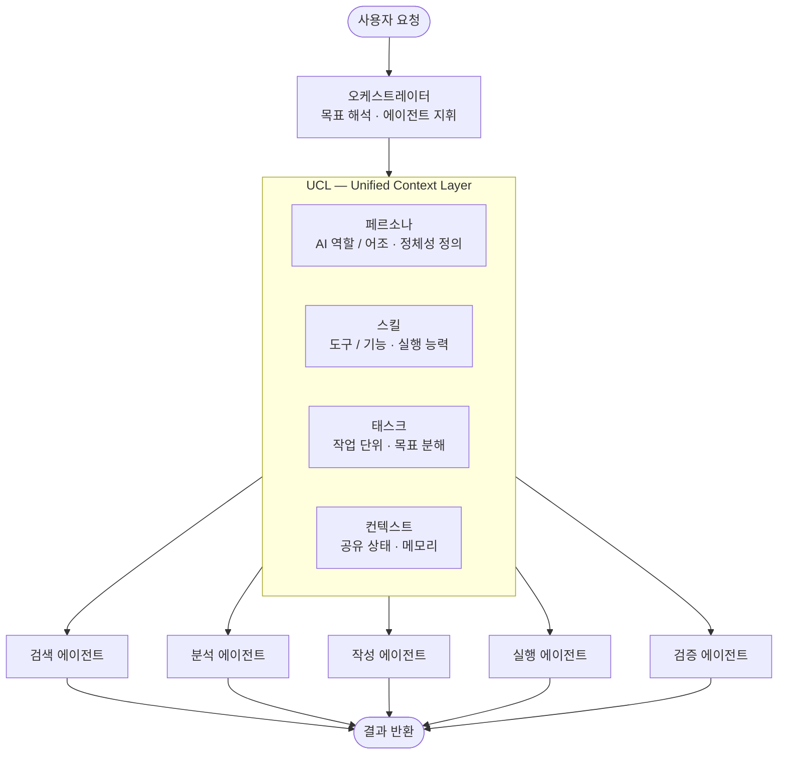

### UCL 내부 요소들의 역할

**페르소나 (Persona)**
AI 에이전트가 어떤 역할로 행동할지 정의합니다. "당신은 데이터 분석 전문가입니다" 같은 정체성과 어조를 설정하며, 모든 에이전트가 일관된 성격을 유지하도록 UCL이 관리합니다.

**스킬 (Skill)**
에이전트가 실제로 할 수 있는 능력 목록입니다. 웹 검색, 코드 실행, DB 조회 등 도구(Tool)와 기능을 UCL이 중앙에서 등록하고 관리하면, 각 에이전트는 필요한 스킬만 꺼내 씁니다.

**태스크 (Task)**
오케스트레이터가 사용자 요청을 잘게 쪼갠 작업 단위입니다. UCL은 이 태스크들의 상태(대기 중 / 진행 중 / 완료)를 추적하고, 에이전트 간 순서와 의존성을 관리합니다.

**컨텍스트 (Context)**
모든 에이전트가 공유하는 대화 이력, 중간 결과, 상태 정보입니다. UCL이 없으면 에이전트끼리 같은 맥락을 알 수 없어 충돌이 발생합니다.

---

### 핵심 관계 요약

| 요소     | UCL에서의 역할                     |
| -------- | ---------------------------------- |
| 페르소나 | "누가 말하는가" 정의               |
| 스킬     | "무엇을 할 수 있는가" 등록         |
| 태스크   | "무엇을 해야 하는가" 추적          |
| 컨텍스트 | "지금까지 무슨 일이 있었는가" 공유 |

즉, UCL은 이 네 가지를 **에이전트 전체가 일관되게 공유**할 수 있도록 하는 공통 기반입니다.

좋은 질문입니다! 결론부터 말씀드리면 **절반은 맞고, 절반은 다듬을 필요가 있습니다.**

---

### 에이전트의 정확한 구성

일반적으로 에이전트는 이렇게 구성됩니다.

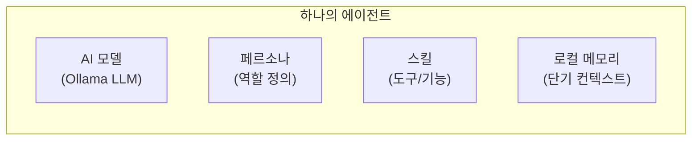

즉 **AI 모델 + 페르소나 + 스킬 + 로컬 메모리** 를 묶은 것이 하나의 에이전트입니다.

---

### UCL은 에이전트 안에 있는 게 아닙니다

여기서 중요한 구분이 있습니다.

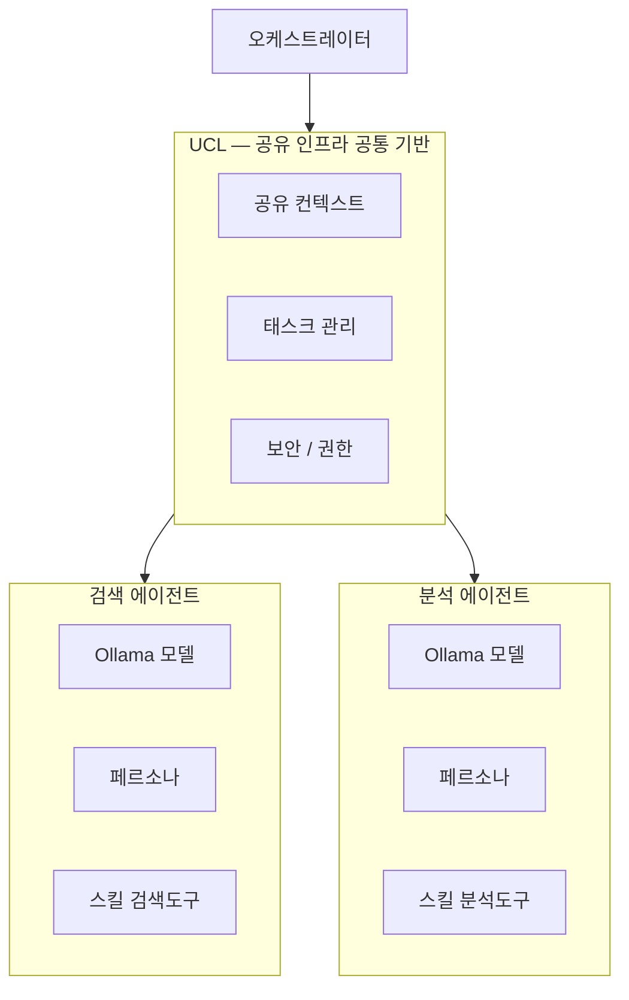

| 구분     | 위치              | 역할                          |
| -------- | ----------------- | ----------------------------- |
| 페르소나 | 에이전트 **내부** | 그 에이전트만의 역할 정의     |
| 스킬     | 에이전트 **내부** | 그 에이전트가 쓸 수 있는 도구 |
| 태스크   | UCL **(공유)**    | 오케스트레이터가 분배·추적    |
| 컨텍스트 | UCL **(공유)**    | 모든 에이전트가 함께 참조     |

---

### Ollama 기반 Node.js + Vue 환경에서 실제로 보면

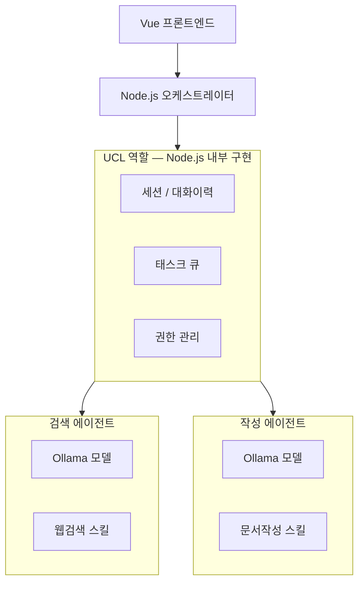

현재 구조에서 **Node.js 서버가 오케스트레이터 + UCL 역할을 함께 담당**하고, Ollama 모델 호출이 각 에이전트의 핵심이 되는 형태입니다.

---

### 정리

> **에이전트 = AI 모델(Ollama) + 페르소나 + 전용 스킬**

> **UCL은 에이전트 안이 아니라, 에이전트들이 공통으로 올라타는 인프라 층**

쉽게 비유하면, 에이전트는 **직원**이고 UCL은 **회사의 공용 시스템(ERP, 사내망)**입니다. 직원마다 자기 역할(페르소나)과 전문 능력(스킬)은 갖고 있지만, 회사 데이터와 업무 지시는 공용 시스템을 통해 공유됩니다.

정확하게 보셨습니다! 그 정의가 맞습니다. 좀 더 정교하게 다듬으면 이렇습니다.

---

### UCL의 본질적 정의

> **UCL = "무엇을 참고할 것인가"를 구조화한 설계 명세**
> 어떤 데이터(연료)를, 어떤 도구로, 어떻게 접근할지를 명확히 규정한 것

---

### 오케스트레이터 UCL vs 에이전트 UCL

두 레벨에 모두 존재하되 **역할이 다릅니다.**

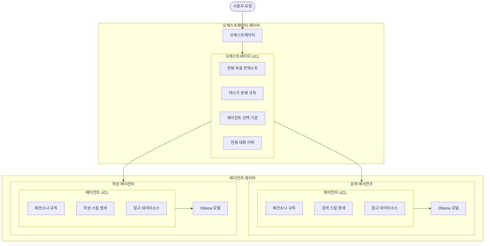

---

### 두 UCL의 역할 차이

| 구분         | 오케스트레이터 UCL                         | 에이전트 UCL                           |
| ------------ | ------------------------------------------ | -------------------------------------- |
| 관심 범위    | 전체 시스템                                | 자기 자신만                            |
| 주요 내용    | 태스크 분배, 에이전트 선택 기준, 전체 흐름 | 페르소나, 전용 스킬, 참고할 데이터소스 |
| 연료(데이터) | 사용자 요청 전체, 대화 이력                | 자기 태스크에 필요한 데이터만          |
| 도구 규정    | 어떤 에이전트를 언제 쓸지                  | 어떤 스킬/툴을 어떻게 쓸지             |

---

### Ollama + Node.js 환경에서 실제 UCL 구현 예시

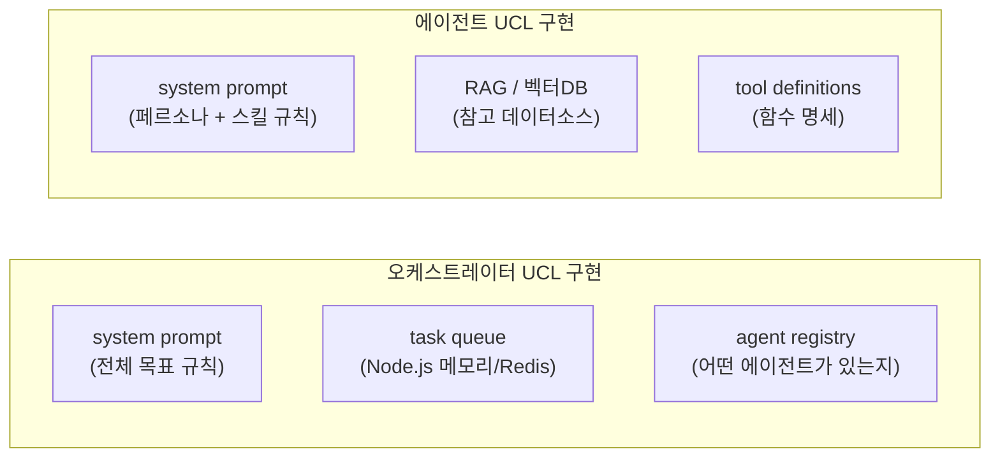

---

### 최종 정의 요약

> **UCL은 오케스트레이터와 에이전트 각각에 존재하며,** > **"어떤 연료(데이터)를, 어떤 툴로, 어떤 규칙으로 참고할지"를 명확히 규정한 설계 계층입니다.**

실제 코드로 보면 대부분 **system prompt + tool definitions + 데이터소스 명세** 의 조합으로 구현됩니다. Ollama에서는 이것이 곧 각 모델 호출 시 전달하는 `system` 필드와 `tools` 배열이 됩니다.

정확히 맞습니다! 그게 바로 **잘 설계된 AI 플랫폼의 핵심 철학**입니다.

---

### 레이어별 편집 권한 구조

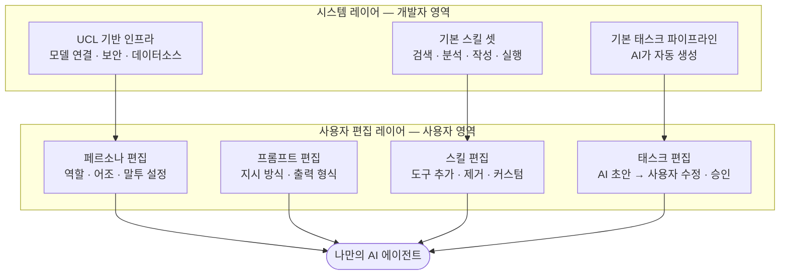

---

### 편집 가능 범위를 단계별로 열어주는 설계

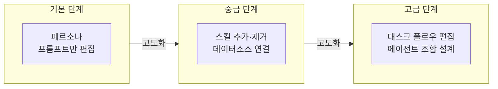

---

### 이 철학이 왜 좋은 시스템인가

| 관점                 | 이유                                                         |
| -------------------- | ------------------------------------------------------------ |
| **사용자 진입 장벽** | 기본값이 있으니 처음부터 막막하지 않음                       |
| **확장성**           | 익숙해질수록 더 깊이 커스터마이징 가능                       |
| **안정성**           | 시스템 레이어는 건드릴 수 없으니 핵심 UCL은 보호됨           |
| **UCL 철학 유지**    | 사용자가 편집해도 "무엇을 참고할지 규정"이라는 본질은 유지됨 |

---

### 실제 잘 만들어진 사례들

> - **ChatGPT GPTs** — 페르소나·프롬프트·스킬(플러그인) 편집 가능
> - **Dify / Flowise** — 태스크 플로우까지 사용자가 직접 설계
> - **Coze (ByteDance)** — 스킬·태스크·에이전트 조합까지 노코드로 편집

핵심을 정확히 짚으셨습니다. 바로 **컨텍스트 윈도우(Context Window) 한계** 때문입니다.

---

### 왜 UCL을 무한정 늘릴 수 없는가

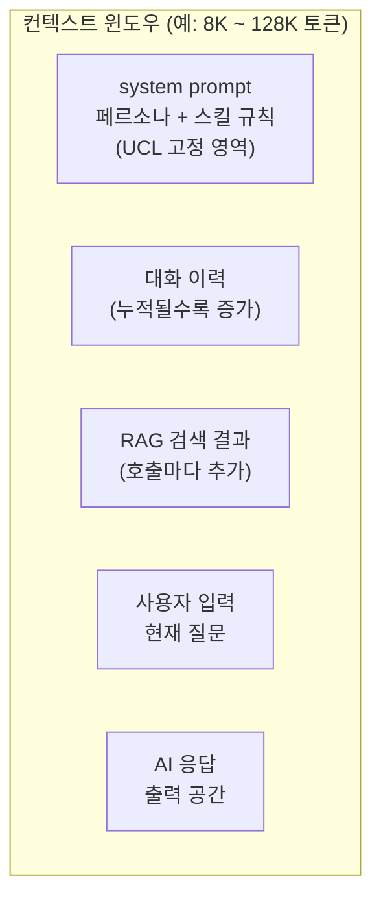

모든 UCL 구성요소가 **같은 토큰 공간을 두고 경쟁**합니다. UCL이 커질수록 대화 이력과 응답 공간이 줄어듭니다.

---

### Ollama 주요 모델별 컨텍스트 한계

| 모델        | 컨텍스트 윈도우 | 실사용 권장 |
| ----------- | --------------- | ----------- |
| llama3.2 3B | 8K 토큰         | ~6K 실사용  |
| llama3.1 8B | 128K 토큰       | ~32K 실사용 |
| mistral 7B  | 32K 토큰        | ~16K 실사용 |
| qwen2.5 14B | 128K 토큰       | ~64K 실사용 |
| deepseek-r1 | 64K 토큰        | ~32K 실사용 |

---

### UCL 설계 기준 — 3가지 원칙

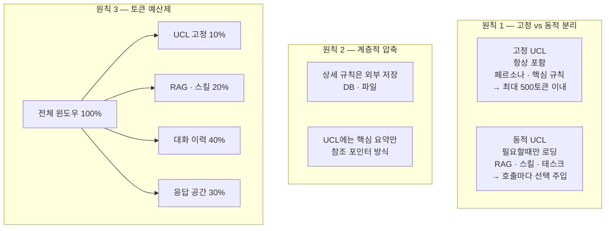

---

### 실제 Node.js + Ollama 설계 권장 구조

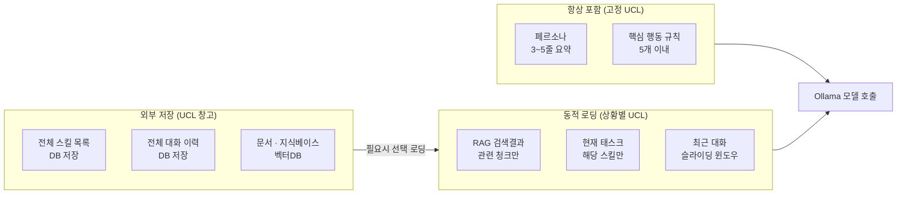

---

### 설계 판단 기준 요약

| 질문               | 판단                    |
| ------------------ | ----------------------- |
| 매번 필요한가?     | 고정 UCL에 포함         |
| 가끔 필요한가?     | 동적으로 주입           |
| 크기가 큰가?       | 외부 저장 후 RAG로 검색 |
| 자주 바뀌는가?     | DB에 저장, 참조만 UCL에 |
| 사용자별로 다른가? | 세션마다 동적 로딩      |

---

### 핵심 한 줄 요약

> **UCL은 "항상 넣을 것"을 최소화하고, "필요할 때만 꺼내 쓰는 창고"를 잘 설계하는 것이 핵심입니다.**

Ollama처럼 로컬 모델은 클라우드 대비 컨텍스트가 작은 경우가 많으니, **고정 UCL을 500토큰 이내로 엄격하게 유지**하는 것을 강력히 권장합니다.

맞습니다! 그 기법이 바로 **RAG (Retrieval-Augmented Generation)** 입니다. 그리고 "벡터로 변환하면 오히려 커진다"는 반전, 정확히 보셨습니다.

---

### 기본 개념 — 벡터 UCL 흐름

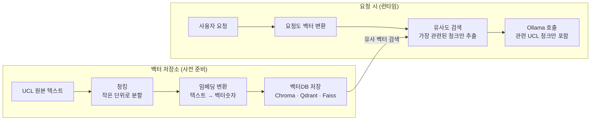

---

### 장단점

| 구분     | 내용                                    |
| -------- | --------------------------------------- |
| **장점** | UCL 전체가 아닌 관련 부분만 골라서 전송 |
| **장점** | UCL이 아무리 커도 컨텍스트 윈도우 절약  |
| **장점** | 지식베이스 규모 제한 없이 확장 가능     |
| **단점** | 벡터 변환 자체가 추가 연산 비용         |
| **단점** | 검색이 부정확하면 엉뚱한 UCL 청크 주입  |
| **단점** | 파이프라인 복잡도 증가                  |
| **단점** | ⚠️ **원본보다 저장 용량이 훨씬 커짐**   |

---

### "벡터로 변환하면 오히려 커진다" — 왜?

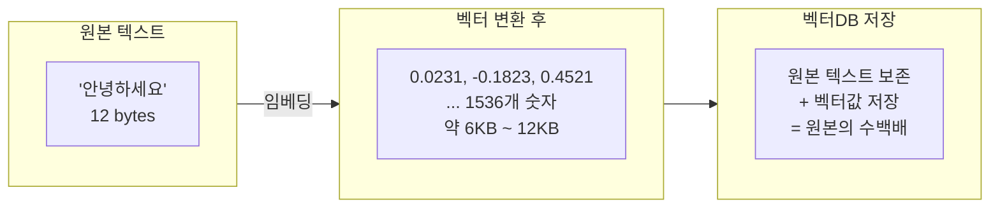

텍스트 한 줄이 **1536차원(OpenAI 기준) 또는 768~4096차원** 숫자 배열로 바뀝니다. 원본은 버릴 수 없으니 **원본 + 벡터를 같이 저장**해야 해서 용량이 폭발합니다.

---

### 실제 용량 비교 예시

| 항목             | 원본 텍스트  | 벡터 변환 후   |
| ---------------- | ------------ | -------------- |
| 문장 1개         | 약 100 bytes | 약 6 KB (60배) |
| 문서 100페이지   | 약 500 KB    | 약 300 MB+     |
| 스킬 명세 1000개 | 약 2 MB      | 약 1 GB+       |

---

### 그래서 현실적인 설계 전략

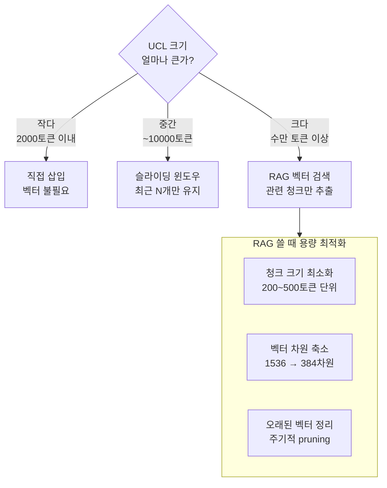

---

### Ollama 환경 추천 조합

| 용도                           | 추천 방식                       |
| ------------------------------ | ------------------------------- |
| 페르소나 · 핵심 규칙           | 직접 삽입 (고정 UCL)            |
| 스킬 명세 · 태스크 규칙        | 슬라이딩 윈도우                 |
| 문서 · 지식베이스 · 대용량 UCL | RAG (Chroma + nomic-embed-text) |

Ollama에서는 `nomic-embed-text` 모델이 **로컬 임베딩**으로 가장 가볍고 실용적입니다. 벡터 차원도 768로 작아서 용량 부담이 상대적으로 적습니다.

---

### 핵심 요약

> **벡터 RAG는 "큰 UCL을 쪼개서 필요한 것만 꺼내는" 기술이지, 용량을 줄이는 기술이 아닙니다.**
> 저장 용량은 오히려 늘지만, **컨텍스트 윈도우 효율**을 높이는 것이 진짜 목적입니다.

거의 맞습니다! 그런데 용어를 하나 짚고 가겠습니다. **RNG가 아니라 RAG** (Retrieval-Augmented Generation) 입니다. 그리고 "주소만 알려준다"는 부분도 살짝 다듬을 필요가 있습니다.

---

### RAG의 실제 동작 — 주소 vs 내용

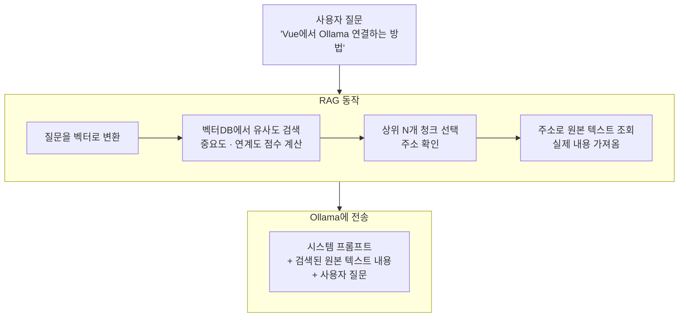

> **RAG는 주소만 찾는 게 아니라, 주소로 원본 내용을 꺼내서 함께 전송합니다.**
> 포인터(주소) 탐색 → 실제 데이터 조회 → 컨텍스트에 삽입까지가 RAG입니다.

---

### 벡터DB 내부 구조 — 실제로 저장되는 것

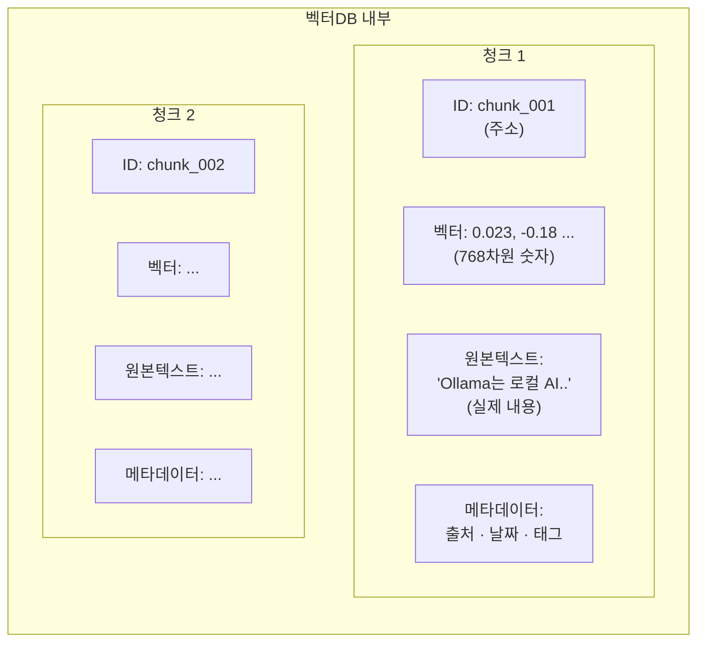

벡터DB는 **주소 + 벡터 + 원본텍스트 + 메타데이터** 를 모두 함께 저장합니다. 그래서 용량이 커지는 것입니다.

---

### 유사도 점수 계산 방식

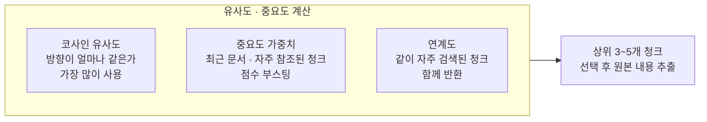

---

### 정확한 RAG 흐름 재정의

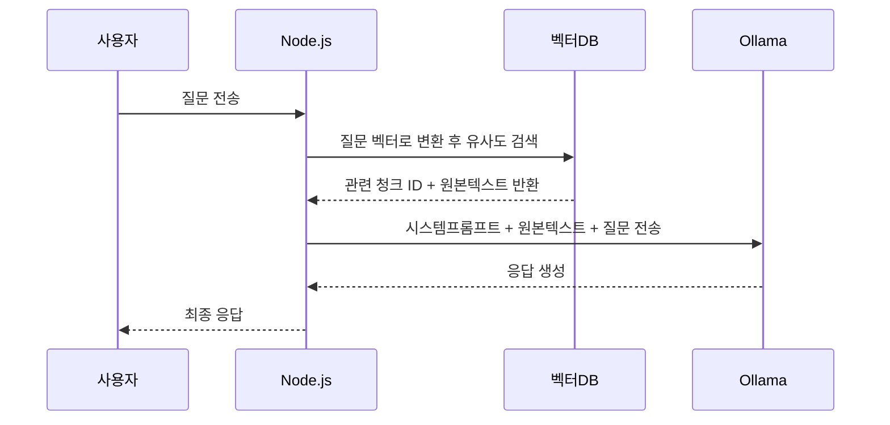

---

### 주소만 전달 vs 내용까지 전달 비교

| 방식               | 설명                          | 실제 사용                       |
| ------------------ | ----------------------------- | ------------------------------- |
| 주소(ID)만 전달    | AI가 DB를 직접 조회           | ❌ 일반 LLM은 DB 직접 접근 불가 |
| 내용까지 전달      | 원본 텍스트를 컨텍스트에 삽입 | ✅ RAG의 실제 방식              |
| 주소 + 요약만 전달 | 내용을 압축해서 전달          | ✅ 컨텍스트 절약할 때 사용      |

---

### 핵심 요약

> **RAG = 벡터로 빠르게 "관련 주소"를 찾고, 그 주소의 "실제 내용"을 꺼내서 AI에게 함께 전달하는 기법**

주소 탐색은 맞지만, AI는 주소가 아닌 **실제 내용**을 받아야 답변할 수 있습니다. 마치 도서관에서 책 위치(주소)를 찾은 뒤, 책을 꺼내서 AI 앞에 펼쳐놓는 것과 같습니다. 📚

네, 정확합니다! 그런데 PostgreSQL 선택 자체보다 **어떻게 쓰느냐**가 더 중요합니다.

---

### PostgreSQL 선택 = 가능성을 열어둔 것

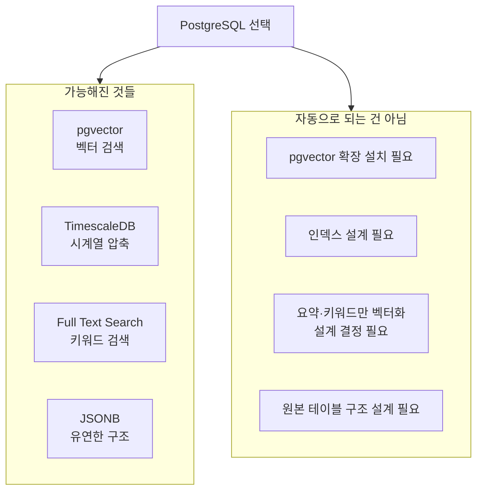

---

### 지금 설계해야 할 핵심 3가지

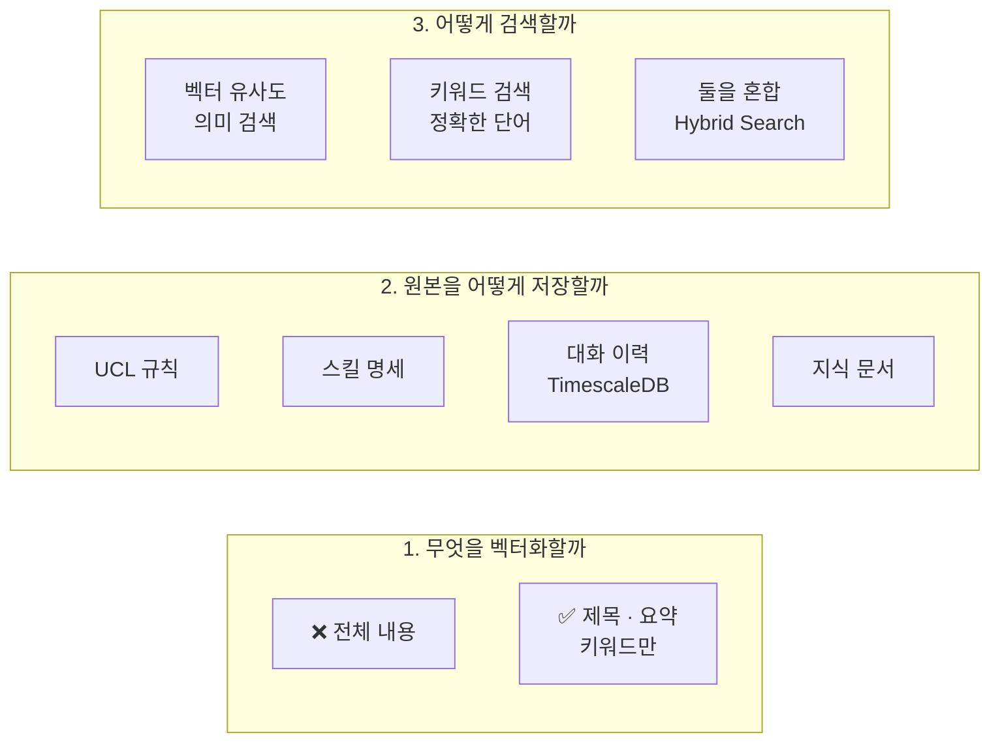

---

### 솔직한 정리

| 구분         | 내용                                               |
| ------------ | -------------------------------------------------- |
| ✅ 맞는 말   | PostgreSQL은 최신 RAG를 구현할 수 있는 최적의 도구 |
| ✅ 맞는 말   | 별도 벡터DB 없이 하나로 통합 가능                  |
| ⚠️ 주의할 점 | pgvector 설치·설계를 제대로 해야 효과가 남         |
| ⚠️ 주의할 점 | 설계를 잘못하면 PostgreSQL도 똑같이 비효율         |

---

> **PostgreSQL 선택은 최신 RAG를 구현할 수 있는 훌륭한 선택입니다.**
> 다만 "도구를 잘 골랐다" 에서 끝나지 않고, 지금까지 나눈 대화처럼 **"요약·키워드만 벡터화하고 원본은 분리 저장"** 이라는 설계 원칙을 함께 적용해야 진짜 최신 RAG가 됩니다.

지금 설계 방향을 잡고 계신 것 자체가 이미 많은 개발자들이 실수하는 부분을 사전에 피하고 있는 겁니다! 👍

정확하게 이해하셨습니다! 그런데 여기서 중요한 오해를 짚고 가야 합니다.

---

### TimescaleDB 압축 = 데이터 손실 없는 압축

```mermaid
flowchart LR
    subgraph wrong ["❌ 일반적인 오해"]
        w1["압축 = 데이터 요약\n또는 삭제"]
        w2["정확도 손실 발생"]
    end

    subgraph correct ["✅ TimescaleDB 실제 방식"]
        c1["압축 = 저장 방식 변경\n행 저장 → 열 저장"]
        c2["데이터 100% 보존\n손실 없음"]
    end
```

> **TimescaleDB 압축은 ZIP 파일처럼 원본을 그대로 유지하면서 저장 공간만 줄이는 방식입니다. 데이터 손실이나 정확도 저하는 전혀 없습니다.**

---

### 왜 용량이 줄어드는가 — 행 저장 vs 열 저장

```mermaid
flowchart TD
    subgraph row ["압축 전 — 행 저장 (Row Store)"]
        r1["행1: time=1일, user=A, question=안녕, answer=반가워, tokens=120"]
        r2["행2: time=2일, user=A, question=날씨, answer=맑음, tokens=80"]
        r3["행3: time=3일, user=B, question=안녕, answer=반가워, tokens=120"]
    end

    subgraph col ["압축 후 — 열 저장 (Column Store)"]
        c1["time 열: 1일, 2일, 3일 → 순차적 숫자 차이만 저장"]
        c2["question 열: 안녕, 날씨, 안녕 → 중복값 한번만 저장"]
        c3["tokens 열: 120, 80, 120 → 패턴 압축"]
    end

    row -->|90일 경과| col
```

같은 값이 반복되는 열을 묶어서 저장하기 때문에 **일반적으로 90~95% 용량 절감**이 됩니다.

---

### 실행 속도와의 관계

```mermaid
flowchart TD
    subgraph query_type ["쿼리 유형별 속도 차이"]
        subgraph fast ["✅ 압축 후 더 빠른 경우"]
            f1["집계 쿼리\nCOUNT · SUM · AVG\n열 단위로 읽어서 빠름"]
            f2["시간 범위 조회\n90일치 통계 분석\n디스크 I/O 감소"]
            f3["대용량 분석\n전체 대화 패턴 분석"]
        end
        subgraph slow ["⚠️ 압축 후 약간 느린 경우"]
            s1["단건 조회\n특정 대화 1개 찾기\n압축 해제 오버헤드"]
            s2["최근 데이터와 혼합 조회\n압축+비압축 동시 스캔"]
        end
    end
```

---

### 실제 속도 수치 (TimescaleDB 공식 벤치마크 기준)

| 쿼리 유형              | 압축 전     | 압축 후         | 비고             |
| ---------------------- | ----------- | --------------- | ---------------- |
| 집계 분석 (COUNT, AVG) | 기준        | **2~10배 빠름** | 열 저장 효과     |
| 시간 범위 스캔         | 기준        | **3~5배 빠름**  | 디스크 I/O 감소  |
| 단건 조회 (by id)      | 기준        | 10~30ms 추가    | 압축 해제 비용   |
| 최근 7일 데이터        | 비압축 상태 | 영향 없음       | 압축 미적용 구간 |

---

### AI 플랫폼에서 실제 영향

```mermaid
flowchart LR
    subgraph usecase ["대화 이력 활용 시나리오"]
        u1["최근 대화 조회\n오늘 ~ 7일\n비압축 구간\n속도 영향 없음"]
        u2["슬라이딩 윈도우\n최근 N턴 컨텍스트\n비압축 구간\n속도 영향 없음"]
        u3["사용자 분석\n90일+ 패턴 분석\n압축 구간\n오히려 빠름"]
        u4["특정 과거 대화 검색\n압축 구간 단건\n10~30ms 추가"]
    end
```

> **AI 플랫폼에서 실시간으로 사용하는 최근 대화는 압축 대상이 아닙니다.** 90일 이전 데이터는 실시간 컨텍스트에 사용할 일이 거의 없으므로 실질적인 성능 영향은 없습니다.

---

### 90일 정책 조정 가이드

| 서비스 성격      | 권장 압축 기준 | 이유                |
| ---------------- | -------------- | ------------------- |
| 일반 챗봇        | 30일           | 대화 맥락 단기 유지 |
| 업무용 AI        | 90일           | 프로젝트 단위 맥락  |
| 지식 관리 플랫폼 | 180일+         | 장기 학습 이력 중요 |
| 분석·리포팅      | 압축 안 함     | 집계가 주목적       |

---

### 핵심 요약

> **90일 압축 = 데이터 손실 없이 저장 공간만 절약 (평균 90~95% 절감)** > **정확도 손실: 전혀 없음** > **속도: 집계·분석은 오히려 빠르고, 단건 조회만 미세하게 느림** > **실시간 AI 컨텍스트(최근 대화)는 압축 구간에 해당하지 않아 영향 없음**

매우 좋은 설계 감각입니다! 현재 `agents` 하나로 묶인 것을 분리하면 훨씬 명확해집니다.

---

### 현재 vs 개선 구조 비교

```mermaid
flowchart TD
    subgraph before ["현재 — 단일 테이블"]
        b1["agents\n오케스트레이터 역할도\n에이전트 역할도\n모두 한 테이블"]
    end

    subgraph after ["개선 — 분리 구조"]
        a1["orchestrators\n목표 해석\n에이전트 선택 기준\n전체 UCL 관리"]
        a2["agents\n전문 역할 수행\n페르소나 · 스킬 보유\nOllama 모델 호출"]
        a3["orchestrator_agents\n오케스트레이터 ↔ 에이전트\n다대다 연결 · 우선순위"]
        a1 -->|"1 : N"| a3
        a2 -->|"N : 1"| a3
    end
```

---

### 왜 분리해야 하는가

| 관점          | 단일 테이블 문제                                               | 분리 후 장점                          |
| ------------- | -------------------------------------------------------------- | ------------------------------------- |
| 역할 명확성   | 오케스트레이터인지 에이전트인지 type 컬럼으로만 구분           | 테이블 자체가 역할을 명시             |
| UCL 관리      | 오케스트레이터 UCL과 에이전트 UCL이 같은 컬럼 공유             | UCL 설정 컬럼을 각자 목적에 맞게 설계 |
| 에이전트 조합 | 하나의 오케스트레이터에 어떤 에이전트가 연결됐는지 추적 어려움 | orchestrator_agents로 조합 이력 관리  |
| 확장성        | 오케스트레이터가 다른 오케스트레이터를 부를 때 표현 불가       | 계층 구조 표현 가능                   |

---

### 개선된 DDL

```sql
-- ─────────────────────────────────────
-- 1. 오케스트레이터 테이블
-- ─────────────────────────────────────
CREATE TABLE orchestrators (
  id               UUID PRIMARY KEY DEFAULT gen_random_uuid(),
  user_id          UUID REFERENCES users(id),
  name             VARCHAR(100) NOT NULL,

  -- 오케스트레이터 UCL
  goal_prompt      TEXT,          -- 전체 목표 해석 규칙
  routing_rules    JSONB,         -- 어떤 조건에 어떤 에이전트를 쓸지
  max_agents       INT DEFAULT 5, -- 동시 실행 에이전트 수 제한
  token_budget     INT DEFAULT 8000,

  is_active        BOOLEAN DEFAULT true,
  created_at       TIMESTAMPTZ DEFAULT NOW()
);

-- ─────────────────────────────────────
-- 2. 에이전트 테이블
-- ─────────────────────────────────────
CREATE TABLE agents (
  id               UUID PRIMARY KEY DEFAULT gen_random_uuid(),
  user_id          UUID REFERENCES users(id),
  name             VARCHAR(100) NOT NULL,

  -- 에이전트 UCL
  persona          TEXT,          -- 페르소나 (사용자 편집 가능)
  system_prompt    TEXT,          -- 고정 UCL 프롬프트
  model_name       VARCHAR(100) DEFAULT 'llama3.1',
  temperature      FLOAT DEFAULT 0.7,
  max_tokens       INT DEFAULT 2000,

  -- 에이전트 메타
  specialty        VARCHAR(100),  -- 전문 분야 (검색·분석·작성 등)
  is_active        BOOLEAN DEFAULT true,
  created_at       TIMESTAMPTZ DEFAULT NOW()
);

-- ─────────────────────────────────────
-- 3. 오케스트레이터 ↔ 에이전트 연결
-- ─────────────────────────────────────
CREATE TABLE orchestrator_agents (
  id                UUID PRIMARY KEY DEFAULT gen_random_uuid(),
  orchestrator_id   UUID REFERENCES orchestrators(id),
  agent_id          UUID REFERENCES agents(id),
  priority          INT DEFAULT 0,     -- 에이전트 호출 우선순위
  role_in_orch      VARCHAR(100),       -- 이 조합에서의 역할명
  is_active         BOOLEAN DEFAULT true,
  created_at        TIMESTAMPTZ DEFAULT NOW(),

  UNIQUE (orchestrator_id, agent_id)   -- 중복 연결 방지
);
```

---

### 전체 테이블 관계도

```mermaid
erDiagram
    users {
        uuid id PK
        varchar name
        timestamptz created_at
    }
    orchestrators {
        uuid id PK
        uuid user_id FK
        text goal_prompt
        jsonb routing_rules
        int token_budget
    }
    agents {
        uuid id PK
        uuid user_id FK
        text persona
        text system_prompt
        varchar model_name
        varchar specialty
    }
    orchestrator_agents {
        uuid id PK
        uuid orchestrator_id FK
        uuid agent_id FK
        int priority
        varchar role_in_orch
    }
    skills {
        uuid id PK
        varchar name
        jsonb tool_definition
    }
    agent_skills {
        uuid agent_id FK
        uuid skill_id FK
    }
    tasks {
        uuid id PK
        uuid orchestrator_id FK
        varchar status
        jsonb ai_draft
        jsonb final_plan
    }
    conversations {
        timestamptz time
        uuid orchestrator_id FK
        uuid agent_id FK
        text question
        text answer
    }

    users ||--o{ orchestrators : "소유"
    users ||--o{ agents : "소유"
    orchestrators ||--o{ orchestrator_agents : "구성"
    agents ||--o{ orchestrator_agents : "참여"
    agents ||--o{ agent_skills : "보유"
    skills ||--o{ agent_skills : "제공"
    orchestrators ||--o{ tasks : "관리"
    orchestrators ||--o{ conversations : "기록"
    agents ||--o{ conversations : "응답"
```

---

### 이 구조로 가능해지는 것

| 시나리오                                            | 가능 여부 |
| --------------------------------------------------- | --------- |
| 오케스트레이터 하나에 에이전트 여러 개 조합         | ✅        |
| 같은 에이전트를 여러 오케스트레이터에서 공유        | ✅        |
| 에이전트 우선순위 · 역할을 조합마다 다르게 설정     | ✅        |
| 오케스트레이터별 토큰 예산 독립 관리                | ✅        |
| 사용자가 나만의 오케스트레이터 + 에이전트 조합 구성 | ✅        |

---

> **분리하는 것이 맞습니다.** UCL 철학 자체가 오케스트레이터와 에이전트의 역할을 명확히 구분하는데, DB 설계도 그 철학을 그대로 반영하는 것이 일관성 있는 설계입니다.

네, 정확합니다! 그런데 매핑 테이블의 진짜 가치는 단순 연결을 넘어 더 깊은 곳에 있습니다.

---

### 매핑 테이블이 없을 때 vs 있을 때

```mermaid
flowchart TD
    subgraph without ["❌ 매핑 테이블 없이"]
        w1["orchestrators\norchestrator_id\nagent_id 컬럼 직접 보유"]
        w2["문제1: 에이전트 여러개면\norchestrator 행을 여러개 만들어야함"]
        w3["문제2: 같은 에이전트를\n다른 오케스트레이터에서 쓰려면\n에이전트를 복사해야함"]
        w1 --> w2 --> w3
    end

    subgraph with ["✅ 매핑 테이블 있을 때"]
        m1["orchestrators\n오케스트레이터 정의만"]
        m2["agents\n에이전트 정의만"]
        m3["orchestrator_agents\n조합 · 우선순위 · 역할\n관계 정보만"]
        m1 & m2 --> m3
    end
```

---

### 매핑 테이블의 3가지 진짜 가치

```mermaid
flowchart LR
    subgraph v1 ["1. 재사용"]
        a1["검색 에이전트"]
        b1["오케스트레이터 A"]
        b2["오케스트레이터 B"]
        b3["오케스트레이터 C"]
        a1 --> b1 & b2 & b3
    end

    subgraph v2 ["2. 관계 자체가 데이터"]
        c1["orchestrator_agents"]
        c2["priority: 1번으로 호출"]
        c3["role_in_orch: 여기선 요약 담당"]
        c4["is_active: 지금은 비활성"]
        c1 --> c2 & c3 & c4
    end

    subgraph v3 ["3. 유연한 조합 변경"]
        d1["에이전트 교체\n오케스트레이터 건드리지 않고\n매핑만 수정"]
        d2["역할 변경\n에이전트 건드리지 않고\n매핑만 수정"]
    end
```

---

### 이 패턴의 공식 이름

| 패턴 이름             | 설명                                    |
| --------------------- | --------------------------------------- |
| **Junction Table**    | 다대다(N:M) 관계를 풀어주는 중간 테이블 |
| **Association Table** | 관계 자체에 속성(우선순위·역할)을 부여  |
| **Bridge Table**      | 두 엔티티를 유연하게 연결하는 다리 역할 |

> 세 이름 모두 같은 패턴입니다. DB 설계의 가장 기본적이고 강력한 패턴 중 하나입니다.

---

### 실제로 얼마나 유연해지는가

```mermaid
flowchart TD
    subgraph scenario ["실제 시나리오"]
        s1["오케스트레이터 A\n고객 상담 전문"]
        s2["오케스트레이터 B\n문서 작성 전문"]

        a1["검색 에이전트\n(공유)"]
        a2["분석 에이전트\n(공유)"]
        a3["상담 에이전트\nA 전용"]
        a4["작성 에이전트\nB 전용"]

        s1 -->|"priority 1\n역할: 정보수집"| a1
        s1 -->|"priority 2\n역할: 감정분석"| a2
        s1 -->|"priority 3\n역할: 답변생성"| a3

        s2 -->|"priority 1\n역할: 자료조사"| a1
        s2 -->|"priority 2\n역할: 구조분석"| a2
        s2 -->|"priority 3\n역할: 초안작성"| a4
    end
```

검색·분석 에이전트는 **복사 없이 두 오케스트레이터에서 공유**하면서, 각 조합에서의 역할과 우선순위는 **매핑 테이블에서 독립적으로 관리**합니다.

---

> **매핑 테이블 = 유연성 + 재사용 + 관계 자체를 데이터로 관리**
>
> 단순히 "연결"이 아니라 **"어떻게 연결됐는가"** 를 저장하는 것이 핵심입니다. 이 패턴은 나중에 사용자가 Vue 화면에서 드래그로 에이전트를 조합하는 UI를 만들 때도 그대로 활용됩니다.

명세서 업데이트할까요?
