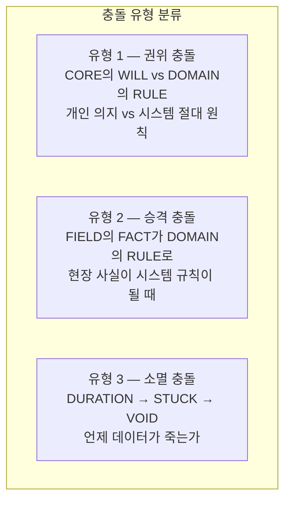
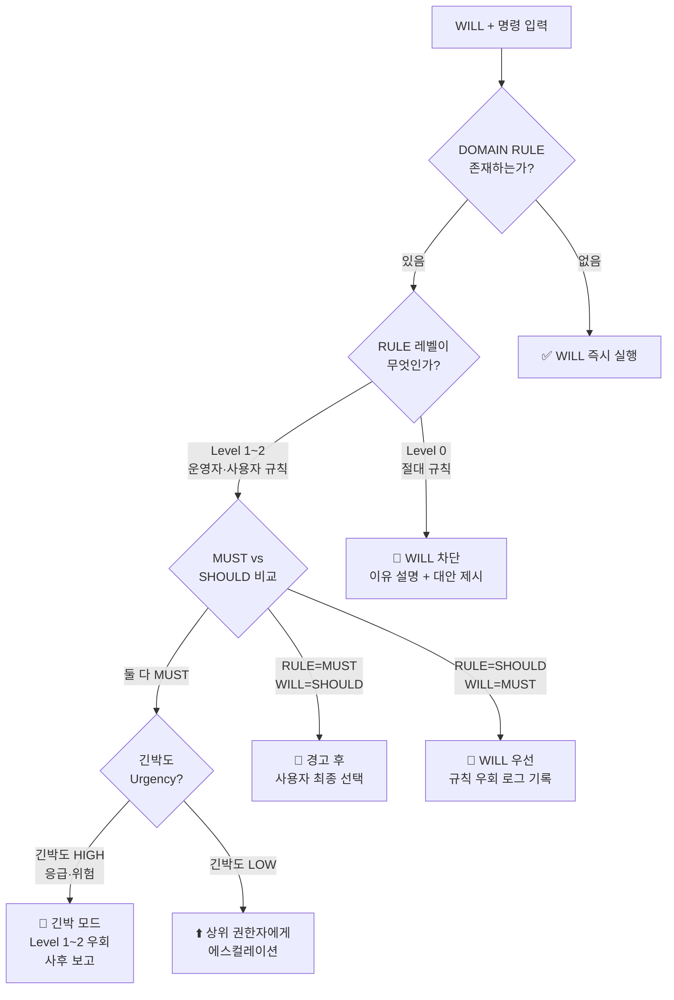
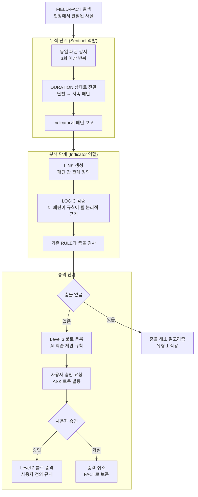
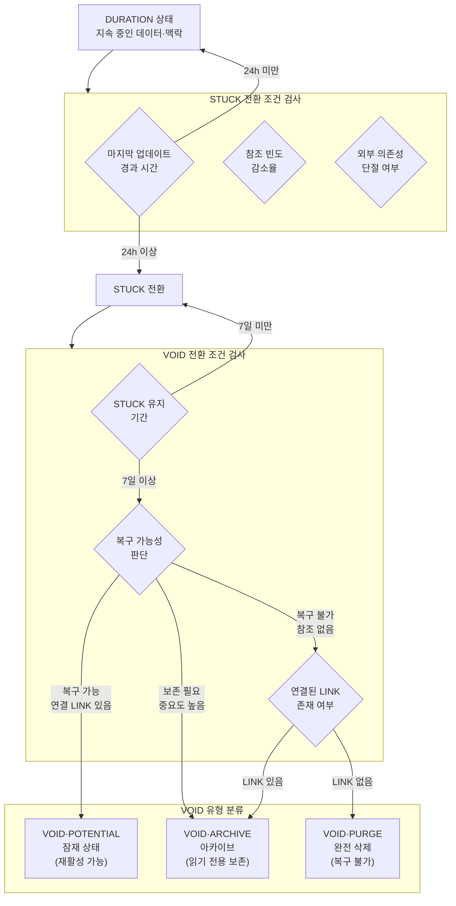
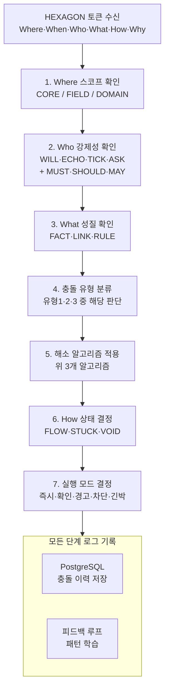

## UCL 토큰 충돌 해소 알고리즘을 설계

---

### 충돌의 3가지 유형 먼저 정의



이 세 가지를 순서대로 알고리즘으로 풀겠습니다.

---

## 유형 1 — 권위 충돌 알고리즘

### CORE·WILL vs DOMAIN·RULE 충돌 해소



### 충돌 해소 우선순위 매트릭스

| WILL 강도 | RULE 레벨 | RULE 강도 | 긴박도 | 결과                        |
| --------- | --------- | --------- | ------ | --------------------------- |
| MUST      | Level 0   | MUST      | Any    | 🚫 차단 (Level 0 절대 우선) |
| MUST      | Level 1   | MUST      | HIGH   | 🚨 긴박 모드 우회           |
| MUST      | Level 1   | MUST      | LOW    | ⬆️ 에스컬레이션             |
| MUST      | Level 1   | SHOULD    | Any    | 👤 WILL 우선 + 로그         |
| MUST      | Level 2   | Any       | Any    | 👤 WILL 우선 + 룰 수정 제안 |
| SHOULD    | Level 0   | Any       | Any    | 🚫 차단                     |
| SHOULD    | Level 1   | MUST      | Any    | 🔔 경고 후 사용자 선택      |
| SHOULD    | Level 1   | SHOULD    | Any    | 👤 WILL 우선 (약한 충돌)    |
| MAY       | Any       | MUST      | Any    | 🔔 RULE 우선 권고           |

---

## 유형 2 — 승격 충돌 알고리즘

### FIELD FACT → DOMAIN RULE 승격 과정



### 승격 조건 수치 기준

```
FACT → DURATION 전환 조건
  - 동일 패턴 3회 이상 반복
  - 반복 간격 72시간 이내
  - Confidence 평균 0.8 이상

DURATION → Level 3 RULE 제안 조건
  - DURATION 유지 기간 7일 이상
  - 패턴 일관성 85% 이상
  - 기존 RULE과 충돌 없음

Level 3 → Level 2 승격 조건
  - 사용자 명시적 승인 (ASK → WILL)
  - 승인 후 30일 검증 기간
  - 검증 기간 내 위반 없음
```

---

## 유형 3 — 소멸 충돌 알고리즘

### DURATION → STUCK → VOID 전환 조건



### 상태 전환 수치 기준표

| 전환                          | 조건          | 수치 기준                      | TimescaleDB 연결      |
| ----------------------------- | ------------- | ------------------------------ | --------------------- |
| DURATION → STUCK              | 업데이트 중단 | 24시간 무갱신                  | 청크 쓰기 중단 감지   |
| STUCK → VOID·POTENTIAL        | 단기 미활용   | STUCK 7일 + 참조 0             | 압축 대상 표시        |
| VOID·POTENTIAL → DURATION     | 재활성        | 새 참조 발생                   | 압축 해제 후 복원     |
| VOID·POTENTIAL → VOID·ARCHIVE | 장기 미활용   | POTENTIAL 90일 유지            | TimescaleDB 압축 적용 |
| VOID·ARCHIVE → VOID·PURGE     | 완전 소멸     | ARCHIVE 365일 + 연결 LINK 없음 | 물리 삭제             |

---

## 핵심 알고리즘 — 통합 Decision Matrix

세 유형을 통합한 최종 판단 흐름입니다.



---

### PostgreSQL 스키마 연결 — 충돌 이력 테이블

```sql
CREATE TABLE token_conflicts (
  id              UUID PRIMARY KEY DEFAULT gen_random_uuid(),
  conflict_type   VARCHAR(20),     -- authority·promotion·decay
  token_will      JSONB,           -- 충돌 발생 WILL 토큰
  token_rule      JSONB,           -- 충돌 발생 RULE 토큰
  resolution      VARCHAR(20),     -- block·override·escalate·emergency
  resolution_reason TEXT,          -- 해소 이유 설명
  user_decision   VARCHAR(20),     -- approve·reject·pending
  created_at      TIMESTAMPTZ DEFAULT NOW()
);

-- 충돌 패턴 분석 쿼리
SELECT conflict_type,
       resolution,
       COUNT(*) as frequency,
       AVG(EXTRACT(EPOCH FROM (updated_at - created_at))) as avg_resolve_sec
FROM token_conflicts
GROUP BY conflict_type, resolution
ORDER BY frequency DESC;
```

---

### 미완성으로 남기는 항목

| 항목                               | 이유                                     |
| ---------------------------------- | ---------------------------------------- |
| MUST vs MUST 동급 충돌의 자동 해소 | 철학적 판단 필요 — 기계가 결정하면 안 됨 |
| 6코일 밸런스 Why 레이어 연결       | 6코일 정의가 선행되어야 함               |
| ERA 토큰의 시대적 전환 조건        | 장기 비전과 연결 — 별도 설계 필요        |

---

> **이 알고리즘의 핵심 철학은 하나입니다.**
> MUST vs MUST 처럼 기계가 판단할 수 없는 충돌은 반드시 사람에게 올립니다.
> **Humanity 원칙 — AI가 결정할 수 없는 것은 결정하지 않는다.**
