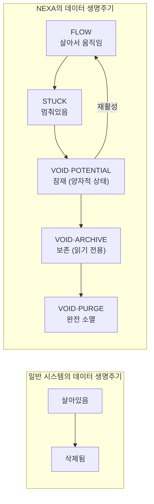
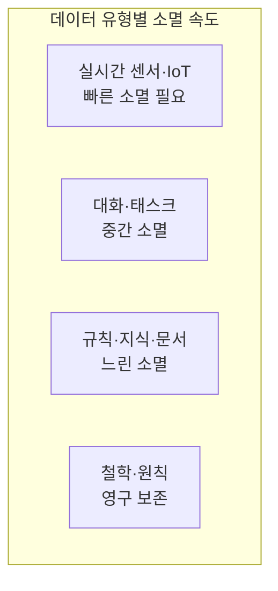
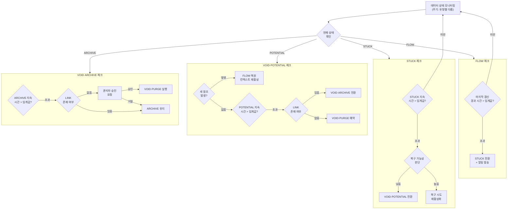

VOID 전환 조건 수치화를 설계하겠습니다. 먼저 핵심 개념부터 정확히 잡고 들어갑니다.

---

### VOID가 특별한 이유 — 재확인



> **일반 시스템은 죽으면 끝이지만 NEXA는 죽음에도 3단계가 있습니다.**
> 이것이 VOID의 양자적 해석입니다.

---

## VOID 전환 수치화 — 데이터 유형별 기준

데이터 성격에 따라 수치 기준이 달라야 합니다.



---

## 유형별 전환 수치 기준표

### 1. 실시간 센서·IoT 데이터 (Sentinel FACT)

| 전환                          | 조건        | 수치                         | 비고               |
| ----------------------------- | ----------- | ---------------------------- | ------------------ |
| FLOW → STUCK                  | 신호 중단   | **30초** 무갱신              | 센서 이상 감지     |
| STUCK → VOID·POTENTIAL        | 단기 미복구 | STUCK **5분** 지속           | 일시적 장애 가능성 |
| VOID·POTENTIAL → FLOW         | 재활성      | 신호 재개 즉시               | 자동 복원          |
| VOID·POTENTIAL → VOID·ARCHIVE | 장기 미복구 | POTENTIAL **24시간**         | 기기 오프라인 판단 |
| VOID·ARCHIVE → VOID·PURGE     | 완전 소멸   | ARCHIVE **30일** + 참조 없음 | 물리 삭제          |

### 2. 대화·태스크 데이터 (Indicator Conversation)

| 전환                          | 조건        | 수치                          | 비고             |
| ----------------------------- | ----------- | ----------------------------- | ---------------- |
| FLOW → STUCK                  | 응답 중단   | **1시간** 무응답              | 세션 타임아웃    |
| STUCK → VOID·POTENTIAL        | 세션 종료   | STUCK **24시간**              | 재개 가능 보존   |
| VOID·POTENTIAL → FLOW         | 재개        | 사용자 재접속                 | 컨텍스트 복원    |
| VOID·POTENTIAL → VOID·ARCHIVE | 장기 미재개 | POTENTIAL **90일**            | TimescaleDB 압축 |
| VOID·ARCHIVE → VOID·PURGE     | 완전 소멸   | ARCHIVE **365일** + LINK 없음 | 개인정보 보호    |

### 3. 규칙·학습 데이터 (RULE·LINK)

| 전환                          | 조건           | 수치                          | 비고             |
| ----------------------------- | -------------- | ----------------------------- | ---------------- |
| FLOW → STUCK                  | 미사용         | **30일** 미참조               | 규칙 사용 안 함  |
| STUCK → VOID·POTENTIAL        | 장기 미사용    | STUCK **90일**                | 폐기 후보        |
| VOID·POTENTIAL → FLOW         | 재참조         | 참조 발생 즉시                | 자동 복원        |
| VOID·POTENTIAL → VOID·ARCHIVE | 대체 규칙 등장 | POTENTIAL **180일**           | 구버전 보존      |
| VOID·ARCHIVE → VOID·PURGE     | 완전 폐기      | ARCHIVE **730일** + LINK 없음 | 관리자 승인 필요 |

### 4. 철학·원칙 데이터 (Level 0 RULE)

| 전환         | 조건                      | 수치 | 비고                    |
| ------------ | ------------------------- | ---- | ----------------------- |
| FLOW → STUCK | 불가                      | —    | 원칙은 멈추지 않음      |
| STUCK → VOID | 불가                      | —    | 원칙은 소멸하지 않음    |
| 수정         | 관리자 + 사용자 이중 승인 | —    | ERA 토큰 변경 시만 가능 |

---

## VOID 전환 핵심 알고리즘



---

## TimescaleDB 연결 — 실제 구현

```sql
-- VOID 상태 추적 컬럼 추가
ALTER TABLE conversations ADD COLUMN void_state
  VARCHAR(20) DEFAULT 'FLOW'
  CHECK (void_state IN ('FLOW','STUCK','POTENTIAL','ARCHIVE','PURGE'));

ALTER TABLE conversations ADD COLUMN void_at TIMESTAMPTZ;
ALTER TABLE conversations ADD COLUMN void_reason TEXT;

-- ─────────────────────────────────────
-- FLOW → STUCK 자동 전환 (1시간 기준)
-- ─────────────────────────────────────
UPDATE conversations
SET    void_state  = 'STUCK',
       void_at     = NOW(),
       void_reason = '1시간 무응답 세션 타임아웃'
WHERE  void_state  = 'FLOW'
AND    updated_at  < NOW() - INTERVAL '1 hour';

-- ─────────────────────────────────────
-- STUCK → VOID·POTENTIAL (24시간 기준)
-- ─────────────────────────────────────
UPDATE conversations
SET    void_state  = 'POTENTIAL',
       void_at     = NOW(),
       void_reason = '24시간 미재개 세션 잠재 상태 전환'
WHERE  void_state  = 'STUCK'
AND    void_at     < NOW() - INTERVAL '24 hours';

-- ─────────────────────────────────────
-- POTENTIAL → ARCHIVE (90일 기준)
-- TimescaleDB 압축 동시 적용
-- ─────────────────────────────────────
UPDATE conversations
SET    void_state  = 'ARCHIVE',
       void_at     = NOW(),
       void_reason = '90일 미재개 아카이브 전환'
WHERE  void_state  = 'POTENTIAL'
AND    void_at     < NOW() - INTERVAL '90 days';

-- TimescaleDB 압축 정책 연동
SELECT add_compression_policy('conversations', INTERVAL '90 days');

-- ─────────────────────────────────────
-- ARCHIVE → PURGE (365일 + LINK 없음)
-- 관리자 승인 후 실행
-- ─────────────────────────────────────
DELETE FROM conversations
WHERE  void_state  = 'ARCHIVE'
AND    void_at     < NOW() - INTERVAL '365 days'
AND    id NOT IN (
         SELECT DISTINCT source_id
         FROM   data_links
         WHERE  source_type = 'conversation'
       );

-- ─────────────────────────────────────
-- VOID·POTENTIAL → FLOW 재활성화
-- 사용자 재접속 시
-- ─────────────────────────────────────
UPDATE conversations
SET    void_state  = 'FLOW',
       void_at     = NULL,
       void_reason = NULL,
       updated_at  = NOW()
WHERE  id         = $1
AND    void_state = 'POTENTIAL';
```

---

## 전체 수치 기준 한눈에 보기

```mermaid
flowchart LR
    subgraph summary ["유형별 VOID 전환 타임라인"]
        subgraph sensor ["센서·IoT"]
            s1["FLOW"] -->|"30초"| s2["STUCK"]
            s2 -->|"5분"| s3["POTENTIAL"]
            s3 -->|"24시간"| s4["ARCHIVE"]
            s4 -->|"30일"| s5["PURGE"]
        end
        subgraph conv ["대화·태스크"]
            c1["FLOW"] -->|"1시간"| c2["STUCK"]
            c2 -->|"24시간"| c3["POTENTIAL"]
            c3 -->|"90일"| c4["ARCHIVE"]
            c4 -->|"365일"| c5["PURGE"]
        end
        subgraph rule ["규칙·지식"]
            r1["FLOW"] -->|"30일"| r2["STUCK"]
            r2 -->|"90일"| r3["POTENTIAL"]
            r3 -->|"180일"| r4["ARCHIVE"]
            r4 -->|"730일"| r5["PURGE"]
        end
        subgraph principle ["철학·원칙"]
            p1["FLOW"] -->|"영구"| p1
        end
    end
```



---

## 명세서 업데이트 필요 항목

이 내용은 앞서 만든 `NEXA_UCL_Protocol.md`의 **"미완성 항목"** 표에서 **VOID 전환 조건** 항목을 완성하는 내용입니다.
