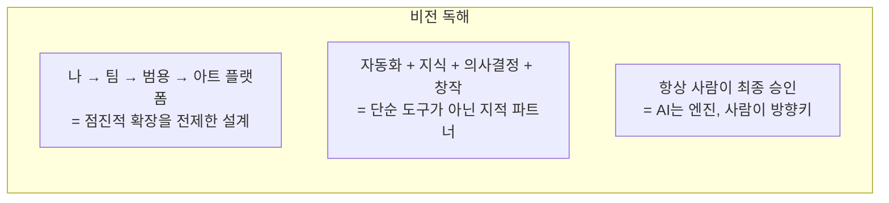
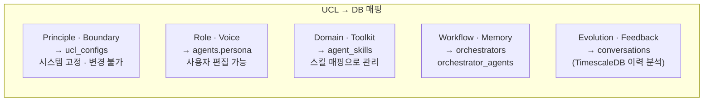

완벽한 그림이 나왔습니다. 이 세 가지 답변에서 매우 명확한 철학이 보입니다.

---

### 답변에서 읽히는 핵심 철학

> **"나로부터 시작해서 아트 플랫폼으로 확장"** 이라는 비전이 핵심입니다.
> 이것은 단순한 업무 자동화 툴이 아니라 **사람의 창의성과 판단을 증폭시키는 플랫폼**을 지향한다는 뜻입니다.

---

### 나만의 UCL 구성 요소 정의

일반적인 페르소나·스킬·태스크 프레임을 버리고, 이 플랫폼의 철학에 맞게 재정의합니다.

```mermaid
flowchart TD
    subgraph ucl ["나만의 UCL 구성 요소"]

        subgraph layer1 ["Layer 1 — 철학 (변하지 않는 뿌리)"]
            l1_1["Principle\n이 플랫폼이 존재하는 이유\n무엇을 위해 AI가 작동하는가"]
            l1_2["Boundary\nAI가 절대 넘으면 안 되는 선\n최종 결정은 항상 사람"]
        end

        subgraph layer2 ["Layer 2 — 관계 (사람과 AI의 구조)"]
            l2_1["Role\n이 맥락에서 AI는 어떤 존재인가\n조수? 전문가? 협력자?"]
            l2_2["Voice\nAI가 말하는 방식·어조·깊이\n기술적? 창의적? 간결?"]
        end

        subgraph layer3 ["Layer 3 — 능력 (무엇을 할 수 있는가)"]
            l3_1["Domain\n이 에이전트가 다루는 영역\n업무·산업·아트 중 어디"]
            l3_2["Toolkit\n사용 가능한 도구 목록\nRAG·검색·생성·분석 등"]
        end

        subgraph layer4 ["Layer 4 — 흐름 (어떻게 작동하는가)"]
            l4_1["Workflow\n작업을 어떤 순서로 처리하는가\nAI 제안 → 사람 승인 → 실행"]
            l4_2["Memory\n무엇을 기억하고 학습하는가\n단기·장기·사용자 패턴"]
        end

        subgraph layer5 ["Layer 5 — 성장 (시간이 지나면서)"]
            l5_1["Evolution\n플랫폼이 어떻게 확장되는가\n개인 → 팀 → 범용 → 아트"]
            l5_2["Feedback\n무엇으로 더 나아지는가\n사용자 승인·거절 이력"]
        end

        layer1 --> layer2 --> layer3 --> layer4 --> layer5
    end
```

---

### 기존 프레임과 나만의 프레임 비교

| 일반적 UCL | 이 플랫폼의 UCL     | 차이점                                    |
| ---------- | ------------------- | ----------------------------------------- |
| 페르소나   | Role + Voice        | 역할과 말투를 분리하여 더 세밀하게 제어   |
| 스킬       | Domain + Toolkit    | 영역(무엇을) + 도구(어떻게)를 분리        |
| 태스크     | Workflow + Boundary | 흐름과 한계선을 명시적으로 구분           |
| (없음)     | Principle           | 플랫폼의 존재 이유 · 철학을 최상위에 명시 |
| (없음)     | Memory + Feedback   | 시간이 지날수록 성장하는 구조             |
| (없음)     | Evolution           | 확장 경로를 UCL에 내재화                  |

---

### 각 구성 요소를 DB로 연결하면

---

### 다음 단계 제안

이 구성 요소들을 정의했으니, 이제 **각 레이어에 실제 내용을 채우는 작업**이 필요합니다.

예를 들어 **Principle** 레이어를 채운다면 이런 질문을 스스로 해보시면 됩니다.

> "이 플랫폼은 사용자의 \확장, 온화한 삶 위해 단순작업을 대신 또는 빠르게 해주는 것 *을 위해 존재한다."
> "AI가 아무리 잘 해도 \편리하게 해주지만 사람이 소외되지 않도록 해야 한다."
> "10년 후 이 플랫폼은 \지상에서의 (농업,산업,일상) 에서의 활동과 예술 활동과 경계를 없애고 우주의 끝과 연결되어 의식의 확장과 더블어 검허한 공간 *이 되어 있어야 한다."

이 빈칸들을 채우는 것이 곧 **ucl_configs 테이블의 실제 데이터**가 됩니다.

## NEXA 'UCL 파싱 로직의 5단계 프로토콜' 프레임워크.

1. 멀티모달 입력 (Listen) 에이젼트

- 핵심: 다양한 형태(텍스트, 음성, 영상)의 입력을 '육하원칙(5W1H) 표준 데이터 모델'로 일원화하는 단계.
- 프로토콜화: 음성이나 영상에서 추출된 비정형 데이터를 파서가 읽을 수 있는 JSONB 형태의 중간 언어(Intermediate Representation)로 변환하는 규칙이 필요.

2. 상황 인지 및 검토 (Context Awareness)

- 핵심: 단순히 명령만 보는 게 아니라, 시스템의 '현재 상태(State)'와 '허용 규칙(Rule)'을 대조하는 단계.
- 중요 포인트: '선 룰(Pre-defined Rules)' 검토가 여기서 핵심.
- 예: "창문 열어"라는 명령(Who, What, How) + "현재 비가 옴"이라는 상황(Where, When) + "우천 시 개방 금지"라는 선 룰(Why/Constraint).
  - 이 단계에서 데이터 간의 충돌(Conflict)을 잡아내야 함 (중요).

3. 의사결정 계층 (Decision Making)

- 핵심: 파서가 명령의 '확신도(Confidence)'와 '위험도(Risk)'를 계산하여 실행 모드를 결정하는 단계.
- 분류 기준:
- 즉시 실행: 확신도 높음 + 위험도 낮음 (예: 불 켜기)
  - 확인 후 실행: 확신도 낮음 또는 위험도 중간 (예: 결제, 외출 시 문 열기)
  - 조언/거절: 위험도 높음 또는 룰 위반 (예: 가스레인지 켜둔 채 외출 시 알림)

4. 어댑터 실행 (Execution)

- 핵심: UCL 파서가 생성한 추상적 명령을 실제 기기가 알아듣는 특수 명령(Native API)으로 번역하는 단계.
- 도메인 독립의 열쇠: 파서는 "온도를 2도 높여라"라는 '논리 명령'만 어댑터에 던지고, 그것이 에어컨인지 보일러인지, 어떤 API를 쓰는지는 어댑터가 해결하게 함으로써 도메인 확장을 실현.

5. 피드백 루푸

- 실행 후 기기가 "성공/실패/부분 성공" 상태를 다시 파서에게 전달
- 이를 통해 AI가 학습하거나 사용자에게 결과를 보고하는 과정

---

### UCL의 핵심 알고리즘이

[2단계의 '선 룰'과 3단계의 '의사결정']을 연결하는 판단 기준표(Decision Matrix)

### 핵심 알고리즘 — Decision Matrix 구체화

말씀하신 **"2단계 선 룰 + 3단계 의사결정 연결"** 을 표로 정리하면 이렇습니다.

| 확신도 | 위험도 | 룰 충돌 | 긴박도 | 실행 모드                   |
| ------ | ------ | ------- | ------ | --------------------------- |
| High   | Low    | 없음    | Any    | ✅ 즉시 실행                |
| High   | Low    | 있음    | Low    | 🔔 충돌 보고 후 대기        |
| High   | Mid    | 없음    | Low    | 👤 사용자 확인 요청         |
| Low    | Any    | Any     | Low    | 👤 사용자 확인 요청         |
| Any    | High   | Any     | Low    | ❌ 조언·거절                |
| Any    | Any    | Any     | High   | 🚨 긴박 모드 (룰 일부 우회) |

---
