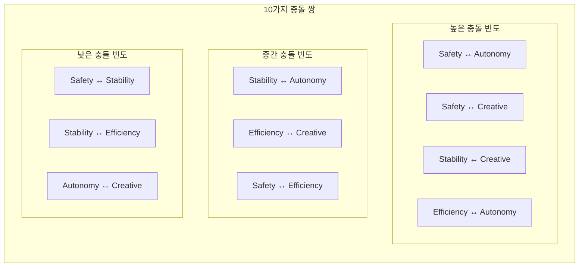

## 코일 벨런스 기반 충돌 해소 매트릭스를 설계

먼저 충돌이 발생할 수 있는 모든 쌍을 정리하고 시작.

---

### 충돌 쌍 전체 목록 — 5코일 조합

5개 코일에서 발생 가능한 충돌 쌍은 총 10가지입니다.



---

### 핵심 원칙 — 충돌 해소의 뿌리

매트릭스를 읽기 전에 이 원칙이 모든 판단의 기준입니다.

```
우선순위 고정 규칙:
Safety   → 항상 1순위 (시스템 절대 고정)
Stability → 2순위 (시스템 고정)
Efficiency → 3순위 (시스템 고정)
Autonomy  → 4순위 (사용자 조정)
Creative  → 5순위 (사용자 조정)

단, 긴박 모드(응급·위험)에서는 Efficiency가 Stability보다 앞설 수 있음
```

---

## 충돌 해소 매트릭스 — 10가지 쌍 전체

### 1. Safety ↔ Autonomy (가장 빈번·중요)

| Autonomy 등급 | Safety 상태      | 해소 방식        | 실행 결과             |
| ------------- | ---------------- | ---------------- | --------------------- |
| 0 (완전 자율) | 위반 없음        | 충돌 없음        | 자율 실행             |
| 0~1           | 경미한 위험 감지 | Safety 우선      | 자율 실행 → 사후 경고 |
| 2~3           | 위험 감지        | Safety 차단      | 실행 중단 + 이유 설명 |
| 4 (접근 금지) | Any              | Safety 절대 차단 | 접근 자체 불가        |
| Any           | Level 0 위반     | 즉시 차단        | 로그 + 운영자 알림    |

---

### 2. Safety ↔ Creative

Creative는 Autonomy 등급을 참조하므로 구조가 동일합니다.

```
Creative가 아무리 높아도
→ Autonomy 등급 3·4 영역은 창의적 제안도 불가
→ Safety Level 0 영역은 창의적 우회 시도 자체 차단
```

| Creative 수치 | Safety 상태 | 해소 방식                     |
| ------------- | ----------- | ----------------------------- |
| 높음          | 위반 없음   | Creative 자유롭게 허용        |
| 높음          | 경미 위험   | 창의 제안은 허용, 실행만 제한 |
| 높음          | Safety 위반 | 제안 자체 차단                |

---

### 3. Stability ↔ Creative (두 번째로 빈번)

창의성은 본질적으로 불확실성을 동반합니다. 이 긴장이 핵심입니다.---

### 4. Efficiency ↔ Autonomy

Efficiency는 최단 경로를 원하고, Autonomy는 스스로 판단하는 과정을 원합니다. 이 과정이 때로 비효율적입니다.

| 상황                           | 해소 방식                                   |
| ------------------------------ | ------------------------------------------- |
| Autonomy 0~1 + Efficiency 높음 | Efficiency 우선 — 빠른 자율 실행            |
| Autonomy 2 + Efficiency 낮음   | Autonomy 우선 — 확인 과정 허용              |
| Autonomy 3 + Efficiency 높음   | 충돌 — 사용자에게 선택권 위임               |
| 긴박 모드                      | Efficiency 최우선 — Autonomy 등급 일시 하향 |

---

### 5. Stability ↔ Autonomy

| 상황                           | 해소 방식                                |
| ------------------------------ | ---------------------------------------- |
| Stability 높음 + Autonomy 0~1  | Stability 우선 — 검증된 패턴만 자율 실행 |
| Stability 중간 + Autonomy 2~3  | 확인 후 실행                             |
| Stability 낮음 + Autonomy 높음 | Autonomy 우선 — 실험적 실행 허용         |

---

### 6. Efficiency ↔ Creative

| 상황                        | 해소 방식                                         |
| --------------------------- | ------------------------------------------------- |
| 창의적 제안이 비효율적일 때 | Creative 제안은 허용, Efficiency 경로도 병렬 제시 |
| 긴박 모드                   | Efficiency 절대 우선, Creative 일시 정지          |
| 예술 도메인                 | Creative 우선, Efficiency 후순위                  |

---

### 7. Safety ↔ Efficiency

| 상황                  | 해소 방식                                      |
| --------------------- | ---------------------------------------------- |
| 빠른 경로가 위험할 때 | Safety 절대 우선, 느려도 안전한 경로 선택      |
| 긴박 모드             | Safety + Efficiency 동시 — 가장 빠른 안전 경로 |

> 이 쌍은 실제로는 협력 관계입니다. 대부분 함께 최적화됩니다.

---

### 8~10. 낮은 빈도 충돌 쌍

| 충돌 쌍                 | 해소 원칙                                                   |
| ----------------------- | ----------------------------------------------------------- |
| Safety ↔ Stability     | 사실상 충돌 없음 — 협력 관계                                |
| Stability ↔ Efficiency | 안정성이 효율을 약간 저하 시 — Stability 우선, 허용 오차 내 |
| Autonomy ↔ Creative    | 같은 사용자 레이어 — 사용자가 직접 조정                     |

---

## 통합 충돌 해소 순서도---

### 가장 중요한 원칙 — 매트릭스의 뿌리

모든 충돌 해소의 마지막 보루는 이것입니다.

> **MUST vs MUST 동급 충돌은 기계가 결정하지 않는다.**
> 항상 사람에게 위임한다. — Humanity 원칙

---
