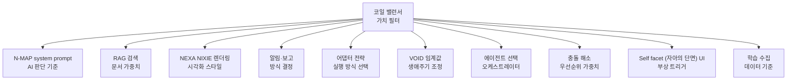

# [NEXA-AI-03] 코일 밸런스 및 운영 규범(GOVERN) 정의서

## 0. 설계 원칙: "안전은 딱딱하게, 지능은 유연하게"

기능 자격(Capability) ID의 설계 철학을 가중치 체계에도 동일하게 적용한다. 시스템이 강제하는 '딱딱한 안전'과 사용자가 조율하는 '유연한 지능'을 계층적으로 분리하여 플랫폼의 무결성과 사용자의 주권을 동시에 보장한다.

- **결정론적 안전 (Deterministic Safety):** 하드 도메인(보안, 기계 제어)에서는 시스템이 Safety·Stability 가중치를 90% 이상으로 강제 고정하여 AI의 자의적 판단을 원천 차단한다.
- **유연한 지능 (Flexible Intelligence):** 소프트 도메인(예술, 기획)에서는 사용자가 가중치를 자유롭게 조절하여 AI의 페르소나와 창의성 밀도를 직접 연주한다.

---

## 1. COILS Balancer: 판단의 가치 필터

코일 벨런서는 인디케이터(AI)가 데이터를 해석하거나 행동을 결정할 때 적용하는 **주관적 가치 가중치**다. 헥사곤 프로토콜의 **Why(동기)** 레이어를 도출하는 믹서(Mixer) 역할을 수행한다.

| 코일명 (Coil Name)      | 성격 | 정의 및 역할                                                                           |
| :---------------------- | :--- | :------------------------------------------------------------------------------------- |
| **Safety (안전)**       | 생존 | 물리적 위험 방지 및 인간의 생명 보호를 최우선으로 함.                                  |
| **Stability (안정성)**  | 기술 | 시스템의 일관된 유지 및 예측 가능한 기술적 작동을 보장함.                              |
| **Compliance (준수성)** | 윤리 | **(기존 LIMIT 대체)** 법적·윤리적 경계 및 시스템 규범(GOVERN)의 엄격한 준수 여부 결정. |
| **Efficiency (효율성)** | 자원 | 에너지 소모 최소화 및 목표 달성을 위한 최단 경로 지향.                                 |
| **Autonomy (자율성)**   | 의지 | AI가 스스로 환경을 인지하고 능동적으로 판단할 수 있는 권한의 폭.                       |
| **Creative (창의성)**   | 확장 | 정해진 틀을 벗어난 새로운 제안이나 실험적 인터랙션 허용.                               |

> **용어 정립:** 'Harmony(조화)'는 밸런싱 과정 그 자체의 목적이므로 독립 코일 항목에서 제거하고, 'LIMIT'은 제약이 아닌 가치로서의 성격을 명확히 하기 위해 **'Compliance'**로 변경한다.

---

## 2. 레이어 기반 가중치 체계 (Layered Architecture)

코일 항목은 고정된 수치가 아니라, 데이터가 흐르는 **3단계 레이어**에 따라 그 목적과 확장 폭이 다르게 정의됩니다.

### 2-1. 코일 밸런스의 계층적 확장 로직

- **원천 레이어 (Source Layer - 시스템의 본능):**

  - **항목 수:** 최소 동작 보장을 위한 **기본 5~6개** 권장 (Safety, Stability, Efficiency, Autonomy, Compliance 등).
  - **확장성:** 시스템 전역의 '헌법'과 같으므로 확장이 엄격히 제한됩니다.
  - **역할:** 어떤 상황에서도 변하지 않는 플랫폼의 생존 및 운영 지능 기준점(Baseline)입니다.

- **도메인 레이어 (Domain Layer - 전문적 지각):**

  - **항목 수:** 도메인 특성에 맞게 **항목 추가 가능**.
  - **확장 내용:** 특정 전문 영역(보안, 아트, 스마트팜 등)의 가치 기준을 오버레이합니다. 예를 들어 '아트 도메인'에서는 **미학(Aesthetics)**이나 **공감(Empathy)** 코일이 추가되어 지능의 성격을 규정합니다.
  - **특징:** 하드 도메인(보안·안전)에서는 상위 레이어의 Safety/Stability 가중치를 90% 이상으로 강제(Clamp)하는 '안전 장치' 역할을 수행합니다.

- **프로젝트 레이어 (Project Layer - 개인화된 페르소나):**
  - **항목 수:** **제한 없음 (24개 이상 확장 가능)**.
  - **확장 방법:** 사용자가 자신의 프로젝트 성격에 맞춰 '호기심', '집중도', '경제성' 등 새로운 코일 아이톰을 자유롭게 생성하고 삭제할 수 있습니다.
  - **역할:** AI 에이전트의 **페르소나와 스킬(Tool Calling)**의 실행 태도를 결정하는 최종 가치 필터입니다.

### 2-2. 무한 확장을 위한 기술적 토대 (N-MAP 및 DB)

숫자에 갇히지 않고 확장성을 보장하기 위해 시스템은 다음과 같은 구조를 가집니다.

- **DB 스키마 (`balance_coil_definitions`):** 항목 이름이나 개수가 DB 레벨에서 고정되지 않고, `origin` 필드(system/user)를 통해 사용자가 정의한 새로운 코일들을 행 단위로 무한히 쌓을 수 있도록 설계되었습니다.
- **N-MAP 프로토콜 연동:** 확장된 코일들은 헥사곤 프로토콜의 **Why(인과)** 레이어와 결합됩니다. 24개의 코일이 있더라도 오케스트레이터는 이를 **CAUSE(원인), LOGIC(타당성), TARGET(최종목표)**이라는 3대 인과 토큰으로 수렴시켜 AI가 복잡한 추론 없이 1ms 내에 판단하게 합니다.
- **유연한 가중치 합성:** 최종 가중치는 $W_{final} = W_{source} + f(W_{domain}) + f(W_{project})$ 수식에 따라 레이어별로 합산되어, 사용자가 프로젝트 레이어에서 항목을 늘려도 시스템의 근본 안전 규칙은 훼손되지 않습니다.

### 2-3. UI/UX: 숫자가 아닌 '태도'로서의 시각화

코일 항목이 많아질 때 사용자가 숫자에 매몰되는 것을 방지하기 위한 UI 전략입니다.

- **Ambient Interface:** 수많은 코일 슬라이더를 한꺼번에 노출하는 대신, 사용자가 선택한 **'지금의 나' Self facet (자아의 단면)**나 **N-MAP 템플릿**에 따라 필요한 코일 그룹만 자연스럽게 부각(Progressive Disclosure)됩니다.
- **NEXU 캔버스 연동:** 코일 밸런싱의 결과는 숫자가 아닌 **빛의 발광(Lumina)과 떨림(Jitter)**으로 표현됩니다. 예를 들어 가중치가 충돌하거나 확신도가 낮으면 빛이 미세하게 떨려 시스템의 '사유' 상태를 직관적으로 전달합니다.

**요약하자면**, NEXA의 코일 밸런스는 **원천(보수적 안정) - 도메인(전문적 최적화) - 프로젝트(창의적 무한 확장)**라는 3계층 구조를 통해, 시스템의 무결성을 지키면서도 사용자마다 다른 수십 개의 가치관을 포용할 수 있도록 설계되어 있습니다.

### 2-4 각 레이어별 코일 항목 예상

각 레이어에서 가동될 수 있는 다양한 코일 항목들을 나열하고, 이를 통해 수식 합산과 충돌 지점을 검토할 수 있도록 정리해 드립니다.

#### Layer1. 원천 레이어 (Source Layer: 시스템의 생존 본능)

플랫폼의 무결성과 최소 동작을 보장하는 하드웨어적 기초 가중치입니다. 수정이 엄격히 제한됩니다.

| 코일명                    | 뜻 (Meaning)            | 기능 및 시스템 역할                                                              |
| :------------------------ | :---------------------- | :------------------------------------------------------------------------------- |
| **Safety (안전)**         | 생명 및 물리 보호       | 위험 감지 시 인디케이터를 바이패스하고 **Level 1 하드웨어 인터락** 가동.         |
| **Stability (안정성)**    | 기술적 예측 가능성      | 시스템의 일관성을 유지하며, 부하 급증 시 연출 등급(LOD)을 강제로 낮춤.           |
| **Compliance (준수성)**   | 법적·윤리적 경계        | **Level 0 절대 규칙** 준수 여부를 결정하며, 위반 시 즉시 **Safety VOID**로 전이. |
| **Efficiency (효율성)**   | 자원 소모 최소화        | 토큰 예산 및 배터리 소모를 고려하여 **최단 경로의 문제 해결** 지향.              |
| **Connectivity (연결성)** | 네트워크 및 동기화 유지 | 엣지와 서버 간의 **NTP 시간 동기화 및 MQTT 연결 신뢰도** 관리.                   |

#### Layer2. 도메인 레이어 (Domain Layer: 전문적 지각)

특정 전문 분야(보안, 아트, 스마트팜 등)의 정책을 오버레이하는 계층입니다.

| 코일명                      | 뜻 (Meaning)              | 기능 및 시스템 역할                                                           |
| :-------------------------- | :------------------------ | :---------------------------------------------------------------------------- |
| **Sensitivity (반응도)**    | 센서의 민감도             | **하드 도메인**에서 사용하며, 얼마나 빠르게 반응 할것인가.                    |
| **Precision (정밀도)**      | 수치적 엄밀성             | **하드 도메인**에서 사용하며, 센서 오차 허용 범위를 극도로 좁힘.              |
| **Aesthetics (미학)**       | 시각적·형태적 가치        | **아트 도메인**에서 NEXU 캔버스의 발광 강도와 프랙탈 분화의 화려함 결정.      |
| **Empathy (공감)**          | 사용자의 정서적 상태 반영 | 도메인과 **활력 지수(VI)**를 읽어 넥슈의 인격을 결정 말걸기 빈도와 톤을 조절. |
| **Sustainability (지속성)** | 장기 운영 및 에너지 보존  | 스마트팜 등에서 **DURATION(지속)** 데이터의 유효 기간과 자원 배분 조율.       |
| **Alertness (경계성)**      | 위협 및 변화 감지 속도    | 보안 도메인에서 **INCIDENT** 태그 부여 속도와 즉각 반사(Reflex) 강도 결정.    |

#### Layer3. 프로젝트 레이어 (Project Layer: 개인화된 페르소나)

사용자가 직접 정의하며 24개 이상으로 무한 확장이 가능한 지능적 필터입니다.

| 코일명                   | 뜻 (Meaning)          | 기능 및 시스템 역할                                                              |
| :----------------------- | :-------------------- | :------------------------------------------------------------------------------- |
| **Autonomy (자율성)**    | AI의 독자 판단 폭     | **Autonomy Threshold(95점 ±15%)**와 연동하여 ASK 펄스 발생 여부 결정.            |
| **Creative (창의성)**    | 실험적 시도 허용      | **VOID(영감 모드)** 진입 빈도를 높이고, RAG 검색 시 유사도가 낮은 데이터도 인입. |
| **Proactivity (주도성)** | 선제적 제안 강도      | 사용자가 요청하기 전 **ECHO(제안)** 토큰을 생성하는 빈도 조절.                   |
| **Conciseness (간결성)** | 정보 요약 밀도        | **Summary(요약)** 생성 시 문장의 길이와 토큰 소모량을 극도로 제한.               |
| **Curiosity (호기심)**   | 새로운 자원 탐색 의지 | **[N-MAP-08]** 프로토콜에 따라 외부 API나 타 프로젝트 자원을 탐색하는 빈도 결정.   |
| **Humility (겸손)**      | 판단의 유보 및 질문   | 확실치 않은 상황에서 **ECHO**보다는 **ASK**를 우선하여 사용자 주권 존중.         |
| **Frugality (검소)**     | 비용 및 토큰 절약     | 유료 클라우드 모델 사용을 억제하고 **로컬 sLLM(나노/센티널)** 처리 비중 강화.    |

---

### 2-5 코일 수식 및 충돌 검토 가이드

이 수많은 코일들은 최종적으로 다음과 같은 매커니즘을 통해 시스템에 적용됩니다.

1.  **가중치 합성 수식:**

    - $W_{final} = W_{source} + f(W_{domain}) + f(W_{project})$.
    - **검토 포인트:** 프로젝트 레이어에서 `Creative`를 100%로 올려도, 도메인 레이어가 **하드 도메인**인 경우 시스템이 `Safety` 하한선을 90% 이상으로 **Clamp(강제 고정)**하여 충돌을 해소합니다.

2.  **HEXAGON Why 토큰 매핑:**

    - **Safety / Stability / Compliance** 우세 시 → **Why-LOGIC** (시스템 규범과 타당성 중심).
    - **Creative / Autonomy** 우세 시 → **Why-CAUSE** (사용자의 의도와 근본 원인 중심).
    - **Efficiency / Sustainability** 우세 시 → **Why-TARGET** (최종 목표 달성 및 최적화 중심).

3.  **예상되는 주요 충돌 지점:**
    - **Efficiency <-> Empathy:** 자원 절약을 위해 넥슈가 침묵해야 하는가, 아니면 사용자의 피로를 위로하기 위해 토큰을 써서 대화해야 하는가?.
    - **Autonomy <-> Compliance:** AI가 사용자의 편의를 위해 규범(GOVERN)을 약간 우회하는 창의적 판단을 내릴 수 있는가? (Level 0 규칙에 의해 항상 Compliance가 승리함).
    - **Stability <-> Creative:** NEXU 캔버스의 도트들이 안정적으로 물리 좌표에 고정되어야 하는가, 아니면 논리적 관계에 따라 역동적으로 폭발해야 하는가?.

이 코일 명세들을 통해 **Decision Matrix**의 각 분기점을 수치화하면, 시스템이 상황에 따라 어떤 '페르소나'로 응답할지 정교하게 설계할 수 있습니다.

---

## 3. 실행 게이트 및 확신도(Confidence) 연동

코일 가중치는 단순히 답변 톤을 바꾸는 것을 넘어, 실제 **'실행의 문'**을 열지 말지를 결정하는 하드웨어적 차단기 역할을 수행한다.

- **Autonomy Threshold (자율성 임계값):** 사용자가 UI 슬라이더를 통해 **95점 ±15% 범위** 내에서 직접 조정한다.
- **실행 분기 로직:**
  - `confidence_score >= user_defined_threshold`: 자율 실행 (FLOW).
  - `confidence_score < user_defined_threshold`: 승인 대기 (STUCK + ASK) 강제 발동.
- **시각적 피드백:** 확신도가 임계값 미만일 경우 NEXA NIXIE UI의 빛이 미세하게 떨리며(Jitter) 시스템의 모호함을 사용자에게 전달한다.

---

## 4. HEXAGON Why 토큰 정규 매핑

코일 가중치 조합은 헥사곤 프로토콜의 Why(인과) 토큰을 생성하는 논리적 근거가 된다.

| 우세 코일 그룹                      | Why 토큰              | 인과 해석 로직 (Reasoning)                                               |
| :---------------------------------- | :-------------------- | :----------------------------------------------------------------------- |
| **Safety / Stability / Compliance** | **LOGIC (타당성)**    | **GOVERN(통제):** 시스템 규범과 안전 가드레일을 최우선 논리로 채택.      |
| **Efficiency**                      | **TARGET (최종목표)** | **RESOLVE(해결):** 자원 소모 최소화 및 최단 경로 해결을 목표로 설정.     |
| **Creative / Autonomy**             | **CAUSE (근근원인)**  | **OBSERVE(관찰):** 사용자의 영감이나 창의적 시도를 행위의 원인으로 규정. |

---

## 5. 운영 규범(GOVERN)의 진화

**GOVERN**은 인디케이터가 내리는 모든 조언과 실행의 논리적 근거이자 시스템이 스스로를 통제하는 '질서'다.

- **ECHO → GOVERN 승격:** AI의 분석 결과(ECHO)를 사용자가 반복 승인(WILL)하면, 시스템은 이를 정식 규범으로 격상하여 `balance_coil_templates`에 반영한다.
- **지능적 족보(Traceability):** 모든 GOVERN 적용 결과는 `why_chain`에 기록되어 "어떤 코일 가중치에 의해 이 결정이 내려졌는지"를 1ms 내에 역추적할 수 있게 한다.

---

## 6. DB 구현 매핑 (DDL 연동)

- **Definitions:** `balance_coil_definitions` 테이블에 코일 항목과 출처(System/User)를 저장한다.
- **Templates:** `balance_coil_templates`에 도메인별·사용자별 가중치 프리셋을 보관한다.
- **Settings:** `project_settings`는 현재 적용 중인 `template_id`와 사용자가 설정한 `user_defined_threshold` 수치를 실시간으로 유지한다.

---

## 7.코일 밸런서 재사용 가능한 곳들

코일 밸런서 = "이 상황에서 무엇을 얼마나 중요하게 볼 것인가" 의 수치화된 가치 필터
이 정의만 보면 AI 판단 기준뿐 아니라 **어떤 의사결정이든** 적용 가능합니다.

**1. RAG 검색 필터**

```
검색 시 코일값이 가중치로 작동

depth=9, accuracy=8 → 깊고 정확한 문서 우선 검색
creativity=9, narrative=8 → 창의적·서사적 문서 우선

→ 같은 질문도 코일값에 따라 다른 문서를 꺼내옴
```

**2. NEXU 캔버스 렌더링**

```
aesthetics=9, contrast=8 → 화려한 Fractal·강한 대비
minimalism=9, density=3  → 단순·여백 중심 렌더링
resonance=8              → Lumina 발광 강도 높음

→ 코일값이 시각화 스타일을 직접 결정
```

**3. 알림·보고 방식 결정**

```
verbosity=8  → 상세 리포트
verbosity=3  → 한 줄 요약만
urgency=9    → 즉각 푸시 알림
patience=8   → 모아서 일괄 보고
warmth=9     → "오늘도 수고하셨어요" 포함
warmth=2     → 수치만 간결하게
```

**4. 어댑터 실행 전략 선택**

```
efficiency=9, latency=3  → 가장 빠른 어댑터 선택
resilience=9             → 실패 시 자동 대체 어댑터
redundancy=8             → 다중 어댑터 병렬 실행
```

**5. VOID 전환 임계값 조정**

```
sustainability=9  → VOID·ARCHIVE 기간 연장
compression=9    → VOID·POTENTIAL 빠르게 압축
memory=8         → POTENTIAL → FLOW 재활성 민감도 높음
```

**6. 에이전트 선택 기준**

```
오케스트레이터가 에이전트 선택 시 코일값 참조

precision=9  → 정밀 에이전트 우선 선택
creative=9   → 창의 에이전트 우선 선택
autonomy=3   → 확인형 에이전트 선택
```

**7. 충돌 해소 우선순위 가중치**

```
safety=10    → 충돌 시 Safety 완전 우선
compliance=8 → Compliance 강하게 반영
autonomy=7   → 사용자 의지 어느 정도 반영

→ Decision Matrix의 판단 기준이 코일값으로 동적 조정
```

**8. 사용자 Self facet (자아의 단면) UI 트리거**

```
proactivity=9  → Self facet (자아의 단면) 자주·적극적으로 부상
proactivity=2  → Self facet (자아의 단면) 거의 안 나타남
adaptivity=8   → 상황별로 다른 Self facet (자아의 단면) 종류 제시
```

**9. 학습 데이터 수집 기준**

```
curiosity=9      → 더 많은 패턴 수집·학습
privacy=9        → 최소한만 수집
traceability=8   → 모든 선택 이력 보존
compression=9    → 핵심 패턴만 압축 저장
```

**10. 시뮬레이션·가상 실행**

```
is_virtual=true 실행 시에도 코일값 반영

safety=10        → 시뮬레이션도 보수적으로
experimentation=9 → 시뮬레이션에서 적극 실험
```

---

### 정리 — 재사용 범위



---

### 핵심 인사이트

> **코일 밸런서는 N-MAP의 부품이 아니라 NEXA 전체의 가치 조율 엔진입니다.**
> 한 번 설정된 코일값이 AI 판단·시각화·알림·저장·학습까지 전파됩니다.
> 사용자가 슬라이더 하나를 바꾸면 플랫폼 전체의 성격이 바뀌는 구조입니다.

이것이 코일 밸런서를 단순한 프롬프트 설정이 아닌 **NEXA의 핵심 인프라**로 봐야 하는 이유입니다. 🎯

**결론:** 재구성된 [문서 3]은 코일을 단순한 설정값이 아닌 **시스템의 윤리적 경계(Compliance)**와 **실행 권한(Threshold)**을 결정하는 핵심 엔진으로 정의한다. 이를 통해 NEXA는 사용자의 의도를 정교하게 '연주'하는 동시에, 어떠한 상황에서도 인간의 안전과 통제권을 잃지 않는 지능형 유기체로 작동한다.

# 추가 메모---------------------------------------------------------

### 도메인 레이어 코일 — 라우터 기반으로 재배정

이제 각 도메인에 어떤 코일이 자동 활성화되어야 하는지 구체적으로 보입니다.

| 도메인        | 주요 라우터                     | 활성 코일                  | 이유                       |
| ------------- | ------------------------------- | -------------------------- | -------------------------- |
| **하드·IoT**  | /nexa-node · /infra · /network  | Precision · Sensitivity    | 물리 장치 제어 · 센서 반응 |
| **아트·창작** | /nexa-ai (미디어) · /portfolio  | Aesthetics · Empathy       | 감각적 표현 · 넥슈 인격    |
| **지식·문서** | /nexa-archive · /nexa-ai (채팅) | Empathy · Sustainability   | 장기 축적 · 사용자 맥락    |
| **보안·운영** | /nexa-admin · /nexa-trace       | Alertness · Precision      | 위협 감지 · 감사 정밀도    |
| **업무·ERP**  | /erp · /nexa-trace              | Sustainability · Alertness | 장기 운영 · 변화 감지      |
| **UX·보드**   | /nexa-board · /nexa-panel       | Aesthetics · Empathy       | 사용자 경험 · 넥슈 톤      |

---

# >>>>> 최대한 넓게 펼쳐놓고 나중에 줄이는 방식.

NEXA 라우터 전체를 보면서 각 영역에서 필요할 수 있는 모든 가치 기준을 산출.

---

### 도메인별 후보 코일 전체 목록

**하드·IoT 영역** `/nexa-node` `/infra` `/network`

| 코일명      | 의미           | 슬라이더 낮음 → 높음    |
| ----------- | -------------- | ----------------------- |
| Sensitivity | 반응 민감도    | 둔감·여유 → 즉각·민감   |
| Precision   | 수치 정밀도    | 오차 허용 → 오차 최소   |
| Alertness   | 위협 감지 속도 | 느슨한 감시 → 즉각 반사 |
| Redundancy  | 이중화·백업    | 단일 경로 → 다중 백업   |
| Latency     | 응답 지연 허용 | 느려도 됨 → 즉각 응답   |
| Resilience  | 장애 복구력    | 수동 복구 → 자동 복구   |
| Isolation   | 격리 강도      | 공유 허용 → 완전 격리   |
| Verbosity   | 로그 상세도    | 핵심만 → 모든 것 기록   |

---

**보안·감사 영역** `/nexa-admin` `/dev`

| 코일명          | 의미        | 슬라이더 낮음 → 높음        |
| --------------- | ----------- | --------------------------- |
| Alertness       | 위협 감지   | 느슨 → 즉각 반사            |
| Traceability    | 추적 가능성 | 요약만 → 전체 족보          |
| Auditability    | 감사 엄밀도 | 결과만 → 과정 전체          |
| Confidentiality | 기밀 보호   | 공개 허용 → 완전 차단       |
| Verification    | 검증 강도   | 신뢰 후 실행 → 검증 후 실행 |

---

**창작·예술 영역** `/nexa-ai` `/portfolio` `/nexa-panel`

| 코일명       | 의미           | 슬라이더 낮음 → 높음      |
| ------------ | -------------- | ------------------------- |
| Aesthetics   | 시각·형태 가치 | 기능 우선 → 미학 우선     |
| Expressivity | 표현 풍부도    | 간결·단순 → 풍부·화려     |
| Originality  | 독창성         | 검증된 패턴 → 새로운 시도 |
| Resonance    | 감각적 공명    | 논리적 → 감각적           |
| Playfulness  | 유희성         | 진지하게 → 가볍고 실험적  |
| Contrast     | 대비·긴장감    | 조화로운 → 극적 대비      |
| Narrative    | 서사 밀도      | 단편적 → 이야기로 연결    |

---

**지식·문서 영역** `/nexa-archive` `/nexa-ai (채팅)`

| 코일명         | 의미        | 슬라이더 낮음 → 높음    |
| -------------- | ----------- | ----------------------- |
| Sustainability | 장기 보존   | 즉시 활용 → 장기 축적   |
| Depth          | 탐구 깊이   | 표면적 답변 → 깊은 분석 |
| Connectivity   | 연결 밀도   | 독립적 → 모든 것과 연결 |
| Accuracy       | 정확성 강조 | 빠른 근사 → 검증된 사실 |
| Curiosity      | 탐구 욕구   | 주어진 것만 → 확장 탐색 |
| Compression    | 요약 강도   | 원문 보존 → 핵심 압축   |

---

**업무·운영 영역** `/erp` `/nexa-trace`

| 코일명         | 의미          | 슬라이더 낮음 → 높음       |
| -------------- | ------------- | -------------------------- |
| Sustainability | 지속 운영     | 단기 집중 → 장기 안정      |
| Predictability | 예측 가능성   | 유연한 변화 → 정해진 루틴  |
| Delegation     | 위임 강도     | 직접 처리 → AI에게 위임    |
| Accountability | 책임 명확도   | 공동 책임 → 개인 책임 명시 |
| Priority       | 우선순위 강도 | 균등 처리 → 중요도 집중    |
| Tempo          | 작업 속도감   | 느긋하게 → 빠르게 처리     |

---

**UX·인터페이스 영역** `/nexa-board` `/nexa-panel` `/my`

| 코일명       | 의미             | 슬라이더 낮음 → 높음      |
| ------------ | ---------------- | ------------------------- |
| Empathy      | 사용자 정서 반영 | 기능적 → 감성적           |
| Density      | 정보 밀도        | 여백 많음 → 촘촘한 정보   |
| Proactivity  | 먼저 제안        | 수동 대기 → 능동 제안     |
| Transparency | 작동 투명도      | 결과만 → 과정 공개        |
| Adaptivity   | 맥락 적응        | 고정 UI → 상황별 변형     |
| Minimalism   | 단순함           | 풍부한 표현 → 극도의 간결 |

---

### 전체 후보 수 요약

| 영역          | 후보 코일 수 |
| ------------- | ------------ |
| 하드·IoT      | 8개          |
| 보안·감사     | 5개          |
| 창작·예술     | 7개          |
| 지식·문서     | 6개          |
| 업무·운영     | 6개          |
| UX·인터페이스 | 6개          |
| **전체**      | **38개**     |

---

현재 Source Layer 6코일을 제외하고 Domain + Project Layer 후보가 38개.
