# AI 대화 제목 제안 기능 구현 계획
# AI Chat Title Suggestion Feature Plan

## 배경 및 목표 (Background & Goals)

현재 첫 메시지를 그대로 제목(title)으로 사용하는 방식은 "안녕", "이미지" 등 의미 없는 제목이 많고, 제목 품질이 낮다. AI가 초반 대화(dialogue) 맥락(context)을 분석해 제목을 제안(suggestion)하고, 사용자가 승인(approve)·편집(edit)할 수 있도록 한다.

---

## 전체 흐름 (Flow)

```mermaid
flowchart TD
    subgraph firstMessage [첫 메시지 전송 / First Message]
        A[사용자 메시지 / User Message] --> B[휴리스틱 제목 적용 / Heuristic Title]
        B --> C[addChat/updateChatTitle]
    end

    subgraph afterResponse [AI 응답 후 / After AI Response]
        D[updateChatMessages] --> E{교환 횟수 >= minTurns? / Turns >= min?}
        E -->|No| F[대기 / Wait]
        E -->|Yes| G{이미 제안했음? / Already suggested?}
        G -->|Yes| F
        G -->|No| H[generateTitle API 호출 / API Call]
        H --> I[setPendingTitleSuggestion]
    end

    subgraph userAction [사용자 액션 / User Action]
        J[채팅 아이템 아이콘 클릭 / Chat Item Icon Click] --> K[편집 다이얼로그 / Edit Dialog]
        K --> L{제안 있음? / Has suggestion?}
        L -->|Yes| M[제안값 pre-fill / Suggestion pre-fill]
        L -->|No| N[현재 제목 pre-fill / Current title pre-fill]
        M --> O[사용자 수정/승인 / Edit/Approve]
        N --> O
        O --> P[doEditSave]
        P --> Q[updateChatTitle + clearPendingTitleSuggestion]
    end
```



---

## 수정 대상 파일 (Files to Modify)

### 1. Server

**server/domains/ai/ai.service.js**
- `generateTitle(dialogueExcerpt, model, url)` 함수 추가
- `dialogueExcerpt`: "사용자: ...\n\nAI: ...\n\n사용자: ...\n\nAI: ..." 형식 문자열 (최대 maxTurnsForContext개 교환/turns)
- `chat()` 재사용: systemInstruction에 Persona/Task/Constraint 적용, messages에 `[{ role: 'user', content: dialogueExcerpt }]` 전달
- 응답 후처리(post-processing): trim, 특수문자(special characters) 제거, 15자 truncate

**server/domains/ai/ai.routes.js**
- `POST /ai/generate-title` 라우트(route) 추가
- body: `{ dialogueExcerpt, model }`
- `generateTitle` 호출 후 `{ title: string }` 반환

---

### 2. Frontend - API & State

**src/domains/ai/services/aiApi.js**
- `generateTitle(dialogueExcerpt, model)` 함수 추가
- `dialogueExcerpt`: AiChatPanel에서 최근 교환(turns)들을 포맷한 문자열(string)
- `POST /ai/generate-title` 호출

**src/domains/ai/composables/useAiSettings.js**
- `titleSuggestionMinTurns` ref (기본값 2, 저장/로드 / persist)
- `titleSuggestionMaxTurnsForContext` ref (기본값 5, 저장/로드 / persist)
- watch 및 saveSettings에 추가

**src/domains/ai/composables/useAiChannels.js**
- `pendingTitleSuggestions` ref: `Record<chatId, string>`
- `setPendingTitleSuggestion(chatId, title)`
- `clearPendingTitleSuggestion(chatId)`
- `getPendingTitleSuggestion(chatId)`
- export에 추가

---

### 3. Frontend - UI

**src/domains/ai/views/right/AiRightPanel.vue**
- "채팅" expansion-item 내부에 제목 제안 설정 추가
- "제목 제안 최소 교환 횟수" (min turns, 1~5, slider)
- "제목 생성 시 참고할 최대 교환 수" (max turns for context, 1~10, slider)
- useAiSettings에서 `titleSuggestionMinTurns`, `titleSuggestionMaxTurnsForContext` 사용

**src/domains/ai/components/AiChatPanel.vue**
- `useAiChannels`에서 `setPendingTitleSuggestion` 사용
- `useAiSettings`에서 `titleSuggestionMinTurns`, `titleSuggestionMaxTurnsForContext` 사용
- `sendMessage`의 AI 응답(response) 처리 직후:
  - 교환 횟수(turns) >= minTurns이고, 해당 chatId에 아직 제안 없으면
  - 최근 maxTurnsForContext개 교환만 추출하여 "사용자: ...\n\nAI: ..." 형식으로 포맷 후 `aiApi.generateTitle()` 호출
  - 성공 시 `setPendingTitleSuggestion(chatId, result)`
  - 실패 시 무시 (기존 휴리스틱/heuristic 제목 유지)
- 한 채팅당 제안은 1회만 (one suggestion per chat)

**src/domains/ai/views/left/AiLeftNav.vue**
- `useAiChannels`에서 `getPendingTitleSuggestion`, `clearPendingTitleSuggestion` 추가
- 채팅 아이템(chat item) 구조 변경: `[채팅 아이콘] [제목 span] [편집 아이콘]`
- 편집 아이콘(edit icon): 선택된(selected) 채팅에만 표시 (또는 호버/hover 시)
- 아이콘: 제안 있으면 `auto_awesome`, 없으면 `edit`
- `@click.stop`으로 `selectChat` 방지 후 `openEditChatFromItem(chat)` 호출
- `openEditChatFromItem`: 제안 있으면 `editValue`에 제안값 pre-fill
- `doEditSave`에서 chat 편집 시 `clearPendingTitleSuggestion(chatId)` 호출
- 검색 결과(search results)용 chat-item에도 동일 구조 적용

---

## 교환 횟수 계산 (Turn Count)

- 1 turn = user 메시지 1개 + assistant 메시지 1개 (1 exchange/turn)
- `messages` 배열(array)에서 `role === 'user'` 개수 = turn 수
- 또는 `Math.floor(messages.length / 2)` 로 근사(approximate)

---

## 프롬프트 구성 (Prompt Design, ai.service.js)

**Persona:** 전문가 수준의 문서 요약가 (expert-level document summarizer)

**Input:** 최근 대화 내용 (최대 `maxTurnsForContext`개 교환/turns, user+assistant 쌍/pair)

**Task:** 이 대화의 핵심 주제를 파악하여 짧고 직관적인 제목을 생성하라. (Extract the core topic and generate a short, intuitive title.)

**Constraint:**
- 특수문자(special characters) 제외, 15자 이내, 한글(Korean) 권장
- "안녕하세요" 같은 인사치레(greeting)는 무시하고 '목적'(purpose/intent)에 집중할 것
- 따옴표(quotes)·설명(description) 없이 제목만 한 줄로 출력

### System Instruction (systemInstruction)

```
당신은 전문가 수준의 문서 요약가입니다.
다음 대화의 핵심 주제를 파악하여 짧고 직관적인 제목을 생성하세요.

제약사항 (Constraints):
- 특수문자 제외, 15자 이내, 한글 권장
- "안녕하세요" 같은 인사치는 무시하고 '목적'에 집중할 것
- 따옴표·설명 없이 제목만 한 줄로 출력하세요
```

### User Message (messages)

```
[대화 내용 / Dialogue Content]

사용자 (User): {첫 번째 user 메시지}
AI (Assistant): {첫 번째 assistant 메시지}

사용자: {두 번째 user 메시지}
AI: {두 번째 assistant 메시지}

... (최대 maxTurnsForContext개 교환 / turns)
```

### 응답 후처리 (Response Post-processing)

- `message.content` 또는 `response` 추출(extract)
- trim, 특수문자(special characters) 제거 (정규식/regex: `/[^\p{L}\p{N}\s]/gu` 또는 한글·숫자·공백만 허용)
- 15자 초과 시 slice(0, 15)

---

## 에러 처리 (Error Handling)

- `generateTitle` API 실패 시: 조용히 무시(silent fail), 휴리스틱(heuristic) 제목 유지
- 모델(model) 미선택 시: `generateTitle` 호출하지 않음

---

## 새로 생성할 파일 (New Files)

없음. 모든 로직은 기존 파일에 추가. (None. All logic added to existing files.)

---

## 구현 순서 (Implementation Order)

1. useAiSettings - titleSuggestionMinTurns, titleSuggestionMaxTurnsForContext
2. useAiChannels - pendingTitleSuggestions 및 관련 함수(functions)
3. ai.service.js - generateTitle
4. ai.routes.js - POST /ai/generate-title
5. aiApi.js - generateTitle
6. AiRightPanel.vue - 설정(settings) UI
7. AiChatPanel.vue - 첫 교환(turn) 후 제목 생성 호출
8. AiLeftNav.vue - 아이콘(icon), 편집 플로우(edit flow), 제안 pre-fill
