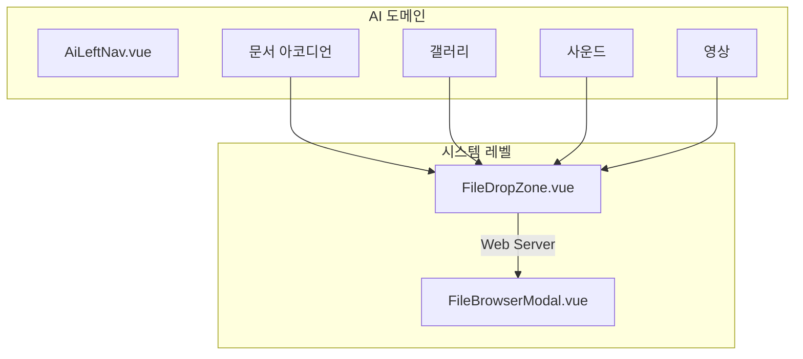

# AI 드롭존 및 첨부 기능 구현 플랜

# AI File Drop Zone & Attach Feature Plan

## 배경 및 목표 (Background & Goals)

노트 탭(문서)과 미디어 탭(갤러리/사운드/영상)에서 파일을 배치할 수 있도록, **My PC**(드롭·첨부)와 **Web Server**(서버 파일 브라우저) 두 소스를 지원한다. 업로더 UI는 시스템 전역 컴포넌트로 분리하여 AiLeftNav 비대화를 방지하고, archive·parts 등 다른 도메인에서도 재사용 가능하게 한다.

### 전역 설계 원칙 (Domain-Agnostic Design)

- **목표**: 파일 업로드·사용·관리 기능은 **모든 도메인(ai, archive, parts 등)에서 재사용** 가능하도록 설계한다.
- **네이밍**: DB 테이블명, API 경로, 서버 함수명 등은 **도메인에 한정하지 않는다** (예: `ai_files` 대신 `files`).
- **초기 검증**: 실제 구현은 **AI 도메인에서 먼저 검증**한다. 라우트 마운트 위치 등은 실용적으로 ai 도메인에 두되, 설계·코드 구조는 전역 재사용을 전제로 한다.
- **AI 연동**: 앞으로 모든 도메인에 AI가 연동된다. 파일 자동 테깅은 전용 AI 모델로 처리 (섹션 13).

---

## 검토 체크리스트 (Review Checklist)

구현 전·후에 아래 항목을 검토한다.

### 시스템 컴포넌트

- [ ] FileDropZone: My PC / Web Server 토글이 명확한가?
- [ ] FileDropZone: 드롭 존이 충분히 넓고 시각적 피드백이 있는가?
- [ ] FileDropZone: accept, multiple 등 props가 도메인별로 유연하게 설정되는가?
- [ ] FileBrowserModal: DB 연결 웹 탐색기 UX인가? (브레드크럼, virtual_path 기반 폴더)
- [ ] FileBrowserModal: listUrl이 도메인별로 주입되는가?
- [ ] AGENTS.md: system No-Touch Zone에 신규 추가 시 사용자 명시적 지시가 있는가?

### DB

- [ ] files 테이블 생성 및 마이그레이션 (도메인 중립, user_id, content_hash 포함)
- [ ] file_references 테이블 (도메인별 참조, 교차 도메인 사용)
- [ ] 업로드 시 DB 레코드 INSERT
- [ ] 목록 API: DB 조회 기반 (파일 시스템 스캔 대신)
- [ ] file_path(물리) vs virtual_path(논리) 구분 설계
- [ ] 중복 파일: content_hash 기반, 물리 저장 없이 DB 참조만 추가 (교차 도메인)
- [ ] 동시 업로드: content_hash UNIQUE, ER_DUP_ENTRY 시 물리 파일 정리 후 기존 레코드 반환

### 서버 API

- [ ] POST /files/upload: multer 또는 FormData 처리 정상인가?
- [ ] POST /files/upload: 파일 저장 후 DB INSERT, domain 파라미터로 도메인 식별
- [ ] POST /files/upload: 도메인별 + 타입별 저장 경로 (uploads/{domain}/{category}/)
- [ ] GET /files/list: DB 조회 기반 (path, category, domain 필터)
- [ ] 경로 검증: .. 금지, uploads/{domain}/ 하위만 허용

### 보안

- [ ] 파일 타입 검증: 확장자 + MIME (fileTypes.js) 적용 여부
- [ ] 파일 크기 제한: 타입별 maxSize 적용 여부
- [ ] 경로 순회 공격: `..` 차단 여부
- [ ] 파일명 정규화: 원본(original_name) vs 저장 파일명 규칙 적용 (한글·특수문자 처리)

### AI 도메인 연동 (초기 검증)

- [ ] useAiAssets: 전역 files API 활용, domain='ai'로 호출
- [ ] documents/images/audio/videos: category 필드로 분류
- [ ] 문서 클릭 시 에디터 로드: requestInsert 또는 별도 플로우
- [ ] 미디어 클릭 시: 미리보기/재생 또는 에디터 삽입
- [ ] 채팅 클립보드 이미지: 서버 저장 후 URL 사용 (dataUrl 인라인 대체)
- [ ] 채팅/대화 삭제 시 파일 정책: 기본 유지, 선택 시 삭제 옵션

### UI/UX

- [ ] 업로드 진행률: UploadProgress.vue 연동 또는 인라인 표시
- [ ] 에러 처리: 타입/크기 초과 시 사용자 메시지
- [ ] 빈 상태: "드래그하여 추가" 등 안내 문구

### AI 자동 테깅

- [ ] 전용 태깅 AI 모델 할당 (정확도·속도 우선)
- [ ] 태깅 분석 대상: 텍스트/메타 추출, 파일명·도메인·카테고리 활용
- [ ] 사용자 설정: 태그 수량, 활성화 on/off 등
- [ ] 저장 파일명: AI 미관여 (UUID+확장자 등 규칙 유지)

### 고아 파일 정리

- [ ] 정기 작업: 참조 0인 파일 탐지 및 물리 삭제

### 기타

- [ ] 다른 도메인(archive, parts)에서 FileDropZone 재사용 시 uploadUrl/listUrl + domain 파라미터 주입
- [ ] 웹캠은 미디어 탭에 별도로 유지 (기존 동작)

---

## 0. 시스템 전역 업로더 분리 (우선)

AiLeftNav.vue 비대화 방지 및 도메인 간 재사용을 위해, 업로더 관련 UI를 **시스템 레벨**로 분리한다.

**신규 파일** (system 계층):

| 파일                                            | 설명                                       |
| ----------------------------------------------- | ------------------------------------------ |
| `src/system/components/ui/FileDropZone.vue`     | My PC / Web Server 토글, 드롭존, 첨부 버튼 |
| `src/system/components/ui/FileBrowserModal.vue` | DB 연결 웹 탐색기 (서버 파일 브라우저)     |

**Props 설계 (도메인 독립)**:

- `FileDropZone`: `uploadUrl`, `listUrl` (API 경로), `accept` (파일 타입), `label` (표시 문구)
- `FileBrowserModal`: `listUrl` (목록 API base), `visible`, `@select`, `@close`

**참고**: AGENTS.md의 system No-Touch Zone은 "명시적 지시 없이" 수정 금지. 사용자 지시로 신규 추가하는 경우 허용.

---

## 1. 아키텍처 개요



---

## 2. 시스템 컴포넌트: FileDropZone

**위치**: `src/system/components/ui/FileDropZone.vue`

**UI 구조**:

- 상단: My PC / Web Server 토글 (q-btn-toggle)
- **My PC**: 드롭 존 + "파일 선택" 버튼
- **Web Server**: "찾아보기" 버튼 → FileBrowserModal 열기

**Props**: `uploadUrl`, `listUrl`, `accept`, `label`, `multiple`

**Emits**: `@add` - `{ source: 'pc'|'server', file?, serverPath?, name, type }`

---

## 3. 시스템 컴포넌트: FileBrowserModal

**위치**: `src/system/components/ui/FileBrowserModal.vue`

**UI** (DB 연결 웹 탐색기 UX):

- virtual_path 기반 브레드크럼, 폴더/파일 리스트, "추가" / "취소"

**Props**: `listUrl`, `modelValue` (visible), `accept` (필터용)

**Emits**: `@update:modelValue`, `@select` - 선택된 파일 정보

---

## 4. DB 설계 (필수)

파일 메타데이터를 DB로 관리하여 검색·필터·웹 탐색기 확장을 지원한다. **테이블명·필드명은 도메인 중립**으로 설계한다.

### 4.1 핵심 원칙: 교차 도메인 중복 제거

- **도메인이 다르더라도 파일 중복은 피한다**. content_hash로 동일 파일 판별.
- **물리 파일 이동 없이 DB 업데이트만**으로 다른 도메인에서 사용 가능하게 한다.
- **참조 기반 관리**: `file_references`로 도메인별 사용 추적. 참조 0이면 고아 → 정리.

### 4.2 테이블: files

```sql
CREATE TABLE files (
  id INT PRIMARY KEY AUTO_INCREMENT,
  file_path VARCHAR(500) NOT NULL,       -- 물리 경로: uploads/{domain}/{category}/xxx.pdf (최초 업로드 도메인)
  virtual_path VARCHAR(500),            -- 논리 경로: 웹 탐색기 재분류용 (초기=file_path)
  original_name VARCHAR(255) NOT NULL,   -- 원본 파일명 (한글 등 그대로 저장)
  file_type VARCHAR(50),                 -- document, image, audio, video
  mime_type VARCHAR(100),
  file_size BIGINT,
  category VARCHAR(50),                 -- documents, images, audio, video (타입별 폴더)
  user_id VARCHAR(100) DEFAULT 'developer',  -- 소유자 (현재 미사용, 향후 인증 연동)
  content_hash VARCHAR(64),              -- SHA256 해시, 교차 도메인 중복 검사용
  project_id VARCHAR(100) NULL,          -- 프로젝트 식별 (IOT/엣지 시나리오, 향후 필수)
  source VARCHAR(50) NULL,               -- 출처: 파일의 물리적/논리적 발생 근거 (Edge ID, AI, User, Crawler 등)
  edge_sid INT NULL,                     -- 등록 기기 테이블(edge_device)의 PK 참조
  created_at DATETIME DEFAULT CURRENT_TIMESTAMP,
  UNIQUE KEY uk_path (file_path),
  UNIQUE KEY uk_content_hash (content_hash),  -- 동시 업로드 시 중복 제거 (NULL 허용)
  INDEX idx_user (user_id),
  INDEX idx_project (project_id),
  INDEX idx_source (source),
  INDEX idx_edge_sid (edge_sid)
);
```

### 4.3 테이블: file_references

```sql
CREATE TABLE file_references (
  id INT PRIMARY KEY AUTO_INCREMENT,
  file_id INT NOT NULL,
  domain VARCHAR(50) NOT NULL,           -- ai, archive, parts 등 (이 도메인에서 사용)
  project_id VARCHAR(100) NULL,          -- 프로젝트 식별 (IOT/엣지 시나리오, 향후 필수)
  virtual_path VARCHAR(500),            -- 도메인별 논리 경로 (옵션)
  created_at DATETIME DEFAULT CURRENT_TIMESTAMP,
  UNIQUE KEY uk_file_domain (file_id, domain),
  FOREIGN KEY (file_id) REFERENCES files(id) ON DELETE CASCADE,
  INDEX idx_domain (domain),
  INDEX idx_project (project_id)
);
```

### 4.4 필드 설명

| 테이블                 | 필드            | 용도                                                                          |
| ---------------------- | --------------- | ----------------------------------------------------------------------------- |
| files                  | file_path       | 디스크 실제 경로. 최초 업로드 도메인 경로 유지 (오리지널리티)                 |
| files                  | content_hash    | 교차 도메인 중복 판별. 동일 해시 = 물리 저장 생략, 참조만 추가                |
| file_references        | file_id, domain | 해당 도메인에서 이 파일 사용. 여러 도메인이 동일 file_id 참조 가능            |
| files, file_references | project_id      | 프로젝트 식별. IOT/엣지 비전 시나리오에서 필수 (특별 프로젝트·엣지 단위 필터) |
| files                  | source          | 출처 (edge, manual, api 등). 어디서 온 파일인지                               |
| files                  | edge_sid        | 등록 기기 테이블(edge_device) PK 참조. 엣지/비전 기기 식별                    |

### 4.5 file_path vs virtual_path

- **file_path**: 물리 저장 경로. 최초 업로드 시 `uploads/{domain}/{category}/`에 저장. 변경하지 않음
- **virtual_path**: UI·재분류용. files 또는 file_references에 둘 수 있음
- **웹 탐색기 기준**: DB 연결 웹 탐색기(FileBrowserModal)가 primary
- **웹 탐색기 소프트 재분류**: virtual_path만 변경, 물리 파일 이동 없음

### 4.6 교차 도메인 중복 처리 (참조만 추가)

1. **업로드 요청** (domain=archive, 파일 F)
2. content_hash 계산
3. **기존 파일 존재** (files에 content_hash 일치): 물리 저장 없음. `file_references`에 (file_id, domain=archive) INSERT. 반환
4. **없음**: `uploads/archive/{category}/`에 저장 → files INSERT → file_references INSERT

**목록 조회**: `GET /files/list?domain=archive` → files JOIN file_references WHERE domain=archive

### 4.7 고아 파일 정리

- **고아**: `file_references`에 참조가 없는 files 레코드
- **정기 작업**: 참조 0인 파일 탐지 → 물리 파일 삭제 → files 레코드 삭제
- **삭제 플로우**: 도메인에서 "파일 제거" 시 file_references만 삭제. 참조 0이 되면 물리 삭제 후 files 삭제

### 4.8 웹 탐색기 확장 시

- **소프트 재분류**: virtual_path만 변경
- **실제 경로 변경**: 정리·마이그레이션 시 별도 기능

### 4.9 동시 업로드 대응 전략

여러 사용자가 동시에 파일을 업로드할 때의 레이스 컨디션을 방지한다.

#### 4.9.1 시나리오별 대응

| 시나리오 | 대응 |
|----------|------|
| **서로 다른 파일** | file_path를 UUID+확장자로 생성 → 경로 충돌 없음 |
| **동일 파일 동시 업로드** | content_hash UNIQUE 제약 + ER_DUP_ENTRY 시 복구 |
| **file_references 중복** | UNIQUE(file_id, domain) → ER_DUP_ENTRY 시 기존 file 반환 |

#### 4.9.2 content_hash 동시 INSERT 레이스

```
사용자 A, B가 동시에 같은 파일 업로드
  → 둘 다 content_hash = X, SELECT 결과 없음
  → 둘 다 물리 저장 + files INSERT 시도
  → 선착 INSERT 성공, 후착 INSERT → ER_DUP_ENTRY (uk_content_hash)
```

**처리 플로우**:
1. content_hash 계산 → SELECT 기존 파일
2. **존재**: file_references만 추가 (INSERT IGNORE 또는 ON DUPLICATE), 반환
3. **없음**: UUID 경로 생성 → 물리 저장 → files INSERT
4. **ER_DUP_ENTRY (content_hash)**: 방금 저장한 물리 파일 삭제 → SELECT 기존 파일 → file_references 추가 → 반환

#### 4.9.3 구현 요건

- `files` 테이블: `UNIQUE KEY uk_content_hash (content_hash)` (content_hash NULL 허용 시 MySQL에서 NULL은 중복 허용)
- file_path: **UUID+확장자** 필수 (5.3 권장 준수)
- 트랜잭션: hash 조회 → 저장 → INSERT를 하나의 트랜잭션으로 처리
- file_references INSERT: `INSERT IGNORE` 또는 `ON DUPLICATE KEY UPDATE`로 (file_id, domain) 중복 시 무시

#### 4.9.4 참고

- parts 도메인: `SELECT FOR UPDATE` + `file_upload_count`로 순차 번호 충돌 방지 (`database/file_upload_logic_final.md`)
- files 도메인: sequence 대신 content_hash 기반이므로 UNIQUE + 복구 플로우 적용

---

## 5. 저장 경로 구조

### 5.1 물리 구조 (최초 업로드 시 도메인별 + 타입별)

```
uploads/
├── ai/                      ← 최초 업로드 도메인별 (오리지널리티 유지)
│   ├── documents/
│   ├── images/
│   ├── audio/
│   └── video/
├── archive/
│   └── ...
└── parts/
    └── ...
```

- **최초 업로드**: `uploads/{요청 domain}/{category}/`에 저장. file_path 고정
- **교차 도메인 재사용**: 물리 파일 추가 없음. file_references에만 (file_id, domain) 추가
- **common/ 폴더 없음**: 파일 이동 없이 참조만 관리

### 5.2 분류 규칙

- `server/config/fileTypes.js`의 category 활용
- document → documents/, image → images/, audio → audio/, video → video/
- 업로드 시 MIME/확장자로 자동 판별

---

## 5.3 파일명 규칙 (원본 vs 저장 파일명)

**기존 참고**: `server/utils/fileUpload.js` (createSafeFilename, generateFilename), `database/file_upload_logic_final.md`, parts 한글 인코딩 복구 로직

### 원칙

- **original_name**: DB에 원본 그대로 저장. 한글·특수문자 유지. UI 표시용
- **file_path**: 디스크 저장 경로. 파일시스템 호환 필수

### 저장 파일명 생성 규칙 (재검토)

| 상황                           | 규칙                                | 예시                                          |
| ------------------------------ | ----------------------------------- | --------------------------------------------- |
| 원본 유효 (ASCII, 확장자 있음) | createSafeFilename 또는 UUID+확장자 | `report.pdf` → `report.pdf` 또는 `{uuid}.pdf` |
| 한글/특수문자 포함             | ASCII 변환 또는 UUID+확장자         | `보고서.pdf` → `report.pdf` 또는 `{uuid}.pdf` |
| 클립보드 이미지 (파일명 없음)  | `image.{ext}` 또는 `{uuid}.{ext}`   | `image.png`                                   |
| 중복 시                        | 시퀀스 추가 또는 UUID               | `report_0001.pdf`                             |

### 한글·인코딩 처리

- multer/FormData 수신 시: parts와 동일하게 `brokenKoreanPattern`(latin1→utf8) 복구 적용
- 저장 파일명: Windows(260자), Linux(255바이트) 제한 준수
- **권장**: 저장 파일명은 UUID+확장자로 통일하여 인코딩 이슈 회피. original_name은 DB에 별도 저장

### 참고

- `createSafeFilename`: sequence=1이면 원본 그대로, 2+면 `baseName_0001.ext`. 한글/특수문자 검증 없음
- 전면 재검토 시: `sanitizeForStorage(originalName)` 신규 또는 `{uuid}.{ext}` 정책 채택 검토

---

## 6. 서버 API

**설계**: 전역 files API. 도메인은 요청 파라미터(domain)로 전달한다.

| 메서드 | 경로          | 설명                                                               |
| ------ | ------------- | ------------------------------------------------------------------ |
| POST   | /files/upload | PC 파일 업로드 → 저장 → files 테이블 INSERT (domain 파라미터 필수) |
| GET    | /files/list   | DB 조회 (domain, category, path 필터)                              |

**초기 구현**: 전역 files 라우트 모듈이 없다면 `server/domains/ai/ai.routes.js`에 마운트하되, **핸들러·서비스 함수명은 도메인 중립** (예: `uploadFile`, `listFiles`). 이후 archive, parts 등에서 재사용 시 전역 모듈로 분리.

**업로드 플로우**:

1. 파일 수신 → content_hash 계산
2. content_hash로 files 조회
3. **존재**: file_references에 (file_id, domain) 추가만. 물리 저장 없음
4. **없음**: `uploads/{domain}/{category}/` 저장 → files INSERT → file_references INSERT

**목록 API**: files JOIN file_references WHERE domain=? 로 DB 조회. 응답에 id, file_path, original_name, category 등 포함.

---

## 7. 클라이언트 API 및 상태

**전역 files API** (system 또는 공용): `uploadFile(file, domain)`, `listFiles({ domain, category, path })`

- 도메인별로 `domain` 파라미터를 전달하여 호출

**useAiAssets composable** (AI 도메인 전용, 초기 검증): `src/domains/ai/composables/useAiAssets.js`

- 전역 files API를 `domain='ai'`로 호출
- `documents`, `images`, `audio`, `videos` ref (category 필드로 분류)
- `addAsset(item)` - PC 업로드 또는 서버 파일 참조 추가
- `removeAsset(id)` - 해당 도메인에서 file_references 삭제. 참조 0이면 물리 삭제 후 files 삭제
- 다른 도메인(archive, parts)은 동일 패턴으로 `useArchiveAssets`, `usePartsAssets` 등 구현 가능

---

## 8. AiLeftNav 통합 (초기 검증)

**문서 아코디언** (`AiLeftNav.vue` 211~214행):

- "준비 중" 대신 FileDropZone 삽입
- uploadUrl, listUrl (전역 /files/ API), domain='ai' 전달
- 추가된 문서 목록 표시 (q-list, 클릭 시 에디터에 로드)

**미디어 아코디언** (갤러리, 사운드, 영상):

- 각각 FileDropZone 삽입, accept 등 타입별 props 전달
- 추가된 항목 목록 표시

---

## 9. 구현 순서

### 요약 구현 순서

| Phase       | 내용                                        |
| ----------- | ------------------------------------------- |
| **Phase 1** | DB 스키마, 서버 유틸, 서버 API              |
| **Phase 2** | FileDropZone, FileBrowserModal              |
| **Phase 3** | 클라이언트 API, useAiAssets, AiLeftNav 연동 |
| **Phase 4** | 고아 정리, 에디터·채팅 연동, AI 테깅        |

### Phase 1: 기본 인프라

| 순서 | 단계          | 세부 작업                                                                        |
| ---- | ------------- | -------------------------------------------------------------------------------- |
| 1.1  | **DB 스키마** | `files` 테이블 생성 (file_path, content_hash, project_id, source, edge_sid 포함) |
| 1.2  |               | `file_references` 테이블 생성 (file_id, domain, project_id, virtual_path)        |
| 1.3  |               | UNIQUE(content_hash), 인덱스 확인 (domain, project_id, edge_sid)                 |
| 2.1  | **서버 유틸** | content_hash(SHA256) 계산 함수                                                   |
| 2.2  |               | 파일 저장 경로 생성 `uploads/{domain}/{category}/`                               |
| 2.3  |               | fileTypes.js 기반 category·타입 판별                                             |
| 3.1  | **서버 API**  | POST /files/upload: multer, content_hash 중복 검사, ER_DUP_ENTRY 시 복구 플로우  |
| 3.2  |               | GET /files/list: files JOIN file_references, domain/category 필터                |
| 3.3  |               | DELETE /files/:id 또는 도메인별 참조 제거 API                                    |

### Phase 2: 시스템 컴포넌트

| 순서 | 단계                 | 세부 작업                                        |
| ---- | -------------------- | ------------------------------------------------ |
| 4.1  | **FileDropZone**     | My PC / Web Server 토글, 드롭존, 파일 선택 버튼  |
| 4.2  |                      | uploadUrl, listUrl, accept, domain props         |
| 4.3  |                      | @add emit (source, file, serverPath, name, type) |
| 5.1  | **FileBrowserModal** | listUrl 기반 목록 조회, virtual_path 브레드크럼  |
| 5.2  |                      | @select emit, @update:modelValue                 |

### Phase 3: AI 도메인 연동

| 순서 | 단계               | 세부 작업                                                     |
| ---- | ------------------ | ------------------------------------------------------------- |
| 6.1  | **클라이언트 API** | uploadFile(file, { domain, project_id?, source?, edge_sid? }) |
| 6.2  |                    | listFiles({ domain, category, path, project_id? })            |
| 7.1  | **useAiAssets**    | domain='ai' 호출, documents/images/audio/videos 분류          |
| 7.2  |                    | addAsset, removeAsset (file_references 기반)                  |
| 8.1  | **AiLeftNav**      | 문서 아코디언: FileDropZone + 목록 (q-list)                   |
| 8.2  |                    | 미디어 아코디언: 갤러리/사운드/영상 각각 FileDropZone         |
| 8.3  |                    | 클릭 시 에디터 로드 또는 미리보기                             |

### Phase 4: 확장·정리

| 순서 | 단계                  | 세부 작업                                   |
| ---- | --------------------- | ------------------------------------------- |
| 9.1  | **고아 정리**         | 참조 0인 files 탐지 쿼리                    |
| 9.2  |                       | 물리 파일 삭제 + files 레코드 삭제          |
| 9.3  |                       | 정기 실행 (cron/스케줄러) 또는 수동 트리거  |
| 10.1 | **에디터·채팅**       | uploadHandler → files API 연동              |
| 10.2 |                       | 채팅 클립보드 이미지 → 서버 업로드 후 URL   |
| 11.1 | **Phase 2 (AI 테깅)** | file_tags 또는 tags JSON, 전용 태깅 AI 연동 |

---

## 10. 보안 고려사항

- 파일 타입 검증: 확장자 + MIME (fileTypes.js 활용)
- 파일 크기 제한: 타입별 maxSize 적용
- 경로 검증: `path` 쿼리에 `..` 금지, `uploads/` 하위만 허용 (교차 도메인 참조 시 다른 도메인 경로 접근 가능)
- 파일명 정규화: 5.3 파일명 규칙 참고 (original_name vs 저장 경로)

---

## 11. 에디터·클립보드 파일 처리

### 11.1 에디터 파일 첨부

- **BaseTiptapEditor**: `uploadHandler(file, context)` 사용. `context.source === 'clipboard'` 시 클립보드 이미지
- **플로우**: 파일 선택/드롭/붙여넣기 → uploadHandler 호출 → 서버 업로드 → URL 반환 → 에디터에 삽입
- **연동**: uploadHandler가 전역 files API(`uploadFile`, domain 파라미터) 호출하도록 설정

### 11.2 클립보드 이미지 붙여넣기

- **에디터**: `convertClipboardImageToFile` → File 객체 생성 (`image.png` 등) → uploadHandler → 서버 저장
- **채팅(AiChatPanel)**: 현재 dataUrl(base64) 인라인 사용. **대안**: 업로드 후 서버 URL 사용 (기본 권장)

### 11.3 대안 정리

| 출처             | 현재                 | 권장                                           |
| ---------------- | -------------------- | ---------------------------------------------- |
| 에디터 파일 첨부 | uploadHandler → 서버 | files API 연동, domain 전달                    |
| 에디터 클립보드  | uploadHandler        | 동일                                           |
| 채팅 클립보드    | dataUrl 인라인       | 서버 업로드 → URL (domain=ai, category=images) |

---

## 12. AI 도메인 특화 사항 (초기 검증)

### 12.1 채팅 클립보드 이미지

- **현재**: `handlePaste` → dataUrl → `attachedImages` → 메시지와 함께 전송 (인라인 base64)
- **권장**: 붙여넣기 시 즉시 `/files/upload` 호출 (domain=ai, category=images) → 반환된 URL을 메시지에 포함
- **효과**: 메시지 크기 감소, 파일 재사용 가능, files 테이블에 기록

### 12.2 채팅/대화 삭제 시 파일 정책

- **기본**: 대화 삭제 시 **파일은 유지**. 다른 대화·노트에서 참조 가능성 고려
- **선택 삭제**: 대화 삭제 UI에 "사용된 파일도 삭제" 옵션 제공. 선택 시 해당 대화에서 참조한 파일만 삭제 (또는 참조 카운트 기반)
- **구현 시**: `file_references` 또는 `usage_count` 테이블/필드로 참조 추적 후, 참조 0일 때만 물리 삭제

---

## 13. AI 자동 테깅 (선택 기능)

모든 도메인에 AI가 연동되는 전제 하에, **파일 자동 테깅만** AI가 담당한다. 저장 파일명 생성에는 AI를 사용하지 않는다.

### 13.1 방향

- **AI 역할**: 자동 테깅만. 파일명·경로 생성은 규칙 기반 유지
- **탐색 기준**: DB 연결 웹 탐색기(FileBrowserModal)가 primary. Windows 탐색기 아님
- **모델**: **전용 태깅 AI** 할당. 정확도·속도 우선. 사용자 선택 AI 대신 전용 모델 사용

### 13.2 전용 태깅 AI

- 사용자 대화용 AI와 분리된 전용 모델
- 백그라운드 배치 처리에 적합
- 태깅 전용 프롬프트·출력 형식으로 일관성 확보

### 13.3 태깅 분석 대상

| 대상            | 설명                                 |
| --------------- | ------------------------------------ |
| 텍스트 추출     | PDF, DOCX, TXT 등 본문 (가능한 타입) |
| 메타데이터      | EXIF, ID3, 문서 속성                 |
| 파일명          | original_name                        |
| 도메인·카테고리 | domain, category (컨텍스트)          |

### 13.4 사용자 설정 옵션

- 태깅 활성화 on/off
- 태그 수량 상한 (예: 3~20개)
- 태그 언어 (한국어/영어/혼용)
- 재태깅 트리거 (수동 재분석)

### 13.5 구현 우선순위

- Phase 2 이후. 기본 파일 업로드·관리·웹 탐색기 안정화 후 진행
- DB: `file_tags` 테이블 또는 `files.tags` JSON 필드 검토

---

## 14. 참고 파일

- 업로드 패턴: `server/domains/parts/partFiles.routes.js` (multer, FormData)
- 파일 타입: `server/config/fileTypes.js`
- 업로드 유틸: `server/utils/fileUpload.js`
- 진행률 UI: `src/system/components/ui/UploadProgress.vue`
