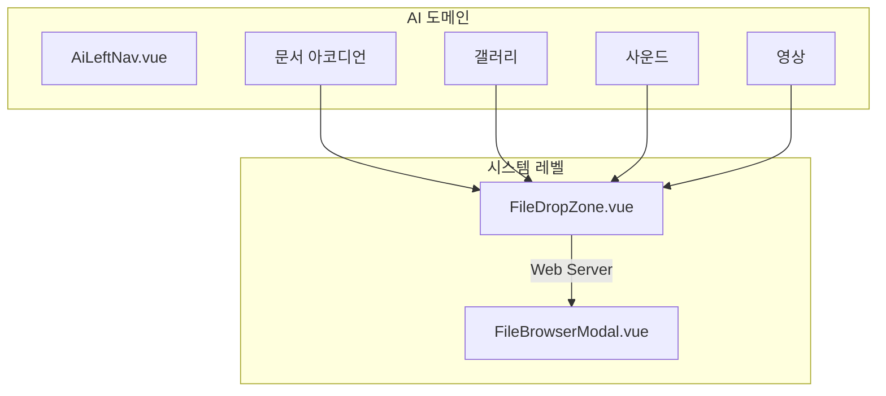

# AI 드롭존 및 첨부 기능 구현 플랜

# AI File Drop Zone & Attach Feature Plan

## 목차

| 섹션  | 내용                                                     |
| ----- | -------------------------------------------------------- |
| 0     | 시스템 전역 업로더 분리                                  |
| 1     | 아키텍처 개요                                            |
| 2~3   | FileDropZone, FileBrowserModal                           |
| 4     | DB 설계 (files, file_references, edge_device, AI 테이블) |
| 5     | 저장 경로 구조, 날짜 분리, 파일명 규칙                   |
| 6     | 서버 API (6.1 에러 스펙)                                 |
| 7~8   | 클라이언트 API, AiLeftNav 통합                           |
| 9     | 구현 순서 (Phase 0~4)                                    |
| 10    | 보안 고려사항                                            |
| 11~12 | 에디터·클립보드, AI 도메인 특화                          |
| 13    | AI 자동 테깅                                             |
| 14    | 인프라·운영 검토 (14.4.1 엣지 MQTT 업로드)               |
| 15    | 참고 파일                                                |

---

## 배경 및 목표 (Background & Goals)

노트 탭(문서)과 미디어 탭(갤러리/사운드/영상)에서 파일을 배치할 수 있도록, **My PC**(드롭·첨부)와 **Web Server**(서버 파일 브라우저) 두 소스를 지원한다. 업로더 UI는 시스템 전역 컴포넌트로 분리하여 AiLeftNav 비대화를 방지하고, archive·parts 등 다른 도메인에서도 재사용 가능하게 한다.

### 전역 설계 원칙 (Domain-Agnostic Design)

- **목표**: 파일 업로드·사용·관리 기능은 **모든 도메인(ai, archive, parts 등)에서 재사용** 가능하도록 설계한다.
- **네이밍**: DB 테이블명, API 경로, 서버 함수명 등은 **도메인에 한정하지 않는다** (예: `ai_files` 대신 `files`).
- **초기 검증**: 실제 구현은 **AI 도메인에서 먼저 검증**한다. 라우트 마운트 위치 등은 실용적으로 ai 도메인에 두되, 설계·코드 구조는 전역 재사용을 전제로 한다.
- **AI 연동**: 앞으로 모든 도메인에 AI가 연동된다. 파일 자동 테깅은 전용 AI 모델로 처리 (섹션 13).

---

## 검토 체크리스트 (Review Checklist)

구현 전·후에 아래 항목을 검토한다. 상세는 해당 섹션 참조.

| 카테고리            | 요약                                                                           | 상세                  |
| ------------------- | ------------------------------------------------------------------------------ | --------------------- |
| **시스템 컴포넌트** | FileDropZone, FileBrowserModal props·UX, AGENTS.md                             | 섹션 0, 2, 3          |
| **DB**              | files, file_references, AI 테이블, edge_device, content_hash, 중복·동시 업로드 | 섹션 4                |
| **서버 API**        | POST /files/upload, GET /files/list, 경로·도메인 검증                          | 섹션 6                |
| **보안**            | 확장자+MIME+magic number, 크기 제한, 경로 순회 방지                            | 섹션 10               |
| **AI 도메인**       | useAiAssets, category 분류, 에디터·미디어 연동, 채팅 클립보드                  | 섹션 7, 8, 11, 12     |
| **AI 테깅·검증**    | 태깅 AI, 사람 검증·재처리, file_action_log                                     | 섹션 4.4.3, 4.4.4, 13 |
| **인프라·운영**     | AI 워커, 큐, 엣지 빈도·인증, 스토리지 I/O                                      | 섹션 14               |
| **기타**            | 고아 정리, 도메인 재사용, 웹캠                                                 | 섹션 4.7              |

---

## 0. 시스템 전역 업로더 분리 (우선)

AiLeftNav.vue 비대화 방지 및 도메인 간 재사용을 위해, 업로더 관련 UI를 **시스템 레벨**로 분리한다.

**신규 파일** (system 계층):

| 파일                                            | 설명                                       |
| ----------------------------------------------- | ------------------------------------------ |
| `src/system/components/ui/FileDropZone.vue`     | My PC / Web Server 토글, 드롭존, 첨부 버튼 |
| `src/system/components/ui/FileBrowserModal.vue` | DB 연결 웹 탐색기 (서버 파일 브라우저)     |

**Props 설계 (도메인 독립)**:

- `FileDropZone`: `uploadUrl`, `listUrl` (API 경로), `accept` (파일 타입), `label` (표시 문구)
- `FileBrowserModal`: `listUrl` (목록 API base), `visible`, `@select`, `@close`

**참고**: AGENTS.md의 system No-Touch Zone은 "명시적 지시 없이" 수정 금지. 사용자 지시로 신규 추가하는 경우 허용.

---

## 1. 아키텍처 개요



---

## 2. 시스템 컴포넌트: FileDropZone

**위치**: `src/system/components/ui/FileDropZone.vue`

**UI 구조**:

- 상단: My PC / Web Server 토글 (q-btn-toggle)
- **My PC**: 드롭 존 + "파일 선택" 버튼
- **Web Server**: "찾아보기" 버튼 → FileBrowserModal 열기

**Props**: `uploadUrl`, `listUrl`, `accept`, `label`, `multiple`

**Emits**: `@add` - `{ source: 'pc'|'server', file?, serverPath?, name, type }`

---

## 3. 시스템 컴포넌트: FileBrowserModal

**위치**: `src/system/components/ui/FileBrowserModal.vue`

**UI** (DB 연결 웹 탐색기 UX):

- virtual_path 기반 브레드크럼, 폴더/파일 리스트, "추가" / "취소"

**Props**: `listUrl`, `modelValue` (visible), `accept` (필터용)

**Emits**: `@update:modelValue`, `@select` - 선택된 파일 정보

---

## 4. DB 설계 (필수)

파일 메타데이터를 DB로 관리하여 검색·필터·웹 탐색기 확장을 지원한다. **테이블명·필드명은 도메인 중립**으로 설계한다.

### 4.0 테이블 요약

| 테이블               | 용도                                                        | 관계                    |
| -------------------- | ----------------------------------------------------------- | ----------------------- |
| **files**            | 물리 파일 메타데이터, content_hash, AI 워크플로우·검증 상태 | —                       |
| **file_references**  | 도메인별 파일 참조 (domain, project_id, virtual_path)       | files.id → file_id      |
| **file_ai_metadata** | AI 추출 텍스트, 키워드, 요약                                | files.id → file_id      |
| **file_tags**        | AI/사람 태그 (tag, score, source)                           | files.id → file_id      |
| **file_embeddings**  | 벡터 임베딩 (BLOB). 부담 시 벡터 DB 이전 검토               | files.id → file_id      |
| **file_action_log**  | AI·사람 행동 이력 (감사·추적용)                             | files.id → file_id      |
| **edge_device**      | 엣지/IOT 기기 등록 (업로드 화이트리스트·인증)               | — (files.edge_sid 참조) |

### 4.1 핵심 원칙: 교차 도메인 중복 제거

- **도메인이 다르더라도 파일 중복은 피한다**. content_hash로 동일 파일 판별.
- **물리 파일 이동 없이 DB 업데이트만**으로 다른 도메인에서 사용 가능하게 한다.
- **참조 기반 관리**: `file_references`로 도메인별 사용 추적. 참조 0이면 고아 → 정리.

### 4.2 테이블: files

```sql
CREATE TABLE files (
  id INT PRIMARY KEY AUTO_INCREMENT,
  file_path VARCHAR(500) NOT NULL,       -- 물리 경로: uploads/{domain}/{category}/{YYYYMMDDHHmmss}_{shortUuid}.ext (5.4)
  virtual_path VARCHAR(500),            -- 논리 경로: 웹 탐색기 재분류용 (초기=file_path)
  original_name VARCHAR(255) NOT NULL,   -- 원본 파일명 (한글 등 그대로 저장)
  file_type VARCHAR(50),                 -- document, image, audio, video
  mime_type VARCHAR(100),
  file_size BIGINT,
  category VARCHAR(50),                 -- documents, images, audio, video (타입별 폴더)
  user_id VARCHAR(100) DEFAULT 'developer',  -- 소유자 (현재 미사용, 향후 인증 연동)
  content_hash VARCHAR(64) NOT NULL,     -- SHA256 해시, 교차 도메인 중복 검사용 (필수)
  project_id VARCHAR(100) NULL,          -- 프로젝트 식별 (IOT/엣지 시나리오, 향후 필수)
  source VARCHAR(50) NULL,               -- 출처: 파일의 물리적/논리적 발생 근거 (Edge ID, AI, User, Crawler 등)
  edge_sid INT NULL,                     -- 등록 기기 테이블(edge_device)의 PK 참조
  source_metadata JSON NULL,             -- source별 추가 컨텍스트 (섹션 4.4.5)
  -- AI 워크플로우 추적 (업로드 → 텍스트추출 → 키워드분석 → 임베딩 → 분류)
  ai_workflow_status VARCHAR(20) DEFAULT 'pending',  -- pending, processing, completed, failed
  ai_workflow_step TINYINT DEFAULT 0,    -- 0=업로드만, 1=텍스트추출, 2=키워드, 3=임베딩, 4=분류완료
  ai_workflow_error TEXT NULL,           -- 실패 시 오류 메시지
  ai_workflow_updated_at DATETIME NULL,  -- 마지막 AI 처리 시각
  -- 사람 검증 (AI 처리 후 검토·승인)
  ai_review_status VARCHAR(20) NULL,     -- pending_review, verified, needs_reprocess (섹션 4.4.3)
  ai_reviewed_at DATETIME NULL,          -- 검증 완료 시각
  ai_reviewed_by VARCHAR(100) NULL,      -- 검증자 (user_id)
  created_at DATETIME DEFAULT CURRENT_TIMESTAMP,
  UNIQUE KEY uk_path (file_path),            -- 물리 경로 1:1 보장 (섹션 4.9.5)
  UNIQUE KEY uk_content_hash (content_hash),  -- 동시 업로드 시 중복 제거
  INDEX idx_user (user_id),
  INDEX idx_project (project_id),
  INDEX idx_source (source),
  INDEX idx_edge_sid (edge_sid),
  INDEX idx_ai_workflow (ai_workflow_status, ai_workflow_step),
  INDEX idx_ai_review (ai_review_status)
);
```

### 4.3 테이블: file_references

```sql
CREATE TABLE file_references (
  id INT PRIMARY KEY AUTO_INCREMENT,
  file_id INT NOT NULL,
  domain VARCHAR(50) NOT NULL,           -- ai, archive, parts 등 (이 도메인에서 사용)
  project_id VARCHAR(100) NULL,          -- 프로젝트 식별 (IOT/엣지 시나리오, 향후 필수)
  virtual_path VARCHAR(500),            -- 도메인별 논리 경로 (옵션)
  created_at DATETIME DEFAULT CURRENT_TIMESTAMP,
  UNIQUE KEY uk_file_domain (file_id, domain),
  FOREIGN KEY (file_id) REFERENCES files(id) ON DELETE CASCADE,
  INDEX idx_domain (domain),
  INDEX idx_project (project_id)
);
```

### 4.3.1 테이블: edge_device

엣지/IOT 기기 등록. `source='edge'` 업로드 시 `edge_sid`로 참조하며, 등록된 기기만 업로드 허용(화이트리스트). 섹션 14.4 엣지 인증 전략과 연동.

```sql
CREATE TABLE edge_device (
  id INT PRIMARY KEY AUTO_INCREMENT,
  device_id VARCHAR(100) NOT NULL,       -- 기기 고유 식별 (시리얼, MAC 등)
  name VARCHAR(255) NULL,                -- 표시명 (관리용)
  project_id VARCHAR(100) NULL,          -- 소속 프로젝트
  user_id VARCHAR(100) NULL,             -- 담당/소유 사용자
  location VARCHAR(500) NULL,            -- 물리적 위치 (주소, 설치 장소 등)
  node_tag VARCHAR(100) NULL,            -- 노드 태그 (위치와 별개, 그룹·식별용)
  api_key_hash VARCHAR(64) NULL,         -- API Key 해시 (SHA256, 평문 저장 금지)
  api_key_expires_at DATETIME NULL,      -- API Key 만료 시각 (NULL=무기한)
  status VARCHAR(20) DEFAULT 'active',   -- active, disabled, revoked
  last_seen_at DATETIME NULL,            -- 마지막 업로드/접속 시각
  -- MQTT (기본 통신)
  mqtt_client_id VARCHAR(100) NULL,     -- MQTT 클라이언트 ID (브로커 식별용)
  mqtt_is_connected TINYINT(1) DEFAULT 0,  -- MQTT 연결 상태 (0=미연결, 1=연결됨)
  mqtt_last_connected_at DATETIME NULL,  -- MQTT 마지막 연결 시각
  -- 웹 실행 로직 수정·반영
  hardware_info JSON NULL,               -- IO, GPIO, 센서/액추에이터 정보 (디바이스 보고)
  remote_config JSON NULL,               -- 웹에서 설정한 로직·파라미터 (임계값, 규칙 등)
  config_version INT DEFAULT 0,           -- 설정 버전 (동기화용)
  config_updated_at DATETIME NULL,       -- 웹에서 마지막 변경 시각
  config_applied_at DATETIME NULL,       -- 디바이스가 마지막 적용 시각
  -- OTA 업데이트
  ota_firmware_version VARCHAR(50) NULL,  -- 현재 펌웨어 버전
  ota_last_update_at DATETIME NULL,       -- OTA 마지막 적용 시각
  ota_status VARCHAR(20) NULL,           -- pending, downloading, applying, completed, failed
  metadata JSON NULL,                    -- 확장 정보 (모델 등)
  created_at DATETIME DEFAULT CURRENT_TIMESTAMP,
  updated_at DATETIME DEFAULT CURRENT_TIMESTAMP ON UPDATE CURRENT_TIMESTAMP,
  UNIQUE KEY uk_device_id (device_id),
  UNIQUE KEY uk_mqtt_client_id (mqtt_client_id),
  INDEX idx_project (project_id),
  INDEX idx_user (user_id),
  INDEX idx_status (status),
  INDEX idx_last_seen (last_seen_at)
);
```

**files.edge_sid** → `edge_device.id` (FOREIGN KEY는 엣지 확장 시 추가. 초기에는 논리적 참조만)

**별도 테이블 (확장 시)**: `edge_device_mqtt_config` (broker, 토픽, credential 등), `edge_device_config` (버전별 설정 이력, 롤백)

| 필드                   | 용도                                                 |
| ---------------------- | ---------------------------------------------------- |
| device_id              | 기기 고유 식별. API 인증 시 device_id + api_key 조합 |
| user_id                | 담당/소유 사용자. 기기별 사용자 매핑                 |
| location               | 물리적 위치 (주소, 설치 장소, 좌표 등)               |
| node_tag               | 노드 태그. 위치와 별개, 그룹·식별용                  |
| api_key_hash           | API Key SHA256 해시. 평문 저장 금지                  |
| api_key_expires_at     | API Key 만료 시각. NULL=무기한. 만료 시 인증 거부    |
| status                 | active만 업로드 허용. disabled/revoked 시 거부       |
| last_seen_at           | 모니터링·비활성 기기 탐지                            |
| mqtt_client_id         | MQTT 클라이언트 ID. 브로커 식별용                    |
| mqtt_is_connected      | MQTT 연결 상태 (0=미연결, 1=연결됨). 상태 파악용     |
| mqtt_last_connected_at | MQTT 마지막 연결 시각                                |
| hardware_info          | IO, GPIO, 센서/액추에이터 정보 (디바이스 보고)       |
| remote_config          | 웹에서 설정한 로직·파라미터 (임계값, 규칙, 스케줄)   |
| config_version         | 설정 버전. 동기화·충돌 방지                          |
| config_updated_at      | 웹에서 마지막 변경 시각                              |
| config_applied_at      | 디바이스가 마지막 적용 시각                          |
| ota_firmware_version   | 현재 펌웨어 버전                                     |
| ota_last_update_at     | OTA 마지막 적용 시각                                 |
| ota_status             | pending, downloading, applying, completed, failed    |

### 4.4 필드 설명

| 테이블                 | 필드                                                                            | 용도                                                                          |
| ---------------------- | ------------------------------------------------------------------------------- | ----------------------------------------------------------------------------- |
| files                  | file_path                                                                       | 디스크 실제 경로. UNIQUE. 최초 업로드 도메인 경로 유지 (섹션 4.9.5)           |
| files                  | content_hash                                                                    | 교차 도메인 중복 판별. NOT NULL 필수. 동일 해시 = 물리 저장 생략, 참조만 추가 |
| file_references        | file_id, domain                                                                 | 해당 도메인에서 이 파일 사용. 여러 도메인이 동일 file_id 참조 가능            |
| files, file_references | project_id                                                                      | 프로젝트 식별. IOT/엣지 비전 시나리오에서 필수 (특별 프로젝트·엣지 단위 필터) |
| files                  | source                                                                          | 출처 (edge, manual, api 등). 어디서 온 파일인지                               |
| files                  | edge_sid                                                                        | 등록 기기 테이블(edge_device) PK 참조. 엣지/비전 기기 식별                    |
| files                  | source_metadata                                                                 | source별 추가 컨텍스트 (JSON, 선택). 섹션 4.4.5                               |
| files                  | ai_workflow_*                                                                   | AI 처리 파이프라인 진행 상태 추적 (섹션 4.4.1)                                |
| files                  | ai_review_*                                                                     | 사람 검증 상태·검증자·검증 시각 (섹션 4.4.3)                                  |
| file_ai_metadata       | extracted_text, keywords, summary                                               | AI 텍스트 추출·키워드·요약 결과 (섹션 4.4.2)                                  |
| file_tags              | tag, score, source                                                              | AI/사람 태그, source로 출처 구분 (섹션 4.4.2, 4.4.3)                          |
| file_embeddings        | model_id, dimension, vector                                                     | 벡터 임베딩. BLOB 용량 주의, 부담 시 벡터 DB 이전 (섹션 4.4.2)                |
| file_action_log        | action, actor, actor_id, details                                                | AI·사람 행동 이력, 감사·추적용 (섹션 4.4.4)                                   |
| edge_device            | device_id, mqtt_client_id, hardware_info, remote_config, config_version, ota_*  | 엣지 기기 등록·MQTT·웹 로직·OTA. files.edge_sid 참조 (섹션 4.3.1)             |

### 4.4.1 AI 워크플로우 추적 필드

업로드 후 AI 파이프라인(텍스트 추출 → 키워드 분석 → 벡터 임베딩 → 분류) 진행 상태를 추적한다.

| 필드                   | 타입        | 용도                                                     |
| ---------------------- | ----------- | -------------------------------------------------------- |
| ai_workflow_status     | VARCHAR(20) | pending, processing, completed, failed                   |
| ai_workflow_step       | TINYINT     | 0=업로드만, 1=텍스트추출, 2=키워드, 3=임베딩, 4=분류완료 |
| ai_workflow_error      | TEXT        | 실패 시 오류 메시지                                      |
| ai_workflow_updated_at | DATETIME    | 마지막 AI 처리 시각                                      |

**파이프라인 단계**:

1. 업로드 완료 (step=0)
2. 텍스트 추출 (step=1)
3. 키워드 분석 (step=2)
4. 벡터 임베딩 생성 (step=3)
5. AI 분류 완료 (step=4, status=completed) → `ai_review_status='pending_review'` 설정 (섹션 4.4.3)

**쿼리 예**:

- 미처리: `WHERE ai_workflow_status='pending'`
- 재시도 대상: `WHERE ai_workflow_status='failed'`
- 특정 단계 대기: `WHERE ai_workflow_step < 3 AND ai_workflow_status='processing'`

### 4.4.2 AI 분석 결과 저장 테이블

AI 파이프라인 처리 결과(텍스트, 키워드, 태그, 임베딩)를 저장하는 테이블이다.

#### file_ai_metadata

```sql
CREATE TABLE file_ai_metadata (
  id INT PRIMARY KEY AUTO_INCREMENT,
  file_id INT NOT NULL,
  extracted_text LONGTEXT NULL,          -- 추출된 텍스트 (PDF, DOCX 등)
  keywords JSON NULL,                    -- 키워드 배열 ["키워드1", "키워드2"]
  summary TEXT NULL,                     -- 요약 (옵션)
  created_at DATETIME DEFAULT CURRENT_TIMESTAMP,
  updated_at DATETIME DEFAULT CURRENT_TIMESTAMP ON UPDATE CURRENT_TIMESTAMP,
  UNIQUE KEY uk_file (file_id),
  FOREIGN KEY (file_id) REFERENCES files(id) ON DELETE CASCADE,
  FULLTEXT INDEX ft_extracted_text (extracted_text)
);
```

#### file_tags

```sql
CREATE TABLE file_tags (
  id INT PRIMARY KEY AUTO_INCREMENT,
  file_id INT NOT NULL,
  tag VARCHAR(100) NOT NULL,             -- AI 또는 사람이 부여한 태그
  score FLOAT NULL,                      -- 관련도 점수 (옵션)
  source VARCHAR(20) DEFAULT 'ai',       -- ai: AI 생성, human: 사람 추가, corrected: 사람 수정 (섹션 4.4.3)
  created_at DATETIME DEFAULT CURRENT_TIMESTAMP,
  updated_at DATETIME DEFAULT CURRENT_TIMESTAMP ON UPDATE CURRENT_TIMESTAMP,
  UNIQUE KEY uk_file_tag (file_id, tag),
  FOREIGN KEY (file_id) REFERENCES files(id) ON DELETE CASCADE,
  INDEX idx_tag (tag),
  INDEX idx_source (source)
);
```

#### file_embeddings

```sql
CREATE TABLE file_embeddings (
  id INT PRIMARY KEY AUTO_INCREMENT,
  file_id INT NOT NULL,
  model_id VARCHAR(100) NOT NULL,         -- 임베딩 모델 식별
  dimension INT NOT NULL,                 -- 벡터 차원
  vector BLOB NULL,                       -- float32 바이너리 (또는 별도 벡터 DB 사용)
  created_at DATETIME DEFAULT CURRENT_TIMESTAMP,
  UNIQUE KEY uk_file_model (file_id, model_id),
  FOREIGN KEY (file_id) REFERENCES files(id) ON DELETE CASCADE,
  INDEX idx_model (model_id)
);
```

**vector BLOB 용량 및 사용 전략**:

- `vector`는 float32 배열 (차원당 4바이트). 예: dimension 1536 → 약 6KB/파일
- 파일 수가 늘면 DB 크기가 빠르게 증가 (1만 파일 ≈ 60MB, 10만 파일 ≈ 600MB)
- **임시·소규모**: 초기 검증, 파일 수 적을 때는 BLOB으로 충분
- **부담이 되면**: pgvector, Milvus, Pinecone 등 별도 벡터 DB로 이전 검토

| 구분      | BLOB (현재)            | 벡터 DB 이전 검토 시점                 |
| --------- | ---------------------- | -------------------------------------- |
| 용도      | 임시·소규모, 초기 검증 | 벡터 검색이 핵심, 파일 수 많음         |
| 대략 기준 | 수백~수천 파일 수준    | 수만 파일 이상, DB 용량·검색 성능 이슈 |

#### 결과 저장 흐름

| 단계         | 저장 테이블      | 저장 내용                   |
| ------------ | ---------------- | --------------------------- |
| 텍스트 추출  | file_ai_metadata | extracted_text              |
| 키워드 분석  | file_ai_metadata | keywords                    |
| AI 분류/태깅 | file_tags        | tag (행 단위, source='ai')  |
| 벡터 임베딩  | file_embeddings  | vector, model_id, dimension |

### 4.4.3 사람 검증 및 재처리

AI 처리 완료 후 사람이 검토·승인하거나 재처리를 요청하는 플로우를 지원한다.

#### files.ai_review_* 필드

| 필드             | 타입         | 용도                                      |
| ---------------- | ------------ | ----------------------------------------- |
| ai_review_status | VARCHAR(20)  | pending_review, verified, needs_reprocess |
| ai_reviewed_at   | DATETIME     | 검증 완료 시각                            |
| ai_reviewed_by   | VARCHAR(100) | 검증자 user_id                            |

**상태 흐름**:

- `NULL` 또는 `pending_review`: AI 완료 후 검증 대기
- `verified`: 사람이 검토 후 승인
- `needs_reprocess`: 재처리 요청 (태그 수정 후 재분석 등)

#### file_tags.source 필드

| 값        | 설명                       |
| --------- | -------------------------- |
| ai        | AI가 생성한 태그           |
| human     | 사람이 직접 추가한 태그    |
| corrected | AI 태그를 사람이 수정한 것 |

#### 검증 플로우

1. **AI 완료** → `ai_workflow_status='completed'`, `ai_review_status='pending_review'`
2. **사람 검토** → UI에서 태그·키워드·요약 확인
3. **승인** → `PATCH /files/:id/verify` → `ai_review_status='verified'`, `ai_reviewed_at`, `ai_reviewed_by` 설정
4. **태그 수정** → `PATCH /file_tags` 또는 `POST /file_tags` (추가) → `source='human'` 또는 `'corrected'`
5. **재처리 요청** → `POST /files/:id/reprocess` → `ai_review_status='needs_reprocess'`, `ai_workflow_status='pending'`, `ai_workflow_step=0` → 기존 AI 결과 삭제 후 파이프라인 재시작

#### 재처리 로직

| 항목        | 정책                                                                           |
| ----------- | ------------------------------------------------------------------------------ |
| 트리거      | API `POST /files/:id/reprocess`, UI "재분석" 버튼                              |
| 기존 데이터 | file_ai_metadata, file_tags(source='ai'), file_embeddings 해당 file_id 행 삭제 |
| 보존        | file_tags(source='human','corrected')는 유지 (선택: 옵션으로 전체 삭제 가능)   |
| 상태 전이   | ai_workflow_status='pending', ai_workflow_step=0, ai_review_status=NULL        |
| 실패 재시도 | 기존과 동일 (`ai_workflow_status='failed'` 대상 재시도)                        |

#### API 요약

| 메서드 | 경로                 | 용도                                    |
| ------ | -------------------- | --------------------------------------- |
| PATCH  | /files/:id/verify    | 검증 승인 (ai_review_status='verified') |
| PATCH  | /file_tags/:id       | 태그 수정 (source='corrected')          |
| POST   | /file_tags           | 태그 추가 (source='human')              |
| POST   | /files/:id/reprocess | AI 재처리 요청                          |

### 4.4.4 로그·히스토리 테이블 (file_action_log)

AI 관여는 편의와 가능성을 높이지만 위험이 항상 따른다. **사람이 관여한 행동도 포함**하여 추적·감사·원인 분석이 가능하도록 한다.

**필요성**:

- AI 오류·편향·실패 시 원인 추적
- 사람 검증·수정·재처리 요청 이력 보존
- "누가, 언제, 무엇을" 했는지 감사(audit) 가능

#### file_action_log

```sql
CREATE TABLE file_action_log (
  id BIGINT PRIMARY KEY AUTO_INCREMENT,
  file_id INT NOT NULL,
  action VARCHAR(50) NOT NULL,            -- ai_workflow_step, ai_workflow_fail, ai_tag_done, human_verify, human_tag_add, human_tag_edit, human_reprocess
  actor VARCHAR(20) NOT NULL,             -- ai | human
  actor_id VARCHAR(100) NULL,             -- model_id (AI) 또는 user_id (human)
  details JSON NULL,                      -- before/after, error_message, step 등
  created_at DATETIME DEFAULT CURRENT_TIMESTAMP,
  FOREIGN KEY (file_id) REFERENCES files(id) ON DELETE CASCADE,
  INDEX idx_file (file_id),
  INDEX idx_action (action),
  INDEX idx_actor (actor),
  INDEX idx_created (created_at)
);
```

#### 기록 대상

| actor | action           | 설명                                     |
| ----- | ---------------- | ---------------------------------------- |
| ai    | ai_workflow_step | 파이프라인 단계 완료 (step 1~4)          |
| ai    | ai_workflow_fail | 파이프라인 실패 (ai_workflow_error 포함) |
| ai    | ai_tag_done      | 태깅 완료                                |
| human | human_verify     | 검증 승인                                |
| human | human_tag_add    | 태그 추가                                |
| human | human_tag_edit   | 태그 수정                                |
| human | human_reprocess  | 재처리 요청                              |

**details 예시** (JSON):

- `ai_workflow_fail`: `{"step": 2, "error": "..."}`
- `human_tag_edit`: `{"tag_id": 1, "before": "A", "after": "B"}`

**보존 정책**: 로그는 삭제하지 않고 보존. 용량 부담 시 파티셔닝 또는 오래된 로그 아카이브 검토.

### 4.4.5 source_metadata (JSON)

`source`와 `edge_sid`로 표현하기 어려운 **source별 추가 컨텍스트**를 JSON으로 저장한다. NULL 허용, 필요 시에만 채운다.

**역할 분리**:

- `source`: 출처 유형 (edge, manual, api, crawler)
- `edge_sid`: 엣지 기기 FK (정규화된 참조)
- `source_metadata`: source별 부가 정보 (확장용)

**예시**:

| source  | source_metadata 예시                                           |
| ------- | -------------------------------------------------------------- |
| edge    | `{"sensor_id": "cam-1", "capture_at": "2025-02-24T10:00:00Z"}` |
| api     | `{"client_id": "xxx", "request_id": "yyy"}`                    |
| crawler | `{"source_url": "https://...", "crawl_id": "..."}`             |
| manual  | `{}` 또는 NULL                                                 |

**정책**: source별 사용 키를 문서화. 애플리케이션에서 구조 검증. 인덱스는 제한적이므로 필터용으로는 부적합.

### 4.5 file_path vs virtual_path

- **file_path**: 물리 저장 경로. 최초 업로드 시 `uploads/{domain}/{category}/`에 저장. 변경하지 않음
- **virtual_path**: UI·재분류용. files 또는 file_references에 둘 수 있음
- **웹 탐색기 기준**: DB 연결 웹 탐색기(FileBrowserModal)가 primary
- **웹 탐색기 소프트 재분류**: virtual_path만 변경, 물리 파일 이동 없음

### 4.6 교차 도메인 중복 처리 (참조만 추가)

1. **업로드 요청** (domain=archive, 파일 F)
2. content_hash 계산 (실패 시 업로드 실패 반환)
3. **기존 파일 존재** (files에 content_hash 일치): 물리 저장 없음. `file_references`에 (file_id, domain=archive) INSERT. 반환
4. **없음**: `uploads/archive/{category}/`에 저장 → files INSERT → file_references INSERT

**목록 조회**: `GET /files/list?domain=archive` → files JOIN file_references WHERE domain=archive

### 4.7 고아 파일 정리

- **고아**: `file_references`에 참조가 없는 files 레코드
- **정기 작업**: 참조 0인 파일 탐지 → 물리 파일 삭제 → files 레코드 삭제
- **삭제 플로우**: 도메인에서 "파일 제거" 시 file_references만 삭제. 참조 0이 되면 물리 삭제 후 files 삭제

### 4.8 웹 탐색기 확장 시

- **소프트 재분류**: virtual_path만 변경
- **실제 경로 변경**: 정리·마이그레이션 시 별도 기능

### 4.9 동시 업로드 대응 전략

여러 사용자가 동시에 파일을 업로드할 때의 레이스 컨디션을 방지한다.

#### 4.9.1 시나리오별 대응

| 시나리오                  | 대응                                                     |
| ------------------------- | -------------------------------------------------------- |
| **서로 다른 파일**        | file_path를 날짜시간+약식UUID로 생성 → 경로 충돌 없음    |
| **동일 파일 동시 업로드** | content_hash UNIQUE 제약 + ER_DUP_ENTRY 시 복구          |
| **file_references 중복**  | UNIQUE(file_id, domain) → ER_DUP_ENTRY 시 기존 file 반환 |

#### 4.9.2 content_hash 동시 INSERT 레이스

```
사용자 A, B가 동시에 같은 파일 업로드
  → 둘 다 content_hash = X, SELECT 결과 없음
  → 둘 다 물리 저장 + files INSERT 시도
  → 선착 INSERT 성공, 후착 INSERT → ER_DUP_ENTRY (uk_content_hash)
```

**처리 플로우**:

1. content_hash 계산 → SELECT 기존 파일
2. **존재**: file_references만 추가 (INSERT IGNORE 또는 ON DUPLICATE), 반환
3. **없음**: 날짜시간+약식UUID 경로 생성 → 물리 저장 → files INSERT
4. **ER_DUP_ENTRY (content_hash)**: 방금 저장한 물리 파일 삭제 → SELECT 기존 파일 → file_references 추가 → 반환

#### 4.9.3 구현 요건

- `files` 테이블: `content_hash VARCHAR(64) NOT NULL`, `UNIQUE KEY uk_content_hash (content_hash)` (해시 계산 실패 시 업로드 실패)
- file_path: **날짜시간+약식UUID** (5.4 권장 준수)
- 트랜잭션: hash 조회 → 저장 → INSERT를 하나의 트랜잭션으로 처리
- file_references INSERT: `INSERT IGNORE` 또는 `ON DUPLICATE KEY UPDATE`로 (file_id, domain) 중복 시 무시

#### 4.9.4 참고

- parts 도메인: `SELECT FOR UPDATE` + `file_upload_count`로 순차 번호 충돌 방지 (`database/file_upload_logic_final.md`)
- files 도메인: sequence 대신 content_hash 기반이므로 UNIQUE + 복구 플로우 적용

#### 4.9.5 UNIQUE KEY uk_path (file_path)

**목적**: 물리 경로 1:1 보장, DB↔파일시스템 일치, 중복 저장 방지.

**복구 로직**: content_hash 레이스 시 A, B 각자 날짜시간+약식UUID로 다른 file_path 생성 → uk_path 충돌 없음. 실패는 uk_content_hash에서만 발생. **주의**: partsCreateSafeFilename 사용 시 동일 경로 덮어쓰기 가능 → **날짜시간+약식UUID** 권장.

---

## 5. 저장 경로 구조

### 5.1 물리 구조 (최초 업로드 시 도메인별 + 타입별)

```
uploads/
├── ai/                      ← 최초 업로드 도메인별 (오리지널리티 유지)
│   ├── documents/
│   │   └── [YYYY-MM-DD]/    ← 날짜 분리 시 (섹션 5.2)
│   ├── images/
│   ├── audio/
│   └── video/
├── archive/
│   └── ...
└── parts/
    └── ...
```

- **최초 업로드**: `uploads/{domain}/{category}/` 또는 `uploads/{domain}/{category}/{YYYY-MM-DD}/`에 저장 (섹션 5.2)
- **교차 도메인 재사용**: 물리 파일 추가 없음. file_references에만 (file_id, domain) 추가
- **common/ 폴더 없음**: 파일 이동 없이 참조만 관리

### 5.2 날짜 분리 (엣지 대량 업로드 대비)

카테고리별 단일 폴더(`uploads/{domain}/{category}/`)에 파일이 몰리면, **엣지 대량 업로드 시** 디렉터리당 파일 수가 급증하여 I/O·조회 성능 저하가 발생할 수 있다.

**권장**: 날짜 단위 서브폴더 추가

```
uploads/{domain}/{category}/{YYYY-MM-DD}/{YYYYMMDDHHmmss}_{shortUuid}.ext
```

| 구분 | 경로 예시                                                  | 용도                           |
| ---- | ---------------------------------------------------------- | ------------------------------ |
| 일별 | `uploads/ai/images/2025-02-24/20250224143022_a1b2c3d4.jpg` | 엣지 대량 업로드, 일 단위 관리 |
| 월별 | `uploads/ai/images/2025-02/20250224143022_a1b2c3d4.jpg`    | 업로드 빈도 낮을 때            |

**결정 시점**: 엣지 업로드 빈도 확정 시 (섹션 14.3). 초기에는 `{domain}/{category}/`만 사용해도 되며, 대량 업로드가 예상되면 `{YYYY-MM-DD}` 또는 `{YYYY-MM}` 추가.

**DB 영향**: `file_path`에 날짜 경로 포함. `created_at`으로 날짜 추출 가능하나, 경로 자체가 날짜를 담음.

### 5.3 분류 규칙

- `server/config/fileTypes.js`의 category 활용
- document → documents/, image → images/, audio → audio/, video → video/
- 업로드 시 MIME/확장자로 자동 판별

---

## 5.4 파일명 규칙 (원본 vs 저장 파일명)

**기존 참고**: `server/utils/fileUpload.js` (partsCreateSafeFilename, partsGenerateFilename), `database/file_upload_logic_final.md`, parts 한글 인코딩 복구 로직

### 원칙

- **original_name**: DB에 원본 그대로 저장. 한글·특수문자 유지. UI 표시용
- **file_path**: 디스크 저장 경로. 파일시스템 호환 필수

### 저장 파일명: 날짜시간+약식UUID

**권장 형식**: `{YYYYMMDDHHmmss}_{shortUuid}.{ext}`

| 구성           | 설명                        | 예시           |
| -------------- | --------------------------- | -------------- |
| YYYYMMDDHHmmss | 업로드 시각 (UTC 또는 로컬) | 20250224143022 |
| shortUuid      | UUID 앞 8자 또는 nanoid 등  | a1b2c3d4       |
| ext            | 확장자                      | pdf            |

**예시**: `20250224143022_a1b2c3d4.pdf`

**장점**: 시간순 정렬, 디버깅 시 시각 추정 가능, 동일 초 내 중복 시 shortUuid로 구분.

**참고**: YYYYMMDDHHmmss는 서버 로컬 또는 UTC (프로젝트 정책). 고빈도 업로드 시 shortUuid 12자 또는 nanoid로 충돌 확률 감소.

### 향후 경로 확장 가능성

도메인·소스별 세분화 시:

```
uploads/{domain}/{category}/{YYYY-MM}/{YYYYMMDDHHmmss}_{shortUuid}.{ext}
```

예: `uploads/ai/documents/2025-02/20250224143022_a1b2c3d4.pdf` — 카테고리·월별·시간날짜+약식UUID

### 한글·인코딩 처리

- multer/FormData 수신 시: parts와 동일하게 `brokenKoreanPattern`(latin1→utf8) 복구 적용
- 저장 파일명: Windows(260자), Linux(255바이트) 제한 준수
- **권장**: 날짜시간+약식UUID로 통일. original_name은 DB에 별도 저장

### 참고

- `partsCreateSafeFilename`: sequence=1이면 원본 그대로, 2+면 `baseName_0001.ext`. 한글/특수문자 검증 없음
- 기존 UUID+확장자 대비: 시간 정보 포함으로 정렬·관리 용이

---

## 6. 서버 API

**설계**: 전역 files API. 도메인은 요청 파라미터(domain)로 전달한다.

| 메서드 | 경로          | 설명                                                               |
| ------ | ------------- | ------------------------------------------------------------------ |
| POST   | /files/upload | PC 파일 업로드 → 저장 → files 테이블 INSERT (domain 파라미터 필수) |
| GET    | /files/list   | DB 조회 (domain, category, path 필터)                              |

**초기 구현**: 전역 files 라우트 모듈이 없다면 `server/domains/ai/ai.routes.js`에 마운트하되, **핸들러·서비스 함수명은 도메인 중립** (예: `uploadFile`, `listFiles`). 이후 archive, parts 등에서 재사용 시 전역 모듈로 분리.

**업로드 플로우**:

1. 파일 수신 → content_hash 계산
2. content_hash로 files 조회
3. **존재**: file_references에 (file_id, domain) 추가만. 물리 저장 없음
4. **없음**: `uploads/{domain}/{category}/` 저장 → files INSERT → file_references INSERT

**목록 API**: files JOIN file_references WHERE domain=? 로 DB 조회. 응답에 id, file_path, original_name, category 등 포함.

### 6.1 API 에러 스펙

| HTTP | 코드/상황             | 설명                                  |
| ---- | --------------------- | ------------------------------------- |
| 400  | `INVALID_FILE_TYPE`   | 확장자·MIME·magic number 불일치       |
| 400  | `FILE_TOO_LARGE`      | 타입별 maxSize 초과                   |
| 400  | `HASH_COMPUTE_FAILED` | content_hash 계산 실패                |
| 400  | `MISSING_DOMAIN`      | domain 파라미터 누락                  |
| 401  | `EDGE_UNAUTHORIZED`   | edge_sid 미등록 또는 api_key 만료     |
| 404  | `FILE_NOT_FOUND`      | 파일/참조 없음                        |
| 409  | `DUPLICATE_CONTENT`   | content_hash 중복 (복구 후 정상 반환) |
| 500  | `UPLOAD_FAILED`       | 물리 저장·DB INSERT 실패              |

**검증 API**: `PATCH /files/:id/verify` → 400 `INVALID_FILE_STATE` (이미 verified 등), `POST /files/:id/reprocess` → 400 `REPROCESS_IN_PROGRESS`

---

## 7. 클라이언트 API 및 상태

**전역 files API** (system 또는 공용): `uploadFile(file, domain)`, `listFiles({ domain, category, path })`

- 도메인별로 `domain` 파라미터를 전달하여 호출

**useAiAssets composable** (AI 도메인 전용, 초기 검증): `src/domains/ai/composables/useAiAssets.js`

- 전역 files API를 `domain='ai'`로 호출
- `documents`, `images`, `audio`, `videos` ref (category 필드로 분류)
- `addAsset(item)` - PC 업로드 또는 서버 파일 참조 추가
- `removeAsset(id)` - 해당 도메인에서 file_references 삭제. 참조 0이면 물리 삭제 후 files 삭제
- 다른 도메인(archive, parts)은 동일 패턴으로 `useArchiveAssets`, `usePartsAssets` 등 구현 가능

---

## 8. AiLeftNav 통합 (초기 검증)

**문서 아코디언** (AiLeftNav.vue 문서 영역):

- "준비 중" 대신 FileDropZone 삽입
- uploadUrl, listUrl (전역 /files/ API), domain='ai' 전달
- 추가된 문서 목록 표시 (q-list, 클릭 시 에디터에 로드)

**미디어 아코디언** (갤러리, 사운드, 영상):

- 각각 FileDropZone 삽입, accept 등 타입별 props 전달
- 추가된 항목 목록 표시

---

## 9. 구현 순서

### 요약 구현 순서

| Phase       | 내용                                        |
| ----------- | ------------------------------------------- |
| **Phase 0** | 인프라·운영 검토·결정 (섹션 14)             |
| **Phase 1** | DB 스키마, 서버 유틸, 서버 API              |
| **Phase 2** | FileDropZone, FileBrowserModal              |
| **Phase 3** | 클라이언트 API, useAiAssets, AiLeftNav 연동 |
| **Phase 4** | 고아 정리, 에디터·채팅 연동, AI 테깅        |

### Phase 0: 인프라·운영 결정 (섹션 14)

| 순서 | 단계          | 세부 작업                                                             |
| ---- | ------------- | --------------------------------------------------------------------- |
| 0.1  | **검토·결정** | AI 워커 단일/다중, 큐(Redis vs DB), 엣지 빈도·인증, 스토리지 I/O 대비 |

### Phase 1: 기본 인프라

| 순서 | 단계          | 세부 작업                                                                                      |
| ---- | ------------- | ---------------------------------------------------------------------------------------------- |
| 1.1  | **DB 스키마** | `files` 테이블 생성 (ai_workflow_*, ai_review_*, source_metadata 포함)                          |
| 1.2  |               | `file_references` 테이블 생성 (file_id, domain, project_id, virtual_path)                      |
| 1.2a |               | `edge_device` 테이블 생성 (엣지 확장 시, 섹션 4.3.1)                                           |
| 1.3  |               | `file_ai_metadata`, `file_tags`(source 포함), `file_embeddings`, `file_action_log` 테이블 생성 |
| 1.4  |               | UNIQUE(content_hash), 인덱스 확인 (domain, project_id, edge_sid, ai_workflow, ai_review)       |
| 2.1  | **서버 유틸** | content_hash(SHA256) 계산 함수                                                                 |
| 2.2  |               | magic number 검증 (file-type 또는 magic-bytes.js)                                              |
| 2.3  |               | 파일 저장 경로 생성 `uploads/{domain}/{category}/` (날짜 분리 옵션: 5.2)                       |
| 2.4  |               | fileTypes.js 기반 category·타입 판별                                                           |
| 3.1  | **서버 API**  | POST /files/upload: multer, 확장자+MIME+magic number 검증, content_hash 계산(필수)·중복 검사   |
| 3.2  |               | GET /files/list: files JOIN file_references, domain/category 필터                              |
| 3.3  |               | DELETE /files/:id 또는 도메인별 참조 제거 API                                                  |
| 3.4  |               | PATCH /files/:id/verify, POST /files/:id/reprocess (사람 검증·재처리)                          |
| 3.5  |               | PATCH /file_tags/:id, POST /file_tags (태그 수정·추가, source 구분)                            |

### Phase 2: 시스템 컴포넌트

| 순서 | 단계                 | 세부 작업                                        |
| ---- | -------------------- | ------------------------------------------------ |
| 4.1  | **FileDropZone**     | My PC / Web Server 토글, 드롭존, 파일 선택 버튼  |
| 4.2  |                      | uploadUrl, listUrl, accept, domain props         |
| 4.3  |                      | @add emit (source, file, serverPath, name, type) |
| 5.1  | **FileBrowserModal** | listUrl 기반 목록 조회, virtual_path 브레드크럼  |
| 5.2  |                      | @select emit, @update:modelValue                 |

### Phase 3: AI 도메인 연동

| 순서 | 단계               | 세부 작업                                                                       |
| ---- | ------------------ | ------------------------------------------------------------------------------- |
| 6.1  | **클라이언트 API** | uploadFile(file, { domain, project_id?, source?, edge_sid?, source_metadata? }) |
| 6.2  |                    | listFiles({ domain, category, path, project_id? })                              |
| 7.1  | **useAiAssets**    | domain='ai' 호출, documents/images/audio/videos 분류                            |
| 7.2  |                    | addAsset, removeAsset (file_references 기반)                                    |
| 8.1  | **AiLeftNav**      | 문서 아코디언: FileDropZone + 목록 (q-list)                                     |
| 8.2  |                    | 미디어 아코디언: 갤러리/사운드/영상 각각 FileDropZone                           |
| 8.3  |                    | 클릭 시 에디터 로드 또는 미리보기                                               |

### Phase 4: 확장·정리

| 순서 | 단계                  | 세부 작업                                                                  |
| ---- | --------------------- | -------------------------------------------------------------------------- |
| 9.1  | **고아 정리**         | 참조 0인 files 탐지 쿼리                                                   |
| 9.2  |                       | 물리 파일 삭제 + files 레코드 삭제                                         |
| 9.3  |                       | 정기 실행 (cron/스케줄러) 또는 수동 트리거                                 |
| 10.1 | **에디터·채팅**       | uploadHandler → files API 연동                                             |
| 10.2 |                       | 채팅 클립보드 이미지 → 서버 업로드 후 URL                                  |
| 11.1 | **Phase 2 (AI 테깅)** | file_ai_metadata, file_tags, file_embeddings 연동, 전용 태깅 AI 파이프라인 |
| 11.2 | **사람 검증·재처리**  | verify/reprocess API, 태그 수정 UI, "재분석" 버튼                          |
| 11.3 | **로그·히스토리**     | file_action_log, AI·사람 행동 기록                                         |

---

## 10. 보안 고려사항

### 10.1 현재 검증 수준

| 검증       | 설명                                 | 한계                    |
| ---------- | ------------------------------------ | ----------------------- |
| **확장자** | 파일명에서 추출 (.pdf, .jpg 등)      | 사용자가 임의 변경 가능 |
| **MIME**   | Content-Type 헤더 또는 multer가 제공 | 클라이언트가 조작 가능  |

→ 확장자와 MIME만으로는 **악성 파일 스푸핑**에 취약 (예: malware.exe → document.pdf로 변경 후 업로드)

### 10.2 파일 내용 기반 검증 (Magic Number)

**Magic Number**: 파일 선두의 고정 바이트 시퀀스. 실제 포맷을 식별.

| 포맷 | 시그니처 (hex)          |
| ---- | ----------------------- |
| PNG  | 89 50 4E 47 0D 0A 1A 0A |
| JPEG | FF D8 FF                |
| PDF  | 25 50 44 46 (%PDF)      |
| GIF  | 47 49 46 38 (GIF8)      |

**필요성**:

- 확장자·MIME는 사용자 제어 가능 → 스푸핑 용이
- magic number는 바이너리 구조 일부 → 위조 어려움
- **권장**: 업로드 허용 전 확장자/MIME와 magic number가 일치하는지 검사

**구현**:

- 라이브러리: `file-type` (ESM), `magic-bytes.js` (브라우저·Node 지원)
- 파일 버퍼 앞 8KB만 읽어 시그니처 검사 (대용량 파일에도 효율적)
- 검사 순서: 1) 확장자 화이트리스트 2) magic number로 실제 타입 확인 3) fileTypes.js 허용 타입과 일치 시만 통과

### 10.3 검증 플로우 (권장)

1. **확장자**: fileTypes.js 화이트리스트에 있는지 확인
2. **Magic Number**: 버퍼 선두로 실제 포맷 판별
3. **일치 검사**: 확장자와 magic number 결과가 허용 조합인지 확인 (예: .pdf + PDF 시그니처)
4. **MIME**: 판별된 타입의 MIME가 fileTypes.js와 일치하는지 확인
5. **크기**: 타입별 maxSize 이내인지 확인

### 10.4 기타

- 파일 크기 제한: 타입별 maxSize 적용
- 경로 검증: `path` 쿼리에 `..` 금지, `uploads/` 하위만 허용
- 파일명 정규화: 5.4 파일명 규칙 참고

---

## 11. 에디터·클립보드 파일 처리

### 11.1 에디터 파일 첨부

- **BaseTiptapEditor**: `uploadHandler(file, context)` 사용. `context.source === 'clipboard'` 시 클립보드 이미지
- **플로우**: 파일 선택/드롭/붙여넣기 → uploadHandler 호출 → 서버 업로드 → URL 반환 → 에디터에 삽입
- **연동**: uploadHandler가 전역 files API(`uploadFile`, domain 파라미터) 호출하도록 설정

### 11.2 클립보드 이미지 붙여넣기

- **에디터**: `convertClipboardImageToFile` → File 객체 생성 (`image.png` 등) → uploadHandler → 서버 저장
- **채팅(AiChatPanel)**: 현재 dataUrl(base64) 인라인 사용. **대안**: 업로드 후 서버 URL 사용 (기본 권장)

### 11.3 대안 정리

| 출처             | 현재                 | 권장                                           |
| ---------------- | -------------------- | ---------------------------------------------- |
| 에디터 파일 첨부 | uploadHandler → 서버 | files API 연동, domain 전달                    |
| 에디터 클립보드  | uploadHandler        | 동일                                           |
| 채팅 클립보드    | dataUrl 인라인       | 서버 업로드 → URL (domain=ai, category=images) |

---

## 12. AI 도메인 특화 사항 (초기 검증)

### 12.1 채팅 클립보드 이미지

- **현재**: `handlePaste` → dataUrl → `attachedImages` → 메시지와 함께 전송 (인라인 base64)
- **권장**: 붙여넣기 시 즉시 `/files/upload` 호출 (domain=ai, category=images) → 반환된 URL을 메시지에 포함
- **효과**: 메시지 크기 감소, 파일 재사용 가능, files 테이블에 기록

### 12.2 채팅/대화 삭제 시 파일 정책

- **기본**: 대화 삭제 시 **파일은 유지**. 다른 대화·노트에서 참조 가능성 고려
- **선택 삭제**: 대화 삭제 UI에 "사용된 파일도 삭제" 옵션 제공. 선택 시 해당 대화에서 참조한 파일만 삭제 (또는 참조 카운트 기반)
- **구현 시**: `file_references` 또는 `usage_count` 테이블/필드로 참조 추적 후, 참조 0일 때만 물리 삭제

---

## 13. AI 자동 테깅 (선택 기능)

모든 도메인에 AI가 연동되는 전제 하에, **파일 자동 테깅만** AI가 담당한다. 저장 파일명 생성에는 AI를 사용하지 않는다.

### 13.1 방향

- **AI 역할**: 자동 테깅만. 파일명·경로 생성은 규칙 기반 유지
- **탐색 기준**: DB 연결 웹 탐색기(FileBrowserModal)가 primary. Windows 탐색기 아님
- **모델**: **전용 태깅 AI** 할당. 정확도·속도 우선. 사용자 선택 AI 대신 전용 모델 사용

### 13.2 전용 태깅 AI

- 사용자 대화용 AI와 분리된 전용 모델
- 백그라운드 배치 처리에 적합
- 태깅 전용 프롬프트·출력 형식으로 일관성 확보

### 13.3 태깅 분석 대상

| 대상            | 설명                                 |
| --------------- | ------------------------------------ |
| 텍스트 추출     | PDF, DOCX, TXT 등 본문 (가능한 타입) |
| 메타데이터      | EXIF, ID3, 문서 속성                 |
| 파일명          | original_name                        |
| 도메인·카테고리 | domain, category (컨텍스트)          |

### 13.4 사용자 설정 옵션

- 태깅 활성화 on/off
- 태그 수량 상한 (예: 3~20개)
- 태그 언어 (한국어/영어/혼용)
- 재태깅 트리거: UI "재분석" 버튼 → `POST /files/:id/reprocess` (섹션 4.4.3)

### 13.5 사람 검증·재처리

→ **섹션 4.4.3** 참조 (검증 플로우, API, 재처리 로직)

### 13.6 구현 우선순위

- Phase 2 이후. 기본 파일 업로드·관리·웹 탐색기 안정화 후 진행
- DB: `file_ai_metadata`, `file_tags`, `file_embeddings` (섹션 4.4.2)
- 사람 검증·재처리: `ai_review_*`, `file_tags.source`, verify/reprocess API (섹션 4.4.3)
- 로그·히스토리: `file_action_log` (섹션 4.4.4) — AI·사람 행동 추적

---

## 14. 인프라·운영 검토 사항

구현 전에 아래 항목을 결정·검토한다.

### 14.1 AI 워커: 단일 vs 다중

| 옵션     | 장점                                   | 단점                           | 권장            |
| -------- | -------------------------------------- | ------------------------------ | --------------- |
| **단일** | 구현 단순, 상태 관리 용이, 디버깅 쉬움 | 처리량 제한, 단일 장애점       | 초기·소규모     |
| **다중** | 처리량 확장, 병렬 처리                 | 동시성·락 관리, 분산 추적 필요 | 파일 수 많을 때 |

**결정 시점**: Phase 2 (AI 테깅) 구현 시. 초기에는 단일 워커로 검증 후, 대기 건수·지연이 부담되면 다중 전환 검토.

### 14.2 큐: Redis vs DB 기반

| 옵션        | 장점                                                                     | 단점                         | 권장                    |
| ----------- | ------------------------------------------------------------------------ | ---------------------------- | ----------------------- |
| **DB 기반** | 별도 인프라 없음, 트랜잭션 일관성, `ai_workflow_status='pending'`로 조회 | DB 부하, 폴링 오버헤드       | 초기·Redis 미사용 시    |
| **Redis**   | 빠른 푸시/팝, pub/sub, 부하 분리                                         | Redis 운영 필요, DB와 이중화 | 처리량·실시간성 중요 시 |

**결정 시점**: AI 워커 다중화 시 큐 필요. DB 기반이면 `files` 테이블 `WHERE ai_workflow_status='pending'` 폴링. Redis 도입 시 Bull/BullMQ 등 검토.

### 14.3 엣지 업로드 빈도

| 시나리오        | 빈도               | 대응                                                          |
| --------------- | ------------------ | ------------------------------------------------------------- |
| 수동·주문형     | 낮음 (시간당 소수) | 현재 설계로 충분                                              |
| 주기 배치       | 중간 (분당~시간당) | rate limit, 배치 API, **날짜 분리 경로** (섹션 5.2)           |
| 실시간 스트리밍 | 높음 (초당 다수)   | 전용 엣지 게이트웨이, 버퍼링, 비동기 처리, **날짜 분리 필수** |

**결정 시점**: 엣지 시나리오 확정 시. `source='edge'`, `edge_sid` 활용하여 엣지별 제한·모니터링. 대량 업로드 시 날짜 분리(5.2) 적용.

### 14.4 엣지 인증 전략

| 옵션                   | 설명                                                         | 적용 시점         |
| ---------------------- | ------------------------------------------------------------ | ----------------- |
| **API Key**            | 엣지 기기별 고유 키, `edge_sid`와 매핑                       | 단순 시나리오     |
| **JWT/토큰**           | 엣지 등록 시 발급, 만료·갱신                                 | 인증 강화 필요 시 |
| **mTLS**               | 클라이언트 인증서                                            | 보안 요구 높을 때 |
| **edge_device 테이블** | 등록된 엣지만 업로드 허용, 화이트리스트 (스키마: 섹션 4.3.1) | IOT/엣지 확장 시  |

**결정 시점**: 엣지 업로드 API 노출 전. `edge_sid`가 NULL이 아닐 때 `edge_device` 존재·status='active' 검증 등.

### 14.4.1 엣지 MQTT 업로드 플로우

MQTT가 기본 통신일 때, 엣지→서버 파일 업로드 시퀀스:

1. **엣지**: MQTT 연결 → `mqtt_is_connected=1`, `mqtt_last_connected_at` 갱신
2. **엣지**: 파일 캡처/생성 → base64 또는 바이너리 페이로드
3. **엣지**: MQTT publish → `files/upload/{edge_sid}` 토픽 (또는 `files/upload` + payload에 edge_sid)
4. **서버**: MQTT subscribe → 페이로드 수신 → content_hash 계산 → files INSERT (source='edge', edge_sid)
5. **서버**: MQTT publish → `files/upload/ack/{edge_sid}` (성공: file_id, 실패: 에러 코드)
6. **엣지**: ack 수신 → `last_seen_at` 갱신 (서버에서 edge_device UPDATE)

**페이로드 예시** (JSON): `{ "edge_sid": 1, "domain": "ai", "category": "images", "original_name": "cam.jpg", "data": "base64..." }`

**대안**: MQTT로 메타만 전송, 실제 파일은 HTTP multipart로 별도 업로드 (대용량 시).

### 14.5 스토리지 I/O 병목 대비

| 대응             | 설명                                                                                      |
| ---------------- | ----------------------------------------------------------------------------------------- |
| **비동기 처리**  | 업로드 → DB INSERT 즉시 반환, AI 파이프라인은 백그라운드                                  |
| **디스크 분리**  | `uploads/`를 DB와 다른 볼륨에 두어 I/O 경합 완화                                          |
| **날짜 분리**    | `uploads/{domain}/{category}/{YYYY-MM-DD}/` (섹션 5.2). 엣지 대량 업로드 시 디렉터리 분산 |
| **쓰기 버퍼**    | 대량 업로드 시 메모리 버퍼 후 배치 쓰기 (주의: 장애 시 유실)                              |
| **SSD/NVMe**     | 스토리지 성능 확보                                                                        |
| **파일 수 상한** | 도메인·프로젝트별 일일 업로드 제한 (선택)                                                 |

**결정 시점**: 동시 업로드·대용량 파일 시 지연 발생 시. 초기에는 비동기 처리만 적용해도 충분.

---

## 15. 참고 파일

- **파일 구조**: `docs/AI_드롭존_첨부_파일구조.md` (신규·수정 대상 파일, 디렉터리 구조)
- 업로드 패턴: `server/domains/parts/partFiles.routes.js` (multer, FormData)
- 파일 타입: `server/config/fileTypes.js`
- 업로드 유틸: `server/utils/fileUpload.js`
- 진행률 UI: `src/system/components/ui/UploadProgress.vue`
- magic number 검증: `file-type` (npm), `magic-bytes.js` (npm) - 서버 의존성 추가 검토
