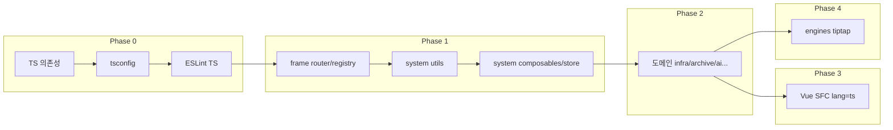

# NEXA 플랫폼 JS → TypeScript 전환 계획

## 1. 전환의 핵심 목적

- **인공지능 친화적 데이터 규격 통일**

  - 앞으로 AI 에이전트·코어·보조 도구가 플랫폼과 안정적으로 연동하려면, **일관된 데이터 규격**이 필요함. TypeScript + 스키마 기반 타입 정의는 “이 데이터는 어떤 형태인가”를 기계가 읽기 쉽게 명시함. API 응답, 폼 입력, store 상태 등이 동일한 규격으로 정리되면, AI가 코드·데이터 구조를 해석하고 수정·생성할 때 혼선이 줄어듦.

- **Zod 기반 보안·런타임 검증**
  - `src/system/schemas`에 이미 적용된 **Zod**를 활용해, 외부 입력(API 응답, 사용자 입력, 파일/업로드 메타데이터 등)에 대한 **런타임 검증**을 수행함. TS 타입만으로는 실행 시점의 악의적·변조된 데이터를 막을 수 없음. Zod 스키마로 검증하면 예상치 못한 형태의 데이터가 시스템 내부로 들어오는 것을 차단하고, 주입·오염 위험을 줄이는 보안 효과를 얻음.

---

## 2. 현재 상황 요약

| 구분                 | 수량     | 비고                                                                                                                         |
| -------------------- | -------- | ---------------------------------------------------------------------------------------------------------------------------- |
| **TS 파일**          | 67개     | `src/system/schemas`, `src/domains/archive/archive-sentinel`, `src/engines/services`, `src/domains/infra` store 등 일부만 TS |
| **JS 파일 (src)**    | 약 192개 | composables, store, utils, frame/router, engines/tiptap, 각 도메인                                                           |
| **JS 파일 (server)** | 27개     | Express API (routes, services, config, utils)                                                                                |
| **Vue SFC**          | 389개    | **모두 `<script>` (JS)** — `lang="ts"` 사용 파일 0개                                                                         |

**이미 TS인 영역**

- `src/system/schemas` — Zod 기반 스키마 (표준 데이터 계층). **서버·프론트 공용**으로 설계되며, Phase 5 서버 전환 시 서버도 동일 스키마를 참조함.
- `src/domains/archive/archive-sentinel` — 도메인 로직 전부 TS
- `src/engines/services` (evaluatorService, flowManager), `src/domains/infra` store/config, `vitest.config.ts`

**현재 설정**

- `tsconfig.json`: Quasar 상속, `allowJs: true`, `strict: false`, `noImplicitAny: false`, path alias 있음
- **package.json**: `typescript`, `vue-tsc`, `@types/*` **미설치**
- **ESLint**: JS/Vue만 대상, TypeScript parser/plugin 없음
- **Quasar/Vite**: 별도 TS 플러그인 없음 (Vite는 기본 TS 지원)

---

## 3. 전환으로 얻는 실제 긍정적 효과

- **버그 조기 발견**

  - 잘못된 프로퍼티 접근, 잘못된 인자 개수/타입, null/undefined 사용 오류를 **실행 전에** 컴파일 단계에서 잡을 수 있음. 런타임에서만 드러나던 오류가 IDE/빌드 시점으로 앞당겨짐.

- **리팩터링 안전성**

  - 함수 시그니처·스키마·API를 바꿀 때, 그 타입을 사용하는 모든 지점이 타입 체크로 한 번에 드러남. "이름만 바꿨는데 어디선가 아직 쓰고 있지 않을까" 하는 불안을 줄이고, 대규모 수정 시 회귀 버그를 줄이는 데 도움이 됨.

- **자동완성·탐색·문서화**

  - IDE에서 props, composable 반환값, store 상태, API 응답 형태까지 자동완성과 "정의로 이동"이 정확히 동작함. JSDoc 없이도 타입이 곧 문서 역할을 해, 신규 합류자나 오래된 코드를 파악하기 쉬워짐.

- **스키마와 프론트/서버 일치 (서버·프론트 동일 스키마 공유)**

  - `system/schemas`는 **서버와 프론트가 공유하는 유일한 데이터 규격**이다. API 응답·디바이스 상태·센서 데이터 등은 여기서 한 번만 정의하고, 서버는 검증·직렬화, 프론트는 검증 후 타입 보장된 값만 사용한다. "API는 이렇게 오는데 화면은 저렇게 기대하고" 같은 불일치를 제거하고, IoT 경계(엣지·서버·클라이언트) 전체에서 형식을 통일할 수 있음.

- **도메인 경계 명확화**

  - AGENTS 규칙의 "한 도메인만 수정" 원칙과 맞물려, 타입은 모두 `system/types/`에 두고 도메인은 import만 하므로 "이 도메인이 어떤 데이터 형태를 다루는가"가 import만 봐도 분명해짐. 다른 도메인 전용 타입을 잘못 참조하면 컴파일 단계에서 차단 가능.

- **유지보수 비용 감소**

  - 신규 기능 추가 시 "어디에 어떤 형태로 넣어야 하는지" 타입이 가이드해 주어, 실수와 디버깅 시간이 줄어듦. 특히 composables·store·API 레이어가 TS로 통일되면 데이터가 흐르는 경로가 타입으로 추적 가능해짐.

- **CI/품질 게이트 강화**

  - `vue-tsc --noEmit` 또는 빌드 시 타입 체크를 넣으면, PR 단계에서 타입 오류가 난 코드가 머지되는 것을 막을 수 있음. "실행은 되는데 나중에 터지는" 케이스를 줄이는 효과가 있음.

- **Zod 기반 보안·런타임 검증**
  - TS 타입은 컴파일 시점에만 검사되며, 런타임에 들어오는 악의적·변조된 데이터는 막지 못함. Zod 스키마는 **런타임 검증**을 수행하므로, API 응답·폼 제출·파일 메타데이터 등 외부 입력을 스키마로 검증한 뒤 타입이 보장된 값만 사용함. 이로써 주입 공격, 잘못된 구조의 JSON, 프로퍼티 누락/추가로 인한 오류를 사전에 차단할 수 있음.

---

## 4. 프로젝트 규칙 (타입·스키마·상수 배치)

리팩토링 및 TS 전환 시 다음을 준수함. **없는 폴더는 전환 시작 전에 먼저 생성**함.

| 구분       | 위치                              | 비고                                       |
| ---------- | --------------------------------- | ------------------------------------------ |
| **타입**   | `src/system/types/` 에만 생성     | 도메인 내부 `types.ts` 생성 금지           |
| **스키마** | `src/system/schemas/` 에만 생성   | 도메인 내부 `schema.ts` 생성 금지          |
| **상수**   | `src/system/constants/` 에만 생성 | 도메인 전용 상수도 system에 정의 후 import |

- **domains/** 안에 `types.ts`, `schema.ts` (또는 `schemas.ts`) 생성 **금지**.
- 새 타입이 필요하면 반드시 **system에 먼저 추가한 뒤** 사용. 도메인에서는 `@system/types` 등으로만 참조.

**폴더 현황**: `system/schemas/` 는 이미 있음. `system/types/`, `system/constants/` 는 없으므로 Phase 0에서 생성.

### 서버·프론트 스키마·타입 공유 전략 (IoT 플랫폼 핵심)

- **`system/schemas`·`system/types`는 프론트 전용이 아니다.** 서버(Express API, MQTT/디바이스 경계)와 프론트(API 클라이언트, store, 폼)가 **동일한 스키마·타입을 공유**하는 것이 설계 원칙이다.
- **단일 출처(Single Source of Truth)**: API 요청/응답, 디바이스 상태, 센서 데이터, 파일 메타데이터 등 **경계를 넘는 모든 데이터**는 `system/schemas`에 Zod 스키마로 한 번만 정의하고, `system/types`에서 타입을 re-export한다. 서버는 응답 직전에 스키마로 검증·직렬화하고, 프론트는 수신 후 스키마로 검증한 뒤 타입이 보장된 값만 사용한다.
- **이점**: IoT 플랫폼에서는 엣지·서버·프론트 간 데이터 형식이 어긋나면 디바이스 제어·모니터링 오류로 직결된다. 서버와 프론트가 같은 스키마를 참조하면 "서버는 이렇게 보내는데 클라이언트는 저렇게 기대하는" 불일치를 제거하고, 런타임 검증을 한 곳에서만 유지할 수 있다.
- **서버 전환 시(Phase 5)**: 서버 코드는 **반드시** `src/system/schemas`, `src/system/types`를 참조한다. 서버 전용 스키마/타입 파일을 `server/` 하위에 새로 두지 않는다. (path alias 또는 상대 경로로 `src` 의 system 계층 참조.)

---

## 5. 전환 원칙 (AGENTS 규칙 준수)

- **한 번에 한 도메인만** 전환 (도메인 간 교차 수정 금지)
- **No-Touch 영역** (`/src/system/`, `/src/frame/`, `/src/engines/`)은 "구조/계약" 변경 없이 파일 확장자·타입 추가만 진행
- 기존 **스키마/계약**은 유지; 타입·스키마·상수는 위 **프로젝트 규칙**에 따라 `system/types`, `system/schemas`, `system/constants` 에만 두고, 도메인은 참조만 함
- 되돌리기 쉬우도록 **점진적 전환** (allowJs 유지 후 단계적으로 strict 강화)

### 롤백 기준

전환 중 아래 조건에 해당하면 **즉시 롤백**하고, 원인 분석·논의 후 재시도한다.

| 조건                                            | 조치                                                                                                                                                                                                                                                             |
| ----------------------------------------------- | ---------------------------------------------------------------------------------------------------------------------------------------------------------------------------------------------------------------------------------------------------------------- |
| **빌드 실패**                                   | 해당 변경 파일만 즉시 `.ts` → `.js` (및 Vue는 `lang="ts"` 제거) 로 되돌린다. 다른 파일은 그대로 두고, 실패한 파일만 JS로 복원한 뒤 빌드가 통과하는지 확인한다.                                                                                                   |
| **타입 오류 10개 이상** (해당 도메인/레이어 내) | 해당 **도메인(또는 해당 Phase 단위) 전환을 보류**한다. 이미 변경한 파일은 유지하되, 추가 전환은 중단하고 오류 원인을 분석한 뒤 팀 논의를 거쳐 재시도 일정과 범위를 정한다. 한꺼번에 많은 파일을 바꾸지 말고, 오류가 10개 미만으로 줄어든 뒤에만 전환을 이어간다. |
| **기존 단위 테스트 실패**                       | 해당 전환으로 인한 회귀로 판단되면, 원인 파일만 롤백하거나 테스트/타입을 수정한다. 테스트가 통과할 때까지 해당 영역 전환을 확장하지 않는다.                                                                                                                      |

- 롤백 시 **커밋 단위**를 작게 유지해 두면, "해당 파일만 되돌리기"가 쉽다. 한 번에 여러 파일을 TS로 바꾼 뒤 한꺼번에 커밋하지 말고, 파일 단위 또는 소규모 묶음으로 커밋하는 것을 권장한다.

---

## 6. 전환 단계

### Phase 0: 환경 준비 (선행 작업)

- **없는 폴더 생성 (우선)**
  - `src/system/types/` — 타입 정의 전용 (필요 시 `index.ts` 등으로 export)
  - `src/system/constants/` — 상수 전용 (`schemas/` 는 이미 존재)
- **공통 타입 뼈대 먼저 정의**
  - 전 도메인·서버-프론트 공통으로 쓸 타입을 `system/types/`(및 필요 시 `system/schemas/`)에 우선 정의한다.
  - 예: `ApiResponse<T>`, `DeviceStatus`, `SensorData`, `PaginationResult`, `FileMeta` 등 — API 응답 래퍼, 디바이스/센서 규격, 목록 페이징, 파일 메타데이터 등. 서버와 프론트가 동일한 타입/스키마를 import하여 사용하는 기반을 Phase 0에서 마련한다.
- **의존성 추가**
  - `typescript`, `vue-tsc` (dev)
  - 필요 시 `@types/node`, `@typescript-eslint/parser`, `@typescript-eslint/eslint-plugin`
- **tsconfig 정비**
  - `allowJs: true` 유지 (점진 전환용)
  - `strict`/`noImplicitAny`는 초기엔 `false` 유지, 전환 안정화 후 단계적 켜기
  - `include`에 `server/**/*.ts` 추가는 **서버 TS 전환 시점**에
- **ESLint**
  - TypeScript 파서/플러그인 추가, `*.ts`, `*.vue` (script lang=ts) 린트
- **빌드/스크립트**
  - `quasar build` 동작 확인 (Quasar는 Vite 기반이라 TS 기본 지원)
  - 필요 시 `vue-tsc --noEmit`을 CI/린트 스크립트에 추가

### Phase 1: 프레임/시스템 공통 (진입점·의존성 적은 쪽부터)

- **우선 전환 후보 (의존 관계 하단)**
  - `src/frame/router`: `routes.js`, `domainRoutes.js` → `.ts`
  - `src/frame/registry`: `domainRegistry.js` → `.ts`
  - `src/system/utils`: `apiBaseUrl.js`, `clipboard.js` 등 단순 유틸 → `.ts`
  - `src/system/composables`: 이미 TS인 `useEventBus`, `useSidebarGesture` 등과 맞닿은 JS composable부터 (예: `useFileSelection.js`, `useThemeManager.js`)
- **Store**
  - 이미 TS인 `nexaNodeStore.ts`, `infraStore`를 참조하는 JS store부터 전환 (예: `userSettingsStore.js`, `devGuideStore.js`)
- 규칙: **한 번에 한 레이어/한 묶음**만 수정하고, 빌드·테스트로 회귀 방지

### Phase 2: 도메인별 전환 (한 도메인씩)

- **순서 제안**: 의존성이 적고 이미 TS가 있는 도메인부터
  1. **infra** — 이미 store/config TS 있음 → 나머지 JS만 전환
  2. **archive** — sentinel은 전부 TS, 나머지(services, store, components) JS → TS
  3. **ai** — composables, services, config 많음 → 한 번에 하나의 하위 영역씩
  4. **dev** — document-manager, dev-tools 등 모듈 단위로
  5. **parts**, **board**, **erp**, **settings**, **panel**, **node**, **기타** — 동일하게 도메인 내부만, 한 번에 한 도메인
- 각 도메인 전환 시 해당 도메인 **Vue의 `<script>` → `<script lang="ts">`** 도 함께 진행해도 됨 (도메인 단위로만)

### Phase 3: Vue SFC 전환

- **389개 Vue** 모두 현재 `<script>` (JS)
- 전략: **도메인/폴더 단위**로 `<script lang="ts">` 변경 + 필요한 타입만 추가 (props, emit, ref 등)
- 컴포넌트 타입은 가능하면 `src/system/schemas`(Zod 추론 타입) 및 `src/system/types/`의 기존 타입을 재사용한다. **도메인 전용 타입이 필요하면 도메인 내부가 아닌 `system/types/`에 추가한 뒤, 해당 도메인에서만 import하여 사용한다.** (AGENTS 규칙: 타입·스키마·상수는 system에만 정의, 도메인 내부 types.ts 생성 금지)

### Phase 4: Engines (Tiptap 등)

- `src/engines/tiptap`: `baseExtensions.js`, `fileFormat.js`, `youtube.js`, `clipboardImage.js` 등 → TS
- No-Touch 영역이므로 **내부 구현만 TS로 전환**, 외부 노출 API/계약은 유지

### Phase 5: Server (선택·별도 스프린트)

- **27개 JS**: Express 앱, routes, services, config
- 서버 전용 `tsconfig.json` (또는 root include에 `server`) 및 `ts-node`/`esbuild` 등 실행 설정 필요
- **스키마·타입 공유 (필수)**: 서버는 **반드시** `src/system/schemas`, `src/system/types`를 참조한다. DB 조회 결과 직렬화, API 응답 형식, 디바이스/센서 페이로드는 이 스키마로 검증·타입을 맞춘다. 서버 전용 `schemas/` 또는 `types/`를 `server/` 하위에 두지 않는다. (path alias로 `@system/schemas`, `@system/types` 또는 상대 경로로 `src` 의 system 계층 참조.)
- DB/설정 관련 타입이 없으면 `system/types/` 또는 `system/schemas/`에 추가한 뒤 서버·프론트에서 공통 import

---

## 7. 의존성·전환 순서 개요

- **frame** → **system** 순으로 하면, 도메인 전환 시 import 오류를 줄일 수 있음.
- **Vue** 전환은 해당 도메인 JS 전환이 끝난 뒤에 하면, composable/store 타입을 그대로 활용 가능.

---

## 8. 전환 전략: Re-export 제거 환경 → 확장자 정리 → TS 최적화

**목표**: re-export .js를 영구 정책으로 두지 않고, “re-export 없이 동작하는 환경”을 만든 뒤 **확장자 일괄 정리**만 하고, 이후 에너지는 **TS 최적화**에만 쓰는 흐름.

### 8.0 권장 흐름 (3단계)

1. **Re-export 없이 작동하는 환경 조성**
   - **Vite 설정** (`quasar.config.js` → `extendViteConf`): `viteConf.resolve.extensions = ['.ts', '.tsx', '.mjs', '.js', '.mts', '.jsx', '.json']` 등으로 `.ts`를 `.js`보다 앞에 두면, 확장자 없는 import가 `.ts`를 우선 해석함.
   - **선택 A**: 전체 코드베이스에서 `from '…/foo.js'` 형태를 `from '…/foo'`로 **일괄 치환** (권장). 이후 re-export .js 삭제 시 404 없음. (현재 src 내 `.js` 확장자 명시 import가 다수 있으므로, 치환 후 빌드/실행으로 검증.)
   - **선택 B**: Vite 플러그인으로 `xxx.js` 요청 시 해당 .js 파일이 없으면 `xxx.ts`를 주는 fallback. (선택 A가 부담되면 검토.)
2. **확장자 일괄 정리**
   - 이미 구현이 .ts인 모듈에 대해 re-export용 .js 파일을 **한 번에 삭제**.
   - 새로 전환할 때는 “기존 .js 삭제 + .ts만 두기”, re-export .js는 추가하지 않음.
3. **이후: TS 최적화에만 에너지**
   - 전환 작업 = “복사해서 .ts로 바꾸고 타입만 붙이기”가 아니라, **한 모듈씩** system 타입 정리·strict 강화·Zod 검증 등 **TS에 맞게 최적화**하는 쪽에 집중.

이렇게 하면 re-export .js 유지 비용이 사라지고, 확장자 정리는 1회성으로 끝내고, 이후에는 품질(타입·검증·리팩터링) 개선에만 쓸 수 있음.

### 8.1 작업 시 주의사항

- **import 경로**: 가능한 한 **확장자 없음** (`./foo`). re-export 제거 환경에서는 `.ts`가 자동 해석됨.
- **타입/스키마/상수**: `system/types`, `system/schemas`, `system/constants` 에만 정의하고, 도메인은 참조만 함.
- **strict 켜기**: 전 구역 전환·정리 후 단계적으로 적용.
- **AGENTS 규칙**: system/frame/engines는 계약 변경 없이 타입·확장자만 추가. 도메인은 한 번에 하나만 수정.

### 8.2 Re-export .js 현황 (과거 전환분, 환경 조성 후 제거 대상)

- **역할**: 과거에 `.ts`로 전환한 뒤 Vite/캐시가 `.js` URL로 요청해 404가 나서 둔 **임시 호환용** re-export .js.
- **현재 유지 중인 re-export .js** (실제 구현은 .ts, .js는 re-export만):
  - system: `apiBaseUrl.js`, `clipboard.js`, `useFileSelection.js`, `useThemeManager.js`, `userSettingsStore.js`, `dashboardLayoutStore.js`, `boardMenuStore.js`, `devGuideStore.js`
  - frame: `domainRegistry.js`
  - 도메인: panel `panelTypes.js`, ai `aiApi.js`, archive `archiveApi.js`, erp `erpStore.js`, settings `settingsStore.js`, parts(config·menuItems·contextMenu·viewModeSettings·partClassesFields·partClassesMenuConfig), dev(mermaidStyles·recentColorsManager·favoriteColorsManager·themeFileAnalyzer·themeVariableManager·mermaidStyleStorage·documentStorage) 등.
- **제거 절차**: §8.0 1단계(환경 조성) 완료 후, import에서 `.js` 확장자 제거한 뒤 위 re-export .js 파일들을 삭제. `node_modules/.vite` 삭제 + 서버 재시작 + 강력 새로고침으로 404 여부 확인.

---

## 9. 성공 기준

- 모든 신규 코드는 `.ts` 또는 Vue `<script lang="ts">`만 사용
- `quasar build` 성공
- 기존 단위 테스트 통과 (Vitest)
- ESLint + (선택) `vue-tsc --noEmit` 통과
- 가능한 범위에서 `strict`/`noImplicitAny` 활성화

---

이 계획대로 Phase 0부터 순서대로 진행하면, 플랫폼을 무리 없이 "앞으로 TypeScript만 사용"하는 상태로 가져갈 수 있습니다.
