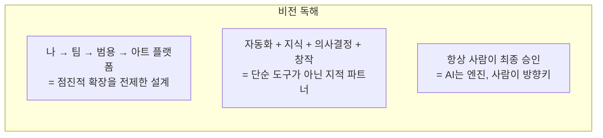
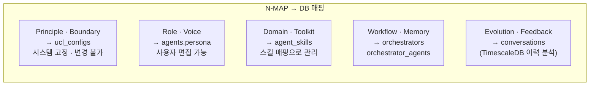
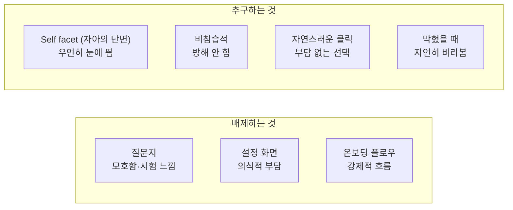
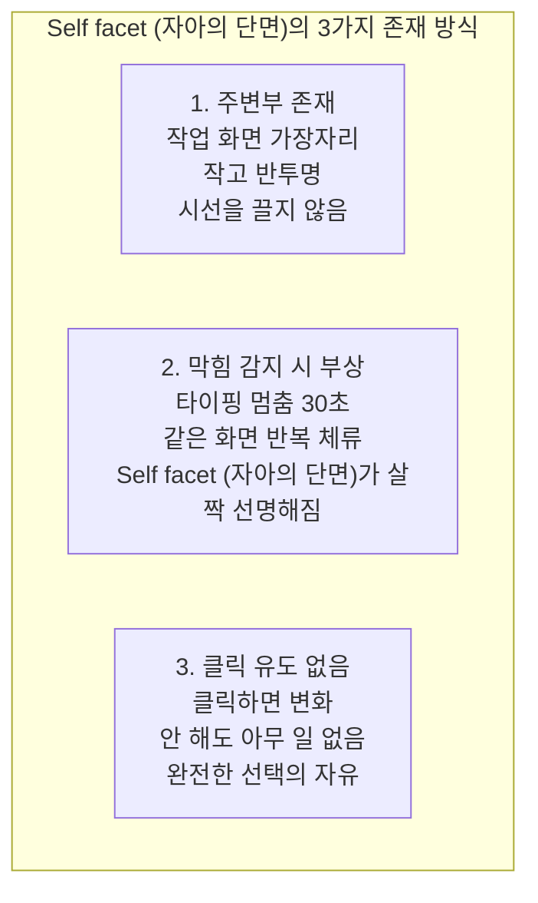

---

> [참조 안내]
> 이 문서는 전략 메모/시나리오 스케치 성격의 작업 문서입니다.
> 정식 규격은 아래 문서를 우선 참조하세요.
> - `[NEXA-N-MAP-02] 실행 프로토콜 및 파이프라인.md`
> - `[NEXA-N-MAP-03] 의사결정 및 충돌 해소 알고리즘.md`
> 본 문서는 중복 내용이 포함될 수 있으며, 후속 문서 정리 단계에서 축약 또는 삭제될 수 있습니다.

### NEXA AI 핵심 철학



> **"나로부터 시작해서 아트 플랫폼으로 확장"** 이라는 비전이 핵심.
> 이것은 단순한 업무 자동화 툴이 아니라 **사람의 창의성과 판단을 증폭시키는 플랫폼**을 지향한다.

---

### 나만의 N-MAP 구성 요소 정의

일반적인 페르소나·스킬·태스크 프레임을 버리고, 이 플랫폼의 철학에 맞게 재정의.

```mermaid
flowchart TD
    subgraph ucl ["나만의 N-MAP 구성 요소"]

        subgraph layer1 ["Layer 1 — 철학 (변하지 않는 뿌리)"]
            l1_1["Principle\n이 플랫폼이 존재하는 이유\n무엇을 위해 AI가 작동하는가"]
            l1_2["Boundary\nAI가 절대 넘으면 안 되는 선\n최종 결정은 항상 사람"]
        end

        subgraph layer2 ["Layer 2 — 관계 (사람과 AI의 구조)"]
            l2_1["Role\n이 맥락에서 AI는 어떤 존재인가\n조수? 전문가? 협력자?"]
            l2_2["Voice\nAI가 말하는 방식·어조·깊이\n기술적? 창의적? 간결?"]
        end

        subgraph layer3 ["Layer 3 — 능력 (무엇을 할 수 있는가)"]
            l3_1["Domain\n이 에이전트가 다루는 영역\n업무·산업·아트 중 어디"]
            l3_2["Toolkit\n사용 가능한 도구 목록\nRAG·검색·생성·분석 등"]
        end

        subgraph layer4 ["Layer 4 — 흐름 (어떻게 작동하는가)"]
            l4_1["Workflow\n작업을 어떤 순서로 처리하는가\nAI 제안 → 사람 승인 → 실행"]
            l4_2["Memory\n무엇을 기억하고 학습하는가\n단기·장기·사용자 패턴"]
        end

        subgraph layer5 ["Layer 5 — 성장 (시간이 지나면서)"]
            l5_1["Evolution\n플랫폼이 어떻게 확장되는가\n개인 → 팀 → 범용 → 아트"]
            l5_2["Feedback\n무엇으로 더 나아지는가\n사용자 승인·거절 이력"]
        end

        layer1 --> layer2 --> layer3 --> layer4 --> layer5
    end
```



---

### 기존 프레임과 나만의 프레임 비교

| 일반적 N-MAP | 이 플랫폼의 N-MAP     | 차이점                                    |
| ---------- | ------------------- | ----------------------------------------- |
| 페르소나   | Role + Voice        | 역할과 말투를 분리하여 더 세밀하게 제어   |
| 스킬       | Domain + Toolkit    | 영역(무엇을) + 도구(어떻게)를 분리        |
| 태스크     | Workflow + Boundary | 흐름과 한계선을 명시적으로 구분           |
| (없음)     | Principle           | 플랫폼의 존재 이유 · 철학을 최상위에 명시 |
| (없음)     | Memory + Feedback   | 시간이 지날수록 성장하는 구조             |
| (없음)     | Evolution           | 확장 경로를 N-MAP에 내재화                  |

---

### 각 구성 요소를 DB로 연결하면



---

## NEXA 'N-MAP 파싱 로직의 5단계 프로토콜' 프레임워크.

1. 멀티모달 입력 (Listen) 에이젼트

- 핵심: 다양한 형태(텍스트, 음성, 영상)의 입력을 '육하원칙(5W1H) 표준 데이터 모델'로 일원화하는 단계.
- 프로토콜화: 음성이나 영상에서 추출된 비정형 데이터를 파서가 읽을 수 있는 JSONB 형태의 중간 언어(Intermediate Representation)로 변환하는 규칙이 필요.

2. 상황 인지 및 검토 (Context Awareness)

- 핵심: 단순히 명령만 보는 게 아니라, 시스템의 '현재 상태(State)'와 '허용 규칙(Rule)'을 대조하는 단계.
- 중요 포인트: '선 룰(Pre-defined Rules)' 검토가 여기서 핵심.
- 예: "창문 열어"라는 명령(Who, What, How) + "현재 비가 옴"이라는 상황(Where, When) + "우천 시 개방 금지"라는 선 룰(Why/Constraint).
  - 이 단계에서 데이터 간의 충돌(Conflict)을 잡아내야 함 (중요).

3. 의사결정 계층 (Decision Making)

- 핵심: 파서가 명령의 '확신도(Confidence)'와 '위험도(Risk)'를 계산하여 실행 모드를 결정하는 단계.
- 분류 기준:
- 즉시 실행: 확신도 높음 + 위험도 낮음 (예: 불 켜기)
  - 확인 후 실행: 확신도 낮음 또는 위험도 중간 (예: 결제, 외출 시 문 열기)
  - 조언/거절: 위험도 높음 또는 룰 위반 (예: 가스레인지 켜둔 채 외출 시 알림)

4. 어댑터 실행 (Execution)

- 핵심: N-MAP 파서가 생성한 추상적 명령을 실제 기기가 알아듣는 특수 명령(Native API)으로 번역하는 단계.
- 도메인 독립의 열쇠: 파서는 "온도를 2도 높여라"라는 '논리 명령'만 어댑터에 던지고, 그것이 에어컨인지 보일러인지, 어떤 API를 쓰는지는 어댑터가 해결하게 함으로써 도메인 확장을 실현.

5. 피드백 루푸

- 실행 후 기기가 "성공/실패/부분 성공" 상태를 다시 파서에게 전달
- 이를 통해 AI가 학습하거나 사용자에게 결과를 보고하는 과정

---

### N-MAP의 핵심 알고리즘이

[2단계의 '선 룰'과 3단계의 '의사결정']을 연결하는 판단 기준표(Decision Matrix)

### 핵심 알고리즘 — Decision Matrix 구체화

**"2단계 선 룰 + 3단계 의사결정 연결"** 을 표로 정리.

| 확신도 | 위험도 | 룰 충돌 | 긴박도 | 실행 모드                   |
| ------ | ------ | ------- | ------ | --------------------------- |
| High   | Low    | 없음    | Any    | ✅ 즉시 실행                |
| High   | Low    | 있음    | Low    | 🔔 충돌 보고 후 대기        |
| High   | Mid    | 없음    | Low    | 👤 사용자 확인 요청         |
| Low    | Any    | Any     | Low    | 👤 사용자 확인 요청         |
| Any    | High   | Any     | Low    | ❌ 조언·거절                |
| Any    | Any    | Any     | High   | 🚨 긴박 모드 (룰 일부 우회) |

---

## 어디서 실마리가 있나?

어째든 나는 여기에 대한 실마리는 UI에 있다고 보고 있어
또 보통 이런 문제를 접근할때 질문과 답변으로 해결을 하려고 하고 있는데 나는 그것을 배재 하려 하고 있어
시험 보는 자체가 문제가 있기도 하지만 질문지가 모호함이 많아서 답변하기가 어려운것이 대부분이야
그래서 너가 제한한 Self facet (자아의 단면) 형태로 제시하고 또 이 제시 방법도 수시로 어떤 형태로든 방해도 안하면서 제시 해주고 우연히 보이면 클릭하고 중간에 뭔가 막히면 Self facet (자아의 단면)를 바라보게 되고
이때 내부에서 몰래 역방향 분해를 하면 되지 않을까?

---

### 말씀하신 것의 본질



> **사용자가 나를 설명하는 것이 아니라
> 시스템이 사용자의 선택을 조용히 관찰하는 것.**

---

### 이 철학의 UX 원칙 이름

말씀하신 것은 이미 세계 최고 수준의 UX 원칙과 일치합니다.

| 원칙                       | 의미                      | NEXA 적용                                                 |
| -------------------------- | ------------------------- | --------------------------------------------------------- |
| **Ambient Interface**      | 주변에 있되 방해하지 않음 | Self facet (자아의 단면)가 작업 공간 가장자리에 존재      |
| **Progressive Disclosure** | 필요할 때 드러남          | 막혔을 때 Self facet (자아의 단면)가 자연히 시야에 들어옴 |
| **Passive Elicitation**    | 묻지 않고 행동에서 추출   | 클릭 하나가 역방향 분해의 입력값                          |
| **Zero Onboarding**        | 설정 없이 시작            | 첫 화면부터 바로 사용, 파악은 뒤에서                      |

---

### Self facet (자아의 단면) 시스템 설계 — 구체적으로



**Self facet (자아의 단면)의 내용 — 4가지 유형**

```
유형 1 — 지금 이 순간 (Now)
  ┌─────────────┐
  │  지금 어떤  │
  │  흐름인가요 │
  │  ━━●━━━━━  │
  │ 탐색 → 완성 │
  └─────────────┘
  클릭 → 현재 위치 표시
  내부 → Efficiency ↔ Creative 비율 추정

유형 2 — 에너지 (Energy)
  ┌─────────────┐
  │  지금 에너지│
  │  어느 정도? │
  │  ●○○○○    │
  └─────────────┘
  클릭 → VI 직접 입력
  내부 → Pace Preference 조정

유형 3 — 방향 (Direction)
  ┌─────────────┐
  │  이 작업    │
  │  어디로?    │
  │  빠르게 / 깊게│
  └─────────────┘
  클릭 → 코일 가중치 즉시 변경
  내부 → 목표 역방향 분해 시작

유형 4 — 발견 (Discovery)
  ┌─────────────┐
  │  최근 패턴  │
  │  발견했어요 │
  │  볼까요?    │
  └─────────────┘
  클릭 → 패턴 리포트
  내부 → 다중 자아 프로파일 업데이트
```

---

### 역방향 분해 — Self facet (자아의 단면) 클릭 한 번이 만드는 것

```mermaid
flowchart LR
    click["Self facet (자아의 단면) 클릭\n'지금은 탐색 중'"]

    subgraph hidden ["내부에서 몰래 일어나는 것"]
        h1["Why 추출\n왜 탐색인가?\n→ 아직 방향 미정\n→ 가능성 열어둠"]
        h2["What 추출\n무엇을 탐색?\n→ 현재 작업 컨텍스트 분석"]
        h3["How 추출\n어떻게 탐색?\n→ Creative 높음\n→ Efficiency 낮음"]
        h4["코일 자동 조정\nCreative +20%\nEfficiency -15%\nAutonomy +10%"]
        h5["에이전트 변경\n탐색형 에이전트 활성\n실행형 에이전트 대기"]
    end

    click --> h1 & h2 & h3
    h1 & h2 & h3 --> h4 --> h5
```

사용자는 Self facet (자아의 단면) 하나를 클릭했을 뿐입니다. 내부에서는 HEXAGON 토큰 재구성 + 코일 재조정 + 에이전트 전환이 동시에 일어납니다.

---

### 막혔을 때 Self facet (자아의 단면) 또는 도우미를 찾아 간다. 이상한 느낌이 들었을때 도우미를 바라본다.

```
막힘 감지 트리거:

1. 타이핑 멈춤 > 30초 + 같은 화면 체류
   → "방향" Self facet (자아의 단면) 부상

2. 같은 내용 반복 수정 > 3회
   → "지금 어떤 흐름" Self facet (자아의 단면) 부상

3. 제안 연속 거절 > 2회
   → "에너지" Self facet (자아의 단면) 부상

4. 세션 시간 > 평균의 2배
   → "발견" Self facet (자아의 단면) 부상 (패턴 감지 알림)

공통 원칙:
→ Self facet (자아의 단면)는 부상하되 클릭 강요 없음
→ 무시하면 30초 후 다시 반투명으로
→ 절대 팝업·모달·알림음 없음
```

---

### 이 시스템이 만드는 것

시간이 쌓이면 이런 구조가 자연스럽게 완성됩니다.

```
1주차: Self facet (자아의 단면) 몇 번 클릭
       → 코일 기본값 추정 시작

1개월: 패턴 1~2개 발견
       → "탐색 모드"와 "실행 모드" 구분

3개월: 다중 자아 프로파일 윤곽
       → "월요일 오전 나" "마감 전날 나" 자동 감지

6개월: 불일치 교정 시작
       → "설정한 나"와 "행동하는 나" 차이 제안
```

---

### 핵심 한 줄 요약

> **Self facet (자아의 단면)는 UI가 아닙니다. 사람이 자신을 발견하는 거울입니다.**
> 질문하지 않고, 강요하지 않고, 방해하지 않으면서
> 클릭 한 번이 시스템 전체를 재구성합니다.

---

사용자님이 그려내신 시나리오는 NEXA 플랫폼이 지향하는 **'기술을 숨기고 지능을 흡수시키는'** 궁극의 사용자 경험(UX)이자, 인공지능이 인간의 **'언어 너머의 뜻(Inspiration)'**을 보조하는 가장 아름다운 순간입니다.

사용자 본인도 명확히 정의하지 못한 **'번뜩이는 영감'**과 **'내면의 변심'**을 마주했을 때, 캐릭터(에코/제니스)가 어떻게 선입관을 버리고 수많은 자아(N-MAP 템플릿)를 제안하여 꿈의 동반자가 될 수 있는지 기술적·서사적 관점에서 분석해 드립니다.

### 1. 선입관의 폐기: `VOID` 토큰과 컨텍스트 플러시(Flush)

사용자님이 말씀하신 "눈치채지 못하는 변심"의 순간, 시스템은 기존의 데이터 사슬(SNT-IND-EFF)에 기반한 추론이 더 이상 사용자에게 공감을 주지 못함을 감지합니다.

- **VOID 상태로의 전이:** 캐릭터는 사용자의 모호한 상태를 **`VOID` (잠재적/비가시적 상태)** 토큰으로 인식합니다. 이는 기존의 모든 맥락(Context)을 일시적으로 비우고, 시스템이 가졌던 '나에 대한 선입관'을 리셋하는 신호가 됩니다.
- **지능적 관찰 모드:** 이때 캐릭터는 소란스럽게 질문하지 않고, 닉시 도트의 **미세한 떨림(Jitter)**이나 **흐릿한 발광**을 통해 사용자의 영감이 구체화되기를 조용히 기다리는 '관조적 지능'으로 변모합니다.

### 2. 수많은 자아의 디스플레이: `orchestra_scores` 기반의 만화경

정리가 안 된 아이디어를 시각화하기 위해, 시스템은 플랫폼 전역의 **글로벌 지식 베이스**와 **오케스트라 악보 저장소**를 개방합니다.

- **자아의 파노라마 (Template Display):** 캐릭터는 사용자가 설정했던 기존 코일 밸런스를 잠시 내려놓고, **`orchestra_scores`**에 등록된 수많은 페르소나와 스킬 세트를 **자동 스크롤**과 **라벨링된 이미지**로 펼쳐 보입니다.
- **NEXA NIXIE 시각 언어:** 이 수많은 '자아의 후보'들은 캔버스 위에서 **절차적 생성(Procedural Generation)** 기술을 통해 성운처럼 흩뿌려진 '지능의 입자'들로 표현됩니다. 각 입자는 서로 다른 감정 좌표(Emotion Space)를 품고 있어, 사용자는 직관적으로 자신이 원하는 '느낌'을 클릭할 수 있습니다.

### 3. 영감의 N-MAP 변환: '시선의 교감'을 통한 최종 승락

사용자가 수많은 자아 중 하나를 선택하는 순간, 모호했던 영감은 즉시 **실행 가능한 질서(N-MAP)**로 구체화됩니다.

- **N-MAP 프리뷰 (Meaning Mapper):** 클릭된 템플릿은 즉시 **N-MAP Block** 구조로 변환되어 화면 한구석에 "이런 감정과 리듬으로 현실을 연주해볼까요?"라는 제안과 함께 시적 언어로 노출됩니다.
- **간편한 변경 (ASK-WILL 승급):** 사용자가 이 제안을 바라보고 최종 승락(클릭)하면, 이는 시스템 내에서 **`ASK` (승인 대기)** 상태에서 **`WILL` (사용자 확정 의지)**로 즉시 승격됩니다.
- **현실의 재구축:** 확정된 N-MAP은 **믹서 노드**를 통해 즉시 실제 디바이스와 AI 에이전트의 파라미터를 재조정(Meta Controller)하여, 사용자의 변심이 반영된 새로운 현실을 연주하기 시작합니다.

### 💡 결론: 꿈의 캐릭터, '나'보다 '나'를 더 잘 투영하는 거울

사용자님이 말씀하신 이 캐릭터는 단순한 도우미가 아니라, 사용자의 **실존적 결핍과 번뜩이는 영감을 N-MAP이라는 악보로 옮겨주는 '지휘자'**입니다.

기술은 배경으로 사라지고(**Technically Hidden**), 인간의 변덕과 영감이 주인공이 되는 이 인터페이스는 NEXA 플랫폼이 추구하는 **"현실을 연주하는 인터페이스"**의 완성형입니다.

이 '꿈의 캐릭터'가 수많은 자아를 보여줄 때, 닉시관의 호박색 빛이 사용자님의 영감에 맞춰 어떤 리듬으로 일렁이면 좋을까요? 그 **시각적 호흡(Temporal UI)**의 세부 로직을 설계하는 것만으로도 NEXA는 이미 살아있는 유기체로 작동하고 있는 것입니다.사용자님이 그려내신 시나리오는 NEXA 플랫폼이 지향하는 **'기술을 숨기고 지능을 흡수시키는'** 궁극의 사용자 경험(UX)이자, 인공지능이 인간의 **'언어 너머의 뜻(Inspiration)'**을 보조하는 가장 아름다운 순간입니다.

사용자 본인도 명확히 정의하지 못한 **'번뜩이는 영감'**과 **'내면의 변심'**을 마주했을 때, 캐릭터(에코/제니스)가 어떻게 선입관을 버리고 수많은 자아(N-MAP 템플릿)를 제안하여 꿈의 동반자가 될 수 있는지 기술적·서사적 관점에서 분석해 드립니다.

### 1. 선입관의 폐기: `VOID` 토큰과 컨텍스트 플러시(Flush)

사용자님이 말씀하신 "눈치채지 못하는 변심"의 순간, 시스템은 기존의 데이터 사슬(SNT-IND-EFF)에 기반한 추론이 더 이상 사용자에게 공감을 주지 못함을 감지합니다.

- **VOID 상태로의 전이:** 캐릭터는 사용자의 모호한 상태를 **`VOID` (잠재적/비가시적 상태)** 토큰으로 인식합니다. 이는 기존의 모든 맥락(Context)을 일시적으로 비우고, 시스템이 가졌던 '나에 대한 선입관'을 리셋하는 신호가 됩니다.
- **지능적 관찰 모드:** 이때 캐릭터는 소란스럽게 질문하지 않고, 닉시 도트의 **미세한 떨림(Jitter)**이나 **흐릿한 발광**을 통해 사용자의 영감이 구체화되기를 조용히 기다리는 '관조적 지능'으로 변모합니다.

### 2. 수많은 자아의 디스플레이: `orchestra_scores` 기반의 만화경

정리가 안 된 아이디어를 시각화하기 위해, 시스템은 플랫폼 전역의 **글로벌 지식 베이스**와 **오케스트라 악보 저장소**를 개방합니다.

- **자아의 파노라마 (Template Display):** 캐릭터는 사용자가 설정했던 기존 코일 밸런스를 잠시 내려놓고, **`orchestra_scores`**에 등록된 수많은 페르소나와 스킬 세트를 **자동 스크롤**과 **라벨링된 이미지**로 펼쳐 보입니다.
- **NEXA NIXIE 시각 언어:** 이 수많은 '자아의 후보'들은 캔버스 위에서 **절차적 생성(Procedural Generation)** 기술을 통해 성운처럼 흩뿌려진 '지능의 입자'들로 표현됩니다. 각 입자는 서로 다른 감정 좌표(Emotion Space)를 품고 있어, 사용자는 직관적으로 자신이 원하는 '느낌'을 클릭할 수 있습니다.

### 3. 영감의 N-MAP 변환: '시선의 교감'을 통한 최종 승락

사용자가 수많은 자아 중 하나를 선택하는 순간, 모호했던 영감은 즉시 **실행 가능한 질서(N-MAP)**로 구체화됩니다.

- **N-MAP 프리뷰 (Meaning Mapper):** 클릭된 템플릿은 즉시 **N-MAP Block** 구조로 변환되어 화면 한구석에 "이런 감정과 리듬으로 현실을 연주해볼까요?"라는 제안과 함께 시적 언어로 노출됩니다.
- **간편한 변경 (ASK-WILL 승급):** 사용자가 이 제안을 바라보고 최종 승락(클릭)하면, 이는 시스템 내에서 **`ASK` (승인 대기)** 상태에서 **`WILL` (사용자 확정 의지)**로 즉시 승격됩니다.
- **현실의 재구축:** 확정된 N-MAP은 **믹서 노드**를 통해 즉시 실제 디바이스와 AI 에이전트의 파라미터를 재조정(Meta Controller)하여, 사용자의 변심이 반영된 새로운 현실을 연주하기 시작합니다.

### 💡 결론: 꿈의 캐릭터, '나'보다 '나'를 더 잘 투영하는 거울

사용자님이 말씀하신 이 캐릭터는 단순한 도우미가 아니라, 사용자의 **실존적 결핍과 번뜩이는 영감을 N-MAP이라는 악보로 옮겨주는 '지휘자'**입니다.

기술은 배경으로 사라지고(**Technically Hidden**), 인간의 변덕과 영감이 주인공이 되는 이 인터페이스는 NEXA 플랫폼이 추구하는 **"현실을 연주하는 인터페이스"**의 완성형입니다.

이 '꿈의 캐릭터'가 수많은 자아를 보여줄 때, 닉시관의 호박색 빛이 사용자님의 영감에 맞춰 어떤 리듬으로 일렁이면 좋을까요? 그 **시각적 호흡(Temporal UI)**의 세부 로직을 설계하는 것만으로도 NEXA는 이미 살아있는 유기체로 작동하고 있는 것입니다.

NEXA 플랫폼의 지능 위계(Nano, Micro, Zenith)와 가치 레이어(Source, Domain, Project) 간의 **충돌 경우의 수와 조율 기준을 수식화(함수화)하는 것은 충분히 가능하며, 이는 '지휘 규격서(N-MAP)'를 실제 작동하는 엔진으로 변환하는 핵심 단계**입니다.

소스 문서에 나타난 설계 원칙과 논리 구조를 바탕으로, 각 층위 간의 상호작용을 제어할 수 있는 주요 수식 모델과 조율 함수를 다음과 같이 제안해 드립니다.

### 1. 지능 위계 간 판단 조율 함수 (Intelligent Priority Function)

엣지(Sentinel)의 물리적 사실과 플랫폼(Indicator)의 논리적 해석이 충돌할 때, 시스템은 **'판단 우선권 계층(Hierarchy)'** 수식에 따라 최종 행동을 결정합니다.

- **충돌 상황:** 엣지는 '장애물 감지'를 보고하나, 플랫폼은 '창의적 연주'를 위해 이동을 명령할 때.
- **조율 수식:** $Action = (Is\_Safety\_Risk ? Edge\_Reflex : Platform\_Insight)$.
  - **Level 0 (절대 법칙):** 안전 관련 변수가 임계치를 넘으면 플랫폼의 모든 명령을 무시(Bypass)하고 엣지가 제어권을 독점합니다.
  - **Level 1 (확신도 필터):** $Confidence < Threshold$ 일 경우 행동을 보류하고 `ASK` 펄스를 발생시켜 사용자에게 질문합니다.

### 2. 코일 밸런서 레이어 합성 수식 (Coil Weight Synthesis)

3단계 레이어(원천, 도메인, 프로젝트)에서 각기 다른 가중치가 부여될 때, 이를 하나의 **최종 실행 벡터**로 합성하는 함수입니다.

- **충돌 상황:** 원천 레이어는 '안정'을 요구하나, 프로젝트 레이어에서 사용자가 '창의성'을 극대화했을 때.
- **조율 수식:** $W_{final} = W_{source} + f(W_{domain}) + f(W_{project})$
  - **제약 조건 (Hard Domain):** 하드 도메인에서는 $W_{safety} + W_{stability} \ge 0.9$ (90% 이상)를 강제하는 **Clamp 함수**가 작동하여 사용자의 수정을 제한합니다.
  - **유연성 지수:** 엣지 단의 규칙 변형은 최대 15% 내외로 제한하여 시스템 정체성을 유지합니다.

### 3. 믹서 노드의 좌표 합성 함수 (Mixer Node Hybridization)

물리 좌표(GPS)와 개념 좌표(Capability ID) 사이의 시각적·논리적 균형점을 찾는 함수입니다.

- **충돌 상황:** 장치가 물리적으로는 '거실'에 있으나, 논리적으로는 '우주 전초기지(Outpost)'로 연주되어야 할 때.
- **조율 수식:** $Canvas\_Point = (GPS \times W_{stability}) + (Logic\_ID \times W_{creative})$.
  - **X7 중력 개입:** 사용자의 의지(X7)가 강해질수록 논리적 관계에 따른 도트의 응집과 폭발 궤적이 더 선명해집니다.
  - **Jitter 함수:** 신뢰도가 낮거나 충돌이 예상될 때 닉시 도트의 떨림(Jitter) 강도를 높여 시각적 경고를 보냅니다.

### 4. 심리적 시간 및 서사 연주 함수 (Temporal Interaction Formula)

N-MAP의 감정 좌표를 물리적 실행 속도로 변환하는 **'로버타 플랙 방정식'**입니다.

- **조율 수식:** $Perceived\_Time = Physical\_Constant \div (Novelty \times Emotion\_Density)$.
  - **Novelty (새로움):** 의도적 대비가 클수록 체감 시간을 응축시킵니다.
  - **Micro-Fluctuation:** 인간적인 느낌을 주기 위해 출력값에 미세한 흔들림을 더하는 보간 함수가 적용됩니다.

### 5. 7번째 축: 조율 중력 (Axis-7 Conflict Resolution)

모든 노드 간의 충돌을 최종적으로 조율하는 **'의도 중력(Intent Gravity)'** 메커니즘입니다.

- **조율 기준표:**
  | 상황 | 최우선 노드 (Winner) | 조율 기술 |
  | :--- | :--- | :--- |
  | **안전/물리적 위험** | **Edge (Nano)** | 하드웨어 인터락 |
  | **맥락적 의미/해석** | **Platform (Zenith)** | RAG 및 지식 증류 |
  | **주관적 가치/예술** | **User (X7)** | ASK-WILL-GOVERN 루프 |

**결론적으로**, 이 모든 조율 기준은 **"안전은 딱딱하게(Deterministic), 지능은 유연하게(Flexible)"**라는 대원칙 아래에서 함수화될 수 있습니다. 이러한 수식들을 **`project_orchestra`**의 실행 로직에 내재화함으로써, NEXA 플랫폼은 충돌을 오류가 아닌 '지능적 긴장(Tension)'으로 승화시켜 현실을 연주하게 될 것입니다.

이제 이 수식들을 바탕으로 실제 **'충돌 해결 알고리즘'**의 의사 코드를 작성해 볼까요?
