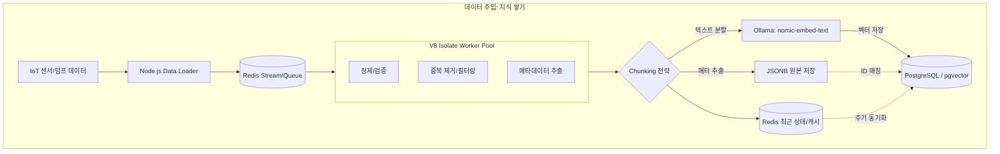
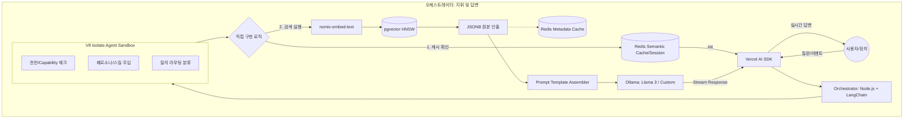

# NEXA 오케스트레이션 엔진 및 인프라

**목적:** 오케스트레이터(`Node.js + LangChain`)를 중심으로 IoT 데이터의 벡터화·저장·RAG 흐름을 정의하고, 노드 이름·다이어그램·구현 관점을 한 문서에서 관리한다.  
**참조:** 기술 스택·프로토콜·라이브러리 용어는 `NEXA-STACK-01`을 따른다.  
**작성일:** 2025-03

---

## 0) 목적 및 범위

이 문서는 다음 두 단계를 함께 설명한다.
- 주입(Ingestion): 데이터가 시스템으로 들어와 저장되는 구간
- 검색/답변(RAG): 사용자 질의에 대해 문맥을 찾아 답변하는 구간

역할 축:
- **LangChain:** 데이터 질서/로직을 담당하는 엔진
- **Vercel AI SDK:** 사용자 인터페이스와 스트리밍 전달 담당

### 0.1 문서 역할 분담

| 구분 | 이 문서 | `NEXA-STACK-01` |
| :-- | :-- | :-- |
| 대상 | 노드 이름, 데이터 흐름, 다이어그램, Redis·V8 Isolate, 로직 설계 | 기술 스택, 프로토콜, 라이브러리, 설치/용어 |
| 예시 | `IoT Stream Splitter`, `Intent Classifier` | `gRPC`, `Temporal`, `Redis`, `MQTT` |

### 0.2 핵심 용어

| 용어 | 정의 |
| :-- | :-- |
| 배칭(Batching) | 작은 요청을 묶어 처리량을 높이는 전략 |
| 병목(Bottleneck) | 특정 구간에서 처리량이 막혀 전체 흐름이 지연되는 현상 |
| 오케스트레이터 | 실행 순서·데이터 흐름·배칭 정책을 통합 제어하는 지휘 계층 |
| 적응형 배칭 | 큐 상태/긴급도에 따라 배칭 크기를 동적으로 조절 |
| 우선순위 계층 | 안전(1)·사용자(2)·자동화(3)·일상(4)로 차등 처리 |
| 샌드박스 | 사용자 코드/플러그인을 격리 실행하는 안전 환경(V8 Isolate 등) |

---

## 1) 노드 및 흐름 사전

### 1.1 주입/저장 레이어 (Ingestion & Storage)
- `IoT Stream Splitter`: 장치 데이터와 사용자 데이터를 분리
- `Contextual Chunking Node`: 의미 단위(로그/상태/이벤트)로 분할
- `Nomic-Embedder`: 텍스트를 임베딩 벡터로 변환
- `PG-Vector Store`: 벡터 저장/유사도 검색(HNSW)
- `JSONB Raw Vault`: 원본 메타/상세 수치 저장

### 1.2 오케스트레이션 레이어 (Logic)
- `Semantic Cache (Redis)`: 유사 질문 캐시 히트 시 즉시 응답
- `Intent Classifier`: 질의 유형 분류(제어/조회/대화)
- `Priority Scheduler`: 위험/중요 이벤트 우선 처리
- `Hybrid Retriever`: 벡터 + 키워드/시간 필터 결합 검색
- `Safety Guardrail`: 물리/운영 안전 조건 검증
- `Prompt Assembler`: 컨텍스트 + 지시문 조립

### 1.3 인터페이스 레이어 (Interface)
- `Stream Controller`: 실시간 응답 스트리밍
- `Reasoning Path Visualizer`: 답변 근거 경로 시각화
- `Human-in-the-Loop`: 최종 승인/거절 처리

### 1.4 기본 논리 흐름
- 데이터 유입: `IoT Stream Splitter -> Contextual Chunking -> Nomic-Embedder -> PG-Vector`
- 질의 처리: `User -> Stream Controller -> Semantic Cache`
- 오케스트레이션: `Intent Classifier -> Priority Scheduler -> Hybrid Retriever -> Safety Guardrail`
- 최종 응답: `Prompt Assembler -> LLM -> Stream Controller -> User`

흐름선 색상 규칙:
- 청색: 일반 상태 데이터(배치 가능)
- 적색: 긴급 이벤트/사용자 명령(즉시 처리)

---

## 2) 데이터 주입 단계 (Ingestion)

---

## 3) 사용자 요청 및 오케스트레이션

---

## 4) 설계 핵심 포인트

- **두 번의 임베딩 일관성:** 주입 시와 질의 시 동일 임베딩 모델을 사용해야 좌표 정합성이 유지됨
- **Redis 방어선:** DB 조회 전 캐시/큐로 부하를 완충
- **V8 Isolate 격리:** 정제·검증·권한 체크를 메인 프로세스와 분리
- **역할 분리:** 벡터DB는 “가까운 후보 찾기”, 원본 컨텍스트는 JSONB에서 복원
- **모델 분리:** 검색 모델(임베딩)과 생성 모델(답변)을 분리 운영

### 4.1 Redis + V8 Isolate 운영 포인트

| 구성요소 | 역할 | 적용 구간 |
| :-- | :-- | :-- |
| Redis | Queue 완충, Semantic/Metadata Cache, 세션 유지 | 주입 입구, 검색 전, 오케스트레이션 |
| V8 Isolate | 데이터 정제·검증·권한 체크 격리 병렬 실행 | Ingestion Worker, Agent Sandbox |

---

## 5) 병목 구간과 직접 구현 로직

### 5.1 병목 위험 구간
1. 임베딩 처리량: 동시 요청 시 CPU/GPU 점유 급증
2. 컨텍스트 윈도우: 검색 결과 과다 주입 시 토큰 낭비/품질 하락
3. 시계열 특성: 벡터 유사도만으로는 최신성/시간 맥락 누락 가능

대응:
- 질의 요약 후 임베딩
- Redis 임베딩 캐시
- Top-K + Rerank + 중복 제거
- 시간 가중 하이브리드 검색

### 5.2 직접 구현 로직의 우선순위 필터

| 단계 | 내용 |
| :-- | :-- |
| 의도 분류 | 단순 질의는 벡터 검색 생략, 전용 경로 즉시 응답 |
| 권한 필터 | 사용자/Tier/Capability 기준으로 후보 데이터 선필터 |
| 시맨틱 캐시 | 유사 질의는 LLM 호출 없이 캐시 응답 |
| 동적 프롬프트 | 최근 로그 우선, 이상 징후 우선 등 규칙 적용 |

### 5.3 우선순위 계층/배칭/생명주기

| 우선순위 | 구분 | 처리 방식 |
| :-- | :-- | :-- |
| 1 | 안전 | 배칭 없이 즉시 처리 |
| 2 | 사용자 | 초저지연 배칭 |
| 3 | 자동화 | 효율 중심 동적 배칭 |
| 4 | 일상 센서/로그 | 대량 일괄 처리 |

추가 정책:
- 적응형 배칭: 큐 길이 + 긴급도 기반 배치 크기 조절
- 프로젝트별 유통기한: 만료 데이터는 압축/저비용 저장소 이주 또는 삭제

---

## 6) Vercel AI SDK vs LangChain 역할 분담

| 구분 | Vercel AI SDK | LangChain |
| :-- | :-- | :-- |
| 위치 | 프론트/응답 스트림 입구 | 백엔드 오케스트레이터 핵심 |
| 역할 | UI 스트리밍, 상태 전달, 사용자 체감 응답 | RAG 검색, 도구 조합, 판단 로직 |
| 이점 | 빠른 UX | 복잡한 IoT/지식 흐름 제어 |

권장 원칙:
- **입(Vercel)** 과 **뇌(LangChain)** 분리
- API Key/비밀값은 환경변수로 관리

---

## 7) 기술 스택 중복 및 단점

- 중복 영역: 모델 호출, 스트리밍, 프롬프트 템플릿
- 단점:
  - 학습 비용 중복
  - LangChain 번들/오버헤드
  - 디버깅 경계 복잡화

대응:
- 모델 호출 책임을 한 계층으로 명확히 고정
- 로깅 트레이스 ID를 양쪽 공통으로 사용

---

## 8) 관련 문서

- `NEXA-STACK-01`: 기술 스택/프로토콜/용어
- `NEXA-CAPABILITY-01`: Capability ID 체계 및 Tier 권한
