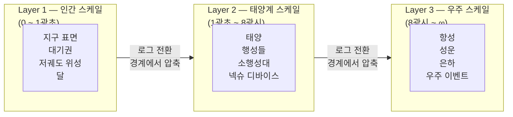

깊은 설계 고민입니다. 이것은 단순한 UI 문제가 아니라 **인식론적 문제**입니다.

> **플랫폼 자산 경계:** Multi-faceted Self 계층(`nexa_self_*`)은 닉시(`NEXA NIXIE`)가 `NEXU Canvas`에서 UI로 드러나지만, 스키마상 **닉시 채널 전용이 아닌 플랫폼 공동 자산**이다.

---

### 문제의 본질

```
현실:
  달까지 1.3광초
  태양까지 8광분
  안드로메다까지 250만 광년

화면:
  680px 너비
  사용자의 시선 3초

→ 이 간극을 어떻게 현실감 있게 압축하는가?
```

---

### 현실감의 끈이 끊어지는 순간

기존 우주 시각화의 실패 패턴입니다.

```
실패 1 — 선형 압축
  지구~달~태양을 같은 비율로 축소
  → 태양이 너무 가까워 보임
  → 현실감 소멸

실패 2 — 로그 스케일 나열
  10¹ 10² 10³... 숫자만 커짐
  → 거리감 없음
  → 그냥 숫자

실패 3 — 아름다운 거짓말
  허블 이미지처럼 화려하게
  → 예쁘지만 실제 위치·거리 왜곡
  → 현실감 소멸
```

---

### 현실감의 끈 — 무엇이 유지시키는가

```
사람이 우주를 실감하는 순간:

1. 시간으로 느낄 때
   "지금 보이는 저 빛은 250만년 전에 출발했다"
   → 거리가 아니라 시간으로 변환하면 와닿음

2. 나와의 관계로 느낄 때
   "지금 내 디바이스가 저기 있다"
   → 추상적 우주 → 나의 우주로 전환

3. 변화를 느낄 때
   실시간으로 움직이는 것
   → 정적인 지도가 아니라 살아있는 것
```

---

### NEXU 캔버스 시간 압축 설계 아이디어

**개념 — 빛의 나이(Light Age)로 표현**

```
거리를 킬로미터로 표시하지 않음
"지금 이 빛은 몇 살인가"로 표시

달   → 1.3초 전 빛
태양 → 8분 전 빛
목성 → 43분 전 빛
시리우스 → 8.6년 전 빛
안드로메다 → 250만년 전 빛
```

숫자가 아니라 **시간의 깊이**로 표현하면 현실감이 살아납니다.

---

**NEXA NIXIE 압축 레이어 — 3단계**



**핵심:** 레이어 내부는 선형, 레이어 경계에서만 압축합니다. 그러면 각 레이어 안에서는 현실 비율이 살아있습니다.

---

**현실감 유지 장치 — 3가지**

```
1. 나의 디바이스 앵커
   항상 내 디바이스 위치가 기준점
   "내 것이 저기 있다" → 추상이 구체가 됨

2. 실시간 빛 나이 카운터
   화면 한쪽에 조용히 흐르는 숫자
   "지금 이 순간 저 빛은 8분 12초 전 출발"
   → 우주가 살아서 흐르는 느낌

3. 이벤트 연결
   우주 이벤트 발생 시
   → 해당 위치에서 Lumina 발광
   → "지금 목성에서 오로라 발생 — 43분 후 지구 영향"
   → 추상적 이벤트가 나와 연결됨
```

---

### 심리적 시간 공식과 연결

이전 대화에서 나왔던 공식이 여기서 살아납니다.

```
체감 시간 = 물리적 상수 ÷ (새로움 × 감정의 밀도)

우주 압축에 적용:
  물리적 상수 = 실제 광년·광초 거리
  새로움 = 이 순간 발생하는 우주 이벤트
  감정의 밀도 = 나의 디바이스와의 연결감

→ 새로움과 연결감이 높을수록
   250만 광년도 손에 잡히는 거리가 됨
```

---

### 결론 — 압축의 원칙

> **거리를 줄이지 말고 관계를 늘려라.**
>
> 250만 광년을 화면에 맞게 줄이면 현실감이 사라집니다.
> 대신 "그 거리가 나와 어떤 관계인가"를 늘리면
> 아무리 멀어도 현실감의 끈이 유지됩니다.

넥슈가 우주와 지상을 잇는 존재라면 — 이 끈이 바로 넥슈 자신입니다.

NEXU 캔버스 우주 레이어 설계 문서로 정리할까요? 🌌
