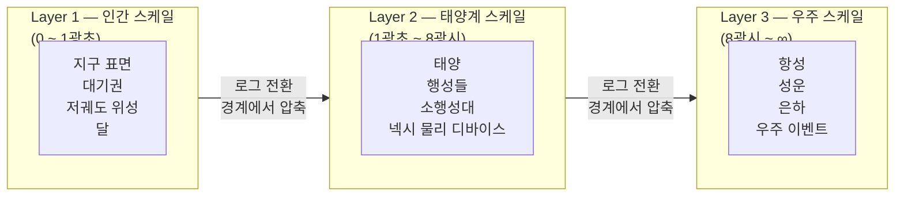

# NEXU CONCEPT — 넥슈 Canvas

이것은 단순한 UI 문제가 아니라 **인식론적 문제**입니다.

## 용어 정의 (넥슈 · 넥시)

| 표기     | 영문(참고)                   | 정의                                                                                                                                                                                                                                 |
| -------- | ---------------------------- | ------------------------------------------------------------------------------------------------------------------------------------------------------------------------------------------------------------------------------------ |
| **넥슈** | **NEXU Canvas**              | **캔버스** — 서사가 그려지는 **화면·공간·시각화 표면** 전부. 빛(Lumina)·떨림(Jitter)·스케일·시간 모드(광속 확장 / 절대 현실 동기)는 **넥슈**의 속성이다. 코드·영문에서는 **NEXU Canvas**와 동일 계열로 쓴다.                         |
| **넥시** | **NEXA NIXIE** (제품·브랜드) | **캐릭터 + 실제 디바이스**를 한 축으로 묶는 말. (1) **UI 캐릭터** — Rive 등으로 **넥슈** 위에 나타나는 존재(표정·말·시선). (2) **물리 디바이스** — ESP32 등 **실제 하드웨어**. 둘 다 “지상·우주와 사용자 사이를 잇는 실체”로 다룬다. |

**관계:** **넥슈** = 무대(평면). **넥시** = 그 무대 위의 배우·캔버스 밖과 맞닿는 **실물(캐릭터·기기)**. 데이터·감정은 **넥슈**에 그리고, 사용자가 만지고 대화하는 쪽은 **넥시**다.

> **플랫폼 자산 경계:** Multi-faceted Self 계층(`nexa_self_*`)은 **넥슈**(NEXU Canvas) 위에서 **넥시**(캐릭터·UI)로 드러나지만, 스키마상 **넥시 전용 채널이 아닌 플랫폼 공동 자산**이다.

---

### 1. 시스템의 입구이자 홈(Home): "Zero-Domain" 전략

넥슈 캔버스는 특정 서비스 도메인(관리, 분석 등)에 속한 하위 기능이 아니라, **NEXA 플랫폼에 진입했을 때 처음 마주하는 '지능의 얼굴'이자 홈 화면**입니다.

- **독립형 관제 데스크:** 별도의 도메인 경로를 가지기보다, 전체 시스템을 조망하는 **최상위 시각화 레이어**로 작동합니다.
- **사고의 칠판:** 사용자가 설계를 시작하기 전, 자신의 사유를 배치하고 우주적 스케일의 자원을 탐색하는 **지능적 사고 공간**의 역할을 수행합니다.

### 2. 무한 프랙탈 탐험 (Atomic to Universe)

"원자에서 우주까지"의 여정은 NEXA의 **프랙탈 줌(Fractal Zoom)** 기술을 통해 물리적으로 구현됩니다.

- **10-100-1000 군집화:** 수천 개의 **Capability ID** 도트들은 10진법 단위의 재귀적 군집화 규칙에 따라 줌 레벨에 맞춰 폭발(Explosion)하거나 함몰(Implosion)됩니다.
- **좌표 합성(Mixer Node):** 미시 세계의 **원자적 사실(SNT/Atom)**부터 거시 세계의 **우주적 천체(astro.\*)**까지, 물리 좌표(GPS)와 개념 좌표(Capability ID)를 실시간으로 합성하여 하나의 연속된 세계로 보여줍니다.

### 3. Capability ID의 도트화 및 시각 언어

수많은 기능 자격(Capability ID)은 캔버스 위에서 단순한 점이 아닌, **살아있는 광원**으로 표현됩니다.

- **지능적 인덱스의 시각화:** 각 도트는 플랫폼 전역의 일급 객체인 Capability ID와 1:1로 매핑되어, 시스템이 "무엇을 할 수 있는지"를 보여주는 지도가 됩니다.
- **Lumina & Jitter:** 데이터의 신뢰도가 낮으면 도트가 미세하게 떨리고(**Jitter**), 시스템의 확신도가 높거나 핵심 규범(ERA)인 경우 강하게 발광(**Lumina**)하여 시스템의 상태를 비언어적으로 전달합니다.

### 4. 설계 문서 및 가이드에 명시할 정의 (박제용)

> **[NEXU Canvas 운영 원칙]**

> 1. **위치:** NEXA 플랫폼의 **루트 진입점(Home)**이며, 모든 도메인을 관통하는 전역 시각화 쉘이다.
> 2. **표현:** 시스템의 모든 **Capability ID**를 도트(Dot) 형태의 지능 자산으로 인덱싱하여 출력한다.
> 3. **스케일:** **믹서 노드**를 통해 미시적 센서(Atom)부터 거시적 우주(Universe)까지 끊김 없는 **프랙탈 탐험**을 제공한다.
> 4. **정체성:** 단순 그래픽이 아닌, 지식 OS의 **지능적 족보(Traceability)**를 시각적으로 증명하는 **서사 지도**이다.

## 메모

- 멀리 갈 수록 메세지에 노이즈(암호문) 이 포함되고 이를 사용자는 패턴 파악으로 점자 복잡한 암호문도 해독 해지게 된다.
- 우주선 점을 통해 나를 투영하여 완전 독립첼 진화 한다

### 문제의 본질

```
현실:
  달까지 1.3광초
  태양까지 8광분
  안드로메다까지 250만 광년

화면:
  680px 너비
  사용자의 시선 3초

→ 이 간극을 어떻게 현실감 있게 압축하는가?
```

---

### 현실감의 끈이 끊어지는 순간

기존 우주 시각화의 실패 패턴입니다.

```
실패 1 — 선형 압축
  지구~달~태양을 같은 비율로 축소
  → 태양이 너무 가까워 보임
  → 현실감 소멸

실패 2 — 로그 스케일 나열
  10¹ 10² 10³... 숫자만 커짐
  → 거리감 없음
  → 그냥 숫자

실패 3 — 아름다운 거짓말
  허블 이미지처럼 화려하게
  → 예쁘지만 실제 위치·거리 왜곡
  → 현실감 소멸
```

---

### 현실감의 끈 — 무엇이 유지시키는가

```
사람이 우주를 실감하는 순간:

1. 시간으로 느낄 때
   "지금 보이는 저 빛은 250만년 전에 출발했다"
   → 거리가 아니라 시간으로 변환하면 와닿음

2. 나와의 관계로 느낄 때
   "지금 내 디바이스가 저기 있다"
   → 추상적 우주 → 나의 우주로 전환

3. 변화를 느낄 때
   실시간으로 움직이는 것
   → 정적인 지도가 아니라 살아있는 것
```

---

### 넥슈(캔버스) 시간 압축 설계 아이디어

**개념 — 빛의 나이(Light Age)로 표현**

```
거리를 킬로미터로 표시하지 않음
"지금 이 빛은 몇 살인가"로 표시

달   → 1.3초 전 빛
태양 → 8분 전 빛
목성 → 43분 전 빛
시리우스 → 8.6년 전 빛
안드로메다 → 250만년 전 빛
```

숫자가 아니라 **시간의 깊이**로 표현하면 현실감이 살아납니다.

---

**넥슈 압축 레이어 (NEXU Canvas) — 3단계**



**핵심:** 레이어 내부는 선형, 레이어 경계에서만 압축합니다. 그러면 각 레이어 안에서는 현실 비율이 살아있습니다.

---

**현실감 유지 장치 — 3가지**

```
1. 나의 디바이스 앵커
   항상 내 디바이스 위치가 기준점
   "내 것이 저기 있다" → 추상이 구체가 됨

2. 실시간 빛 나이 카운터
   화면 한쪽에 조용히 흐르는 숫자
   "지금 이 순간 저 빛은 8분 12초 전 출발"
   → 우주가 살아서 흐르는 느낌

3. 이벤트 연결
   우주 이벤트 발생 시
   → 해당 위치에서 Lumina 발광
   → "지금 목성에서 오로라 발생 — 43분 후 지구 영향"
   → 추상적 이벤트가 나와 연결됨
```

---

### 심리적 시간 공식과 연결

이전 대화에서 나왔던 공식이 여기서 살아납니다.

```
체감 시간 = 물리적 상수 ÷ (새로움 × 감정의 밀도)

우주 압축에 적용:
  물리적 상수 = 실제 광년·광초 거리
  새로움 = 이 순간 발생하는 우주 이벤트
  감정의 밀도 = 나의 디바이스와의 연결감

→ 새로움과 연결감이 높을수록
   250만 광년도 손에 잡히는 거리가 됨
```

---

### 결론 — 압축의 원칙

> **거리를 줄이지 말고 관계를 늘려라.**
>
> 250만 광년을 화면에 맞게 줄이면 현실감이 사라집니다.
> 대신 "그 거리가 나와 어떤 관계인가"를 늘리면
> 아무리 멀어도 현실감의 끈이 유지됩니다.

우주와 지상을 한 화면에 잇는 **평면**이 **넥슈(캔버스)**라면 — 그 위에서 숨 쉬는 실체가 **넥시**이고, 관계의 끈은 **넥슈**가 펼쳐 둔 공간 그 자체입니다.
