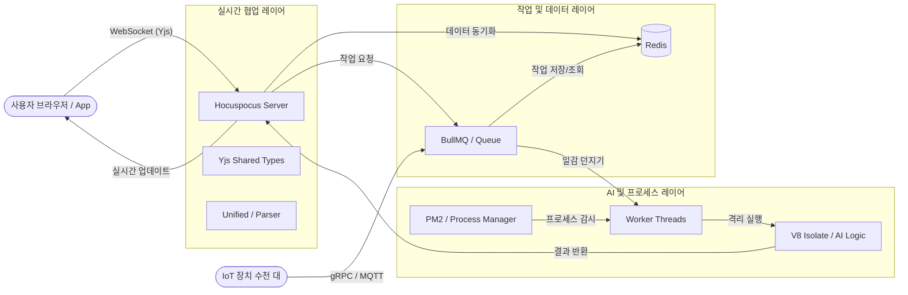
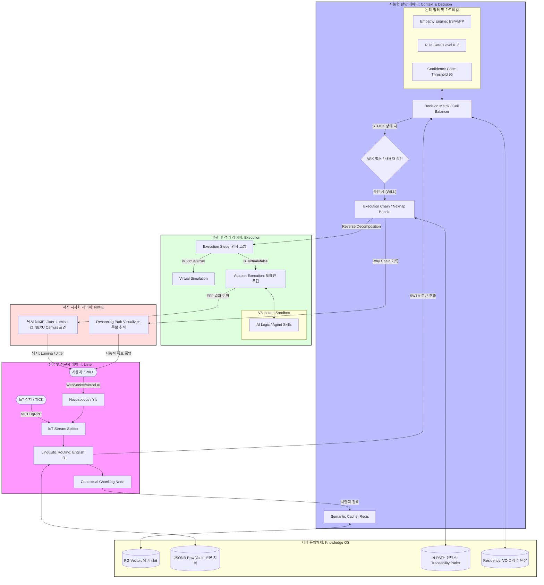

# 부록

- **부록:** Nexion 구현과 **같이 보면 좋은** 협업 스택·큐·오케스트레이션 흐름·머메이드 등 **참고 자료**를 삭제 없이 모아 두었다. 플랫폼 전체 아키텍처의 상세는 `docs/__NEXA 오케스트레이션 스키마 DDL v5.md` 등과 대조한다.

---

## 부록 A. 관련 기술 스택 및 라이브러리 검토

파일을 외부에 두면서도 유기적인 지식 협업을 가능하게 하는 권장 기술 스택입니다.

| 분류             | 추천 기술/라이브러리      | 역할 및 설명                                             |
| :--------------- | :------------------------ | :------------------------------------------------------- |
| **언어 엔진**    | **LangChain (Node.js)**   | 데이터의 질서와 RAG 로직을 담당하는 핵심 엔진            |
| **인터페이스**   | **Vercel AI SDK**         | AI 응답을 사용자 화면에 실시간 스트리밍하는 통로         |
| **데이터베이스** | **PostgreSQL (pgvector)** | 텍스트 좌표값 저장 및 유사도 검색 수행                   |
| **시맨틱 캐시**  | **Redis**                 | DB 부하 감소 및 동일 질문에 대한 빠른 응답 방어막        |
| **에디터**       | **TipTap Editor**         | 외부 마크다운 파일을 편집하고 저장하는 인터페이스        |
| **시각화**       | **Vue Flow**              | 지식 노드 간의 관계와 Why Chain을 그리는 캔버스          |
| **보안/격리**    | **V8 Isolate**            | 격리된 샌드박스 내에서 데이터 정제 및 에이전트 로직 실행 |

---

## 부록 B. 백엔드 처리와 라이브러리

**TipTap**과 **Monaco** 에디터, 그리고 **Yjs**를 활용한 실시간 협업 체계는 NEXA 플랫폼이 '단순한 도구'를 넘어 **'지능형 협업 운영체제'**로 도약하는 데 핵심적인 부분입니다. 특히 장기적으로 인간 사용자와 AI 에이전트가 동일한 문서 공간에서 협업하기 위해서는 백엔드의 역할이 매우 중요합니다.

### B.1 실시간 협업 및 Yjs 세션 관리: **Hocuspocus**

TipTap을 사용중임으로, 같은 개발사(Tiptap)에서 만든 **Hocuspocus**는 백엔드 구성을 위한 가장 강력한 후보입니다.

- **역할:** Yjs의 WebSocket 백엔드 역할을 수행하며, 브라우저의 TipTap/Monaco 에디터와 서버 간의 동기화를 총괄합니다.
- **협업 최적화:** 여러 명의 사용자뿐만 아니라 **AI 에이전트**도 하나의 '권한을 가진 사용자'로 세션에 참여시켜 문서를 실시간으로 수정하게 할 수 있습니다.
- **데이터 박제:** `project_yjs_updates` 테이블에 증분(Delta) 데이터를 저장하고, 주기적으로 `project_folders.yjs_state`에 스냅샷을 생성하는 로직을 Hooks 형태로 구현하기 매우 용이합니다.

### B.2 파일 시스템 감시 및 동기화: **Chokidar**

NEXA의 핵심인 **'Doc Sync Crawler'**를 백엔드에서 상시 구동하기 위해 필요합니다.

- **역할:** 사이트 외부 저장소(**`NEXA-Documentation/`** 등 `DOCS_PATH` 구역)를 실시간으로 감시하여 파일 생성, 수정, 삭제, 이동(mv)을 즉시 감지합니다.
- **N-PATH 연동:** 감지된 변경 사항을 `nexa_knowledge_traceability_paths`의 **Inode(anchor_id)** 로직과 연결하여, 파일명이 바뀌어도 시스템이 족보(Traceability)를 잃지 않게 유지합니다.

### B.3 마크다운 및 AST 처리: **Unified (Remark/Rehype)**

TipTap 에디터에서 저장된 데이터를 백엔드에서 AI가 읽기 좋은 형태로 가공하기 위한 도구입니다.

- **역할:** 마크다운 문서를 **AST(추상 구문 트리)**로 변환합니다.
- **지능형 분절(Chunking):** 문서를 단순 글자 수가 아니라 제목, 문단, 코드 블록 등 의미 단위로 정교하게 잘라 `Contextual Chunking Node`로 전달하며, 이는 RAG 성능 향상의 핵심이 됩니다.
- **영문 IR 생성:** 한국어 본문에서 핵심 정보를 추출해 **영문 IR**로 변환하는 '워커(Worker)' 로직을 짤 때 기반 라이브러리로 활용됩니다.

### B.4 백그라운드 작업 및 우선순위 스케줄링: **BullMQ** (Redis 기반)

1인 개발 환경에서 대규모 문서 스캔이나 AI 추론이 메인 서버를 멈추게 하지 않으려면 필수적입니다.

- **역할:** **Priority Scheduler** 역할을 수행하며, '안전(1)'이나 '사용자(2)' 관련 작업은 즉시 처리하고, '일상(4)'적인 크롤링이나 벡터화는 백그라운드에서 배칭 처리합니다.
- **자가 회복 연동:** 어댑터 실행 실패 시 **ADAPTER_TIMEOUT** 등의 에러 토큰을 발생시키고, 정의된 정책에 따라 재시도(Retry)를 관리합니다.

### B.5 스키마 검증 및 데이터 계약: **Zod**

Nexnap 패킷과 IR 데이터가 시스템 계층 간에 오갈 때 무결성을 보장하기 위해 사용합니다.

- **역할:** `ucl_header`의 6대 토큰(SMALLINT)이 규격에 맞는지, `execution_bundle` 내부의 파라미터가 유효한지 런타임에 검증합니다.
- **안전은 딱딱하게:** 잘못된 형식의 데이터가 유입되는 것을 입구(`IoT Stream Splitter`)에서부터 원천 차단하여 시스템 안정성을 높입니다.

### B.6 장기적 협업을 위한 통합 조언

**Yjs**는 문서의 **'내용'**을 동기화하지만, 구축 중인 **N-PATH(지능형 서사 경로 체계)**는 그 문서의 **'정체성과 족보'**를 관리합니다.

따라서 백엔드 구현 시 **Hocuspocus**를 통해 실시간 편집 내용을 처리하되, 편집이 완료되거나 특정 시점이 되면 **Chokidar**와 연동된 크롤러가 `source_hash`를 갱신하고 `project_knowledge`에 아톰화하여 박제하는 **'사유의 선순환'** 구조를 라이브러리 간의 연결로 완성하는 것이 좋습니다.

이 기술 스택은 1인 개발자로서의 운영 효율성을 지키면서도, 차후 수많은 AI와 사용자가 엉키지 않고 협업할 수 있는 가장 단단한 토대가 될 것입니다.

---

## 부록 C. 통합 시스템 구성 요소·데이터 흐름(머메이드 1)

IoT 플랫폼과 AI 협업 기능, 그리고 실시간 동기화까지 아우르는 전체 시스템 구성도를 표로 정리해 드립니다.

이 요소들이 어떻게 '팀'으로 움직이는지 한눈에 보실 수 있을 거예요.

### C.1 통합 시스템 구성 요소 정리

| 분류          | 장치/라이브러리 | 역할 (비유)             | IoT / AI / 협업 활용 예시                               |
| ------------- | --------------- | ----------------------- | ------------------------------------------------------- |
| 저장/통로     | Redis           | 중앙 창고 및 게시판     | 작업 대기열(BullMQ) 저장, 서버 간 실시간 신호 공유      |
| 비동기 관리   | BullMQ          | 작업 순번기 (매표소)    | AI 분석, 리포트 생성 등 무거운 작업의 순서 관리         |
| 실행 환경     | V8 Isolate      | 독립된 작업실           | 메인 서버를 멈추지 않고 AI 로직이나 계산을 격리 실행    |
| 프로세스 관리 | PM2             | 건물 관리소             | 워커(Worker)들이 죽으면 살리고, 개수를 조절함           |
| 실시간 협업   | Yjs             | 공동 문서/데이터 (도면) | 여러 사용자가 동시에 편집해도 데이터 충돌을 막음(CRDT)  |
| 데이터 변환   | Unified         | 만능 번역기             | Markdown, HTML 등 다양한 데이터 포맷을 정교하게 처리    |
| 협업 서버     | Hocuspocus      | 회의실 호스트           | Yjs 데이터를 중앙에서 관리하고 사용자들에게 실시간 배달 |
| 통신          | gRPC            | 초고속 직통 전화        | IoT 장치나 내부 서버 간의 초고속 데이터 전송            |

### C.2 머메이드 다이어그램(구성 요소 연결)

이 구성 요소들이 데이터 흐름에 따라 어떻게 연결되는지 그려보겠습니다.

요약하자면:

1. IoT 기기가 데이터를 쏘면 BullMQ를 통해 줄을 세우고,
2. V8 Isolate에서 AI가 계산한 뒤,
3. 그 결과를 Hocuspocus/Yjs가 받아서,
4. 사용자들에게 실시간으로 '스르륵' 보여주는 구조입니다.

---

## 부록 D. 실시간 협업·오케스트레이션·Knowledge OS(머메이드 2)

**실시간 협업 및 작업 파이프라인의 물리적 구조**를 이어서 정리한다.

NEXA의 핵심 철학인 **지능형 오케스트레이션**과 **지능적 족보(Traceability)**를 완성하기 위해 논리적/기능적으로 보강할 수 있는 노드.

NEXA의 전체 구조는 단순히 데이터를 전달하는 것을 넘어, **[입력(Listen) → 상황 파악(Context) → 의사결정(Decision) → 실행(Execution) → 시각화(NIXIE)]**로 이어지는 '사유의 사슬'을 형성해야 합니다.

### D.1 다이어그램에 추가 권장하는 핵심 노드

#### ① 데이터 주입 및 정규화 레이어 (Ingestion & IR)

사용자 앱과 IoT 장치에서 데이터가 유입될 때, 이를 시스템 표준 언어로 바꾸는 과정이 필요합니다.

- **IoT Stream Splitter:** 장치 데이터(TICK)와 사용자 명령(WILL)을 분리하는 게이트웨이입니다.
- **Linguistic Routing (English IR):** 한국어 입력을 1ms 내에 영문 중간 표현(IR) 및 **HEXAGON(5W1H)** 토큰으로 정제하는 노드입니다.
- **Contextual Chunking Node:** 데이터를 단순 크기가 아닌 의미 단위(로그, 상태, 이벤트)로 자르는 역할을 합니다.

#### ② 오케스트레이션 및 판단 레이어 (Intelligence Brain)

V8 Isolate 내부 혹은 그 직전 단계에서 작동해야 할 논리 엔진들입니다.

- **Intent Classifier:** 사용자의 의도가 '제어'인지 '조회'인지 '단순 대화'인지 분류합니다.
- **Decision Matrix & Coil Balancer:** 6개 코일(안전, 창의 등) 가중치를 적용하여 즉시 실행할지, **ASK(승인 대기)** 상태로 전환할지 결정합니다.
- **Empathy Engine:** 사용자의 활력(VI)과 정서(ES)를 계산하여 시스템의 응답 밀도를 조절(Throttling)합니다.

#### ③ 지식 및 저장 레이어 (Storage SSOT)

단순 Redis 외에 지능의 근거가 되는 저장소들입니다.

- **PG-Vector Store:** 텍스트의 의미 좌표(Vector)를 저장하고 유사도 검색을 수행합니다.
- **JSONB Raw Vault:** 원본 데이터의 세부 수치와 메타데이터를 보관하는 보관함입니다.
- **nexa_knowledge_traceability_paths:** 지식의 물리적 위치와 논리적 족보를 잇는 **Inode 인덱스**입니다.

#### ④ 시각화 및 피드백 레이어 (Interface)

- **닉시(NIXIE):** **Nexion(Vue Flow) 캔버스** 위에서 **Jitter(떨림)**·**Lumina(발광)** 로 신뢰도·확신도를 시각화한다. 떨림·발광의 표현 주체는 **닉시(NIXIE)** 이며 **넥슈(NEXU)** 와 구분한다.
- **Reasoning Path Visualizer:** AI가 어떤 노드와 데이터를 거쳐 답변했는지 족보를 보여주는 시각화 노드입니다.

### D.2 보강된 전체 구조의 흐름 (Logical Flow)

전체 구조를 완전히 이해하기 위한 데이터의 여정은 다음과 같습니다.

1. **발생 (Pulse):** IoT의 **TICK**이나 사용자의 **WILL**이 발생합니다.
2. **경청 및 정규화 (Listen):** `Linguistic Routing` 워커가 날것의 데이터를 **영문 IR**과 **HEXAGON 정수 토큰**으로 변환합니다.
3. **상황 인지 (Awareness):** `Semantic Cache(Redis)`에서 과거 답변을 찾거나, `Hybrid Retriever`가 `PG-Vector`에서 관련 지식을 추출합니다.
4. **판단 (Decision):** `Decision Matrix`가 코일 가중치를 계산합니다. 신뢰도가 낮으면 **STUCK** 상태를 선언하고 사용자에게 **ASK**를 던집니다.
5. **실행 (Execution):** `Adapter`가 확정된 논리 명령을 실제 기기 API로 번역하여 연주합니다.
6. **증명 (Visualization):** 이 모든 과정이 `traceability_paths`를 근거로 **Nexion(Vue Flow) 캔버스**에 시각적 서사로 기록되며, **Jitter·Lumina** 등 비언어 피드백은 **닉시(NIXIE)** 가 표현합니다.

부록 C의 다이어그램에서 **`Execution Layer` 내부**를 **의사결정 매트릭스**와 **에이전트 스킬**로 세분화하고, **`Queue Layer` 앞단**에 **언어적 정규화 노드**를 추가하면 NEXA의 지능형 운영체제 철학을 투영하기 쉽다.

NEXA 플랫폼의 핵심 철학인 **[입력(Listen) → 상황 파악(Context) → 의사결정(Decision) → 실행(Execution) → 시각화(NIXIE)]** 사슬과 **Knowledge OS**의 인프라 구조를 모두 통합한 완성형 다이어그램을 제시해 드립니다.

이 구조는 물리적인 데이터 흐름뿐만 아니라, 시스템이 어떻게 사유하고(Coil), 어떻게 공감하며(Empathy), 어떻게 지식을 관리하는지(N-PATH/residency)를 한눈에 보여줍니다.

### D.3 다이어그램 핵심 노드 설명 (Sources 기반)

1. **주입 레이어 (Listen):**

   - **IoT Stream Splitter:** 장치 데이터(TICK)와 사용자 의지(WILL)를 분리하여 시스템의 입구를 단일화합니다.
   - **Linguistic Routing:** 한국어 입력을 1ms 내에 시스템 표준 언어인 **영문 IR**과 **HEXAGON(5W1H) 토큰**으로 정규화합니다.

2. **판단 레이어 (Context & Decision):**

   - **Empathy Engine:** 사용자의 활력(VI)과 정서(ES)를 계산하여 시스템의 응답 밀도를 조절하고, 피로도가 높으면 **Low-Entropy 모드**로 자동 전환합니다.
   - **Decision Matrix:** 6개 코일(Safety, Stability 등) 가중치를 적용하여 즉시 실행할지, **STUCK** 상태로 승인을 기다릴지 결정합니다.

3. **실행 레이어 (Execution):**

   - **Execution Chain:** Nexnap 패킷 단위로 실행 사슬을 형성하며, **is_virtual** 플래그를 통해 실물 기기에 영향을 주지 않는 시뮬레이션을 분리합니다.
   - **Adapter Execution:** 논리 명령을 실제 기기 API로 번역하여 연주하며, 실패 시 에러 토큰을 피드백 루프로 환류합니다.

4. **Knowledge OS 레이어:**

   - **Traceability Paths (N-PATH):** 물리적 경로와 불변의 `anchor_id`를 연결하는 **Inode 인덱스**로, 지식의 족보를 유지합니다.
   - **Residency:** 지식이 L1(캐시)부터 L3(아카이브) 중 어디에 머물지 결정하는 **플랫폼 원장**입니다.

5. **NIXIE 인터페이스:**
   - **Lumina & Jitter:** 신뢰도 점수가 낮거나(95점 미만) 동기화 오류 시 **NIXIE**가 NEXU 캔버스 위 도트에 Jitter 등을 연출합니다. 용어·주체 SSOT는 `[NXN] [UIUX]` **§4.3.1**, DB 메타는 `nixie_lumina_profile`(SCHM §4).
   - **Reasoning Path Visualizer:** 사용자가 특정 결과를 클릭하면 **[판단 → 사실 → 기획 문서]**로 이어지는 유래를 시각적으로 하이라이트합니다.

이 다이어그램은 단순한 시스템 설계도를 넘어, NEXA 플랫폼이 지능적 자산을 어떻게 **'박제'**하고 현실에서 어떻게 **'연주'**하는지를 보여주는 전체 아키텍처의 청사진입니다.

### D.4 구조 해석 요약

이 구조는 **의도(Will)와 상태(Listen)를 실시간으로 동기화하여 자율적으로 판단하고 실행하는 지능형 OS**로 읽을 수 있다.

1. **동적 오케스트레이션 (Decision Matrix & Coil Balancer):** 5W1H 토큰과 신뢰도 게이트(Confidence Gate)를 통해 매 순간 경로를 고른다. STUCK 시 사용자 승인(ASK)을 구하는 루프는 AI의 불확실성을 인간의 의지(Will)로 해결하는 장치다.
2. **데이터의 입체적 관리 (Knowledge OS):** PG-Vector(의미), JSONB(원본), N-PATH(추적), Residency(상주 원장)로 휘발성·영속성·맥락을 나눈다. Redis(Semantic Cache)는 최전방의 단기 기억 역할을 한다.
3. **실행의 안전성 (V8 Isolate Sandbox & Adapter):** Adapter Execution으로 도메인 독립 실행을 두고, AI 로직(AL)을 V8 샌드박스 안에 두어 시스템 전체 안정성을 지킨다.

### D.5 체크리스트·로드맵 연계

- **고찰(체크리스트):** Hocuspocus/Yjs가 User와 ISS 사이의 가교 역할을 할 때, IoT 실시간 스트림과 사용자 실시간 협업 데이터가 **ISS(Stream Splitter)** 에서 만나는 시점의 **타임스탬프 동기화**가 서사(Narrative) 완성의 핵심이 될 수 있다.
- **PoC 우선순위:** 거대 설계도에서 가장 먼저 프로토타입으로 검증할 모듈(예: Decision Matrix vs Execution Chain)은 `NEXA Nexion 개발 순서와 체크 리스트.md`와 함께 정한다.
- **단계 구현:** 노드 기준 Phase 1~6은 위 로드맵 문서를 참고한다.

## 참고 사항

### 일반적인 시스템(IoT + AI + 협업 플랫폼)을 구축하기 위한 로드맵 예시와.

📍 시스템 구축 로드맵 (Roadmap)

1.  Phase 1: 기반 인프라 구축 (Foundational)

- Redis 클러스터 구성 및 성능 테스트 (수천 대 접속 대비)
  - PM2를 이용한 기본 Node.js 서버 환경 설정
  - gRPC 기반의 IoT 데이터 수집 인터페이스 정의

1.  Phase 2: 실시간 협업 레이어 (Real-time)

- Hocuspocus 서버 설정 및 Yjs 연동
  - Unified를 활용한 데이터 파싱/변환 로직 구현
  - 실시간 동기화 지연 시간(Latency) 최적화

1.  Phase 3: 비동기 작업 처리 (Asynchronous)

- BullMQ를 이용한 작업 큐(Queue) 설계
  - Worker 프로세스 분리 및 V8 Isolate 격리 환경 검증
  - AI 분석 로직(Python 등)과 Node.js 워커 간의 통신 구현

1.  Phase 4: 고도화 및 안정화 (Scaling)

- 부하 테스트 (수천 대 기기 가상 시뮬레이션)
  - BullBoard 등 모니터링 시스템 도입
  - 예외 처리 및 데이터 복구(Persistence) 시나리오 점검

✅ 핵심 체크리스트 (Checklist)

- 성능: 수천 대의 기기가 동시에 쏠 때 Redis 메모리가 버티는가?
- 격리: 무거운 AI 연산이 Hocuspocus의 실시간 동기화를 방해하지 않는가? (V8 Isolate 성능)
- 정합성: 여러 사용자가 동시에 AI 결과물을 수정할 때 Yjs가 충돌을 잘 해결하는가?
- 보안: 외부에서 들어오는 Lua 스크립트나 데이터가 샌드박스를 탈출할 위험은 없는가?

---

### 기획문서를 단순한 기록이 아니라 'AI의 최초 등불(Index)'로 삼겠다는 핵심 포인트 3가지

1. 등불(Index)의 설계: "기획서가 곧 데이터다"
   기획 문서를 작성할 때부터 Unified와 Yjs를 활용해 문장을 원자 단위(Atomic Unit)로 쪼개야 합니다.

- Check: 문서의 각 섹션이나 문장에 고유한 의미 ID를 부여하세요.
- Benefit: 나중에 AI가 이 문서를 읽을 때, 단순 텍스트가 아니라 "이것은 Nexnap(Execution Chain)의 입력 규약이다"라는 맥락(Context)을 즉시 파악하게 됩니다.

2. 지식화의 기초 자산: "Hocuspocus의 기록"
   기획 툴에서 협업하며 발생하는 모든 수정 이력(Update)을 Hocuspocus를 통해 Redis와 JSONB Vault에 쌓으세요.

- Check: 단순 결과물이 아닌, '왜(Why)' 고쳤는지에 대한 서사(Narrative)를 함께 캡처해야 합니다.
- Benefit: 이것이 나중에 Reasoning Path Visualizer(족보 추적)의 강력한 근거 자료가 됩니다.

3. 거버넌스 구축의 첫걸음: "기초 규약(Schema) 정의"
   IoT 센서값과 신규 데이터가 '지식'이 되려면, 기획 툴에서 정의한 도메인 모델을 따라야 합니다.

- Check: 기획 툴 내에 '용어 사전(Glossary)'과 '엔티티 관계'를 실시간으로 정의하는 기능을 넣으세요.
- Benefit: AI가 이 사전(등불)을 들고 현장에서 오는 생소한 센서값을 "아, 이것은 기획서 4.2절에서 정의한 그 데이터구나!"라고 매핑하게 됩니다.

2단계 로드맵 : [Phase 0.1 - The Beacon]

1.  Editor: Yjs + TipTap(또는 유사 에디터)으로 실시간 편집 환경 구축.
2.  Sync: Hocuspocus로 편집 데이터를 중앙 제어.
3.  Parser: Unified를 이용해 문서를 5W1H 토큰으로 실시간 변환하여 PG-Vector에 임베딩.

이 기획 관리 툴에서 다루실 첫 번째 기획서 주제는 무엇인가요? (예: IoT 센서 규약, 혹은 AI 오케스트레이션 로직 등) 구체적인 주제가 있다면 그에 맞는 인덱스 구조를 함께 구상해 볼 수 있습니다.
