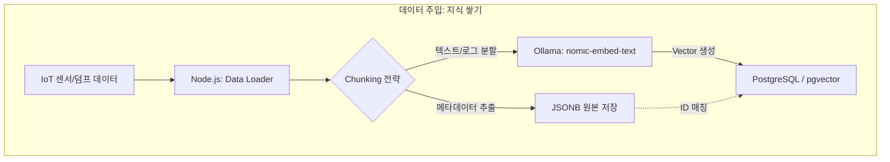
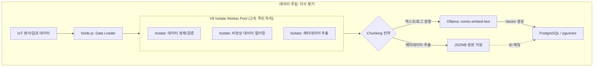
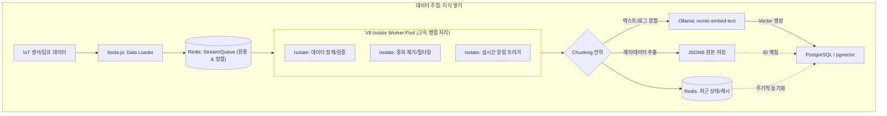
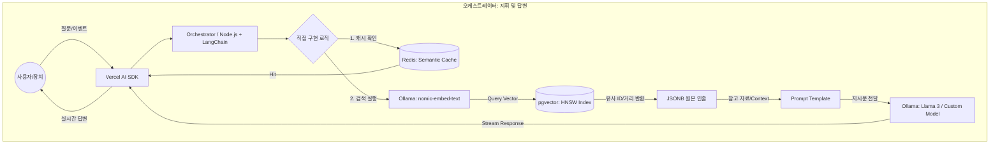
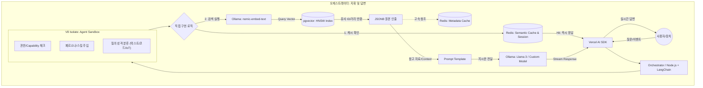

# [NEXA-AI] 오케스트레이션 엔진 및 인프라

**목적**: 오케스트레이터(Node.js + LangChain)를 중심으로 IoT 데이터의 벡터화·저장·RAG 흐름을 정의하고, **노드 이름·다이어그램·구현 관점**을 한 문서에서 관리한다.

**참조**: 기술 스택·프로토콜·라이브러리 용어는 **[NEXA-STACK-01]** 기술*스택*통합*가이드*및*용어*정리를 참조한다.

**작성일**: 2025-03

---

## 0. 목적 및 문서 범위

이 도표는 **주입(Ingestion)** 단계와 **검색/답변(RAG)** 단계를 보여 주고, 어디서 직접 관여할지를 상상하며 이해하기 위해 그린다.

- **LangChain:** "데이터의 질서와 로직을 담당하는 **엔진**"
- **Vercel AI SDK:** "인간과 엔진 사이의 신뢰를 형성하는 **인터페이스**"

| 구분 | 이 문서                                                         | NEXA-STACK-01                              |
| ---- | --------------------------------------------------------------- | ------------------------------------------ |
| 대상 | 노드 이름, 데이터 흐름, 다이어그램, Redis·V8 Isolate, 로직 설계 | 기술 스택, 프로토콜, 라이브러리, 설치·용어 |
| 예시 | IoT Stream Splitter, Intent Classifier                          | gRPC, Temporal, Redis, MQTT                |

### 0.1 반드시 짚고 넘어가야 할 핵심 용어 (Key Terminology)

| 용어                                 | 정의 및 시스템 내 역할                                                                                |
| ------------------------------------ | ----------------------------------------------------------------------------------------------------- |
| **배칭 (Batching)**                  | 자잘한 요청을 묶어 한꺼번에 처리하여 효율(Throughput)을 높이는 행위.                                  |
| **병목 (Bottleneck)**                | 데이터 폭증이나 리소스 점유로 인해 시스템 전체의 흐름이 막히는 현상.                                  |
| **오케스트레이터 (Orchestrator)**    | 각 컴포넌트와 액션의 실행 순서, 데이터 흐름, 배칭 전략을 총괄 제어하는 지휘자.                        |
| **적응형 배칭 (Adaptive Batching)**  | 고정된 수치가 아닌, 현재 큐(Queue)의 상태와 긴급도에 따라 배칭 사이즈를 실시간 조절하는 기술.         |
| **우선순위 계층 (Priority Tiering)** | 안전(1), 사용자(2), 자동화(3), 일상(4)으로 데이터를 분류하여 전용 차선을 부여하는 체계.               |
| **샌드박스 (Sandbox)**               | 사용자가 직접 짠 스크립트가 메인 시스템에 영향을 주지 않도록 분리된 안전한 실행 환경. (V8 Isolate 등) |

---

## 1. 노드 및 흐름 사전

다이어그램의 박스 이름이 되며, 코딩·설계 시 일관된 이름표(Naming)를 제공한다.

### 1.1 주입 및 저장 레이어 (Ingestion & Storage)

데이터가 시스템으로 흘러 들어와 '유통기한'을 부여받기 전의 구간이다.

- **IoT Stream Splitter**: 장치 데이터와 사용자 데이터를 분리하는 게이트웨이.
- **Contextual Chunking Node**: 데이터를 단순 크기가 아닌, 의미 단위(로그, 상태, 이벤트)로 자르는 노드.
- **Nomic-Embedder**: 텍스트를 고차원 좌표(Vector)로 변환하는 변환기.
- **PG-Vector Store**: 좌표값을 저장하고 유사도 검색(HNSW 인덱스)을 수행하는 저장소.
- **JSONB Raw Vault**: 원본 데이터의 세부 수치와 메타데이터를 보관하는 보관함.

### 1.2 오케스트레이션 및 로직 레이어 (Orchestrator)

NEXA의 핵심 '두뇌'이자 '질서'를 부여하는 구간이다.

- **Semantic Cache (Redis)**: 과거 질문-답변 쌍을 벡터로 비교해 즉시 응답하는 방어막.
- **Intent Classifier**: 사용자 질문이 '제어'인지, '조회'인지, '단순 대화'인지 분류하는 판별기.
- **Priority Scheduler**: 특별 이벤트(위험 등)에 자원을 우선 할당하는 교통 정리 노드.
- **Hybrid Retriever**: 벡터 검색(유사성)과 키워드/시간 필터링(정확성)을 병합하여 데이터를 추출하는 노드.
- **Safety Guardrail**: AI의 제안이 물리적 안전 수치를 넘지 않는지 검증하는 차단기.
- **Prompt Assembler**: 추출된 데이터와 '비서 톤' 지시문을 합쳐 AI에게 전달할 최종 문장을 만드는 조립기.
- **가중치·GOVERN 반영**: 현재 프로젝트에 선택된 **도메인별·성격별 가중치 밸런스 템플릿** 또는 **사용자 정의 가중치 세트**를 읽어, RAG 필터·인디케이터·실행 흐름에 반영한다. (참조: [문서 3] 코일 밸런스 §5.4·§5.5)

### 1.3 인터페이스 및 전송 레이어 (Interface)

사용자와 시스템이 만나는 구간이다.

- **Stream Controller**: AI의 응답을 끊김 없이 실시간으로 브라우저에 전달하는 전송 노드.
- **Reasoning Path Visualizer**: AI가 어떤 노드와 데이터를 거쳐 답변했는지 사용자에게 보여주는 시각화 노드.
- **Human-in-the-Loop (HITL)**: AI의 제안에 대해 사용자의 '최종 승인' 버튼을 처리하는 제어 노드.

### 1.4 논리적 흐름 (다이어그램 가이드)

1. **데이터 유입**: [IoT Stream Splitter] → [Contextual Chunking] → [Nomic-Embedder] → [PG-Vector]
2. **질의 발생**: [User] → [Stream Controller] → [Semantic Cache Hit?]
3. **오케스트레이션**: [Intent Classifier] → [Priority Scheduler] → [Hybrid Retriever] → [Safety Guardrail]
4. **최종 답변**: [Prompt Assembler] → [Ollama/Llama3] → [Stream Controller] → [User]

| 흐름선 색상 | 용도                                     |
| ----------- | ---------------------------------------- |
| **청색**    | 일반 상태 데이터 (Batch 처리 가능)       |
| **적색**    | 긴급 이벤트·사용자 명령 (즉시 처리 필요) |

---

## 2. 데이터 주입 단계 (Ingestion)

---

## 3. 사용자 요청 및 오케스트레이터 작동 (Orchestration)

---

## 4. 흐름의 핵심 포인트 (설계자 관점)

1. **두 번의 인코딩**: 데이터 주입 시와 사용자 질문 시, 똑같은 nomic-embed-text(AI 모델) 노드를 거쳐야 좌표가 일치함 (매우 중요).
2. **Redis의 방어**: DB(pgvector)까지 가기 전에 Redis(Stream/Queue, Semantic Cache, Metadata Cache)에서 먼저 완충·캐시로 끊어주는 것이 시스템 부하를 줄이는 '안전 장치'. 도커로 감싸 컨테이너 배치.
3. **V8 Isolate의 역할**: 입구·처리 파이프라인에서 데이터 정제·검증·필터링·권한 체크·에이전트 데스크 로직을 **격리된 샌드박스**에서 병렬 실행. 메인 프로세스를 보호하고 확장성을 확보. **IoT 플랫폼·가상 시뮬레이션**에서는 거의 필수에 가까운 구성.
4. **JSONB의 부활**: pgvector는 오직 '어떤 놈이 제일 가깝나'만 결정(검색)하고, pgvector에서 얻은 인덱스 결과로 그 짝인 실제 데이터는 AI가 읽을 재료는 JSONB에서 꺼내옴.
5. **모델의 분리**: 검색용 모델(nomic)과 답변용 모델(Llama 3/Custom)이 각자의 위치에서 전문적으로 움직이고 있음을 이해할 것.

### 4.1 Redis & V8 Isolate: 서버 안정화 필수 구성요소

둘 다 **서버 안정화와 확장성**을 위해 거의 필수에 가깝다. 특히 **IoT 플랫폼**, **가상 시뮬레이션** 등 고부하·격리 실행이 필요한 도메인에서는 반드시 고려해야 한다.

| 구성요소       | 역할                                                                                                                      | 적용 구간                                           |
| -------------- | ------------------------------------------------------------------------------------------------------------------------- | --------------------------------------------------- |
| **Redis**      | Stream/Queue로 입구 데이터 완충·정렬, Semantic Cache·Metadata Cache로 DB 부하 감소, 세션·상태 유지                        | 데이터 주입 입구, 검색 전 캐시, 오케스트레이션 흐름 |
| **V8 Isolate** | Node.js 기반 **격리된 샌드박스**에서 데이터 정제·검증·권한 체크·에이전트 로직 병렬 실행. 메인 프로세스 격리로 안정성 확보 | Worker Pool(주입), Agent Sandbox(오케스트레이션)    |

- 센드박스 프레임워크로 **V8 Isolate**를 후보로 검토 중이며, IoT·가상 시뮬레이션 등 **사용자 코드·플러그인 실행** 시 안전한 격리 실행이 필요할 때 특히 유용하다.

---

## 5. 시스템 설계 결론 및 병목·로직

**인코더·디코더**: nomic-embed-text(인코더)는 덤프 데이터 넣을 때와 사용자 질문 받을 때 '숫자로 변환'하는 용도. Ollama/Llama 3(생성기/디코더)는 인코더가 찾아온 정보를 바탕으로 '최종 답변 작성' 용도. 데이터를 넣을 때 Batch 크기·실시간 처리 여부는 Node.js 비동기(Promise.all 등) 활용에 따라 주입 속도가 달라진다.

본 아키텍처는 Node.js와 **LangChain**을 활용한 RAG(검색 증강 생성) 기반 AI 협업 툴 설계이며, 데이터 주입과 검색 단계를 명확히 분리하고 Redis 캐시와 pgvector를 적재적소에 배치한다. 오케스트레이터의 핵심인 **'직접 구현 로직(Logic)'**에서 병목과 우선순위 필터링 설계가 중요하다.

### 5.1 가장 병목이 되거나 설계가 까다로운 구간

**1. 임베딩 모델(Ollama: nomic-embed-text)의 처리 속도**  
사용자 질문마다 실시간 벡터 변환 시, 사용자가 몰리면 CPU/GPU 점유로 지연이 발생한다. → 질문 길이 제한·요약 후 임베딩, 동일 문장 임베딩은 Redis 캐싱으로 반복 계산 회피.

**2. 컨텍스트 윈도우(Context Window) 최적화**  
검색된 JSONB를 프롬프트에 넣을 때 토큰 제한 초과·'Lost in the Middle' 발생. → 유사도 상위 K개 + Reranking·중복 제거.

**3. IoT 데이터의 시계열 특성**  
벡터 유사도만으로는 과거 데이터가 잘못 추출될 수 있음. → 시간 가중치를 부여한 하이브리드 검색 로직.

### 5.2 직접 구현 로직(Logic) 내 우선순위 필터링 설계

| 단계                      | 내용                                                                              |
| ------------------------- | --------------------------------------------------------------------------------- |
| **1. 의도 분류**          | 일상 대화·시스템 상태 확인은 벡터 검색 생략, 즉시 응답 또는 전용 API 라우팅.      |
| **2. 보안·권한 필터**     | 사용자 ID·그룹 권한에 맞는 데이터만 검색. JSONB 메타데이터 필터링을 검색 전 적용. |
| **3. 시맨틱 캐시(Redis)** | 저장된 질문 벡터와 현재 질문 벡터 거리가 가까우면 LLM 호출 없이 저장된 답변 반환. |
| **4. 동적 프롬프트**      | "최근 5개 로그만", "이상 징후 데이터 우선" 등 규칙 기반 필터 후 LLM 전달.         |

**요약**: 오케스트레이터는 단순 전달자가 아니라 **'필터링 엔진'**이 되어야 한다. 벡터 DB는 인덱싱용, 실제 값은 JSONB에서 가져오는 전략이 유리하다. IoT 데이터 양이 커지면 **PostgreSQL 파티셔닝**으로 시간대별 관리 시 pgvector 검색 속도 유지에 도움이 된다.

### 5.3 우선순위 계층 및 배칭·생명주기 설계

**4단계 우선순위 (Priority Scheduler 적용)**:

| 순위  | 구분                  | 처리 방식                          |
| :---: | --------------------- | ---------------------------------- |
| **1** | 안전 (중장비 제어 등) | 배칭 없음, **즉시 통과(Bypass)**   |
| **2** | 사용자 (명령·대화)    | 초저지연 배칭(Short Timeout)       |
| **3** | 자동화                | 효율 중심 동적 배칭                |
| **4** | 일상 (센서·로그)      | 대량 일괄 처리(Bulk)로 리소스 절약 |

- **적응형 배칭**: 큐(Queue) 상태와 긴급도에 따라 배칭 사이즈를 실시간 조절. (Redis Stream/Queue 기반)
- **프로젝트별 생명주기(유통기한)**: 데이터에 프로젝트별 유통기한을 할당하고, 오케스트레이터는 이 주기에 따라 **배칭 강도·임베딩 여부**를 결정. 만료 데이터는 삭제 또는 저비용 저장소로 압축 이주(Migration) 정책 적용.

- **참고**: 액션·컴포넌트의 ID·권한·메타데이터는 **[NEXA-CAPABILITY-01]** Capability ID 체계로 고도화되어 정의된다.

---

## 6. Vercel AI SDK와 LangChain의 역할 분담

### Vercel AI SDK (프론트엔드 및 인터페이스)

사용자와 직접 맞닿는 **'얼굴'**이자 **'통로'**. 실시간 스트리밍, UI 상태 관리, Edge Functions. "AI 답변을 사용자 화면에 매끄럽고 빠르게 뿌려주는 도구".

### LangChain (백엔드 및 오케스트레이터)

AI의 **'두뇌'**이자 **'비서'**. 체인 설계, PostgreSQL(pgvector)·Redis·Ollama 연결, 기억(Memory) 관리. "여러 도구를 조합해 AI가 똑똑하게 행동하도록 순서를 짜는 도구".

**역할 분담 가이드**

| 구분          | Vercel AI SDK                         | LangChain                                     |
| ------------- | ------------------------------------- | --------------------------------------------- |
| **위치**      | 프론트엔드 ~ API 엔드포인트 입구      | 백엔드 깊숙한 로직 (오케스트레이터)           |
| **주요 역할** | UI 스트리밍, 챗 기록 노출, 툴 콜링 UI | 벡터 검색(RAG), 데이터 로더, 복잡한 로직 판단 |
| **핵심 이점** | 빠른 사용자 체감 응답                 | 복잡한 IoT 데이터의 정교한 요리               |

> **설계 팁:** Vercel AI SDK는 "사용자와의 대화 창구"로만 쓰고, 모든 지능적 판단과 데이터 추출은 LangChain이 담당하게 하여 **"뇌(LangChain)"와 "입(Vercel)"**을 분리하는 것이 가장 깔끔하다.

**구현 시 주의:** LangChain Node.js(langchainjs) 버전은 문법 변화가 잦으므로 공식 문서 확인. Vercel AI SDK에서 백엔드 요청 시 API Key는 환경 변수(ENV)로 노출 방지.

---

## 7. 기술 스택 중복 및 단점

**중복**: LLM 호출·스트리밍 처리, 모델 인터페이스(openai/ollama 등), 프롬프트 템플릿이 두 도구에 모두 존재. "누가 모델에게 말을 걸고 응답을 받아올 것인가"를 한쪽으로 정해야 함.

**단점**: 학습 곡선 중첩, LangChain 오버헤드(서버리스에서 번들 크기), 디버깅 시 Vercel vs LangChain 원인 추적이 한 단계 복잡해짐.

---

## 8. 관련 문서

- **[NEXA-STACK-01]** 기술*스택*통합*가이드*및*용어*정리 — 기술 스택, gRPC, Temporal, Redis 등
- **[NEXA-CAPABILITY-01]** Capability*ID*체계*및\_Tier*접근\_권한 — 권한·Capability 검사
