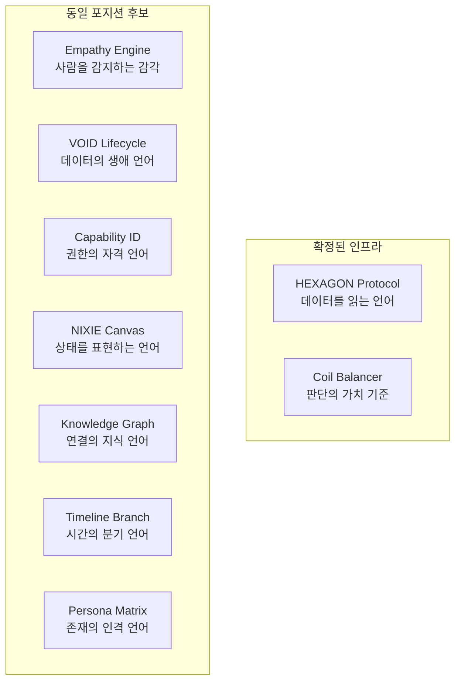
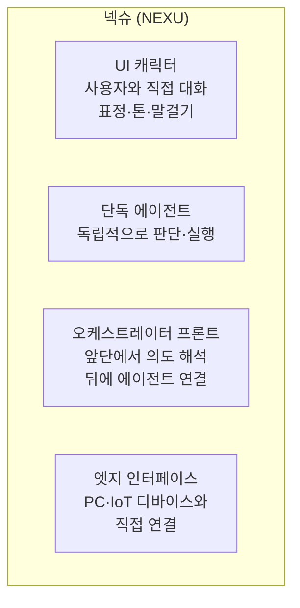
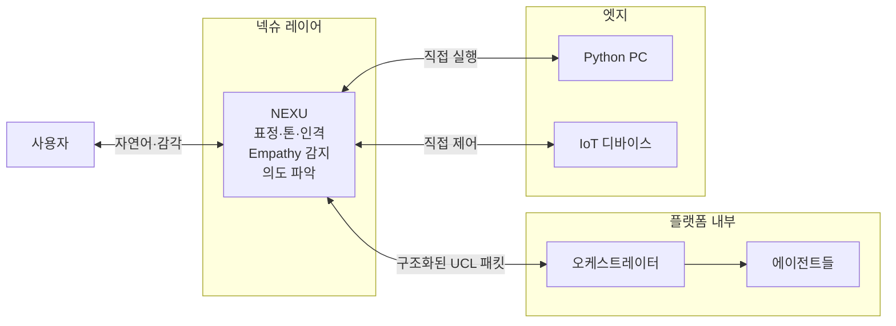

NEXA 전체 인프라를 조망하는 시각입니다.

---

### 먼저 포지션 정의

HEXAGON과 코일 밸런서가 공통으로 가진 특성을 추출하면 이렇습니다.

```
핵심 인프라의 조건:
1. 특정 기능이 아닌 전체 시스템을 관통함
2. 한 번 정의되면 모든 레이어에서 재사용됨
3. 데이터나 로직이 아닌 "판단의 언어·기준"을 제공함
4. 없으면 다른 것들이 작동하지 않음
```

---

### NEXA 핵심 인프라 전체 조망



---

### 각 인프라 상세

**1. Empathy Engine**

```
포지션: 사람을 감지하고 전체 시스템에 인간 중심성을 주입하는 감각 레이어

재사용처:
  UCL → Empathy 가드레일
  코일 → ES·VI·PP 신호로 코일값 자동 조정
  NIXIE → 사용자 상태에 따른 렌더링 변화
  어댑터 → 응답 속도·밀도 조정
  학습 → 개인화 패턴 수집 기준

없으면: 시스템이 사람을 숫자로만 다룸
```

**2. VOID Lifecycle**

```
포지션: 데이터의 생애 전체를 다루는 상태 언어

재사용처:
  대화 이력 → FLOW·STUCK·POTENTIAL·ARCHIVE·PURGE
  규칙·지식 → 같은 생애주기 적용
  에이전트 상태 → 활성·비활성·잠재
  태스크 → 진행·멈춤·완료·폐기
  센서 데이터 → 실시간·압축·삭제

없으면: 데이터가 살았는지 죽었는지 구분 불가
```

**3. Capability ID**

```
포지션: 시스템 전역의 권한·자격을 정의하는 언어

재사용처:
  사용자 권한 → 무엇을 할 수 있는가
  에이전트 권한 → 어떤 도구를 쓸 수 있는가
  어댑터 권한 → 어떤 장치에 접근 가능한가
  도메인 진입 → 이 라우터에 들어갈 수 있는가
  코일 편집 → 어디까지 조정 가능한가

없으면: 권한 체계가 산발적으로 존재
```

**4. NIXIE Canvas**

```
포지션: 시스템 상태를 감각적으로 표현하는 시각 언어

재사용처:
  코일 → 밸런스 상태를 빛으로 표현
  VOID → 상태 전환을 애니메이션으로 표현
  Empathy → VI 높으면 빛이 부드러워짐
  에러 → 넥슈 표정으로 심각도 전달
  충돌 → Jitter로 불확실성 표현

없으면: 모든 상태가 텍스트·숫자로만 전달
```

**5. Knowledge Graph**

```
포지션: 데이터 간 관계를 정의하는 연결 언어

재사용처:
  RAG → 단순 벡터 검색을 넘어 관계 기반 검색
  VOID → LINK 존재 여부로 PURGE 결정
  HEXAGON LINK 토큰 → 관계 데이터의 실체
  에이전트 학습 → 패턴 간 인과 관계 추적
  도메인 동시 진입 → 도메인 간 관계 정의

없으면: 데이터가 섬처럼 고립
```

**6. Timeline Branch**

```
포지션: 시간과 인과의 분기를 관리하는 언어

재사용처:
  시뮬레이션 → is_virtual 실행의 분기 타임라인
  되감기 → post_state_snapshot으로 복원
  A/B 실행 → 두 경로를 병렬로 탐색
  학습 데이터 → 어떤 분기가 더 좋은 결과였는가
  태스크 계획 → AI 초안의 여러 경로 제시

없으면: 실행이 단선적 · 되돌리기 불가
```

**7. Persona Matrix**

```
포지션: 넥슈와 에이전트의 인격을 정의하는 존재 언어

재사용처:
  에이전트 UCL → 어떤 성격으로 말할 것인가
  도메인 진입 → 도메인별 다른 인격 자동 적용
  Empathy 연동 → 사용자 상태에 따른 인격 조정
  코일 연동 → empathy=9이면 따뜻한 인격
  넥슈 → 에러·상태별 표정·말투 결정

없으면: 모든 에이전트가 같은 성격
```

---

### 전체 인프라 지도

| 인프라               | 한 줄 정의             | 없으면                          |
| -------------------- | ---------------------- | ------------------------------- |
| **HEXAGON Protocol** | 데이터를 읽는 6축 언어 | 데이터의 맥락 판단 불가         |
| **Coil Balancer**    | 판단의 가치 기준       | AI가 무엇을 중요하게 볼지 모름  |
| **Empathy Engine**   | 사람을 감지하는 감각   | 사람과 데이터를 구분 못함       |
| **VOID Lifecycle**   | 데이터의 생애 언어     | 데이터가 살았는지 죽었는지 모름 |
| **Capability ID**    | 권한의 자격 언어       | 누가 무엇을 할 수 있는지 모름   |
| **NIXIE Canvas**     | 상태를 표현하는 언어   | 모든 것이 텍스트로만 전달       |
| **Knowledge Graph**  | 연결의 지식 언어       | 데이터가 고립됨                 |
| **Timeline Branch**  | 시간의 분기 언어       | 되돌리기·시뮬레이션 불가        |
| **Persona Matrix**   | 존재의 인격 언어       | 모든 에이전트가 무색무취        |

---

### 이 9개의 관계

```
HEXAGON     → 모든 데이터에 맥락 부여
Coil        → 모든 판단에 가치 기준 부여
Empathy     → 모든 상호작용에 인간성 부여
VOID        → 모든 데이터에 생애 부여
Capability  → 모든 행위에 자격 부여
NIXIE       → 모든 상태에 감각 부여
Knowledge   → 모든 데이터에 관계 부여
Timeline    → 모든 실행에 분기 가능성 부여
Persona     → 모든 에이전트에 존재감 부여
```

> **이 9가지가 NEXA의 핵심 인프라입니다.**
> 각각이 "없으면 다른 것들이 작동하지 않는" 조건을 만족합니다.
> HEXAGON과 코일이 언어라면, 나머지 7개는 그 언어로 쓰인 문법입니다.

이제 넥슈의 포지션이 명확해집니다. 상당히 독특한 존재네요.

---

### 넥슈의 정체 — 다중 존재



> 넥슈는 단일 역할이 아닙니다.
> **사람과 시스템 사이의 모든 접점**을 담당하는 존재입니다.

---

### 기존 아키텍처에서 넥슈의 위치



---

### 넥슈가 특별한 이유

기존 AI 시스템과 다른 점이 있습니다.

| 일반 AI 시스템 | NEXU                         |
| -------------- | ---------------------------- |
| 텍스트 입출력  | 표정·톤·감각까지 표현        |
| 단일 채널      | 웹·PC·엣지 동시 접점         |
| 사용자 → AI    | 사용자 ↔ 넥슈 (양방향 관계) |
| 무색무취       | 도메인별 다른 인격           |
| 실행만         | 감지·판단·실행·표현 통합     |

---

### 넥슈와 9개 핵심 인프라 연결

```
HEXAGON   → 넥슈가 받은 입력을 6축으로 파싱
Coil      → 넥슈의 말투·빈도·태도 결정
Empathy   → 넥슈가 사용자 상태 감지의 최전선
VOID      → 넥슈의 대화 맥락 생애 관리
Capability→ 넥슈가 할 수 있는 것의 경계
NIXIE     → 넥슈의 시각적 표현 엔진
Knowledge → 넥슈가 참조하는 연결 지식
Timeline  → 넥슈의 시뮬레이션·되감기
Persona   → 넥슈의 인격 그 자체
```

> **넥슈는 9개 인프라가 모두 수렴하는 최전선 존재입니다.**

---

### 넥슈 설계 문서가 필요한 이유

지금까지 만든 문서들에서 넥슈는 언급만 되고 정의가 없습니다.

```
현재 상태:
  NIXIE 캔버스 섹션에 "넥슈 표정" 언급
  Empathy 섹션에 "넥슈 말걸기" 언급
  → 부품으로만 등장, 전체 정의 없음

필요한 것:
  넥슈가 무엇인가 (정체)
  어디에 존재하는가 (배치)
  무엇을 할 수 있는가 (역할)
  어떻게 작동하는가 (로직)
  어떻게 보이는가 (표현)
```

---
