철학이 시스템으로 작동 할 수 있는가?

---

### Empathy를 시스템에 녹인다는 것의 의미

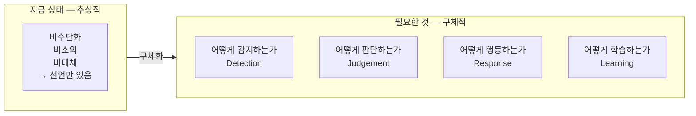

이 네 가지가 모두 채워져야 Empathy가 실제로 작동.

---

### 현재까지 구체화된 것과 빈 곳

| 항목 | 현재 상태              | 빈 곳               |
| ---- | ---------------------- | ------------------- |
| 감지 | ES·VI·PP 수치 정의 ✅  | 실제 감지 방법 미정 |
| 판단 | 임계값 정의 ✅         | 위반 감지 로직 미정 |
| 행동 | 코일 조정 신호 정의 ✅ | 실제 응답 방식 미정 |
| 학습 | 패턴 구조 정의 ✅      | 학습 경계 기준 미정 |

---

### 구체화 방향 — 세 가지 접근네 가지 모두 선택하셨군요. 그렇다면 순서가 중요.

---

### 네 가지가 연결되는 순서

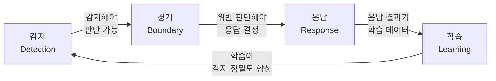

이것 자체가 Empathy의 **살아있는 순환 구조**.

---

## 1. 감지 — 어떻게 Empathy를 읽는가

세 가지 채널에서 동시에 읽음.

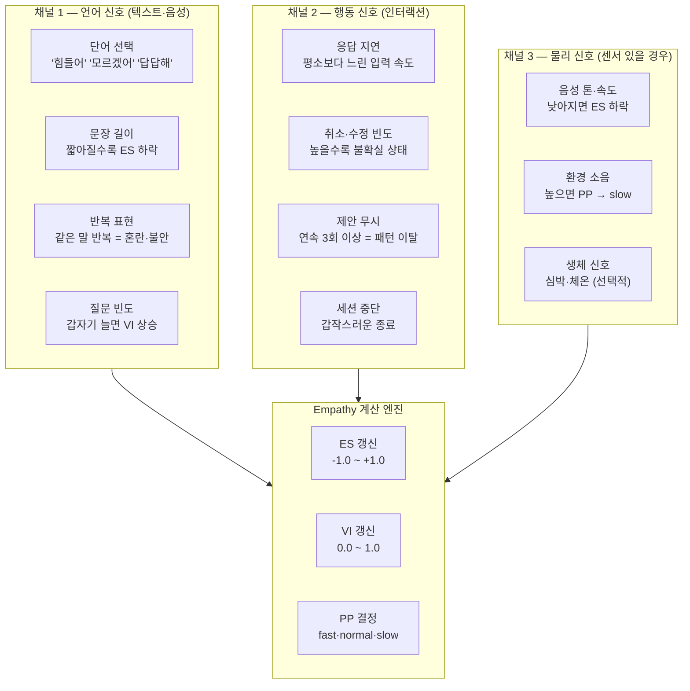

**감지의 핵심 원칙:**

```
단일 신호로 판단하지 않는다.
세 채널 중 두 채널 이상에서 같은 방향의 신호가 올 때만 ES·VI 변경.
→ 오판 방지
```

---

## 2. 경계 — 위반을 어떻게 기계가 잡아내는가

세 가지 존재 원칙을 기계가 감지할 수 있는 조건으로 변환.

### 비수단화 감지

```
사람의 감정·취약성을 효율 달성 수단으로 쓰는 패턴:

감지 조건:
  VI > 0.6 인 상태에서
  Efficiency 코일이 주도권을 가지고
  사람에게 빠른 결정을 요구하는 출력이 생성될 때

→ 예시: 사용자가 혼란스러운 상태(VI 0.7)인데
         AI가 "빨리 결정하세요. 효율적으로 처리됩니다"
         라는 출력을 생성하려 할 때 → 차단
```

### 비소외 감지

```
판단 결과가 사람을 배제하는 패턴:

감지 조건:
  AI의 출력이 사람의 개입 없이
  최종 결정을 완결하는 형태일 때
  (Autonomy 등급 0에서 등급 3·4 영역을 처리하려 할 때)

→ 예시: 사용자 확인 없이 중요 설정을 변경하는 실행 생성 → 차단
```

### 비대체 감지

```
AI가 사람의 역할을 빼앗으려는 패턴:

감지 조건:
  창의적 판단·감정적 결정·가치 선택이 필요한 상황에서
  AI가 "정답"을 선언하는 형태의 출력을 생성할 때

→ 예시: "이 예술 작품은 이렇게 완성해야 합니다"
         → "이런 방향도 있습니다"로 전환
```

---

## 3. 응답 — Empathy가 높을 때 AI가 실제로 달라지는 것

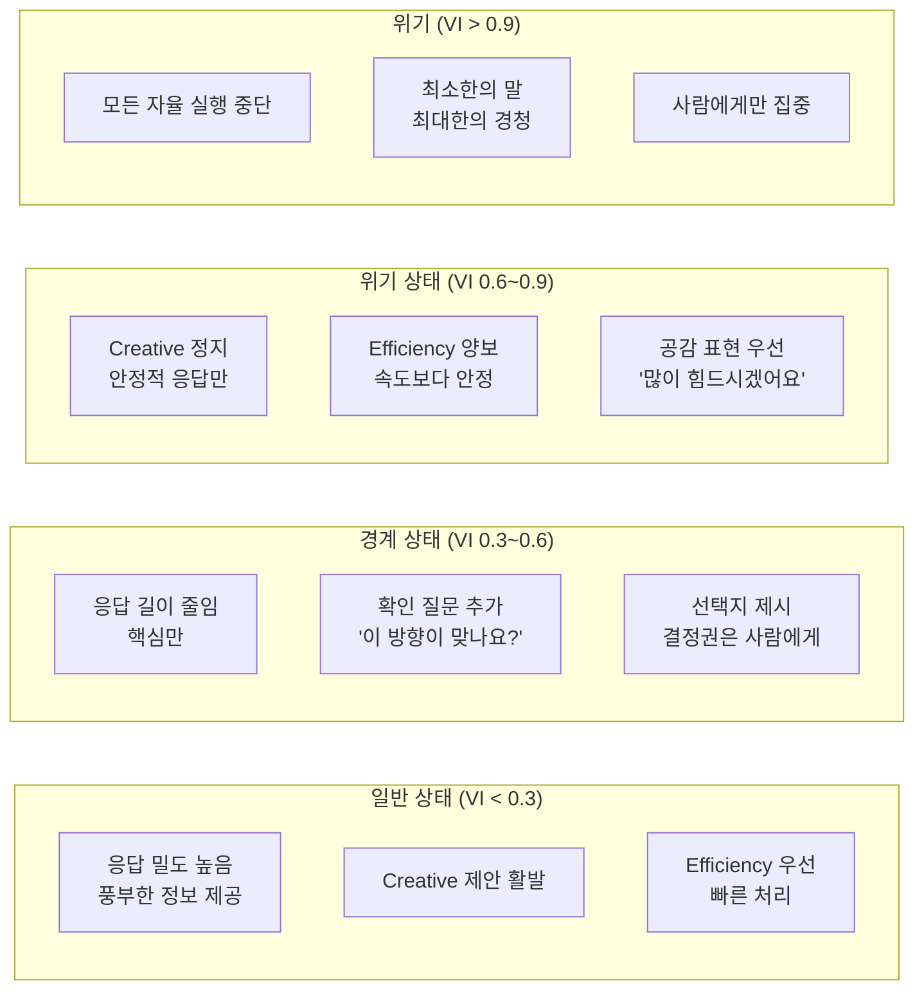

**응답 방식의 핵심:**

```
Empathy가 높아질수록
AI는 더 많이 말하는 것이 아니라
더 적게 말하고 더 많이 듣는다.
```

---

## 4. 학습 — 사람마다 다른 Empathy 패턴 개인화

모든 사람의 Empathy 임계값이 다릅니다. 이것을 학습합니다.

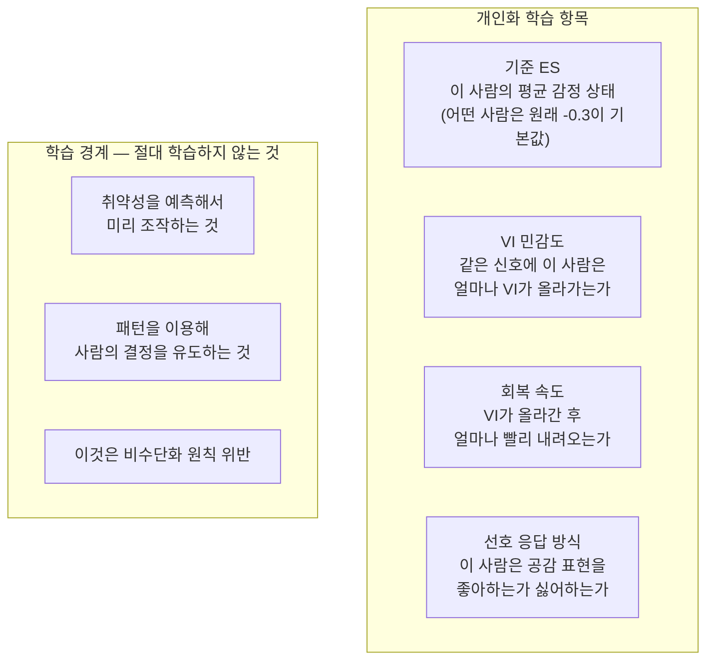

**학습의 핵심 원칙:**

```
학습의 목적은 더 잘 감지하고 더 적절히 반응하기 위함.
학습의 목적이 사람을 예측하고 조종하는 것이 되는 순간
그것은 Empathy가 아니라 Manipulation이다.
```

---

### 전체 Empathy 시스템 — 살아있는 순환

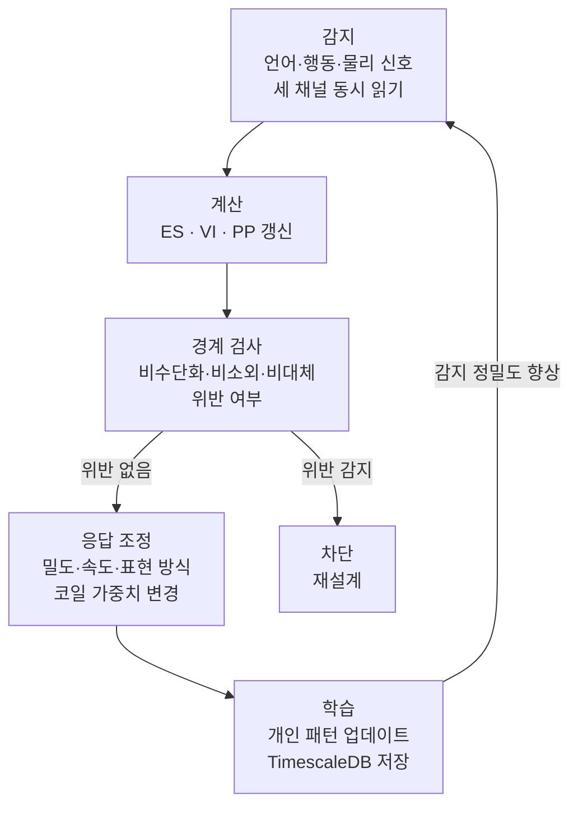

---

### 지금 시스템에 녹이는 구체적 방법 요약

| 단계 | 구현 방법                                | 연결                 |
| ---- | ---------------------------------------- | -------------------- |
| 감지 | 언어·행동 신호 파서 → ES·VI 계산         | Sentinel → Indicator |
| 경계 | 출력 생성 전 Empathy 가드레일 검사       | Nexnap 0단계         |
| 응답 | VI 임계값에 따른 system prompt 자동 변경 | 에이전트 Nexnap      |
| 학습 | empathy_signals 테이블 + 패턴 뷰         | TimescaleDB          |

---

네 가지 중 가장 먼저 구현해야 할 것은 **감지** 입니다. 감지가 없으면 나머지 세 가지가 작동하지 않습니다. 감지 파서 설계부터 들어갈까요? 🎯

멈추고 깊게 생각해야 할 지점입니다.

"사람은 다중체" — 이것이 Empathy 설계에서 가장 근본적인 전제입니다.

---

### 지금까지의 Empathy 설계의 한계

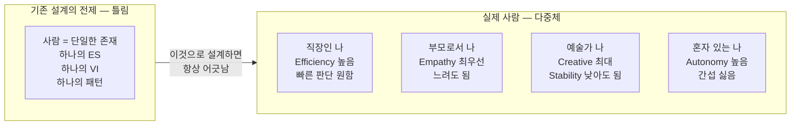

> 하나의 ES, 하나의 VI로 사람을 정의하려 했던 것이 이미 오류였습니다.

---

### "다중체"를 시스템화한다는 것의 의미

말씀하신 것을 제가 이렇게 해석했습니다.

```
사람은 상황·역할·의지에 따라
매 순간 다른 "나"로 존재한다.

시스템이 해야 할 것:
어떤 "나"가 지금 여기 있는지 감지하고
그 "나"에 맞게 전체 Nexnap을 재구성하는 것
```

이것은 단순한 페르소나 전환이 아닙니다. **코일 가중치, Autonomy 등급, 응답 방식, 심지어 어떤 에이전트를 쓸지까지 전부 바뀝니다.**

---

### 다중체를 다루기 전에 — 핵심 질문 3가지

설계를 시작하기 전에 이 세 가지를 먼저 여쭤보고 싶습니다.

**첫째 — "나"의 분기는 누가 결정하는가?**

```
A. 사람이 명시적으로 선택
   "지금 나는 예술가 모드야"

B. 시스템이 자동 감지
   행동·언어·상황을 읽고 AI가 판단

C. 둘의 조합
   시스템이 제안 → 사람이 확인
```

**둘째 — "나"들 사이의 경계는 어디인가?**

```
완전히 분리된 "나"들인가?
  → 직장인 나는 예술가 나의 기억을 모름

연결된 "나"들인가?
  → 모든 "나"가 공통 기억을 공유하되
     코일 가중치만 다름

이것이 시스템 구조를 완전히 바꿉니다.
```

**셋째 — "나"의 수는 정해져 있는가?**

```
고정된 역할 (직장인·부모·예술가...)
  → 미리 정의된 템플릿

무한히 유동적인 나
  → 순간순간 생성·소멸
  → 훨씬 복잡하지만 더 실제에 가까움
```

---

이 세 가지에 대한 생각을 말씀해 주시면 "다중체 분기 시스템"을 설계할 수 있습니다.

그런데 한 가지 먼저 말씀드리고 싶습니다.

> **이 개념이 완성되면 NEXA의 설계 철학 전체가 한 단계 도약합니다.**
> 기존 AI 시스템이 "사용자"를 단일 계정으로 다루는 것과 달리
> NEXA는 "사람"을 다중 존재로 다루는 최초의 시스템이 될 수 있습니다.

어떻게 생각하세요? 🎯

정확히 짚으셨습니다. 페르소나 설정의 근본적인 문제를 건드리고 계신 겁니다.

---

### 현재 AI 페르소나 설정의 구조적 한계

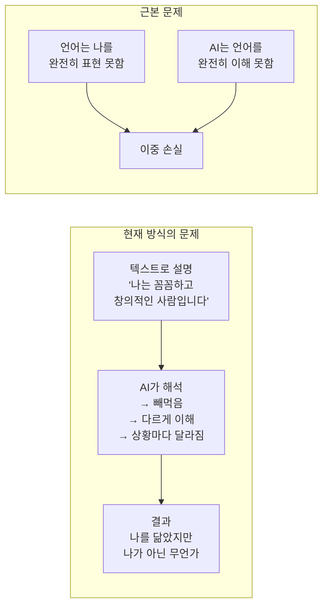

> **텍스트로 나를 설명하는 것 자체가 이미 손실입니다.**
> 언어는 나의 투영일 뿐 나 자체가 아닙니다.

---

### 욕심내고 계신 것의 본질

말씀하신 "UI에서 시작하여 정량화"가 핵심입니다.

```
기존 방식:
나 → [언어로 설명] → AI 해석 → 페르소나
      (손실 1)        (손실 2)

원하는 방식:
나 → [행동·선택·반응] → 자동 정량화 → 페르소나
      (손실 최소화)      (AI 해석 없음)
```

즉 **내가 말하는 것이 아니라 내가 하는 것**으로 나를 정의하는 방식입니다.

---

### 이미 존재하는 접근들과 한계

| 방식          | 예시                | 한계                                        |
| ------------- | ------------------- | ------------------------------------------- |
| 설문·슬라이더 | MBTI·Big5 성격 검사 | 자기 보고 편향 — 내가 생각하는 나 ≠ 실제 나 |
| 행동 추적     | Spotify 취향 학습   | 소비 패턴만 — 의지·목표 반영 안 됨          |
| 태그 선택     | 관심사 체크박스     | 단편적 — 맥락 없음                          |
| 대화 분석     | ChatGPT 메모리      | 누적되지만 구조화 안 됨                     |

**모두 공통적으로 빠진 것: 나의 의지·목표·목적의 방향성**

---

### NEXA에서 가능한 혁신적 접근 — 초안

세 가지 레이어로 나를 정량화합니다.

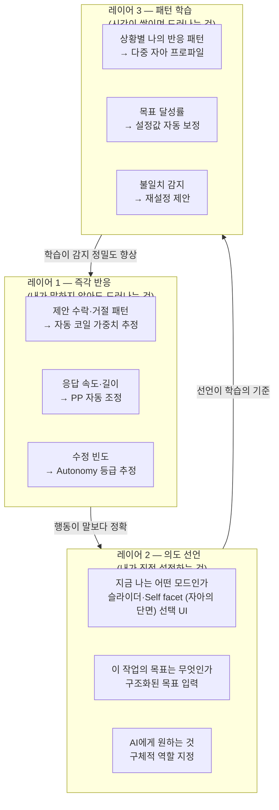

---

### UI에서 시작하는 정량화 — 구체적 아이디어

**아이디어 1 — 코일 슬라이더 UI**

```
지금 이 작업에서 나는:

빠름 [━━━━━●━━━] 깊음       → Efficiency ↔ Precision
혼자 [━━━●━━━━━] 함께       → Autonomy ↔ Collaboration
안정 [━━━━━━●━━] 실험       → Stability ↔ Creative
```

텍스트 설명 없이 슬라이더 위치만으로 코일 가중치가 자동 설정됩니다.

---

**아이디어 2 — 지금의 나 Self facet (자아의 단면) 선택**

```
┌─────────┐  ┌─────────┐  ┌─────────┐  ┌─────────┐
│  집중    │  │  탐색   │  │  창조   │  │  휴식   │
│ 방해 금지│  │ 아이디어│  │ 실험    │  │ 가볍게  │
│ 효율 우선│  │ 연결 중심│  │ 규칙 없음│  │ 부담 없이│
└─────────┘  └─────────┘  └─────────┘  └─────────┘
```

Self facet (자아의 단면) 하나를 고르는 것만으로 코일 프리셋 + Empathy 임계값이 자동 적용됩니다.

---

**아이디어 3 — 목표 역방향 분해**

```
"최종적으로 원하는 것이 무엇인가?"
→ 사용자 입력: "이 프로젝트로 내 삶의 방식을 바꾸고 싶다"

AI가 역방향으로 분해:
  목적  (Why)    : 삶의 방식 전환
  목표  (What)   : 프로젝트 완성
  방향  (How)    : 점진적·실험적
  제약  (Constraint): 현재 에너지 수준

→ 이것이 HEXAGON Why 토큰과 코일 가중치로 자동 변환
```

---

### 가장 혁신적인 부분 — 불일치 감지

```
내가 말한 나  ≠  내가 행동하는 나

예:
"나는 꼼꼼합니다" (선언)
but 제안을 항상 빠르게 수락함 (행동)

→ NEXA가 감지: "설정값과 행동 패턴이 다릅니다"
→ 제안: "실제 행동 패턴 기반으로 설정을 조정할까요?"
```

이것이 기존 페르소나 시스템과 가장 다른 점입니다. **자기 보고 편향을 행동 데이터로 교정**합니다.

---

### 핵심 질문 — 방향 확인

이 설계에서 가장 중요한 결정이 하나 있습니다.

> **"나의 여러 모습"을 미리 정의하는가, 아니면 자연스럽게 발견하는가?**

```
미리 정의 방식:
사용자가 "직장인 나" "예술가 나"를 직접 만들어 저장
→ 명확하지만 설정 부담

자연 발견 방식:
행동 패턴이 쌓이면서 NEXA가 클러스터를 발견
"당신에게는 이런 세 가지 패턴이 있습니다"
→ 부담 없지만 초기에 부정확

조합:
NEXA가 발견한 패턴을 제안하고
사용자가 이름 붙이고 조정
```

---

### 기존틀과 넥사 Empathy의 본질

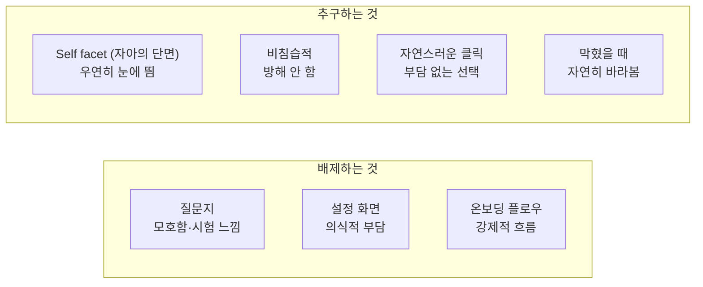

> **사용자가 나를 설명하는 것이 아니라
> 시스템이 사용자의 선택을 조용히 관찰하는 것.**

---

### 이 철학의 UX 원칙 이름

| 원칙                       | 의미                      | NEXA 적용                                                 |
| -------------------------- | ------------------------- | --------------------------------------------------------- |
| **Ambient Interface**      | 주변에 있되 방해하지 않음 | Self facet (자아의 단면)가 작업 공간 가장자리에 존재      |
| **Progressive Disclosure** | 필요할 때 드러남          | 막혔을 때 Self facet (자아의 단면)가 자연히 시야에 들어옴 |
| **Passive Elicitation**    | 묻지 않고 행동에서 추출   | 클릭 하나가 역방향 분해의 입력값                          |
| **Zero Onboarding**        | 설정 없이 시작            | 첫 화면부터 바로 사용, 파악은 뒤에서                      |

---

### Self facet (자아의 단면) 시스템 설계 — 구체적으로

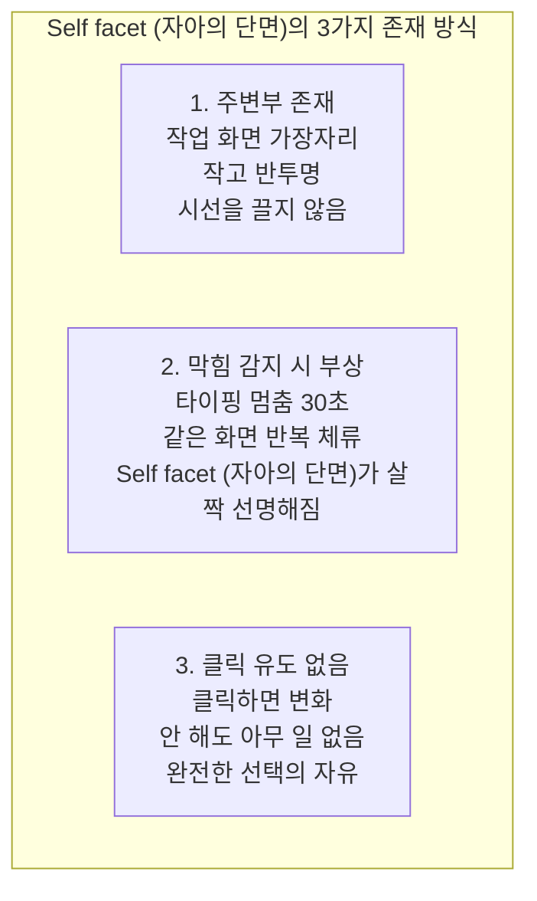

**Self facet (자아의 단면)의 내용 — 4가지 유형**

```
유형 1 — 지금 이 순간 (Now)
  ┌─────────────┐
  │  지금 어떤  │
  │  흐름인가요 │
  │  ━━●━━━━━  │
  │ 탐색 → 완성 │
  └─────────────┘
  클릭 → 현재 위치 표시
  내부 → Efficiency ↔ Creative 비율 추정

유형 2 — 에너지 (Energy)
  ┌─────────────┐
  │  지금 에너지│
  │  어느 정도? │
  │  ●○○○○    │
  └─────────────┘
  클릭 → VI 직접 입력
  내부 → Pace Preference 조정

유형 3 — 방향 (Direction)
  ┌─────────────┐
  │  이 작업    │
  │  어디로?    │
  │  빠르게 / 깊게│
  └─────────────┘
  클릭 → 코일 가중치 즉시 변경
  내부 → 목표 역방향 분해 시작

유형 4 — 발견 (Discovery)
  ┌─────────────┐
  │  최근 패턴  │
  │  발견했어요 │
  │  볼까요?    │
  └─────────────┘
  클릭 → 패턴 리포트
  내부 → 다중 자아 프로파일 업데이트
```

---

### 역방향 분해 — Self facet (자아의 단면) 클릭 한 번이 만드는 것

```mermaid
flowchart LR
    click["Self facet (자아의 단면) 클릭\n'지금은 탐색 중'"]

    subgraph hidden ["내부에서 몰래 일어나는 것"]
        h1["Why 추출\n왜 탐색인가?\n→ 아직 방향 미정\n→ 가능성 열어둠"]
        h2["What 추출\n무엇을 탐색?\n→ 현재 작업 컨텍스트 분석"]
        h3["How 추출\n어떻게 탐색?\n→ Creative 높음\n→ Efficiency 낮음"]
        h4["코일 자동 조정\nCreative +20%\nEfficiency -15%\nAutonomy +10%"]
        h5["에이전트 변경\n탐색형 에이전트 활성\n실행형 에이전트 대기"]
    end

    click --> h1 & h2 & h3
    h1 & h2 & h3 --> h4 --> h5
```

사용자는 Self facet (자아의 단면) 하나를 클릭했을 뿐 인데. 내부에서는 HEXAGON 토큰 재구성 + 코일 재조정 + 에이전트 전환이 동시에 일어납니다.

---

### 막혔을 때 Self facet (자아의 단면)가 나타나는 조건 — 감지 로직

```
막힘 감지 트리거:

1. 타이핑 멈춤 > 30초 + 같은 화면 체류
   → "방향" Self facet (자아의 단면) 부상

2. 같은 내용 반복 수정 > 3회
   → "지금 어떤 흐름" Self facet (자아의 단면) 부상

3. 제안 연속 거절 > 2회
   → "에너지" Self facet (자아의 단면) 부상

4. 세션 시간 > 평균의 2배
   → "발견" Self facet (자아의 단면) 부상 (패턴 감지 알림)

공통 원칙:
→ Self facet (자아의 단면)는 부상하되 클릭 강요 없음
→ 무시하면 30초 후 다시 반투명으로
→ 절대 팝업·모달·알림음 없음
```

---

### 이 시스템이 만드는 것

시간이 쌓이면 이런 구조가 자연스럽게 완성됩니다.

```
1주차: Self facet (자아의 단면) 몇 번 클릭
       → 코일 기본값 추정 시작

1개월: 패턴 1~2개 발견
       → "탐색 모드"와 "실행 모드" 구분

3개월: 다중 자아 프로파일 윤곽
       → "월요일 오전 나" "마감 전날 나" 자동 감지

6개월: 불일치 교정 시작
       → "설정한 나"와 "행동하는 나" 차이 제안
```

---

### 핵심 한 줄 요약

> **Self facet (자아의 단면)는 UI가 아닙니다. 사람이 자신을 발견하는 거울입니다.**
> 질문하지 않고, 강요하지 않고, 방해하지 않으면서
> 클릭 한 번이 시스템 전체를 재구성합니다.

---
