## AI 오케스트레이터 아키텍처에서 각 요소의 위치와 역할

## 1. 기초편: 정의와 실행 원리

### UCL 정체성 먼저 고정하기 (Unified Communication Layer (통합 통신 계층))

이 문서에서는 UCL을 아래 2개로 분리해 정의합니다.  
이 기준을 고정하면 "UCL이 인프라인가, 프로토콜인가?"라는 혼동이 사라집.

#### 1) UCL Layer (개념 계층)

- 오케스트레이터가 사용자 의도(WILL)와 상황(Context)을 해석하고 실행 사슬로 관리하는 **공유 실행 계층**이다.
- 책임: 목표 해석, 태스크 분해, 상태 추적, 충돌 조정, 컨텍스트 축적.
- 질문으로 표현하면: **"무엇을, 왜, 어떤 순서로 실행할 것인가?"**

#### 2) UCL Protocol (전송 규격)

- UCL Layer에서 결정된 내용을 에이전트/외부 실행기로 전달하는 **패킷 규격 + 전송 방식**이다.
- 책임: 스키마(JSON/Protobuf), 필수 필드, 상태 코드, 왕복 인터페이스, 전송 채널(gRPC/HTTP/MQTT).
- 질문으로 표현하면: **"그 결정을 어떤 봉투 형식으로 어떻게 보낼 것인가?"**

#### 3) 핵심 원칙: 데이터와 규격을 분리한다

- 페르소나/스킬/태스크/컨텍스트는 **UCL에 담기는 데이터**이다.
- UCL Protocol은 그 데이터를 담는 **봉투 형식(스키마/인터페이스)** 이다.
- 즉, **내용물(정책/맥락)** 과 **봉투(전송 규격)** 를 분리해서 설계해야 합니다.

#### 4) UCL의 본질적 역할: 재가공과 전달

UCL Layer는 멀티모달 입력을 HEXAGON(5W1H) 토큰으로 정규화하고, Why Chain/Decision Matrix를 통해 실행 모드를 결정한다.  
UCL Protocol은 이 결정을 실행 가능한 패킷으로 포장해 에이전트로 전달하고, 결과를 다시 오케스트레이터로 회수한다.

- **정규화:** 입력을 공통 의미 단위로 표준화
- **의사결정:** 충돌 해소 후 실행 전략 확정
- **전달/회수:** 실행 패킷 전송 + 결과 상태 재수집

#### 5) VOID와 영감 모드의 위치

VOID/ASK/WILL 같은 상태 전이는 **UCL Layer의 상태 모델**에 속한다.  
이 상태를 wire format으로 표현하는 방법(코드값, 필드명, 에러 규격)은 **UCL Protocol**에 속한다.

---

**정리:**

- UCL은 하나가 아니라 "UCL Layer(의미/정책)" + "UCL Protocol(형식/전송)"의 결합 구조이다.  
  앞으로 본문에서 UCL을 언급할 때는 가능한 한 두 용어를 명시합니다.

- RAG와의 협업 지도: UCL이 단순한 데이터 뭉치가 아니라, RAG라는 거대 창고를 뒤지는 **'지능적 인덱스'**

- 에이전트와의 경계: UCL이 에이전트 내부에 있는 것이 아니라, 에이전트들이 공통으로 올라타는 **'공용 인프라 층'**

---

### 영어 커널 - 다국어 쉘 전략 (English Kernel / Multilingual Shell)

UCL의 효율성을 극대화하기 위해, **내부 엔진이 소통하는 '악보'는 영어로 유지**하는 원칙을 채택한다.

| 관점            | 이유                                                                                                                    |
| --------------- | ----------------------------------------------------------------------------------------------------------------------- |
| **토큰 효율**   | 한글은 영문에 비해 토큰 소모량이 2~3배 많다.                                                                            |
| **논리 일관성** | AI 모델의 논리적 일관성은 영문 데이터에서 더 높게 나타난다.                                                             |
| **이원화 운영** | 사용자는 UI에서 한국어로 페르소나를 작성해도, 오케스트레이터는 이를 **내부적으로 영문 UCL로 번역하여 AI에게 주입**한다. |

**주의:** 번역 자체도 자원 소모이므로 속도 저하가 발생할 수 있다.  
따라서 도메인·프로젝트·기능을 세분화하여 **전략적으로 번역 범위를 제한**하는 설계가 필요하다. 예를 들어, 고빈도 경로는 영문 UCL을 그대로 사용하고, 사용자 대면 UI에서만 다국어를 적용하는 방식으로 부하를 분산한다.

---

### **사용자 요청(WILL)** 단계를 3개의 핵심 채널 그룹으로 분화하고, **NEXA 플랫폼의 전체적인 입력 방향성**

NEXA의 **멀티모달 입력(Listen)** 및 **5W1H(HEXAGON) 프로토콜** 체계에 따라 오케스트레이터로 유입되는 중요한 입력 채널 입니다.

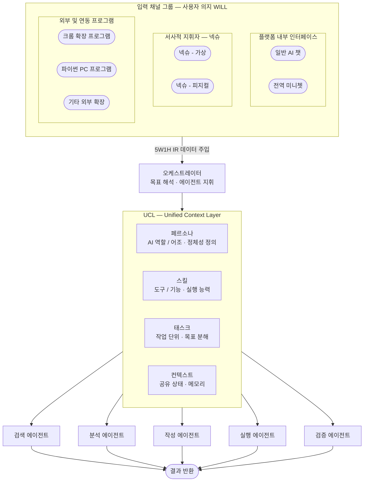

#### 각 입력 그룹의 역할 및 설계적 근거

1.  **플랫폼 내부 인터페이스 (Internal UI):**

    - 사용자가 웹 플랫폼 내부에서 직접적으로 의도(WILL)를 전달하는 가장 기본적인 채널입니다.
    - 일반 챗과 미니쳇은 **Vercel AI SDK** 인터페이스를 통해 실시간 스트리밍 응답을 제공받습니다.

2.  **서사적 지휘자 - 넥슈 (NEXU):**

    - **넥슈(가상):** 모니터 상에서 사용자의 시선과 행동 패턴을 읽어내어 **'맥락적 침묵'**이나 **'영감 모드'**를 제안하는 지능형 가이드입니다.
    - **넥슈(피지컬):** 화면 밖으로 나와 파이썬 프로그램 등과 통신하며 물리적 공간에서 활동하는 **엣지 디바이스** 자격의 넥슈입니다 [Conversation History]. 이들은 사용자의 '언어 너머의 뜻'을 UCL로 번역하는 핵심 창구가 됩니다.

3.  **외부 및 연동 프로그램 (External Apps):**
    - 크롬 확장 프로그램이나 파이썬 기반 PC 프로그램 등 플랫폼 외부에서 발생하는 요청들입니다.
    - 이들은 **API** 또는 **MQTT** 프로토콜을 통해 오케스트레이터에 접속하며, 유입되는 모든 데이터는 **5W1H IR(중간 표현)**로 표준화되어 처리됩니다.

#### 설계 보강을 위한 제언

- **데이터 표준화:** 위 모든 채널에서 들어오는 요청은 오케스트레이터 진입 전 **IoT Stream Splitter**와 **Contextual Chunking** 노드를 거쳐 헥사곤 토큰으로 변환됩니다.
- **독립적 넥슈:** 특히 넥슈 피지컬은 오프라인 단독 기능을 구현하더라도, 다시 연결되는 순간 **'그림자 프로젝트 ID'**를 통해 그동안의 활동 데이터를 플랫폼으로 흡수시켜 지능 성장에 기여하게 됩니다.

---

### 지능 위계(Nano, Micro, Vista)에 따른 UCL 처리 분담

모든 UCL 연산이 중앙 서버에서만 일어나지 않는다. 엣지와 플랫폼이 역할을 나누어 처리한다.

| 위계                    | 위치                             | UCL 역할                                                                                                       |
| ----------------------- | -------------------------------- | -------------------------------------------------------------------------------------------------------------- |
| **Nano / Micro (엣지)** | 넥슈 피지컬, 센서, 로컬 에이전트 | 로우 데이터를 5W1H **사실(Fact)**로 요약하여 UCL 패킷의 기초 형성. 인디케이터 부하 약 90% 절감.                |
| **Vista (플랫폼)**      | 오케스트레이터, 넥사 코일        | **넥사 코일 밸런스**(시스템·도메인·프로젝트 레이어별)를 적용하여 'Why(판단)'를 부여하고 전체 실행 사슬을 조율. |

**효과:** 이 분업 구조는 응답 속도를 높이고, **인터넷이 끊긴 상태에서도 엣지가 오프라인 자율성**을 갖게 하는 핵심 근거가 된다.

---

### 에이전트의 정확한 구성

일반적으로 에이전트는 이렇게 구성.

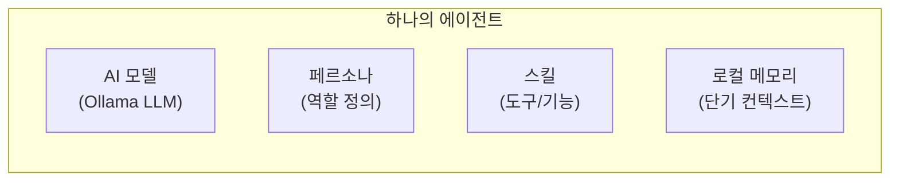

즉 **AI 모델 + 페르소나 + 스킬 + 로컬 메모리** 를 묶은 것이 하나의 에이전트입니다.

---

### UCL은 에이전트 안에 있는 게 아닙니다

여기서 중요한 구분이 있습니다.

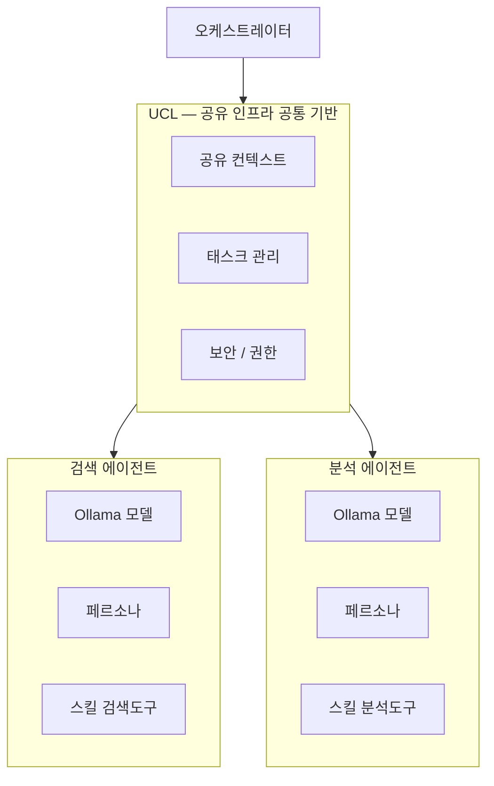

| 구분     | 위치              | 역할                          |
| -------- | ----------------- | ----------------------------- |
| 페르소나 | 에이전트 **내부** | 그 에이전트만의 역할 정의     |
| 스킬     | 에이전트 **내부** | 그 에이전트가 쓸 수 있는 도구 |
| 태스크   | UCL **(공유)**    | 오케스트레이터가 분배·추적    |
| 컨텍스트 | UCL **(공유)**    | 모든 에이전트가 함께 참조     |

---

### Ollama 기반 Node.js + Vue 환경에서 실제로 보면

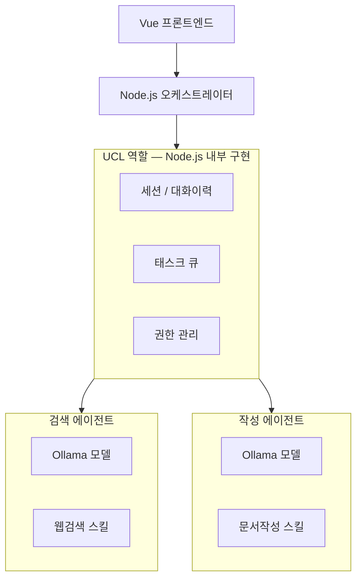

현재 구조에서 **Node.js 서버가 오케스트레이터 + UCL 역할을 함께 담당**하고, Ollama 모델 호출이 각 에이전트의 핵심이 되는 형태입니다.

---

### 정리

> **에이전트 = AI 모델(Ollama) + 페르소나 + 전용 스킬**

> **UCL은 에이전트 안이 아니라, 에이전트들이 공통으로 올라타는 인프라 층**

쉽게 비유하면, 에이전트는 **직원**이고 UCL은 **회사의 공용 시스템(ERP, 사내망)**입니다. 직원마다 자기 역할(페르소나)과 전문 능력(스킬)은 갖고 있지만, 회사 데이터와 업무 지시는 공용 시스템을 통해 공유됩니다.

---

### UCL의 본질적 정의

> UCL = "이질적인 데이터와 명령을 하나로 묶는 표준 통신 인터페이스"
> [데이터 규격 + 전송 프로토콜 + 인터페이스 정의]의 삼박자가 합쳐진 체계

- 규격화 (Schema): IoT의 Raw 데이터(MQTT)와 DB의 컨텍스트(Postgres)를 AI 에이전트가 즉시 이해할 수 있는 공통 언어로 변환하는 규칙.
- 통로 (Protocol): 오케스트레이터와 AI 서버 사이에서 데이터를 실어 나르는 물리적 방식 (예: gRPC).
- 상호작용 (Interface): 에이전트가 결과를 냈을 때, 다시 오케스트레이터에게 어떤 항목(토큰 사용량, 장치 제어 값 등)을 되돌려줄지 정한 약속.

* 요약하자면
  실제 개발 단계에서의 UCL은 '통신 규약(Protocol)'입니다.
  "무엇을 참고할지"를 정했다면, 이제 그 참고 자료를 "어떤 봉투(UCL 규격)에 담아, 어떤 퀵서비스(gRPC/MQTT)로 보낼지"까지가 UCL의 정의 입니다.

> Request (UCL 규격): 웹 서버(Vercel AI SDK) → UCL (gRPC/HTTP) → AI 서버(Ollama/LangChain)

---

### 오케스트레이터 UCL vs 에이전트 UCL

두 레벨에 모두 존재하되 **다른 역할**을 가집니다.

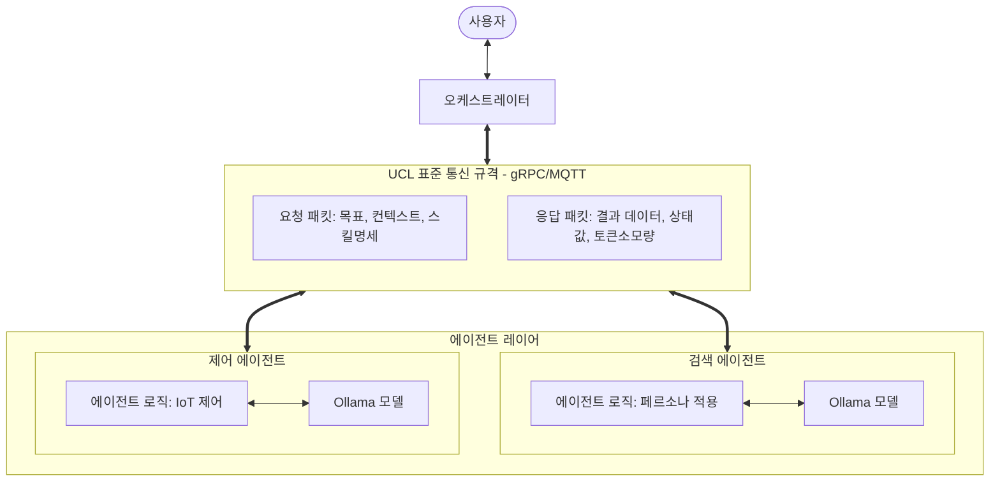

UCL의 위치 변경: UCL을 오케스트레이터나 에이전트의 '내부 구성 요소'가 아닌, 그들 사이의 '중간 지점(인터페이스)'으로 놓으세요.
데이터 vs 규격 구분: '페르소나'나 '태스크 분배'는 UCL에 담길 '데이터'이지 UCL '자체'가 아닙니다. UCL은 "그 데이터를 어떤 형식(JSON/Protobuf)으로 실어 나를 것인가"에 대한 정의서입니다.
양방향성 명시: 에이전트가 처리한 결과물을 다시 UCL 규격에 맞춰 오케스트레이터에게 던져주는 화살표가 반드시 필요합니다.
결론적으로, UCL은 에이전트의 '성격'을 규정하는 것이 아니라, 에이전트와 오케스트레이터가 대화하는 '공통 언어와 우편 시스템'입니다.

---

"중앙 집중형(Orchestration)"과 "분산 자율형(Choreography)"은 UCL 설계에서 핵심 비교 대상입니다.
IoT 플랫폼에서는 직행 처리 효율이 높을 수 있으나, UX 일관성과 안전성 측면에서는 오케스트레이터의 최종 확인 단계를 두는 편이 유리합니다.
아래는 두 방식의 UCL 관점 비교입니다.

1. 에이전트가 직접 결과물을 내놓는 경우 (Choreography)
   오케스트레이터는 "A해"라고 트리거만 당기고 손을 떼는 방식입니다.

- 장점: 속도가 빠릅니다. 오케스트레이터가 병목 현상을 일으키지 않습니다.
- 단점: 에이전트가 사고를 쳤을 때(예: 잘못된 IoT 기기 제어 명령) 수습할 주체가 없습니다. 또한, 사용자에게 "작업이 끝났다"고 알려줄 최종 지점이 모호해집니다.
- UCL의 역할: 이때 UCL은 에이전트가 사용자 UI(Vercel AI SDK)나 MQTT 브로커에 직접 데이터를 쏘는 '직통 통로'가 됩니다.

2. 오케스트레이터를 거쳐 나가는 경우 (Orchestration - 추천)
   에이전트가 UCL 규격에 맞춰 오케스트레이터에게 결과를 돌려주고, 오케스트레이터가 이를 검토 후 사용자에게 전달합니다.

- 장점 (검증): AI(Ollama)가 내놓은 결과가 IoT 장비에 치명적인 오류를 일으키지 않는지 오케스트레이터가 최종 필터링할 수 있습니다.
- 장점 (상태 관리): "에이전트 A는 성공, B는 실패"와 같은 전체 상황판을 오케스트레이터가 쥐고 있어야 다음 명령을 내릴 수 있습니다.
- UCL의 역할: 에이전트와 오케스트레이터 사이의 '보고 체계'가 됩니다.

Vercel AI SDK 환경은 기본적으로 서버(Node.js)가 클라이언트 연결을 유지하며 스트리밍하는 구조입니다.
따라서 다음 흐름이 자연스럽습니다.

1.  사용자 → 오케스트레이터(Node.js)
2.  오케스트레이터 → (UCL/gRPC) → 에이전트 (Ollama/LangChain)
3.  에이전트 → (UCL/gRPC Stream) → 오케스트레이터 (실시간 결과 반환)
4.  오케스트레이터 → (Vercel AI SDK) → 사용자 (최종 출력)

"에이전트가 직접 실행한다"는 개념은 "에이전트가 오케스트레이터를 통해 실시간 데이터를 반환한다"로 해석하면 통제성과 속도를 함께 확보할 수 있습니다.
플랫폼 규모가 커질수록 단일 원칙 고정은 병목 또는 통제 불능을 만들 수 있으므로, UCL 규격을 기준으로 두 방식을 상황별로 병행 운영하는 전략이 적합합니다.

1. "지휘형 (Orchestration)"이 필요한 시나리오

- 복합 태스크: "집안 온도를 낮추고, 그 결과를 나에게 리포트해줘." (제어와 보고가 동시에 일어날 때)
- 안전 검증: AI가 "전력을 차단해"라고 했을 때, 오케스트레이터가 DB의 현재 장치 상태를 보고 "지금은 차단하면 안 돼"라고 거절해야 하는 경우.
- 사용자 피드백: Vercel AI SDK를 통해 사용자 화면에 실시간 답변을 뿌려줘야 할 때.

2. "직행형 (Choreography)"이 필요한 시나리오

- 단순 자동화: "조도가 10lux 이하로 떨어지면 불을 켜." (사용자 개입 없이 장치 간 상호작용만 일어날 때)
- 대량 데이터 처리: 수백 대의 센서 데이터를 AI가 분석해서 결과값을 바로 DB나 다른 장치로 쏠 때 (오케스트레이터의 부하 방지).
- MQTT 직접 제어: AI 에이전트가 판단 후 즉시 특정 Topic으로 제어 신호를 날리는 경우.

핵심은 UCL의 '봉투' 내용입니다
오케스트레이터의 판단: "이건 사용자에게 보고할 사안인가, 아니면 장비를 즉시 제어할 사안인가?"를 먼저 결정합니다.

---

### 실시간 실행 계층: 실행 사슬(Execution Chain)

UCL은 단순히 '전달되는 패킷'을 넘어, **현실에서 어떻게 연주되고 있는지** 관리하는 실시간 상태 개념을 갖는다. 이 계층은 [NEXA-UCL-04] 실행 사슬 생명주기 및 VOID 규격과 연동된다.

UCL 프로토콜에 의해 생성된 패킷은 DB의 `execution_chains` 및 `execution_steps` 테이블과 연동되어 다음 세 가지 상태를 가진다.

| 상태             | 의미                                                                                                    |
| ---------------- | ------------------------------------------------------------------------------------------------------- |
| **FLOW (유동)**  | 실행 및 인지 흐름이 활성화된 상태. 에이전트가 임무 수행 중이거나 대화 맥락이 살아 있는 '현재'.          |
| **STUCK (고착)** | 마찰·충돌·응답 지연으로 흐름이 막힌 상태. 넥슈의 Jitter(떨림) 연출이나 ASK(승인 대기) 토큰 발생.        |
| **VOID (여백)**  | 물리적 삭제가 아닌 '잠재 상태'로의 전환. 기존 맥락을 비우고 영감 모드 진입 또는 데이터 아카이브로 압축. |

**타임머신 기능의 토대:** 이 구조를 통해 가상 시뮬레이션에서 실행 결과를 앞뒤로 돌려보는 '타임머신(뒤로가기/앞으로가기)' 기능의 데이터 기반을 아키텍처 단계에서 확보할 수 있다. `execution_steps`의 `post_state_snapshot`, `timeline_branch_id`, `is_virtual` 등이 이 용도로 활용된다.

---

### Ollama + Node.js 환경에서 재료를 어떻게 다룰 것인가?

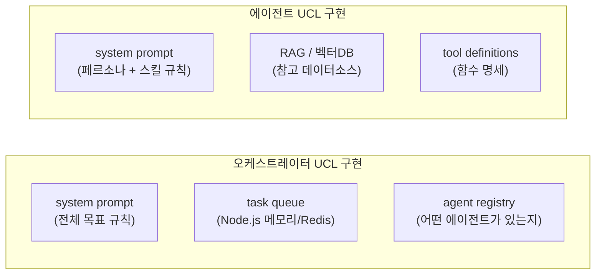

### Ollama + Node.js 환경에서 UCL > 어떤 형식으로 담아 보낼 것인가.


---

### 최종 정의 요약

> **UCL은 오케스트레이터와 에이전트 각각에 존재하며,** > **"어떤 연료(데이터)를, 어떤 툴로, 어떤 규칙으로 참고할지"를 명확히 규정한 설계 계층입니다.**

실제 코드로 보면 대부분 **system prompt + tool definitions + 데이터소스 명세** 의 조합으로 구현됩니다. Ollama에서는 이것이 곧 각 모델 호출 시 전달하는 `system` 필드와 `tools` 배열이 됩니다.

위 구조는 **확장 가능한 AI 플랫폼 설계의 핵심 철학**입니다.

---

### 레이어별 편집 권한 구조

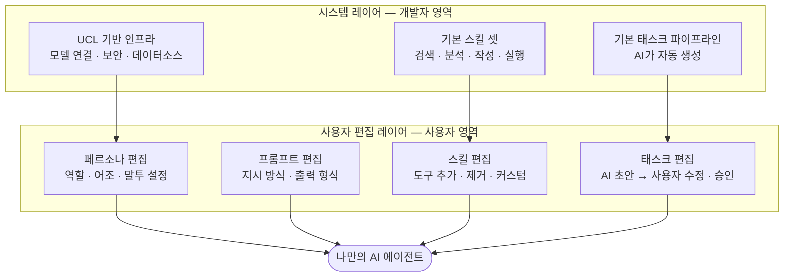

---

### 편집 가능 범위를 단계별로 열어주는 설계

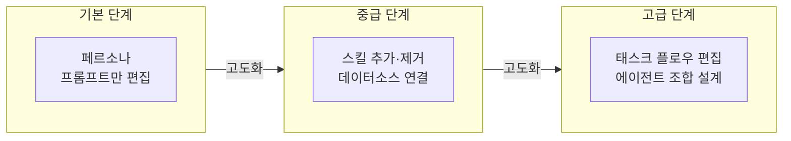

---

### 이 철학이 왜 좋은 시스템인가

| 관점                 | 이유                                                         |
| -------------------- | ------------------------------------------------------------ |
| **사용자 진입 장벽** | 기본값이 있으니 처음부터 막막하지 않음                       |
| **확장성**           | 익숙해질수록 더 깊이 커스터마이징 가능                       |
| **안정성**           | 시스템 레이어는 건드릴 수 없으니 핵심 UCL은 보호됨           |
| **UCL 철학 유지**    | 사용자가 편집해도 "무엇을 참고할지 규정"이라는 본질은 유지됨 |

---

### 실제 잘 만들어진 사례들

> - **ChatGPT GPTs** — 페르소나·프롬프트·스킬(플러그인) 편집 가능
> - **Dify / Flowise** — 태스크 플로우까지 사용자가 직접 설계
> - **Coze (ByteDance)** — 스킬·태스크·에이전트 조합까지 노코드로 편집

핵심 제약은 **컨텍스트 윈도우(Context Window) 한계**입니다.

---

### 컴팩트하고 효과적인 UCL 구성을 위한 UI 처리

사용자의 언어적 취향을 자연어 대화가 아닌 **UI 시스템 설정으로 분리**하면, UCL을 '명령과 데이터'에만 집중하게 만들 수 있다. NEXA NIXIE UI 연동을 고려한 4개 레이어로 구성한다.

#### 1. 응답 제어 레이어 (Output Control)

사용자가 매번 채팅으로 지시하지 않아도, UI 설정값만으로 모델의 답변 스타일을 강제한다.

| 항목                         | 옵션                               | 비고                                                    |
| ---------------------------- | ---------------------------------- | ------------------------------------------------------- |
| **언어 설정 (Language)**     | KO, EN, JP 등                      | AI에게 "이 언어로 답변해"를 시스템 프롬프트에 자동 주입 |
| **답변 톤 (Persona Tone)**   | Professional, Friendly, Concise 등 | 전문적·친절한·요약형                                    |
| **이모지 사용 (Use Emojis)** | ON / OFF                           | 텍스트 전달 시 가독성 결정                              |
| **상세도 (Verbosity)**       | Summary, Detailed, Step-by-step    | 요점만 / 상세히 / 단계별 설명                           |
| **확신도 임계값 (Autonomy Threshold)** | 기본 95, 사용자 조정 `±15%` | `project_settings.user_defined_threshold`에 저장, 실행 게이트로 사용 |

**설계 원칙 (Must):**
- Autonomy Threshold의 시스템 기본값은 **95점**이다.
- 사용자는 UI 슬라이더로 **`95 ± 15%` 범위**에서 임계값을 직접 조정할 수 있다.
- 임계값은 도메인 성격(Hard vs Soft)에 맞춰 AI 자율성 폭을 사용자가 제어하기 위한 장치다.
- 목적은 불필요한 `ASK` 펄스를 줄여 실행 대기 토큰을 절감하고, 추론·검증에 소모되는 컨텍스트를 최적화하는 것이다.

#### 2. 실행 모드 레이어 (Execution Mode)

UCL의 `is_virtual` 필드나 `how_state` 결정에 직접 영향을 준다.

| 항목                                     | 옵션                  | 비고                                            |
| ---------------------------------------- | --------------------- | ----------------------------------------------- |
| **실행 전 승인 (Confirm before Action)** | ON / OFF              | AI가 장치 제어 전 "실행할까요?" 승인 대기       |
| **시뮬레이션 모드 (Dry-run)**            | ON / OFF              | 실제 장비 미작동, `is_virtual: true`로 UCL 생성 |
| **우선순위 (Priority)**                  | Low, Normal, Critical | 큐 처리 순서 결정                               |

#### 3. 데이터 참조 레이어 (Context Scope)

AI가 UCL의 `data_references`를 구성할 때 참고할 범위를 제한한다.

| 항목                                | 옵션                                | 비고                                |
| ----------------------------------- | ----------------------------------- | ----------------------------------- |
| **기억 범위 (Memory Depth)**        | Session Only, Historical, None      | 이번 대화만 / 과거 전체 기록 / 없음 |
| **장치 범위 (Device Scope)**        | My Room, Whole House, Specific Zone | 내 방만 / 집 전체 / 특정 구역       |
| **외부 지식 활용 (Web/RAG Search)** | ON / OFF                            | 실시간 뉴스나 매뉴얼 DB 검색 여부   |

#### 4. 시각화 및 피드백 레이어 (UI/UX Feedback)

NEXA NIXIE UI 연출이나 결과물 형태를 결정한다.

| 항목                                    | 옵션                  | 비고                                    |
| --------------------------------------- | --------------------- | --------------------------------------- |
| **지능 수준 시각화 (Confidence Level)** | Show Jitter ON/OFF    | 신뢰도 낮을 때 UI 떨림 효과 활성화 여부 |
| **출력 형식 (Format)**                  | Text, Chart, JSON_Raw | 엔지니어 모드용 JSON 등                 |

---

---

### 정적 UCL과 동적 UCL의 토큰 예산 분리

500토큰 이내 제약은 **고정(Fixed) UCL**에 한정된다.

| 구분         | 정의                                                                                 | 토큰 예산                      | 비고                             |
| ------------ | ------------------------------------------------------------------------------------ | ------------------------------ | -------------------------------- |
| **고정 UCL** | 페르소나, 핵심 보안 규칙(Level 0) 등 모델의 창(Window)에 **항상 상주**해야 하는 정보 | **500토큰 이내 권장**          | Pruning·검색·역할 정의의 골격    |
| **동적 UCL** | RAG를 통해 필요한 순간에만 주입되는 지식, 스킬 명세, 과거 이력                       | 제한 없음 (호출마다 선택 주입) | 컨텍스트 윈도우 내에서 가변 배정 |

**"왜 UCL을 무한정 늘릴 수 없는가?"**  
→ 모든 UCL 구성 요소가 **같은 컨텍스트 윈도우를 두고 자원을 경쟁**하기 때문이다. 고정 UCL이 커지면 대화 이력·RAG·응답 공간이 동시에 줄어들며, 에이전트의 응답 품질과 속도가 저하된다.

---

### UCL의 맥락 밀도 제어: 컨텍스트 윈도우 임계치와 토큰 예산 관리

- 모든 UCL 구성 요소가 같은 토큰 공간을 공유하므로, 에이전트가 복잡한 추론 없이 즉시 연주할 수 있도록 가장 정제된 5W1H 토큰만을 주입해야 한다.

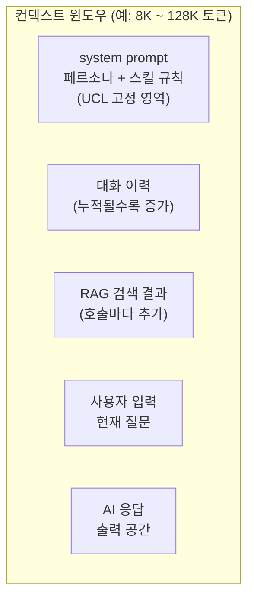

모든 UCL 구성요소가 **같은 토큰 공간을 두고 경쟁**합니다. UCL이 커질수록 대화 이력과 응답 공간이 줄어듭니다.

---

### Ollama 주요 모델별 컨텍스트(UCL의 설계) 한계치

| 모델        | 컨텍스트 윈도우 | 실사용 권장 |
| ----------- | --------------- | ----------- |
| llama3.2 3B | 8K 토큰         | ~6K 실사용  |
| llama3.1 8B | 128K 토큰       | ~32K 실사용 |
| mistral 7B  | 32K 토큰        | ~16K 실사용 |
| qwen2.5 14B | 128K 토큰       | ~64K 실사용 |
| deepseek-r1 | 64K 토큰        | ~32K 실사용 |

---

### UCL 설계 기준 — 3가지 원칙

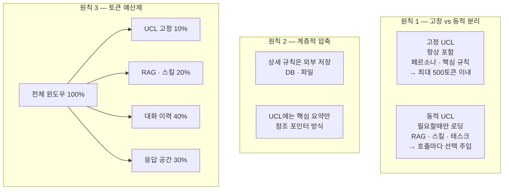

---

### 실제 Node.js + Ollama 설계 권장 구조

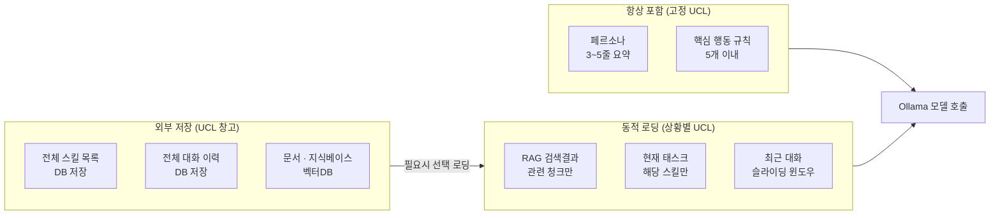

---

### 설계 판단 기준 요약

| 질문               | 판단                    |
| ------------------ | ----------------------- |
| 매번 필요한가?     | 고정 UCL에 포함         |
| 가끔 필요한가?     | 동적으로 주입           |
| 크기가 큰가?       | 외부 저장 후 RAG로 검색 |
| 자주 바뀌는가?     | DB에 저장, 참조만 UCL에 |
| 사용자별로 다른가? | 세션마다 동적 로딩      |

---

## 2. 심화편: 최적화와 데이터 아키텍처

### UCL의 최적화 전략

> **UCL은 "항상 넣을 것"을 최소화하고, "필요할 때만 꺼내 쓰는 창고"를 잘 설계하는 것이 핵심입니다.**

> Ollama처럼 로컬 모델은 클라우드 대비 컨텍스트가 작은 경우가 많으니, **고정 UCL을 500토큰 이내로 엄격하게 유지**하는 것을 강력히 권장합니다.

> UCL(통합 실행 프로토콜)과 RAG(검색 증강 생성)의 관계는 **'지능형 인덱스(UCL)'와 '거대 기억 창고(RAG)'의 협업**으로 정의할 수 있습니다. UCL은 컨텍스트가 어떻게 구성되어 있는지 알려주는 일종의 '지도' 역할을 수행하며, RAG는 이 지도를 바탕으로 방대한 데이터 중 필요한 조각만을 정밀하게 추출하여 시스템의 효율성을 극대화합니다.

UCL과 RAG를 결합하여 처리 속도와 효율을 높이는 핵심 기법 및 관계는 다음과 같습니다.

### 1. UCL 기반의 '초고속 필터링' 기법 (Pruning) — 5W1H의 핵심 역할

UCL이 RAG와 결합할 때 가지는 실질적인 성능 이점은 **5W1H(HEXAGON) 토큰의 인덱스 역할**이다. 모든 UCL 패킷 헤더에 포함된 5W1H 정수 토큰은, AI가 전체 지식 베이스를 뒤지기 전 **현재 상황과 맞지 않는 데이터의 대부분을 1ms 내에 미리 걸러내는(Pruning) 인덱스**로 동작한다.

> **정의:** UCL은 단순한 '주소록'이 아니라, RAG라는 거대 창고에서 필요한 물건을 즉시 찾게 해주는 **'지능형 지도(Intelligent Index)'**이다.

- **90% 데이터 즉시 제거:** AI가 전체 데이터베이스를 벡터 검색하기 전에, UCL 헤더의 Where(공간), When(시간), Who(주체) 토큰을 대조하여 현재 상황과 맞지 않는 데이터의 약 90%를 1ms 내에 미리 걸러낸다.
- **검색 범위 단축:** 예를 들어 "작업 중"인 상황이라면 UCL의 Why 레이어가 'RESOLVE(해결)'로 분류된 과거 데이터만 우선 스캔하여 RAG 응답 속도를 높인다.

### 2. 컨텍스트 윈도우(Context Window) 예산 관리

AI 모델은 한 번에 처리할 수 있는 토큰량(컨텍스트 윈도우)에 한계가 있습니다. 모든 정보를 UCL에 담으려 하면 토큰 공간이 부족해지는 문제가 발생합니다.

- **고정 UCL의 최소화:** 페르소나나 핵심 규칙 같은 필수 정보만 '고정 UCL'로 설정하여 500토큰 이내로 엄격히 관리합니다.
- **동적 RAG 주입:** 크기가 크거나 가끔 필요한 지식, 과거 이력 등은 외부 저장소에 보관했다가, UCL이 파악한 현재 맥락에 맞춰 **필요한 순간에만 RAG로 호출하여 주입**합니다. 이를 통해 모델의 인지 부하를 줄이면서도 지식의 규모는 무한히 확장할 수 있습니다.

### 3. 시맨틱 캐시(Semantic Cache)와의 연동

UCL이 생성한 지능형 인덱스는 Redis와 같은 **시맨틱 캐시**와 결합되어 더욱 빠르게 작동합니다.

- 사용자의 질문이나 시스템 이벤트가 발생하면, UCL은 이를 벡터 좌표로 변환합니다.
- 만약 Redis 캐시에 이와 유사한 UCL 패킷(질문-답변 쌍)이 이미 존재한다면, 무거운 LLM 추론이나 메인 DB 검색 과정을 생략하고 즉시 응답을 반환하여 시스템의 전체적인 지연 시간을 최소화합니다.

### 4. 데이터의 아톰(Atom)화 및 요약본 검색

UCL은 파편화된 로우 데이터를 AI가 즉시 소화할 수 있는 **'아톰(지능적 서사의 최소 단위)'**으로 정제합니다.

- RAG 검색 시 무거운 원문 데이터 전체를 찾는 대신, 이미 UCL 규격으로 정제된 **'요약본(Summary)' 아톰들**을 먼저 스캔합니다.
- 이 기법을 사용하면 소형 AI(sLLM)가 적은 토큰만으로도 대형 AI 못지않게 정교하게 맥락을 파악하고 실행 전략을 수립할 수 있게 됩니다.

**요약하자면**, UCL은 컨텍스트의 골격을 정의하는 **인덱스**이며, RAG는 그 골격에 필요한 살(데이터)을 붙이는 **보급소**입니다. UCL이 5W1H 토큰으로 검색 경로를 미리 닦아놓음으로써, RAG는 더 적은 연산량으로 더 정확한 정보를 찾아 에이전트에게 전달할 수 있게 됩니다.

---

## UCL 에서 바라본 벡터 흐름

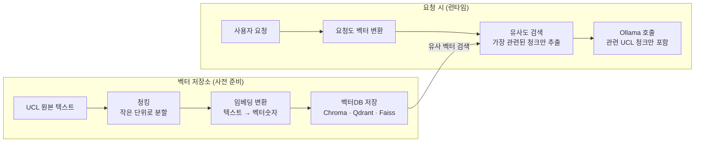

---

### 장단점

| 구분     | 내용                                    |
| -------- | --------------------------------------- |
| **장점** | UCL 전체가 아닌 관련 부분만 골라서 전송 |
| **장점** | UCL이 아무리 커도 컨텍스트 윈도우 절약  |
| **장점** | 지식베이스 규모 제한 없이 확장 가능     |
| **단점** | 벡터 변환 자체가 추가 연산 비용         |
| **단점** | 검색이 부정확하면 엉뚱한 UCL 청크 주입  |
| **단점** | 파이프라인 복잡도 증가                  |
| **단점** | ⚠️ **원본보다 저장 용량이 훨씬 커짐**   |

---

### "벡터로 변환하면 오히려 커진다" — 왜?

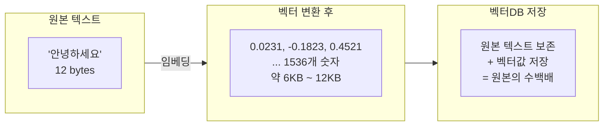

텍스트 한 줄이 **1536차원(OpenAI 기준) 또는 768~4096차원** 숫자 배열로 바뀝니다. 원본은 버릴 수 없으니 **원본 + 벡터를 같이 저장**해야 해서 용량이 폭발합니다.

---

### 실제 용량 비교 예시

| 항목             | 원본 텍스트  | 벡터 변환 후   |
| ---------------- | ------------ | -------------- |
| 문장 1개         | 약 100 bytes | 약 6 KB (60배) |
| 문서 100페이지   | 약 500 KB    | 약 300 MB+     |
| 스킬 명세 1000개 | 약 2 MB      | 약 1 GB+       |

---

### 그래서 현실적인 설계 전략

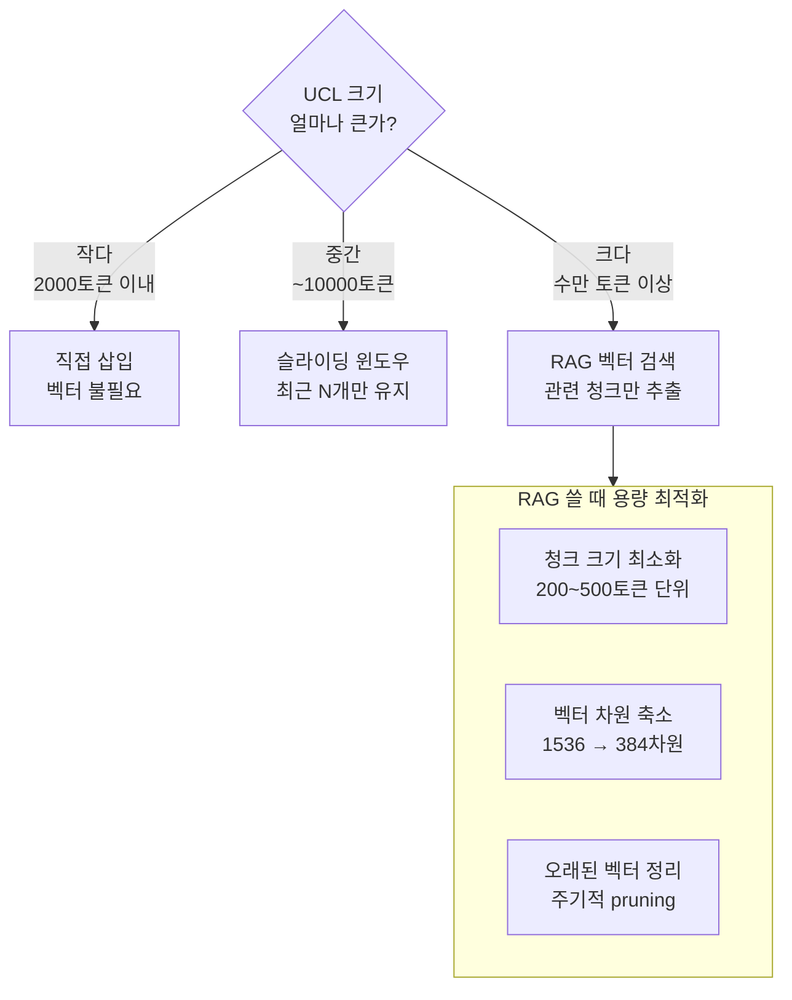

---

### Ollama 환경 추천 조합

| 용도                           | 추천 방식                       |
| ------------------------------ | ------------------------------- |
| 페르소나 · 핵심 규칙           | 직접 삽입 (고정 UCL)            |
| 스킬 명세 · 태스크 규칙        | 슬라이딩 윈도우                 |
| 문서 · 지식베이스 · 대용량 UCL | RAG (Chroma + nomic-embed-text) |

Ollama에서는 `nomic-embed-text` 모델이 **로컬 임베딩**으로 가장 가볍고 실용적입니다. 벡터 차원도 768로 작아서 용량 부담이 상대적으로 적습니다.

---

### 핵심 요약

> **벡터 RAG는 "큰 UCL을 쪼개서 필요한 것만 꺼내는" 기술이지, 용량을 줄이는 기술이 아닙니다.**
> 저장 용량은 오히려 늘지만, **컨텍스트 윈도우 효율**을 높이는 것이 진짜 목적입니다.

용어는 **RNG가 아니라 RAG** (Retrieval-Augmented Generation)입니다.
"주소만 전달한다"는 설명은 정확히는 "주소 탐색 후 원문 내용까지 함께 전달한다"로 정리하는 것이 맞습니다.

---

### RAG의 실제 동작 — 주소 vs 내용

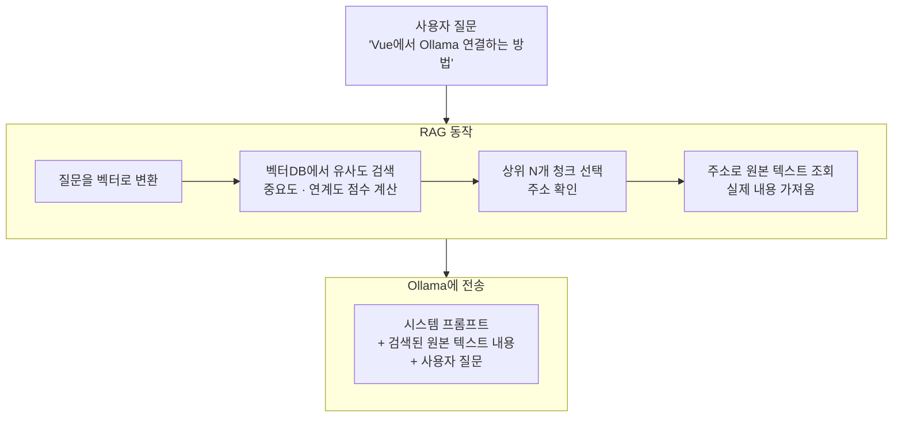

> **RAG는 주소만 찾는 게 아니라, 주소로 원본 내용을 꺼내서 함께 전송합니다.**
> 포인터(주소) 탐색 → 실제 데이터 조회 → 컨텍스트에 삽입까지가 RAG입니다.

---

### 벡터DB 내부 구조 — 실제로 저장되는 것

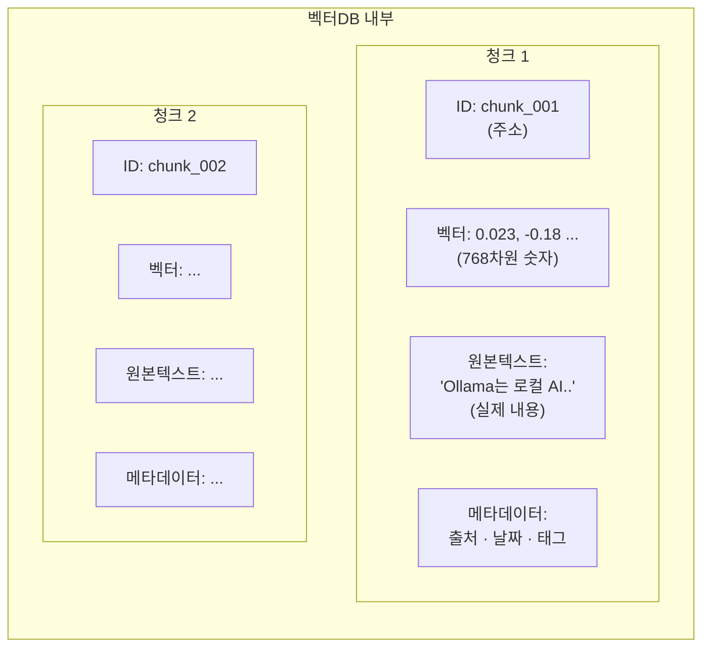

벡터DB는 **주소 + 벡터 + 원본텍스트 + 메타데이터** 를 모두 함께 저장합니다. 그래서 용량이 커지는 것입니다.

---

### 유사도 점수 계산 방식

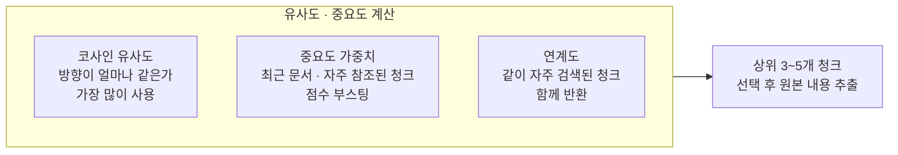

---

### 정확한 RAG 흐름 재정의

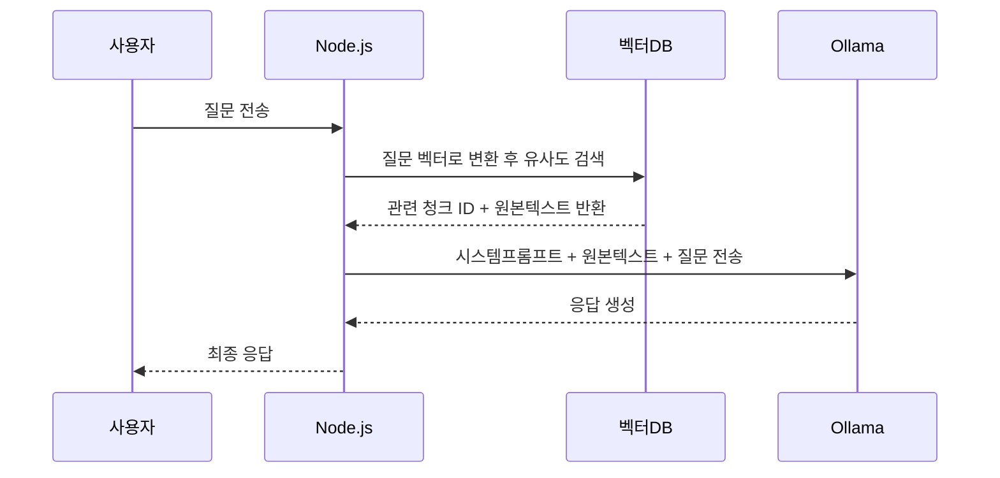

---

### 주소만 전달 vs 내용까지 전달 비교

| 방식               | 설명                          | 실제 사용                       |
| ------------------ | ----------------------------- | ------------------------------- |
| 주소(ID)만 전달    | AI가 DB를 직접 조회           | ❌ 일반 LLM은 DB 직접 접근 불가 |
| 내용까지 전달      | 원본 텍스트를 컨텍스트에 삽입 | ✅ RAG의 실제 방식              |
| 주소 + 요약만 전달 | 내용을 압축해서 전달          | ✅ 컨텍스트 절약할 때 사용      |

---

### 핵심 요약

> **RAG = 벡터로 빠르게 "관련 주소"를 찾고, 그 주소의 "실제 내용"을 꺼내서 AI에게 함께 전달하는 기법**

주소 탐색은 맞지만, AI는 주소가 아닌 **실제 내용**을 받아야 답변할 수 있습니다. 마치 도서관에서 책 위치(주소)를 찾은 뒤, 책을 꺼내서 AI 앞에 펼쳐놓는 것과 같습니다. 📚

PostgreSQL 선택 자체보다 **어떻게 설계하고 운용하느냐**가 더 중요합니다.

---

### PostgreSQL 선택 = 가능성을 열어둔 것

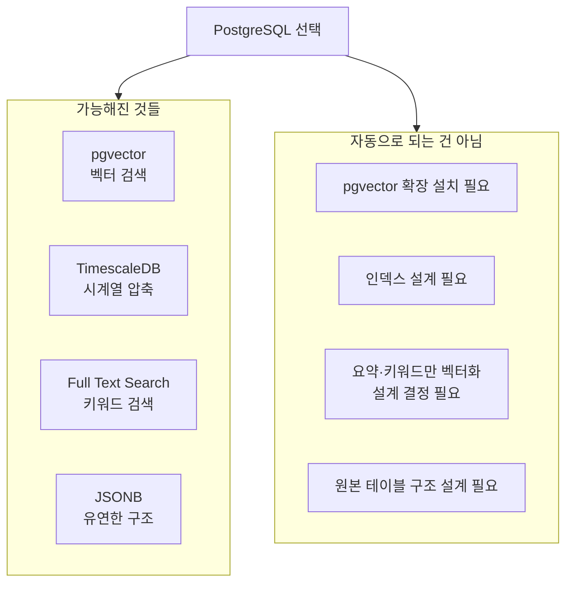

---

### 지금 설계해야 할 핵심 3가지

```mermaid
flowchart LR
    subgraph d1 ["1. 무엇을 벡터화할까"]
        v1["❌ 전체 내용"]
        v2["✅ 제목 · 요약\n키워드만"]
    end

    subgraph d2 ["2. 원본을 어떻게 저장할까"]
        r1["UCL 규칙"]
        r2["스킬 명세"]
        r3["대화 이력\nTimescaleDB"]
        r4["지식 문서"]
    end

    subgraph d3 ["3. 어떻게 검색할까"]
        s1["벡터 유사도\n의미 검색"]
        s2["키워드 검색\n정확한 단어"]
        s3["둘을 혼합\nHybrid Search"]
    end
```

---

### 정리

| 구분         | 내용                                               |
| ------------ | -------------------------------------------------- |
| ✅ 맞는 말   | PostgreSQL은 최신 RAG를 구현할 수 있는 최적의 도구 |
| ✅ 맞는 말   | 별도 벡터DB 없이 하나로 통합 가능                  |
| ⚠️ 주의할 점 | pgvector 설치·설계를 제대로 해야 효과가 남         |
| ⚠️ 주의할 점 | 설계를 잘못하면 PostgreSQL도 똑같이 비효율         |

---

> **PostgreSQL 선택은 최신 RAG를 구현할 수 있는 훌륭한 선택입니다.**
> 다만 "도구를 잘 골랐다" 에서 끝나지 않고, 지금까지 나눈 대화처럼 **"요약·키워드만 벡터화하고 원본은 분리 저장"** 이라는 설계 원칙을 함께 적용해야 진짜 최신 RAG가 됩니다.

해당 설계 방향은 RAG 도입 시 자주 발생하는 비효율(전량 벡터화, 원본/요약 미분리)을 예방하는 접근입니다.

다만 여기서 자주 발생하는 오해를 함께 정리할 필요가 있습니다.

---

### TimescaleDB 압축 = 데이터 손실 없는 압축

```mermaid
flowchart LR
    subgraph wrong ["❌ 일반적인 오해"]
        w1["압축 = 데이터 요약\n또는 삭제"]
        w2["정확도 손실 발생"]
    end

    subgraph correct ["✅ TimescaleDB 실제 방식"]
        c1["압축 = 저장 방식 변경\n행 저장 → 열 저장"]
        c2["데이터 100% 보존\n손실 없음"]
    end
```

> **TimescaleDB 압축은 ZIP 파일처럼 원본을 그대로 유지하면서 저장 공간만 줄이는 방식입니다. 데이터 손실이나 정확도 저하는 전혀 없습니다.**

---

### 왜 용량이 줄어드는가 — 행 저장 vs 열 저장

```mermaid
flowchart TD
    subgraph row ["압축 전 — 행 저장 (Row Store)"]
        r1["행1: time=1일, user=A, question=안녕, answer=반가워, tokens=120"]
        r2["행2: time=2일, user=A, question=날씨, answer=맑음, tokens=80"]
        r3["행3: time=3일, user=B, question=안녕, answer=반가워, tokens=120"]
    end

    subgraph col ["압축 후 — 열 저장 (Column Store)"]
        c1["time 열: 1일, 2일, 3일 → 순차적 숫자 차이만 저장"]
        c2["question 열: 안녕, 날씨, 안녕 → 중복값 한번만 저장"]
        c3["tokens 열: 120, 80, 120 → 패턴 압축"]
    end

    row -->|90일 경과| col
```

같은 값이 반복되는 열을 묶어서 저장하기 때문에 **일반적으로 90~95% 용량 절감**이 됩니다.

---

### 실행 속도와의 관계

```mermaid
flowchart TD
    subgraph query_type ["쿼리 유형별 속도 차이"]
        subgraph fast ["✅ 압축 후 더 빠른 경우"]
            f1["집계 쿼리\nCOUNT · SUM · AVG\n열 단위로 읽어서 빠름"]
            f2["시간 범위 조회\n90일치 통계 분석\n디스크 I/O 감소"]
            f3["대용량 분석\n전체 대화 패턴 분석"]
        end
        subgraph slow ["⚠️ 압축 후 약간 느린 경우"]
            s1["단건 조회\n특정 대화 1개 찾기\n압축 해제 오버헤드"]
            s2["최근 데이터와 혼합 조회\n압축+비압축 동시 스캔"]
        end
    end
```

---

### 실제 속도 수치 (TimescaleDB 공식 벤치마크 기준)

| 쿼리 유형              | 압축 전     | 압축 후         | 비고             |
| ---------------------- | ----------- | --------------- | ---------------- |
| 집계 분석 (COUNT, AVG) | 기준        | **2~10배 빠름** | 열 저장 효과     |
| 시간 범위 스캔         | 기준        | **3~5배 빠름**  | 디스크 I/O 감소  |
| 단건 조회 (by id)      | 기준        | 10~30ms 추가    | 압축 해제 비용   |
| 최근 7일 데이터        | 비압축 상태 | 영향 없음       | 압축 미적용 구간 |

---

### AI 플랫폼에서 실제 영향

```mermaid
flowchart LR
    subgraph usecase ["대화 이력 활용 시나리오"]
        u1["최근 대화 조회\n오늘 ~ 7일\n비압축 구간\n속도 영향 없음"]
        u2["슬라이딩 윈도우\n최근 N턴 컨텍스트\n비압축 구간\n속도 영향 없음"]
        u3["사용자 분석\n90일+ 패턴 분석\n압축 구간\n오히려 빠름"]
        u4["특정 과거 대화 검색\n압축 구간 단건\n10~30ms 추가"]
    end
```

> **AI 플랫폼에서 실시간으로 사용하는 최근 대화는 압축 대상이 아닙니다.** 90일 이전 데이터는 실시간 컨텍스트에 사용할 일이 거의 없으므로 실질적인 성능 영향은 없습니다.

---

### 90일 정책 조정 가이드

| 서비스 성격      | 권장 압축 기준 | 이유                |
| ---------------- | -------------- | ------------------- |
| 일반 챗봇        | 30일           | 대화 맥락 단기 유지 |
| 업무용 AI        | 90일           | 프로젝트 단위 맥락  |
| 지식 관리 플랫폼 | 180일+         | 장기 학습 이력 중요 |
| 분석·리포팅      | 압축 안 함     | 집계가 주목적       |

---

### 핵심 요약

> **90일 압축 = 데이터 손실 없이 저장 공간만 절약 (평균 90~95% 절감)** > **정확도 손실: 전혀 없음** > **속도: 집계·분석은 오히려 빠르고, 단건 조회만 미세하게 느림** > **실시간 AI 컨텍스트(최근 대화)는 압축 구간에 해당하지 않아 영향 없음**

현재 `agents` 단일 구조를 역할 기준으로 분리하면 책임과 운영 경계가 더 명확해집니다.

---

### 현재 vs 개선 구조 비교

```mermaid
flowchart TD
    subgraph before ["현재 — 단일 테이블"]
        b1["agents\n오케스트레이터 역할도\n에이전트 역할도\n모두 한 테이블"]
    end

    subgraph after ["개선 — 분리 구조"]
        a1["orchestrators\n목표 해석\n에이전트 선택 기준\n전체 UCL 관리"]
        a2["agents\n전문 역할 수행\n페르소나 · 스킬 보유\nOllama 모델 호출"]
        a3["orchestrator_agents\n오케스트레이터 ↔ 에이전트\n다대다 연결 · 우선순위"]
        a1 -->|"1 : N"| a3
        a2 -->|"N : 1"| a3
    end
```

---

### 왜 분리해야 하는가

| 관점          | 단일 테이블 문제                                               | 분리 후 장점                          |
| ------------- | -------------------------------------------------------------- | ------------------------------------- |
| 역할 명확성   | 오케스트레이터인지 에이전트인지 type 컬럼으로만 구분           | 테이블 자체가 역할을 명시             |
| UCL 관리      | 오케스트레이터 UCL과 에이전트 UCL이 같은 컬럼 공유             | UCL 설정 컬럼을 각자 목적에 맞게 설계 |
| 에이전트 조합 | 하나의 오케스트레이터에 어떤 에이전트가 연결됐는지 추적 어려움 | orchestrator_agents로 조합 이력 관리  |
| 확장성        | 오케스트레이터가 다른 오케스트레이터를 부를 때 표현 불가       | 계층 구조 표현 가능                   |

---

### 수정 해야할 DDL (현제 스키마를 참고 하여 재구성)

```sql
-- ─────────────────────────────────────
-- 1. 오케스트레이터 테이블
-- ─────────────────────────────────────
CREATE TABLE xxx_orchestrators (
  id               UUID PRIMARY KEY DEFAULT gen_random_uuid(),
  user_id          UUID REFERENCES users(id),
  name             VARCHAR(100) NOT NULL,

  -- 오케스트레이터 UCL
  goal_prompt      TEXT,          -- 전체 목표 해석 규칙
  routing_rules    JSONB,         -- 어떤 조건에 어떤 에이전트를 쓸지
  max_agents       INT DEFAULT 5, -- 동시 실행 에이전트 수 제한
  token_budget     INT DEFAULT 8000,

  is_active        BOOLEAN DEFAULT true,
  created_at       TIMESTAMPTZ DEFAULT NOW()
);

-- ─────────────────────────────────────
-- 2. 에이전트 테이블
-- ─────────────────────────────────────
CREATE TABLE xxx_agents (
  id               UUID PRIMARY KEY DEFAULT gen_random_uuid(),
  user_id          UUID REFERENCES users(id),
  name             VARCHAR(100) NOT NULL,

  -- 에이전트 UCL
  persona          TEXT,          -- 페르소나 (사용자 편집 가능)
  system_prompt    TEXT,          -- 고정 UCL 프롬프트
  model_name       VARCHAR(100) DEFAULT 'llama3.1',
  temperature      FLOAT DEFAULT 0.7,
  max_tokens       INT DEFAULT 2000,

  -- 에이전트 메타
  specialty        VARCHAR(100),  -- 전문 분야 (검색·분석·작성 등)
  is_active        BOOLEAN DEFAULT true,
  created_at       TIMESTAMPTZ DEFAULT NOW()
);

-- ─────────────────────────────────────
-- 3. 오케스트레이터 ↔ 에이전트 연결
-- ─────────────────────────────────────
CREATE TABLE orchestrator_agents (
  id                UUID PRIMARY KEY DEFAULT gen_random_uuid(),
  orchestrator_id   UUID REFERENCES orchestrators(id),
  agent_id          UUID REFERENCES agents(id),
  priority          INT DEFAULT 0,     -- 에이전트 호출 우선순위
  role_in_orch      VARCHAR(100),       -- 이 조합에서의 역할명
  is_active         BOOLEAN DEFAULT true,
  created_at        TIMESTAMPTZ DEFAULT NOW(),

  UNIQUE (orchestrator_id, agent_id)   -- 중복 연결 방지
);
```

---

### 전체 테이블 관계도

[NEXA-UCL-04]를 반영하되, 전체 아키텍처는 **이중 트랙**으로 본다.

- **대화 트랙(Conversation Track):** 사용자-에이전트 상호작용 기록 (`conversations`)
- **실행 트랙(Execution Track):** UCL 패킷의 실행 상태·단계·로그 (`execution_chains`, `execution_steps`, `execution_logs`)

```mermaid
erDiagram
    users {
        uuid id PK
        varchar name
        timestamptz created_at
    }
    projects {
        uuid id PK
        uuid user_id FK
        varchar name
        timestamptz created_at
    }
    orchestrators {
        uuid id PK
        uuid user_id FK
        text goal_prompt
        jsonb routing_rules
        int token_budget
    }
    agents {
        uuid id PK
        uuid user_id FK
        text persona
        text system_prompt
        varchar model_name
        varchar specialty
    }
    orchestrator_agents {
        uuid id PK
        uuid orchestrator_id FK
        uuid agent_id FK
        int priority
        varchar role_in_orch
    }
    skills {
        uuid id PK
        varchar name
        jsonb tool_definition
    }
    agent_skills {
        uuid agent_id FK
        uuid skill_id FK
    }
    tasks {
        uuid id PK
        uuid orchestrator_id FK
        varchar status
        jsonb ai_draft
        jsonb final_plan
    }
    conversations {
        timestamptz time
        uuid user_id FK
        uuid orchestrator_id FK
        uuid agent_id FK
        text question
        text answer
    }
    execution_chains {
        uuid packet_id PK
        uuid project_id FK
        uuid actor_id
        varchar actor_type
        smallint how_state
        jsonb execution_bundle
        jsonb context_bundle
        jsonb why_chain
        timestamptz created_at
    }
    execution_steps {
        uuid step_id PK
        uuid packet_id FK
        smallint step_sequence
        varchar capability_id
        smallint step_status
        boolean is_virtual
        jsonb post_state_snapshot
        timestamptz created_at
    }
    execution_logs {
        uuid log_id PK
        uuid packet_id FK
        uuid step_id FK
        varchar adapter_id
        jsonb raw_response
        int execution_ms
        timestamptz created_at
    }

    users ||--o{ projects : "소유"
    users ||--o{ orchestrators : "소유"
    users ||--o{ agents : "소유"
    projects ||--o{ execution_chains : "실행사슬"
    execution_chains ||--o{ execution_steps : "단계"
    execution_chains ||--o{ execution_logs : "로그"
    execution_steps ||--o{ execution_logs : "스텝별로그"
    orchestrators ||--o{ orchestrator_agents : "구성"
    agents ||--o{ orchestrator_agents : "참여"
    agents ||--o{ agent_skills : "보유"
    skills ||--o{ agent_skills : "제공"
    orchestrators ||--o{ tasks : "관리"
    users ||--o{ conversations : "대화기록"
    orchestrators ||--o{ conversations : "대화흐름"
    agents ||--o{ conversations : "응답기록"
```

---

### 이 구조로 가능해지는 것

| 시나리오                                            | 가능 여부 |
| --------------------------------------------------- | --------- |
| 오케스트레이터 하나에 에이전트 여러 개 조합         | ✅        |
| 같은 에이전트를 여러 오케스트레이터에서 공유        | ✅        |
| 에이전트 우선순위 · 역할을 조합마다 다르게 설정     | ✅        |
| 오케스트레이터별 토큰 예산 독립 관리                | ✅        |
| 사용자가 나만의 오케스트레이터 + 에이전트 조합 구성 | ✅        |

---

> **분리하는 것이 맞습니다.** UCL 철학 자체가 오케스트레이터와 에이전트의 역할을 명확히 구분하는데, DB 설계도 그 철학을 그대로 반영하는 것이 일관성 있는 설계입니다.

매핑 테이블의 가치는 단순 연결을 넘어, 관계 자체를 운영 데이터로 다룰 수 있다는 점에 있습니다.

---

### 매핑 테이블이 없을 때 vs 있을 때

```mermaid
flowchart TD
    subgraph without ["❌ 매핑 테이블 없이"]
        w1["orchestrators\norchestrator_id\nagent_id 컬럼 직접 보유"]
        w2["문제1: 에이전트 여러개면\norchestrator 행을 여러개 만들어야함"]
        w3["문제2: 같은 에이전트를\n다른 오케스트레이터에서 쓰려면\n에이전트를 복사해야함"]
        w1 --> w2 --> w3
    end

    subgraph with ["✅ 매핑 테이블 있을 때"]
        m1["orchestrators\n오케스트레이터 정의만"]
        m2["agents\n에이전트 정의만"]
        m3["orchestrator_agents\n조합 · 우선순위 · 역할\n관계 정보만"]
        m1 & m2 --> m3
    end
```

---

### 매핑 테이블의 3가지 진짜 가치

```mermaid
flowchart LR
    subgraph v1 ["1. 재사용"]
        a1["검색 에이전트"]
        b1["오케스트레이터 A"]
        b2["오케스트레이터 B"]
        b3["오케스트레이터 C"]
        a1 --> b1 & b2 & b3
    end

    subgraph v2 ["2. 관계 자체가 데이터"]
        c1["orchestrator_agents"]
        c2["priority: 1번으로 호출"]
        c3["role_in_orch: 여기선 요약 담당"]
        c4["is_active: 지금은 비활성"]
        c1 --> c2 & c3 & c4
    end

    subgraph v3 ["3. 유연한 조합 변경"]
        d1["에이전트 교체\n오케스트레이터 건드리지 않고\n매핑만 수정"]
        d2["역할 변경\n에이전트 건드리지 않고\n매핑만 수정"]
    end
```

---

### 이 패턴의 공식 이름

| 패턴 이름             | 설명                                    |
| --------------------- | --------------------------------------- |
| **Junction Table**    | 다대다(N:M) 관계를 풀어주는 중간 테이블 |
| **Association Table** | 관계 자체에 속성(우선순위·역할)을 부여  |
| **Bridge Table**      | 두 엔티티를 유연하게 연결하는 다리 역할 |

> 세 이름 모두 같은 패턴입니다. DB 설계의 가장 기본적이고 강력한 패턴 중 하나입니다.

---

### 실제로 얼마나 유연해지는가

```mermaid
flowchart TD
    subgraph scenario ["실제 시나리오"]
        s1["오케스트레이터 A\n고객 상담 전문"]
        s2["오케스트레이터 B\n문서 작성 전문"]

        a1["검색 에이전트\n(공유)"]
        a2["분석 에이전트\n(공유)"]
        a3["상담 에이전트\nA 전용"]
        a4["작성 에이전트\nB 전용"]

        s1 -->|"priority 1\n역할: 정보수집"| a1
        s1 -->|"priority 2\n역할: 감정분석"| a2
        s1 -->|"priority 3\n역할: 답변생성"| a3

        s2 -->|"priority 1\n역할: 자료조사"| a1
        s2 -->|"priority 2\n역할: 구조분석"| a2
        s2 -->|"priority 3\n역할: 초안작성"| a4
    end
```

검색·분석 에이전트는 **복사 없이 두 오케스트레이터에서 공유**하면서, 각 조합에서의 역할과 우선순위는 **매핑 테이블에서 독립적으로 관리**합니다.

---

> **매핑 테이블 = 유연성 + 재사용 + 관계 자체를 데이터로 관리**
>
> 단순히 "연결"이 아니라 **"어떻게 연결됐는가"** 를 저장하는 것이 핵심입니다. 이 패턴은 나중에 사용자가 Vue 화면에서 드래그로 에이전트를 조합하는 UI를 만들 때도 그대로 활용됩니다.

본 문서는 기초와 심화를 한 파일 내에서 구분해 학습 흐름을 유지하도록 정리했습니다.
