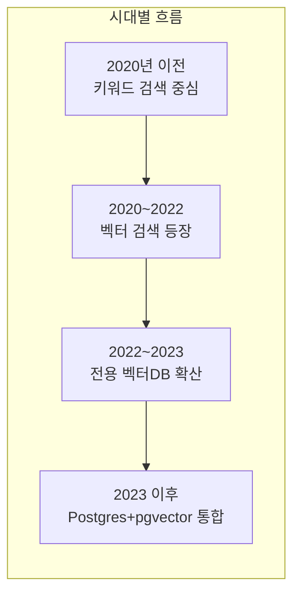
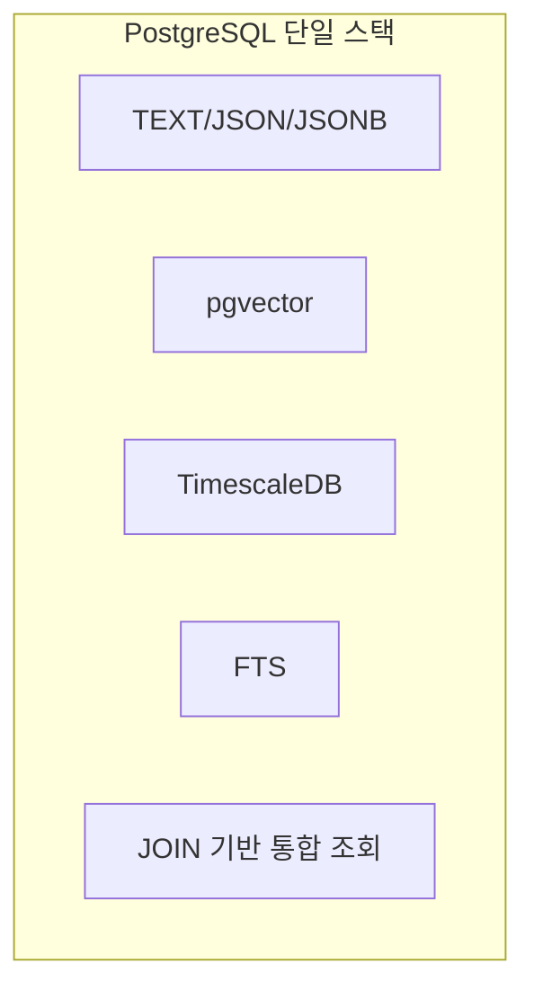
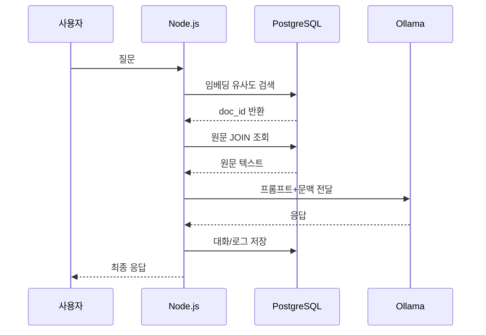

# NEXA 오케스트레이션 데이터베이스 설계 명세서 v5.0

**작성일:** 2025-03  
**목적:** NEXA 플랫폼 메인 라우터(`/nexa-node`, `/nexa-panel`, `/infra`, `/dev`, `/help` 등)의 도메인별 요구사항을 수용하는 프로젝트 중심 통합 DB 스키마를 정의한다.  
**적용 범위:** PostgreSQL(TimescaleDB), RLS, JSONB, pgvector, UUID v7, Yjs 기반 설계  
**참조:** `NEXA-STACK-01`, `NEXA-AUTH-01`, `NEXA-AI-09`, `NEXA-CAPABILITY-01`

---

## 0A. Knowledge OS 연동 원칙

본 오케스트레이션 DB는 프로젝트 실행 계층을 담당하고, 공통 지식 계층은 `nexa_knowledge_*`를 참조한다.

- 공통 지식 계층(전역 규범/사전/참조): `nexa_knowledge_*`
- 프로젝트 생성 지식 계층(도메인 활동/AI 협업 산출물): `project_knowledge`
- 파일 원장(스토리지/쿼터): `project_assets`

경계 원칙:

- `project_knowledge`는 프로젝트 맥락에서 생성되는 지식을 저장한다.
- 공통 규칙/용어/참조 규약은 `nexa_knowledge_*`를 기준으로 검증한다.
- 실행 라우팅 시 우선순위는 `project_knowledge`(프로젝트 특화) -> `nexa_knowledge_*`(공통 fallback)로 한다.

연동 포인트:

- 용어 사전: `nexa_knowledge_definitions`
- 용어-기능 연결: `nexa_knowledge_references`
- 임베딩 검색: `nexa_knowledge_vectors`
- 파일명/참조 규칙: `nexa_knowledge_ref_rules`
- 문서-자산 연결: `nexa_knowledge_reference_assets` + `project_assets`

Self 공통 자산 연동:

- `nexa_self_profiles`: 사용자별 Self 프로필
- `nexa_self_facets`: `Now/Energy/Direction/Discovery` 축
- `nexa_self_states`: `Empty` 포함 상태 전환 모델
- `nexa_self_explosions`: Self 트리거 -> Coil/Capability 전개
- `nexa_self_knowledge_map`: Self-knowledge 브리지(원본 저장 아님)
- `nexa_self_capability_links`: Self-Capability 연결 제어

채널 원칙:

- 닉시(`NEXA NIXIE`) 경유 채널(`사용자 -> NEXU Canvas -> 오케스트레이션`)과 직접 경로(`사용자 -> 오케스트레이션`)는 동일한 `nexa_self_*` 플랫폼 공동 자산 규칙을 사용한다.

### 0A-1. NFS·Inode·동기화 원장 (`doc_anchor`, `doc_sync_state`)

실행 DB와 지식 OS의 **경로·앵커·동기화**는 `_KNOWLEDGE` 통합 SSOT를 1순위로 따른다.

- **통합 DDL·필드 명세:** `docs/_KNOWLEDGE DDL 통합 스키마 및 물리 설계(SSOT).md`, `docs/_KNOWLEDGE SPEC CRUD 테이블 및 필드 명세서.md` §2.2·§2.12.
- **`nexa_knowledge_traceability_paths`:** 논리 경로와 앵커 UUID 연결(Inode·NFS). 플랫폼·Nexion 공통 앵커 컬럼명은 **`doc_anchor`**(과거 `anchor_id` 폐기). 전체 NFS 컬럼 세트·RLS·선택 인덱스는 `[NXN] [SCHM]` §4·`[NXN] [DDL] NEXA Nexion 독립형 인덱스 및 자산 관리 DDL.sql` §1-A·§3.
- **`nexa_knowledge_doc_sync_state`:** PK **`sync_id`**, 식별 **`(project_id, doc_anchor)`**, 다도메인 **`responsible_domain`**, 잠금 **`lock_metadata`**, 해시 **`prev_source_hash`/`curr_source_hash`**, 상태 **`ok|changed|missing|conflict|error`** — **파일 실종·유예·삭제의 단일 머신은 아님**; 그 역할은 **`nexa_knowledge_traceability_paths` + `[NXN] [SCHM]` §4.4.1**이며 본 테이블은 **보조 헬스**다. 상세는 `[NXN] [SCHM]` §6·§4.4.2.
- **`project_id` (Nexion·지식 NFS):** 위 원장들의 **`project_id` NOT NULL**은 **통합 DB에서의 테넌트·RLS 구획**이다. **Nexion을 별도 DB로 쪼갤 필요는 없고**, **“비즈니스 워크플로 프로젝트 = Nexion 제품 정의”**와도 동일시하지 않는다. 문장 SSOT: `[NXN] [CNCP] NEXA Nexion 지식 OS 관리 및 악보 설계 철학.md` **§1.2**, `[NXN] [API] ...` **§2.2.1**.

---

## 0. Capability ID(기능 자격 ID) 전제

### 0.1 용어 기준

- 표준 명칭: `Capability`, `Capability ID`
- 한글 표기: **기능 자격**, **기능 자격 ID**
- 코드/DB/API에서는 `Capability`를 그대로 사용

### 0.2 핵심 원칙

- Capability ID는 단순 컬럼이 아니라 플랫폼 전역 **일급 객체(First-Class Object)** 로 취급
- 접근 제어, 확장성, 감사 추적, 성능 최적화의 기본 단위
- `tiers`, `capabilities`, `tier_allowed_capabilities`, `capability_grant_history`를 비귀속 핵심 테이블로 정의

### 0.3 계층 구조 (점 구분)

| depth | 계층         | 설명              | 예시                                           |
| :---- | :----------- | :---------------- | :--------------------------------------------- |
| 1     | 네임스페이스 | 플랫폼 식별       | `nexa`                                         |
| 2     | 출처(Origin) | 상위 소속         | `nexa.platform`, `nexa.edge`, `nexa.plugin`    |
| 3     | 도메인       | 출처 내 세부 영역 | `nexa.platform.archive`, `nexa.platform.panel` |
| 4+    | 메뉴/액션    | 하위 화면/동작    | `nexa.platform.archive.hub.export`             |

> 와일드카드(`.*`)를 명시한 경우에만 하위 전체 허용(접두사 매칭), 그 외에는 동일 비교

### 0.4 발급/폐기 시나리오

| 시나리오    | 주체   | 동작                                 | 이력                                 |
| :---------- | :----- | :----------------------------------- | :----------------------------------- |
| Tier별 발급 | 관리자 | `tier_allowed_capabilities`에 INSERT | `capability_grant_history` 기록 필수 |
| 폐기        | 관리자 | DELETE 또는 Soft Delete              | revoke 이벤트 기록                   |
| 동기화      | 시스템 | 코드 레지스트리 vs DB Diff 반영      | `sync_at` 갱신                       |

### 0.5 추가 운영 테이블

- `capability_tag_whitelist`: AI 추천 후보 제한용 태그 화이트리스트
- `capability_proposals`: 추천 기능 자격 + Fit Score + 승인 워크플로
- `capability_map`: API/라우트 ↔ Capability 동적 매핑

---

## 1. 프로젝트 통합 데이터 스키마

### 1.1 프로젝트 귀속 테이블 (31개)

| No  | 테이블명                    | 라우터/도메인   | 주요 역할                                                                                          | 핵심 기술            |
| :-- | :-------------------------- | :-------------- | :------------------------------------------------------------------------------------------------- | :------------------- |
| 1   | `projects`                  | 전역            | 프로젝트 식별/분류/Quota/Storage                                                                   | UUID v7, RLS         |
| 2   | `project_members`           | `/my`           | 멤버 권한/공유 상태                                                                                | RLS                  |
| 3   | `project_settings`          | `/settings`     | 전역 설정/코일 템플릿·`user_defined_threshold`·**`vi_threshold`/`es_threshold`(Empathy)**          | JSONB, NUMERIC       |
| 4   | `project_assets`            | 전역 자원       | 문서/코드/YAML 관리                                                                                | JSONB                |
| 5   | `project_media`             | `/nexa-media`   | 이미지/사운드/영상                                                                                 | FFmpeg               |
| 6   | `project_tags`              | 전역 검색       | 프로젝트 내부 시맨틱 태그                                                                          | pgvector             |
| 7   | `project_logs`              | 전역 로그       | 5W1H + `why_chain` + **Shell 서사**(`source_shell_id`/`target_shell_id`) + **NIXIE Jitter**(`nixie_feedback`·`confidence_score`) | TimescaleDB          |
| 8   | `project_resource_versions` | 전역 자원       | 설정/스크립트 버전 이력                                                                            | JSONB                |
| 9   | `project_folders`           | 탐색기          | 트리 구조 + Yjs 스냅샷                                                                             | Yjs                  |
| 10  | `project_links`             | 탐색기          | 외부 URL/검색 참조                                                                                 | AI Crawler           |
| 11  | `project_orchestra`         | `/nexa-ai`      | 페르소나/스킬/태스크                                                                               | JSONB                |
| 12  | `project_chats`             | `/nexa-ai`      | 에이전트 대화 히스토리                                                                             | Vercel AI SDK        |
| 13  | `project_agent_sessions`    | `/nexa-ai`      | 실시간 세션·**Multi-Self facet**(`user_id`, `self_profile_id`, `active_facet_key`, `coil_weights`) | UNLOGGED, JSONB      |
| 14  | `project_knowledge`         | `/nexa-archive` | 지식 레이어/RAG 원천                                                                               | pgvector             |
| 15  | `project_nodes`             | `/nexa-node`    | 노드 기반 로직/Yjs 스냅샷                                                                          | Vue Flow, Yjs        |
| 16  | `project_scripts`           | `/nexa-node`    | 가변 스크립트/동적 주입                                                                            | JSONB/Bytecode       |
| 17  | `project_simulations`       | `/nexa-node`    | 가상 시뮬레이션 결과                                                                               | JSONB                |
| 18  | `project_panels`            | `/nexa-panel`   | 위젯 목록/개별 설정                                                                                | JSONB                |
| 19  | `project_boards`            | `/nexa-board`   | 대시보드 프리셋                                                                                    | JSONB                |
| 20  | `project_devices`           | `/infra`        | 장치 할당/버전 조합 추적                                                                           | MQTT, FK             |
| 21  | `project_network_topology`  | `/network`      | 장치 간 연결 맵                                                                                    | JSONB                |
| 22  | `project_traces`            | `/nexa-trace`   | 사용자 동작/자동화 시퀀스                                                                          | JSONB                |
| 23  | `project_solutions`         | `/solutions`    | 문제/솔루션 기획 데이터                                                                            | JSONB                |
| 24  | `project_tasks`             | `/erp`          | 업무 일정/마일스톤                                                                                 | ERP Hub              |
| 25  | `project_parts_bom`         | `/erp/parts`    | BOM + AI 시맨틱 브릿지                                                                             | JSONB, FK            |
| 26  | `project_extensions`        | `/extension`    | 플러그인/외부 API 연동                                                                             | JSONB                |
| 27  | `project_secrets`           | `/extension`    | 외부 자격증명(암호문만 저장)                                                                       | RLS, BYTEA, pgcrypto |
| 28  | `project_releases`          | `/portfolio`    | 산출물 버전/전시 메타                                                                              | JSONB                |
| 29  | `project_jobs`              | 백그라운드      | 장기 작업 상태/진행률                                                                              | JSONB                |
| 30  | `project_user_presence`     | 협업            | 현재 접속/활동 상태                                                                                | UNLOGGED             |
| 31  | `project_yjs_updates`       | 동기화          | Yjs 증분 업데이트 로그                                                                             | BYTEA                |

### 1.1a UCL 실행 트랙 (3개, [NEXA-UCL-04]·[NEXA-UCL-07])

단순 로그가 아니라 **실행 시뮬레이터**(가상 분기·스냅샷 롤백·잔여 태스크 적합도)를 위한 귀속 테이블. 상세 DDL은 `__NEXA 오케스트레이션 스키마 DDL v5.md` §1-5.

| No  | 테이블명           | 주요 역할                    | 핵심 컬럼·메모                                                                                                          |
| :-- | :----------------- | :--------------------------- | :---------------------------------------------------------------------------------------------------------------------- |
| 32  | `execution_chains` | UCL 패킷 단위 실시간 사슬    | `residual_fit_score`, `residual_fit_rationale` — `ADAPTER_PARTIAL_SUCCESS` 후 남은 단계 강행 여부(UCL-07 §1.1)          |
| 33  | `execution_steps`  | 원자 스텝·Dry-run 분리       | `is_virtual`, `target_entity_type` (PHYSICAL/VIRTUAL/NEXU), `pre_state_snapshot`, `post_state_snapshot` — 롤백·타임머신 |
| 34  | `execution_logs`   | 어댑터 응답·에러 토큰 시계열 | TimescaleDB 하이퍼테이블                                                                                                |

### 1.1c Multi-faceted Self·Empathy (귀속 1개, [SYS 핵심 인프라]·[Empathy])

다중 자아 단면(Now/Energy/Direction/Discovery)과 코일 가중 실시간 동기화, 세션 TTL 이후 복원. 상태 정의 마스터는 공통 **`nexa_self_states`** 등 `nexa_self_*`를 참조한다. DDL은 `__NEXA 오케스트레이션 스키마 DDL v5.md` §1-3·§0D.

| No  | 테이블명                     | 주요 역할                                               | 핵심 컬럼                                                            |
| :-- | :--------------------------- | :------------------------------------------------------ | :------------------------------------------------------------------- |
| 35  | `project_self_facet_runtime` | 프로젝트·사용자당 1행, 활성 facet·`coil_weights` 스냅샷 | `UNIQUE(project_id, user_id)`, `active_facet_key`, `active_state_id` |

#### 비고

- `project_logs`/`project_knowledge`는 5W1H SMALLINT 6컬럼 완전 분리
- **`project_logs` NIXIE·족보:** 한 Soul이 복수 Shell에 나타날 수 있으므로 **발생지** `source_shell_id`와 **연주·피드백 대상** `target_shell_id`로 서사 추적. `confidence_score` < `project_settings.user_defined_threshold`이면 **`nixie_feedback`**에 `error_token`·`parser_version`·`user_defined_threshold_snapshot` 등을 기록해 **NEXA NIXIE**가 NEXU 등 쉘 **표면에서 연출하는 Jitter**(빛의 떨림)와 동일 행으로 강결합한다. Nexion 캔버스 표현 주체·용어는 `[NXN] [UIUX]` **§4.3.1**과 맞춘다. DDL: `__NEXA 오케스트레이션 스키마 DDL v5.md` §1-2·§0C-4·§3.
- **`project_settings.vi_threshold` / `es_threshold`:** VI(활력)·ES(정서)가 임계 미만이면 Low-Entropy·출력 억제 등 Empathy 제동. NULL이면 플랫폼 기본 정책.
- **`project_agent_sessions` ↔ `project_self_facet_runtime`:** 세션은 UNLOGGED로 고빈도 갱신, 런타임 테이블은 세션 만료 후에도 마지막 facet·코일 값 복원에 사용.
- `project_agent_sessions`, `project_user_presence`는 휘발성 데이터 특성상 UNLOGGED/TTL 전략 권장

### 1.2 프로젝트 비귀속 플랫폼 테이블 (27개)

| No  | 테이블명                       | 역할                     | 형식           | 도메인               |
| :-- | :----------------------------- | :----------------------- | :------------- | :------------------- |
| 1   | `panel_components`             | 패널 원형/상품           | JSONB          | `/nexa-panel`        |
| 2   | `node_definitions`             | 표준 노드 규격           | JSONB          | `/nexa-node`         |
| 3   | `document_templates`           | 문서 템플릿              | JSONB          | `/nexa-archive`      |
| 4   | `protocol_manifests`           | 통신 프로토콜 프리셋     | JSONB          | `/infra`, `/network` |
| 5   | `automation_recipes`           | 자동화 모범 사례         | JSONB          | `/nexa-trace`        |
| 6   | `orchestra_scores`             | 오케스트라 템플릿        | JSONB          | 라이브러리           |
| 7   | `firmwares_core`               | 시스템 코어 펌웨어       | Binary         | -                    |
| 8   | `firmwares_model`              | 하드웨어 모델 펌웨어     | Binary/YAML    | -                    |
| 9   | `device_registry`              | 기기 등록/라이프사이클   | JSONB          | `/infra`             |
| 10  | `platform_audit_logs`          | 플랫폼 감사              | TimescaleDB    | `/dev`               |
| 11  | `api_usage_stats`              | API 통계                 | TimescaleDB    | `/dev`               |
| 12  | `template_reviews`             | 템플릿 평점/리뷰         | JSONB          | 마켓                 |
| 13  | `usage_metrics`                | 다운로드/인기도          | JSONB          | 마켓                 |
| 14  | `support_faq`                  | FAQ                      | JSONB          | `/help`              |
| 15  | `ai_consultation_logs`         | AI 상담 이력             | TimescaleDB    | `/help`              |
| 16  | `storage_configs`              | 저장소 백엔드/기본 quota | JSONB          | 인프라               |
| 17  | `global_tags`                  | 전역 시맨틱 태그         | pgvector       | 마켓                 |
| 18  | `global_knowledge_base`        | 전역 검색 요약/임베딩    | pgvector       | 마켓                 |
| 19  | `tiers`                        | 회원 등급                | RLS            | AUTH                 |
| 20  | `capabilities`                 | 기능 자격 메타           | JSONB, RLS     | 전역                 |
| 21  | `tier_allowed_capabilities`    | Tier 허용 자격           | FK             | AUTH                 |
| 22  | `capability_grant_history`     | 발급/폐기 이력           | JSONB, RLS     | 감사                 |
| 23  | `sandbox_profiles`             | 격리 실행 프로필         | JSONB, RLS     | AI/Node              |
| 24  | `sandbox_profile_capabilities` | 프로필 상속 자격         | FK, RLS        | AI/Node              |
| 25  | `capability_tag_whitelist`     | 추천 화이트리스트        | JSONB, RLS     | AI/Admin             |
| 26  | `capability_proposals`         | 추천/Fit Score/승인      | JSONB, FK, RLS | AI/Admin             |
| 27  | `capability_map`               | 리소스-자격 매핑         | FK, RLS        | 인가                 |

### 1.3 현재 생성 테이블 대응

| 기존 테이블        | 설계 대응               | 비고                        |
| :----------------- | :---------------------- | :-------------------------- |
| `users`            | 인증 주체               | `project_members` 상위 주체 |
| `projects`         | 귀속 No.1               | 프로젝트 최상위             |
| `files`            | 전역 파일 레지스트리    | 참조형 사용 권장            |
| `file_references`  | 전역 파일 참조          | 프로젝트 하위는 참조만      |
| `part_specs`       | `node_definitions` 계열 | 파트 규격                   |
| `part_classes`     | `node_definitions` 계열 | 분류 체계                   |
| `part_models`      | `node_definitions` 계열 | 모델 정의                   |
| `part_files`       | `project_assets` 연계   | 첨부 파일                   |
| `device_registry`  | 비귀속 No.9             | 라이프사이클                |
| `device_members`   | 디바이스 공유           | `project_devices` 연동      |
| `ai_user_memos`    | 지식/채팅 보조          | AI 보조 메모                |
| `system_templates` | 템플릿 저장소           | 문서/오케스트라             |

> 파일 정책: `files`/`file_references`를 플랫폼 공통으로 유지하고, 프로젝트 하위 테이블에는 `file_id` 참조만 저장

---

## 2. 설계 핵심 지향점

### 2.1 AI 협업 최적화 (RAG + Tool Calling)

- 과거: `project_knowledge`
- 현재: `project_chats`
- 미래: `project_orchestra`
- 실시간 상태: `project_agent_sessions`
- 이력/행동 보강: `project_logs`

### 2.2 실시간 동기화 (Yjs)

- 증분은 `project_yjs_updates`에 이력 적재
- `project_folders.yjs_state`, `project_nodes.yjs_state`는 압축 스냅샷만 저장
- 서버 병합 + 주기 스냅샷 + 오래된 증분 정리

### 2.3 보안/격리

- 귀속 테이블은 `project_id` + RLS
- `project_secrets`는 암호문(BYTEA)만 저장
- 앱 레벨 AES-256-GCM + 선택적 DB `pgcrypto`

### 2.4 3단계 배포 추적

- Core: `firmwares_core`
- Model: `firmwares_model`
- Script: `project_scripts`
- 실제 상태는 `project_devices(core_fw_id, model_hw_id, script_id)`로 추적

### 2.5 Shadow Project ID 계약

프로젝트 외부 활동도 `project_id NOT NULL`을 유지하기 위해 예약 UUID 사용:

| 예약 용도      | 설명                         |
| :------------- | :--------------------------- |
| `GLOBAL_GUIDE` | 플랫폼 가이드/도우미 활동    |
| `TRIAL_USER`   | 비회원 체험 활동             |
| `DAILY_HELPER` | 회원의 프로젝트 외 일상 활동 |

추가 메타:

- `scope_type`: `IN_PROJECT` \| `GLOBAL`
- `scope_subtype`: `TRIAL` \| `DAILY` \| `HELPER`

### 2.6 Confidence Score/Fit Score

| 위치                   | 필드               | 용도             |
| :--------------------- | :----------------- | :--------------- |
| `project_logs`         | `confidence_score` | 실행/승인 게이트 |
| `project_knowledge`    | `confidence_score` | RAG 정렬/필터    |
| `capability_proposals` | `fit_score`        | 추천 적합성      |
| `project_orchestra`    | `skill_threshold`  | 스킬 실행 임계값 |

### 2.7 코일 밸런서 테이블 운영

| 테이블                     | 귀속                       | 역할                    |
| :------------------------- | :------------------------- | :---------------------- |
| `balance_coil_definitions` | 비귀속(시스템+사용자 공존) | 코일 메타 정의          |
| `balance_coil_templates`   | 비귀속(시스템+사용자 공존) | 도메인/성격별 템플릿    |
| `project_settings`         | 프로젝트 귀속              | 적용할 템플릿 ID만 저장 |

RLS 요약:

- 시스템 행(`origin='system'` 또는 `project_id IS NULL`)은 일반 사용자 수정 금지
- 사용자 행은 해당 프로젝트 멤버만 수정 가능

### 2.8 VOID 전이 정책 (운영 기준)

- `how_state=VOID(3)`일 때 `extra_data.void_stage` 사용
- 단계: `POTENTIAL` -> `ARCHIVE` -> `PURGE`
- 기준 시각: `extra_data.void_stage_started_at` (없으면 `created_at`)

요약 규칙:

- Sentinel(TICK): `POTENTIAL 24h -> ARCHIVE`, `ARCHIVE 30d -> PURGE(조건부)`
- Indicator(ECHO/WILL): `POTENTIAL 90d -> ARCHIVE`, `ARCHIVE 365d -> PURGE`
- `TRIAL_USER`: 7일 조기 PURGE 가능

> 승격은 UPDATE, PURGE는 DELETE(하드 삭제)

---

## 3. 데이터 연동 시나리오

### 3.1 표준 시나리오

| 단계 | 테이블/도메인                                                               | 설명                 |
| :--- | :-------------------------------------------------------------------------- | :------------------- |
| 분석 | `project_knowledge`                                                         | 시방서/지식 RAG 검색 |
| 제안 | `project_nodes`, `project_simulations`                                      | 로직 수정/시뮬레이션 |
| 실행 | `project_scripts`, `project_devices`, `project_panels`, `project_orchestra` | UCL/태스크 기반 실행 |
| 전시 | `project_resource_versions`, `project_releases`                             | 안정 버전 선정/공개  |

### 3.2 핵심 작업 시나리오

시방서(Asset) -> 지식(Knowledge) -> 악보(Orchestra) -> 컨트롤러(Panel) -> 실행(Effector)

권장 필드:

- `project_assets.asset_metadata.embedded_panels`
- `project_assets.nature_tag='RULE'`
- `project_panels.ref_asset_id`
- `project_panels.sequence_data` 또는 `config_data` 확장
- `project_knowledge.nature_tag='RULE'`

---

## 4. 기술 선택 배경과 통합 전략

## 왜 과거에는 전체 벡터화를 했는가



## PostgreSQL 통합 구조



## RAG 처리 흐름



## SQL 예시

```sql
-- 1) 벡터 유사도 검색
SELECT doc_id, importance_score
FROM document_index
ORDER BY embedding <=> '[질문벡터]'
LIMIT 5;

-- 2) 원문 JOIN 조회
SELECT d.title, d.content
FROM documents d
JOIN document_index di ON d.id = di.doc_id
ORDER BY di.embedding <=> '[질문벡터]'
LIMIT 5;
```

---

## 5. 기존 방식 vs PostgreSQL 통합 비교

| 항목         | 기존 방식        | PostgreSQL 통합  |
| :----------- | :--------------- | :--------------- |
| 필요한 DB 수 | 3~4개            | 1개              |
| 벡터화 범위  | 전체 문서        | 요약/키워드 중심 |
| 용량         | 큼               | 상대적으로 작음  |
| 조회 방식    | 다중 시스템 왕복 | JOIN 단일 조회   |
| 운영 복잡도  | 높음             | 낮음             |
| Ollama 연동  | 복잡             | 단순             |

---

## 6. 설계 요약

- 본 설계는 프로젝트를 최상위 작업 단위로 통합한다.
- Capability ID를 전역 일급 객체로 관리한다.
- 5W1H 분리, Yjs 증분/스냅샷, RLS, 시계열/벡터 검색을 결합한다.
- AI가 과거/현재/미래 맥락을 연속적으로 활용하는 지능형 워크스페이스 기반을 제공한다.
