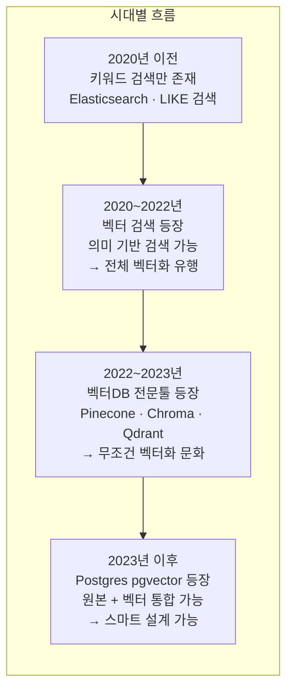
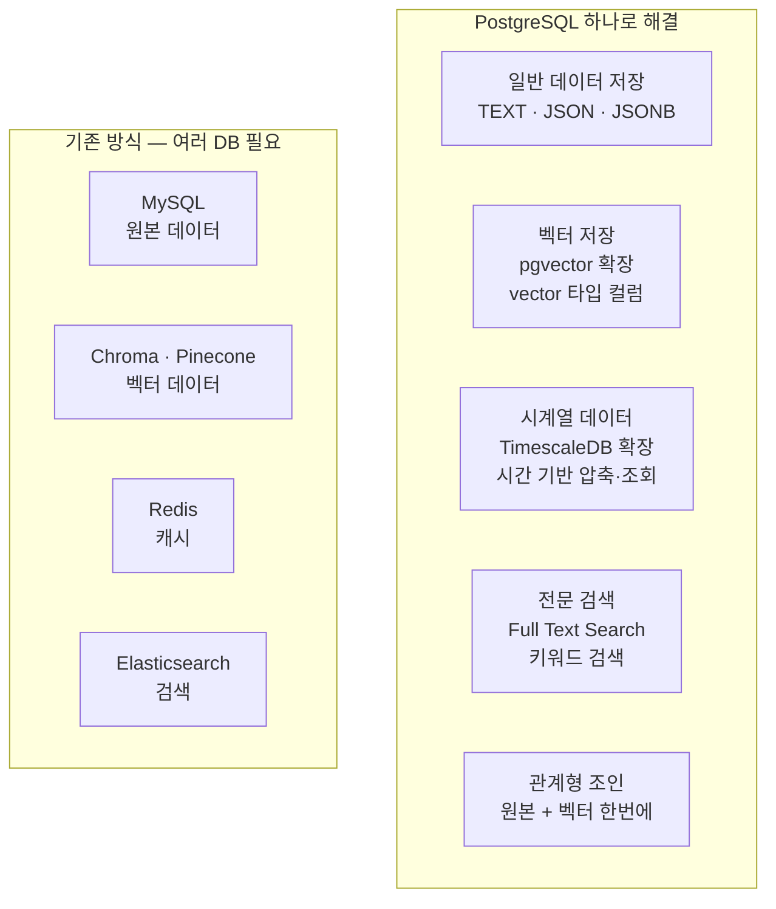
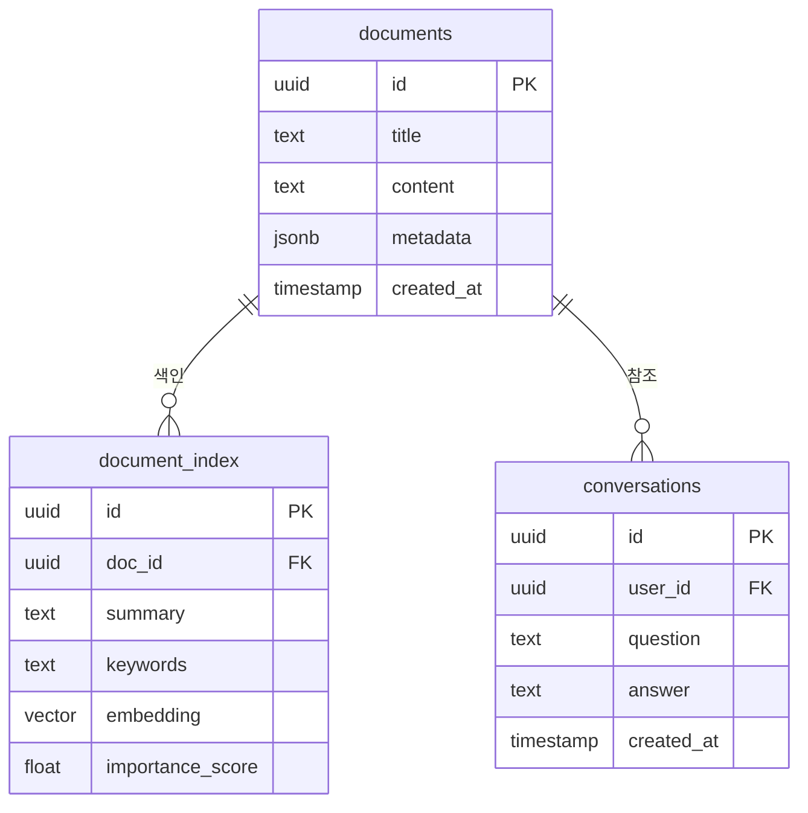
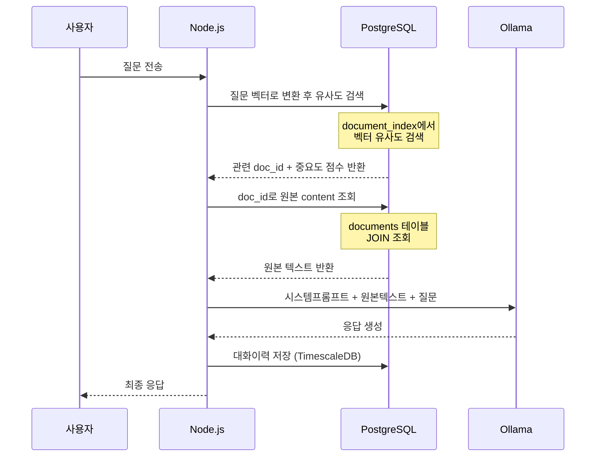

# NEXA 오케스트라 프로젝트 데이터베이스 설계 명세서 v5.0

**목적**: NEXA 플랫폼 메인 라우터(/nexa-node, /nexa-panel, /infra, /dev, /help 등)의 도메인별 요구사항을 수용하는 **프로젝트 중심 통합 DB 스키마**를 정의한다. 프로젝트 귀속 31개·비귀속 27개 테이블로 구성하며, 구현 시 작업 지시서로 사용한다.

**적용 범위**: Postgres(TimescaleDB)·RLS·JSONB·pgvector 기반 DB 설계. 기술 스택(UUID v7, JSONB, pgvector, TimescaleDB, Yjs) 및 [NEXA-STACK-01] 라우터별 정체성 반영. **Capability ID(기능 자격 ID)**는 플랫폼 전역 일급 객체로 [NEXA-CAPABILITY-01]에 따라 비귀속 테이블로 반영한다.

**참조**: [NEXA-STACK-01] 기술 스택·메인 라우터, [NEXA-AUTH-01] 계정·인증, [NEXA-AI-09] 프로젝트·파일, **[NEXA-CAPABILITY-01]** Capability ID 체계·Tier 접근 권한

**작성일**: 2025-03

---

## 0. Capability ID(기능 자격 ID): 일급 객체 및 DB 반영 전제

**용어 정리**: **표준 용어 Capability** (Capability ID). 한글 표기 **기능 자격**·**기능 자격 ID**. "역량"은 맥락에 따라 모호하므로, 특정 기능에 대한 자격·허가를 식별한다는 의미를 드러내기 위해 한글은 "기능 자격"으로 통일한다. 코드·DB·API에서는 Capability를 그대로 사용한다.

Capability ID(기능 자격 ID)는 단순히 DB의 한 컬럼이 아니라 플랫폼 전체를 관통하는 **일급 객체(First-Class Object)** 로 설계된다. 접근 제어뿐 아니라 연결·확장·사용 현황·감사·성능 최적화의 기본 단위로 활용되므로, 명세서에서 계층 구조와 발급/폐기 시나리오를 먼저 정리한 뒤 DDL(§1.1)에 테이블을 반영한다.

### 0.1 계층 구조 (네임스페이스 → 출처 → 도메인 → 기능)

점(`.`) 구분 계층이다. **와일드카드(`.`\*)를 명시할 때만** 하위 전체 허용(접두사 매칭); 없으면 동일 비교(`===`)만 적용한다.

| depth | 계층             | 설명                                                       | 예시                                                            |
| ----- | ---------------- | ---------------------------------------------------------- | --------------------------------------------------------------- |
| 1     | **네임스페이스** | 플랫폼 식별. `nexa` 고정                                   | `nexa`                                                          |
| 2     | **출처(Origin)** | 기능 자격 ID 소속 최상위. platform / edge / plugin         | `nexa.platform`, `nexa.edge`                                    |
| 3     | **영역/도메인**  | 출처 내 세부 영역. platform 하위: panel, archive, parts 등 | `nexa.platform.archive`, `nexa.platform.panel`                  |
| 4~    | **메뉴·액션**    | 하위 메뉴·화면·구체 액션                                   | `nexa.platform.archive.hub`, `nexa.platform.archive.hub.export` |

- **출처 예**: `platform`(플랫폼 전체), `edge`(엣지 디바이스), `plugin`(플러그인). 넥사패널은 platform 하위이므로 `platform.panel`로 구성.
- **인간 친화적 라벨링**: 모든 기능 자격 메타데이터에 `label`, `description`을 두어 관리자·사용자 가독성을 확보한다. 상세 규칙은 [NEXA-CAPABILITY-01] §2 참조.

### 0.2 발급·폐기 시나리오

| 시나리오        | 주체   | 저장소·동작                                                                                                                     | 이력                                                                                               |
| --------------- | ------ | ------------------------------------------------------------------------------------------------------------------------------- | -------------------------------------------------------------------------------------------------- |
| **Tier별 발급** | 관리자 | `tier_allowed_capabilities`에 (tier_id, capability_id) INSERT. capability_id는 `capabilities.capability_id` FK                  | **capability_grant_history** 테이블에 발급/폐기 이력 저장 필수. 누가·언제·왜에 대한 보안 감사 추적 |
| **폐기**        | 관리자 | 해당 행 DELETE 또는 Soft Delete. 엔티티는 유지, 기능 자격만 회수                                                                | 동일하게 **capability_grant_history**에 revoke 이벤트 기록. 이력 보존 필수                         |
| **동기화**      | 시스템 | 코드 레지스트리(Capability Registry) ↔ `capabilities` 메타데이터 Diff. 신규 INSERT, 제거분은 `status='inactive'` (Soft Delete) | `sync_at` 갱신                                                                                     |

- **고유 ID와 분리**: 발급 대상(tier_id, entity_id 등)과 기능 자격 ID는 별도 컬럼으로 저장. 엔티티 삭제 정책과 기능 자격 폐기 정책을 분리해 설계.
- **조회·캐시**: Tier별 허용 기능 자격은 조회 빈도가 높으므로 인덱스 설계 및 서버/Redis 캐시 대상. `capabilities.status='active'`인 것만 유효로 간주.

이 요구사항에 따라 **tiers**, **capabilities**, **tier_allowed_capabilities**, **capability_grant_history** 테이블을 비귀속 플랫폼 테이블(§1.1)에 포함하며, DDL-01 스키마 문서에 구체 컬럼을 반영한다. **사용자 기능 자격(User Capability)** 생성 시 AI가 참조하는 **capability_tag_whitelist**(태그 클라우드 화이트리스트)와, 추천된 기능 자격의 **적합성 점수(Fit Score)** 및 사후 승인 이력을 기록하는 **capability_proposals** 테이블도 동일하게 포함한다. API·라우트별 필요 기능 자격을 코드 배포 없이 관리하려면 **capability_map**(리소스 경로 ↔ Capability ID 매핑)을 두고, 인가 미들웨어에서 조회(캐시 권장)하여 사용한다.

---

## 1. 프로젝트 통합 데이터 스키마 리스트 (31개 테이블)

| No. | 테이블명                  | 라우터/도메인 매핑   | 주요 역할 및 특징                                                                                                                                                                                                   | 핵심 기술            |
| --- | ------------------------- | -------------------- | ------------------------------------------------------------------------------------------------------------------------------------------------------------------------------------------------------------------- | -------------------- |
| 1   | projects                  | 플랫폼 프로젝트 전역 | 최상위 프로젝트 식별 정보·도메인 분류. storage_id→storage_configs, storage_quota_bytes로 Quota 지정. current_storage_usage(BIGINT)로 사용량을 증분(Delta)만 갱신·MV로 주기 보정. **글로벌 그림자 프로젝트(Shadow Project)** 정책: 넥슈가 프로젝트 외부(가이드·비회원 체험·일상 도우미)에서 활동할 때 사용하는 effective_project_id는 물리적으로 기존 `project_id` 컬럼에 저장하며, GLOBAL_GUIDE·TRIAL_USER·DAILY_HELPER 등 특정 예약 UUID를 그림자 프로젝트로 두어 모든 넥슈 활동이 동일 Traceability 체계 내에 쌓이도록 한다. §2.5.1 참조.                                     | UUID v7, RLS         |
| 2   | project_members           | /my (AUTH)           | 사용자별 접근 권한 및 공유 상태 관리                                                                                                                                                                                | RLS                  |
| 3   | project_settings          | /settings            | 프로젝트별 전역 및 도메인별 설정 허브. settings_data에 **적용 중인** **코일 밸런서(Coil Balancer)** 템플릿 참조(current_coil_template_id)와 함께, **confidence_threshold**(SMALLINT, 0~100; 기본 70) 및 Autonomy Threshold 실행 게이트 값 `user_defined_threshold`(기본 95, UI ±15% 조정)를 저장한다. (settings_data.confidence_threshold는 CHECK 제약으로 0~100 범위를 보장) 원천(Source)·도메인(Domain)·프로젝트(Project) 레이어에 따라 유기적으로 확장되는 밸런서 체계. §1.1.x 참조.                                                                              | JSONB                |
| 4   | project_assets            | 프로젝트 전역자원    | 일반 문서, 코드, YAML 설정 파일 관리                                                                                                                                                                                | JSONB                |
| 5   | project_media             | /nexa-media          | 이미지, 사운드, 영상 등 멀티모달 자원                                                                                                                                                                               | FFmpeg               |
| 6   | project_tags              | 프로젝트 전역검색    | 탐색 필터링을 위한 시맨틱 태그 정보                                                                                                                                                                                 | pgvector             |
| 7   | project_logs              | 프로젝트 전역로그    | 현재/이력 레이어. **5W1H SMALLINT** 6컬럼 완전 분리(DB 레벨 90% 필터). summary, why_chain JSONB, embedding(유사 이력), extra_data JSONB. is_time_synced·last_sync_at(NTP). [문서 2] HEXAGON.                        | TimescaleDB          |
| 8   | project_resource_versions | 프로젝트 전역자원    | 스크립트·주요 설정 파일의 버전 이력(Commit 형태). project_releases와 연동해 안정 배포 버전 지정                                                                                                                     | JSONB                |
| 9   | project_folders           | 프로젝트 탐색기 (AI) | 계층적 트리 구조. yjs_state=압축 스냅샷만, 증분은 project_yjs_updates                                                                                                                                               | Yjs                  |
| 10  | project_links             | 탐색기 (AI)          | 웹 서치 결과 및 외부 참조 URL 관리                                                                                                                                                                                  | AI Crawler           |
| 11  | project_orchestra         | /nexa-ai             | 페르소나, 스킬(Tool Calling), 태스크 정의                                                                                                                                                                           | JSONB                |
| 12  | project_chats             | /nexa-ai             | AI 에이전트 대화 히스토리 및 맥락 유지                                                                                                                                                                              | Vercel AI SDK        |
| 13  | project_agent_sessions    | /nexa-ai             | AI 현재 상태(Thinking, Tool Calling, Action 등)·단기 작업 임시 데이터. 끊김 없는 협업 세션 복원                                                                                                                     | JSONB                |
| 14  | project_knowledge         | /nexa-archive        | 과거/지식 레이어. nature_tag(ROUTINE/INCIDENT/INTENT), **5W1H SMALLINT** 6컬럼 완전 분리(DB 레벨 90% 필터). content_fact(Sentinel Fact), raw_content, ref_ids(SNT-IND-EFF), metadata, extra_data JSONB. [문서 2·5]. | pgvector             |
| 15  | project_nodes             | /nexa-node           | 노드 기반 IoT 로직. yjs_state=압축 스냅샷만, 증분은 project_yjs_updates                                                                                                                                             | Vue Flow, Yjs        |
| 16  | project_scripts           | /nexa-node           | 프로젝트별 가변 비즈니스 로직 및 실행 스크립트. 기기 전체를 굽지 않고 동적 주입                                                                                                                                     | JSONB / Bytecode     |
| 17  | project_simulations       | /nexa-node           | 노드 구성에 따른 가상 시뮬레이션 결과값                                                                                                                                                                             | JSONB                |
| 18  | project_panels            | /nexa-panel          | 활성화된 위젯(Panel) 목록 및 개별 설정                                                                                                                                                                              | JSONB                |
| 19  | project_boards            | /nexa-board          | 대시보드 레이아웃 프리셋 정보                                                                                                                                                                                       | JSONB                |
| 20  | project_devices           | /infra               | 프로젝트에 할당된 장치 및 상태 관리. 배포된 펌웨어 버전 조합(core_fw_id, model_hw_id, script_id)으로 3단계(Core→Model→Script) 현재 상태 추적·AI 배포 오류 진단                                                      | MQTT, FK             |
| 21  | project_network_topology  | /network             | 디바이스 간 논리적/물리적 연결 맵 데이터                                                                                                                                                                            | JSONB                |
| 22  | project_traces            | /nexa-trace          | 사용자 동작 녹화 및 자동화 로직 시퀀스                                                                                                                                                                              | JSONB                |
| 23  | project_solutions         | /solutions           | 문제 정의 및 솔루션 기획(비전 공유) 데이터                                                                                                                                                                          | JSONB                |
| 24  | project_tasks             | /erp                 | 업무 일정, 마일스톤 및 진행 상태 관리(ERP 용도)                                                                                                                                                                     | ERP Hub              |
| 25  | project_parts_bom         | /erp/parts           | BOM(부품 명세). **AI 시맨틱 브릿지**: 웹 서치·기획 문서와 규격 템플릿 간 시맨틱 매핑. spec_id는 AI가 샌드박스에서 재고와 설계를 대조해 할당하는 동적 필드. 설계-재고-출고 연동                                      | JSONB, FK            |
| 26  | project_extensions        | /extension           | 설치된 플러그인 및 외부 API 연동 정보(자격 증명은 project_secrets 참조)                                                                                                                                             | JSONB                |
| 27  | project_secrets           | /extension           | 프로젝트별 외부 서비스 자격 증명. RLS·BYTEA(암호문만 저장)·앱 AES-256-GCM·DB pgcrypto 이중 암호화로 관리자 직접 조회 시 평문 노출 방지                                                                              | RLS, BYTEA, pgcrypto |
| 28  | project_releases          | /portfolio           | 최종 생산물 버전 및 전시용 메타데이터                                                                                                                                                                               | JSONB                |
| 29  | project_jobs              | 전역·백그라운드      | 장기 실행 작업(FFmpeg 인코딩, RAG 임베딩, 펌웨어 빌드 등) 상태·진행률. status/progress/error_msg. 재접속 시 UI 진행 표시 기준                                                                                       | JSONB                |
| 30  | project_user_presence     | 실시간 협업          | 폴더/노드별 현재 접속 사용자(Presence). resource_type/resource_id·activity(viewing·editing). UNLOGGED. "A님이 이 노드를 수정 중" 등 UI 협업 가시성                                                                  | UNLOGGED             |
| 31  | project_yjs_updates       | 실시간 동기화        | Yjs 증분 업데이트 로그. resource_type/resource_id·update_data(BYTEA). 단일 필드 덮어쓰기 대신 이력 적재. 서버 병합·스냅샷 전략용                                                                                    | BYTEA                |

**Secret 관리 구분**: 플랫폼 전역 설정·관리자용 키는 `.env` 등 서버 환경 변수로 관리한다. 사용자가 프로젝트에서 개별 연동한 외부 서비스(예: 개인 OpenAI 키, 외부 날씨 API)의 자격 증명은 `project_secrets`에만 저장하며, Postgres RLS로 프로젝트 멤버만 접근한다. **저장 필드는 BYTEA 또는 암호화된 텍스트만 허용**하여, 관리자가 DB를 직접 조회해도 평문이 노출되지 않도록 한다. 암호화는 **애플리케이션 레벨(AES-256-GCM, 키는 서버 환경 변수)**과 **DB 레벨(pgcrypto 확장으로 컬럼 추가 보호, 선택)**을 병행한다.

### 1.1 프로젝트 비귀속 플랫폼 테이블 (27개)

프로젝트에 귀속되지 않는 플랫폼 전역 라이브러리·원형 정의·감사·지원·저장소·**글로벌 태그/검색**·**Capability/Tier**·**사용자 기능 자격 추천(태그 화이트리스트·적합성 점수)** 정의용 테이블이다.

| No. | 테이블명                         | 단계 (구분)      | 역할 및 특징                                                                                                                                                                                                                                                                                                                              | 데이터 형식    | 관련 도메인              |
| --- | -------------------------------- | ---------------- | ----------------------------------------------------------------------------------------------------------------------------------------------------------------------------------------------------------------------------------------------------------------------------------------------------------------------------------------- | -------------- | ------------------------ |
| 1   | panel_components                 | —                | 위젯(Panel)의 원형 코드 및 UI 정의 데이터. 마켓플레이스 상품 리스트 역할.                                                                                                                                                                                                                                                                 | JSONB          | /nexa-panel              |
| 2   | node_definitions                 | —                | 표준 노드(센서, 로직, 통신 등)의 규격 및 속성 정의. /nexa-node에서 사용.                                                                                                                                                                                                                                                                  | JSONB          | /nexa-node               |
| 3   | document_templates               | —                | 작업 시방서, 제안서, 기술 문서 등 AI가 채워넣을 문서의 표준 레이아웃.                                                                                                                                                                                                                                                                     | JSONB          | /nexa-archive            |
| 4   | protocol_manifests               | —                | MQTT, ESPHome 등 기기 통신 시 사용하는 표준 프로토콜 명세 및 설정 프리셋.                                                                                                                                                                                                                                                                 | JSONB          | /infra, /network         |
| 5   | automation_recipes               | —                | 검증된 자동화 로직의 모범 사례(Best Practice). /nexa-trace에서 활용.                                                                                                                                                                                                                                                                      | JSONB          | /nexa-trace              |
| 6   | orchestra_scores                 | —                | 오케스트라 설정(페르소나·스킬) 공유 저장소. 프로젝트에 템플릿 적용 시 참조.                                                                                                                                                                                                                                                               | JSONB          | 라이브러리               |
| 7   | firmwares_core                   | Core (시스템)    | 기기 식별(Device Token), 최소 구동 및 복구/OTA용 최하위 펌웨어                                                                                                                                                                                                                                                                            | Binary         | —                        |
| 8   | firmwares_model                  | Model (하드웨어) | 하드웨어 모델별 핀 맵, 물리 설정 및 안전 가드레일(Interlock 등) 정의                                                                                                                                                                                                                                                                      | Binary / YAML  | —                        |
| 9   | device_registry                  | —                | 기기 최초 등록·라이프사이클 관리. UUID v7/시간 정렬 신뢰를 위해 is_time_synced·last_ntp_sync_at(NTP 검증) 포함                                                                                                                                                                                                                            | JSONB          | /infra                   |
| 10  | platform_audit_logs              | —                | 인증 실패, API 호출 빈도, 서버 리소스 상태 등 플랫폼 전역 감사·인프라 관리                                                                                                                                                                                                                                                                | TimescaleDB    | /dev                     |
| 11  | api_usage_stats                  | —                | API 호출 통계. /dev 및 인프라 관리용 TimescaleDB 하이퍼테이블                                                                                                                                                                                                                                                                             | TimescaleDB    | /dev                     |
| 12  | template_reviews                 | —                | library_templates·panel_components 평점·리뷰. 마켓플레이스 신뢰도 관리                                                                                                                                                                                                                                                                    | JSONB          | 라이브러리, /nexa-panel  |
| 13  | usage_metrics                    | —                | 템플릿 다운로드 수·인기도. 고품질 솔루션 선택 지원용 마켓플레이스 지표                                                                                                                                                                                                                                                                    | JSONB          | 라이브러리, /nexa-panel  |
| 14  | support_faq                      | —                | 플랫폼 사용법 FAQ. /help 조회 및 AI 상담 연계                                                                                                                                                                                                                                                                                             | JSONB          | /help                    |
| 15  | ai_consultation_logs             | —                | /help AI 챗 상담 이력. 플랫폼 가이드 자동 개선(Insights) 기초 자료                                                                                                                                                                                                                                                                        | TimescaleDB    | /help                    |
| 16  | storage_configs                  | —                | 저장소 백엔드 정의·quota_bytes(기본 할당량). projects.storage_quota_bytes와 연동. 트리거·MV로 project_assets/project_media 추가 시 Quota 검증 및 사용량 집계                                                                                                                                                                              | JSONB          | 전역 인프라              |
| 17  | global_tags                      | —                | 마켓플레이스 자산(orchestra_scores, panel_components 등)용 전역 시맨틱 태그. tag_vector로 유사 태그 검색                                                                                                                                                                                                                                  | pgvector       | 라이브러리, 마켓플레이스 |
| 18  | global_knowledge_base            | —                | 마켓 자산 검색용 요약·임베딩. content_type/content_id·embedding으로 pgvector 유사도 검색 → 최적 템플릿 발견. metadata에 tag_ids 등                                                                                                                                                                                                        | pgvector       | 라이브러리, 마켓플레이스 |
| 19  | **tiers**                        | —                | 회원 서비스 등급(BASIC, STANDARD 등). code, name, sort_order. 기능 자격 부여의 대상.                                                                                                                                                                                                                                                      | RLS            | /nexa-admin, AUTH        |
| 20  | **capabilities**                 | —                | 기능 자격 메타데이터(코드 레지스트리 동기화). capability_id(UNIQUE), label, description, type, parent_id, source(registry/manual), status(active/inactive), sync_at. 인간 친화적 라벨링 필수.                                                                                                                                             | JSONB, RLS     | 전역·오케스트레이션      |
| 21  | **tier_allowed_capabilities**    | —                | Tier별 허용 기능 자격. tier_id(FK→tiers), capability_id(FK→capabilities). 와일드카드(예: nexa.platform.archive.) 저장 가능.                                                                                                                                                                                                               | FK             | /nexa-admin, AUTH        |
| 22  | **capability_grant_history**     | —                | 발급·폐기 이력. 누가(granted_by/revoked_by), 언제(granted_at/revoked_at), 왜(reason) 권한을 변경했는지 보안 감사 추적. tier_id, capability_id, action(grant/revoke/RESOLVE_CONFLICT), actor_id, reason, created_at                                                                                                                                         | JSONB, RLS     | /nexa-admin, 감사        |
| 23  | **sandbox_profiles**             | —                | V8 Isolate 격리 환경 프로필. memory_limit_mb, cpu_time_limit_ms, allowed_modules(JSONB), timeout_sec 등. 오케스트레이터가 격리 실행 환경 구성 시 참조. **sandbox_profile_capabilities**로 실행 시 상속할 기능 자격 ID 연결 필수—미연결 시 권한 부족·보안 홀 발생                                                                          | JSONB, RLS     | /nexa-ai, /nexa-node     |
| 24  | **sandbox_profile_capabilities** | —                | 샌드박스 프로필별 상속 기능 자격. profile_id(FK→sandbox_profiles), capability_id(FK→capabilities). 해당 프로필 내 스크립트가 이 Capability를 상속해 기기 제어·API 호출 시 권한 검사. 미연결 시 권한 부족 또는 과도한 권한(보안 홀) 위험                                                                                                   | FK, RLS        | /nexa-ai, /nexa-node     |
| 25  | **capability_tag_whitelist**     | —                | AI 사용자 기능 자격 추천용 **태그 클라우드(화이트리스트)**. 관리자가 "이 범위 내에서만 추천하라"고 지정하는 기준 태그 목록. scope_key(예: user_capability), tag, sort_order. AI는 이 whitelist에 매칭되는 기능 자격 ID만 후보로 제안                                                                                                      | JSONB, RLS     | /nexa-admin, /nexa-ai    |
| 26  | **capability_proposals**         | —                | AI 추천 기능 자격·**적합성 점수(Fit Score)** 기록. target_entity_id(user 등), capability_id(FK), fit_score(0~100), request_context(사용자 설명), status(pending/approved/rejected), recommended_at, approved_by, approved_at, rejected_at, rejection_reason. 사후 승인·거절 워크플로. **거절 시 롤백·격리 정책 및 자동 무효화 로직 연동** | JSONB, FK, RLS | /nexa-admin, /nexa-ai    |
| 27  | **capability_map**               | —                | API·라우트 경로와 필요 기능 자격 ID 매핑. resource_type, resource_path, method(선택), required_capability_id(FK), source(registry/override). 코드 레지스트리 선언 시 동기화로 자동 갱신, override는 관리자 수동. 미들웨어 조회 시 Redis 캐시 권장.                                                                                        | FK, RLS        | 전역 인가·/nexa-admin    |

**capability_map**: 라우트 메타만 쓰면 새 API·정책 변경 시 코드 배포가 필요할 수 있다. 이 테이블에 경로–Capability 매핑을 두면 관리자가 DB에서 동적으로 추가·수정할 수 있고, 인가 미들웨어가 (캐시를 거쳐) 이 매핑을 참조해 판단한다. 라우트 메타는 기본값, DB는 override 또는 단일 소스로 사용 가능.

**승인 거절 시 롤백·격리 정책 (capability_proposals)**: "즉시 적용 후 사후 승인" 모델에서, 거절 전에 해당 자격으로 **이미 생성된 데이터**나 **실행된 액션**이 존재할 수 있다. 승인이 거절되었을 때 다음 정책을 적용한다. (1) **롤백(Rollback)**: 되돌릴 수 있는 데이터·액션은 삭제·원복. (2) **격리(Isolation)**: 롤백 불가한 경우 `invalidated_by_proposal_id` 등으로 표시해 접근 제한·검토 대기. (3) **자동 무효화**: `capability_proposals.status`가 `rejected`로 전환될 때, 해당 proposal_id와 연관된 엔티티(project_orchestra, project_chats 등에 `proposal_id` FK 또는 `capability_proposal_id` 메타 저장 시)를 자동으로 롤백 또는 격리 처리하는 워크플로·트리거가 동작해야 한다. 구현 시 `rejected_at`, `rejection_reason` 저장 후 배치/이벤트 기반으로 무효화 Job 실행 권장.

**sandbox_profiles ↔ Capability 연결**: 격리 환경에서 스크립트가 기기 제어·API 호출 시 어떤 기능 자격으로 실행되는지 **sandbox_profile_capabilities** 테이블로 명시한다. profile_id→capability_id 매핑. 오케스트레이터는 스크립트 실행 전 (1) 해당 스크립트의 sandbox_profile_id를 확인하고, (2) sandbox_profile_capabilities에서 허용 capability_id 목록을 조회하여, (3) 격리 환경 컨텍스트에 주입. 연결이 없으면 권한 부족으로 실패하거나, 맹목적으로 넓은 권한을 부여해 보안 홀이 생길 수 있으므로 **프로필 생성 시 기본 Capability 매핑 정의**를 권장한다.

**코드 레지스트리 선언 시 DB 매핑 자동 갱신**: 개발자가 수동으로 DB에 매핑을 넣지 않도록, **코드 레지스트리(Route/API Registry)** 에 경로·메서드·필요 Capability를 선언하면 **동기화 프로세스**가 `capability_map`을 자동 갱신한다. (1) 서버 기동 시 또는 `POST /api/admin/capability-map/sync` 호출 시, (2) 레지스트리(`routeRegistry`, 플러그인 등록 시 `apiRegistry`)에 선언된 항목과 DB를 Diff하여 신규 INSERT·변경 UPDATE·제거분은 `source='registry'` 행만 DELETE 또는 비활성 처리. (3) 관리자가 DB에서 수동 추가·수정한 행은 `source='override'` 등으로 구분해 동기화 시 덮어쓰지 않는다. 이렇게 하면 신규 플러그인·API 추가 시 개발자는 코드에 선언만 하면 되고, 매핑 생성은 시스템이 담당한다.

**시맨틱 태그 용어 및 예시(참고)**: 본 문서의 시맨틱 태그는 **HTML 표준 시맨틱 태그**(`<header>`, `<nav>`, `<article>` 등)가 아니다. 마켓 자산의 **의미·용도 분류**를 위한 라벨이며, pgvector 유사도 검색·추천에 사용된다. `global_tags.category`로 대분류를 두고, 아래와 같은 예시를 참고용으로 부여할 수 있다.

| 구분        | 예시                                             |
| ----------- | ------------------------------------------------ |
| 용도/도메인 | `스마트팩토리`, `실내환경모니터링`, `에너지절감` |
| 시나리오    | `대시보드`, `알람자동화`, `데이터로깅`           |
| 대상        | `초보자용`, `고급제어`, `템플릿`                 |
| 기술/스택   | `MQTT`, `ESP32`, `센서퓨전`                      |

#### 1.1.x 밸런스(가중치) — 시스템/사용자 동일 테이블, 적용만 settings (제안)

[문서 3] §5.4·§5.5 반영. **정의·템플릿은 balance_coil_definitions / balance_coil_templates 한 테이블씩에 시스템·사용자 구분하여 모두 저장.** 사용자도 동일 테이블에서 직접 관리·현황 파악 가능. **project_settings는 "어떤 템플릿을 불러와 적용할지"만 저장** — 사용자가 만든 것·시스템 것을 두 테이블에서 불러와 그 중 하나를 적용 설정.

| 테이블/위치                  | 귀속                          | 역할·주요 컬럼                                                                                                                                                                                                                       |
| ---------------------------- | ----------------------------- | ------------------------------------------------------------------------------------------------------------------------------------------------------------------------------------------------------------------------------------ |
| **balance_coil_definitions** | 비귀속(시스템+사용자 행 공존) | **코일 밸런서(Coil Balancer)** 가중치 항목 메타. 원천(Source)·도메인(Domain)·프로젝트(Project) 레이어에 따라 유기적으로 확장(6/12/24 + 프로젝트별 확장). `coil_id`, **origin** `'system'` \| `'user'`, **project_id** NULL(시스템) / FK(사용자), `tier`, `code`, `label`, `sort_order`, `status`. 시스템 행은 [문서 3] §1·§5 기준.               |
| **balance_coil_templates**   | 비귀속(시스템+사용자 행 공존) | **코일 밸런서(Coil Balancer)** 도메인별·성격별 템플릿. 원천/도메인/프로젝트 레이어 확장 체계. `template_id`, **origin** `'system'` \| `'user'`, **project_id** NULL / FK, **capability_id** FK→capabilities(영역), `character_key`, `name`, `weight_spec` JSONB, `min_safety_stability_pct`, `created_at`. |
| **project_settings**         | 프로젝트                      | **적용만:** `settings_data.current_coil_template_id` UUID → balance_coil_templates.template_id. 또한 `settings_data.confidence_threshold`(SMALLINT, 0~100; 기본 70)을 저장하며 settings_data 기반 CHECK으로 유효 범위를 보장한다. **코일 밸런서** 템플릿 중 시스템 또는 본 프로젝트가 만든 것을 선택해 적용.                                                                         |

**구분 규칙:** 출처 = **origin** + **project_id**(NULL = 시스템, NOT NULL = 해당 프로젝트 소유). 영역 = **capability_id**. [NEXA-CAPABILITY-01] 규칙에 따라 capability_id에 **와일드카드(`.*`)를 명시**하면 접두사 매칭이 적용되며(예: `nexa.platform.archive.*`), 해당 영역과 그 하위 전체에 템플릿을 한 번에 적용할 수 있다. 오케스트레이터는 현재 프로젝트의 project_settings.current_coil_template_id로 템플릿을 조회해 GOVERN·RAG에 반영.

**보안 검토 (RLS·권한)**

- **balance_coil_definitions / balance_coil_templates:** (1) **시스템 행**(origin='system' 또는 project_id NULL): 일반 사용자 INSERT·UPDATE·DELETE 금지(관리자·배포만). (2) **사용자 행**(project_id NOT NULL): 해당 프로젝트 멤버만 SELECT·INSERT·UPDATE·DELETE. RLS로 "본인 프로젝트 행만 수정 가능" 강제 시 시스템 행 덮어쓰기·삭제 방지. (3) **project_settings.current_coil_template_id**로 설정 가능한 값은 "시스템 템플릿" 또는 "해당 project_id와 일치하는 사용자 템플릿"만 허용 — 앱/API에서 선택지 필터링 또는 CHECK/트리거로 타 프로젝트 템플릿 참조 차단 권장.

### 1.2 현재 생성된 테이블 현황

DB에 이미 생성되어 있는 테이블 목록이다. 설계안(§1, §1.1)과의 대응 관계를 명시하여 추후 마이그레이션·통합 시 참고한다.

| No. | 테이블명         | 설계 대응 (목표)                     | 비고                                                |
| --- | ---------------- | ------------------------------------ | --------------------------------------------------- |
| 1   | users            | —                                    | [NEXA-AUTH-01] 계정·인증. project_members 상위 주체 |
| 2   | projects         | projects (귀속 No.1)                 | 최상위 프로젝트                                     |
| 3   | files            | 전역 파일 레지스트리                 | 아래 「파일 테이블 사용 방침」 참조                 |
| 4   | file_references  | 전역 파일 참조                       | 아래 「파일 테이블 사용 방침」 참조                 |
| 5   | part_specs       | node_definitions 등                  | 파트(노드/부품) 규격 정의                           |
| 6   | part_classes     | node_definitions 등                  | 파트 분류 체계                                      |
| 7   | part_models      | node_definitions 등                  | 파트(모델) 정의                                     |
| 8   | part_files       | node_definitions·project_assets      | 파트별 첨부 파일                                    |
| 9   | device_registry  | device_registry (비귀속 No.9)        | 기기 등록·라이프사이클                              |
| 10  | device_members   | project_members·device 단위          | 기기별 멤버/공유. project_devices와 연계            |
| 11  | ai_user_memos    | project_knowledge·project_chats 연계 | AI·사용자 메모. 채팅/지식 보조                      |
| 12  | system_templates | document_templates·orchestra_scores  | 시스템 공통 템플릿. 문서/오케스트라 레이아웃        |

**파일 테이블 사용 방침**: `files`와 `file_references`는 플랫폼 범용 테이블로 유지한다. 엣지 디바이스·AI·개인 프로필·프로젝트 등 출처와 무관하게 **모든 파일은 이 경로를 통해서만 등록**하며, `project_assets`·`project_media` 등 프로젝트 하위 테이블에는 **참조 데이터(file_id 등)만 저장**한다.

---

## 2. 설계 핵심 지향점

### 2.1 AI 협업 최적화 (RAG & Tool Calling)

`project_knowledge`(No.5)와 `project_orchestra`(No.4)는 AI가 프로젝트 배경 지식을 습득하고 가용 도구를 파악하는 핵심 기반이다. pgvector로 사용자 의도에 가장 가까운 지식을 추출하여 답변 품질을 높인다. `project_chats`(No.6)·`project_logs`(No.21)와 함께 벡터·대화 맥락·행동 이력을 삼각 편대로 구성하여, AI가 프로젝트의 과거·현재·미래를 종합적으로 파악하고 조언할 수 있는 장기 기억 구조를 확보한다. `project_agent_sessions`(No.13)는 AI 현재 상태(Thinking, Tool Calling, Action 등)와 단기 작업 임시 데이터를 보관하여 세션 끊김 없이 협업을 이어갈 수 있게 한다. 해당 데이터는 쓰기 빈도가 높고 수명이 짧은 휘발성 데이터이므로, DDL에서는 UNLOGGED 테이블로 선언하고 last_active 기준 24시간 TTL 삭제를 관리 로직(스케줄)으로 적용한다. **project_user_presence**(No.30)는 같은 프로젝트 내에서 **지금 누가 어떤 폴더·노드 화면을 보고 있는지** 사용자 존재(Presence) 정보를 UNLOGGED로 저장하며, resource_type/resource_id·activity(viewing·editing)로 "A님이 이 노드를 수정 중입니다" 같은 협업 가시성을 UI에 제공한다. last_active 기준 주기 삭제(예: 5~10분 미갱신)를 권장한다.

### **AI 협업 삼각 편대** 란?

**AI 협업 삼각 편대**는 NEXA 플랫폼이 지능형 워크스페이스로서 프로젝트의 **"과거·현재·미래"를 종합적으로 파악**하고 AI가 지능적인 조언과 제어를 수행할 수 있도록 설계된 핵심 데이터 레이어의 상호작용 체계를 의미 한다.

이 체계는 다음 세 가지 핵심 테이블과 개념으로 구성된다.

#### 1. 지식 (Knowledge / 과거)

- **관련 테이블**: `project_knowledge` (No. 14)
- **역할**: 프로젝트의 **'과거'** 유산이자 배경 지식. 시방서, 기술 문서 등 RAG(검색 증강 생성)를 위한 원천 데이터를 보관.
- **핵심 기술**: **pgvector**로 사용자 의도와 유사한 지식을 벡터 검색. **5W1H SMALLINT** 6컬럼 완전 분리로 DB 레벨에서 90% 데이터를 걸러낸 뒤 벡터 검색하여 RAG 품질·속도 확보. content_fact(요약)·raw_content(원문)·ref_ids·extra_data JSONB로 유연성 확보.

#### 2. 채팅 (Chats / 현재)

- **관련 테이블**: `project_chats` (No. 12)
- **역할**: 사용자와 AI 에이전트 간의 대화 히스토리와 실시간 맥락을 담당하는 **'현재'**의 데이터 레이어.
- **핵심 기술**: **Vercel AI SDK**를 통해 대화 맥락을 유지하고 실시간 스트리밍 답변을 제공하여 사용자와의 끊김 없는 소통을 지원.

#### 3. 오케스트라 (Orchestra / 미래)

- **관련 테이블**: `project_orchestra` (No. 11)
- **역할**: AI의 페르소나, 사용 가능한 도구(Tool Calling), 수행할 태스크(악보)를 정의하는 **'미래'**의 실행 계획 레이어.
- **핵심 기술**: **JSONB** 형식을 통해 유연한 스킬 셋과 태스크 로직을 관리하며, **LangChain** 엔진이 이 정보를 바탕으로 구체적인 실행 순서와 데이터 흐름을 결정하는 '지휘자' 역할을 수행.

#### 요약 및 연동 원리

이 삼각 편대는 상호작용을 통해 AI가 단순히 묻는 말에 답하는 수준을 넘어, **지식(과거)**을 검색하고 **채팅(현재)**의 맥락을 분석하여 **오케스트라(미래)**에 정의된 스킬과 액션을 실행하도록 설계됨.

또한, 이 과정은 **기능 자격 ID(Capability ID)** 체계를 통해 각 요소에 접근할 수 있는 '자격'이 있는지 실시간으로 검증되어 보안과 정합성을 유지합니다. 이 구조를 통해 AI는 프로젝트의 전 생애주기(유통기한, TTL, 만료)를 관통하는 지능형 파트너로서 동작하게 된다.

### 2.2 실시간 동기화 및 데이터 유연성 (Yjs, JSONB, pgvector)

`project_folders`(No.9)·`project_nodes`(No.15)는 Yjs 레이어로 다중 사용자 협업 시 충돌 없이 실시간 동기화된다. 단, Yjs 업데이트 바이너리를 단일 필드(`yjs_state`)에 덮어쓰기만 하면 동시 편집 시 DB 레벨에서 충돌 없음 병합이 깨질 수 있으므로, **이력 기반 증분 저장 및 스냅샷** 전략을 둔다.

**① 증분 업데이트 테이블**  
단일 필드 덮어쓰기 대신, 발생하는 모든 변경(Update)을 개별 행으로 쌓는다. **project_yjs_updates**(No.31): `id`, `project_id`, `resource_type`('folder'|'node'), `resource_id`, `update_data`(BYTEA), `created_at`.

**② 서버 측 병합 및 스냅샷**

- **병합**: 서버(Node.js/Express)가 Y.Doc 인스턴스를 유지하며 클라이언트로부터 오는 업데이트를 실시간 병합.
- **스냅샷**: `project_folders.yjs_state`, `project_nodes.yjs_state`는 전체 이력이 아닌 **압축된 스냅샷(Compacted Snapshot)**만 저장.
- **주기 최적화**: 업데이트 로그가 일정 수 이상 쌓이면 서버가 병합하여 스냅샷 테이블을 갱신하고, 오래된 project_yjs_updates 행을 정리해 데이터 크기를 관리.

**③ Redis·Web Worker 부하 분산**

- **Redis**: 초고빈도 업데이트를 Redis(큐/캐시)에 먼저 담아 처리 속도를 높이고, 배치(Batch) 단위로 DB에 영속화해 DB I/O 부하를 줄인다.
- **Web Worker**: 클라이언트에서 대용량 Yjs 바이너리 파싱·병합 계산을 Web Worker로 분리해 메인 스레드 UI 응답성을 유지한다.

**④ 정합성 검증**  
명세에 반영된 **is_time_synced**, **last_sync_at**(project_logs 등) 메타데이터를 활용해, 업데이트 발생 선후 관계를 시스템·AI가 더 정확히 판단하도록 보정할 수 있다.

JSONB·pgvector 기반 테이블은 스키마 유연성과 확장성을 보장한다.

### 2.3 공유 및 재사용 전략

`orchestra_scores`(비귀속)로 페르소나·스킬 세트·대시보드 구성을 템플릿화하여 타인과 공유하거나 프로젝트에 재적용한다.

### 2.4 도메인 수직 계층화 및 물리 연결

`/nexa-node` 설계 결과는 `project_scripts`(No.16)로 비즈니스 로직을 주입하고, `firmwares_core`·`firmwares_model`(비귀속) 기반 기기가 `project_devices`(No.20)를 통해 `/infra`에 배포된다. `project_devices`에는 실제 디바이스에 배포된 **현재 상태**를 추적하는 버전 조합 FK(`core_fw_id`→firmwares_core, `model_hw_id`→firmwares_model, `script_id`→project_scripts)를 두어, 3단계(시스템 Core → 하드웨어 Model → 로직 Script) 배포 상태를 명확히 하고 AI가 배포 오류를 진단할 수 있게 한다. `project_resource_versions`(No.25)는 스크립트·주요 설정 파일의 변경 이력(Commit 형태)을 관리하며, `project_releases`(No.22)와 연동하여 특정 버전을 안정 배포용으로 지정한다. 해당 과정은 `project_traces`(No.19)에 기록되며, `project_network_topology`(No.13)로 인프라 위상을 시각화한다.

### 2.5 데이터 격리 및 보안

프로젝트 귀속 테이블은 `project_id`를 외래키로 가지며, Postgres RLS 정책으로 프로젝트 멤버가 아닌 사용자의 접근을 차단한다.

#### 2.5.1 project_id 개념적 확장: 글로벌 그림자 프로젝트(Shadow Project) ID 계약

넥슈(NEXU)가 **프로젝트 외부**에서 활동할 때(가이드 모드, 비회원 임시 체험, 회원의 프로젝트 아닌 일상·도우미 활동)에도 `project_logs`·`project_knowledge` 등은 `project_id NOT NULL` 제약을 유지해야 하므로, **effective_project_id** 개념에 따라 물리적으로는 기존 **`project_id`** 컬럼에만 저장한다. 이때 사용하는 값은 **글로벌 그림자 프로젝트(Shadow Project)**로 미리 예약한 고정 UUID다. 플랫폼은 아래와 같은 예약 UUID를 그림자 프로젝트로 등록하여, 넥슈의 모든 활동이 동일한 Traceability(추적성) 체계 안에 쌓이도록 한다.

| 예약 용도 | 설명 | 비고 |
|-----------|------|------|
| **GLOBAL_GUIDE** | 플랫폼 가이드·도우미(프로젝트 아닌 도우미) 활동 | `projects`에 해당 project_id 행을 미리 생성해 두거나, 시드 데이터로 등록 |
| **TRIAL_USER** | 비회원(임시 체험) 넥슈 활동 | 동일 |
| **DAILY_HELPER** | 회원의 프로젝트 아닌 일상 활동(홈·탐색·설정 등) | 동일 |

구현 시 `extra_data` 또는 `metadata`(JSONB)에 `scope_type`('IN_PROJECT' | 'GLOBAL') 및 필요 시 `scope_subtype`('TRIAL' | 'DAILY' | 'HELPER')을 저장하여, 실제 프로젝트 컨텍스트와 그림자 프로젝트 구간을 구분한다. [NEXU-SCHEMA] 넥슈 데이터 스키마 참조.

`project_secrets`(No.27)는 RLS에 더해 **자격 증명을 암호문만 저장**한다. 저장 컬럼(`encrypted_value`)은 **BYTEA**로 두며 평문 TEXT 저장을 금지하고, **애플리케이션 레벨**에서는 AES-256-GCM 등으로 암호화한 뒤 DB에 전달하고, **DB 레벨**에서는 pgcrypto 확장(예: `pgp_sym_encrypt`/`pgp_sym_decrypt`)으로 특정 컬럼을 한 번 더 보호할 수 있다. 복호화는 서버 애플리케이션(및 필요 시 pgcrypto 키를 세션으로 주입한 뒤)만 수행하여, 관리자 DB 직접 조회 시에도 평문이 노출되지 않도록 한다.

### 2.6 플랫폼 전역 감사·마켓플레이스·지원

`project_logs`(No.7)는 프로젝트 단위 AI 제안 이력·감사 로그이다. PK에 UUID v7을 사용할 때 엣지 디바이스 RTC가 NTP 미동기화면 시간 기반 정렬이 꼬일 수 있으므로, **is_time_synced**·**last_sync_at** 컬럼으로 로그 발생 시점의 시간 동기화 여부를 기록하여 정렬 신뢰성을 확보한다. 플랫폼 전역 인증 실패·API 호출·서버 리소스는 `platform_audit_logs`·`api_usage_stats`(비귀속)로 TimescaleDB 하이퍼테이블 관리하며 `/dev`·인프라 관리에 활용한다. `device_registry`(비귀속)는 `/infra`에서 기기 최초 등록·라이프사이클의 시작점이며, **is_time_synced**·**last_ntp_sync_at**으로 등록·갱신 시점의 NTP 동기화 여부를 저장하여 UUID v7 및 시간 기반 정렬의 신뢰성을 보완한다. `storage_configs`(비귀속)는 플랫폼이 지원하는 저장소 백엔드를 정의하며, **quota_bytes**로 저장소별 기본 할당량을 둔다. `projects`는 **storage_quota_bytes**로 프로젝트별 용량 제한을 지정하고, `project_assets`·`project_media`에 파일이 추가될 때 **트리거**로 현재 사용량 합산 후 제한치 초과 여부를 검증한다. 사용량 집계는 **머티리얼라이즈드 뷰(project_storage_usage_mv)**를 주기적으로 REFRESH하여 대시/관리 API에서 활용한다. 플랫폼 규모 확장 시 특정 프로젝트 미디어만 외부 클라우드로 이전하거나 프로젝트별 Quota를 부여할 때의 기준 데이터가 된다. `template_reviews`·`usage_metrics`(비귀속)로 라이브러리·패널 템플릿의 평점·리뷰·다운로드 수를 관리하여 마켓플레이스 신뢰도와 인기도를 제공한다. **글로벌 라이브러리 태그·검색**을 위해 **global_tags**(비귀속 No.17)·**global_knowledge_base**(비귀속 No.18)를 둔다. 사용자가 오케스트라 설정·패널 컴포넌트 등을 마켓에 등록할 때 시맨틱 태그를 부여하고, `global_knowledge_base`에 검색용 요약·임베딩을 저장한다. 다른 사용자는 pgvector 기반 유사도 검색으로 최적의 템플릿을 찾을 수 있으며, `project_tags`(No.6)는 프로젝트 내부 시맨틱 탐색 전용으로 유지한다. `/help`는 `support_faq`로 FAQ를 제공하고, `ai_consultation_logs`에 AI 챗 상담 이력을 저장하여 플랫폼 가이드 자동 개선(Insights)의 기초로 사용한다.

### 2.7 구현 시 가이드 (설계 검증 요약)

제작 시 아래 세 가지를 기준으로 설계 일관성을 유지한다.

| 구분                                   | 가이드 요약                                                                                                                                          | 구현 시 유의점                                                                                                                                                                                                                                                                                                                                                                                                                                                                      |
| -------------------------------------- | ---------------------------------------------------------------------------------------------------------------------------------------------------- | ----------------------------------------------------------------------------------------------------------------------------------------------------------------------------------------------------------------------------------------------------------------------------------------------------------------------------------------------------------------------------------------------------------------------------------------------------------------------------------- |
| **3단계 펌웨어 구조**                  | 시스템(`firmwares_core`) → 하드웨어(`firmwares_model`) → 로직(`project_scripts`) 순의 분리 전략을 유지한다.                                          | `project_devices`에 `core_fw_id`, `model_hw_id`, `script_id` FK로 배포된 버전 조합을 저장하여 현재 탑재 상태를 추적하고, AI 배포 오류 진단에 활용한다. 로직은 JSONB/Bytecode로 관리하고 기기 전체를 굽지 않고 동적 주입한다.                                                                                                                                                                                                                                                        |
| **AI 협업 삼각 편대**                  | `project_knowledge`·`project_orchestra`·`project_chats`가 상호작용하여 AI 장기 기억 구조를 이룬다.                                                   | AI 워크스페이스의 핵심 가치인 **과거·현재·미래의 종합 파악**이 가능하도록 세 테이블 간 연동과 RAG/맥락 흐름을 보장한다.                                                                                                                                                                                                                                                                                                                                                             |
| **실시간 동기화 레이어**               | `project_folders`·`project_nodes`에 Yjs 적용. 단일 필드 덮어쓰기는 동시성 시 정합성 깨짐.                                                            | **이력 기반 증분·스냅샷**: **project_yjs_updates**(No.31)에 증분 적재. yjs_state는 압축 스냅샷만. 서버(Node.js)에서 Y.Doc 병합·주기 스냅샷 갱신. Redis 배치 영속화·Web Worker 파싱. is_time_synced/last_sync_at으로 선후 보정.                                                                                                                                                                                                                                                      |
| **자격 증명 암호화**                   | `project_secrets`의 실제 값은 BYTEA(암호문만 저장)·RLS와 병행.                                                                                       | **앱 레벨**: AES-256-GCM, 키는 서버 환경 변수. **DB 레벨**: pgcrypto로 컬럼 추가 보호(선택). 관리자 DB 직접 조회 시 평문 노출 방지.                                                                                                                                                                                                                                                                                                                                                 |
| **시간 동기화(NTP) 검증**              | UUID v7은 시간 기반 정렬을 전제로 하며, 엣지 RTC 미동기화 시 순서가 꼬일 수 있음.                                                                    | `device_registry`에 **is_time_synced**, **last_ntp_sync_at**. `project_logs`에 **is_time_synced**, **last_sync_at**. 등록·로그 시점의 NTP 동기화 여부를 저장해 시간 기반 정렬 신뢰성 확보.                                                                                                                                                                                                                                                                                          |
| **저장소 할당량(Quota)**               | `storage_configs.quota_bytes`, `projects.storage_quota_bytes`로 용량 제한. `projects.current_storage_usage`로 사용량을 증분만 유지해 쓰기 성능 확보. | **BEFORE INSERT**: `current_storage_usage` + 새 파일 크기만으로 할당량 검사(전체 SUM 없음). **AFTER INSERT/DELETE**: 증분(Delta)만 `current_storage_usage`에 반영. **MV**: `project_storage_usage_mv` 주기 REFRESH 후, MV 기준으로 `current_storage_usage` 정기 보정. `files.size_bytes` 필요.                                                                                                                                                                                      |
| **장기 실행 작업(Job)**                | `project_agent_sessions`는 실시간 에이전트 상태, `project_logs`는 이력. 수 분 이상 걸리는 백그라운드 작업은 별도 관리.                               | **project_jobs**(No.29): FFmpeg 인코딩·RAG 임베딩·펌웨어 빌드 등. **status**(Pending/Running/Completed/Failed/Cancelled), **progress**(0–100%), **error_msg**. 사용자가 브라우저를 닫았다가 재접속해도 UI에서 진행 상황 표시 가능. `project_tasks`(No.24)는 ERP 업무용으로 유지.                                                                                                                                                                                                    |
| **글로벌 라이브러리 태그·검색**        | `project_tags`(No.6)는 프로젝트 내부 시맨틱 탐색. 마켓플레이스 자산은 전역 태그·검색 체계 필요.                                                      | **global_tags**(비귀속 No.17): 마켓 자산용 시맨틱 태그·tag_vector. **global_knowledge_base**(비귀속 No.18): content_type/content_id·content_text·embedding. 마켓 등록 시 태그 부여·요약 임베딩 저장 → pgvector 유사도 검색으로 최적 템플릿 발견.                                                                                                                                                                                                                                    |
| **사용자 존재(Presence)**              | 실시간 협업 시 "지금 누가 이 폴더/노드를 보고 있는가" DB 저장이 없음.                                                                                | **project_user_presence**(No.30): UNLOGGED. project_id·user_id·resource_type('folder'/'node')·resource_id·activity('viewing'/'editing')·last_active. 하트비트 갱신 후 주기 삭제로 UI 협업 가시성 제공.                                                                                                                                                                                                                                                                              |
| **BOM·실물 재고 연동**                 | 설계(BOM)에 필요한 부품과 재고(물리 위치)의 연결 고리 부재 시 동일 부품 판별 불가.                                                                   | **project_parts_bom**: **AI 시맨틱 브릿지**—웹 서치·기획 문서와 규격 템플릿 간 시맨틱 매핑 저장소. **spec_id**: AI가 샌드박스에서 재고와 설계를 대조해 할당하는 동적 필드(실물 참조). part_model_id=무엇이 필요한가, spec_id=어느 실물을 쓸 것인가. 설계-재고-출고 자동화.                                                                                                                                                                                                          |
| **RAG·시맨틱 검색 벡터 인덱스**        | 대규모 지식/태그 검색 시 풀 스캔 방지 및 RAG 응답 속도 확보.                                                                                         | **거리**: 시맨틱/RAG 특성상 **코사인 유사도**(`vector_cosine_ops`) 사용. **HNSW 디폴트**: project_knowledge.embedding, project_tags.tag_vector, global_knowledge_base.embedding, global_tags.tag_vector, support_faq.faq_vector. **IVFFlat**: 사용자·오케스트레이션 선택 시 대안(대량 삽입 후 검색 위주·메모리 제약). DDL-01 §「pgvector 인덱스 및 성능 최적화 가이드」에 스크립트·ef_search 안내.                                                                                  |
| **HEXAGON(5W1H) 완전 분리·extra_data** | DB 레벨에서 90% 데이터 즉시 필터 목표. 5W1H를 **SMALLINT 6컬럼**으로 완전 분리. 나머지 상세는 **extra_data JSONB**. **how_state**: VOID 값은 단순 '없음'이 아니라 **영감 모드(자아 파노라마)** 진입 트리거로 해석되며, VOID 세분화는 `extra_data.void_stage`(POTENTIAL/ARCHIVE/PURGE)로 구분한다.                                  | **project_logs**: 5W1H SMALLINT, summary, **why_chain** JSONB(인과 사슬: `inputs` 신호 ref_id, `reasoning` 로직/판단 근거, `effects` 액션·표정·N-MAP 후보), embedding, extra_data. **project_knowledge**: nature_tag, 5W1H SMALLINT, content_fact, raw_content, **ref_ids** JSONB(`source_log_ids[]`, `source_multimodal_ref_ids[]` 등 참조 키 배열), metadata, extra_data. 토큰→정수 매핑은 앱/명세 유지. DDL-01 복합 인덱스·COMMENT 참조. **토큰·벡터 모델 고정**: 5W1H 매핑과 임베딩 생성 모델은 반드시 고정. 기본 채택 임베딩: Ollama **nomic-embed-text**(AI 오케스트레이터). VECTOR 차원은 채택 모델과 일치해야 함. |

#### VOID 전이 임계치 및 보존 정책 (N-MAP-04 확정 수치)

아래 임계치는 `project_logs`에 기록되는 상태 전환 이벤트의 기준 시각을 사용해 스케줄러가 계산하며, `how_state=VOID(3)`일 때 `extra_data.void_stage`로 POTENTIAL/ARCHIVE/PURGE를 세분화한다.

- 기준 시각: `extra_data.void_stage_started_at`(권장, `timestamptz` ISO 문자열). 값이 없으면 레거시 호환을 위해 `created_at`을 대신 사용한다.
- 전제: `how_state=VOID(3)`로 로그가 생성/전이될 때 `extra_data.void_stage`와 `extra_data.void_stage_started_at`을 함께 세팅한다.

Sentinel Fact Chains(TICK)
- FLOW → STUCK: 30초 무갱신
- STUCK → VOID.POTENTIAL: 5분 지속
- VOID.POTENTIAL → VOID.ARCHIVE: 24시간 경과
- VOID.ARCHIVE → VOID.PURGE: 30일 경과 (참조 사슬/Ref ID가 `why_chain.inputs[]`에 없을 때)

Indicator Narrative Chains(ECHO/WILL)
- FLOW → STUCK: 1시간 무응답
- STUCK → VOID.POTENTIAL: 세션 명시 종료 `즉시` 또는 `24시간`
- VOID.POTENTIAL → VOID.ARCHIVE: 90일 경과
- VOID.ARCHIVE → VOID.PURGE: 365일 경과

Shadow Project 특례 (TRIAL_USER)
- `VOID.ARCHIVE` 단계를 생략하고, STUCK/VOID.POTENTIAL 이후 `7일` 경과 시 `VOID.PURGE` 가능(휘발성 강화)

#### VOID 전이 스케줄러(배치) 규격
VOID 단계는 `project_logs`에 남는 이벤트를 기반으로, 아래 3개 배치 작업으로 구현한다.

확정 규격(저장/전환/삭제):
- 저장(보존): `how_state=VOID(3)`에서 `extra_data.void_stage`가 `POTENTIAL` 또는 `ARCHIVE`인 동안에는 **해당 행(row)을 유지**한다.
- 배치 전환(UPDATE): 승격은 **새 행을 INSERT하지 않고**, 기존 행에서 `extra_data.void_stage`와 `extra_data.void_stage_started_at`만 갱신한다(UPDATE).
- 삭제(PURGE/DELETE): PURGE는 **물리 삭제(Hard Delete)**로 구현한다. 즉, 삭제 조건이 만족되면 `project_logs`에서 해당 행을 **DELETE** 한다(soft delete 아님).

1. `POTENTIAL -> ARCHIVE` 승격(UPDATE)
   - Sentinel(TICK, `who_pulse=3`): `POTENTIAL 시작 후 24시간` 경과 시 `extra_data.void_stage='ARCHIVE'`로 갱신
   - Indicator(ECHO/WILL, `who_pulse in (1,2)`): `POTENTIAL 시작 후 90일` 경과 시 `extra_data.void_stage='ARCHIVE'`로 갱신
   - 전환 시 `extra_data.void_stage_started_at=now()`로 재세팅

2. `ARCHIVE -> PURGE` 정리(DELETE)
   - Sentinel(TICK, `who_pulse=3`): `ARCHIVE 시작 후 30일` 경과 + `why_chain.inputs`가 비어있을 때 삭제
   - Indicator(ECHO/WILL, `who_pulse in (1,2)`): `ARCHIVE 시작 후 365일` 경과 시 삭제

3. Shadow Project(TRIAL) 조기 PURGE(DELETE)
   - `extra_data.scope_subtype='TRIAL'`인 로그에 대해, `POTENTIAL/ARCHIVE 시작 후 7일` 경과 시 삭제

운영 주기(권장): 가장 짧은 승격/삭제 경계가 `30일/365일/90일`처럼 크므로, 배치 주기는 `5~15분` 단위로도 충분하다. (단, stage started_at 세팅은 로그 생성/전이 이벤트 시점에 동기화되어야 한다.)

### 2.8 데이터 신뢰도 점수(Confidence Score) 및 활용

**신뢰도 점수(Confidence Score / Fit Score)**는 NEXA가 단순히 \"비슷한 데이터\"를 찾는 것을 넘어, **\"얼마나 믿을 수 있는가\"**까지 판단하기 위한 상위 레이어 지표이다. 헥사곤 프로토콜의 **Who(Pulse)** 레이어(TICK/ECHO/WILL/ASK) 및 **코일 밸런서(Coil Balancer)**와 함께 해석된다.

- **저장 위치 요약**

  - **project_logs (현재/이력 레이어)**: `confidence_score`(SMALLINT). 디바이스(TICK), AI(ECHO), 사용자(WILL), 시스템(ASK)이 남긴 로그의 **확신도**. 넥슈(NEXU) SLM 감정 엔진과 연동되어, `confidence_score < project_settings.user_defined_threshold`일 때 넥슈의 Jitter(미세 떨림) 연출 또는 ASK(승인 대기) 토큰 발생의 근거로 사용. TimescaleDB 하이퍼테이블에서 코일 밸런서(Stability·Creative 등) 임계치와 함께 필터링에 사용.
  - **project_knowledge (과거/지식 레이어)**: `confidence_score`(SMALLINT). 아톰(Atom)화된 지식의 **검증 수준**으로, RAG 검색 시 유사도와 함께 정렬·필터 가중치로 사용. 넥슈 연동 시 동일하게 `user_defined_threshold` 미만 구간에서 불확실성 표현·ASK 유도에 활용 가능.
  - **capability_proposals (비귀속)**: `fit_score`(0~100). AI가 추천한 기능 자격과 사용자 의도 간 **부합도**로, 이미 스키마에 정의된 핵심 신뢰 지표.
  - **project_orchestra**: `skill_threshold`(JSONB). 에이전트가 각 스킬을 **자율 실행하기 위한 최소 신뢰도 임계값**(예: `{ \"tool_x\": 80 }`)을 정의한다.

- **부여 주체(Pulse)별 로직 (개념)**

  - **TICK (센티널/디바이스)**: 센서 SNR, 임계치 근접도, TinyML 패턴 매칭 확률값으로 산출.
  - **ECHO (인디케이터/순수 AI)**: LLM 추론 Logprobs, 코일 밸런서(Coil Balancer)와의 논리적 부합도 등으로 결정.
  - **WILL (사용자)**: Tier·Capability ID에 따른 권위와 명시적 승인 여부. 직접 승인 시 100점.
  - **ASK (협력)**: AI 제안(ECHO)에 대한 과거 수락/거절 이력 통계.

- **활용 방향**
  - **지능형 가드레일**: `project_logs.confidence_score`가 코일 밸런서(Coil Balancer)의 Stability 임계치보다 낮으면 즉시 실행 대신 ASK(승인 대기)로 전환. 또한 `confidence_score < project_settings.user_defined_threshold`인 경우에도 동일 정책 적용(Autonomy Threshold 실행 게이트).
  - **RAG 최적화**: `project_knowledge` 벡터 검색 결과 중 `confidence_score`가 낮은 것은 순위에서 뒤로 밀어, AI가 가장 검증된 정보 위주로 추론.
  - **UI 연동**: Nixie/캔버스 UI에서는 이 점수를 밝기·노이즈 등으로 표현해, 시스템의 확신 정도를 직관적으로 전달.

### 2.9 오케스트레이션 운영 정책

- **동적 매핑 자동화**: 코드 레지스트리(Route/API Registry) 선언 시 `capability_map`을 자동 갱신하여, 신규 플러그인·API 추가 시 개발자가 수동으로 DB 매핑을 넣지 않도록 한다.
- **거절된 자격의 클리닝 정책**: `capability_proposals.status=rejected` 전환 시, 해당 자격으로 이미 생성된 데이터·실행된 액션에 대한 롤백 또는 격리 자동 무효화 워크플로를 실행한다.

---

### 2.9 핵심 작업 시나리오: 시방서 → 지식 → 악보 → 컨트롤러 → 실행

플랫폼에서 **가장 중요하게 다루는 작업 시나리오**는, 사용자가 작성한 **시방서(기획서/문서)** 안에 **장비 컨트롤러**가 배치되고, 이 문서가 **규칙(RULE)** 로서 지식·악보·패널·실행까지 일관되게 이어지는 흐름이다.

**구조 (데이터 흐름)**  
**시방서(Asset) → 지식(Knowledge) → 악보(Orchestra) → 컨트롤러(nexa Panel) → 실행(Effector)**

#### 2.9.1 시방서와 컨트롤러의 강력한 결합

- **project_assets (시방서/기획서)**

  - 문서 **content**(또는 **metadata**) 내부에 **embedded_panels** 배열을 두어, 문서 내 **특정 위치(좌표)** 에 배치된 `panel_id`를 기록한다. 시방서와 컨트롤러의 배치 관계를 스키마 수준에서 동기화한다.
  - 시방서 자체가 **RULE(규칙)** 의 성격을 가지므로, **nature_tag**(또는 asset_metadata 내 플래그)를 통해 이 문서가 단순 기록이 아닌 **실행 가이드라인**임을 명시한다.

- **project_panels (컨트롤러/넥사패널)**
  - **ref_asset_id** (UUID, FK→project_assets): 이 컨트롤러가 **어떤 시방서로부터 생성되었는지** 역추적하는 족보 필드.
  - **config_data**(JSONB): 시방서에서 추출된 **제원(실행값)**, **실행 순서(Sequence)**, **안전 임계치(Interlock)** 를 직접 담아, 컨트롤러가 규칙에 종속된 값을 유지하도록 한다.

#### 2.9.2 실행 순서와 값을 지휘하는 오케스트레이터 연동

- **project_orchestra (악보/태스크)**
  - 시방서 내용을 바탕으로 생성된 **task_sequence**를 관리한다.
  - **N-MAP(NEXA Meta Action Protocol)**: 사람이 쓴 시방서를 AI가 해석하여 `project_orchestra`에 **N-MAP 포맷의 실행 스크립트**로 박제한다.
  - 컨트롤러(Panel)는 이 **orchestra_id**(또는 task_sequence 참조)를 호출하여 **정해진 순서대로** 기기를 구동한다.

#### 2.9.3 5W1H 및 코일 밸런서 기반의 판단 근거 보존

- 사용자가 패널의 **실행 버튼**을 누르는 행위는 **Who-WILL(인간의 의지)** 로 기록되며, 시스템은 시방서에 정의된 **What-RULE(질서)** 와 대조한다.
- **project_logs (실행 이력)**
  - 컨트롤러 조작 시 발생한 로그는 **why_causality**에 **GOVERN(운영 규범)** 태그를 달고, **why_chain** JSONB에 "시방서 ID(Asset-ID)의 규칙에 따라 실행됨"을 명시한다. **why_chain** 구조: 인과 사슬로서 `inputs`(신호 ref_id), `reasoning`(로직/판단 근거), `effects`(액션·표정·N-MAP 후보) 노드로 구성. [NEXU-SCHEMA] 넥슈 데이터 스키마 참조.
  - 이때 **코일 밸런서(Coil Balancer)**(Safety, Stability 등) 가중치가 시방서의 안전 기준을 넘지 않는지 **실시간 필터링**한다. [문서 3] GOVERN 및 balance_coil_templates와 연동.

#### 2.9.4 스키마 보강 제안 (DDL 반영 포인트)

아래는 **테이블 선설 없이** DDL 구현 시 참고할 **추가/보강 필드** 요약이다. 실제 반영은 DDL-01 스키마 문서에서 기존 테이블에 컬럼·JSONB 구조를 추가하는 형태로 진행한다.

| 테이블명              | 추가/보강 필드                                                      | 목적                                                                   |
| --------------------- | ------------------------------------------------------------------- | ---------------------------------------------------------------------- |
| **project_assets**    | **asset_metadata.embedded_panels** (JSON) 또는 content 내 동일 구조 | 문서 내 컨트롤러 배치 좌표 및 panel_id 동기화. 시방서–패널 강결합.     |
| **project_assets**    | **nature_tag** 또는 asset_metadata 내 플래그                        | 이 문서가 단순 기록이 아닌 **실행 가이드라인(RULE)** 임을 명시.        |
| **project_panels**    | **ref_asset_id** (UUID, FK→project_assets)                          | 이 컨트롤러의 모태가 된 시방서 역추적(Traceability).                   |
| **project_panels**    | **sequence_data** (JSONB) 또는 config_data 내 확장                  | 시방서에서 추출된 실행 순서·파라미터·안전 임계치(Interlock) 직접 매핑. |
| **project_knowledge** | **nature_tag = 'RULE'** (기존 nature_tag 값 확장)                   | 시방서의 핵심 제원을 AI가 **장기 기억**으로 박제하여 RAG로 활용.       |

---

## 3. 데이터 연동 시나리오 (활용 예시)

스키마 구현 시 AI(orchestra)의 데이터 흐름은 아래와 같이 정의한다. **핵심 작업 시나리오**(시방서→지식→악보→컨트롤러→실행)는 §2.9 참조.

| 단계 | 테이블·도메인                                                                  | 내용                                                                                     |
| ---- | ------------------------------------------------------------------------------ | ---------------------------------------------------------------------------------------- |
| 분석 | `project_knowledge`                                                            | 시방서 등 지식 검색 및 RAG 활용. nature_tag=RULE로 실행 가이드라인 지식 활용.            |
| 제안 | `project_nodes`, `project_simulations`                                         | 회로도 수정 및 가상 테스트 수행                                                          |
| 실행 | `project_scripts`, `project_devices`, **project_panels**·**project_orchestra** | 시방서 기반 N-MAP·task_sequence에 따라 컨트롤러가 기기 구동. 사용자 WILL·시방서 RULE 대조. |
| 전시 | `project_resource_versions`, `project_releases`, `/portfolio`                  | 버전 이력 중 안정 버전 지정 후 포트폴리오 공개                                           |

---

## 4. 설계 요약

플랫폼의 모든 라우터 경로는 **Project**를 최상위 작업 단위로 하여 데이터를 생성·관리한다. 본 설계는 메인 라우터의 기능을 프로젝트 단위로 통합하며, AI와 사용자가 물리적 인프라와 지식을 함께 제어하는 지능형 워크스페이스의 기반을 정의한다.

---

### 왜 그동안 전체를 벡터화 했을까? — 역사적 이유

PostgreSQL은 사실 **벡터DB를 따로 안 써도 되는** 강력한 기능을 가지고 있습니다.



> **당시엔 벡터DB와 원본DB가 분리된 툴이었기 때문에** 어쩔 수 없이 전체를 벡터화했습니다. 지금은 PostgreSQL 하나로 통합이 가능합니다.

---

### PostgreSQL이 특별한 이유 — pgvector 확장



---

### TimescaleDB가 추가되면 생기는 장점


---

### 실제 테이블 설계 — PostgreSQL + pgvector



> **원본은 documents 테이블에 그대로, 벡터는 document_index에만 저장**
> 같은 PostgreSQL 안에서 JOIN으로 한번에 조회 가능

---

### 새로운 RAG 흐름 — PostgreSQL 통합



---

### 실제 SQL 예시 — 이해용

```sql
-- 1. 질문과 유사한 문서 색인 검색 (벡터 유사도)
SELECT doc_id, importance_score
FROM document_index
ORDER BY embedding <=> '[질문벡터]'
LIMIT 5;

-- 2. 원본 내용 조회 (JOIN)
SELECT d.title, d.content
FROM documents d
JOIN document_index di ON d.id = di.doc_id
ORDER BY di.embedding <=> '[질문벡터]'
LIMIT 5;
```

`<=>` 연산자 하나로 **벡터 유사도 검색 + 원본 조회를 동시에** 처리합니다.

---

### 기존 방식 vs PostgreSQL 통합 방식 최종 비교

| 항목         | 기존 방식        | PostgreSQL 통합 |
| ------------ | ---------------- | --------------- |
| 필요한 DB 수 | 3~4개            | 1개             |
| 벡터화 범위  | 전체 문서        | 요약·키워드만   |
| 용량         | 원본의 수백배    | 원본의 1~5%     |
| 조회 방식    | 여러 DB 왔다갔다 | JOIN 한번에     |
| 운영 복잡도  | 높음             | 낮음            |
| Ollama 연동  | 복잡             | 단순            |

---

### 핵심 요약

> **PostgreSQL + pgvector = 원본DB + 벡터DB + 검색DB를 하나로 통합** > **TimescaleDB = 대화이력·로그를 시간순으로 효율적으로 압축 관리**

> 그동안 전체를 벡터화한 것은 **툴이 분리되어 있던 시대의 한계** 였고, 지금은 PostgreSQL 하나로 훨씬 스마트하게 설계할 수 있습니다.
